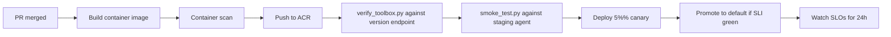

# Production Scale Considerations

This document covers what changes when you take this demo from a single-region single-tenant proof of concept to a multi-region multi-tenant production deployment. It is not an exhaustive operations guide — it is a checklist of decisions you must make explicitly.

Sources:

- Hosted Agents concept (limits, sessions, regions, network): https://learn.microsoft.com/en-us/azure/foundry/agents/concepts/hosted-agents
- Toolbox how-to (regions, network isolation): https://learn.microsoft.com/en-us/azure/foundry/agents/how-to/tools/toolbox
- Foundry agent virtual networks: https://learn.microsoft.com/en-us/azure/foundry/agents/how-to/virtual-networks
- Agent identity concepts: https://learn.microsoft.com/en-us/azure/foundry/agents/concepts/agent-identity

## 1. Capacity and Quotas

| Item | Preview limit (verify current) | Production planning |
| --- | --- | --- |
| Concurrent active sessions | 50 per subscription per region (preview); quota requestable | Spread across regions if you need more; design caller routing accordingly. |
| Session lifetime | Up to 30 days; idle timeout 15 minutes | Long-lived assistant scenarios benefit; bursty batch scenarios pay cold-start. |
| Sandbox sizes | 0.25 vCPU / 0.5 GiB to 2 vCPU / 4 GiB | Right-size per agent; oversized sandboxes inflate cost without latency benefit. |
| Toolbox versions | Immutable snapshots; soft cap depends on plan | Garbage-collect old versions; keep `default_version` plus 2-3 staged versions. |

Confirm current numbers in the Hosted Agents docs; preview numbers shift.

## 2. Cold Start, Warm Sessions, Pre-Warm

The Hosted Agents docs describe the session model: per-session VM-isolated sandboxes, deprovisioned after 15 minutes idle, resumed with persisted `$HOME` and `/files`. Implications:

- **Steady-state warm path**: 0 ms cold-start cost.
- **First call after idle**: cold-start cost (typically seconds).
- **Per-tenant isolation**: each tenant should map to a session ID so state doesn't bleed.

Production pre-warm patterns:

- **Pre-warm on user signal**: when the UI knows a user opened the app, send a no-op planning request to warm the session.
- **Heartbeat scheduler**: for high-priority tenants, send a synthetic request every 14 minutes.
- **Bias toward sticky routing**: caller routes a tenant's traffic to the same session whenever possible.

## 3. Multi-Region

| Concern | Choice |
| --- | --- |
| Foundry project region | Pick a region that supports all required tool types (Toolbox docs region matrix). |
| Hosted Agents region availability | Currently 18 regions (East US 2, North Central US, Sweden Central, Canada Central, etc.); verify current list. |
| Tool type by region | Web Search, Code Interpreter, AI Search, File Search availability is per-region. |
| Caller routing | Route caller to the closest region's agent endpoint; one Foundry project per region. |
| Failover | Active-active across regions with caller-side failover, or active-passive with explicit cutover. |

A common topology: one Foundry project per region, one Toolbox per project (replicated definition), DNS geo-routing in front of the agent endpoints.

## 4. Network Isolation

The Toolbox docs publish a network-isolation matrix:

| Tool type | Network-isolated support | Traffic path |
| --- | --- | --- |
| MCP (custom) | Yes | Through your VNet subnet |
| Azure AI Search | Yes | Through private endpoint |
| Code Interpreter | Yes | Microsoft backbone |
| Web Search (Bing grounding) | Yes | Public endpoint (Bing is a First-Party Consumption Service) |
| OpenAPI | Yes | Depends on target API |
| Agent-to-Agent | Yes | Through private endpoint |
| File Search | Not supported (preview) | N/A |

Production patterns:

- **Private link Foundry project**: enables network isolation for the agent control plane.
- **VNet-injected agent**: outbound traffic from the hosted agent uses your VNet, so it can reach private databases and internal APIs.
- **ACR remains public** today (per Hosted Agents docs); plan accordingly.

If your data residency or customer compliance posture forbids any public hop, audit each tool type against the matrix above before committing.

## 5. Identity and RBAC

Two identities matter:

| Identity | Source | Used for |
| --- | --- | --- |
| Agent's Microsoft Entra ID | Auto-issued at deploy time per agent | Runtime calls to model, tools, project connections, downstream Azure services. |
| Project managed identity | System-assigned per Foundry project | Platform infrastructure (e.g., ACR repo reader). |

Rules:

- Grant `Azure AI User` on the Foundry project to the agent identity (`azd deploy` does this automatically).
- For external resources (Storage, Cosmos, KeyVault), assign RBAC manually to the agent identity, principle of least privilege.
- For OBO (on-behalf-of) flows from M365 Teams, the agent identity exchanges the user token; tenant policies apply.
- Never store agent secrets in environment variables. Use Foundry connections, managed identity, and Key Vault.

## 6. Multi-Tenant Isolation

Pattern A: **One agent per tenant** — strongest isolation, highest cost. Each tenant has its own agent identity, audit trail, RBAC.

Pattern B: **One agent, session per tenant** — sessions are isolated by the platform (`$HOME`, `/files` per session). The agent code must apply tenant context everywhere it makes outbound calls.

Pattern C: **One agent, conversation per tenant, single session pool** — share sessions across tenants (do not — leaks state).

Recommendation: start with Pattern B for cost efficiency; move to Pattern A only when you have customer compliance commitments that require it.

## 7. Toolbox Version Strategy

Promoting a `default_version` flips behavior for all consumers atomically. Production patterns:

| Stage | What you do |
| --- | --- |
| Develop | Create a new toolbox version. |
| Test | Hit the version-specific MCP endpoint with `verify_toolbox.py` and a smoke test. |
| Canary | Run a fraction of traffic through an agent that pins the new version's endpoint explicitly. |
| Promote | Update `default_version`. |
| Roll back | Update `default_version` back to the prior id. |
| Garbage collect | After 30 days, delete unused versions. |

Two pitfalls:

- **Schema drift**: a new version that removes a tool will silently change agent behavior. Add automated tests against the consumer endpoint after every promotion.
- **Approval gating drift**: changing `require_approval` from `never` to `always` will surface approval dialogs the user did not see before. Communicate the change in release notes.

## 8. Deployment Pipeline

A minimum production pipeline:

Use `azd extension install azure.ai.agents` plus `azd provision` and `azd deploy` for the platform integration; wrap with your CI/CD.

## 9. Observability and SLOs

Built-in: OpenTelemetry traces auto-emitted to the linked Application Insights. Suggested SLIs and starting SLOs:

| SLI | Target |
| --- | --- |
| `/responses` p95 latency, warm | < 2 s for code-only, < 5 s for web search |
| `/responses` p99 latency, warm | < 5 s for code-only, < 10 s for web search |
| `/responses` error rate | < 1% over 5 minutes |
| Cold-start frequency | < 5% of requests in steady state |
| Toolbox `tools/call` failure rate | < 0.5% per tool over 1 hour |

These are starting points; calibrate to your traffic profile.

## 10. Cost

Cost categories:

- **Hosted runtime**: CPU/memory while sessions are active (deprovisioned after idle). The smaller the sandbox, the cheaper.
- **Model inference**: per-token, dominated by your prompt and completion sizes. Optimize system prompt length and tool schema verbosity.
- **Bing grounding**: per-search billing for web_search; consider caching.
- **AI Search / vector store**: per-query and per-storage billing.
- **ACR storage and egress**: container images and pull traffic.
- **App Insights**: ingestion-priced; sample if traces grow large.

Common optimizations:

- Trim the system prompt and tool schemas (every token in goes to every model call).
- Set `default_options={"store": False}` when the platform Responses runtime already manages history (this repo's `main.py`).
- Enable response streaming so the user perceives lower latency without paying for separate calls.

## 10A. Compliance and Model Availability

Production agent rollouts hit a less-discussed wall: which model is available depends on **region, contract entity, and vendor policy** — not just on the Foundry catalog. Plan for it explicitly.

### The three independent gates

| Gate | Determined by | Example failure mode |
| --- | --- | --- |
| Region | Where the Foundry project lives + Hosted Agents region availability | Agent works in East US 2, fails in your target APAC region until that region adds support. |
| Contract entity | Which legal entity signed the Azure agreement | A model that is GA may be unavailable under a specific country's procurement contract. |
| Vendor policy | Per-model vendor restrictions | A third-party model in the catalog may be blocked from being used in certain countries by the vendor's own terms. |

### Mitigations

- **Pin a single primary region per market**, with at least one fallback region that supports the same model deployments and tool types. Verify both at deploy time and quarterly.
- **Maintain a model fallback chain in code**, not just in config. If the primary model is unavailable, the agent degrades to a second model with a documented quality delta. Make the chain visible to ops, not silent.
- **Tag every Foundry connection with its contract entity**. When you stand up a new project, write a one-line note: "This project is under contract X, signed by entity Y, in region Z." Future you (or your successor) will thank you when a model gets pulled.
- **Treat model selection as a versioned decision**. Record which model handles which task, the date of the decision, and the fallback. When vendor terms change, you have a single map to audit.
- **Do not promise a vendor's model in customer commitments before checking availability under the customer's contract**. The Foundry catalog showing a model in your developer subscription does not guarantee the customer can call it.

### Concrete questions to answer before any production cut-over

| Question | Owner | Source of truth |
| --- | --- | --- |
| Which Foundry regions does this customer's contract enable? | Account team / procurement | Azure subscription metadata |
| Which models are GA today in those regions? | Engineering | Foundry model catalog per region |
| Are any of those models blocked by vendor terms in this country? | Legal | Vendor terms of use |
| Does Hosted Agents preview availability include those regions? | Engineering | Hosted Agents docs region matrix |
| Are network-isolation requirements compatible with the chosen tool types? | Security | Toolbox docs network-isolation matrix |
| Is there a documented fallback model + region pair for every primary choice? | Engineering | This repo's `docs/failure-modes.md` Layer 3 |

Answering these before any customer demo prevents the embarrassing "the model is in the catalog but I cannot call it" moment.

## 11. Security Posture Checklist

| Check | Why |
| --- | --- |
| No secrets in container image, env vars, or manifest | Use Foundry connections + managed identity. |
| RBAC scoped to least privilege | Limit blast radius. |
| All `require_approval` flags audited | Make sure every write tool requires approval. |
| Application Insights does not log sensitive tool args | Disable `enable_sensitive_data` in prod. |
| Network isolation enabled for private data | Private link + VNet injection per the matrix. |
| ACR pull restricted to project managed identity | No anonymous pulls. |
| Per-tool circuit breaker | Bound the impact of a misbehaving tool. |
| Public endpoint hardened (rate limit, WAF) | The endpoint is internet-facing. |

## 12. What This Document Is Not

- Not an SRE runbook. Build your own incident response playbook on top of this.
- Not a cost model. Run real traffic against the pricing meters in your subscription before quoting customer cost numbers.
- Not a substitute for your security team's review.

If you ship this to production, treat each section as a checklist and produce explicit answers for your environment.
