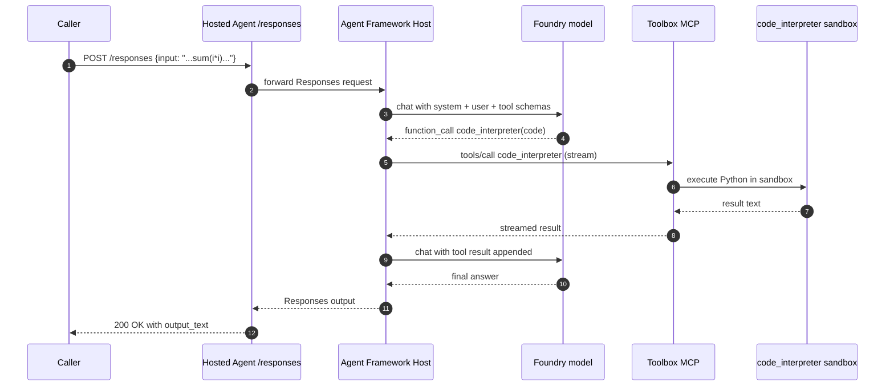
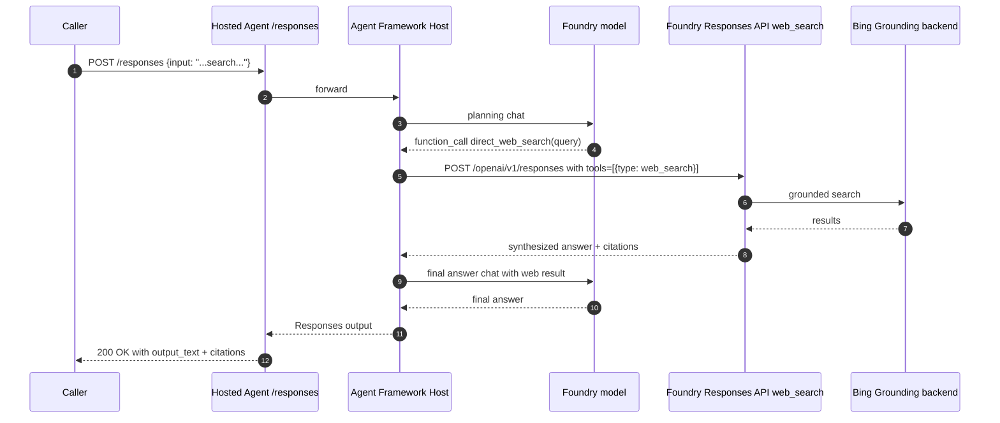

# 请求流程与延迟预算

本文走通一个 user 请求的完整路径，给出 latency budget。目的是让每一跳都可见，你才知道先优化哪里。

这些数字是 **示意预算，不是本 repo 的实测**。它们反映 Foundry 公开文档和类似 managed agent 平台报告的典型量级。承诺给客户前先用自己的部署测。

## 两个具体场景

复用 `scripts/smoke_test.py` 和 `scripts/http_smoke_test.py` 的 prompt：

- **Scenario A — Toolbox MCP 走 Code Interpreter**："Use code_interpreter to calculate sum(i*i for i in range(1, 6))."
- **Scenario B — Direct Web Search**："Use direct_web_search to search Microsoft Learn Azure AI Foundry Toolbox and summarize."

## Scenario A：Toolbox MCP Code Interpreter



### Token 预算（每轮）

| 组件 | 大约 token |
| --- | --- |
| System instructions | ~200 |
| Tool schemas（toolbox + direct_web_search） | ~300 |
| User input | ~30 |
| Model planning output（function call） | ~50 |
| Toolbox tool 结果 | ~30 |
| 最终给用户的回答 | ~80 |
| **总 round-trip token（in + out）** | **~700** |

### Latency 预算（示意）

| 跳 | 典型 | 主导因素 |
| --- | --- | --- |
| Caller → endpoint TLS + ingress | 20-40 ms | 网络 |
| Hosted Agent 冷启动（idle 后首请求） | 1-5 s | Container provisioning；warm 路径 = 0 |
| Endpoint → Host 进程 | <5 ms | 本地 |
| Host → Foundry model（planning） | 200-700 ms | Model inference + prompt 大小 |
| Host → Toolbox `tools/call` | 50-150 ms + sandbox 执行 | round-trip + Python 执行 |
| Code Interpreter sandbox warm | 50-300 ms | Sandbox 冷/热 |
| Host → Foundry model（最终回答） | 200-700 ms | Model inference |
| Endpoint → Caller | 20-40 ms | 网络 |
| **总 warm 路径** | **~600-1800 ms** | 两次 model call 主导 |
| **总 cold 路径** | **+1-5 s** | Container provisioning |

Model call 主导。Toolbox 跳加几十到低百 ms。冷启动是单一最大变量；缓解见下文。

## Scenario B：Direct Web Search via Responses API



### Latency 预算（示意）

| 跳 | 典型 |
| --- | --- |
| Caller → endpoint | 20-40 ms |
| 冷启动（如有） | 1-5 s（warm = 0） |
| Host → model planning | 200-700 ms |
| Host → `/openai/v1/responses` web_search | 1-3 s（Bing grounding 主导） |
| Host → model final | 200-700 ms |
| Endpoint → Caller | 20-40 ms |
| **总 warm 路径** | **~1.5-4.5 s** |

Web search 是瓶颈。两个降低感知延迟的方法：

- 流式输出最终答案给 caller，model 边生成边发。
- 重复 query 短 TTL 缓存。

## 优先优化哪里

## 本 Repo 的实测数字

下表是**实测**，不是预算。来自 2026-05-09 运行 `python scripts/measure_latency.py --iterations 3`，打本 repo 的 hosted agent（eastus2 Foundry project、gpt-4-1-mini deployment、未开流式、未预热）：

| 路径 | 迭代 | mean | p50 | p95 | max | min |
| --- | :-: | :-: | :-: | :-: | :-: | :-: |
| `code_interpreter` via Toolbox MCP | 3 | 8.9 s | 9.6 s | 10.8 s | 10.9 s | 6.3 s |
| `direct_web_search` via Responses API | 3 | 18.1 s | 16.4 s | 23.6 s | 24.4 s | 13.5 s |

复现：

```bash
python main.py                                        # Terminal 1
python scripts/measure_latency.py --iterations 5      # Terminal 2
```

Code 路径是预期模式：两次 model call（planning + final）加一次 toolbox round-trip，主导是 model inference。Web 路径被 Responses API 内部的 Bing grounding 主导（范围 13-24 s）；这个方差本身就是测量结果的一部分，不要抹平成平均值看。

这些数字绑定某个 region、某个 deployment、某个 workload。**不要当 SLA 报；客户承诺前重新跑。**

## 优先优化哪里

按影响排序：

1. **Streaming**。Caller 的 Responses 请求设 `stream=True`。第一个 token 在 200-500 ms 内到，即使总完成时间是数秒。
2. **Warm session**。每个活跃会话保留一个 warm session；Hosted Agents 15 分钟 idle timeout 让这个成本很低。
3. **避开 `prompts/list`**。给 MCP client 传 `load_prompts=False`。省一次 round-trip 和一次 500。
4. **Pin model deployment region**。跨 region model call 加几十到几百 ms。
5. **Model 支持 parallel function call 时批 tool call**。减少串行 round-trip。

## 这些数字不是什么

- 不是本 repo 实测。Repo 的 smoke test 打印成功结果，但没严格测延迟。
- 不是 SLA。Foundry preview feature 没有 SLA。
- 不在 region 和 model 之间通用。更大的 model、更长的 prompt、更远的 region 都会移这些数字。

如果客户承诺需要真实数字，跑 `scripts/http_smoke_test.py` 对你的部署 + 加 timing instrumentation；不要把本文当 measurement 引用。

## 关联阅读

- [why-this-architecture-CN.md](why-this-architecture-CN.md)：每跳为什么存在。
- [architecture-tradeoffs-CN.md](architecture-tradeoffs-CN.md)：每跳的代价。
- [mcp-protocol-deep-dive-CN.md](mcp-protocol-deep-dive-CN.md)：MCP wire 级细节。
- [failure-modes-CN.md](failure-modes-CN.md)：某跳失败时的处理。
