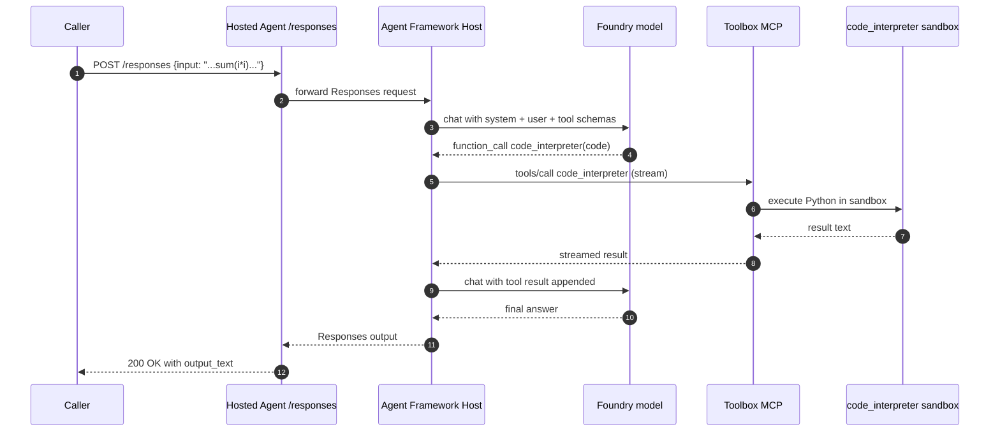
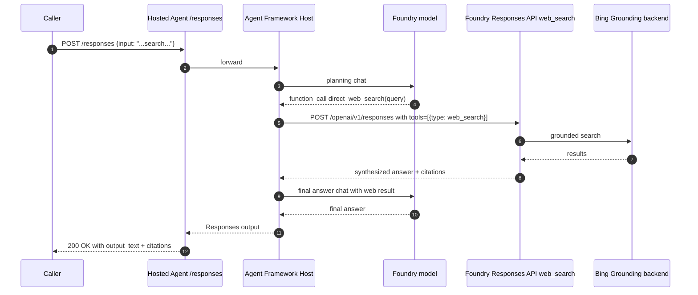

# Request Flow With Latency Budget

This document walks one user request all the way through the system, with a worked latency budget. The point is to make every hop visible so you know which one to optimize first.

These numbers are **illustrative budgets**, not measurements from this repo. They reflect typical orders of magnitude reported in public Foundry documentation and similar managed agent platforms. Always measure your own deployment before committing to numbers in customer conversations.

## Two Concrete Scenarios

We use the same prompt the in-process smoke test (`scripts/smoke_test.py`) and HTTP smoke test (`scripts/http_smoke_test.py`) exercise.

- **Scenario A — Code Interpreter via Toolbox MCP**: "Use code_interpreter to calculate sum(i*i for i in range(1, 6))."
- **Scenario B — Direct Web Search**: "Use direct_web_search to search Microsoft Learn Azure AI Foundry Toolbox and summarize."

## Scenario A: Code Interpreter via Toolbox MCP



### Token budget per round

| Component | Approx tokens |
| --- | --- |
| System instructions | ~200 |
| Tool schemas (toolbox + direct_web_search) | ~300 |
| User input | ~30 |
| Model planning output (function call) | ~50 |
| Toolbox tool result | ~30 |
| Final user-facing answer | ~80 |
| **Total round-trip tokens (in + out)** | **~700** |

### Latency budget (illustrative)

| Hop | Typical | Dominant factor |
| --- | --- | --- |
| Caller → endpoint TLS + ingress | 20-40 ms | Network |
| Hosted Agent cold start (first request after idle) | 1-5 s | Container provisioning; warm path = 0 ms |
| Endpoint → Host process | <5 ms | Local |
| Host → Foundry model (planning call) | 200-700 ms | Model inference, prompt size |
| Host → Toolbox `tools/call` | 50-150 ms + sandbox runtime | Round-trip + Python eval |
| Code Interpreter sandbox warm | 50-300 ms | Sandbox cold/warm |
| Host → Foundry model (final answer call) | 200-700 ms | Model inference |
| Endpoint → Caller response | 20-40 ms | Network |
| **Total warm path** | **~600-1800 ms** | Two model calls dominate |
| **Total cold path** | **+1-5 s** | Container provisioning |

The model calls dominate. The toolbox hop adds tens to low hundreds of ms. The cold-start cost is the single biggest variable; mitigations are listed below.

## Scenario B: Direct Web Search via Responses API



### Latency budget (illustrative)

| Hop | Typical |
| --- | --- |
| Caller → endpoint | 20-40 ms |
| Cold start (if any) | 1-5 s (warm = 0) |
| Host → model planning | 200-700 ms |
| Host → `/openai/v1/responses` web_search | 1-3 s (Bing grounding dominates) |
| Host → model final | 200-700 ms |
| Endpoint → Caller | 20-40 ms |
| **Total warm path** | **~1.5-4.5 s** |

Web search is the bottleneck. Two ways to reduce perceived latency:

- Stream the final answer to the caller while the model generates.
- Cache search results for repeat queries with short TTL.

## Where to Optimize First

## Measured Results From This Repo

The table below is **measured**, not budgeted. It comes from running `python scripts/measure_latency.py --iterations 3` against this repo's hosted agent on 2026-05-09 (eastus2 Foundry project, gpt-4-1-mini deployment, no streaming, no warm-up):

| Path | iterations | mean | p50 | p95 | max | min |
| --- | :-: | :-: | :-: | :-: | :-: | :-: |
| `code_interpreter` via Toolbox MCP | 3 | 8.9 s | 9.6 s | 10.8 s | 10.9 s | 6.3 s |
| `direct_web_search` via Responses API | 3 | 18.1 s | 16.4 s | 23.6 s | 24.4 s | 13.5 s |

Reproduce with:

```bash
python main.py                                        # Terminal 1
python scripts/measure_latency.py --iterations 5      # Terminal 2
```

The code path shows the expected pattern: two model calls (planning + final) plus one toolbox round-trip, dominated by model inference. The web path is dominated by Bing grounding inside the Responses API (it ranges 13-24 s; treat the variance as part of the measurement, not as noise to smooth away).

These numbers are tied to one region, one deployment, and one workload. **Do not quote them as SLAs; rerun against your own deployment before customer commitments.**

## Where to Optimize First

Order by impact:

1. **Streaming**. Set `stream=True` on the Responses request from the caller. First token arrives in 200-500 ms even when total completion is multi-second.
2. **Warm sessions**. Keep one warm session per active conversation; the Hosted Agents 15-minute idle timeout makes this cheap.
3. **Avoid `prompts/list`**. Pass `load_prompts=False` to the MCP client. Saves one round-trip and a 500.
4. **Pin the model deployment region**. Cross-region model calls add tens to hundreds of ms.
5. **Batch tool calls when the model supports parallel function calls**. Reduces serialized round-trips.

## What These Numbers Are Not

- Not measurements from this repo. The repo's smoke tests print successful results but do not measure latency rigorously.
- Not SLAs. Foundry preview features have no SLA.
- Not transferable across regions or models. Larger models, longer prompts, and farther regions all shift the numbers.

If you need real numbers for a customer commitment, run `scripts/http_smoke_test.py` against your deployment and add timing instrumentation; do not quote this document as a measurement.

## Related Reading

- [why-this-architecture.md](why-this-architecture.md) for *why* the hops exist.
- [architecture-tradeoffs.md](architecture-tradeoffs.md) for *what you trade* by adding them.
- [mcp-protocol-deep-dive.md](mcp-protocol-deep-dive.md) for the MCP wire-level detail.
- [failure-modes.md](failure-modes.md) for what happens when a hop fails.
