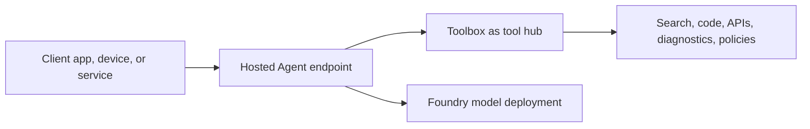
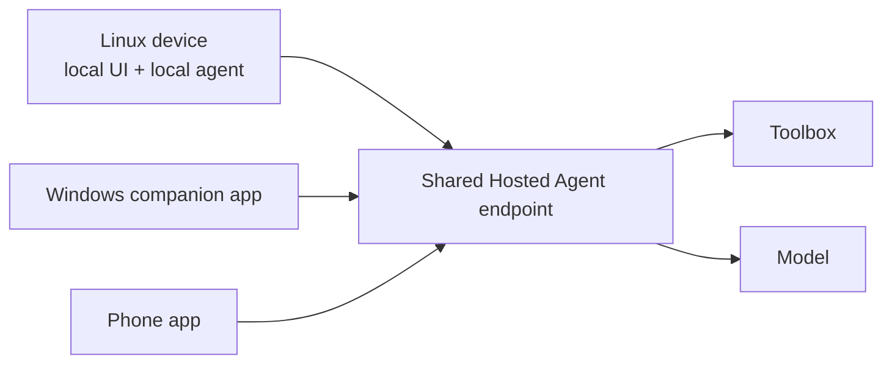

# Scenario Mapping

This document keeps the public repo customer-neutral while making the architecture easier to map to real solution discussions.

## Core Pattern

The key idea: keep the client simple. The client calls one agent endpoint. The agent decides which model and tool path to use.

## AI Native Device

| Need | How this repo maps |
| --- | --- |
| Device or app needs a cloud-side agent fallback | Hosted Agent exposes one Responses endpoint. |
| Local runtime should not own every cloud API integration | Toolbox hides tool packaging and auth details. |
| Cloud tools evolve faster than device firmware | Toolbox default version can move while the client contract stays stable. |
| Current external facts are needed | `direct_web_search` provides a documented web grounding path. |
| Sensitive local actions need governance | Model device actions as explicit tools with approval, policy, and audit boundaries. |

Example extension tools:

- `device_diagnostics`: inspect device state submitted by the app.
- `support_article_search`: search a curated knowledge base.
- `policy_check`: decide whether an action is allowed.
- `handoff_ticket`: create a support ticket with structured context.

## Gaming Cloud

| Need | How this repo maps |
| --- | --- |
| Player support agent or game operations assistant | Hosted Agent becomes the cloud-side orchestration endpoint. |
| Game services should remain behind controlled APIs | Toolbox wraps telemetry, entitlement, inventory, and support APIs. |
| Operators need quick analysis | `code_interpreter` can analyze small exported datasets or metrics. |
| Public facts or docs are needed | `direct_web_search` can retrieve public docs and release notes. |

Example extension tools:

- `match_telemetry_lookup`: retrieve recent match metrics.
- `entitlement_check`: confirm player purchase or subscription state.
- `incident_summary`: summarize game service incident data.
- `knowledge_search`: retrieve support articles or known issue notes.

## Enterprise Assistant

| Need | How this repo maps |
| --- | --- |
| One agent endpoint for an enterprise workflow | Hosted Agent provides the API contract. |
| Many internal tools should not all be exposed in prompt context | Toolbox bundles and selects tools through MCP. |
| Auth and consent need boundaries | Tool connections and OAuth flows sit behind the tool layer. |
| Business users need traceable actions | Each tool call can be logged, approved, and audited. |

## Dual-Frontend Pattern (Linux Device + Windows Companion App)

A common shape for AI native devices: the device runs Linux with a primary local agent runtime, and the user's PC or phone runs a companion app that needs the same agent capabilities. Both should share one cloud-side hosted agent and one user state.

Key principles:

- **One hosted agent per user, not per device**. The agent's per-session sandbox keeps `$HOME` and `/files` consistent across all client surfaces; users see continuity, not three disconnected copies.
- **Capability split by device class, not by codebase**. The Windows companion app may want to invoke skills (e.g., "generate a slide deck about my last week") that the device cannot do well; the Windows app reaches them through the same hosted agent. Toolbox tools that are Windows-shell-specific (Office, system settings) get added as Windows-side custom MCP tools registered into the same toolbox.
- **Per-platform tool affinity is policy, not architecture**. The agent can read the caller's `User-Agent` or a custom header to bias toward platform-appropriate tools, but the catalog is one.
- **Identity is the user, not the device**. Use the user's Microsoft Entra identity (or your IdP) to authenticate to the hosted agent endpoint; the agent's per-agent identity then calls the toolbox.

When this fits: AI native PC + companion mobile app, set-top box + remote control phone app, in-vehicle compute + driver phone, gaming console + spectator phone.

## What This Repo Is Not

- It is not an on-device local runtime.
- It is not a final game assistant or support agent.
- It is not a benchmark comparing Hosted Agents with other agent stacks.
- It is not a production security reference by itself.

It is a working skeleton for the host-agent plus tool-catalog pattern.