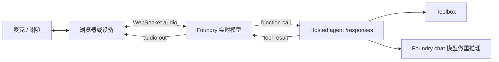
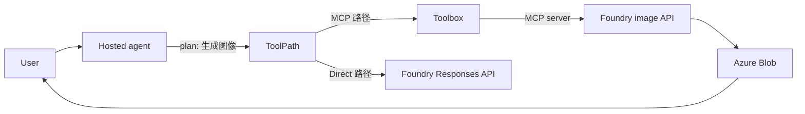

# 语音与多模态模式

本文覆盖如何把 voice、image generation、multimodal 模型接入 hosted-agent + toolbox 形态。Repo 的 smoke test 只跑文本路径；生产场景越来越多需要语音（实时和批处理）和图像生成。架构形态不变 —— 只是模型和 tool 选型变。

如果只记一句话：

> **Voice 和 image 只是额外的 tool 和额外的 model deployment**。Hosted agent endpoint、toolbox catalog、per-agent identity 都不变。

参考来源：

- Foundry model catalog（real-time、image、transcription）: https://learn.microsoft.com/en-us/azure/foundry/openai/concepts/models
- Web Search tool（citation 中的 image 引用）: https://learn.microsoft.com/en-us/azure/foundry/openai/how-to/web-search
- Toolbox how-to（tool 参数 schema）: https://learn.microsoft.com/en-us/azure/foundry/agents/how-to/tools/toolbox

## 1. 三个多模态表面

| 表面 | 做什么 | 在哪 |
| --- | --- | --- |
| **实时语音**（`gpt-realtime`、`gpt-realtime-translate`） | 双向音频 in/out，亚秒延迟，audio stream 上的 function calling | 直接 WebSocket 到 Foundry；当前不经 Toolbox MCP |
| **批转写**（`whisper`） | 音频文件 in，文本 out | 直接 REST；可包成 custom tool |
| **图像生成**（`gpt-image-1`、`gpt-image-2`） | Prompt in，图片 out（或图片编辑） | 直接 REST 或 Responses API；可包成 custom tool |
| **图像理解**（vision chat 模型） | 图片 in，文本 out | 标准 chat / Responses API 带 image content part |

架构模式：**每个表面包成 tool**，就像本 repo 的 `direct_web_search`。Agent 内部保持文本优先；多媒体通过 tool 边界进出。

## 2. 模式 A：实时语音 Agent

对真正语音优先的 agent（如游戏 session 的 player support、kiosk、车载助手），hosted agent 本身不承载音频回路。音频回路在 caller（浏览器、原生 app、设备）跑；hosted agent 负责 **planning、tool routing、policy** —— 处理实时模型决定要做什么。



为什么这样分：

- 实时模型 own 音频回路；亚秒延迟要求 WebSocket 直连。
- Hosted agent own governance —— 实时模型发出 function call 时，调用走 hosted agent 的 identity、RBAC、approval gate、toolbox。
- Chat 模型处理长推理，实时模型干这个会过付。

适用：语音助手、点餐 kiosk、游戏内语音陪玩、免手工业场景。

## 3. 模式 B：批转写

设备离线录音、之后上传，转写是纯云步骤。包成 custom MCP tool 装进 toolbox，agent 用同一个接口调：

| 步 | 动作 |
| --- | --- |
| 1 | 设备上传音频到 Azure Blob 拿 SAS URL。 |
| 2 | Agent 调 custom MCP tool `transcribe_audio` 带 `{audio_uri}`。 |
| 3 | MCP server 拉音频、调 Foundry whisper、返回文本。 |
| 4 | Agent 把文本当普通 tool 结果处理。 |

为什么走 custom MCP tool 而不是直接 REST：toolbox 强制对转写步骤施加 auth、audit、rate limit、approval gating，和其他 tool 一样。Agent 代码不需要 per-API client。

适用：会议总结、语音邮件处理、call-center 后处理。

## 4. 模式 C：图像生成作为 Tool

Image generation 是文本之后最常见的需求。两种接法。

**作为 custom MCP tool**（推荐做 catalog 复用）：把 Foundry image API 包成小 MCP server，注册到 toolbox。Agent 通过 `tools/call` 调，和其他 tool 一样。结果是 image URL + metadata。

**作为 agent 内部的直接 Responses-API tool**（和本 repo 的 `direct_web_search` 同形态）：在 `main.py` 里 `direct_web_search` 旁边加第二个 `@tool` 函数 `direct_image_generate`。当你希望 agent 进程 own 这次调用、toolbox catalog 不合适放它时用。

无论哪种方式，agent planner 看到的就是一个 tool："给定 prompt 生成图像"。模型处理 prompt 工程；tool 返回 artifact。



适用：营销文案 + 图像、PPT 生成、设计探索、产品可视化。

## 5. 模式 D：PPT 生成（组合）

企业常问"生成一个关于 X 的 PPT"。这是个组合：

- 一个规划步（text 模型）—— 大纲、张数、要点。
- N 次 image generation 调用 —— 每张需要图的 slide 一次。
- 一个文档组装步 —— 通过 custom MCP tool 把大纲 + 图组合成 `.pptx`。

Agent 负责编排；每步是一次 tool 调用。Toolbox 装：

- Image generation tool（custom MCP）。
- Slide-assembly tool（custom MCP 包 `python-pptx` 之类）。
- 可选 knowledge-base 查询（`azure_ai_search`）把内容 grounded 到私有数据。

适用：销售赋能、培训材料、状态报告。

## 6. 模式 E：多模态输入

用户上传图片时（如 "我的设备坏了，看这张照片"），agent 把图片作为 message 一部分传给 vision chat 模型：

```python
messages = [
    {"role": "user", "content": [
        {"type": "text", "text": "诊断照片里的问题。"},
        {"type": "image_url", "image_url": {"url": "https://blob/.../photo.jpg"}}
    ]}
]
```

不需要新 tool；这只是更丰富的 message 形态。图片上传到 Foundry session `/files`（Hosted Agents docs）或 Azure Blob；URL 引用。

适用：support agent、现场服务、辅助功能助手。

## 7. 每个多模态 tool 应该放哪

| 表面 | Toolbox MCP？ | Direct Responses tool？ | Caller 直 WebSocket？ |
| --- | :---: | :---: | :---: |
| 实时语音 | 否（当前） | 否 | 是 |
| Whisper 转写 | 是（推荐） | 可选 | 否 |
| 图像生成 | 是（推荐） | 可选 fallback | 否 |
| 图像理解 | N/A —— 它是模型能力，不是 tool | N/A | 否 |

建议：非实时多模态能力放 toolbox；实时音频当作 caller 管理的 out-of-band 回路，回调 hosted agent 做 governance + tool。

## 8. 延迟说明

| 表面 | 典型增加延迟 |
| --- | --- |
| 实时语音 | 亚秒回路；hosted agent 必须在 ~500 ms 内响应 function call，否则模型会用填充词补 gap |
| Whisper | ~1 s / 30 s 音频；分块流式 |
| Image gen（1 张） | 5-30 s，按模型和尺寸 |
| Image understanding | 给 chat call 加 ~500 ms-2 s，按图片尺寸 |

实时语音场景下，hosted agent 的 tool 调用要快、或者通过音频回路流式返回部分结果。

## 9. 映射到本 Repo

`main.py` 已经展示了加非-Toolbox tool 的模式：`build_direct_web_search_tool` 定义了一个 `@tool` 函数 POST 到 `/openai/v1/responses`。要加 image generation 作直接 tool，复制该函数、改 body 到 image generation endpoint、追加到 agent 的 `tools=[...]`。Hosted agent endpoint、toolbox 连接、smoke test 都不变。

要加转写 / 图像 / slide 组装的 custom MCP tool，跑一个暴露正确 `tools/list` schema 的小 MCP server，然后用 `MCPTool(server_label=..., server_url=..., project_connection_id=...)` 注册到 toolbox。重跑 `python scripts/create_toolbox.py`，新 tool 出现在 `verify_toolbox.py` 输出里、agent 可以调。

## 10. 这份文档不是什么

- 不是模型选型指南。Pricing、region 可用性、质量都因场景而异；按场景测后再选。
- 不是实时语音教程。WebSocket 协议细节属于 Foundry real-time 文档。
- 不是 UI 指南。Caller 怎么渲染音频波形或生成图像在 agent 边界外。
