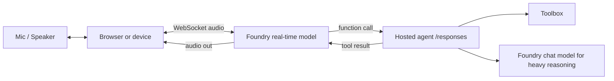
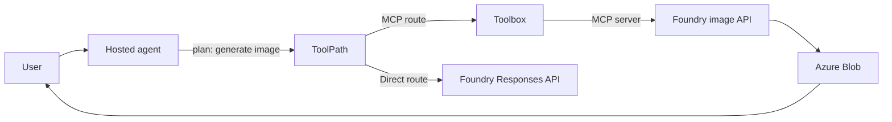

# Voice and Multimodal Patterns

This document covers how to plug voice, image generation, and multimodal models into the hosted-agent + toolbox shape. The repo's smoke test exercises text-only paths; production scenarios increasingly need voice (real-time and batch) and image generation. The architectural shape does not change — only the model and tool selection do.

If you only remember one sentence:

> **Voice and image are just additional tools and additional model deployments. The hosted agent endpoint, the toolbox catalog, and the per-agent identity all stay the same.**

Sources:

- Foundry model catalog (real-time, image, transcription): https://learn.microsoft.com/en-us/azure/foundry/openai/concepts/models
- Web Search tool (image references in citations): https://learn.microsoft.com/en-us/azure/foundry/openai/how-to/web-search
- Toolbox how-to (tool argument schemas): https://learn.microsoft.com/en-us/azure/foundry/agents/how-to/tools/toolbox

## 1. The Three Multimodal Surfaces

| Surface | What it does | Where it sits |
| --- | --- | --- |
| **Real-time voice** (`gpt-realtime`, `gpt-realtime-translate`) | Bidirectional audio in / audio out, sub-second latency, function calling on the audio stream | Direct WebSocket to Foundry; not via Toolbox MCP today |
| **Batch transcription** (`whisper`) | Audio file in, text out | Direct REST call; can be wrapped as a custom tool |
| **Image generation** (`gpt-image-1`, `gpt-image-2`) | Prompt in, image out (or image edit) | Direct REST or Responses API; can be wrapped as a custom tool |
| **Image understanding** (vision-capable chat models) | Image in, text out | Standard chat / Responses API with image content parts |

The architectural pattern: **wrap each surface as a tool**, just like `direct_web_search` in this repo. The agent stays text-first internally; multimedia enters and exits through tool boundaries.

## 2. Pattern A: Real-time Voice Agent

For a true voice-first agent (e.g., a player-support agent for a gaming session, a kiosk, an in-vehicle assistant), the hosted agent itself does not host the audio loop. The audio loop runs in the caller (browser, native app, device); the hosted agent handles **planning, tool routing, and policy** for what the voice model decides to do.



Why split this way:

- The real-time model owns the audio loop; sub-second latency requires WebSocket-direct.
- The hosted agent owns governance — when the real-time model emits a function call, the call goes through the hosted agent's identity, RBAC, approval gates, and the toolbox.
- The chat model handles long-form reasoning that the real-time model would over-pay for.

When this fits: spoken assistants, drive-thru kiosks, in-game voice companions, hands-free industrial scenarios.

## 3. Pattern B: Batch Voice Transcription

If the device captures audio offline and uploads later, transcription is a pure cloud step. Wrap it as a custom MCP tool inside a toolbox so the agent can call it through the same interface as everything else:

| Step | Action |
| --- | --- |
| 1 | Device uploads audio to Azure Blob with SAS URL. |
| 2 | Agent calls a custom MCP tool `transcribe_audio` with `{audio_uri}`. |
| 3 | The MCP server fetches audio, calls Foundry whisper, returns text. |
| 4 | Agent treats the text like any other tool result. |

Why through a custom MCP tool, not direct REST: the toolbox enforces auth, audit, rate limits, and approval gating on the transcription step the same way it does on every other tool. The agent code does not need a per-API client.

When this fits: meeting summaries, voicemail processing, call-center post-processing.

## 4. Pattern C: Image Generation as a Tool

Image generation is the most common ask after text. Two ways to wire it.

**As a custom MCP tool** (recommended for catalog reuse): wrap the Foundry image API in a small MCP server, register it in the toolbox. The agent calls it through `tools/call` like any other tool. The result is an image URL plus metadata.

**As a direct Responses-API tool inside the agent** (the same shape as `direct_web_search` in this repo): add a second `@tool` function `direct_image_generate` next to `direct_web_search` in `main.py`. Use it when you want the agent's process to own the call and the toolbox catalog is not the right place.

Either way, the agent's planner sees one tool: "generate an image given a prompt". The model handles the prompt engineering; the tool returns the artifact.



When this fits: marketing copy + image, slide generation, design exploration, product visualization.

## 5. Pattern D: Slide Generation (Composite)

A frequent enterprise ask is "generate a slide deck about X". This is a composite that combines:

- A planning step (text model) — outline, slide count, talking points.
- N image generation calls — one per slide that needs a visual.
- A document assembly step — composes outline + images into a `.pptx` via a custom MCP tool.

The agent owns the orchestration; each step is a tool call. The toolbox carries:

- The image generation tool (custom MCP).
- The slide-assembly tool (custom MCP wrapping `python-pptx` or similar).
- An optional knowledge-base lookup (`azure_ai_search`) to ground content in private data.

When this fits: sales enablement, training material, status reports.

## 6. Pattern E: Multimodal Input

When the user uploads an image (e.g., "what is broken in this photo of my device?"), the agent passes the image to a vision-capable chat model as part of the message:

```python
messages = [
    {"role": "user", "content": [
        {"type": "text", "text": "Diagnose the issue in this photo."},
        {"type": "image_url", "image_url": {"url": "https://blob/.../photo.jpg"}}
    ]}
]
```

No new tool needed; this is just a richer message shape. The image is uploaded to Foundry session `/files` (Hosted Agents docs) or to Azure Blob; the URL is referenced.

When this fits: support agents, field service, accessibility helpers.

## 7. Where Each Multimodal Tool Should Live

| Surface | Toolbox MCP? | Direct Responses tool? | Direct WebSocket from caller? |
| --- | :---: | :---: | :---: |
| Real-time voice | No (today) | No | Yes |
| Whisper transcription | Yes (recommended) | Optional | No |
| Image generation | Yes (recommended) | Optional fallback | No |
| Image understanding | N/A — it's a model capability, not a tool | N/A | No |

Recommendation: put non-real-time multimodal capabilities in the toolbox, treat real-time audio as an out-of-band caller-managed loop that calls back into the hosted agent for governance and tools.

## 8. Latency Notes

| Surface | Typical latency added |
| --- | --- |
| Real-time voice | Sub-second loop; the hosted agent must respond to function calls within ~500 ms or the model fills the gap with filler |
| Whisper | ~1 s per 30 s of audio; chunk for streaming |
| Image gen (1 image) | 5-30 s depending on model and size |
| Image understanding | Adds ~500 ms-2 s to a chat call depending on image size |

For real-time voice, keep the hosted agent's tool calls fast or stream partial results back through the audio loop.

## 9. Mapping to This Repo

`main.py` already shows the pattern for adding a non-Toolbox tool: `build_direct_web_search_tool` defines a `@tool` function that posts to `/openai/v1/responses`. To add image generation as a direct tool, copy that function, change the body to the image generation endpoint, and append it to the agent's `tools=[...]` list. The hosted agent endpoint, the toolbox connection, and the smoke-test machinery all stay unchanged.

To add a custom MCP tool for transcription, image, or slide assembly, run a small MCP server that exposes the right `tools/list` schema, then register it in the toolbox with `MCPTool(server_label=..., server_url=..., project_connection_id=...)`. After `python scripts/create_toolbox.py` re-runs, the new tool appears in `verify_toolbox.py` output and the agent can call it.

## 10. What This Document Is Not

- Not a model selection guide. Pricing, region availability, and quality vary; pick per scenario after testing.
- Not a real-time voice tutorial. The WebSocket protocol details belong in the Foundry real-time docs.
- Not a UI guide. How the caller renders audio waveforms or generated images is outside the agent boundary.
