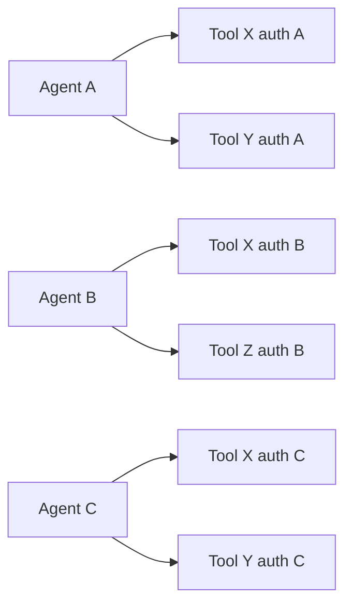
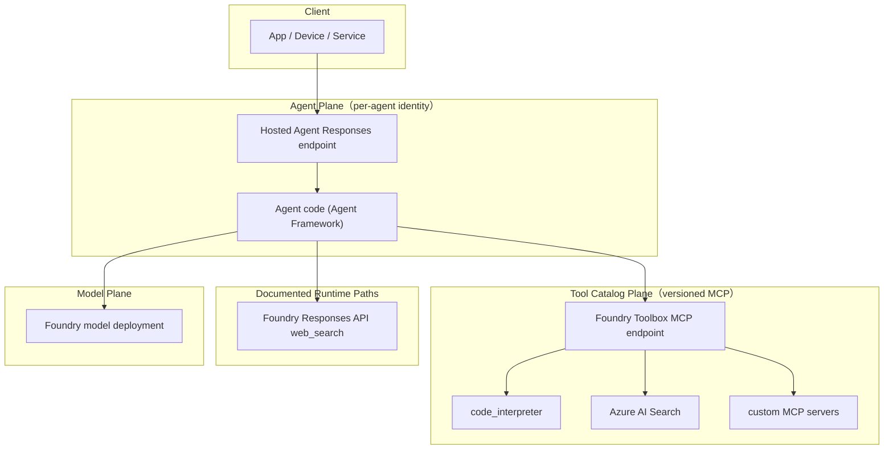

# 设计源起：为什么是这个架构（第一性原理）

这份文档不是从产品宣传出发，而是从客户约束出发，推导为什么"hosted agent endpoint + 受管 tool catalog"是现代企业 agent 系统的自然形态。

如果只能记一句话：

> Hosted agent 和 toolbox 拆开是因为 **agent 代码和 tool 清单的生命周期、所有权、治理要求都不同**。把它们绑在一起就会出现 tool sprawl、credential duplication、能力演进卡死。

参考来源：

- Toolbox how-to: https://learn.microsoft.com/en-us/azure/foundry/agents/how-to/tools/toolbox
- Hosted Agents concept: https://learn.microsoft.com/en-us/azure/foundry/agents/concepts/hosted-agents
- Toolbox blog: https://devblogs.microsoft.com/foundry/introducing-toolboxes-in-foundry/
- Hosted Agents blog: https://devblogs.microsoft.com/foundry/introducing-the-new-hosted-agents-in-foundry-agent-service-secure-scalable-compute-built-for-agents/

## 1. 客户的真实痛点

Toolbox 官方博客描述的场景几乎每个企业都遇到：

> "一个 agent 依赖 5 个 tool。5 种不同的 tool type（API、MCP server、skill、connector、flow）。5 种不同的认证方式。5 个不同的 owning team... 团队各自重复实现同样的 tool。Credential 被复制。Governance 不一致甚至缺失。"
>
> — Microsoft Foundry blog, *Introducing Toolboxes in Foundry*

抽象成约束：

| 约束 | 在生产中的含义 |
| --- | --- |
| C1：Tool catalog 演进比 agent 代码快 | 新 tool 一周一批；agent container 一月一发。 |
| C2：每个 tool 有自己的 auth model | OAuth、managed identity、API key、Entra OBO、project connections。 |
| C3：每个 tool 由不同团队 own | Agent team 没法 own 所有后端的 credential。 |
| C4：Governance 要在 runtime 强制 | Approval、audit、RBAC 必须无关哪个 agent 调用都生效。 |
| C5：Agent 来自不同 framework | Microsoft Agent Framework、LangGraph、Semantic Kernel、custom code、Copilot SDK。 |
| C6：Tool 变更不能破坏已部署 agent | 改 tool 的 auth 或 version 不能触发 N 个 agent 重新部署。 |

## 2. 朴素架构为什么不行

最简单的设计是"agent 代码直接嵌入每个 tool 的集成"：

失败模式：

- **N×M wiring 爆炸**：每个 agent 重复实现每个 tool client。
- **Credential 重复**：每个 agent 各存一份 OAuth token、API key、connection string。
- **Drift**：tool 改 API → 所有 agent 都要重新部署。
- **没有中心 governance**：approval / audit 要么在每个 agent 里要么没有。
- **能力演进卡死**：加新 tool 等于 N 个 agent PR，不是一次配置变更。

API 层面用 API gateway 解决过；网络层面用 service mesh 解决过。问题是 **agent 系统该怎么拆**。

## 3. 两个生命周期

Agent 系统有两种明显不同的生命周期：

| 关注点 | 生命周期 | 所有者 | 变更频率 |
| --- | --- | --- | --- |
| Agent runtime：prompt 策略、planner、响应整形、业务逻辑 | 慢，手写代码，有测试 | Agent / app team | 周-月 |
| Tool 清单：有什么 tool、谁 own、auth 怎么配、当前 version | 快，配置驱动 | Platform / tooling team | 天-小时 |

如果一份制品同时 own 这两块，每次 tool 变更都要 redeploy agent，每次 agent 变更都会触碰它本不该碰的 credential。拆开是被生命周期错配逼出来的，不是审美问题。

## 4. 两个独立决策

**决策 1 — Agent 代码在哪里跑？**

选项：caller 侧（在 app 内）、自建（ACA/AKS/VM）、托管（Foundry Hosted Agents）。

| 选项 | 你失去什么 | 你得到什么 |
| --- | --- | --- |
| Caller 侧 | 稳定 agent endpoint、中心化可观测性、identity 边界 | 最低延迟、零基础设施 |
| 自建 | 集群运维、自动扩缩容、agent identity 自己接 | 完整基础设施控制权 |
| **托管 runtime** | 一些计算定制能力 | Per-agent identity、独立 endpoint、sandbox 隔离、scale-to-zero + stateful resume、内置可观测性、RBAC 预配 |

Hosted Agents 文档说得清楚：per-session VM-isolated sandbox、scale-to-zero with stateful resume（持久化 `$HOME` 和 `/files`）、自动 agent identity、OpenTelemetry 自动注入、版本固化。多租户生产场景里要自建复刻这些性质成本很高。

**决策 2 — Tool catalog 在哪里？**

选项：在 agent 代码里（朴素）、在 agent infra 里（per-cluster registry）、托管 catalog + 单一 endpoint（Foundry Toolbox）。

| 选项 | 失败模式 |
| --- | --- |
| 在 agent 代码里 | C1、C2、C3、C4、C6 全失败。 |
| Per-cluster registry | 好一些，但每个 agent runtime 要适配 registry 的契约。 |
| **受管 MCP-compatible catalog** | C5 满足，因为 MCP 是开放的；C1/C4/C6 由 version pin 和中心策略实现。 |

两个决策正交。Hosted agent 没有 tool catalog 会退化成 per-agent 集成；tool catalog 没有 hosted runtime 会退化成 per-app credential 处理。

## 5. 为什么是 MCP，不是 Function Calling

OpenAI 风格的 function calling 是一个 **wire format**：在 model 和单个 host 进程之间。Function 写在 prompt 里，model 输出 JSON 调用，host 在本地执行函数。没有"tool 发现"、没有 version pin、没有"远程执行"的契约。

MCP（Model Context Protocol）是一个 **client-server 协议**。Tool 在 server 上，client 通过 `tools/list` 发现，通过 `tools/call` 调用，server 控制 auth/policy/execution。这个协议形态正好让"tool catalog"变得可能。

| 性质 | OpenAI function calling | MCP |
| --- | --- | --- |
| Tool discovery | Prompt 里静态 JSON | 动态 `tools/list` |
| Tool execution | 在 agent 进程内 | 在 MCP server 上 |
| Auth 边界 | 在 agent 代码里 | 在 MCP server 里 |
| Versioning | 无（in-prompt） | Server 控制 |
| 跨 framework 复用 | Per framework | 任何 MCP-compatible client |

Function calling 仍然在 agent runtime 内部用来 *选择* 调哪个 tool；MCP 用来把这个调用真正送到 catalog。两者组合，不是竞争。

Foundry 给 toolbox 选 MCP 是为了让 **消费侧保持开放**：任何能说 MCP 的 agent runtime —— Microsoft Agent Framework、LangGraph、Semantic Kernel、GitHub Copilot SDK、Claude Code、Copilot Studio —— 都能消费同一个 toolbox 而不用重新接（Toolbox blog："Toolboxes are Foundry-Homed, not Foundry-Bound"）。

## 6. 为什么是 Toolbox，不是裸 MCP

如果 MCP 已经够，为什么 Foundry 还要在 MCP server 前面加一层 toolbox？两个原因。

**Aggregation**：一个 toolbox 把多种 tool type 打包到一个 endpoint —— Web Search、Code Interpreter、Azure AI Search、File Search、OpenAPI、A2A、custom MCP server。Agent 接一次发现全部。这是"接一个 API gateway 发现全部 upstream service"和"开 N 个 socket 连 N 个 service"的差别。

**Governance + version pin**：每个 `ToolboxVersionObject` 是 tool 列表的不可变快照。父 toolbox 持有 `default_version` 指针（Toolbox docs Step 5）。Promote 新 version 是单次 update；agent 下一次调用就看到新 tool 集，不需要 redeploy。这把"C6：tool 变更不能破坏已部署 agent"从惯例变成契约。

## 7. 为什么 direct_web_search 和 Toolbox MCP 并列

合理的疑问：如果 Toolbox 是单一 tool plane，为什么本 repo 还另外暴露 `direct_web_search` 直接调 Foundry Responses API？

两个工程上的原因：

1. **文档化的 runtime 路径**。Azure AI Foundry OpenAI Web Search 文档明确写了 `tools: [{"type":"web_search"}]` 是 `/openai/v1/responses` 上 grounded web answer 的支持路径。它有明确的 data-handling 和 pricing 说明（Bing 是 First-Party Consumption Service，详见 Toolbox 文档同样的数据驻留 caveat）。
2. **Preview-stability split**。当前 live test 中，Toolbox MCP 能 list 出 `web_search` 但 invoke 在某些 project 中会返回 service-side `DeploymentNotFound`。把 runtime 路径拆开 —— `code_interpreter` 走受管 Toolbox 路径，`web_search` 走文档化 Responses API 路径 —— 是为了把 preview 阶段的差异显式化。等 Toolbox web_search runtime 稳定后这个拆分会自然合并。

通用原则：**优先用受管 catalog，但当 catalog 处于 preview 时显式保留对文档化 runtime 的 fallback**。这不是架构妥协，而是把"catalog（preview）和底层 runtime（GA）"的生命周期差距明示出来。

## 8. 拼装起来

四个 plane、四套生命周期、四个 owner。每个 plane 按自己的节奏演进。Caller 只看到 hosted agent，其他都可以变而不破坏 caller。

## 9. 这套架构什么时候是错的

第一性原理推理必须承认失败案例：

- **单 tool、单租户、单团队 agent**。只调一个 API 且只一个团队 own，catalog 层是 overhead。
- **Edge / on-device agent**。Agent 必须在设备上跑、没有云端 round-trip，这套架构不相关 —— model 和 tool 都得在设备上。
- **纯 pipeline workflow**。如果你的"agent"其实是确定性数据流水线，workflow engine（Durable Functions、Step Functions）更干净。
- **TTFT 要求 < ~500 ms**。Hosted agent 加 container 跳；硬实时回路应直接嵌 model client。

更详细的边界见 [`scenario-mapping.md`](scenario-mapping.md) 和 README 的"什么时候不要用"章节。
