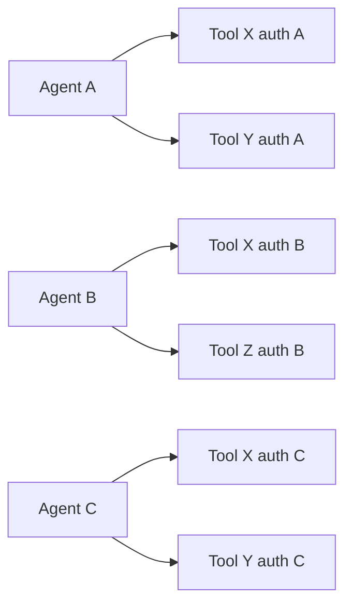
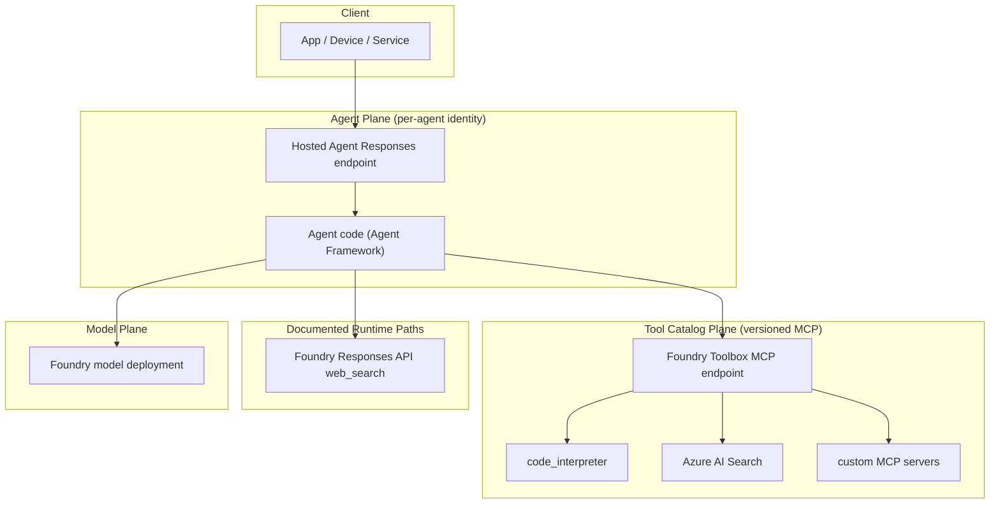

# Why This Architecture (First Principles)

This document derives — from customer constraints, not from product marketing — why a hosted agent endpoint plus a managed tool catalog is the natural shape for a modern enterprise agent system.

If you only remember one sentence:

> The hosted agent and the toolbox are split because **agent code and tool inventory have different lifecycles, different owners, and different governance requirements**. Anything that conflates them produces tool sprawl, credential duplication, and frozen capability evolution.

Sources used in this derivation:

- Toolbox how-to: https://learn.microsoft.com/en-us/azure/foundry/agents/how-to/tools/toolbox
- Hosted Agents concept: https://learn.microsoft.com/en-us/azure/foundry/agents/concepts/hosted-agents
- Toolbox blog: https://devblogs.microsoft.com/foundry/introducing-toolboxes-in-foundry/
- Hosted Agents blog: https://devblogs.microsoft.com/foundry/introducing-the-new-hosted-agents-in-foundry-agent-service-secure-scalable-compute-built-for-agents/

## 1. The Real Customer Problem

The Toolbox blog calls out a representative scenario almost every enterprise hits:

> "A single agent depends on five tools. Five different tool types (APIs, MCP servers, skills, connectors, flows). Five different authentication models. Five different owning teams... Teams re-implement the same tools. Credentials are duplicated. Governance is inconsistent or missing entirely."
>
> — Microsoft Foundry blog, *Introducing Toolboxes in Foundry*

Restated as constraints:

| Constraint | What it means in production |
| --- | --- |
| C1: Tool catalog evolves faster than agent code | New tools appear weekly; agent containers ship monthly. |
| C2: Each tool has its own auth model | OAuth, managed identity, API key, Entra OBO, project connections. |
| C3: Each tool is owned by a different team | The agent team cannot own credentials for every backend. |
| C4: Governance must be enforced at runtime | Approval, audit, RBAC must apply regardless of which agent calls the tool. |
| C5: Agents come from many frameworks | Microsoft Agent Framework, LangGraph, Semantic Kernel, custom code, Copilot SDK. |
| C6: Tools change without breaking deployed agents | Updating a tool's auth or version cannot trigger N agent redeploys. |

## 2. The Naive Architecture and Why It Fails

The simplest design is "agent code embeds every tool integration directly":

Failure modes:

- **N×M wiring explosion**: every agent re-implements every tool client.
- **Credential duplication**: each agent stores its own copies of OAuth tokens, API keys, connection strings.
- **Drift**: when a tool changes its API, every agent must be redeployed.
- **No central governance**: approval and audit live (or don't) inside each agent.
- **Capability evolution is frozen**: adding a new tool means N agent PRs, not a single config change.

These are the same patterns we already solved at the API layer with API gateways and at the network layer with service mesh. The question is **which separation matches an agent system**.

## 3. The Two Lifecycles

An agent system has two clearly different lifecycles:

| Concern | Lifecycle | Owner | Change cadence |
| --- | --- | --- | --- |
| Agent runtime: prompt strategy, planner, response shaping, business logic | Slow, hand-coded, tested | Agent / app team | Weeks-months |
| Tool inventory: which tools exist, who owns them, how they authenticate, which version is current | Fast, configuration-driven | Platform / tooling team | Days-hours |

If the same artifact owns both, every tool change forces an agent redeploy and every agent change touches credentials it shouldn't. The split is forced by the lifecycle mismatch, not by aesthetics.

## 4. Two Independent Decisions

**Decision 1 — Where does the agent code run?**

Options: caller-side (in the app), self-hosted (ACA/AKS/VM), or managed runtime (Foundry Hosted Agents).

| Option | What you give up | What you gain |
| --- | --- | --- |
| Caller-side | Stable agent endpoint, central observability, identity boundary | Lowest latency, no infra |
| Self-hosted | Cluster ops, auto-scaling logic, agent-identity wiring | Full infrastructure control |
| **Managed runtime** | Some compute customization | Per-agent identity, dedicated endpoint, sandbox isolation, scale-to-zero with stateful resume, built-in observability, RBAC pre-wired |

The Hosted Agents docs spell out the trade-off: per-session VM-isolated sandboxes, scale-to-zero with stateful resume from a persisted `$HOME` and `/files`, automatic agent identity, OpenTelemetry instrumentation, version pinning. For multi-tenant production, the cost of replicating these properties yourself is high.

**Decision 2 — Where does the tool catalog live?**

Options: in agent code (naive), in agent infrastructure (per-cluster registry), or in a managed catalog with a single endpoint (Foundry Toolbox).

| Option | Failure mode |
| --- | --- |
| In agent code | C1, C2, C3, C4, C6 all fail. |
| Per-cluster registry | Better, but each agent runtime needs to integrate the registry's contract. |
| **Managed MCP-compatible catalog** | C5 is satisfied because MCP is open; C1/C4/C6 are satisfied by version pinning and central policy enforcement. |

The two decisions are orthogonal. A hosted agent without a tool catalog regresses to per-agent integrations. A tool catalog without a hosted runtime regresses to per-app credential handling.

## 5. Why MCP, Not Function Calling

OpenAI-style function calling is a **wire format** between a model and a single host process. Functions are described in the prompt, the model emits a JSON call, the host executes a local function. There is no contract for tool discovery, version pinning, or remote execution.

MCP (Model Context Protocol) is a **client-server protocol**. Tools live on a server, clients discover them via `tools/list`, invoke them via `tools/call`, and the server controls auth, policy, and execution. This protocol shape is what makes a tool catalog possible.

| Property | OpenAI function calling | MCP |
| --- | --- | --- |
| Tool discovery | Static JSON in prompt | Dynamic `tools/list` |
| Tool execution | In agent process | On the MCP server |
| Auth boundary | Inside agent code | Inside the MCP server |
| Versioning | None (in-prompt) | Server-controlled |
| Multi-framework reuse | Per framework | Any MCP-compatible client |

Function calling is still used inside the agent runtime to *select* the tool to call; MCP is what carries the actual call to the catalog. The two compose, they do not compete.

Foundry chose MCP for the toolbox surface specifically so the consumption side stays open: any agent runtime that speaks MCP — Microsoft Agent Framework, LangGraph, Semantic Kernel, GitHub Copilot SDK, Claude Code, Copilot Studio — can consume the same toolbox without rewiring (Toolbox blog: "Toolboxes are Foundry-Homed, not Foundry-Bound").

## 6. Why Toolbox Sits in Front of MCP, Not As Raw MCP

If MCP is enough, why does Foundry add a toolbox layer in front of MCP servers? Two reasons.

**Aggregation.** A toolbox bundles multiple tool types — Web Search, Code Interpreter, Azure AI Search, File Search, OpenAPI, Agent-to-Agent, custom MCP servers — behind one endpoint. The agent connects once and discovers all of them. This is the difference between connecting to one API gateway and discovering all upstream services, versus opening N TCP sockets to N services.

**Governance and version pinning.** Each `ToolboxVersionObject` is an immutable snapshot of the tool list. The parent toolbox holds a `default_version` pointer (Toolbox docs, Step 5). Promoting a new version is a single update; agents see the new tool set on their next call without redeploying. This implements the "C6: tools change without breaking deployed agents" constraint as a contract, not a convention.

## 7. Why a Direct Web-Search Tool Sits Beside Toolbox MCP

A reasonable question: if Toolbox is the single tool plane, why does this repo also expose `direct_web_search` that calls the Foundry Responses API directly?

Two engineering reasons:

1. **Documented runtime path.** The Azure AI Foundry OpenAI Web Search docs describe `tools: [{"type":"web_search"}]` on `/openai/v1/responses` as the supported runtime path for grounded web answers. This is the path with explicit data-handling and pricing notes (Bing First-Party Consumption Service governance — see the Toolbox docs for the same data-residency caveat).
2. **Preview-stability split.** In current live testing, the Toolbox MCP endpoint can list `web_search` but invoking it can return service-side `DeploymentNotFound` in some projects. Splitting the runtime path keeps `code_interpreter` on the governed Toolbox path and keeps `web_search` on the documented Responses API path. When the Toolbox web-search runtime stabilizes, this split collapses naturally.

The general principle: **prefer the governed catalog, but keep an explicit fallback to the documented runtime when the catalog is in preview**. This is not an architectural compromise — it is a deliberate exposure of the lifecycle gap between catalog (preview) and underlying runtime (GA).

## 8. Putting It Together

Four planes, four lifecycles, four owners. Each plane changes on its own schedule. The hosted agent is the only thing the caller knows about; everything else can move without breaking the caller.

## 9. When This Architecture Is Wrong

First-principles reasoning has to admit failure cases.

- **Single-tool, single-tenant, single-team agents.** If you only call one API and only one team owns it, the catalog layer is overhead.
- **Edge / on-device agents.** If the agent must run on device with no cloud round-trip, this architecture is irrelevant — the model and tools must live on device.
- **Pure pipeline workflows.** If your "agent" is actually a deterministic data pipeline, a workflow engine (Durable Functions, Step Functions) is a cleaner fit.
- **Latency below ~500 ms TTFT.** The hosted agent adds container hops; for hard real-time loops, embed the model client directly.

These boundaries are explored further in [`scenario-mapping.md`](scenario-mapping.md) and the README's "When NOT to use" section.
