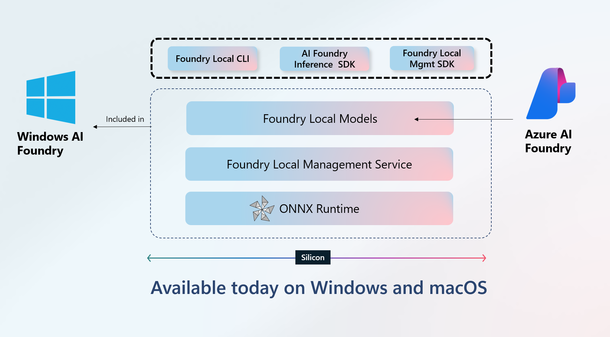
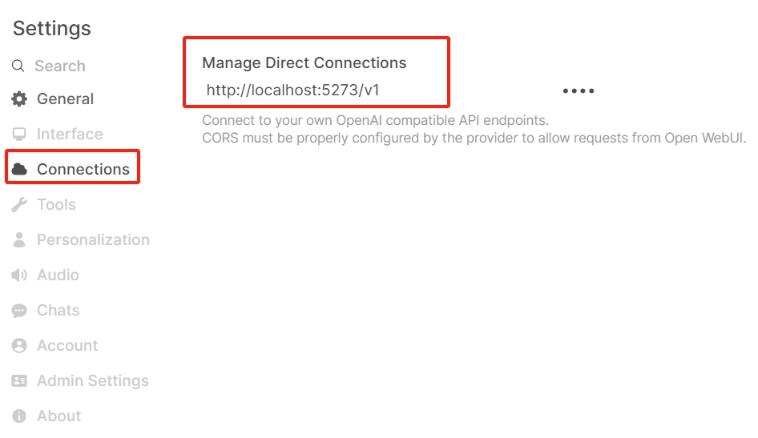

# Foundry Local Functionality Verification

## Running on Azure

**Azure AI Foundry Local** runs AI models directly on your local machine — no cloud GPU required.

| Item | Details |
|---|---|
| **Azure Product** | [Azure AI Foundry Local](https://learn.microsoft.com/en-us/azure/ai-foundry/foundry-local/get-started) |
| **Compute** | Local CPU/GPU (Windows, macOS) — supports NVIDIA, AMD, Qualcomm, Apple Silicon |
| **Network** | Internet for initial model download only; supports offline use |

Your system must meet the following requirements to run Foundry Local:
Operating System: Windows 10 (x64), Windows 11 (x64/ARM), Windows Server 2025, macOS.
Hardware: Minimum 8GB RAM, 3GB free disk space. Recommended 16GB RAM, 15GB free disk space.
Network: Internet connection for initial model download (optional for offline use)
Acceleration (optional): NVIDIA GPU (2,000 series or newer), AMD GPU (6,000 series or newer), Qualcomm Snapdragon X Elite (8GB or more of memory), or Apple silicon.

*Refer to：https://learn.microsoft.com/en-us/azure/ai-foundry/foundry-local/get-started*



### Install and Run Foundry Local on my Surface Laptop

On Powershell to install

```
winget install Microsoft.FoundryLocal
```

Start foundry service for open-webui  connection:

```
PS C:\Users\xinyuwei> foundry service status
🔴 Model management service is not running!
To start the service, run the following command: foundry service start


PS C:\Users\xinyuwei>  foundry service start
🟢 Service is Started on http://localhost:5273, PID 42864!


PS C:\Users\xinyuwei> foundry service status
🟢 Model management service is running on http://localhost:5273/openai/status

```

On WSL of my Laptop:

```
pip install open-webui
open-webui serve
```

Access  http://localhost:8080/ of open-webui

**Connect Open Web UI to Foundry Local**:

1. Select **Settings** in the navigation menu
2. Select **Connections**
3. Select **Manage Direct Connections**
4. Select the **+** icon to add a connection
5. For the **URL**, enter `http://localhost:PORT/v1` where `PORT` is replaced with the port of the Foundry Local endpoint, which you can find using the CLI command `foundry service status`. Note, that Foundry Local dynamically assigns a port, so it's not always the same.
6. Type any value (like `test`) for the API Key, since it can't be empty.
7. Save your connection

**Note:** The local models visible on Open-WebUI are models that have already been pulled locally using Foundry through PowerShell.



***Please click below pictures to see my demo video on Youtube***:
[](https://youtu.be/NpYDsGXFrAU)

## Load Special AI Model from Hugging Face

The models currently available in the Foundry Local repository may not necessarily include the specific models we intend to use. However, we can utilize the Olive tool to convert any model from Hugging Face into the ONNX format and save it locally, then load it into Foundry Local. **It's important to note** that converting models often requires significant memory resources. If your laptop can't meet these memory requirements, it may be necessary to perform this operation on an Azure VM with larger memory capacity.

*Refer to:https://learn.microsoft.com/en-us/azure/ai-foundry/foundry-local/how-to/how-to-compile-hugging-face-models?tabs=Bash*

```
pip install olive-ai[auto-opt]
pip install transformers==4.44.2 onnxruntime-genai
```

Use the Olive `auto-opt` command to download, convert, quantize, and optimize the model:

```
(olive) root@linuxworkvm:~# olive auto-opt \
    --model_name_or_path meta-llama/Llama-3.2-1B-Instruct \
    --trust_remote_code \
    --output_path models/llama \
    --device cpu \
    --provider CPUExecutionProvider \
    --use_ort_genai \
    --precision int4 \
    --log_level 1
```

Convert result:

```
 shape is same as output: [5]
2025-05-27 08:09:35,961 fusion_utils [INFO] - Remove reshape node /model/layers.15/self_attn/Reshape_3 since its input shape is same as output: [5]
2025-05-27 08:09:35,962 fusion_utils [INFO] - Remove reshape node /model/layers.15/self_attn/Reshape_5 since its input shape is same as output: [5]
2025-05-27 08:09:36,119 onnx_model [INFO] - Removed 40 nodes
2025-05-27 08:09:36,128 onnx_model_gpt2 [INFO] - postprocess: remove Reshape count: 0
2025-05-27 08:09:36,152 onnx_model_bert [INFO] - opset version: 20
[2025-05-27 08:11:10,727] [INFO] [engine.py:757:_run_pass] Pass transformer_optimizer:orttransformersoptimization finished in 323.248973 seconds
[2025-05-27 08:11:10,773] [INFO] [engine.py:683:_run_pass] Running pass matmul4:onnxmatmul4quantizer
[2025-05-27 08:12:06,972] [INFO] [engine.py:757:_run_pass] Pass matmul4:onnxmatmul4quantizer finished in 56.200519 seconds
[2025-05-27 08:12:06,974] [INFO] [engine.py:683:_run_pass] Running pass extract_adapters:extractadapters
[2025-05-27 08:12:08,325] [INFO] [extract_adapters.py:177:_run_for_config] No lora modules found in the model. Returning the original model.
[2025-05-27 08:12:08,345] [INFO] [engine.py:757:_run_pass] Pass extract_adapters:extractadapters finished in 1.370458 seconds
[2025-05-27 08:12:08,346] [INFO] [engine.py:241:run] Run history for cpu-cpu:
[2025-05-27 08:12:08,348] [INFO] [engine.py:499:dump_run_history] Please install tabulate for better run history output
[2025-05-27 08:12:08,348] [INFO] [cache.py:195:load_model] Loading model 36d160e9 from cache.
[2025-05-27 08:12:09,240] [INFO] [engine.py:266:run] Saved output model to /root/models/llama
Model is saved at /root/models/llama
```

Check model files:

```
(olive) root@linuxworkvm:~# ls -al /root/models/llama
total 16
drwxr-xr-x 3 root root 4096 May 27 08:12 .
drwxr-xr-x 5 root root 4096 May 27 07:58 ..
drwxr-xr-x 2 root root 4096 May 27 08:12 model
-rw-r--r-- 1 root root 4031 May 27 08:12 model_config.json
(olive) root@linuxworkvm:~# ls -al /root/models/llama/model
total 1790124
drwxr-xr-x 2 root root       4096 May 27 08:12 .
drwxr-xr-x 3 root root       4096 May 27 08:12 ..
-rw-r--r-- 1 root root        951 May 27 08:12 config.json
-rw-r--r-- 1 root root       1540 May 27 08:12 genai_config.json
-rw-r--r-- 1 root root 1823915746 May 27 08:11 model.onnx
-rw-r--r-- 1 root root        325 May 27 08:12 special_tokens_map.json
-rw-r--r-- 1 root root    9085657 May 27 08:12 tokenizer.json
-rw-r--r-- 1 root root      54557 May 27 08:12 tokenizer_config.json
(olive) root@linuxworkvm:~# 
```

Rename model directory's name:

```

cd models/llama
mv model llama-3.2
```

Write down generate_inference_model.py script:

```
(olive) root@linuxworkvm:~# pwd
/root
(olive) root@linuxworkvm:~# cat generate_inference_model.py
# generate_inference_model.py
# This script generates the inference_model.json file for the Llama-3.2 model.
import json
import os
from transformers import AutoTokenizer

model_path = "models/llama/llama-3.2"

tokenizer = AutoTokenizer.from_pretrained(model_path)
chat = [
    {"role": "system", "content": "You are a helpful assistant."},
    {"role": "user", "content": "{Content}"},
]


template = tokenizer.apply_chat_template(chat, tokenize=False, add_generation_prompt=True)

json_template = {
  "Name": "llama-3.2",
  "PromptTemplate": {
    "assistant": "{Content}",
    "prompt": template
  }
}

json_file = os.path.join(model_path, "inference_model.json")

with open(json_file, "w") as f:
    json.dump(json_template, f, indent=2)
```

Run the programme:

```
python generate_inference_model.py
```

Next, download the entire "model" directory to my laptop under the following location:

```
C:\Users\xinyuwei>
```

Add model to  foundry cache 

```
PS C:\Users\xinyuwei> foundry cache cd models
Restarting service...
🔴 Service is stopped.
🟢 Service is Started on http://localhost:5273, PID 16216!
```

Check added model:

```
PS C:\Users\xinyuwei> foundry cache ls
Models cached on device:
   Alias                         Model ID
💾 Model was not found in catalogllama-3.2
💾 Model was not found in catalogmodel
PS C:\Users\xinyuwei>
```

Run the model locally:

```
PS C:\Users\xinyuwei> foundry model run llama-3.2 --verbose
Model llama-3.2 was found in the local cache.
🕕 Loading model...
Time cost to load model: 00:00:05.6293161
🟢 Model llama-3.2 loaded successfully

Interactive Chat. Enter /? or /help for help.

Interactive mode, please enter your prompt
```


```
> Where is china?
🤖 China is a country located in East Asia. It is the world's most populous country, with a population of over 1.4 billion people, and is situated in the Far East. China is bordered by several countries, including:

* North Korea to the north
* Mongolia to the north
* India to the south
* Nepal to the south
* Bhutan to the south
* Myanmar (Burma) to the west
* Vietnam to the west
* Taiwan to the east

China is a vast country, with a long coastline along the Pacific Ocean to the east and the South China Sea to the south. It is also home to many different ethnic groups, languages, and cultures, making it a diverse and fascinating country to learn about.

Here's a rough outline of China's geography:

* China is divided into 23 provinces, 4 autonomous regions, and 2 special administrative regions.
* The country has a total area of approximately 9.6 million square kilometers (3.7 million square miles).
* China is home to many major cities, including Shanghai, Beijing, Guangzhou, and Shenzhen.

I hope that helps!
======================Perf Info======================
Total Tokens/Second: 13.23943661971831
Time to First Token: 1436 ms
Average Token Generation Time: 74.9063829787234 ms
Total Time: 17750 ms
Total Tokens: 235
=====================================================
```

## Difference between Foundry Local and AI Dev Gallery

- Need a **local REST API inference service** with OpenAI-compatible protocol → Choose **Foundry Local**
- Need **rapid Windows desktop UI development with zero-latency in-process inference** → Choose **AI Dev Gallery (default)**

```
+------------------------+                                 +---------------------------------------+
| Your Client App         |                                 | Foundry Local Service Daemon            |
| (Python/JS/C#/Java..)  |                                 |                                       |
|                        |                                 |   +-------------------------------+   |
|                        |                                 |   |  ONNX Runtime (CPU/GPU/NPU)   |   |
|                        |                                 |   +---------------▲---------------+   |
+-----------+------------+                                 |                   |                   |
            |                                              |   +---------------▼---------------+   |
            |  HTTP Request (OpenAI REST API, JSON)        |   |       ONNX Model (.ort/.onnx)   |   |
            |                                              |   +-------------------------------+   |
            |                                              +---------------------------------------+
            ▼
http://localhost:PORT/v1/chat/completions
(Request and response fully compatible with OpenAI API)
```

**Notes:**

- Your application and the model inference service use a typical **client-server** architecture.
- Foundry Local provides inference via HTTP REST API in the background, making it suitable for multi-process, multi-application, and even remote invocation.
- The protocol is fully OpenAI API compatible, making it easy to integrate with existing code.

```
+-------------------------------------------------------+
|                AI Dev Gallery Sample App (WinUI)       |
|                                                       |
|   +-----------------------------------------------+   |
|   | WinUI Page (XAML, UI Controls, Chat Window)    |   |
|   +-----------------------------------------------+   |
|                    ▲         |                        |
|                    |         | IChatClient API call    |
|                    |         ▼                        |
|    +---------------------------------------------+    |
|    |  OnnxRuntimeGenAIChatClient (C# wrapper)   |    |
|    +-------------------------▲-------------------+    |
|                              | P/Invoke (call DLL API)|
|    +-------------------------▼-------------------+    |
|    |   ONNX Runtime (Microsoft.ML.OnnxRuntime)   |    |
|    +-------------------------▲-------------------+    |
|                              | Load model into memory |
|    +-------------------------▼-------------------+    |
|    |       Local ONNX Model (.ort/.onnx)         |    |
|    +---------------------------------------------+    |
+-------------------------------------------------------+
```

**Notes:**

- No HTTP/API calls — just ordinary **in-process function/DLL calls**.
- The model is loaded directly into the current UI process; all inference happens in-process.
- Advantage: low latency, ideal for single-machine UI apps. Disadvantage: not suitable for multi-process sharing.


| Feature | Foundry Local (Background Service) | AI Dev Gallery (In-Process) |
| --- | --- | --- |
| Architecture | Client-Server (REST API IPC) | Single process (DLL function call) |
| Protocol | OpenAI REST API, HTTP, JSON | In-memory function call (no HTTP) |
| Network Overhead | Minimal (localhost loopback) | None |
| Latency | Slightly higher (serialization + IPC) | Lowest (direct in-process call) |
| Use Case | Backend, multi-process sharing, remote calls | Windows desktop GUI apps (chat windows, etc.) |
| Model Storage | Managed by Foundry service | Managed by the app itself |


