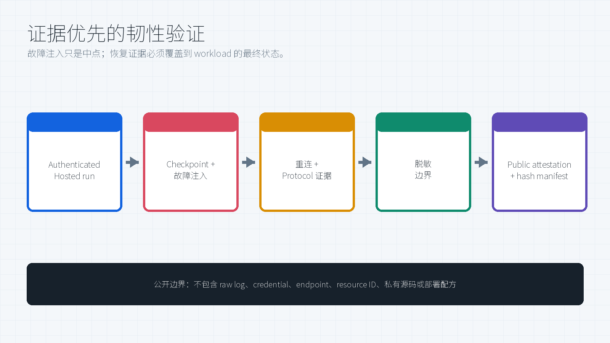
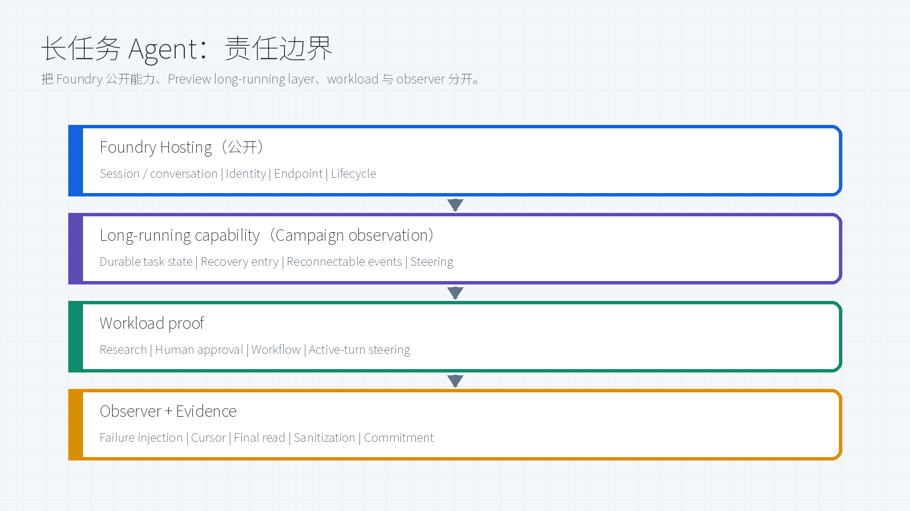
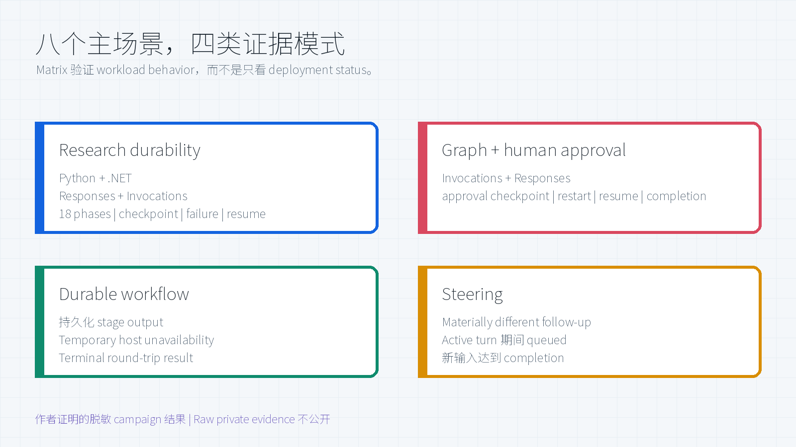

# Foundry 长任务 Agent 韧性验证

[](https://github.com/david-xinyuwei/david-share/actions/workflows/foundry-long-running-agent-resilience-ci.yml)
[](data/validation-matrix.json)
[](pyproject.toml)

这是一套面向 Microsoft Foundry Hosted Agents 的公开知识与 evidence-validation（证据验证）工具。它提炼了私有八场景 campaign 的架构与 proof pattern，并提供可执行检查来验证公开的脱敏 attestation。

> **信任与公开边界：** `8/8` 是**作者证明的 campaign 结果**，不是可由公开 telemetry 独立 replay 的结论。精确 Schema 与 Python validator 证明 contract validity；SHA-256 证明 committed artifact integrity；两者都不能单独证明私有 run 确实发生。本 Repo **不包含 private-preview 源码**、私有 package、原始 Hosted log、service endpoint、resource identifier、credential 或部署配方。测试结果**不是生产认证**，也不代表所有拓扑都具备相同可用性。

> **Author:** 魏新宇 (Xinyu Wei) - Microsoft AI and Apps GBB Senior System Engineer

[English](README.md) | 中文版 | [Hosted agents 概览](https://learn.microsoft.com/en-us/azure/foundry/agents/concepts/hosted-agents) | [Hosted agent 快速入门](https://learn.microsoft.com/en-us/azure/foundry/agents/quickstarts/quickstart-hosted-agent)

---

## Executive Summary

私有 campaign 覆盖八个文档定义的**主场景**：Python 与 .NET、Responses 与 Invocations、Graph human approval、持久化 workflow，以及 active-turn steering。八项均达到各自 pattern 的 workload PASS 标准；公开 Repo 验证作者证明的脱敏记录及其私有证据 commitment。

| 结果 | 可公开证据 | 为什么重要 |
|---|---|---|
| 作者证明的 campaign 中 8/8 主场景 PASS | `evidence/sanitized-runs/` 下八个独立文件 + 自动生成 matrix | 聚合数字不能掩盖某个 runtime 或 protocol 缺失；来源仍受 trust model 限定。 |
| 总计 18 phases 的 Research workload 在注入故障后仍完整结束 | Python/.NET、Responses/Invocations attestations | 短 smoke test 不能替代长任务 recovery。 |
| Human approval 跨 restart 保留 | 两个 graph HITL 场景 | Recovery 保留了待决策边界，而不只是生成文本。 |
| Workflow 与 steering 得到 terminal outcome | 持久化 stage output + materially different follow-up | Durability 与 steering 按 workload behavior 验证。 |
| 公开产物全部 hash 锁定 | `evidence/manifest.json` | Committed public artifact 的变化可见；manifest 不是私有执行证明。 |

核心结论很简单：

> **Deployment active 是 control-plane 事实；resilience 是 workload 级声明，必须有 checkpoint、disruption、continuity 和 terminal evidence。**

## 哪些是真实证据，哪些不公开

| 层级 | 本 Repo 发布什么 | 边界 |
|---|---|---|
| 私有 campaign 结果 | 从 authenticated Hosted run 提炼的作者证明 assertion | 带私有 source commitment 的脱敏声明；公开读者无法 replay 被保留的 run。 |
| Validation code | Matrix validator、JSONL summarizer、manifest verifier、public scanner 和测试 | 无 Azure credential 也能完整执行。 |
| Parser fixtures | `tests/fixtures/` 下两个小型 synthetic JSONL stream | 明确标为 `test-fixture`，不冒充 live evidence。 |
| Raw hosted evidence | 不公开 | 可能包含 endpoint、任务标识、环境 metadata 和生成内容。 |
| Original implementation | 不公开 | Private source 和 package 细节不进入本 Repo。 |
| Deployment recipe | 不公开 | 公开部署方式以 Foundry 官方 quickstart 为准。 |

## 证据层级：为什么 active 不够

Agent version 为 active 时，主场景仍可能在 checkpoint 之后、reconnect 时、approval resume 时或 final snapshot 阶段失败。这套工具把证据分为六层：

1. Version active。
2. Work accepted。
3. 观察到 checkpoint。
4. 观察到 failure 和 connection drop。
5. 观察到 recovery marker 或 same-work continuity。
6. 完整计划达到 terminal success。

对 recovery pattern，只有第 6 层计为 PASS。Workflow 与 steering 使用各自的 pattern-specific terminal 标准。详见[方法论](docs/methodology-CN.md)。

## 验证架构



Public boundary 是单向的：raw evidence 可以生成脱敏 attestation，但公开产物无法反推出私有 service identity 或部署细节。

## 系统架构与责任边界



关键设计是把平台公开保证与 workload 必须自己证明的内容分开：

| 层级 | 公开或观察到的职责 | Evidence 边界 |
|---|---|---|
| Foundry Hosting | Session/conversation state、Agent identity、独立 protocol endpoint、managed lifecycle | 当前 Microsoft Learn 文档 |
| 长任务能力 | Private campaign 中观察到的 durable task state、recovery entry、可重连 event 与 steering pressure | 作者证明的脱敏 observation；实现不公开 |
| Workload | Checkpoint 含义、approval owner、stage output、安全取消、terminal business result | Pattern-specific assertion |
| Observer | 故障注入、reconnect cursor、final read、脱敏与公开 | Public tools 加 private-source commitment |

Long-running work 有两种不同形态。**Active work** 在 recovery 后继续 pending computation；**suspended work** 停在 durable human-approval checkpoint，直到后续 request 才被唤醒。两者的连续性都不依赖 process uptime。

完整的 Responses/Invocations、session/conversation、identity 与 trust-model 映射见[架构与责任边界](docs/architecture-CN.md)。

## 场景覆盖



| Scenario ID | Runtime | Protocol | 主证据 |
|---|---|---|---|
| `research-invocations-python` | Python | Invocations | 18 phases、checkpoint、failure、recovery event、`run_completion`。 |
| `research-responses-python` | Python | Responses | 18 items、lifecycle reset、same-response resume、completed。 |
| `graph-hitl-invocations-python` | Python | Invocations | Approval checkpoint 跨故障保留，恢复后得到 confirmation。 |
| `graph-hitl-responses-python` | Python | Responses | Reconnect + approval resume，最终得到 confirmed terminal result。 |
| `durable-workflow-python` | Python | Responses | Persisted stage output 跨临时 Host 不可用继续完成。 |
| `steering-python` | Python | Responses | Materially different follow-up 排队并返回相关答案。 |
| `research-invocations-dotnet` | .NET | Invocations | 18 phases、checkpoint、failure、recovery event、`run_completion`。 |
| `research-responses-dotnet` | .NET | Responses | 同一 response 重连后继续 18 items 并 completed。 |

## Protocol 专属证据

### Invocations

Invocations 自己管理 custom task 与 SSE contract。强证据包括 workload checkpoint、connection drop、显式 recovery event、所有文档 phases、terminal `done=completed`，以及 durable task 以正常 run completion 结束。

### Responses

Responses 使用 stored response lifecycle。Recovery 可以由 lifecycle reset 证明，也可以由更强的可观察不变量证明：同一个 response 从第一个未 checkpoint 的 output index 继续，并最终进入 `completed`。不同 SDK 在 reconnect cursor 处的 event replay 不完全相同，因此 validator 接受两种证据。

### Graph Human Approval

PASS 不是“出现了 approval prompt”。待审批状态必须跨 failure 保持，decision 只能恢复一次，graph 还必须执行 approval 之后的路径并得到 terminal confirmation。

### Durable Workflow 与 Steering

Workflow PASS 要求 persisted stage output 和 terminal result。Steering PASS 要求 materially different follow-up input、active turn 期间 queued、旧 turn 终止，以及新输入得到相关的 completed answer。

## 方法论

Research durability 与 Graph approval recovery 使用以下可证伪链路：

```text
authenticated run
  -> workload checkpoint
  -> injected process failure
  -> connection drop / temporary unavailability
  -> reconnect with original logical work reference + cursor
  -> recovery marker or same-work output continuity
  -> full plan + terminal success
  -> sanitized public attestation + SHA-256 manifest
```

Durable workflow 与 steering 不会被强行套入这条链路：

| Proof pattern | 必须观察到的结果 |
|---|---|
| Research | 故障前 checkpoint、重连后同一逻辑任务、全部 18 个 phase/item、显式 terminal success |
| Graph HITL | Pending approval 跨进程替换保持、decision 只恢复一次、approval 后路径完成 |
| Durable workflow | 必需 stage output 全部持久化，原 background response 得到 round-trip terminal result |
| Steering | Materially different follow-up 在 active 时 queued，旧 turn 协作结束，新 turn 返回相关 completed answer |

完整验收规则见[方法论](docs/methodology-CN.md)，逐 pattern 时间线见[场景证据 Runbook](docs/scenario-runbooks-CN.md)，字段与隐私规则见[证据契约](docs/evidence-contract-CN.md)。

## 证据契约

每个 committed record 都声明 runtime、protocol、proof pattern、source class、作者证明 provenance、status 和 pattern-specific assertion。以下情况会 fail closed：

- scenario ID 缺失或重复；
- 预期场景不是八项；
- phase、checkpoint、failure、recovery、approval 或 completion 证据缺失；
- summary 与 scenario rows 不一致；
- private-source commitment 缺失或格式错误；
- 出现 endpoint、resource、session、response、invocation、tenant 或 subscription 等身份字段；
- manifest 存在路径逃逸、文件缺失、byte 变化或 SHA-256 变化。

自动生成的精确 JSON Schema 位于 [data/evidence-contract.schema.json](data/evidence-contract.schema.json)；权威生成器与确定性检查位于 [src/lra_resilience/evidence.py](src/lra_resilience/evidence.py)。

[scenario-manifest.json](scenario-manifest.json) 区分 `sanitized-runtime-attestation`、`dynamic-runtime`、`architecture-explainer` 与 `test-fixture`。Synthetic parser fixture 始终隔离在 `tests/fixtures/`，不计入 campaign。

## 快速开始

```bash
git clone https://github.com/david-xinyuwei/david-share.git
cd david-share/Agents/Foundry-Long-Running-Agent-Resilience
python -m venv .venv
source .venv/bin/activate  # Windows: .venv\Scripts\activate
python -m pip install -e .
lra-evidence validate
lra-evidence manifest
python scripts/protocol_summary_differential.py
```

预期输出：

```text
PASS: validated 8 sanitized scenarios
PASS: verified 9 evidence artifacts
PASS: synthetic protocol fixtures produced different public summaries
```

验证 committed public evidence 不需要 Azure credential。

## CLI

验证生成后的 matrix：

```bash
lra-evidence validate --matrix data/validation-matrix.json
```

验证所有 committed hash：

```bash
lra-evidence manifest
```

汇总自己的 JSONL stream，同时丢弃 identity fields：

```bash
lra-evidence summarize path/to/events.jsonl --output summary.json
```

Summarizer 只保留 event type、phase、output index、status、total 和 sequence number，并报告有序 phase/index observation，以及 sequence monotonicity、duplicate 与 gap；其他字段全部丢弃。Terminal event 只有携带显式 `completed` status 时才计为完成。

## 用自己的 Events 复验

1. 私下保存完整 stream，不要在 byte cap 处停止。
2. Raw evidence 不进入本 Repo。
3. 对私有 JSONL 文件运行 `lra-evidence summarize`。
4. 检查 public summary 是否仍含业务 payload 或 identity value。
5. 新增 contract 时必须同步增加测试与文档。

本 Repo 不部署或调用 Agent。公开部署方式请使用[官方 Hosted agent quickstart](https://learn.microsoft.com/en-us/azure/foundry/agents/quickstarts/quickstart-hosted-agent)。离线 validator 支持 Python 3.10–3.13；Hosted deployment 的当前前置条件以官方 quickstart 为准，版本可能更新得更快。

## 在 Azure 上运行

本 Repo 是离线 evidence validator，不是 Azure deployment template。验证 committed matrix 不需要 Azure credential，也不会创建任何云资源。

如果要为自己的 Azure workload 生成证据：

1. 按[官方 quickstart](https://learn.microsoft.com/en-us/azure/foundry/agents/quickstarts/quickstart-hosted-agent)部署 Hosted Agent。
2. 在私有位置保存完整、经过身份验证的 event stream。
3. 执行对应 proof pattern 的证据链；workflow 与 steering 不复用 Research assertion chain。
4. 使用 `lra-evidence summarize` 生成只含协议字段的 summary。
5. 发布前人工检查 summary；credential、endpoint、ID、业务 payload 和 raw log 一律不得提交。

Azure deployment 与会产生费用的资源变更不在本 Repo 的自动化边界内。

## 失败模式与经验

| 失败模式 | 错误理解 | 正确证据处理 |
|---|---|---|
| Version active | “Resilience 已通过。” | 必须从 checkpoint 跑到 terminal completion。 |
| Stream 截断 | “只捕获到这些阶段。” | 按不完整证据处理，并查询 durable state。 |
| Final GET 时 observer token 过期 | “Workload 失败。” | 刷新 observer auth，再做只读终态查询。 |
| Runtime 没发另一个 SDK 的 reset event | “没有 recovery。” | 检查同任务连续性、output indexes、cursor 和 completion。 |
| Approval decision 被解释两次 | “Approve 等于 deny。” | 找到 approval contract 的唯一 owner。 |
| 忘记 background lifecycle | “Stored recovery 不工作。” | 确认请求选择了所需 lifecycle。 |
| Durable task/storage preview onboarding 缺失 | “开启一个无关 feature。” | 区分 service-side allowlisting 与客户 registration；Agent version active 不代表该 data path 已启用。 |
| Shell quoting 破坏 payload | “API 拒绝合法 schema。” | 使用 structured/file-backed client，并保存 HTTP evidence。 |

每个案例的裁决依据见[失败模式与证据裁决](docs/failure-modes-CN.md)。

## Repo 结构

```text
data/                         Generated matrix 与精确 public JSON Schema
docs/                         架构、Runbook、方法论、契约与失败分析（EN/CN）
evidence/sanitized-runs/      八个 public-safe、作者证明的 campaign record
images/                       自动生成的双语架构图、证据图与覆盖图
scripts/                      Build、validation、parser differential、package 与 asset 工具
src/lra_resilience/           Evidence、event summary、manifest 和 CLI library
tests/                        Contract、tamper、privacy、parser 和 differential fixtures
tests/fixtures/               Synthetic JSONL parser 输入；绝不作为 live-run evidence
scenario-manifest.json        Dynamic runtime / architecture / fixture 分类
```

## 质量门禁

| 质量门禁 | 命令 | 失败行为 |
|---|---|---|
| Evidence contract | `python scripts/validate_evidence.py` | 缺 proof 或 hash 变化即失败。 |
| Protocol-summary differential | `python scripts/protocol_summary_differential.py` | 不同 synthetic parser fixture 产生相同 summary 即失败；该检查不是 Hosted runtime test。 |
| 双语确定性 gate | `python scripts/validate_readmes.py` | Heading、table、code、localized image、numeric claim、link 或关键边界漂移即失败。 |
| 确定性 public scanner | `python scripts/validate_repo.py` | 已知 credential value、ID、private URL、endpoint、本地路径、缺失 asset 或错误图片即失败；它不能替代人工出口审查。 |
| Unit tests | `pytest -q` | Contract、parser、manifest 和 tamper regression 即失败。 |
| Lint | `ruff check src tests scripts` | Static code finding 即失败。 |
| Dependency audit | `pip-audit --local` | Clean installed environment 中的已知漏洞即失败。 |
| Package | `python -m build --wheel` | Clean build 失败即阻断交付。 |
| Installed CLI smoke | `python scripts/package_smoke.py` | Installed CLI 必须在 checkout 外使用显式 evidence path 正常工作。 |

CI 在 Windows/Linux 与 Python 3.10-3.13 上执行。

## Public Boundary

本 Repo 是私有验证工作的真实公开子集，只保留方法论、通用 evidence contract、脱敏结果、失败分析和可执行检查；raw output、identifier、private code、private package、内部协作记录和环境专属部署细节全部不公开。

`8/8` 表示作者证明八个文档主场景在 campaign 中全部 PASS，且公开 record 满足精确 contract；不表示公开 artifact 能独立 replay 私有 run，也不表示所有可选 cancel/delete/deny 分支、所有区域、所有模型或所有生产拓扑都经过认证。

## 公开官方来源

| 来源 | 本 Repo 使用的公开事实 | 核验日期 |
|---|---|---|
| [Foundry Agent Service 中的 Hosted agents](https://learn.microsoft.com/en-us/azure/foundry/agents/concepts/hosted-agents) | Hosted agents 支持 Responses/Invocations、stateful sessions、background work、Python/C# 和 managed lifecycle。 | 2026-07-23 |
| [部署第一个 Hosted agent](https://learn.microsoft.com/en-us/azure/foundry/agents/quickstarts/quickstart-hosted-agent) | 使用 `azd`、Python SDK 或 VS Code 的公开部署与调用流程。 | 2026-07-23 |

原始验证使用的私有实现不会链接，也不会在这里描述。

## 相关 Repo

| Repo | 关系 |
|---|---|
| [Foundry-Agent-Lifecycle-Build-Deploy-Operate](../Foundry-Agent-Lifecycle-Build-Deploy-Operate/) | 涵盖范围更广的 Build、deploy、operate 生命周期。 |
| [Foundry-Hosted-Agent-Toolbox-Demo](../Foundry-Hosted-Agent-Toolbox-Demo/) | Hosted-agent tools、memory、skills 与运维验证。 |
| [Foundry-Agent-ModelOps-Governance](../Foundry-Agent-ModelOps-Governance/) | Evidence-driven operational-plane 边界图。 |

## 限制

- Committed evidence 是脱敏 attestation，不是可独立 replay 的 raw service telemetry。
- 每个 scenario 的 private-source commitment 支持后续私有复核，但不会形成可由公开读者验证的 execution chain of custody。
- 本工具验证 evidence semantics，不负责部署 Agent，也不认证 service availability。
- 8/8 不包含每个主场景之外的可选分支。
- Failure injection 证明 recovery behavior，不证明业务域正确性或模型质量。

## 下一步

1. 在不改变业务逻辑的前提下，把这套证据层级应用到另一个长任务 workload。
2. 新增 proof pattern 时，必须同时提供 authenticated run、精确 assertion contract、fail-closed 测试和同步的 EN/CN 文档。
3. Raw evidence 继续保留在私有边界内，公开层只发布独立验证 contract 所需的最小协议 assertion。

## 贡献

见 [CONTRIBUTING.md](CONTRIBUTING.md)。新的 evidence pattern 必须增加测试、Public boundary 审查、双语文档和确定性 manifest 更新。

## License

本项目采用 [MIT License](LICENSE)。
