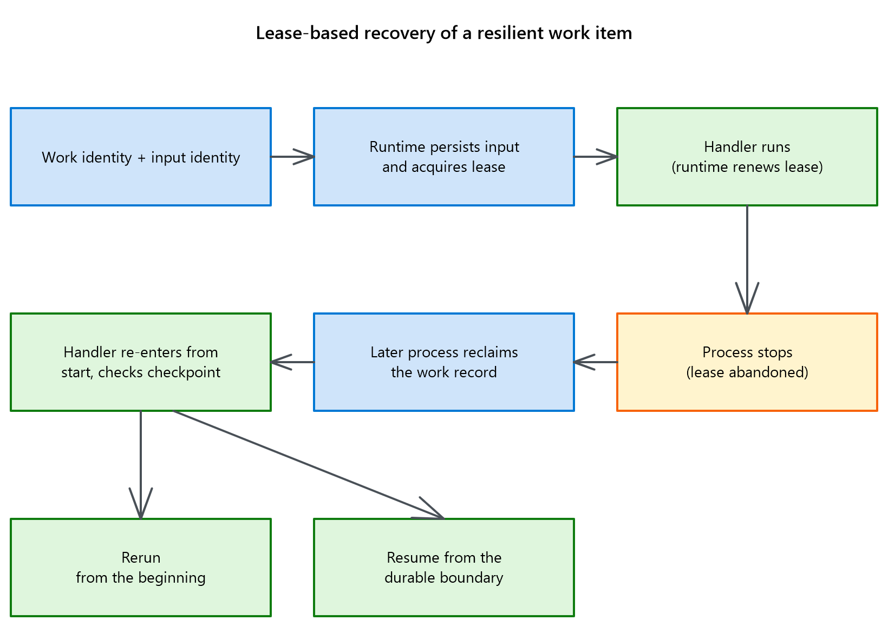
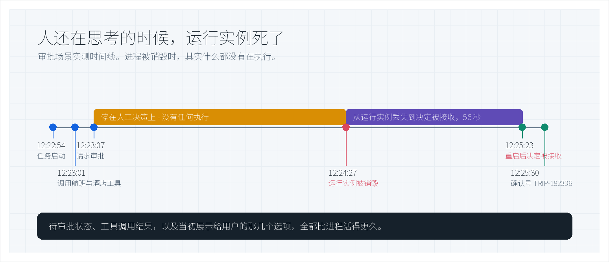
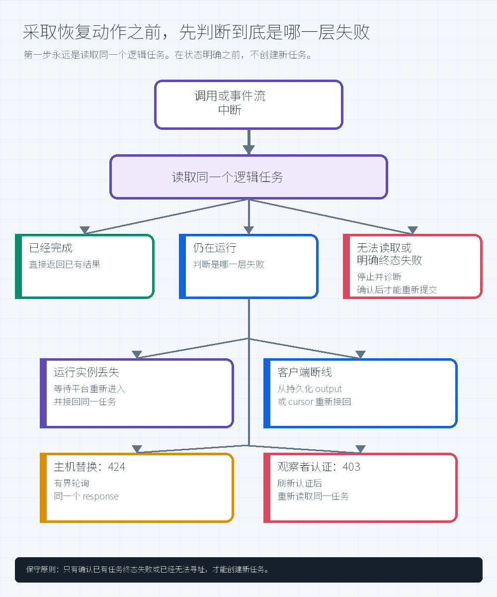

# Microsoft Foundry 长任务 Agent 韧性：主动注入进程丢失的实测证据

[](https://learn.microsoft.com/en-us/azure/foundry/agents/concepts/long-running-agent-resilience)
[](#评估到底跑了什么)
[](#实测结果)
[](#三种接入方式)
[](LICENSE)

本仓库回答一个问题：**运行长任务的进程突然消失后，任务能否从已保存的进度继续，而不是从头再来？** 这里提供 8 次故障注入结果、公共 SDK 检查、本地双进程演示、自动化测试和可复核证据。

该能力处于**公共预览**。所有中断都是主动注入，不是线上事故；结果只适用于文中 2026 年 7 月和 8 月的测试条件，不代表 SLA 或生产就绪。

> **Author:** 魏新宇（Xinyu Wei）

[English](README.md) | 中文

[客户快速入口](CUSTOMER-START-HERE-CN.md) · [实测结果](#实测结果) · [恢复模型](#深入理解恢复如何工作) · [复现](#快速开始) · [证据](#证据与边界) · [官方文档](https://learn.microsoft.com/en-us/azure/foundry/agents/concepts/long-running-agent-resilience)


## 从这里开始

不用先读全文，按你的目标选择入口：

| 你想做什么 | 去哪里 |
|---|---|
| 给自己的 Hosted Agent 加恢复能力 | [客户快速入口](CUSTOMER-START-HERE-CN.md)：软件包、服务端、部署、状态、身份、调用方和故障验收都在一处 |
| 在本机看两个进程接力同一任务 | [运行本地恢复实验](#运行本地恢复实验)，不需要 Azure 订阅 |
| 核对实测结论 | 先看[实测结果](#实测结果)，再看[证据与边界](#证据与边界) |

最短且准确的答案是：服务端和请求都启用可恢复的 stored background work；再根据任务选择安全重跑、Responses 快照或应用自有状态；调用方始终保存同一个 response/work ID。只有当重要进度不在 stored response 中，或外部操作需要对账时，才必须另配数据库。

**完成标准：** 主动注入进程丢失后，同一条任务到达明确终态、预期输出完整，而且已提交的外部操作没有重复。

## Foundry 提供什么，应用负责什么

| Foundry / AgentServer 提供 | 应用负责 |
|---|---|
| 托管运行环境、endpoint、身份、会话和监控 | 业务输入输出格式、超时和完成标准 |
| 保存任务与输入；进程丢失后重新调用同一任务 | 记录业务进度，决定从哪里继续 |
| 保存 response 历史；支持后台轮询和断线后继续读取 | 防止支付、预订、写入或工具调用被重复执行（保证幂等） |
| 提供替代计算资源 | 保存稳定的任务标识，并处理重连和读取权限 |

**运行实例**只是当前执行代码的那一个进程。进程消失会丢失内存和连接，但不会丢失保存在进程之外的任务和进度（[官方说明](https://learn.microsoft.com/en-us/azure/foundry/agents/concepts/hosted-agents)）。

官方文档说明平台负责什么；本仓库验证应用能否正确保存进度、防止重复执行，并在重连后确认结果完整。

**这项韧性到底解决什么问题**

它不是让两个 Agent 同时执行同一任务的 active-active 双活，而是提供**任务级恢复**：运行进程退出后，平台在替代计算资源上重新调用同一条任务记录，应用再从已经持久化的业务进度继续。

| 没有任务级恢复 | 使用任务级恢复 |
|---|---|
| 进程退出后，内存状态丢失；客户端可能重新创建第二个任务 | 替代进程重新进入同一个任务 ID，并读取原输入 |
| 客户端断线后，不知道任务是否还在运行 | 客户端保存 response/invocation ID，并继续查询同一任务 |
| 等待人工审批的任务容易被误判为已经丢失 | 已保存的任务与审批状态仍可查询 |
| 付款、预订、写入或工具调用重做时可能重复执行 | 应用通过进度点和幂等标识识别已经完成的操作 |

下文数据证明这项能力在受测场景中成立，但它不是可靠性百分比或 SLA。要形成生产信心，仍需针对自己的任务做多轮故障注入。

## 本仓库验证了什么

本次 18 阶段实测来自微软在 **2026 年 7 月 private preview 期间提供的 `resilient-research` 样例**，不是本仓库自造的任务。它是一个通用的深度研究简报任务：调用方提供一个研究主题，当次测试的具体主题和模型生成正文不公开。这个样例按固定计划分 18 个阶段完成研究：

- 第 1-4 阶段：拆解研究问题，梳理基础文献、关键研究者和历史背景；
- 第 5-9 阶段：分析最新进展、方法争议、证据质量、相关领域和未解决问题；
- 第 10-15 阶段：评估应用与采用情况、资金趋势、伦理、替代方案、风险和发展前景；
- 第 16-18 阶段：汇总结论，提出具体建议，并给出下一步路线图。

每个阶段都会调用一次模型生成该部分内容；阶段完成后，应用保存“已经完成到第几个阶段”。[当前公开的 `resilient-research` 样例](https://github.com/microsoft-foundry/foundry-samples/tree/b9b2cdd67efee6287e4b263f83ed45f18fe892be/samples/python/hosted-agents/bring-your-own/invocations/resilient-research) 仍属于同一类多阶段深度研究任务，但计划和默认配置已经变化。**18 是 7 月那次样例运行的阶段数，不是当前产品要求。**

它也不是 public preview 唯一的韧性样例。微软当前公开目录还提供 Invocations 的 [`resilient-approval-gate`](https://github.com/microsoft-foundry/foundry-samples/tree/b9b2cdd67efee6287e4b263f83ed45f18fe892be/samples/python/hosted-agents/bring-your-own/invocations/resilient-approval-gate)，以及 Responses 的 [`resilient-streaming`](https://github.com/microsoft-foundry/foundry-samples/tree/b9b2cdd67efee6287e4b263f83ed45f18fe892be/samples/python/hosted-agents/bring-your-own/responses/resilient-streaming) 和 [`resilient-steering`](https://github.com/microsoft-foundry/foundry-samples/tree/b9b2cdd67efee6287e4b263f83ed45f18fe892be/samples/python/hosted-agents/bring-your-own/responses/resilient-steering)。

一个研究任务预先划分为 18 个阶段，预计运行约 22 分钟。第 15 秒，第 1 个阶段完成后，我们强制结束进程 A。任务没有重新提交。进程 B 找到同一条任务记录，读取已经保存的第 1 阶段进度，继续完成第 2-18 阶段。最终，**计划中的 18 个阶段全部完成**。整次运行共记录 12,248 条事件，事件序号从 1 连续到 12,248，没有缺号，也没有重复编号。

测试的问题只有一个：进程消失后，**同一个任务**能否继续并产出完整结果。下表中的数字是观测值，不是产品评分。

| 验证内容 | 结果 | 说明 |
|---|---|---|
| 长任务恢复 | **计划中的 18 个阶段全部完成**；共记录 12,248 条事件，事件序号从 1 连续到 12,248，没有缺号或重复编号 | 进程 A 和进程 B 先后完成同一条任务记录 |
| 等待人工审批时恢复 | 从进程丢失到决定被接收 **56 秒** | 本次运行中，待审批状态和原有选项都保留下来 |
| 主机替换期间轮询 | 完成前连续收到 **29 次 `HTTP 424`** | 本次运行中，固定重试 10 次会过早放弃 |
| 场景覆盖 | **8 / 8** 到达各自终态；每个场景只跑 1 次 | 证明功能可行，不代表可靠性水平 |
| 研究任务输出 | **4 / 4** 输出完整 | 其中 1 次传输编号重置，说明验收不能只看编号 |

这些结果**不能**证明生产可用性、SLA、负载与并发能力、多区域恢复、成本或业务正确性。本仓库也不提供 Microsoft SDK 源码、完整 Agent、私有 API、原始线上日志或通用部署配方。

### 恢复模型速览

下图是**微软官方原图**，展示公开的租约恢复机制，不代表微软公开了内部服务结构。

<div align="center"></div>

<p align="center"><sub><i>“Lease-based recovery of a resilient work item”</i>，来源：<a href="https://learn.microsoft.com/en-us/azure/foundry/agents/concepts/long-running-agent-resilience">Resilience for long-running Microsoft Foundry hosted agents</a> © Microsoft，依照 <a href="https://creativecommons.org/licenses/by/4.0/">CC BY 4.0</a> 使用，未经修改。该图片<b>不属于</b>本仓库 MIT License 的授权范围。</sub></p>

### 本仓库可直接运行，不只是说明文档

| 文件或目录 | 作用 |
|---|---|
| [`CUSTOMER-START-HERE-CN.md`](CUSTOMER-START-HERE-CN.md) | 软件包、部署、状态策略、身份、调用方和故障验收的唯一客户 Runbook。 |
| [`examples/resilient_responses_agent.py`](examples/resilient_responses_agent.py) | 完整的 Responses 恢复接线：服务端开启恢复、载入已保存 response、逐阶段 checkpoint、关闭时交接。 |
| [`examples/resilience_handler.py`](examples/resilience_handler.py) | 真实的 typed `@task` 处理函数，直接 import 并读取公共恢复上下文。 |
| [`examples/resilience_sdk_usage.py`](examples/resilience_sdk_usage.py) | 通过真实 decorator 加载该 handler，并生成动态 JSON 证据；执行 `--check` 不需要 Azure endpoint。 |
| [`scripts/recovery_contract_demo.py`](scripts/recovery_contract_demo.py) | 在本机演示真实的进程中断与恢复：进程 A 被强制退出后，进程 B 接管同一个任务并从已保存的进度继续；SQLite 负责保存进度并防止重复提交。 |
| [`scripts/verify_public_resilience_api.py`](scripts/verify_public_resilience_api.py) | 检查当前安装的 Azure SDK 是否包含本文依赖的 18 项公开接口与处理规则。 |
| [`scripts/validate_observations.py`](scripts/validate_observations.py) | 检查运行记录是否有事件缺口、重复结果或缺少明确终态；遇到无法确认含义的 `424` / `403` 时停止并报错。 |
| [`scripts/validate_repo.py`](scripts/validate_repo.py) | 一键检查中英文结构、证据文件与校验值、代码和测试是否完整；任何一项不通过都会返回错误。 |
| [`tests/`](tests/) | 12 项自动化测试，覆盖正常恢复、异常输入、时序问题、重复执行和拒绝路径。 |
| [`evidence/`](evidence/) | 保存可供程序读取的实验结果、事件日志、证据分类和 SHA-256 校验清单，便于复核与复现。 |

下面每个文件都直接使用了公共 SDK，或有意不使用：

| 代码位置 | 直接使用的 SDK 能力 |
|---|---|
| [`examples/resilient_responses_agent.py`](examples/resilient_responses_agent.py) | 使用 `ResponsesServerOptions(resilient_background=True)`、`set_resilient_tasks_enabled(True)`、`context.persisted_response`、`stream.checkpoint()` 和 `context.exit_for_recovery()` |
| [`examples/resilience_handler.py`](examples/resilience_handler.py) | import `RetryPolicy`、`TaskContext` 和 `task`；注册 `@task(name="resilience-api-usage")`；读取任务/输入 ID、`ctx.metadata`、进入模式和恢复/重试次数；收到关闭信号时调用 `ctx.exit_for_recovery()` |
| [`examples/resilience_sdk_usage.py`](examples/resilience_sdk_usage.py) | import 该 handler，通过真实 decorator 完成注册，并写出 `resilience-sdk-usage.json` |
| [`scripts/verify_public_resilience_api.py`](scripts/verify_public_resilience_api.py) | import 同一组任务类型，以及 `TaskMetadata` 和 Responses 恢复信号；检查当前安装包是否提供本文依赖的接口 |
| [`scripts/recovery_contract_demo.py`](scripts/recovery_contract_demo.py) | **不 import Azure SDK**；它只用 SQLite 和两个本地进程验证恢复算法 |
| [微软官方可部署的 `resilient-research` 处理函数](https://github.com/microsoft-foundry/foundry-samples/blob/b9b2cdd67efee6287e4b263f83ed45f18fe892be/samples/python/hosted-agents/bring-your-own/invocations/resilient-research/src/resilient-research/agent.py#L246-L285) | 在完整 sample 中使用 `@multi_turn_task`、`TaskContext`、`ctx.metadata` 和流式事件存储 |

`--check` 只证明当前软件包可以 import，且真实装饰器接受并注册了这个带类型标注的处理函数。它**不会**执行处理函数正文，也不能证明线上恢复；正文只有进入 Hosted Agent runtime 后才会执行。

**固定版本 SDK 的限制：** 在 core 2.0.0 中，`await ctx.metadata.flush()` 返回并不等于“持久化已经确认成功”，因为底层存储回调失败时只记录日志，不会把异常抛回处理函数。因此，底层 `@task` 示例只读取 `metadata`，不把 `flush()` 写成已确认进度点。当前 Responses 样例改用 `stream.checkpoint()` 保存 response 快照；业务状态仍需要能确认写入的 checkpointer，或准备对账。


## 实测结果

| 场景 | 中断与恢复 | 实测结果 | 边界 |
|---|---|---|---|
| 21.7 分钟 Python / Invocations | 15 秒时完成第 1 阶段和第 599 条事件后杀进程；同一任务从第 600 条继续，完成第 2-18 阶段 | 1,301 秒；18/18 阶段；12,248 条连续事件，无缺口或重复；约 95% 的时间和事件发生在进程丢失后 | 95% 表示工作分布，不是成功概率 |
| Python / Responses | output 0 后中断；同一个 response 经过 47 秒重连间隔后继续 | output 1-17 完成；11,584 条事件；output index 无缺失或重复 | 只代表一次实测，不代表所有 Responses 任务都有相同行为 |
| 等待审批 | 没有应用步骤运行时替换运行实例 | 56 秒后决定被接收；原选项保留；结果为 `TRIP-182336` 和 `TRIP-749637` | 确定性示例工具，不是真实预订，也不能证明通用的 exactly-once 保证 |
| 主机替换 | 同一个 response 连续 29 次返回 `HTTP 424 Failed Dependency` | 最终完成预期的法语、西班牙语和回译结果 | 不是所有 `424` 都能重试；确认主机替换后才能有界轮询 |
| Steering | 第一轮生成时收到第二轮 | 第二轮进入 `queued`；第一轮停在已保存步骤后；第二轮经过 7 次 `in_progress` 轮询完成 | 协作式 steering，不是取消/重启竞速 |

<div align="center"></div>

这张表回答受测条件下恢复是否成立，不是 SLA 或可靠性百分比；范围和样本数见[评估方法](#评估到底跑了什么)。

## 深入理解：恢复如何工作

要实现恢复，**任务 ID、输入和已完成进度必须保存在当前执行进程之外**。已完成进度可以是框架管理的 response 快照，也可以是应用自有状态。原进程退出后，替代进程找到同一任务，并从这个持久化边界继续。

恢复流程分为三步：

1. 执行开始前，平台保存任务 ID 和输入。
2. 每完成一个阶段，Handler 保存 response 快照，或在进程之外提交应用状态。
3. 原进程退出后，替代进程读取同一条任务记录，从下一个未完成阶段继续。

客户端重连只负责继续读取状态和结果，不会触发任务恢复。实测中，客户端重连之前，进程 B 已经开始继续执行。

### 先说明三个概念

- **任务记录：** 保存在执行进程之外，用同一个任务 ID 标识同一个任务；替代进程接手后，任务 ID 不变。
- **进度点（checkpoint）：** 应用已经确认完成并保存的最新业务阶段。
- **状态读取端（observer）：** 负责查询状态和读取结果的客户端或运维程序；它断开后，任务仍可继续运行。

### 恢复后，最后一个进度点之后的工作可能重做

恢复时，系统会重新调用处理函数（handler）的入口，而不是从中断的代码位置、模型调用、工具调用或旧连接处继续。因此，最近一次已保存进度之后的工作可能再次执行。

应用必须识别已经完成的付款、预订、写入或工具调用，并跳过重复操作。恢复不会创建一个新任务；Agent 显示 `active` 只代表部署成功，不代表恢复已经发生。

### 三种接入方式

三种接入方式的区别，是应用需要自己负责多少。

| 层级 | 平台负责 | 你仍然要负责 | 适用场景 |
|---|---|---|---|
| Foundry 上的 Microsoft Agent Framework | 在 Responses 之上的更高层封装，生命周期大多已代为处理 | 配置、`framework checkpoint`、防止外部操作重复 | 希望少写生命周期代码的团队 |
| Responses protocol | 对话历史、流式输出、后台执行、轮询和取消 | 开启恢复、保存进度、检查输出完整 | 对话型和工具型 Agent |
| Invocations protocol | 传输和基础接口 | 自己定义任务、事件、进度、轮询和恢复 | 结构化流程和自定义协议 |

无论使用哪种框架，应用都必须定义“哪些步骤已经完成”。

### 官方恢复机制与本地示例

官方文档说明任务如何被保存、租约如何过期、另一个进程如何接管，以及应用为什么要保存进度。本仓库用 SQLite 做了一个可运行示例；其中的版本保护和原子提交是**示例自己的设计**，不代表 Foundry 内部实现。

| 关注点 | 官方公开契约 | 本仓库可执行参考实现 |
|---|---|---|
| 任务和输入 | 平台保存任务身份与输入 | SQLite 保存任务记录和输入校验值 |
| 接管条件 | 进程停止续租后，另一个进程可以接管 | 保存 owner、过期时间和版本号；只允许符合条件的接管 |
| 业务进度 | handler 重新进入后，由应用读取已保存进度 | 在一个事务中同时保存阶段结果和进度点 |
| 防止重复 | 应用负责避免外部操作重复 | 相同结果自动去重；内容冲突立即报错 |
| 查看输出 | stream replay 让客户端重连；显式调用 Responses `stream.checkpoint()` 还会保存完整阶段的 response 快照 | 检查事件是否连续、输出是否齐全、终态是否明确 |

**本地恢复演示程序。**

[`recovery_contract_demo.py`](scripts/recovery_contract_demo.py) 只使用 Python 标准库。进程 A 完成第 1 阶段后通过 `os._exit(9)` 退出；租约过期后，进程 B 接管并完成第 2-5 阶段。程序生成 [JSON 结果](evidence/recovery-contract-demo.json) 和 [JSONL 事件日志](evidence/recovery-contract-events.jsonl)。

它测试四条规则：只能接管未运行或租约已过期的任务；旧进程不能在接管后继续写；重复提交相同结果会去重、冲突结果会报错；阶段结果与进度在同一个事务中保存。

这是本仓库的**本地测试程序**，不是 Foundry 服务代码，也不能单独证明线上恢复。

### 启用恢复需要配置四层

要让一次调用能够恢复，需要四层同时配好；其中进程和处理函数两层仍是**公共预览中的实验性接口**。

| 层次 | 需要配置 | 能做什么 | 仍需应用负责 |
|---|---|---|---|
| Hosted Agent version | `host: azure.ai.agent` + Responses protocol | 部署代码并提供 endpoint | 这一步本身不负责崩溃恢复 |
| Agent 进程 | `ResponsesServerOptions(resilient_background=True)` + `set_resilient_tasks_enabled(True)` | 进程丢失后重新调用 stored background work | 不会替应用选择持久化边界 |
| Handler | `context.persisted_response` + `stream.checkpoint()`，或应用/框架 checkpoint | 恢复已完成输出或业务状态 | 不能自动防止外部操作重复 |
| 客户端 | `store=True`、`background=True`、保存同一 `response.id` | 后台运行、轮询和重连 | 不能新建 response 来冒充恢复 |

**官方样例。**

使用固定版本的官方 [`resilient-streaming`](https://github.com/microsoft-foundry/foundry-samples/tree/b9b2cdd67efee6287e4b263f83ed45f18fe892be/samples/python/hosted-agents/bring-your-own/responses/resilient-streaming) 可部署样例，不要自己编一个缺 project、模型或身份的文件。完整前置条件、命令和存储选择见[客户快速入口](CUSTOMER-START-HERE-CN.md)。

**进程恢复。**

设置 `ResponsesServerOptions(resilient_background=True)`；官方样例还调用 `set_resilient_tasks_enabled(True)`，明确表示选择启用。然后让请求带 `store=True` 和 `background=True`。前台 response 或未保存的后台 response 不会在崩溃后重新调用。接口仍属实验性；底层符号清单见 [SDK 检查报告](evidence/public-sdk-contract.json)。

**已保存进度。**

重新进入 Handler 后，读取 Responses 快照、框架 checkpoint 或应用记录。进程死在持久化边界之前，该阶段可能重做；已经提交的阶段必须跳过。

| 应用需要知道什么 | 公开 API（`azure-ai-agentserver-core` 2.0.0） |
|---|---|
| 当前是哪一个任务和输入 | `TaskContext.task_id`、`TaskContext.input_id` |
| 这是首次进入还是恢复进入 | `TaskContext.entry_mode` |
| 恢复与普通重试分别发生了几次 | `recovery_count`、`retry_attempt` |
| 保存少量进度信息 | `TaskContext.metadata` |

本次恢复报告 `recovery_count=1`、`retry_attempt=0`。

处理顺序是：读取任务身份和进度；重建状态；执行一个可安全重复的阶段；保存结果和外部操作标识后，再推进 checkpoint。支付、预订、写入和工具调用仍须[防止重复](#审批决定和外部操作都要防重复)。

**创建与查询。**

本仓库测试本地进度存储和结果校验。真实认证调用使用[官方 Hosted Agent quickstart](https://learn.microsoft.com/en-us/azure/foundry/agents/quickstarts/quickstart-hosted-agent)；本仓库不虚构你的 endpoint、身份、存储或业务格式。

| 问题 | 应用应怎么做 |
|---|---|
| 创建请求后、保存 response ID 前进程崩溃 | 结果未知时不要自动重建任务。远端 create 与本地保存 ID 不是一个原子事务，当时测试的 API 也不支持按应用自己的任务标识反查；生产系统需要去重能力或人工对账。 |
| 轮询进程崩溃 | 预先保存 `response_id` 和 deadline；新进程继续读取**同一个 response**。 |
| 从哪里继续读取 | 以 `response_id` 和业务状态为准，不以传输编号为准；一次实测的编号曾从 5 重新开始。 |
| 后续轮次 | `previous_response_id` 只连接顺序轮次；并发排队和 steering 需要 resilient-task 接口。 |
| 谁可以读取 | 只读 adapter **不是**权限隔离机制（安全沙箱或 RBAC 边界）。不可信读取端需要独立服务和身份；平台显示完成后，仍要检查业务结果。 |

普通调用可用 `azd ai agent invoke`。需要保存后台任务 ID、重启轮询或检查业务终态时，使用应用自己测试过的 client。


## 评估：到底跑了什么

上面所有内容，在经受一次主动注入的中断之前都只是设计主张。下面是验证方式。

### 当前 public-preview 契约检查

7 月测试使用的是 private preview 构件，因此“快速开始”还会在干净的 Python 3.13 环境中检查当前公开软件包。固定版本的 `core` 2.0.0、`invocations` 1.0.0 和 `responses` 2.0.0 共 **18 / 18 项通过**；版本与每项检查见 [JSON 报告](evidence/public-sdk-contract.json)。

这只能证明已安装的公共接口符合预期，不能证明线上恢复。任何一项失败都会返回非零退出码。

### 在当前构件上复测（2026 年 8 月）

当前公开构件上，曾开通过预览的订阅对 `/tasks`、`/agents` 和 `/assistants` 都返回 `200`。随后运行一个 18 阶段的本地任务：进程 A 在第 1 阶段后被强制退出，进程 B 接管同一任务：

| 复测观测项 | 数值 |
|---|---|
| 注入进程丢失之前提交的阶段 | 18 个中的 1 个 |
| 恢复之后由另一个进程提交的阶段 | 18 个中的 17 个 |
| 序列连续性 | 1-18，无缺口，无重复 |
| 跨进程的任务身份与输入身份 | 完全一致 |
| 第二个进程报告的 `entry_mode` | `recovered` |
| 恢复时的 `recovery_count` / `retry_attempt` | `1` / `0` |
| 接管间隔 | 1.93 秒 |

`recovery_count=1`、`retry_attempt=0` 说明恢复与 handler 重试是两件事。各阶段只用了人为等待，没有模型推理，因此 1.93 秒不是性能数据。这仍是本地双进程测试，不是线上 Hosted Agent 证据。

### 在普通订阅上，验证真实部署的 Agent

下一项使用官方韧性样例部署真实 Hosted Agent，并在任务仍在运行时替换运行实例。本次没有申请新白名单或注册功能开关。

| 复测场景 | 样例 | 中断于 | 结果 |
|---|---|---|---|
| Responses，流式恢复 | `resilient-streaming` | 22.6 秒 | **PASS**——同一 response id，3 个 item，无缺口无重复 |
| Responses，steering | `resilient-steering` | 23.3 秒 | **PASS**——同一 response id 给出完整答案 |
| Invocations，research 恢复 | `resilient-research` | 28.4 秒 | **PASS**——同一 `invocation_id` 走到 `completed` |
| Invocations，替换实例期间等待审批 | `resilient-approval-gate` | 25.3 秒 | **PASS**——替换完成后发送的决定仍被接收（`202`），任务完成 |

三点需要单独说明：

- 同一 streaming 场景也在一个从未开通过预览的订阅上通过（`azd up` 3 分 29 秒）。这只代表该订阅，不代表所有订阅或区域。
- 7 月的 `424` 现象没有复现：本轮 26 次轮询全部是 `200`。两次中断路径不同，因此两个结果都只适用于各自运行。
- 新的线上复现应使用官方 sample 当前固定的 `core==2.1.0b2` 和 `responses==2.1.0b2`；本仓库的 2.0.0 只用于历史离线检查。

这些是强制替换运行实例，不是计划外主机崩溃。四类当前 sample 各跑 1 次；7 月的 .NET 场景没有重跑。

7 月 22-23 日的矩阵在 Canada Central 的同一个 project 中运行，覆盖 Python/.NET 与 Responses/Invocations；每个主场景只跑 1 次（**N=1**）。只有同一任务在中断后产出完整结果并到达明确终态才算通过；部分恢复、重连后卡住或重新跑一个相似任务都不算。

| # | Runtime / protocol | 场景与中断 | 必须满足的终态证据 | 结果 |
|---|---|---|---|---|
| 1 | Python / Invocations | Research；运行实例丢失 | 恢复标记、phase 1-18、任务完成 | **PASS** |
| 2 | Python / Responses | Research；运行实例丢失 | 同一 response、output index 0-17、共 18 项 | **PASS** |
| 3 | .NET / Invocations | Research；运行实例丢失 | 恢复标记、phase 1-18、任务完成 | **PASS** |
| 4 | .NET / Responses | Research；运行实例丢失 | 同一 response、output index 0-17、共 18 项 | **PASS** |
| 5 | Python / Invocations | 审批；挂起期间运行实例丢失 | 重启后决定生效，确认号 `TRIP-182336` | **PASS** |
| 6 | Python / Responses | 审批；挂起期间运行实例丢失 | 恢复 lifecycle，确认号 `TRIP-749637` | **PASS** |
| 7 | Python / Responses | 持久化工作流；主机替换 | 法语、西班牙语、回译输出完整 | **PASS** |
| 8 | Python / Responses | Steering；主动打断 | 第二轮排队、第一轮安全结束、第二轮完成 | **PASS** |

可选的 cancel、delete、deny 分支不在这个矩阵里，本文也没有验证它们。


## 验收规则

四次研究任务中，三次传输编号在重连后继续递增；一次 `.NET / Responses` 运行**从 5 重新编号**，但同一个 response 仍交付了第 1-17 项完整输出。

| 运行方式 | 中断前 | 重连后 | 结论 |
|---|---|---|---|
| Invocations / Python | 编号 1-599 | 编号 600-12,248 | 编号连续 |
| Responses / Python | output 0 | output 1-17 | 输出完整 |
| Invocations / .NET | 编号 1-738 | 编号 739-12,073 | 编号连续 |
| Responses / .NET | output 0 | output 1-17 | 输出完整，但传输编号从 5 重新开始 |

验收应检查 output index、阶段编号和已保存状态。传输编号只用于诊断；而且“递增”也不等于“无缺口”——`10, 12` 仍然缺少 11。

[`validate_observations.py`](scripts/validate_observations.py) 把下面的其余规则做成了可执行检查；[JSON 报告](evidence/observation-validation.json) 同时记录通过与失败用例。

### 同时拒绝缺口和重复

`sequence == sorted(sequence)` 只能证明顺序，不能发现缺口或重复。正确检查要逐项比较相邻编号，并核对完整的预期输出范围。

| 反例 | 原排序检查 | 修复后的检查 |
|---|---:|---:|
| 丢事件：`[10, 12]` | `True` | `False` |
| 重复事件：`[10, 10, 11]` | `True` | `False` |
| 干净事件流：`[10, 11, 12]` | `True` | `True` |

对输出编号也采用同样规则：缺少或重复都失败。只输入已经完成的结果项；同一个结果项的多个流式增量会共用同一编号，不能当成重复结果。

### 一个 `done` 帧不能证明成功

流结束可能代表成功、取消、失败，也可能只是连接断开。`completion_is_proven` 同时要求服务状态、明确终态和预期阶段数；单独一个 `{"type": "done"}` 不算成功。

### 把 `424` 和 `403` 分开处理

`424` 只有在“同一任务仍可查询且已确认正在替换主机”时才继续有界轮询；信号不足就停止。`403` 应先检查读取身份和权限，确认凭据过期后再刷新。停止时间由任务 deadline 决定，不要用随手设定的固定次数。

### 审批决定和外部操作都要防重复

恢复后，同一条审批消息可能再次送达。本地 SQLite 记录阶段结果、去重标识和进度：相同消息再次到达时跳过，内容冲突时立即报错。真实支付、预订或写入接口也必须识别同一个去重标识，否则仍可能执行两次。


## 快速开始

**需要：** Git 和 Python 3.13。本地实验不需要 Azure 订阅或凭据。Windows 请放在 `$HOME\lra-work` 这类短路径下；命令可直接用于 PowerShell、Bash 或 zsh。如果系统只有 `python3`，把命令中的 `python` 换成 `python3`。

### 运行本地恢复实验

```console
git clone --depth 1 --filter=blob:none --sparse https://github.com/david-xinyuwei/david-share.git lra-demo
git -C lra-demo sparse-checkout set Agents/Foundry-Long-Running-Agent-Resilience
cd lra-demo/Agents/Foundry-Long-Running-Agent-Resilience

python scripts/recovery_contract_demo.py demo --summary-file .demo-state/summary.json --events-file .demo-state/events.jsonl
```

**完成标准：** 命令正常结束（exit code `0`）；结果中有 `"passed": true`、`worker_a_exit_code: 9`、`entry_modes: ["fresh", "recovered"]` 和阶段 `1-5`。这表示进程 A 被真实终止后，另一个进程 B 接手并完成任务。

### 测试与仓库检查

Windows PowerShell：

```powershell
python -m venv .venv
$python = (Resolve-Path .\.venv\Scripts\python.exe).Path
& $python -m pip install --no-input -r requirements-validation.txt
& $python examples\resilience_sdk_usage.py --check
& $python scripts\verify_public_resilience_api.py --quiet
& $python scripts\validate_observations.py self-test
& $python -m unittest discover -s tests -v
& $python scripts\validate_repo.py
```

Linux / macOS：

```bash
python3 -m venv .venv
PYTHON=.venv/bin/python
"$PYTHON" -m pip install --no-input -r requirements-validation.txt
"$PYTHON" examples/resilience_sdk_usage.py --check
"$PYTHON" scripts/verify_public_resilience_api.py --quiet
"$PYTHON" scripts/validate_observations.py self-test
"$PYTHON" -m unittest discover -s tests -v
"$PYTHON" scripts/validate_repo.py
```

**完成标准：** 看到 `PASS: imported azure.ai.agentserver.core.tasks`、`18/18 checks passed`、`Ran 12 tests ... OK` 和 `PASS: bilingual parity ... Data/Log Rich ... Code/Test Rich`。这些命令只检查 SDK 和本仓库，不会调用线上 Hosted Agent。

### 在真实 Hosted Agent 上复现

本地命令只证明本仓库的恢复逻辑可运行，**不能证明 Foundry 线上服务**。请按[客户快速入口](CUSTOMER-START-HERE-CN.md)操作；其中把微软可部署样例固定到 [`b9b2cdd`](https://github.com/microsoft-foundry/foundry-samples/blob/b9b2cdd67efee6287e4b263f83ed45f18fe892be/samples/python/hosted-agents/bring-your-own/responses/resilient-streaming/src/resilient-streaming/requirements.txt)，`core` 和 `responses` 都是 `2.1.0b2`；**不要**改成本仓库历史离线检查使用的 2.0.0。在 stored background response 仍为 `in_progress` 时替换运行实例，再查询同一个 response ID，并检查全部预期输出。

**完成标准：** 同一个 response ID 恢复，预期输出完整，并有明确终态。只有 Portal 图表或一个 `completed` 字符串不够。


## 故障判断与恢复速查表

<div align="center"></div>

下面每一行只是诊断起点，不表示“某个现象必然对应某个原因”。**先读取同一条任务记录，再根据已保存的状态判断问题出在哪一层；状态没有查清之前，不要创建新任务。**

| 现象 | 先确认 | 不要做 | 更安全的做法 |
|---|---|---|---|
| 流停止，没有终态 | 查询同一个任务；问题可能在客户端、网络或运行实例 | 重新提交 | 任务仍存在时重新接回，并检查输出完整和明确终态 |
| 任务停在审批 | 确认挂起任务仍然存在 | 重建审批 | 找回同一任务，再发送决定 |
| 同一 response 反复返回 `424` | 确认正在替换主机，且 response 仍可查询 | 把所有 `424` 都当成终态或都当成可重试 | 对同一 response 做有上限的退避轮询 |
| 读取返回 `403` | 检查读取身份和权限 | 重跑任务 | 只在确认凭据过期后刷新，再重试读取 |
| 日志突然结束 | 直接查询服务端保存的状态 | 用最后一行判断失败 | 重新采集，或直接读取终态 |
| 运行中收到新指令 | 检查是否启用了 steering | 强杀当前轮次并启动新任务 | 通过 steering 排队，或使用已定义的取消策略 |


## 设计建议

下面是工程建议，不是产品保证：

1. **在可核实的位置保存进度。** “18 个阶段完成到第 7 个”有用；“大概跑到中间”没用。
2. **把任务 ID 和已完成进度保存在执行进程之外。** 替代进程必须能找到同一条任务记录，并从最近的进度点继续。
3. **按可能重复执行来设计。** 付款、审批、写入和工具调用再次发生时必须安全。
4. **把读取故障和任务故障分开，并要求明确终态。**
5. **先对照已保存状态判断错误码，再决定动作。**
6. **区分挂起和运行中任务。** 等待审批时释放计算资源，不等于任务丢失。


## 证据与边界

### 这些结论是怎么被挑战的

| 方法 | 证据 | 结论 |
|---|---|---|
| 同一任务还是重新跑的？ | 同一 response 在中断前产出 0，中断后产出 1-17 | 排除“新任务重跑” |
| 是否只挑了好看的样例？ | 预先固定 8 个主场景 | 8/8 通过；排除项明确列出 |
| 恢复是否必须依赖编号连续？ | 一次 .NET 运行从 5 重新编号，但结果完整 | 验收应看任务结果 |
| 只有终态能否证明恢复？ | 还要求进度点、注入中断、断线和中断后继续 | 只有 `completed` 不够 |

### 数字能追溯到哪里

| 声明范围 | 公开证据 | 来源边界 |
|---|---|---|
| 7 月与 8 月的数量、区间、耗时、确认号、424 与 steering 数值 | [`historical-observations.json`](evidence/historical-observations.json) | 从实测运行中提取、已脱敏的汇总数据；标明 N 和产品状态 |
| 当前公共 SDK 符号与 handler 规则 | [`public-sdk-contract.json`](evidence/public-sdk-contract.json) | 真实的已安装包探测；不是线上恢复 |
| 直接 import SDK 并注册 `@task` | [`resilience-sdk-usage.json`](evidence/resilience-sdk-usage.json) | 由示例自己的 `--check` 生成；不代表 handler 正文已执行，也不是线上恢复 |
| 租约、进程丢失、版本保护、进度点和防重复 | [`recovery-contract-demo.json`](evidence/recovery-contract-demo.json) + [JSONL 事件](evidence/recovery-contract-events.jsonl) | 真实的本地测试程序；不是 Foundry 服务代码 |
| 缺口、重复、终态与 424/403 错误路径 | [`observation-validation.json`](evidence/observation-validation.json) | 可执行的正向与负向测试用例 |
| 场景类型标注 | [`scenario-manifest.json`](evidence/scenario-manifest.json) | 区分动态运行、测试程序与实测架构说明三类内容 |
| 文件完整性与复现命令 | [`manifest.json`](evidence/manifest.json) + [证据索引](evidence/README.md) | SHA-256 覆盖公开证据文件 |

原始线上材料包含 endpoint、任务标识、环境信息和生成文本，因此不公开。公开证据只保留本文已披露的数值；本地 JSONL 使用合成数据。

### 边界

- 所有数字都是 7 月或 8 月某次运行的观测值，不是 benchmark、保证或 SLA。
- 7 月 8 个主场景和 8 月 4 类样例都只跑 1 次；cancel、delete、deny 没有测试。
- 能力已从 private preview 进入 public preview。设计前请查看[最新官方文档](https://learn.microsoft.com/en-us/azure/foundry/agents/concepts/hosted-agents)。

### 宣称“可以上生产”之前

针对具体任务，至少还要完成：

- 多轮故障注入，并明确恢复时间目标和失败预算；
- 对每个写入、审批、支付、预订和工具调用做防重复测试；
- 做负载、并发和重叠轮次测试；
- 明确超时、取消、保留、删除和失败任务处理策略；
- 监控能够区分运行实例、任务、读取端和身份故障；
- 按目标区域、运行时和协议核对最新官方文档。


## 相关工作

| Repository | 关系 |
|---|---|
| [Foundry-Agent-Lifecycle-Build-Deploy-Operate](../Foundry-Agent-Lifecycle-Build-Deploy-Operate/) | 更完整的 build、deploy、operate 生命周期 |
| [Foundry-Hosted-Agent-Toolbox-Demo](../Foundry-Hosted-Agent-Toolbox-Demo/) | Hosted agent 的 tools、memory 与 skills |
| [Foundry-Agent-ModelOps-Governance](../Foundry-Agent-ModelOps-Governance/) | Operational-plane 边界梳理 |

## License

项目原创内容使用 [MIT](LICENSE)。微软官方图依据 CC BY 4.0 使用，不属于 MIT License；详见 [Third-party notices](THIRD-PARTY-NOTICES.md)。
