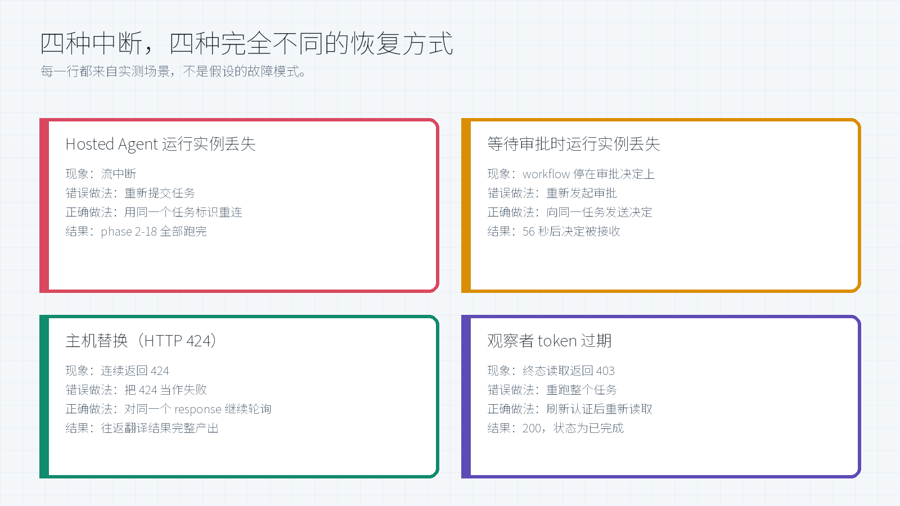
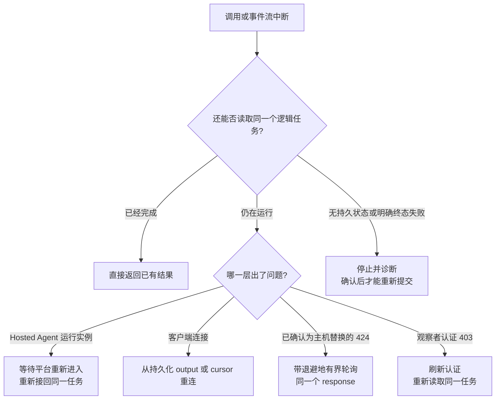
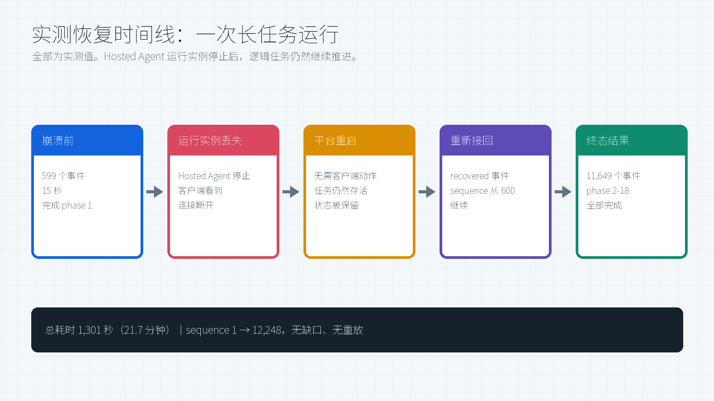
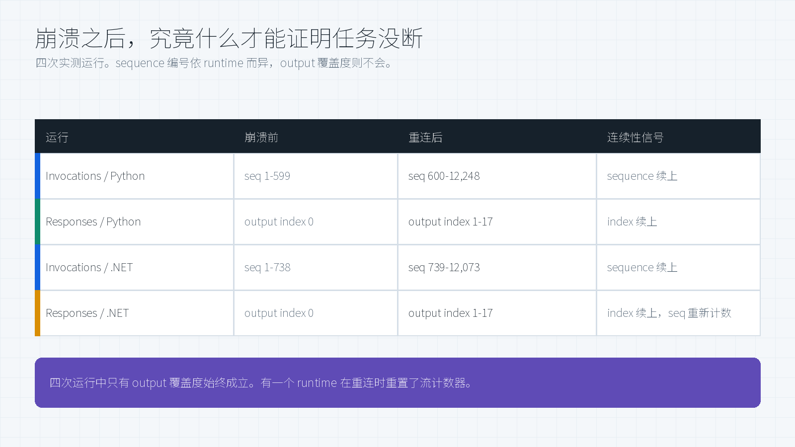

# Microsoft Foundry Hosted Agent：长任务可靠运行与故障恢复

[](#6-评估方法与逻辑验证)
[](#4-实测效果)
[](#22-三种集成层级同一种恢复模型)
[](LICENSE)

这项能力帮助 Microsoft Foundry Hosted Agent 在 Foundry 托管的运行实例消失、客户端断线或工作流等待人工审批时，继续完成需要几分钟甚至几小时的任务。本文先说明它为客户解决什么问题，再解释系统框架和恢复原理，最后给出不同故障场景下的恢复方法与实测证据。

> **这篇文章是什么。** 一次 private preview 评估中的实测行为与恢复经验。
> **不是什么。** 这里**不包含 preview SDK 源码、实现代码、部署配方、API schema，也不包含原始 telemetry**——因为长任务能力当时仍处于 private preview。文中数字是那次评估的观测值，不是服务级承诺，也不代表所有区域、模型和拓扑都是同样表现。

> **Author:** 魏新宇 (Xinyu Wei)

[English](README.md) | 中文 | [Hosted agents 概览](https://learn.microsoft.com/en-us/azure/foundry/agents/concepts/hosted-agents) | [Hosted agent 快速入门](https://learn.microsoft.com/en-us/azure/foundry/agents/quickstarts/quickstart-hosted-agent)

---

## Executive Summary

### 这项技术实现了什么

如果没有可靠的长任务执行能力，一次运行实例丢失就可能让 Agent 从头执行昂贵的工作流、丢失待审批状态，甚至重复调用外部系统。本次评估的能力把**逻辑任务**与**运行进程**分离：任务拥有稳定身份，输入和进度不会随进程消失，替代进程能够从持久化检查点重新进入。

**这里的“运行实例”是什么。** Hosted Agent 是客户自己的 Agent 代码，以 container image 形式交付。Foundry 把它运行在每个 session 独立的 VM-isolated sandbox（虚拟机隔离沙箱）中，并负责其生命周期。本文把当时正在运行的那份代码称为 **Hosted Agent 运行实例**。它不是需要客户单独运维的 Docker 容器。实例丢失会带走进程、内存和现有连接，但不会因此自动删除 Hosted Agent 定义、session，或记录在进程之外的逻辑任务。

| 客户最关心的问题 | 答案 |
|---|---|
| 它解决什么业务问题？ | 在本次实测场景中，长时间 Research、工作流和审批任务没有因为一个 Hosted Agent 运行实例或一条客户端连接结束而被放弃。 |
| 客户实际获得什么？ | 一套可评估的设计路径：从持久化进度继续而不是从头重跑；输出可重新接回；人工审批可跨进程等待；运行中的任务可以受控转向。 |
| 整体框架是什么？ | Foundry Hosted Agent 负责托管、身份、端点、session 状态和生命周期；长任务层提供持久任务身份、恢复入口和可重连事件流；Agent framework 或业务应用负责有业务含义的 checkpoint 与外部副作用幂等。 |
| 是否绑定某一种 Agent framework？ | 不绑定。整体模型与 framework 无关：Microsoft Agent Framework 提供最高层集成，Responses 提供平台托管的 protocol 路径，Invocations 提供更底层的控制。 |
| 故障后如何恢复？ | 继续使用同一个逻辑任务引用，从 checkpoint 还原业务进度，重新进入 handler，并用持久化 workload 输出而不是旧 socket 判断任务是否连续。 |
| 覆盖了哪些故障？ | 运行中的 Hosted Agent 实例丢失、等待人工审批时实例丢失、主机替换并连续返回 HTTP 424、观察者凭据过期、证据截断，以及主动 steering。 |
| 实测结果是什么？ | 八个主场景全部完成。其中一个 21.7 分钟任务在 phase 1 后恢复并跑完 phase 2-18；一次审批决定在崩溃后 **56 秒**被接收；另一次任务连续经历 **29** 个 424 后完成。 |
| 哪些结论尚未建立？ | 尚未证明生产可用性、SLA、负载行为、多区域恢复、模型质量和业务正确性。 |

**客户决策：** 当前证据足以支持针对自身 workload 开展受控评估，但不能单独作为生产放行依据。

**一句话恢复契约：** 保留同一任务身份，把业务进度持久化在进程之外，让外部副作用具备幂等性，并以持久化输出或服务端终态确认恢复成功。

### 按角色阅读

| 读者 | 打开本文后首先要回答的问题 | 建议入口 |
|---|---|---|
| 技术决策者 | 客户收益发生了什么变化？现有证据是否值得投入评估？ | [客户收益](#1-客户收益长任务不再绑定单个进程) |
| 解决方案架构师 | 托管、持久任务、checkpoint 和客户端恢复分别由谁负责？ | [系统架构](#2-系统架构与恢复原理) |
| Agent 工程师 | 哪些状态必须比进程活得更久？用什么信号证明仍是同一任务？ | [恢复契约](#24-恢复契约) |
| 运维 / SRE | 应该重新接回、继续执行、保持轮询、刷新凭据，还是停止？ | [恢复手册](#3-故障判断与恢复手册) |
| 评审 / 风险负责人 | 哪些结论来自实测，哪些是推导，还有哪些没有证明？ | [证据与边界](#8-证据边界与采用门槛) |

**本文能够支持的决策：** 进入面向自身 workload 的受控评估。不能把 8/8 场景完成等同于生产可用性；生产放行仍需重复试验、失败预算、外部副作用幂等测试、负载与并发测试，以及对当前产品能力的重新核验。

---

## 1. 客户收益：长任务不再绑定单个进程

普通 Agent 调用通常在一个进程存活期间返回或失败。长任务多了第三种状态：**当前运行实例已经消失，但逻辑任务仍然有效。** 因此，可靠性不能再定义成“永远保住同一个进程”，而应定义成“任务始终可寻址、可恢复，并且能够安全继续”。

### 1.1 使用前后有什么变化

| 客户场景 | 绑定进程时的行为 | 具备恢复能力后的行为 | 客户价值 |
|---|---|---|---|
| 20 分钟 Research 任务 | 运行实例丢失后从头重跑或直接放弃 | 替代运行实例从持久化进度重新进入同一任务 | 保住已完成阶段，避免重复支付模型和工具成本 |
| 人工审批 | 待审批选择和工具上下文可能随进程消失 | 审批继续绑定在同一个挂起任务上 | 用户可以稍后决策，无需重新生成审批请求 |
| 客户端或网络断线 | 流断开被误判为任务失败 | 任务独立继续，客户端重新接回或读取终态 | 用户网络不再决定任务能否存活 |
| 运行中改变方向 | 客户端同时抢跑取消、重启和新请求 | 新输入进入队列，在安全边界切换 | 从并发冲突变为可控 steering |

核心变化是从**进程绑定执行**转向**任务绑定执行**。Hosted Agent 运行实例可以被替换，真正需要长期有效的是逻辑任务身份、业务进度和终态结果。

### 1.2 公开平台能力基线

Microsoft Foundry Hosted Agent 把客户的 Agent 代码运行在微软托管、按 session 隔离的计算环境中。公开平台提供：

| 公开概念 | 提供的能力 |
|---|---|
| Hosted Agent | 把客户代码和 framework 打包成 image，通过托管端点提供服务 |
| Session | 隔离计算，以及跨空闲回收和恢复仍然保留的 `$HOME` / 文件 |
| Conversation | 持久化消息与工具调用历史，主要服务于 Responses |
| Agent identity | Agent 访问模型、工具和下游系统时使用的独立 Microsoft Entra 身份 |
| 生命周期与可观测性 | 托管 provisioning、deprovisioning、扩缩、健康集成和 telemetry |

来源：[Foundry Agent Service 中的 Hosted agents](https://learn.microsoft.com/en-us/azure/foundry/agents/concepts/hosted-agents)。

这些公开能力建立了托管基线，但**不能单独证明活跃任务在进程丢失后仍能继续**。后者才是本次 private preview 评估要验证的能力。

### 1.3 公开能力与本次评估的边界

| 层次 | 公开文档（2026 年 7 月 21 日更新） | 本次评估 | 结论边界 |
|---|---|---|---|
| Session 状态 | 空闲计算恢复时还原 `$HOME` 与 `/files` | 活跃任务在注入运行实例丢失后继续 | 空闲恢复与实测结果一致，但不能代替活跃任务恢复证据 |
| Responses | 平台托管 conversation history、streaming lifecycle 和后台轮询 | 同一 response 跨恢复交付 output index 0-17 | 证明的是这一次 response，不是所有 workload 的 SLA |
| Invocations | 应用自行负责 payload、session 语义、task tracking 和轮询 | 观察到显式恢复事件和 phase 1-18 | 应用仍须正确处理 checkpoint 和外部副作用 |

---

## 2. 系统架构与恢复原理


### 2.1 四层责任边界

| 层次 | 负责什么 | 必须长期有效的内容 | 不能单独证明什么 |
|---|---|---|---|
| Foundry Hosted Agent 平台 | Runtime sandbox、endpoint、identity、session / conversation 状态和生命周期 | 能够启动替代运行实例，并继续寻址同一 session / task | 业务进度已经正确 checkpoint |
| 长任务执行层 | 稳定任务身份、持久化输入、恢复入口、task / stream 状态 | 逻辑任务记录跨进程存在 | 外部业务动作可以安全重复 |
| Agent framework / 业务应用 | 有业务含义的 checkpoint、workflow 阶段、审批状态和终态结果 | 足以安全恢复的业务进度 | 客户端一定能够正确重连 |
| 客户端 / 运维 | 稳定任务引用、重连游标、有界轮询和认证刷新 | 断线后仍能观察同一个逻辑任务 | 传输错误等于 workload 失败 |

最重要的设计原则是：**运行实例状态、业务任务状态、观察者状态属于三个不同的故障域。** 其中一层出问题，不能自动升级成其他层也失败。

### 2.2 三种集成层级，同一种恢复模型

| 集成层级 | 平台提供什么 | 客户负责什么 | 适用场景 |
|---|---|---|---|
| Foundry hosting 上的 Microsoft Agent Framework | 基于 Responses 的最高层集成，大部分生命周期能力由 framework 接好 | 开启相应配置，并提供 framework checkpoint 和安全的外部副作用处理 | 希望尽量少写恢复 plumbing 的团队 |
| Responses protocol | OpenAI 兼容协议、conversation history、streaming lifecycle、后台执行、轮询和取消 | 开启恢复能力、保留业务 checkpoint、验证 output 连续性 | 对话型或工具型 Agent |
| Invocations protocol | 任意请求 / 响应 schema 和原始 streaming 控制 | 自己负责 session / task 语义、事件 schema、checkpoint 映射、轮询和恢复 | 结构化 workflow 与自定义协议 |

恢复模型与 framework 无关。LangGraph、Microsoft Agent Framework 或手写 orchestration 都可以接入；但无论使用哪一种，都必须由业务应用定义“哪些步骤已经完成”，并保证恢复时不会重复提交外部副作用。

### 2.3 故障后如何恢复

1. **始终寻址同一个逻辑任务。** 客户端启动任务后，保留其稳定引用。
2. **执行前先持久化。** 长任务层保存任务身份、输入和后续重新定位所需的 metadata。
3. **记录业务进度。** Agent framework 或业务应用保存 phase、watermark、审批状态，或指向外部状态的引用。
4. **运行实例丢失。** 旧进程、内存和 socket 消失，但持久化的任务记录仍然存在。
5. **替代运行实例重新进入。** Foundry 启动新的 Hosted Agent 运行实例，并用恢复上下文重新调用同一逻辑任务。
6. **从安全边界继续。** 应用加载 checkpoint，识别已经提交的外部副作用，避免重复执行。
7. **客户端重新接回并验证。** 客户端继续观察同一任务，并根据持久化输出或服务端终态判断恢复是否成功。

**用一个实测例子走一遍。** 在 18 个 phase 的 Research 任务中，Hosted Agent 运行实例丢失前已经完成 phase 1。替代运行实例重新进入同一个逻辑任务，恢复业务进度，并继续完成 phase 2-18；客户端随后重新接回，读取后续输出。这里要区分两件事：任务恢复不依赖原客户端连接一直存在；客户端重新接回，是为了继续观察任务。

### 2.4 恢复契约

| 契约要素 | 为什么必须有 | 缺失后的风险 |
|---|---|---|
| 稳定任务身份 | 区分“恢复已有任务”和“重新提交新任务” | 重复执行，责任归属不清 |
| 持久化业务 checkpoint | 告诉替代进程哪些步骤已经完成 | 从头重跑或重复阶段 |
| Idempotency key / 外部副作用保护 | 防止审批、预订、写入或 tool call 被提交两次 | 重复外部动作 |
| 显式终态 | 区分“流结束”和“任务完成” | 误报成功或误报失败 |
| Workload 级连续性信号 | 即使传输计数器重置，也能证明 phase / output 完整 | 因 protocol 差异产生误报 |

### 2.5 恢复不是什么

- 不是复活原来的进程或 socket。
- 不是确定性重放每一条指令、模型调用或 tool call。
- 不是把原始请求作为一个新任务重新提交。
- 不能因为 Agent version 显示 `active` 就认为恢复能力已经成立。
- 如果不能识别已经提交的外部副作用，恢复过程就不安全。

恢复设计必须按 **at-least-once execution（至少执行一次）**考虑。最后一个持久化 checkpoint 之后已经做过、但尚未被 checkpoint 记录的工作，可能在进程丢失后再次执行。Checkpoint 粒度决定重做窗口；idempotency key、compare-and-set 写入和持久化外部操作 ID 用来防止重做演变成重复业务动作。

---

## 3. 故障判断与恢复手册



### 3.1 先判断到底是哪一层失败



这棵判断树有意采用保守策略：**在确认已有任务终态失败或已经无法寻址之前，不创建新任务。**

### 3.2 活跃任务运行中实例丢失

| 项 | 内容 |
|---|---|
| 现象 | 事件流停止，没有终态；当前 Hosted Agent 运行实例已经消失 |
| 真正失败的对象 | 一个执行进程，不一定是逻辑任务 |
| 错误反应 | 重新提交整个任务 |
| 正确恢复 | 让平台重新进入同一个逻辑任务，再用原任务引用和最后持久位置重新接回 |
| 应用责任 | 加载 checkpoint，并抑制已经提交过的外部副作用 |
| 确认方式 | 同一任务出现恢复标记或 workload output 继续，最后读取显式终态 |
| 实测结果 | 运行实例丢失后继续完成 phase 2-18 |

### 3.3 等待人工审批时运行实例丢失

| 项 | 内容 |
|---|---|
| 现象 | 当前没有活跃执行，也没有流；workflow 停在审批决定上 |
| 真正失败的对象 | 运行实例；挂起 workflow 和审批上下文仍然持久存在 |
| 错误反应 | 从头重建审批请求 |
| 正确恢复 | 重启后把决定发送给同一个逻辑任务，由持久化 checkpoint 唤醒 workflow |
| 应用责任 | 决定只生效一次，并保留最初展示给用户的具体选项 |
| 确认方式 | 审批后的路径以同样选择走到显式终态 |
| 实测结果 | 运行实例丢失 56 秒后决定被接收，再过 7 秒得到终态确认 |

### 3.4 客户端或网络断线

| 项 | 内容 |
|---|---|
| 现象 | 调用方失去 SSE / HTTP 连接，但 workload 没有终态失败 |
| 真正失败的对象 | 观察通道 |
| 错误反应 | 认为 Agent 已经停止，再提交一次 |
| 正确恢复 | 用持久化 output 位置重新接回同一个逻辑任务，或读取其当前状态 |
| 确认方式 | Output / phase 覆盖继续推进，且没有重复业务结果 |
| 客户端责任 | 任务引用必须独立于 socket 保存 |

### 3.5 主机替换期间返回 HTTP 424

| 项 | 内容 |
|---|---|
| 现象 | 主机替换期间，同一个 response 反复返回 `424 Failed Dependency` |
| 错误反应 | 把第一个 424 当作业务终态失败，或重新提交 |
| 正确恢复 | 只在确认属于这类主机替换后，对同一个 response 做有界退避轮询 |
| 安全边界 | 不能把所有 424 一律设为可重试；其他原因必须分别处理 |
| 确认方式 | 同一个 response 完成，并包含全部预期阶段 |
| 实测结果 | 连续 29 个 424 后完成 |

### 3.6 观察者凭据过期

| 项 | 内容 |
|---|---|
| 现象 | 长任务结束后读取终态返回 `403` |
| 真正失败的对象 | 观察者授权，而不是 workload |
| 错误反应 | 重新运行整个 workload |
| 正确恢复 | 刷新观察者认证，再对同一任务执行只读查询 |
| 确认方式 | 返回 `200` 和 completed 终态 |
| 实测结果 | 刷新 token 后读取到 completed，共 18 个 output item |

### 3.7 证据截断

| 项 | 内容 |
|---|---|
| 现象 | 保存的日志或事件流在字节上限或时间上限处停止 |
| 真正失败的对象 | 证据采集 |
| 错误反应 | 根据最后一行日志推断 workload 失败 |
| 正确恢复 | 直接查询持久化状态，或重新采集完整事件流 |
| 确认方式 | 终态来自服务端读取，而不是日志尾部 |

### 3.8 主动 Steering

| 项 | 内容 |
|---|---|
| 现象 | 当前 turn 仍在运行时，用户发来新的指令 |
| 错误反应 | 强杀旧 turn，并让新任务与旧任务并发竞争 |
| 正确恢复 | 新输入先排队，让当前 turn 在安全边界停止，再沿同一 conversation chain 继续 |
| 确认方式 | 旧 turn 协作式结束，新输入到达终态答案 |
| 实测结果 | Turn 2 进入 queued，经历 7 次 `in_progress` 轮询后完成 |

---

## 4. 实测效果

### 4.1 运行实例丢失：任务并没有停



Python Invocations research 运行：

| 阶段 | 实测值 |
|---|---|
| 崩溃前 | 15 秒内 599 个事件，完成 phase 1，sequence 1-599 |
| 崩溃 | 流中断，客户端看到连接断开 |
| 重新接回 | 收到恢复事件，sequence 从 **600** 继续 |
| 重连之后 | 1,237 秒内 11,649 个事件，phase 2-18 |
| 终态 | 状态为已完成，任务因运行结束而挂起 |
| 总计 | **1,301 秒（21.7 分钟）**，sequence 1 到 12,248 |

重连后的流里带着 **192 个 status 事件和 17 个 phase 事件**。任务是真的在继续，而不是重新开始。

### 4.2 同一种中断，换一种 Protocol

Python Responses research 运行，共 11,584 条记录：

| 阶段 | 实测值 |
|---|---|
| 崩溃前 | 577 个事件，13 秒，output index 0，570 个文本增量 |
| 崩溃 | 崩溃流上报告了一个 failed response |
| 重新接回 | 观察到生命周期重放，sequence 从 578 继续 |
| 重连之后 | 11,005 个事件，1,140 秒，output index 1-17，10,918 个文本增量 |
| 终态 | 完成信号在重连后的流上收到 |
| 重连间隔 | **47 秒** |

output index 0 是崩溃前产出的，1-17 是崩溃之后产出的。**没有任何 index 重复，也没有任何 index 缺失**——这是能拿到的最强证据，说明它确实还是同一个逻辑 response。

### 4.3 用户决策期间运行实例丢失

这是最容易被低估的一种情况。Graph 停在审批点上，**当时根本没有任何东西在执行**。

| 时间（UTC） | 事件 |
|---|---|
| 12:22:54 | 任务启动 |
| 12:23:01 | 调用航班与酒店查询工具 |
| 12:23:07 | 针对三晚东京行程请求审批 |
| 12:24:27 | 注入 Hosted Agent 运行实例丢失 |
| 12:25:23 | 重启后发送审批决定 |
| 12:25:25 | Agent 恢复，给出**与崩溃前完全相同的航班与酒店选择** |
| 12:25:30 | 终态结果：确认号 `TRIP-182336` |

从崩溃到重启后审批决定被接收，**56 秒**；再过 7 秒拿到终态确认。待审批状态、工具调用结果、以及当初提供给用户的那几个选项，全都在一个已经不存在的进程之后活了下来。

同一模式在 Responses protocol 上的第二次运行，也拿到了自己的终态确认号 `TRIP-749637`。

> 这些是确定性的示例工具。确认号证明的是持久化 graph 状态和"决定只生效一次"，而不是真实的航班或酒店预订。

### 4.4 主机替换：29 次"失败"其实都不是失败

持久化 workflow 那次运行，在主机被替换期间**连续 29 次**收到 `HTTP 424 Failed Dependency`。客户端没有重新提交，而是继续轮询同一个 response，最终所有阶段完整产出。

最终持久化输出，原样转录：

```text
[French]
Le rapide renard brun saute par-dessus le chien paresseux.
[Spanish]
El rápido zorro marrón salta por encima del perro perezoso.
[Original English]
The quick brown fox jumps over the lazy dog.
[French]
Le rapide renard brun saute par-dessus le chien paresseux.
[Spanish]
El rápido zorro marrón salta por encima del perro perezoso.
[Round-trip English]
The quick brown fox jumps over the lazy dog.
```

如果客户端把第一个 424 当作终态错误，就会亲手丢掉一次马上就要成功的运行。如果在第十次放弃，结果也一样。

### 4.5 Steering：主动打断

不是所有中断都是故障。第一轮还在生成时，第二轮请求就到了：

| 步骤 | 观察到的现象 |
|---|---|
| 第一轮 | 计数任务，仍在运行 |
| 运行中发出第二轮 | 新问题，状态为 `queued` |
| 第一轮结局 | 协作式结束，标记为已完成 |
| 第二轮结局 | 7 次轮询处于 `in_progress`，随后 `completed` |
| 答案 | 新问题得到了正确回答 |

替换输入是被排队而不是被拒绝，旧的一轮在安全边界上收尾，而不是在生成到一半时被强杀。

---

## 5. 重连时该相信什么



这是本文最值得迁移到别处的一条结论。

| 运行 | 崩溃前 | 重连后 | 连续性信号 |
|---|---|---|---|
| Invocations / Python | seq 1-599 | seq 600-12,248 | sequence 续上 |
| Responses / Python | output index 0 | output index 1-17 | index 续上 |
| Invocations / .NET | seq 1-738 | seq 739-12,073 | sequence 续上 |
| Responses / .NET | output index 0 | output index 1-17 | index 续上，但 **sequence 从 5 重新计数** |

四次运行里有三次 sequence 编号是连续的，第四次不是：.NET Responses 的流在重连后**重置了计数器**，但仍然在同一个 response 上交付了 output index 1-17。

**实用规则：** 判断连续性要看 *workload 产出了什么*（output index、phase 编号、持久化状态），而不是看 *传输层怎么给帧编号*。另外，单调递增也不等于没有缺口——`10, 12` 是单调的，但中间少了一个事件。

---

## 6. 评估方法与逻辑验证

### 6.1 评估契约

| 维度 | 固定条件 | 为什么重要 |
|---|---|---|
| 执行窗口 | 2026 年 7 月 22-23 日 | 防止把早期受阻或不完整尝试混入最终 campaign |
| 托管环境 | Canada Central 同一个 Foundry project 中的八个 active Hosted Agents | 保持托管控制面和区域不变 |
| Runtime / protocol | Python 与 .NET；Responses 与 Invocations | 检查结论能否跨语言和 protocol 成立 |
| 范围 | 每个可运行 sample 的主场景 | 明确定义分母：**8 个场景** |
| 可接受证据 | 完整事件捕获或结构化客户端日志，加服务端终态 | 只有断流或文本相似的重新运行不能算通过 |
| 重复次数 | 每个场景一次被接受的端到端运行（**每场景 N=1**） | 这是能力验证，不是可靠性 benchmark |
| 排除变量 | 模型质量、业务正确性、负载、并发、成本、多区域行为 | 当前证据不能支持这些维度的结论 |

### 6.2 八场景结果矩阵


| # | Runtime / protocol | 场景与中断 | 必须满足的终态证据 | 结果 |
|---|---|---|---|---|
| 1 | Python / Invocations | Research；运行实例丢失 | 恢复标记、phase 1-18、任务完成 | **PASS** |
| 2 | Python / Responses | Research；运行实例丢失 | 同一 response、output index 0-17、完成且有 18 项 | **PASS** |
| 3 | .NET / Invocations | Research；运行实例丢失 | 恢复标记、phase 1-18、任务完成 | **PASS** |
| 4 | .NET / Responses | Research；运行实例丢失 | 同一 response、output index 0-17、完成且有 18 项 | **PASS** |
| 5 | Python / Invocations | 审批；挂起时运行实例丢失 | 重启后决定生效并得到终态确认 `TRIP-182336` | **PASS** |
| 6 | Python / Responses | 审批；挂起时运行实例丢失 | 恢复 lifecycle 及终态确认 `TRIP-749637` | **PASS** |
| 7 | Python / Responses | 持久化 workflow；主机替换 | French、Spanish 和 round-trip 输出完整完成 | **PASS** |
| 8 | Python / Responses | Steering；主动打断 | 第二轮排队、第一轮安全结束、第二轮完成 | **PASS** |

### 6.3 与 Protocol 对应的证据

| 关注点 | Responses | Invocations |
|---|---|---|
| 客户端契约 | OpenAI 兼容的 Responses 行为 | 应用自定义的请求与结果 schema |
| 历史 | 平台托管的 conversation | 应用自己管理的 session 与 task 状态 |
| 长任务入口 | Background stored response | 自定义 durable task |
| 观察到的恢复证据 | Lifecycle 事件重放或 output index 继续 | 显式 recovery event |
| 观察到的终态证据 | Response completion | Done event 加 task suspension reason |

两种 protocol 不会发出完全相同的事件。把某一种 protocol 的事件名写死到 validator 中，会在另一种 protocol 上误报失败。

### 6.4 验收标准

只有在中断之后，**完整既定计划仍然到达终态结果**，场景才算通过。部分恢复、重连后卡住，或者新任务产出了相似文本，都不算通过。分母为八个主场景；可选的 cancel、delete、deny 分支不在矩阵中，本文未验证。

### 6.5 七维逻辑审计

| 方法 | 要挑战的问题 | 证据 | 结论 |
|---|---|---|---|
| 证真 | 同一个逻辑任务是否到达终态？ | 同一任务引用、服务端终态、完整 phase / output 覆盖 | 八个场景均得到支持 |
| 证伪 | 会不会只是新任务重跑，看起来像恢复？ | 同一 response 在中断前有 output index 0，重连后有 1-17 | Responses Research 排除了“新任务重跑”解释 |
| 穷举 | 是否只挑了看起来成功的样例？ | 固定八个主场景作为分母 | 8/8 通过；辅助分支明确排除 |
| 反证 | 如果 sequence 连续是必要条件，有效恢复是否都应满足？ | .NET Responses 正常恢复，但 sequence 从 5 重新计数 | “必须依赖 sequence”的通用规则被推翻 |
| 逆推 | 只有终态结果，能否证明发生过恢复？ | 还必须有 checkpoint、注入实例丢失、连接中断和重启后继续 | 仅有终态证据不足 |
| 类比 | 实测是否与公开平台概念一致？ | 公开 session persistence 与 protocol 责任边界 | 结果一致，但未用空闲恢复代替活跃恢复证据 |
| 一致性 | 结论能否跨 runtime 与 protocol 成立？ | Python / .NET 与 Responses / Invocations 配对 | Workload output 连续性成立，传输事件形态不一致 |

---

## 7. 设计建议

可以迁移到这次 preview 之外的几点：

1. **在能说清楚的边界上做 checkpoint。** "18 个阶段完成了 7 个"是可恢复的，"跑到中间某处"不是。
2. **给任务一个比进程活得更久的身份。** 恢复是去寻址一个逻辑任务，而不是接上一个 socket。
3. **把观察者故障和任务故障分开。** Token 过期是你自己的问题，不是任务的问题。
4. **不能只看 observer 或托管层状态就判定业务失败。** 先分类原因、核对持久化状态，只对已经明确为该故障条件下瞬时错误的状态执行重试。
5. **让终态显式化。** 流"结束了"并不等于有结果。
6. **明确审批决定归谁负责。** 被执行两次，比晚一点执行更糟。
7. **区分挂起任务和活跃任务。** 停在审批点的 graph 没有活跃 workflow 执行，其运行实例可能按平台生命周期被回收；这是预期行为，不是任务失败。

---

## 8. 证据、边界与采用门槛

### 8.1 边界与限制

- 文中数字是**一次评估的观测值**，不是 benchmark、保证或 SLA。
- 长任务能力当时处于 **private preview**，其实现、包、API 和部署配方不在此公开。
- 结果覆盖**八个文档定义的主场景**，可选的 cancel、delete、deny 分支不计入。
- 验证的是恢复行为，不包括业务领域正确性和模型质量。
- 在依据本文做设计之前，请以[官方文档](https://learn.microsoft.com/en-us/azure/foundry/agents/concepts/hosted-agents)核对当前能力。

### 8.2 证据来源

文中每个数字都能追溯到那次评估捕获的原始产物：

| 声明 | 来源产物类型 |
|---|---|
| 事件数量、sequence 区间、耗时 | 逐场景捕获的事件流 |
| Phase 与 output index 覆盖度 | 对这些捕获流的分析 |
| 审批时间线与确认号 | 客户端会话日志 |
| 424 重试行为与阶段输出 | Workflow 客户端日志 |
| Steering 排队与终态答案 | Steering 客户端日志 |

原始产物保留在私有边界内，因为其中包含 endpoint、任务标识、环境 metadata 和生成的 payload 文本。

### 8.3 生产采用门槛

在把这一模式用于某个具体生产 workload 之前，至少还要完成：

- 多轮故障注入，并明确 recovery-time objective 与失败预算；
- 对每个外部写入、审批、支付、预订和 tool side effect 做幂等测试；
- 覆盖并发 turn 和替代运行实例的负载与并发测试；
- 明确 timeout、cancel、retention、delete 和 dead-letter policy；
- 监控能够区分运行实例、workload、观察者和认证故障；
- 按目标区域、runtime 和 protocol 重新核对最新官方产品文档。

## 相关工作

| Repository | 关系 |
|---|---|
| [Foundry-Agent-Lifecycle-Build-Deploy-Operate](../Foundry-Agent-Lifecycle-Build-Deploy-Operate/) | 更完整的 build、deploy、operate 生命周期 |
| [Foundry-Hosted-Agent-Toolbox-Demo](../Foundry-Hosted-Agent-Toolbox-Demo/) | Hosted agent 的 tools、memory 与 skills |
| [Foundry-Agent-ModelOps-Governance](../Foundry-Agent-ModelOps-Governance/) | Operational-plane 边界梳理 |

## License

[MIT](LICENSE)
