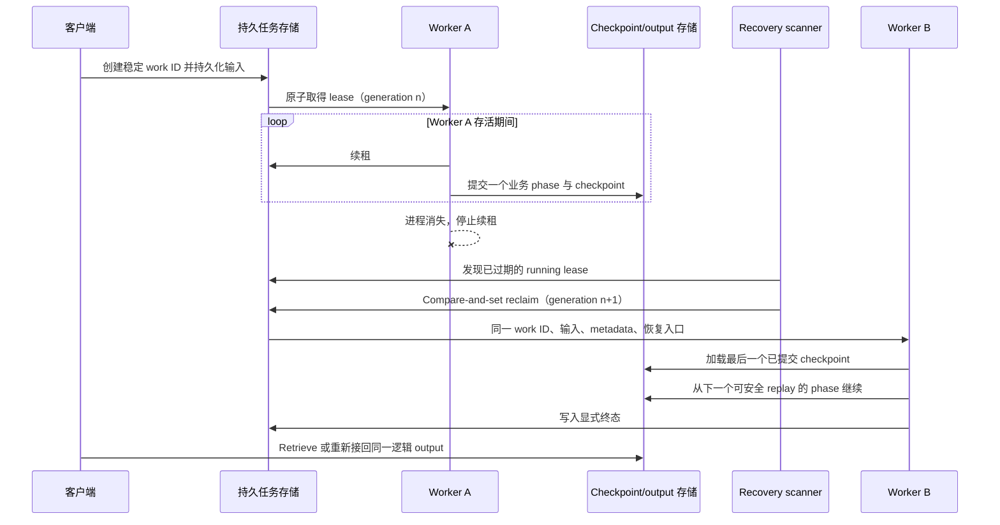
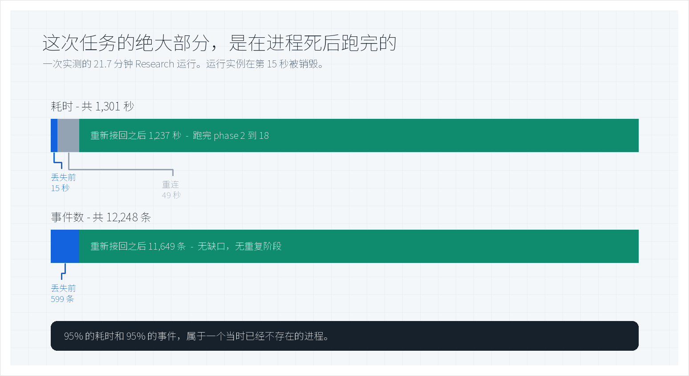
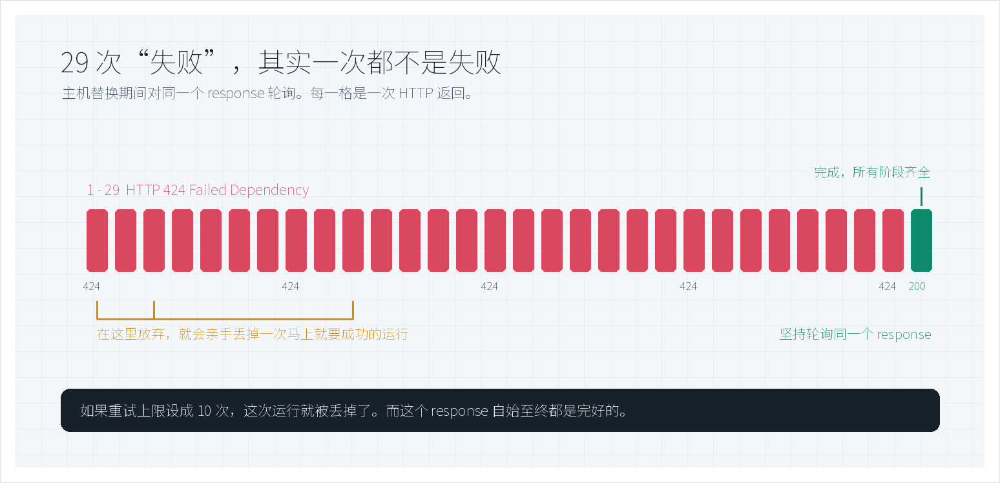
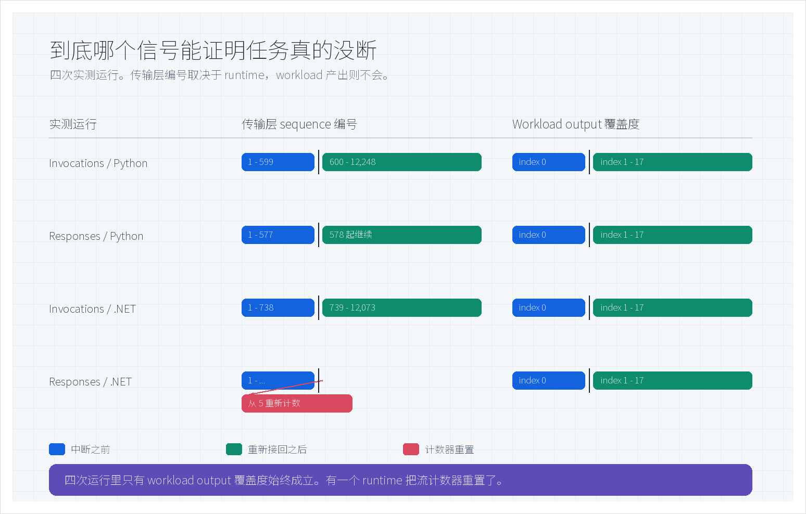

# Microsoft Foundry 长任务 Agent：进程死了之后，任务怎么活下来

[](#3-评估方法到底跑了什么)
[](#4-实测结果)
[](#23-三种集成层级)
[](LICENSE)

一个需要跑二十二分钟的 Research 任务，刚跑到第 15 秒、刚完成 18 个阶段里的第 1 个，我们主动销毁了执行它的进程。没有任何人重新提交。二十一分钟后，同一个任务报告完成——18 个阶段全部产出，12,248 条事件，没有缺口，也没有重复阶段。

其中 95% 的工作，是由一个已经不存在的进程完成的。

**本文中的每一次中断都是我们主动注入的，没有一次是线上事故。** 任何让工作负载连续跑二十分钟的平台，早晚都会遇到重启、崩溃、OOM 终止或重新部署——微软官方文档列举的，正是这几种需要靠 resilience 扛过去的事件。所以真正有价值的问题从来不是「进程会不会丢」，而是「进程丢了之后，**任务**还在不在」。这正是这八个场景要测的东西。

这篇文章讲清楚三件事：它为什么能成立、什么信号能证明它、以及哪些看起来非常合理的下意识反应反而会毁掉它。

> **这是什么。** Microsoft Foundry Hosted Agent 上长任务执行的恢复行为实测。该能力现已进入 **public preview**，并有[官方概念文档](https://learn.microsoft.com/en-us/azure/foundry/agents/concepts/long-running-agent-resilience)；第 3 节会对当前公共 SDK 契约做验证。文中八个场景是 7 月在更早的 private preview 构件上跑的——所以这里的每个数字都是有日期的证据，而不是对今天这版构件的断言。
> **不是什么。** 这里**不包含 Microsoft SDK 源码、完整 Agent 实现、端到端部署配方、私有 API schema，也不包含原始 telemetry**。官方声明没有 SLA、不建议用于生产——这与第 9.4 节的立场一致。文中每个数字都是观测值，不是服务级承诺。

> **Author:** 魏新宇（Xinyu Wei）

[English](README.md) | 中文 | [Hosted agents 概览](https://learn.microsoft.com/en-us/azure/foundry/agents/concepts/hosted-agents) | [Hosted agent 快速入门](https://learn.microsoft.com/en-us/azure/foundry/agents/quickstarts/quickstart-hosted-agent)

---

## 摘要

长任务 Agent 的失败方式和短调用不一样：**进程没了，但任务本身仍然有效。** 客户端如果把这种情况当成错误、直接重新提交，等于亲手放弃了还活着的任务，为两次运行付费，还可能把同一个外部动作提交两遍。

本次评估的能力，把**逻辑任务**和**执行它的进程**拆开：任务拥有持久身份，输入和进度不随进程消失，替代计算资源从最后一个 checkpoint 重新进入。八个场景覆盖两种语言、两种 protocol、四类中断，全部在被打断之后走到了各自既定的终态。

| 实测项 | 数值 | 意义 |
|---|---|---|
| 注入进程丢失之后完成的工作占比 | 1,301 秒中的 **95%**，12,248 条事件中的 95% | 丢掉进程，不等于丢掉任务 |
| 从运行实例丢失到审批决定被接收 | **56 秒**，且原有选项保持不变 | 待决策的人工审批能比持有它的进程活得更久 |
| 正常完成前连续收到的 `HTTP 424` | **29 次** | 重试上限设成 10 次，就会丢掉一次健康的运行 |
| 走到既定终态的场景数 | **8 / 8**，每个场景一次被接受的运行 | 属于能力验证，不是可靠性 benchmark |
| 传输层 sequence 能证明连续性的运行数 | **3 / 4** | 有一个 runtime 重置了计数器；workload output 四次全部成立 |

**这些证据还不能说明什么：** 生产可用性、SLA、负载与并发下的表现、多区域恢复、成本，以及业务正确性。每个场景只跑了一次。它足以支撑立项做受控评估，但不足以作为生产放行依据。

---

## 1. 背景：长任务的第三种结局

短调用只有两种结局，要么返回，要么抛错。跑二十分钟的 Agent 多了第三种：进程消失了，任务却仍然有效。

这个窗口期里有三件事可能发生。运行实例可能停止——崩溃、重新部署、主机替换，或者某个生命周期动作。客户端的流可能中断，而且始终没收到终态事件。用户也可能跑到一半改主意。

这三件事都不是“重试一次请求”能解决的。重试会开启一个**新**任务，同时丢下那个还活着的旧任务。于是你有了两个任务，要为两个付费，第一个已经提交过的外部动作还可能再来一遍。这是这个领域代价最高的一个下意识反应，也是本文后面通篇讲**重新接回**而不是讲重试的原因。

### 这里说的“运行实例”是什么

Hosted Agent 是客户自己的 Agent 代码，以 container image 的形式交付。Foundry 把它跑在按 session 隔离的 VM 沙箱里，并负责它的生命周期。本文所说的**运行实例**，指的就是当时正在运行的那份代码。

它不是需要客户自己运维的 Docker 容器。实例丢失，带走的是进程、内存和已有连接；它不会删掉 Hosted Agent 定义，不会删掉 session，也不会删掉任何记录在进程之外的任务——这个区别，正是整件事成立的前提。

### 平台本身已经提供了什么

公开平台提供的是托管基线：按 session 隔离、跨空闲回收仍然保留的 `$HOME` 和 `/files`、持久化的对话历史、独立的 Microsoft Entra 身份，以及托管的生命周期与可观测性（[来源](https://learn.microsoft.com/en-us/azure/foundry/agents/concepts/hosted-agents)）。

但这些文档回答不了一个问题：**你自己的 workload，在活跃执行被打断之后能否正确恢复。** 空闲状态还原和活跃任务恢复，是两个不同的命题。本次评估针对的是后者。

| 层次 | 公开文档（2026 年 7 月 21 日） | 本次实测 | 结论边界 |
|---|---|---|---|
| Session 状态 | 空闲计算恢复时还原 `$HOME` 与 `/files` | 活跃任务在注入运行实例丢失后继续 | 空闲还原与实测一致，但不能代替活跃任务恢复的证据 |
| Responses | 平台托管对话历史、streaming lifecycle 和后台轮询 | 同一 response 跨恢复交付 output index 0-17 | 证明的是这一次 response，不是所有 workload 的 SLA |
| Invocations | 应用自行负责 payload、session 语义、task tracking 与轮询 | 观察到显式恢复事件和 phase 1-18 | 应用仍须自己保证 checkpoint 和外部副作用正确 |

### 为什么这件事只能发生在 Hosted Agent 上

Foundry 有两类 agent。Prompt-based agent 由配置定义，不承载你自己的容器或代码包；Hosted agent 则是在托管沙箱里跑**你自己的**代码。

这个区别直接决定了整件事能不能成立。恢复的动作是用同一个 work identity 和同一份输入**重新进入你的 handler**——那就必须先有一个属于你的 handler 可供进入。Prompt-based agent 没有应用运行时可供 checkpoint，没有地方记录“第 7 个 phase 已提交”，也没有任何持久任务记录可供恢复机制重新获取 lease。

微软官方文档现在也把这个结论写明了：**“Run long-lived work resiliently——跨进程中断保留执行中的 agent 任务，并向重连客户端重放流式结果”**被列为选择 Hosted agent 而非 prompt-based agent 的理由之一（[来源](https://learn.microsoft.com/en-us/azure/foundry/agents/concepts/hosted-agents)）。

对生产设计的实际含义：如果一个 workload 要跑上几分钟，而且副作用不允许重复，那么 agent 类型这一步其实已经替你定了——它发生在架构选型阶段，远早于你去配置任何恢复选项。

---

## 2. 原理：寻址任务，而不是抢救进程

<div align="center"></div>

整套机制只建立在一个想法上：**给任务一个比进程活得更久的身份，然后重新进入这个任务，而不是去抢救那个进程。**

落到执行上是七步。客户端启动一个逻辑任务，并保留它的稳定引用。执行开始之前，长任务层先把任务身份、输入，以及后续重新定位所需的租约 metadata 持久化下来。Agent 运行过程中，不断记录有业务含义的进度——phase 编号、watermark、审批状态，或者一个指向外部状态的引用。接着运行实例丢失：进程、内存、socket 全都消失，但那条持久化记录还在。Foundry 提供替代计算资源，同一个逻辑任务带着恢复上下文被重新调用，应用加载自己的 checkpoint 并从一个明确的边界继续，最后客户端重新接回、确认连续性。

把那次 18 阶段的实测运行套进这七步，顺序就变得很具体：第一到第三步覆盖 phase 1，第四步销毁进程，第五、六步跑完 phase 2 到 18，客户端在第七步才重新接回。注意这个**时间点**——任务的恢复，与有没有人在旁边看着无关。重新接回恢复的是观察，不是执行。正因为如此，客户端断流才只是一次断流，而不是一次事故。

### 2.1 四层责任必须分开

分清楚这四层，是设计工作的大头，因为它决定了出问题时你有资格得出什么结论。

| 层次 | 负责什么 | 必须保持有效 | 不能单独证明什么 |
|---|---|---|---|
| Foundry Hosted Agent 平台 | 运行沙箱、endpoint、身份、session 与对话状态、生命周期 | 能够提供替代计算资源，并继续寻址同一 session | 业务进度已经被正确 checkpoint |
| 长任务执行层 | 稳定任务身份、持久化输入、恢复入口、task 与 stream 状态 | 逻辑任务记录跨进程存在 | 外部业务动作可以安全重复 |
| Agent framework 或业务应用 | 有业务含义的 checkpoint、workflow 阶段、审批状态、终态结果 | 足以安全恢复的业务进度 | 客户端一定会正确重连 |
| 客户端与运维 | 稳定任务引用、重连游标、有界轮询、认证刷新 | 断线后仍能观察到同一个逻辑任务 | 传输层报错等于 workload 失败 |

一句话原则：**运行实例状态、业务任务状态、观察者状态，是三个不同的故障域。** 其中一层出问题，绝不能自动升级成另外两层也失败。第 6 章本质上就是把这条原则做成了一张速查表。

### 2.2 恢复是 at-least-once，这部分责任在你

被恢复的 handler 会带着同样的任务身份和输入重新进入。它**不会**重放你代码的执行过程，也不会从中断处续跑某一次模型调用或 tool call。

由此带来一个躲不掉的后果：最后一个持久化 checkpoint 之后做过的工作，可能会再做一遍。Checkpoint 的粒度决定了这个重做窗口有多大，而 idempotency key、compare-and-set 写入、持久化的外部操作 ID，才是阻止“重做”变成“重复下单、重复付款、重复写入”的东西。

所以有必要把话说明白，恢复**不是**这些：不是复活旧 socket；不是确定性重放；不是把原始请求当作新任务重新提交；不能因为 Agent version 显示 `active` 就认为它成立——那只说明控制面接受了一个部署；如果重新进入时无法识别并跳过已经提交的外部副作用，它甚至谈不上安全。

### 2.3 三种集成层级

这套模型与 framework 无关。层级之间的差别，只在于有多少需要你自己接。

| 层级 | 平台负责 | 你仍然要负责 | 适用场景 |
|---|---|---|---|
| Foundry hosting 上的 Microsoft Agent Framework | 基于 Responses 的最高层集成，大部分生命周期行为已经接好 | 配置、framework checkpoint、安全的外部副作用 | 希望尽量少写恢复代码的团队 |
| Responses protocol | OpenAI 兼容协议、对话历史、streaming lifecycle、后台执行、轮询、取消 | 开启恢复能力、保留业务 checkpoint、验证 output 连续性 | 对话型和工具型 Agent |
| Invocations protocol | 只提供传输和底层原语 | session 与 task 语义、事件 schema、checkpoint 映射、轮询、恢复行为 | 结构化 workflow 与自定义协议 |

LangGraph、Microsoft Agent Framework、手写 orchestration 都能接进来。但没有任何一种能替你定义“哪些步骤算已经做完了”。

### 2.4 LRA 核心：持久任务、租约与恢复重入

本节后面的客户端代码**不是** LRA 核心。真正的核心，是一个 runtime state machine：即使 worker 进程已经消失，它仍然保留逻辑任务的身份与输入。下面的模型不绑定具体方法名或存储 schema；第 2.5.3 节再把它映射到当前公开 API。

| 核心原语 | 持久化职责 | 故障规则 |
|---|---|---|
| Work record | 稳定的任务与输入身份、持久化输入、状态、retry state、小型 metadata | 替代 worker 收到同一个身份与输入，不创建新任务 |
| Lease | 当前唯一 owner、lease generation 与过期时间 | 活跃 worker 持续续租；进程丢失只会遗弃 lease，不写入虚假终态 |
| Atomic reclaim | 对过期 lease 做 compare-and-set 接管 | 只有一个替代 worker 能推进 lease generation 并重新进入任务 |
| Progress reference | 小型 watermark，或指向 framework/application checkpoint 的引用 | 最后一个已提交 checkpoint 之后的工作可能再次执行 |
| Durable output state | 已 checkpoint 的 response snapshot、stream event 与显式终态 | 观察者从已提交 output 重建；连接关闭本身不等于完成 |



旧进程无法捕获自己的硬崩溃。恢复之所以发生，是因为 lease 不再续期；后续 scanner 发现它已过期，再由一个新 worker 原子接管同一条记录。Lease generation 用来阻止 split-brain：generation $n+1$ 已经取得所有权后，generation $n$ 的旧 worker 不能再提交结果。

#### 2.4.1 概念级 runtime loop

下面的伪代码描述 runtime contract，不是 private SDK 或其数据库实现：

```python
def recover_expired_work(now):
	for work in task_store.list_expired_running(now):
		claim = task_store.reclaim_if_lease_matches(
			work_id=work.id,
			expected_generation=work.lease_generation,
			new_owner=worker_id,
		)
		if not claim.acquired:
			continue

		run_claimed_work(work, claim, entry_mode="recovered")


def run_claimed_work(work, claim, *, entry_mode):
	# Runtime 在用户代码执行期间持续续租，并使用 generation 防止旧 owner 提交。
	with task_store.renew_lease_while_running(work.id, claim.generation):
		invoke_handler(
			work_id=work.id,
			persisted_input=work.input,
			metadata=work.metadata,
			checkpoint=progress_store.load_checkpoint(work.id),
			entry_mode=entry_mode,
			lease_generation=claim.generation,
		)


def run_handler(context):
	for phase in plan.remaining_after(context.checkpoint):
		phase_key = f"{context.work_id}:{phase}"
		result = execute_phase(
			context.persisted_input,
			phase,
			idempotency_key=phase_key,
		)
		commit = progress_store.commit_phase_once(
			work_id=context.work_id,
			expected_checkpoint=context.checkpoint,
			phase=phase,
			result=result,
			side_effect_ids=result.side_effect_ids,
			lease_generation=context.lease_generation,
		)
		output_store.project_snapshot(commit)  # 幂等、可重建的 projection。
		context.checkpoint = commit.checkpoint

	task_store.mark_completed(
		context.work_id,
		generation=context.lease_generation,
	)
```

真正重要的不是函数名，而是五个 invariant：

1. **Reclaim 必须带条件。** 过期 lease generation 仍然匹配时才能接管，否则说明已有其他 worker 取得所有权。
2. **Heartbeat 归 runtime 所有。** 用户代码运行期间 lease 持续续期；每个持久化写入都由当前 lease generation 做 fence，旧 worker 不能提交。
3. **恢复是 at-least-once。** 外部动作完成、phase commit 尚未落盘时崩溃，这个 phase 可能再次执行；相同 `phase_key` 必须能去重该动作。
4. **进度只能有一个权威存储。** `commit_phase_once` 同时推进业务 checkpoint，并记录 result / side-effect identity。面向客户端的 output snapshot 是幂等、可从 commit 重建的 projection，不是第二个 source of truth。
5. **原始 deadline 不会重置。** 恢复改变的是 worker 与 lease generation，不是逻辑任务的身份、输入或 wall-clock recovery objective。

LRA runtime 负责把同一个任务重新送进 handler，却无法判断支付、预订、tool call 或 workflow node 是否已经提交。这就是为什么 application checkpoint 与 side-effect ledger 属于恢复契约，但不属于 lease engine 本身。

### 2.5 从 Hosted Agent 配置到一次可恢复调用

这项能力不是在 Portal 里打开一个开关就结束了，四层配置必须同时对齐。四层现在都有公开 surface，但中间两层仍属于 **public preview / experimental** API，应用仍须自己设计 checkpoint 与副作用边界。

| 层次 | 配置 | 开启什么 | 单独做不到什么 |
|---|---|---|---|
| Hosted Agent version | `host: azure.ai.agent` + Responses protocol | 部署客户代码并暴露托管 Responses endpoint | 不能让活跃 handler 自动跨 crash 恢复 |
| Agent 进程（public preview） | Resilient task enablement | 进程丢失后重新调用持久化任务 | 不知道哪个业务步骤已经提交 |
| Handler（public preview） | `TaskContext` + framework checkpoint hook | 定义最后一个持久化 output 边界 | 不能自动保证外部副作用幂等 |
| 客户端 | `store=True`、`background=True`、复用同一 `response.id` | 创建可寻址任务，并允许轮询或重新接回 | 不能用新建 response 代替恢复 |

#### 2.5.1 用 Responses protocol 声明 Hosted Agent

这是给**已经完成 scaffold 的 azd project** 使用的公开 `services` 片段，字段遵循当前 Foundry `azure.yaml` 结构。这里省略了必需的顶层 project metadata、模型部署与 provisioning block，因为它们和恢复机制是两个独立问题。实际使用时应从[官方 Hosted Agent sample](https://github.com/microsoft-foundry/foundry-samples/tree/main/samples/python/hosted-agents)开始，不要把这个片段当成完整文件。

```yaml
services:
  research-agent:
    host: azure.ai.agent
    project: src/research-agent
    language: python
    kind: hosted
    codeConfiguration:
      runtime: python_3_13
      entryPoint: app.py
    protocols:
      - protocol: responses
        version: 2.0.0
    container:
      resources:
        cpu: "0.5"
        memory: 1Gi
```

在完整的 azd project 中，`azd deploy` 会读取这个 service block，创建不可变的 Hosted Agent version，并把 endpoint 路由到声明的 protocol。CPU、内存、镜像或源码打包、模型选择、身份都属于 version definition；它们不是恢复 checkpoint。

#### 2.5.2 让 Agent 进程进入恢复模式

本次评估使用的构件，在 Responses host 上增加了一个 **preview recovery opt-in**。对于已存储的 background response，这个开关会把行为从“进程崩溃后标记失败”改成“在下一个进程生命周期重新调用 handler”。另一个 preview steering 开关则允许重叠的新一轮进入队列，并让当前轮次协作式停止。

评估当时，这些构造参数确实不在公共 PyPI 接口中。**现在它们已经公开。** 对 `azure-ai-agentserver-core` 2.0.0 实测确认，resilient task 的公开导出包括 `task`、`multi_turn_task`、`Task`、`MultiTurnTask`、`TaskContext`、`TaskMetadata`、`RetryPolicy`、`resilient_tasks_enabled`、`set_resilient_tasks_enabled`；Responses 包另外提供 `ExitForRecoverySignal` 与 `ResponseExitForRecovery`。SDK 在导入时仍会把它们标记为 experimental，这与 public preview 的状态一致。在依赖任何具体字段之前，请以当前 package 为准。

#### 2.5.3 从业务 checkpoint 恢复

重新调用 handler 只代表“重新进入”，并不代表“从正确位置继续”。Handler 会收到恢复上下文、加载最后一个 framework snapshot，并且只在一个完整业务单元持久化之后提交 framework checkpoint。实测 sample 把“一个完成 phase”映射成“一个 finalized output item”：进程死在 checkpoint 之前，phase 再跑一次；死在 checkpoint 之后，恢复后的 handler 跳过它。

公开 SDK 现在已经直接给这套契约命名，并且与上文模型一一对应：

| 本文描述的契约 | 公开 API（实测确认，`azure-ai-agentserver-core` 2.0.0） |
|---|---|
| 持久化的任务身份 | `TaskContext.task_id` |
| 输入身份 | `TaskContext.input_id` |
| 恢复重入，而不是重试 | `TaskContext.entry_mode` 为 `Literal["fresh", "resumed", "recovered"]`，且 `recovery_count` 与 `retry_attempt` 是**两个独立字段** |
| 小体量的持久 checkpoint 索引 | `TaskContext.metadata`（`TaskMetadata`，提供 `get` / `set` / `increment` / `append` / `flush`） |
| 协作式停止与延后 | `TaskContext.shutdown`、`TaskContext.exit_for_recovery()` |
| Steering | `TaskContext.is_steered_turn`、`TaskContext.pending_input_count` |
| 与恢复分开的有界重试预算 | 通过 `@task(retry=...)` 传入的 `RetryPolicy` |

`entry_mode` 与 `retry_attempt` 是两个独立字段——这正是第 4.4 节仅凭实测就必须做出的那个区分：主机被替换不等于一次失败的尝试。另外，handler 的第一个参数必须命名为 `ctx`，并声明参数化的 `TaskContext[Input]`；参数名不同或裸写 `TaskContext`，都会在装饰阶段被拒绝。

微软官方对这套模型的图示如下。它与本文提前一个月从实测中推导出的循环一致，也与第 2.4 节的时序图一致。

<div align="center"></div>

<p align="center"><sub>微软 <a href="https://learn.microsoft.com/en-us/azure/foundry/agents/concepts/long-running-agent-resilience">Resilience for long-running Microsoft Foundry hosted agents</a> 中的 <i>“Lease-based recovery of a resilient work item”</i>，© Microsoft，依据 <a href="https://creativecommons.org/licenses/by/4.0/">CC BY 4.0</a> 原样使用。该图片<b>不适用</b>本仓库的 MIT License。</sub></p>

应用侧的模式没有变化：

1. 读取稳定的逻辑任务身份和最后一个已提交业务 watermark。
2. 从 framework snapshot 或外部存储重建应用状态。
3. 只执行一个可以安全 replay 的 phase。
4. 持久化该 phase 的 output 与副作用标识。
5. 只有第 4 步成功后，才推进 framework checkpoint。

Replay 窗口内的支付、预订、写入或 tool action，仍然必须采用第 6.4 节的幂等设计。

#### 2.5.4 把任务下发和状态观察彻底分开

标准 Hosted Agent client surface 从 Foundry project client 获取。负责创建任务的代码，必须和所有观察任务的进程彻底分开：

```python
import time


class ResponseReader:
	def __init__(self, responses_api):
		self._responses_api = responses_api

	def retrieve(self, response_id: str):
		return self._responses_api.retrieve(response_id)


def dispatch(client, *, work_key: str, prompt: str) -> None:
	# 原子唯一插入：并发 dispatcher 中只有一个能取得这个 key。
	claim = durable_state.claim_dispatch(
		work_key,
		deadline_at=time.time() + settings.recovery_objective_seconds,
	)
	if not claim.acquired:
		raise RuntimeError(f"work already claimed: {work_key}")

	response = client.responses.create(
		input=prompt,
		store=True,
		background=True,
	)
	durable_state.attach_response(
		work_key,
		response_id=response.id,
		expected_state="dispatching",
	)


def observe(reader: ResponseReader, *, work_key: str):
	work = durable_state.require_dispatched(work_key)
	response = reader.retrieve(work.response_id)

	while response.status in {"queued", "in_progress"}:
		if time.time() >= work.deadline_at:
			raise TimeoutError(f"response {work.response_id} exceeded its deadline")
		time.sleep(2)
		response = reader.retrieve(work.response_id)

	if response.status != "completed":
		raise RuntimeError(f"terminal response status: {response.status}")
	validate_workload_output(response)
	return response
```

`claim_dispatch` 必须是原子、唯一的 insert，在远端调用前先把逻辑任务置为 `dispatching`，从根上关闭并发 dispatcher 竞态。`attach_response` 则通过 compare-and-set 把状态推进到 `dispatched`。`durable_state` 代表能够跨观察进程存在的数据库或其他持久化存储，不是内存 dictionary。传给 observer 的应该是 `ResponseReader(client.responses)`，而不是完整 client。这个 wrapper 的公开应用接口只有 `retrieve`，但它仍然只是可维护性边界，**不是**安全沙箱或底层服务的 RBAC 边界。如果 observer 代码不可信，应把它隔离到独立服务和身份中。进程重启后，它只能读取已经进入 `dispatched` 的映射；映射不存在就按 fail closed（中止而非新建）处理。Recovery objective 是 workload 配置，不是固定的小重试预算；它必须覆盖健康运行的预期耗时和主机替换余量。`validate_workload_output` 是应用代码；在本次 Research 实测中，它检查 finalized output index 和预期 phase 数量。平台终态与 workload 完整性是两道独立检查。

这个最小 pattern 仍有一个绕不开的公共 API 边界：远端 create 与 `attach_response` 不是一个原子事务，公开 create 调用也不支持按应用的 `work_key` 找回 response。进程在取得 claim 之后，可能死在远端 create 之前，也可能死在远端 create 成功、response ID 尚未 attach 之前。此时记录必须停在 `dispatching`，不能自动再创建。普通 transactional outbox 无法判断一次结果未知的远端 create 是否成功。生产 dispatcher 需要产品支持的 idempotency / deduplication contract，或者针对 `dispatching` 记录与 orphan response 的运维对账路径。本次评估是在 response ID 已经持久化之后才开始观察。

如果映射已经存在，轮询进程消失后，新 observer 从 `durable_state` 读取 `response_id` 和 `deadline_at`，再 retrieve **同一个 response**。Streaming 本身是公开的 Responses 模式；active-handler crash replay 现在属于单独启用的 **public-preview resilient execution**。本次评估会在可用时持久化传输游标，把新的 `response.in_progress` snapshot 当作 reset point，并根据 finalized item 重建观察者输出。

最重要的是，它**没有**把高位 transport sequence cursor 当成唯一恢复 key：有一次实测的 runtime 在恢复后把 sequence 从 5 重新计数。Sequence number 可以在兼容的 stream lifetime 内优化 replay，但真正的恢复权威是持久化 `response_id` 与 workload state。仍然要按第 5 节验证 finalized output index、phase 和持久化业务状态。

后续的顺序轮次可以设置 `previous_response_id=response_id`。并发排队和协作式 steering 使用 public-preview resilient task surface；`previous_response_id` 本身只负责建立 response chain 连续性。

部署后，最短操作路径是 `azd ai agent invoke`，它会替普通调用管理 Hosted Agent session 与 Responses conversation。如果应用必须自行掌握 background response ID、轮询 deadline、dispatch / observe 分离和 workload 终态检查，就使用上面的显式 client pattern。

---

## 3. 评估方法：到底跑了什么

上面所有内容，在经受一次真正的中断之前都只是设计主张。下面是验证方式。

### 当前 public-preview 契约检查

下面的历史战役使用的是 7 月可用的 private-preview 构件。为了避免继续把旧 package surface 当作当前状态，本轮在干净的 Python 3.13 环境中直接安装并检查当前公共 package：

```powershell
python -m venv .venv
.\.venv\Scripts\python -m pip install -r requirements-validation.txt
.\.venv\Scripts\python scripts\verify_public_resilience_api.py
```

运行 `scripts\verify_public_resilience_api.py --help` 可以看到检查范围与退出码含义；`--quiet` 会略去逐项结果、只保留汇总行，而 SDK 自身的 experimental 提示仍会输出到 stderr。任何一项断言失败时脚本都会以非零码退出，因此可以直接接进 CI。

固定版本检查对 `azure-ai-agentserver-core` 2.0.0、`azure-ai-agentserver-invocations` 1.0.0 和 `azure-ai-agentserver-responses` 2.0.0 的 **18 项断言全部通过**。检查覆盖 package 版本、recovered entry mode、相互独立的 recovery/retry 计数、work/input identity、metadata checkpoint 操作、协作式 shutdown、exit-for-recovery、steering、Responses recovery signal、retry policy、enablement，以及当前 handler 契约：第一个参数必须命名为 `ctx`，并声明为 `TaskContext[Input]`。

这是**真实公共 SDK 契约 smoke**，不是 mock，也不冒充 live service 恢复。Mock 适合验证应用 checkpoint、幂等与 side-effect watermark；它不能证明 Foundry 已经替换 host 或重新取得 lease。要宣称可以上生产，仍须按第 9.4 节部署 Hosted Agent 并做多轮故障注入。

| 维度 | 固定条件 | 为什么重要 |
|---|---|---|
| 执行窗口 | 2026 年 7 月 22-23 日 | 把早期受阻或不完整的尝试挡在最终结果之外 |
| 托管环境 | Canada Central 同一个 Foundry project 中的八个 active Hosted Agent | 保持托管控制面和区域不变 |
| Runtime 与 protocol | Python 与 .NET；Responses 与 Invocations | 检验结论能否跨语言、跨 protocol 成立 |
| 范围 | 每个可运行 sample 的主场景 | 把分母固定为 **8 个场景** |
| 可接受证据 | 完整事件捕获或结构化客户端日志，外加服务端终态 | 断流或“看起来很像”的重跑都不能算通过 |
| 重复次数 | 每个场景一次被接受的端到端运行（**每场景 N=1**） | 属于能力验证，不是可靠性 benchmark |
| 排除变量 | 模型质量、业务正确性、负载、并发、成本、多区域 | 这些维度上没有可用结论 |

只有在中断之后，**完整的既定计划仍然走到终态结果**，场景才算通过。部分恢复不算。重连后卡住不算。新跑一遍产出相似文本，更不算。

| # | Runtime / protocol | 场景与中断 | 必须满足的终态证据 | 结果 |
|---|---|---|---|---|
| 1 | Python / Invocations | Research；运行实例丢失 | 恢复标记、phase 1-18、任务完成 | **PASS** |
| 2 | Python / Responses | Research；运行实例丢失 | 同一 response、output index 0-17、共 18 项 | **PASS** |
| 3 | .NET / Invocations | Research；运行实例丢失 | 恢复标记、phase 1-18、任务完成 | **PASS** |
| 4 | .NET / Responses | Research；运行实例丢失 | 同一 response、output index 0-17、共 18 项 | **PASS** |
| 5 | Python / Invocations | 审批；挂起期间运行实例丢失 | 重启后决定生效，确认号 `TRIP-182336` | **PASS** |
| 6 | Python / Responses | 审批；挂起期间运行实例丢失 | 恢复 lifecycle，确认号 `TRIP-749637` | **PASS** |
| 7 | Python / Responses | 持久化 workflow；主机替换 | French、Spanish、round-trip 输出完整 | **PASS** |
| 8 | Python / Responses | Steering；主动打断 | 第二轮排队、第一轮安全结束、第二轮完成 | **PASS** |

可选的 cancel、delete、deny 分支不在这个矩阵里，本文也没有验证它们。

---

## 4. 实测结果

### 4.1 一次比自己进程活得更久的 21.7 分钟运行

<div align="center"></div>

Python Invocations 的 Research Agent 在头 15 秒里产出了 599 条事件，跑到 phase 1。随后我们销毁了运行实例，流断了。

没有任何重新提交。客户端重新接回，收到一个显式的恢复事件，sequence 从 **600** 继续——正好是它停下的位置。接下来的 1,237 秒里，重连后的流又送来 11,649 条事件，覆盖 phase 2 到 18，其中包含 192 条 status 事件和 17 条 phase 事件，最后停在 completed 终态。

汇总起来：1,301 秒，sequence 从 1 到 12,248，没有缺口，也没有重复阶段。换个说法，耗时和事件数在“进程死亡”这一刻，都是按 5 / 95 分开的。上面那张图就是这个比例的等比绘制——它也是反对“直接重新提交”最直观的一个论据。

### 4.2 换一种 protocol，同样的中断

语言和 protocol 都变了，结论没变。

Python Responses 的 Research 运行共记录 11,584 条事件。中断之前：13 秒内 577 条事件，output index 0，570 个文本增量。崩溃流上的 response 处于 `failed` 状态。经过 **47 秒**的重连间隔，观察到 lifecycle 重放，sequence 从 578 继续，此后 1,140 秒内又来了 11,005 条事件，带着 output index 1 到 17 和 10,918 个文本增量，完成信号在重连后的流上收到。

output index 0 是中断前产出的，1 到 17 是中断后产出的。**没有任何 index 重复，也没有任何 index 缺失。** 对一个 Responses workload 来说，这是能拿到的最强证据，说明它确实还是同一个逻辑 response，而不是一次逼真的新运行——而这恰恰是重新提交的任务过不了的一关。

### 4.3 人还在思考的时候，运行实例死了

<div align="center"></div>

这是最容易被低估的一类情况，因为它发生的时候，**根本没有任何东西在执行**。Graph（工作流图）停在审批点上，在等一个人。

任务在 12:22:54 启动，7 秒后调用航班和酒店工具。12:23:07 针对一个三晚东京行程请求审批，然后停下。等待到第 80 秒、也就是 12:24:27 时，我们销毁了运行实例。重启之后发送的审批决定在 12:25:23 被接收——距离丢失 **56 秒**。两秒后，Agent 恢复，给出的是**和中断前完全相同**的航班与酒店选择；12:25:30 返回确认号 `TRIP-182336`。

待审批状态、工具调用结果，以及当初摆在用户面前的那几个具体选项，全都比那个已经不存在的进程活得更久。同一模式在 Responses protocol 上的第二次运行，也拿到了自己的确认号 `TRIP-749637`。

> 这些是确定性的示例工具。确认号证明的是持久化 Graph 状态和“决定只生效一次”，不是真实的航班或酒店预订。

### 4.4 29 次“失败”，其实一次都不是失败

<div align="center"></div>

主机替换期间，那次持久化 workflow 运行在同一个 response 上**连续 29 次**收到 `HTTP 424 Failed Dependency`。客户端没有重新提交，而是继续轮询，最后所有阶段完整产出：

```text
[French]
Le rapide renard brun saute par-dessus le chien paresseux.
[Spanish]
El rápido zorro marrón salta por encima del perro perezoso.
[Original English]
The quick brown fox jumps over the lazy dog.
[French]
Le rapide renard brun saute par-dessus le chien paresseux.
[Spanish]
El rápido zorro marrón salta por encima del perro perezoso.
[Round-trip English]
The quick brown fox jumps over the lazy dog.
```

如果客户端把第一个 424 当成终态错误，就会丢掉一次马上就要成功的运行。把重试上限设成看起来很合理的 10 次，结果也一样。这个 response 自始至终都是完好的，被替换的只是它的宿主。

这也是最容易被过度推广的一条结论，所以必须说准确：**这不代表所有 424 都可以重试。** 它只说明，“主机替换、且这个 response 仍然可寻址”这一种情况，值得先分类、再决定要不要放弃。

### 4.5 主动打断

不是所有中断都是故障。第一轮还在生成时，第二轮请求就发过来了。

新输入被接收为 `queued`，而不是被拒绝。第一轮在一个安全边界上协作式收尾，标记为已完成，而不是在生成到一半时被强杀。随后新的一轮经过 7 次 `in_progress` 轮询完成，并正确回答了新问题。也就是说，steering 是一条一等公民路径，而不是“取消 vs 重启”之间的一场竞速。

---

## 5. 最值得迁移的一条结论：别信 sequence 编号

<div align="center"></div>

如果这篇文章只能带走一条工程结论，就带走这条。

四次 Research 运行里，有三次在重新接回后 sequence 编号干净地续上了。第四次没有：.NET Responses 的流在重连后**把计数器从 5 重新开始**——但它仍然在同一个 response 上交付了 output index 1 到 17。按 workload 的标准衡量，这次运行恢复得完美无缺；按 sequence 连续性检查衡量，它会被判定为断了。

| 运行 | 中断之前 | 重新接回之后 | 信号 |
|---|---|---|---|
| Invocations / Python | seq 1-599 | seq 600-12,248 | sequence 续上 |
| Responses / Python | output index 0 | output index 1-17 | index 续上 |
| Invocations / .NET | seq 1-738 | seq 739-12,073 | sequence 续上 |
| Responses / .NET | output index 0 | output index 1-17 | index 续上，但 **sequence 从 5 重新计数** |

所以，判断连续性要看 *workload 产出了什么*——output index、phase 编号、持久化状态，而不是看 *传输层怎么给帧编号*。

顺带说一个同类陷阱：单调递增不等于没有缺口。`10, 12` 是单调的，中间却少了一个事件。只断言“递增”的连续性检查，会放过一条悄悄丢了数据的流。

---

## 6. 客户端实现：关键代码、失败日志与修复方式

从这里开始，平台能力要靠客户端工程来接住。下面的连续性 helper 修复了私有评估指标提取器，配套的覆盖度 helper 则明确了 workload 层的验收规则。可执行反例证明，原来的排序检查会同时放过缺口和重复。其余代码是从评估 harness 提炼出的可公开模式，不是 preview SDK 源码。日志已经脱敏，只保留解释故障与修复所需的行为。

### 6.1 连续性：同时拒绝缺口和重复

原检查实质上是 `sequence == sorted(sequence)`。它只能证明顺序，不能证明连续。修复后逐项检查相邻差值，并用完整预期区间验证 workload output。

```python
def sequence_has_no_gap(sequence: list[int]) -> bool:
	return all(
		current - previous == 1
		for previous, current in zip(sequence, sequence[1:])
	)


def output_coverage_complete(indexes: list[int], expected_last: int) -> bool:
	return sorted(indexes) == list(range(expected_last + 1))
```

| 反例 | 原排序检查 | 修复后的检查 |
|---|---:|---:|
| 丢事件：`[10, 12]` | `True` | `False` |
| 重复事件：`[10, 10, 11]` | `True` | `False` |
| 干净事件流：`[10, 11, 12]` | `True` | `True` |

同一组可执行检查也能拒绝缺少 index 或重复 index 的“已完成 output item 清单”。输入时必须保证每个已完成 item 只出现一次，不能把每个 streaming delta 都直接喂进去，因为同一个 item 的多个 delta 会合法复用同一个 `output_index`。传输层 sequence 适合诊断，不适合作为验收标准；真正的验收标准应该是 workload index、phase 和持久化状态。

### 6.2 终态：一个 `done` 帧不能证明成功

本地评估证据中确实有只带 `done` 帧的事件流，但 harness 的通过条件来自显式 invocation 状态与 workload 断言。流关闭可能代表成功、取消、失败，也可能只是观察连接断了。只有把 protocol 对应的终态事件与 workload invariant 对上，才能宣布成功。

```python
def completion_is_proven(snapshot: dict, *, expected_phases: int) -> bool:
	return (
		snapshot.get("status") == "completed"
		and snapshot.get("terminal_event") == "run_complete"
		and snapshot.get("phases_completed") == expected_phases
	)
```

这是从 harness 的 phase-based run 中提炼出的实现模式，不是通用适配器。Responses 客户端应替换成自己的显式终态事件与 output coverage 规则；单独一个 `{"type": "done"}` 仍然不能证明业务结果成立。

### 6.3 有界重试：把 `424` 和 `403` 分开处理

下面是来自真实 workflow 客户端的脱敏故障日志。主机替换期间，客户端始终保留同一个 response 引用。

```text
Created durable background response: <response-id>
Redeploy or replace the host while this client continues polling.
Host temporarily unavailable; retrying: Client error '424 Failed Dependency'
Response status: in_progress
... the same response returned 424 a total of 29 times ...
Response status: completed
PASS: The original response completed.
```

修复方式不是“所有错误都重试”，而是保留同一个任务引用，先判断失败发生在哪一层，再受调用方 deadline 约束地恢复。

```python
def recovery_action(
	status_code: int,
	*,
	host_replacement_confirmed: bool,
	same_work_addressable: bool,
	observer_auth_expired: bool,
	deadline_expired: bool,
) -> str:
	if deadline_expired:
		return "timeout"
	if status_code == 424 and host_replacement_confirmed and same_work_addressable:
		return "retry_same_work_with_bounded_backoff"
	if status_code in {401, 403} and observer_auth_expired:
		return "refresh_observer_auth_then_read_again"
	return "fail_closed"
```

deadline 应由 workload 的恢复目标决定，而不是随手设一个很小的重试次数。`403` 必须走另一条路径：刷新观察者授权，再做只读查询，比重放业务任务安全得多。

### 6.4 人工审批：决定与副作用都必须幂等

真实审批运行只跨过一次暂停点，并且只产生一个确认号：

```text
[12:25:23Z] lifecycle: running
[12:25:23Z] -> human_approval
[12:25:25Z] agent: selected flight and hotel
[12:25:30Z] -> agent    Confirmation: TRIP-182336
done
```

恢复后，同一条审批消息可能再次送达。客户端要把决定写入稳定的“逻辑任务 + checkpoint”，拒绝内容冲突的 replay，并把同一个 key 传给外部副作用。

```python
def apply_approval(ledger, logical_work: str, checkpoint: str, requested: str):
	key = (logical_work, checkpoint, "approval")
	recorded = ledger.put_if_absent(key, requested)
	if recorded != requested:
		raise RuntimeError("conflicting approval replay")
	return ledger.run_once(
		(*key, "booking"),
		lambda: book_trip(recorded, idempotency_key=key),
	)
```

`put_if_absent` 与 `run_once` 是接口示意，不是现成库函数。实现时必须原子地取得执行权、持久化终态结果，并在 replay 时返回该结果；下游也必须真正遵守 idempotency key。否则，持久化恢复机制可以正确 replay 该步骤，客户端却会把一次审批执行成两次预订。

---

## 7. 故障判断与恢复速查表

<div align="center"></div>

下面每一行都遵循同一条纪律：**先读取同一个逻辑任务，判断真正失败的是哪一层，在状态查清之前不创建任何新东西。**

| 现象 | 真正失败的是什么 | 错误反应 | 正确恢复 | 确认方式 |
|---|---|---|---|---|
| 流停止，没有终态事件 | 一个执行进程，不一定是任务本身 | 重新提交任务 | 等平台重新进入，再用同一任务引用和最后持久位置接回 | 恢复标记或 workload output 继续，最后读到显式终态 |
| Workflow 停在审批上，什么都没在跑 | 运行实例；挂起的 workflow 完好 | 从头重建审批请求 | 重启后把决定发给同一个逻辑任务 | 审批后路径以相同选项走到终态 |
| 客户端失去 SSE 或 HTTP 连接 | 只是观察通道 | 认为 Agent 已停止并重新提交 | 从持久化 output 位置重新接回同一任务 | output 与 phase 覆盖继续推进，且无重复业务结果 |
| 同一 response 反复返回 `424` | 暂时什么都没失败，主机正在被替换 | 把第一个 424 当作终态 | 确认属于这种情况后，对同一 response 有界退避轮询 | Response 完成，且所有预期阶段齐全 |
| 终态读取返回 `403` | 你自己的授权，不是 workload | 重跑整个任务 | 刷新观察者认证，重新执行只读查询 | 返回 `200`，状态为 completed |
| 日志在字节或时间上限处停止 | 证据采集 | 用最后一行日志推断任务失败 | 直接查询持久化状态，或重新完整采集 | 终态来自服务端读取，不是日志尾部 |
| 运行中收到新指令 | 什么都没失败，这是 steering 路径 | 强杀当前轮次并让新任务竞速 | 新输入排队，当前轮次在安全边界停止 | 旧轮次协作式结束，新输入走到终态答案 |

---

## 8. 设计建议

这几条可以迁移到本次 preview 之外。

1. **在能叫得出名字的边界上做 checkpoint。** “18 个阶段完成了 7 个”是可恢复的，“跑到中间某处”不是。
2. **给任务一个比进程活得更久的身份。** 恢复是去寻址一个逻辑任务，不是接上一个 socket。
3. **默认按 at-least-once 设计。** 每个外部副作用都要保证：checkpoint 之后重做一次是无害的。
4. **把观察者故障和任务故障分开。** Token 过期是你自己的问题，不是任务的问题。
5. **先分类状态码，再决定动作。** 判定业务失败之前，先对照持久化状态确认。
6. **让终态显式化。** 流“结束了”并不等于有结果。
7. **明确审批决定归谁负责。** 被执行两次，比晚一点执行更糟。
8. **区分挂起任务和活跃任务。** 停在审批点的 Graph 没有活跃执行，其计算资源可能被回收；这是预期行为，不是故障。

---

## 9. 证据、边界与采用门槛

### 9.1 这些结论是怎么被挑战的

八次通过很容易被过度解读，所以每条结论在发布之前都先被攻击过一遍。

| 方法 | 要挑战什么 | 用到的证据 | 结论 |
|---|---|---|---|
| 证真 | 同一个逻辑任务是否到达终态？ | 同一任务引用、服务端终态、完整 phase 与 output 覆盖 | 八个场景均得到支持 |
| 证伪 | 会不会只是重跑一次，看起来像恢复？ | 同一 response 上，中断前 output index 0、中断后 1-17 | Responses 场景排除了“新任务重跑”的解释 |
| 穷举 | 是不是只挑了好看的样例？ | 固定八个主场景作为分母 | 8/8 通过；辅助分支明确排除 |
| 反证 | 如果 sequence 连续是必要条件，有效恢复是否都该满足？ | .NET Responses 正常恢复，却把计数器从 5 重启 | “必须依赖 sequence”的通用规则被推翻 |
| 逆推 | 只有终态结果，能否证明发生过恢复？ | 还必须有 checkpoint、注入实例丢失、连接中断和重启后继续 | 仅有终态的证据被判定不足 |
| 类比 | 观测是否与公开平台概念一致？ | 公开的 session 持久化与 protocol 责任边界 | 一致，但始终没有用空闲恢复代替活跃恢复的证据 |
| 一致性 | 结论能否跨 runtime 与 protocol 成立？ | Python / .NET 与 Responses / Invocations 配对 | workload output 连续性成立；传输事件形态不成立 |

### 9.2 数字能追溯到哪里

| 声明 | 来源产物 |
|---|---|
| 事件数量、sequence 区间、耗时 | 逐场景捕获的事件流 |
| Phase 与 output index 覆盖度 | 对这些捕获流的分析 |
| 审批时间线与确认号 | 客户端会话日志 |
| 424 重试行为与阶段输出 | Workflow 客户端日志 |
| Steering 排队行为与终态答案 | Steering 客户端日志 |

原始产物保留在私有边界内，因为其中包含 endpoint、任务标识、环境 metadata 和生成的 payload 文本。本文所有图表都由上述聚合值绘制，不含任何标识信息。

### 9.3 边界

- 文中数字是**一次评估的观测值**，不是 benchmark、保证或 SLA。
- 本次战役进行时，该能力处于 **private preview**；此后已进入 **public preview** 并有[官方概念文档](https://learn.microsoft.com/en-us/azure/foundry/agents/concepts/long-running-agent-resilience)。本仓库现在公开当前 API 映射与离线契约 smoke，但不包含 Microsoft SDK 源码、完整部署配方或 live service 凭据。
- 结果覆盖**八个文档定义的主场景**，每个只跑一次。cancel、delete、deny 分支不计入。
- 验证的是恢复行为，不包括业务领域正确性和模型质量。
- 在依据本文做设计之前，请以[官方文档](https://learn.microsoft.com/en-us/azure/foundry/agents/concepts/hosted-agents)核对当前能力。

### 9.4 宣称“可以上生产”之前

针对某个具体 workload，至少还要完成这些：

- 多轮故障注入，并明确 recovery-time objective 与失败预算；
- 对每个外部写入、审批、支付、预订和 tool side effect 做幂等测试；
- 覆盖并发轮次与替代计算资源的负载与并发测试；
- 明确 timeout、cancel、retention、delete 和 dead-letter policy；
- 监控能够区分运行实例、workload、观察者和认证故障；
- 按目标区域、runtime 和 protocol，重新核对最新官方产品文档。

---

## 相关工作

| Repository | 关系 |
|---|---|
| [Foundry-Agent-Lifecycle-Build-Deploy-Operate](../Foundry-Agent-Lifecycle-Build-Deploy-Operate/) | 更完整的 build、deploy、operate 生命周期 |
| [Foundry-Hosted-Agent-Toolbox-Demo](../Foundry-Hosted-Agent-Toolbox-Demo/) | Hosted agent 的 tools、memory 与 skills |
| [Foundry-Agent-ModelOps-Governance](../Foundry-Agent-ModelOps-Governance/) | Operational-plane 边界梳理 |

## License

项目原创内容使用 [MIT](LICENSE)。微软官方图依据 CC BY 4.0 使用，不属于 MIT License；详见 [Third-party notices](THIRD-PARTY-NOTICES.md)。
