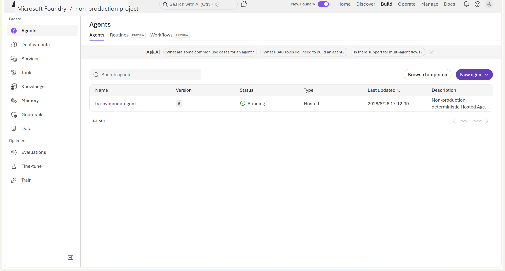
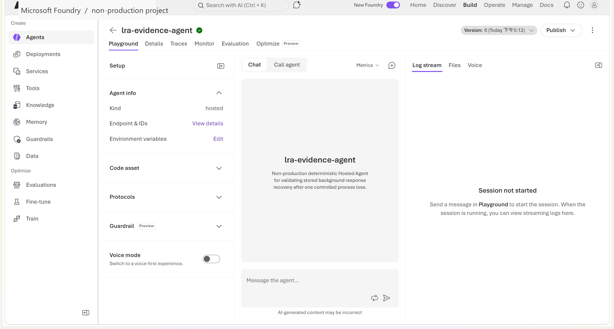

# Recover a Microsoft Foundry Hosted Agent after process loss

[](https://learn.microsoft.com/en-us/azure/foundry/agents/concepts/long-running-agent-resilience)
[](#one-complete-recovery-run)
[](#fault-matrix)
[](#put-the-same-hooks-in-your-agent)
[](LICENSE)

This repository contains a real Hosted Agent, caller, fault harness, and evidence. It answers one question: **when the Agent process disappears, how does the same stored response continue on a new process without losing checkpointed output?**

> **Author:** Xinyu Wei (魏新宇)

[中文](README-CN.md) | English

[One complete run](#one-complete-recovery-run) · [Fault matrix](#fault-matrix) · [Reproduce](#reproduce-it) · [Use in your Agent](#put-the-same-hooks-in-your-agent) · [Evidence](#evidence-and-boundaries) · [Official documentation](https://learn.microsoft.com/en-us/azure/foundry/agents/concepts/long-running-agent-resilience)

## Read this first

The mechanism is not "restart the old process." The caller creates one stored background response. Process A writes a checkpoint and exits. Process B starts with empty process memory, finds the same persisted response and input, enters the handler with `is_recovery=True`, restores the checkpointed response, and continues. The caller keeps polling the original response ID.

The main proof below is one repository-owned Python run. The same hard-loss test also passed against the repository-owned .NET handler. This is public-preview capability evidence, not an SLA or production-readiness claim.

## One complete recovery run

### Where the Agent actually uses LRA

| Required hook | Actual repository code | What it changes |
|---|---|---|
| Import the AgentServer recovery APIs | [`main.py`](hosted-agent/src/lra-evidence-agent/main.py#L13-L20) | Uses the public task and Responses packages |
| Opt the server into crash recovery | [`ResponsesServerOptions(resilient_background=True)`](hosted-agent/src/lra-evidence-agent/main.py#L35-L38) | Stored background responses can be reinvoked after process loss |
| Enable startup recovery scanning | [`set_resilient_tasks_enabled(True)`](hosted-agent/src/lra-evidence-agent/main.py#L39) | A new process scans for recoverable work |
| Create stored background work | [`store=True`, `background=True`](hosted-agent/client.py#L205-L215) | The request and response identity outlive the original connection |
| Restore the durable snapshot | [`context.persisted_response`](hosted-agent/src/lra-evidence-agent/main.py#L104-L115) | A recovered handler starts from previously checkpointed output |
| Commit one durable boundary | [`yield stream.checkpoint()`](hosted-agent/src/lra-evidence-agent/main.py#L143-L166) | Output before that call survives process loss |
| Inject a real hard process exit | [`os._exit(86)`](hosted-agent/src/lra-evidence-agent/main.py#L167-L186) | Process A stops without normal cleanup |
| Keep observing the same work | [`state_file` and `validate_terminal_response`](hosted-agent/client.py#L330-L380) | A caller restart does not create replacement work |

The .NET handler wires the same contract through [`ResilientBackground`](dotnet-agent/Program.cs#L10-L12), [`PersistedResponse`](dotnet-agent/Program.cs#L67-L72), [`stream.Checkpoint()`](dotnet-agent/Program.cs#L101-L107), and [`Environment.Exit(86)`](dotnet-agent/Program.cs#L109-L121).

### Exactly when it went down, recovered, and completed

The table is from [`owned-hosted-agent-local.json`](evidence/owned-hosted-agent-local.json). Times below are UTC+8; the JSON keeps ISO timestamps and the complete sanitized event log.

| Event | UTC+8 | Elapsed | Process | What happened | Durable state after the event |
|---|---|---:|---|---|---|
| Process A started | 16:55:10.437 | 0.019 s | A | AgentServer started with recovery enabled | No request yet |
| Response created | 16:55:12.272 | 1.854 s | A | Caller sent one `store=true`, `background=true` request | Input and response identity persisted |
| Checkpoint committed | 16:55:13.154 | 2.736 s | A | `plan_work` completed and `stream.checkpoint()` returned | Output through `plan_work` persisted |
| Fault injected | 16:55:13.154 | 2.736 s | A | Handler logged the boundary and called `os._exit(86)` | Persisted state remains; process memory is disposable |
| **Process down** | **16:55:13.678** | **3.260 s** | A | OS reported exit code `86` | No Agent process is running |
| Process B started | 16:55:13.691 | 3.273 s | B | New empty process opened the same AgentServer state | Stored response is still addressable |
| **Recovery observed** | **16:55:15.113** | **4.695 s** | B | Handler entered with `mode=recovered` and the same response hash | Resume point is `allocate_steps` |
| First post-recovery checkpoint | 16:55:15.344 | 4.926 s | B | `allocate_steps` committed | Progress continues after the last Process A checkpoint |
| Handler completed | 16:55:18.355 | 7.937 s | B | All expected checkpoint output was produced | Response snapshot is complete |
| **Caller saw `completed`** | **16:55:18.649** | **8.231 s** | B | Original response reached its terminal state | Acceptance passed |

Process A was actually down for **1.435 seconds before recovered entry**. Completion occurred **4.677 seconds after Process A went down**. The response-ID SHA-256 remained `b8af93f3...e42e1`; two different process-instance hashes appeared.

### Why the task did not stop and the data did not disappear

| State | Where it lived | What happened at Process A loss |
|---|---|---|
| Python local variables, stack, socket, PID | Process A memory | **Lost**, intentionally |
| Work identity and original input | AgentServer file-backed task state | Survived and was reused by Process B |
| Completed output through `plan_work` | Persisted Responses checkpoint | Survived; Process B did not repeat it |
| Remaining work | Derived from the named checkpoint contract | Process B resumed at `allocate_steps` |
| Response ID and deadline | Caller state file | A new observer can poll the same response |
| External payments, bookings, emails, writes | Not used by this deterministic workload | **Not proven**; real applications still need idempotency and reconciliation |

This is at-least-once recovery. Work after the last successful checkpoint can run again. Checkpoint before an irreversible operation, and give that operation its own idempotency key.

<div align="center"></div>

<p align="center"><sub><i>"Lease-based recovery of a resilient work item"</i> from <a href="https://learn.microsoft.com/en-us/azure/foundry/agents/concepts/long-running-agent-resilience">Microsoft Foundry documentation</a> © Microsoft, used unmodified under <a href="https://creativecommons.org/licenses/by/4.0/">CC BY 4.0</a>. It is not covered by this repository's MIT license.</sub></p>

## Fault matrix

| Scenario / mode | Trigger | Expected | Actual result | Status | Evidence |
|---|---|---|---|---|---|
| Python Agent process loss | `os._exit(86)` after a checkpoint | New process recovers the same response | Recovered after 1.435 s; completed 4.677 s after down | **PASS** | [report](evidence/owned-hosted-agent-local.json) · [events](evidence/owned-hosted-agent-local-events.jsonl) |
| Foundry Hosted Agent process loss | Guarded `os._exit(86)` on temporary fault-enabled Version 5 | Replacement compute recovers the same stored response | Client saw replacement timeout, then `fresh + recovered`, two process hashes, and `completed`; exact down time is bounded because the old container log was not retained | **PASS** | [report](evidence/owned-hosted-agent-live-recovery.json) · [recovery-container events](evidence/owned-hosted-agent-live-recovery-events.jsonl) |
| .NET Agent process loss | `Environment.Exit(86)` after a checkpoint | New CLR process recovers the same response | Recovered after 0.606 s; completed 3.917 s after down | **PASS** | [report](evidence/owned-hosted-agent-dotnet.json) · [events](evidence/owned-hosted-agent-dotnet-events.jsonl) |
| Caller / observer restart | Observer A exits after saving response ID and deadline | Agent continues; Observer B resumes the same response | Durable progress occurred while no observer was attached; Observer B saw `completed` | **PASS** | [report](evidence/owned-hosted-agent-observer.json) · [events](evidence/owned-hosted-agent-observer-events.jsonl) |
| Graceful host shutdown | Windows console shutdown signal | Host sets shutdown, defers work, later process recovers | Local Windows harness did not drive the complete host shutdown lifecycle | **NOT VERIFIED** | [attempt record](evidence/owned-hosted-agent-graceful-attempt.json) |
| Missing / duplicate output | Remove or duplicate completed output in fixtures | Acceptance fails closed | Gap, duplicate, and bare `done` cases were rejected | **PASS** | [validator evidence](evidence/observation-validation.json) |

The matrix is data, not a promise. [`run-contract.json`](evidence/run-contract.json) declares the required milestones and state assertions; [`scenario-matrix.json`](evidence/scenario-matrix.json) declares the modes. The validator reads those files instead of hardcoding this demo's event names.

## Reproduce it

### Prerequisites

| Path | Required |
|---|---|
| Python recovery and observer restart | Git, Python 3.13, packages from [`requirements.txt`](hosted-agent/src/lra-evidence-agent/requirements.txt) |
| .NET recovery | .NET 8 SDK and restore access for the pinned preview packages in [`LraEvidenceAgent.csproj`](dotnet-agent/LraEvidenceAgent.csproj) |
| Live Foundry deployment | Non-production subscription, Foundry project, Azure CLI 2.80+, `azd` 1.27.1+, project-level `Foundry Project Manager` |

On Windows PowerShell:

```powershell
git clone --depth 1 --filter=blob:none --sparse `
  https://github.com/david-xinyuwei/david-share.git lra-demo
git -C lra-demo sparse-checkout set `
  Agents/Foundry-Long-Running-Agent-Resilience
Set-Location lra-demo\Agents\Foundry-Long-Running-Agent-Resilience

python -m venv .venv
$python = (Resolve-Path .\.venv\Scripts\python.exe).Path
& $python -m pip install --no-input `
  -r hosted-agent\src\lra-evidence-agent\requirements.txt

# 1. Python process loss -> Process B recovers the same response.
& $python hosted-agent\run_local_recovery.py `
  --report .demo-state\python-recovery.json `
  --log-report .demo-state\python-events.jsonl

# 2. Observer A exits -> Observer B resumes; Agent process stays alive.
& $python hosted-agent\run_observer_restart.py `
  --report .demo-state\observer-restart.json `
  --log-report .demo-state\observer-events.jsonl

# 3. Build and hard-exit the repository-owned .NET Agent.
dotnet build dotnet-agent\LraEvidenceAgent.csproj -c Release
$dotnetDir = (Resolve-Path dotnet-agent\bin\Release\net8.0).Path
$dotnetDll = Join-Path $dotnetDir LraEvidenceAgent.dll
& $python hosted-agent\run_local_recovery.py `
  --runtime-label ".NET 8.0" `
  --server-command dotnet $dotnetDll `
  --server-cwd $dotnetDir `
  --report .demo-state\dotnet-recovery.json `
  --log-report .demo-state\dotnet-events.jsonl

# 4. Repository acceptance.
& $python -m unittest discover -s tests -v
& $python scripts\validate_repo.py
```

Done-when each runner exits `0`; Python and .NET reports contain `recovery_proven: true`, `fresh + recovered`, two process hashes, and `completed`; the observer report shows two observer processes but one Agent process.

For Linux/macOS, use `.venv/bin/python` and `/` path separators. The runner accepts any server command, so the same contract is reused for Python and .NET instead of duplicating acceptance logic.

To deploy the safe Python Agent to Foundry:

```powershell
Set-Location hosted-agent
az login
azd auth login
azd ext install microsoft.foundry
azd env new <environment-name> `
  --subscription <subscription-id> `
  --location <supported-region> `
  --no-prompt
azd env set LRA_ENABLE_FAULT_INJECTION false
azd provision
azd deploy
azd ai agent show lra-evidence-agent
```

Structured status and the Portal now show repository-owned Version 6 as `active` / `Running`, `hosted` / `Hosted`, and fault injection disabled. A safe Version 6 request completed; that proves the post-test deployment and normal execution. By itself, the safe run is not live process-loss recovery evidence; that proof is the Version 5 matrix row.

## Put the same hooks in your Agent

1. Pin the public AgentServer packages for your runtime.
2. Enable resilient background execution on the server.
3. Send `store=true` and `background=true`.
4. Persist `response.id`, your business work ID, and one absolute deadline before acknowledging success upstream.
5. After a complete, replay-safe unit of work, commit application state and then checkpoint the response.
6. On recovered entry, restore `persisted_response` or your application/framework checkpoint and skip already committed work.
7. Poll only the original response. Never create replacement work because a read timed out.
8. Make every external side effect idempotent or explicitly reconcilable.

Use an application database when progress is not fully represented by the response snapshot, or when approvals, tool state, large artifacts, payments, bookings, or writes must survive.

## Acceptance contract

A recovery claim passes only when all of these are true:

- Process A actually exits after a recorded checkpoint.
- Process B has a different process-instance hash and enters as `recovered`.
- Work ID, input hash, and response-ID hash are unchanged.
- The recovered run starts after the last durable checkpoint.
- Every expected checkpoint appears exactly once with no gap or duplicate.
- The original response reaches an explicit `completed` terminal state.
- External side effects are either absent, idempotent, or separately reconciled.

A `done` frame, a green Portal status, or a new successful request is not recovery proof.

## Evidence and boundaries

| Evidence | What it proves |
|---|---|
| [`run-contract.json`](evidence/run-contract.json) | Scenario-declared milestones and state assertions used by the generic gate |
| [`scenario-matrix.json`](evidence/scenario-matrix.json) | PASS / NOT VERIFIED status for each advertised mode |
| [Python report](evidence/owned-hosted-agent-local.json) and [events](evidence/owned-hosted-agent-local-events.jsonl) | Exact hard-loss timeline, state survival, recovered entry, completion |
| [.NET report](evidence/owned-hosted-agent-dotnet.json) and [events](evidence/owned-hosted-agent-dotnet-events.jsonl) | The same contract executed by real .NET preview packages |
| [Observer report](evidence/owned-hosted-agent-observer.json) and [events](evidence/owned-hosted-agent-observer-events.jsonl) | Background work continued with no attached observer |
| [Version 6 status](evidence/owned-hosted-agent-status.json) | Sanitized deployed version, runtime, protocol, status, fault switch, and content hash |
| [UI lineage](evidence/ui-evidence.json) | Original/public image hashes, redactions, and what the screenshots do not prove |
| [Run bundle](evidence/runs/owned-agent-recovery-validation-20260826/run-manifest.json) | Commands, exits, logs, status, UI, and key-code hashes |

<div align="center"></div>

<div align="center"></div>

The screenshots prove the deployed object, version, state, and type. They do not prove process recovery; JSON and logs provide that behavior evidence. Raw authenticated screenshots and identifiers are not committed.

This repository does not prove an SLA, repeated-trial reliability, load behavior, multi-region recovery, model quality, or exactly-once external side effects. Long-running-agent resilience is public preview and is not recommended for production workloads without workload-specific testing.

## Related work and license

- [Foundry-Agent-Lifecycle-Build-Deploy-Operate](../Foundry-Agent-Lifecycle-Build-Deploy-Operate/)
- [Foundry-Hosted-Agent-Toolbox-Demo](../Foundry-Hosted-Agent-Toolbox-Demo/)
- [Official long-running-agent resilience documentation](https://learn.microsoft.com/en-us/azure/foundry/agents/concepts/long-running-agent-resilience)
- [Official API reference, including Python and .NET](https://learn.microsoft.com/en-us/azure/foundry/agents/concepts/long-running-agent-reference)

Project-authored content is licensed under [MIT](LICENSE). The official Microsoft diagram is used under CC BY 4.0 and excluded from the MIT license; see [Third-party notices](THIRD-PARTY-NOTICES.md).
