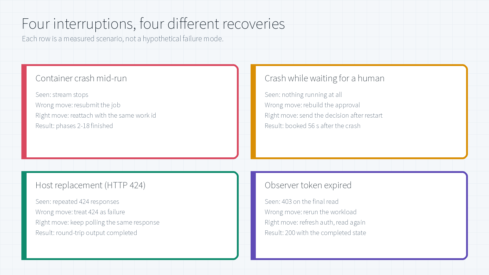
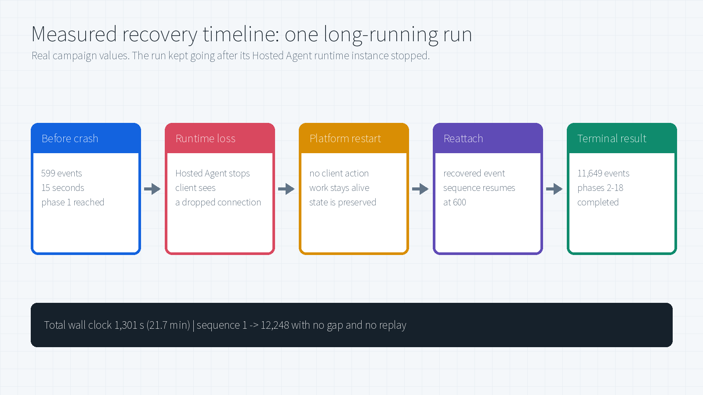
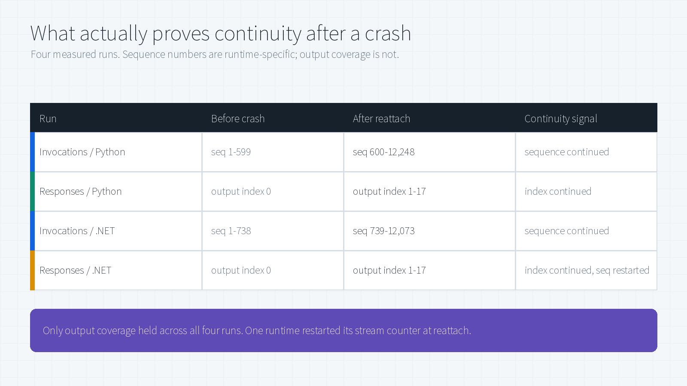
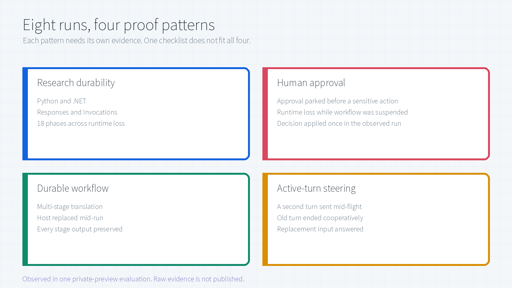

# Resilient Long-Running Hosted Agents on Microsoft Foundry

[](#6-evaluation-and-logic-validation)
[](#4-measured-effects)
[](#22-three-integration-tiers-one-recovery-model)
[](LICENSE)

This capability helps a Microsoft Foundry Hosted Agent keep a minutes- or hours-long job alive when its Foundry-managed runtime instance disappears, its client disconnects, or the workflow pauses for human approval. This article explains the customer outcome first, then the architecture and recovery principle, and finally the measured failure scenarios and their recovery procedures.

> **What this page is.** Measured behavior and recovery guidance from a private-preview evaluation.
> **What it is not.** It ships **no preview SDK source, no implementation code, no deployment recipe, no API schema, and no raw telemetry**, because the long-running capability was still in private preview. Numbers are observed values from that evaluation, not a service-level commitment or a claim about every region, model, and topology.

> **Author:** Xinyu Wei (魏新宇)

[中文](README-CN.md) | English | [Hosted agents overview](https://learn.microsoft.com/en-us/azure/foundry/agents/concepts/hosted-agents) | [Hosted agent quickstart](https://learn.microsoft.com/en-us/azure/foundry/agents/quickstarts/quickstart-hosted-agent)

---

## Executive Summary

### What this technology enables

Without resilient execution, loss of a runtime instance can force a long-running Agent to restart an expensive workflow, lose a pending approval, or duplicate an external action. The evaluated capability separates the **logical work** from the **runtime process**: the work keeps a stable identity, its input and progress survive process loss, and a replacement process can re-enter from a durable checkpoint.

**What “runtime instance” means here.** A Hosted Agent is the customer's Agent code packaged as a container image. Foundry runs that code inside a per-session, VM-isolated sandbox and manages its lifecycle. This article calls the currently running copy of that code the **Hosted Agent runtime instance**. It is not a standalone Docker container that the customer must operate. Losing the instance removes its process, memory, and open connection; it does not by itself delete the Hosted Agent definition, the session, or the logical work tracked outside that process.

| Customer question | Answer |
|---|---|
| What business problem does it solve? | In the evaluated scenarios, long research, workflow, and approval runs were not abandoned merely because one Hosted Agent runtime instance or client connection ended. |
| What does the customer gain? | A design path for continuation from durable progress instead of full restart, reconnectable output, durable human approval, and controlled mid-run steering. |
| What is the framework? | Foundry Hosted Agent provides managed hosting, identity, endpoints, session state, and lifecycle. A long-running layer adds durable work identity, recovery entry, and reconnectable streams. The Agent framework or application owns meaningful checkpoints and idempotent side effects. |
| Is it tied to one Agent framework? | No. The model is framework-agnostic. Microsoft Agent Framework can provide the highest-level integration; Responses provides a managed protocol path; Invocations provides lower-level control. |
| How does recovery work? | Reuse the same logical work reference, restore application progress from its checkpoint, re-enter the handler, and verify continuity from durable workload output rather than from the old socket. |
| What failures were exercised? | Hosted Agent runtime loss, runtime loss during human approval, host replacement with repeated HTTP 424, observer credential expiry, truncated evidence, and deliberate mid-run steering. |
| What was measured? | Eight main scenarios completed. One 21.7-minute run resumed after phase 1 and completed phases 2-18; an approval decision was accepted **56 seconds** after a crash; another run completed after **29** consecutive 424 responses. |
| What is not established? | Production availability, SLA, load behavior, multi-region recovery, model quality, and business correctness were not measured. |

**Customer decision:** the evidence is strong enough to justify a workload-specific controlled evaluation. It is not sufficient by itself for production approval.

**Recovery contract in one sentence:** preserve the same work identity, persist business progress outside the process, make side effects idempotent, and confirm recovery from durable output or terminal state.

### Read this by role

| Reader | First question this page must answer | Start here |
|---|---|---|
| Technical leader | What customer outcome changes, and is the evidence sufficient to fund an evaluation? | [Customer outcome](#1-customer-outcome-long-work-is-no-longer-bound-to-one-process) |
| Solution architect | Which layer owns hosting, durable work, checkpoints, and client recovery? | [Architecture](#2-architecture-and-recovery-principle) |
| Agent engineer | What must survive the process, and which signal proves the same work continued? | [Recovery contract](#24-recovery-contract) |
| Operator / SRE | Should I reattach, resume, continue polling, refresh credentials, or stop? | [Recovery playbook](#3-failure-and-recovery-playbook) |
| Reviewer / risk owner | Which claims are measured, which are inferred, and what remains unproven? | [Evidence and boundaries](#8-evidence-boundaries-and-adoption-gate) |

**Decision supported by this evidence:** proceed to a workload-specific, controlled evaluation. Do **not** treat 8/8 scenario completion as a production availability claim; production approval still requires repeated trials, failure-budget policy, side-effect idempotency tests, load/concurrency tests, and current product validation.

---

## 1. Customer outcome: long work is no longer bound to one process

A short Agent call usually returns or fails while one process is alive. A long-running Agent has a third state: **the current runtime instance can disappear while the logical work remains valid.** Reliability therefore cannot be defined as “keep one process alive forever.” It must mean “keep the work addressable, recoverable, and safe to continue.”

### 1.1 Before and after

| Customer scenario | Process-bound behavior | Resilient behavior | Customer impact |
|---|---|---|---|
| 20-minute research run | Runtime loss restarts or abandons the run | Replacement runtime re-enters the same logical work from durable progress | Preserve completed phases and avoid duplicate model/tool cost |
| Human approval | Pending choice and tool context can disappear with the process | Approval remains attached to the same suspended work | The user can decide later without rebuilding the request |
| Client or network disconnect | A broken stream is mistaken for failed work | Work continues independently; the client reattaches or reads terminal state | User connectivity no longer determines workload survival |
| User changes direction mid-run | Caller races cancel, restart, and a new request | New input is queued and applied at a safe boundary | Controlled steering instead of overlapping runs |

The key shift is from **process-bound execution** to **work-bound execution**. The Hosted Agent runtime instance becomes replaceable; the logical work identity, progress, and terminal result are the durable contract.

### 1.2 Public platform baseline

Microsoft Foundry Hosted Agents run customer Agent code in Microsoft-managed, per-session isolated compute. The public platform provides:

| Public concept | What it contributes |
|---|---|
| Hosted Agent | Customer code and framework packaged as an image, exposed through a managed endpoint |
| Session | Isolated compute and persisted `$HOME` / files across idle deprovisioning and resume |
| Conversation | Durable message and tool-call history, primarily for Responses |
| Agent identity | A dedicated Microsoft Entra identity for model, tool, and downstream access |
| Lifecycle and observability | Managed provisioning, deprovisioning, scaling, health integration, and telemetry |

Source: [Hosted agents in Foundry Agent Service](https://learn.microsoft.com/en-us/azure/foundry/agents/concepts/hosted-agents).

These public properties establish the hosting baseline. They do **not** by themselves prove that active work survives process loss. That stronger behavior is what the private-preview evaluation measured.

### 1.3 Public behavior versus evaluated behavior

| Layer | Public documentation (updated July 21, 2026) | Evaluated behavior | Boundary |
|---|---|---|---|
| Session state | `$HOME` and `/files` return when idle compute resumes | Active work continued after injected runtime-instance loss | Idle restoration is consistent with, but does not prove, active-work recovery |
| Responses | Conversation history, streaming lifecycle, and background polling are platform-managed | The same response delivered output indexes 0-17 across recovery | This proves one response, not an SLA for every workload |
| Invocations | Application owns the payload, session semantics, task tracking, and polling | Explicit recovery events and phases 1-18 were observed | The application still owns correct checkpoint and side-effect semantics |

---

## 2. Architecture and recovery principle


### 2.1 Four responsibility layers

| Layer | Owns | Must survive or remain valid | Does not prove |
|---|---|---|---|
| Foundry Hosted Agent platform | Runtime sandbox, endpoint, identity, session/conversation state, lifecycle | The ability to provision a replacement runtime and address the same session/work | That application progress is checkpointed correctly |
| Long-running execution layer | Stable work identity, persisted input, recovery entry, task/stream state | The logical work record across process loss | That external business actions are safe to repeat |
| Agent framework / application | Meaningful checkpoint, workflow phase, approval state, terminal result | Enough business progress to resume safely | That the client will reconnect correctly |
| Client / operator | Stable work reference, reconnect cursor, bounded polling, auth refresh | The ability to observe the same work after a disconnect | That a transport error means the workload failed |

This separation is the central design rule: **runtime state, workload state, and observer state are different failure domains.** A failure in one layer must not be promoted automatically into a failure of the others.

### 2.2 Three integration tiers, one recovery model

| Tier | What it provides | Customer responsibility | Best fit |
|---|---|---|---|
| Microsoft Agent Framework on Foundry hosting | Highest-level integration over Responses; the framework wires most lifecycle behavior | Configure the capability and provide framework checkpoints / safe side effects | Teams that want the least recovery plumbing |
| Responses protocol | Managed OpenAI-compatible contract, conversation history, streaming lifecycle, background execution, polling, and cancellation | Opt into resilient behavior, preserve application checkpoints, and validate output continuity | Conversational or tool-using Agents |
| Invocations protocol | Arbitrary request/response schema and raw streaming control | Own session/task semantics, event schema, checkpoint mapping, polling, and recovery behavior | Structured workflows and custom protocols |

The model is framework-agnostic. LangGraph, Microsoft Agent Framework, or hand-written orchestration can all participate, but none removes the application's obligation to define what “already completed” means and how external effects remain idempotent.

### 2.3 How recovery works

1. **Address one logical work item.** The client starts work and retains its stable reference.
2. **Persist before execution.** The long-running layer records identity, input, and the metadata needed to find the work again.
3. **Checkpoint business progress.** The Agent framework or application records a phase, watermark, approval state, or pointer to external state.
4. **Lose the runtime instance.** The old process, memory, and socket disappear. The durable work record does not.
5. **Re-enter on replacement compute.** Foundry supplies a replacement Hosted Agent runtime; the same logical work is invoked with recovery context.
6. **Resume safely.** The application loads its checkpoint, avoids repeating committed side effects, and continues from a known boundary.
7. **Reattach and verify.** The client reconnects to the same work and confirms continuity from durable outputs or terminal state.

**Concrete example.** In the measured 18-phase research run, phase 1 completed before the Hosted Agent runtime instance was lost. The replacement runtime re-entered the same work, recovered its progress, and continued through phases 2-18. The client later reattached to observe those outputs. This is the intended division of labor: workload recovery can proceed without keeping the original client connection alive; client reattachment is required only to resume observation.

### 2.4 Recovery contract

| Contract element | Why it is required | Failure if omitted |
|---|---|---|
| Stable work identity | Distinguishes recovery of existing work from submission of new work | Duplicate runs and ambiguous ownership |
| Durable progress checkpoint | Tells replacement code what is already complete | Full restart or repeated phases |
| Idempotency key / side-effect guard | Prevents an approval, booking, write, or tool call from being committed twice | Duplicate external action |
| Explicit terminal state | Separates “stream ended” from “work completed” | False success or false failure |
| Workload-level continuity signal | Proves outputs/phases are complete even if transport counters reset | Protocol-specific false alarms |

### 2.5 What recovery is not

- It is **not** resurrection of the old process or socket.
- It is **not** deterministic replay of every instruction, model call, or tool call.
- It is **not** resubmitting the original request as a new job.
- It is **not** proven by an Agent version merely showing `active`.
- It is **not** safe unless committed side effects can be recognized and avoided on re-entry.

Recovery should be designed with **at-least-once execution** in mind. Work performed after the last durable checkpoint can run again after process loss. Checkpoint granularity defines the replay window; idempotency keys, compare-and-set writes, and durable external operation IDs prevent that replay from becoming a duplicate business action.

---

## 3. Failure and recovery playbook



### 3.1 First classify what failed


The decision rule is deliberately conservative: **do not create new work until the existing work has a confirmed terminal failure or is proven unaddressable.**

### 3.2 Hosted Agent runtime loss during active work

| Aspect | Detail |
|---|---|
| Symptom | Stream stops without a terminal event; the current runtime instance is gone |
| What actually failed | One execution process, not necessarily the logical work |
| Wrong reflex | Resubmit the job |
| Correct recovery | Let the platform re-enter the same work, then reattach with the same work reference and last durable position |
| Application obligation | Restore a checkpoint and suppress already-committed side effects |
| Confirmation | Recovery marker or continued workload output on the same work; then explicit terminal state |
| Measured outcome | Phases 2-18 completed after the runtime loss |

### 3.3 Runtime loss while waiting for human approval

| Aspect | Detail |
|---|---|
| Symptom | No active execution and no stream; the workflow is parked on a decision |
| What actually failed | The runtime instance, while the suspended workflow and approval context remain durable |
| Wrong reflex | Rebuild the approval request from scratch |
| Correct recovery | Send the decision to the same logical work after restart; the durable checkpoint wakes the workflow |
| Application obligation | Apply the decision exactly once and preserve the options originally shown to the user |
| Confirmation | Post-approval path reaches an explicit terminal result with the same selections |
| Measured outcome | Decision accepted 56 s after runtime loss; terminal confirmation followed 7 s later |

### 3.4 Client or network disconnect

| Aspect | Detail |
|---|---|
| Symptom | The caller loses SSE / HTTP connectivity but there is no terminal workload failure |
| What actually failed | The observation channel |
| Wrong reflex | Assume the Agent stopped and submit again |
| Correct recovery | Reconnect to the same logical work using durable output position or retrieve its current state |
| Confirmation | Output/phase coverage continues without duplicate business results |
| Customer action | Preserve the work reference independently of the socket |

### 3.5 Host replacement returning HTTP 424

| Aspect | Detail |
|---|---|
| Symptom | The same response repeatedly returns `424 Failed Dependency` during host replacement |
| Wrong reflex | Treat the first 424 as a terminal business failure, or resubmit |
| Correct recovery | After classifying this specific host-replacement condition, poll the same response with bounded backoff |
| Safety boundary | Do **not** make every 424 universally retryable; other causes require separate handling |
| Confirmation | The same response reaches completion with all expected stages present |
| Measured outcome | Completed after 29 consecutive 424 responses |

### 3.6 Observer credential expiry

| Aspect | Detail |
|---|---|
| Symptom | `403` on a final read after a long run |
| What actually failed | The observer's authorization, not the workload |
| Wrong reflex | Rerun the workload |
| Correct recovery | Refresh observer authentication and repeat the read-only query for the same work |
| Confirmation | `200` with completed terminal state |
| Measured outcome | Fresh-token read returned completion with 18 output items |

### 3.7 Truncated evidence

| Aspect | Detail |
|---|---|
| Symptom | Captured log or stream stops at a byte or time limit |
| What actually failed | Evidence capture |
| Wrong reflex | Infer workload failure from the last captured line |
| Correct recovery | Query durable state directly or recapture the complete stream |
| Confirmation | Terminal state comes from the service, not from the log tail |

### 3.8 Deliberate steering

| Aspect | Detail |
|---|---|
| Symptom | A newer user instruction arrives while a turn is still active |
| Wrong reflex | Hard-kill the old turn and race a new run against it |
| Correct recovery | Queue the new input, let the current turn stop at a safe boundary, then continue the same conversation chain |
| Confirmation | Old turn ends cooperatively; replacement input reaches terminal answer |
| Measured outcome | Turn 2 queued, observed 7 `in_progress` polls, then completed |

---

## 4. Measured effects

### 4.1 Runtime loss mid-run: the work did not stop



Python Invocations research run:

| Stage | Measured |
|---|---|
| Before crash | 599 events over 15 s, phase 1 reached, sequence 1-599 |
| Crash | Stream ends; the client observes a dropped connection |
| Reattach | Recovery event received; sequence resumes at **600** |
| After reattach | 11,649 events over 1,237 s, phases 2-18 |
| Terminal | Completed status, with the task suspended for run completion |
| Total | **1,301 s (21.7 min)**, sequence 1 to 12,248 |

The reattached stream carried **192 status events and 17 phase events**. The run had genuinely continued rather than restarted.

### 4.2 The same interruption on a different protocol

Python Responses research run, 11,584 records total:

| Stage | Measured |
|---|---|
| Before crash | 577 events, 13 s, output index 0, 570 text deltas |
| Crash | The crash stream reported a failed response |
| Reattach | Lifecycle replay observed; sequence resumes at 578 |
| After reattach | 11,005 events, 1,140 s, output indexes 1-17, 10,918 text deltas |
| Terminal | Completion delivered on the reattached stream |
| Reconnect gap | **47 s** |

Output index 0 was produced before the crash and indexes 1-17 after it. **No index was repeated and none was skipped**, which is the strongest available evidence that this was the same logical response.

### 4.3 Runtime loss while a human was deciding

This is the case people underestimate. The graph parked at an approval, so **nothing was executing at all**.

| Time (UTC) | Event |
|---|---|
| 12:22:54 | Run starts |
| 12:23:01 | Tools called for flight and hotel search |
| 12:23:07 | Approval requested for a 3-night Tokyo booking |
| 12:24:27 | Hosted Agent runtime loss injected |
| 12:25:23 | Approval decision sent after restart |
| 12:25:25 | Agent resumes with the **same flight and hotel selection** |
| 12:25:30 | Terminal result: confirmation `TRIP-182336` |

**56 seconds** from the crash to the approval decision being accepted after restart; the terminal confirmation followed 7 seconds later. The pending approval, the tool results, and the selected options all survived a process that no longer existed.

A second run of the same pattern on the Responses protocol reached its own terminal confirmation, `TRIP-749637`.

> These are deterministic sample tools. The confirmation numbers prove durable graph state and exactly-once decision handling, not a real airline or hotel booking.

### 4.4 Host replacement: 29 failures that were not failures

The durable workflow run received `HTTP 424 Failed Dependency` **29 consecutive times** while its host was being replaced. The client kept polling the same response instead of resubmitting, and the run completed with every stage intact.

Final persisted output, transcribed exactly:

```text
[French]
Le rapide renard brun saute par-dessus le chien paresseux.
[Spanish]
El rápido zorro marrón salta por encima del perro perezoso.
[Original English]
The quick brown fox jumps over the lazy dog.
[French]
Le rapide renard brun saute par-dessus le chien paresseux.
[Spanish]
El rápido zorro marrón salta por encima del perro perezoso.
[Round-trip English]
The quick brown fox jumps over the lazy dog.
```

A client that treated the first 424 as terminal would have discarded a run that was about to succeed. A client that gave up at the tenth would have done the same.

### 4.5 Steering: interrupting on purpose

Not every interruption is a failure. A second turn arrived while the first was still generating:

| Step | Observed |
|---|---|
| Turn 1 | Counting task, still running |
| Turn 2 sent mid-flight | New question, status `queued` |
| Turn 1 outcome | Terminated cooperatively as completed |
| Turn 2 outcome | 7 polls at `in_progress`, then `completed` |
| Answer | The replacement question was answered correctly |

The replacement input was queued rather than rejected, and the old turn wound down at a safe boundary instead of being killed mid-token.

---

## 5. What to trust when you reconnect



This is the most transferable finding on this page.

| Run | Before crash | After reattach | Continuity signal |
|---|---|---|---|
| Invocations / Python | seq 1-599 | seq 600-12,248 | Sequence continued |
| Responses / Python | output index 0 | output index 1-17 | Index continued |
| Invocations / .NET | seq 1-738 | seq 739-12,073 | Sequence continued |
| Responses / .NET | output index 0 | output index 1-17 | Index continued, **sequence restarted at 5** |

Three of four runs continued their sequence numbers. The fourth did not: the .NET Responses stream **restarted its counter after reattachment** while still delivering output indexes 1-17 on the same response.

**Practical rule:** validate continuity on *what the workload produced* (output indexes, phase numbers, durable state), not on *how the transport numbered its frames*. A monotonic sequence is also not a gap-free sequence, because `10, 12` is monotonic and still missing an event.

---

## 6. Evaluation and logic validation

### 6.1 Evaluation contract

| Dimension | Fixed condition | Why it matters |
|---|---|---|
| Execution window | July 22-23, 2026 | Prevents earlier blocked or partial attempts from being mixed into the final campaign |
| Hosting | Eight active Hosted Agents in one Canada Central Foundry project | Keeps the hosting control plane and region constant |
| Runtime / protocol | Python and .NET; Responses and Invocations | Tests whether the conclusion survives language and protocol changes |
| Scope | Each runnable sample's main documented scenario | Defines the denominator: **8 scenarios** |
| Accepted evidence | Complete event capture or structured client log plus terminal service state | A dropped stream or similar-looking rerun cannot pass |
| Repetition | One accepted end-to-end run per scenario (**N=1 per scenario**) | This is capability validation, not a reliability benchmark |
| Excluded variables | Model quality, business correctness, load, concurrency, cost, multi-region behavior | The evidence cannot support conclusions about these dimensions |

### 6.2 Eight-scenario result matrix



| # | Runtime / protocol | Scenario and interruption | Required terminal proof | Result |
|---|---|---|---|---|
| 1 | Python / Invocations | Research; runtime-instance loss | Recovery marker, phases 1-18, completed task | **PASS** |
| 2 | Python / Responses | Research; runtime-instance loss | Same response, output indexes 0-17, completed with 18 items | **PASS** |
| 3 | .NET / Invocations | Research; runtime-instance loss | Recovery marker, phases 1-18, completed task | **PASS** |
| 4 | .NET / Responses | Research; runtime-instance loss | Same response, output indexes 0-17, completed with 18 items | **PASS** |
| 5 | Python / Invocations | Approval; runtime loss while suspended | Decision applied after restart and terminal confirmation `TRIP-182336` | **PASS** |
| 6 | Python / Responses | Approval; runtime loss while suspended | Recovery lifecycle and terminal confirmation `TRIP-749637` | **PASS** |
| 7 | Python / Responses | Durable workflow; host replacement | Complete French, Spanish, and round-trip output | **PASS** |
| 8 | Python / Responses | Steering; deliberate interruption | Turn 2 queued, turn 1 ended safely, turn 2 completed | **PASS** |

### 6.3 Protocol-specific proof

| Concern | Responses | Invocations |
|---|---|---|
| Client contract | OpenAI-compatible Responses behavior | Application-defined request and result schema |
| History | Platform-managed conversation | Application-managed session and task state |
| Long-running entry | Background stored response | Custom durable task |
| Recovery evidence observed | Lifecycle replay or continued output indexes | Explicit recovery event |
| Terminal evidence observed | Response completion | Done event plus task suspension reason |

The protocols do not emit identical events. A validator that hard-codes one protocol's event names will report false failures on the other.

### 6.4 Acceptance bar

A scenario passed only when the **complete documented plan reached a terminal result after the interruption**. Partial recovery, a resumed stream that stalled, or a fresh run producing similar text did not pass. The denominator is all eight main scenarios. Optional cancel, delete, and deny branches were outside the matrix and remain unverified.

### 6.5 Seven-way logic audit

| Method | Challenge | Evidence | Outcome |
|---|---|---|---|
| Confirmation | Did the same logical work reach terminal state? | Same work reference, terminal service state, complete phase/output coverage | Supported for all eight scenarios |
| Falsification | Could a fresh rerun look like recovery? | Output index 0 before interruption and 1-17 after reattach on the same response | Fresh-run explanation rejected for Responses research runs |
| Enumeration | Were only successful-looking examples selected? | Fixed denominator of eight main scenarios | 8/8 passed; auxiliary branches excluded explicitly |
| Contradiction | If sequence continuity were necessary, would every valid recovery satisfy it? | .NET Responses resumed valid output while sequence restarted at 5 | Universal sequence rule disproved |
| Reverse inference | Does a terminal result alone prove recovery? | Checkpoint, injected loss, connection break, and post-restart continuation were also required | Terminal-only evidence rejected |
| Analogy | Do observations align with public platform concepts? | Public session persistence and protocol ownership documentation | Consistent, but idle resume was not used as proof of active recovery |
| Consistency | Did the conclusion survive runtime and protocol changes? | Python/.NET and Responses/Invocations pairs | Workload-output continuity held; transport event shape did not |

---

## 7. Design guidance

Points that generalize beyond this preview:

1. **Checkpoint at a boundary you can name.** "Phase 7 of 18 complete" is recoverable, while "somewhere in the middle" is not.
2. **Give the work an identity that outlives the process.** Recovery means addressing a logical work item, not resuming a socket.
3. **Separate observer failures from workload failures.** Your token expiring is your problem, not the run's.
4. **Do not infer business failure from an observer or hosting status alone.** Classify the cause, confirm durable state, and retry only statuses explicitly known to be transient for that condition.
5. **Make the terminal state explicit.** A stream that merely ends is not a result.
6. **Decide who owns an approval decision.** Applying it twice is worse than applying it late.
7. **Distinguish suspended work from active work.** A parked graph has no active workflow execution and its runtime may be deprovisioned according to platform lifecycle; that is expected rather than a task failure.

---

## 8. Evidence, boundaries, and adoption gate

### 8.1 Boundary and limitations

- Numbers are **observed values from one evaluation**, not benchmarks, guarantees, or SLAs.
- The long-running capability was in **private preview**, so its implementation, packages, APIs, and deployment recipes are not published here.
- Results cover **eight documented main scenarios**. Optional cancel, delete, and deny branches were not counted.
- Recovery behavior was validated. Business-domain correctness and model quality were not.
- Verify current capabilities against [official documentation](https://learn.microsoft.com/en-us/azure/foundry/agents/concepts/hosted-agents) before designing against anything described here.

### 8.2 Evidence basis

Every number on this page traces to captured artifacts from the evaluation:

| Claim | Source artifact type |
|---|---|
| Event counts, sequence ranges, elapsed times | Per-scenario captured event streams |
| Phase and output index coverage | Stream analysis over those captures |
| Approval timeline and confirmation | Client session logs |
| 424 retry behavior and stage output | Workflow client log |
| Steering queue and terminal answers | Steering client log |

Raw artifacts stay private because they contain endpoints, work identifiers, environment metadata, and generated payload text.

### 8.3 Production adoption gate

Before treating the pattern as production-ready for a specific workload, require all of the following:

- repeated failure-injection trials with an explicit recovery-time objective and failure budget;
- idempotency tests for every external write, approval, payment, booking, or tool side effect;
- load and concurrency tests that include overlapping turns and replacement compute;
- timeout, cancellation, retention, deletion, and dead-letter policy;
- monitoring that separates runtime, workload, observer, and authentication failures;
- current validation against official product documentation and the target region, runtime, and protocol.

## Related work

| Repository | Relationship |
|---|---|
| [Foundry-Agent-Lifecycle-Build-Deploy-Operate](../Foundry-Agent-Lifecycle-Build-Deploy-Operate/) | The broader build, deploy, and operate lifecycle |
| [Foundry-Hosted-Agent-Toolbox-Demo](../Foundry-Hosted-Agent-Toolbox-Demo/) | Hosted-agent tools, memory, and skills |
| [Foundry-Agent-ModelOps-Governance](../Foundry-Agent-ModelOps-Governance/) | Operational-plane boundary mapping |

## License

[MIT](LICENSE)
