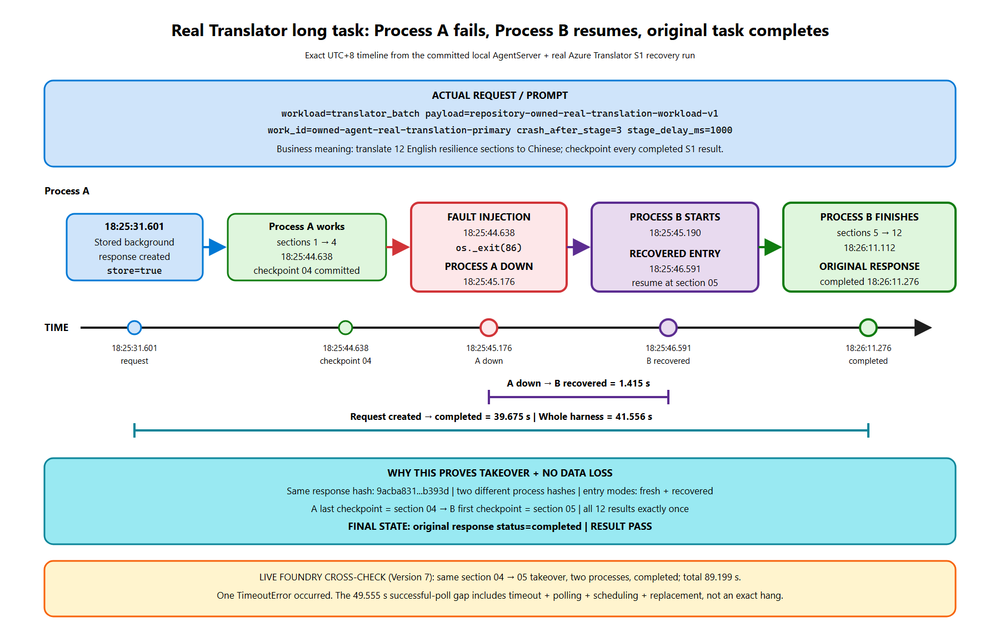

# Recover a Microsoft Foundry Hosted Agent after process loss

[](https://learn.microsoft.com/en-us/azure/foundry/agents/concepts/long-running-agent-resilience)
[](#one-complete-recovery-run)
[](#fault-matrix)
[](#put-the-same-hooks-in-your-agent)
[](LICENSE)

This repository contains a real Hosted Agent, caller, fault harness, and evidence. It answers one question: **when the Agent process disappears, how does the same stored response continue on a new process without losing checkpointed output?**

> **Author:** Xinyu Wei (魏新宇)

[中文](README-CN.md) | English

[One complete run](#one-complete-recovery-run) · [Fault matrix](#fault-matrix) · [Reproduce](#reproduce-it) · [Use in your Agent](#put-the-same-hooks-in-your-agent) · [Evidence](#evidence-and-boundaries) · [Official documentation](https://learn.microsoft.com/en-us/azure/foundry/agents/concepts/long-running-agent-resilience)

## Read this first

The mechanism is not "restart the old process." The caller creates one stored background response. Process A writes a checkpoint and exits. Process B starts with empty process memory, finds the same persisted response and input, enters the handler with `is_recovery=True`, restores the checkpointed response, and continues. The caller keeps polling the original response ID.

The primary demo below is a real long task, not a sleep loop: the repository-owned Agent calls Azure Translator S1 for 12 English sections, checkpoints each completed Chinese result, loses Process A after section 4, resumes at section 5 in Process B, and returns the complete 12-section document with terminal status `completed`.

Two runs prove different parts of that statement. The local AgentServer run provides the exact operating-system down timestamp. The Foundry Version 7 run proves replacement-compute recovery in the hosted product and took `89.199` seconds. The same hard-loss contract also passed against the repository-owned .NET handler. This is public-preview capability evidence, not an SLA or production-readiness claim.

## One complete recovery run

### Where the Agent actually uses LRA

| Required hook | Actual repository code | What it changes |
|---|---|---|
| Import the AgentServer recovery APIs | [`main.py`](hosted-agent/src/lra-evidence-agent/main.py#L16-L24) | Uses the public task and Responses packages |
| Opt the server into crash recovery | [`ResponsesServerOptions(resilient_background=True)`](hosted-agent/src/lra-evidence-agent/main.py#L49-L52) | Stored background responses can be reinvoked after process loss |
| Enable startup recovery scanning | [`set_resilient_tasks_enabled(True)`](hosted-agent/src/lra-evidence-agent/main.py#L52) | A new process scans for recoverable work |
| Create stored background work | [`store=True`, `background=True`](hosted-agent/client.py#L197-L223) | The request and response identity outlive the original connection |
| Restore the durable snapshot | [`context.persisted_response`](hosted-agent/src/lra-evidence-agent/main.py#L170-L175) | A recovered handler starts from previously checkpointed output |
| Commit one durable boundary | [`yield stream.checkpoint()`](hosted-agent/src/lra-evidence-agent/main.py#L202-L228) | Output before that call survives process loss |
| Inject a real hard process exit | [`os._exit(86)`](hosted-agent/src/lra-evidence-agent/main.py#L240-L256) | Process A stops without normal cleanup |
| Keep observing the same work | [`state_file` and `validate_terminal_response`](hosted-agent/client.py#L339-L387) | A caller restart does not create replacement work |

There is no separate package named `LRA`. Python imports the resilient-task and Responses classes from `azure-ai-agentserver-*`:

```python
from azure.ai.agentserver.core.tasks import set_resilient_tasks_enabled
from azure.ai.agentserver.responses import (
    ResponseEventStream,
    ResponsesAgentServerHost,
    ResponsesServerOptions,
)

app = ResponsesAgentServerHost(
    options=ResponsesServerOptions(resilient_background=True)
)
set_resilient_tasks_enabled(True)

# Inside the response handler:
stream = (
    ResponseEventStream(
        response_id=context.response_id,
        response=context.persisted_response,
    )
    if context.is_recovery and context.persisted_response is not None
    else ResponseEventStream(response_id=context.response_id, request=request)
)
# Emit one complete, replay-safe unit of output, then:
yield stream.checkpoint()
```

.NET imports the corresponding NuGet namespaces and enables the same behavior:

```csharp
using Azure.AI.AgentServer.Core;
using Azure.AI.AgentServer.Responses;

var builder = AgentHost.CreateBuilder(args);
builder.AddResponses<LraEvidenceHandler>(
    options => options.ResilientBackground = true);

// Inside CreateAsync:
var stream = context.IsRecovery && context.PersistedResponse is not null
    ? new ResponseEventStream(context, context.PersistedResponse)
    : new ResponseEventStream(context, request);
yield return stream.Checkpoint();
```

The deployable Python package pins are in [`requirements.txt`](hosted-agent/src/lra-evidence-agent/requirements.txt); the .NET package pins are in [`LraEvidenceAgent.csproj`](dotnet-agent/LraEvidenceAgent.csproj).

### What the long task actually does

[`translation_workload.py`](hosted-agent/src/lra-evidence-agent/translation_workload.py) defines 12 public-safe English sections. For each section, [`main.py`](hosted-agent/src/lra-evidence-agent/main.py#L67) obtains a managed-identity token, calls the real Azure Translator S1 REST endpoint, emits the Chinese result, and only then executes `yield stream.checkpoint()`.

The fault request sets `crash_after_stage=3`, so Process A commits `translation_section_04` and calls `os._exit(86)`. Process B restores four output items from `persisted_response`; `_output_count` therefore returns `4`, and the loop starts with `translation_section_05` instead of translating sections 1-4 again. Acceptance rejects the run unless all 12 ordered section records, source hashes, non-empty translations, two process identities, `fresh + recovered`, and the original response's `completed` state are present.

The final hosted output is not merely a status flag: [`owned-hosted-agent-live-translation-output.md`](evidence/owned-hosted-agent-live-translation-output.md) contains all 12 English inputs and all 12 verbatim Translator results. It records completion and recovery, not a human language-quality evaluation.



The diagram uses the exact local timestamps below and includes the live Foundry boundary at the bottom. [Open the scalable SVG](images/lra-recovery-timeline.svg) or [edit the Excalidraw source](images/lra-recovery-timeline.excalidraw).

### Exactly when it went down, recovered, and completed

The table is from the real S1 run in [`owned-hosted-agent-translation-local.json`](evidence/owned-hosted-agent-translation-local.json). Times below are UTC+8; the JSON keeps ISO timestamps, the full acceptance result, and the sanitized event log.

| Event | UTC+8 | Elapsed | Process | What happened | Durable state after the event |
|---|---|---:|---|---|---|
| Process A started | 18:25:29.748 | 0.021 s | A | AgentServer started with recovery and Translator credentials | No request yet |
| Response created | 18:25:31.601 | 1.875 s | A | Caller sent one `store=true`, `background=true`, `translator_batch` request | Input and response identity persisted |
| Section 4 checkpoint | 18:25:44.638 | 14.911 s | A | Fourth real S1 result completed and `stream.checkpoint()` returned | Chinese results 1-4 persisted |
| Fault injected | 18:25:44.638 | 14.911 s | A | Handler logged the durable boundary and called `os._exit(86)` | Checkpoint survives; process memory is disposable |
| **Process down** | **18:25:45.176** | **15.452 s** | A | OS reported exit code `86` | No Agent process is running |
| Process B started | 18:25:45.190 | 15.466 s | B | New empty process opened the same AgentServer state | Original response remains addressable |
| **Recovery observed** | **18:25:46.591** | **16.864 s** | B | Handler entered `recovered` with the same response hash | Resume point is `translation_section_05` |
| First post-recovery checkpoint | 18:25:50.692 | 20.965 s | B | Fifth real S1 result committed | Process B is doing remaining business work |
| Handler completed | 18:26:11.112 | 41.385 s | B | Sections 5-12 completed; all 12 outputs are present | Response snapshot is complete |
| **Caller saw `completed`** | **18:26:11.276** | **41.556 s** | B | The original response reached its terminal state | Full-output acceptance passed |

Process A was actually down for **1.415 seconds before recovered entry**. Process B completed the handler **25.936 seconds after Process A went down**; the caller observed `completed` after 26.100 seconds. The response-ID SHA-256 remained `9acba831...b393d`; the report contains two different process-instance hashes.

The recovered task **really completed in Process B**. This machine-generated trace is rendered from the committed JSON report:

```text
RUN owned-agent-real-translation-primary
2026-08-26T10:25:29.748+00:00  PROCESS_A_START
2026-08-26T10:25:31.601+00:00  RESPONSE_CREATED       response_sha256=9acba83102c7a3b4da7da422d5083831235a3a6102a9d65c44679e24ff0b393d
2026-08-26T10:25:44.638+00:00  CHECKPOINT_COMMITTED   checkpoint=translation_section_04
2026-08-26T10:25:44.638+00:00  FAULT_INJECTED         mode=hard_process_exit exit_code=86
2026-08-26T10:25:45.176+00:00  PROCESS_A_DOWN         exit_code=86
2026-08-26T10:25:45.190+00:00  PROCESS_B_START
2026-08-26T10:25:46.591+00:00  HANDLER_RECOVERED      mode=recovered resume_from=translation_section_05
2026-08-26T10:25:50.692+00:00  CHECKPOINT_COMMITTED   checkpoint=translation_section_05
2026-08-26T10:26:11.112+00:00  HANDLER_COMPLETED
2026-08-26T10:26:11.276+00:00  RESPONSE_STATUS        status=completed
ASSERT same_response_reused=true
ASSERT process_memory_survived=false
ASSERT checkpointed_response_survived=true
ASSERT all_expected_checkpoints_completed_once=true
ASSERT process_instance_count=2
RESULT PASS
```

The source file is [`owned-hosted-agent-translation-local-trace.txt`](evidence/owned-hosted-agent-translation-local-trace.txt); the repository gate requires this README block to match it exactly.

### Hosted run: delay, recovery, and completion log

The real Foundry Version 7 run retained the recovery container log but not the previous container's exit line. Therefore **49.555 seconds is a bounded observation gap between successful polls, not an exact hang duration**. The log still shows the decisive chain: one timeout, Process B entering at section 5, the first recovered checkpoint, handler completion, and the original response reaching `completed`.

| Measurement | Value | Meaning |
|---|---:|---|
| Whole hosted run | 89.199 s | Request start through client-observed `completed` |
| Successful-poll gap around replacement | 49.555 s | Includes timeout, polling, scheduling, and replacement; not exact hang |
| Recovered entry → handler completed | 16.511 s | Process B completed sections 5-12 |
| Handler completed → client saw `completed` | 4.322 s | Final persistence and polling delay |

```text
RUN owned-agent-live-real-translation foundry_version=7
2026-08-26T10:16:04.612+00:00  REQUEST_STARTED        workload=translator_batch response_sha256=cfc1b7056cf1f2e8bb6fe4587405fc099d89c39b79b31fb90fc44f0be5519e09
2026-08-26T10:16:24.658+00:00  LAST_SUCCESSFUL_POLL   status=in_progress
2026-08-26T10:16:58.207+00:00  CONNECTION_TIMEOUT     detail=TimeoutError phase=replacement_window
2026-08-26T10:17:12.978+00:00  HANDLER_RECOVERED      process=B resume_from=translation_section_05
2026-08-26T10:17:14.213+00:00  POLL_AFTER_TIMEOUT     status=in_progress last_checkpoint=translation_section_04
2026-08-26T10:17:15.859+00:00  CHECKPOINT_COMMITTED   checkpoint=translation_section_05
2026-08-26T10:17:29.489+00:00  HANDLER_COMPLETED      process=B
2026-08-26T10:17:33.811+00:00  RESPONSE_STATUS        status=completed process_instances=2
BOUNDARY exact_process_a_down_at=NOT_AVAILABLE reason=prior_container_log_not_retained
DURATION successful_poll_gap_seconds=49.555 meaning=timeout_plus_polling_plus_replacement_not_exact_hang
DURATION recovered_to_handler_completed_seconds=16.511
DURATION handler_completed_to_client_completed_seconds=4.322
DURATION total_run_seconds=89.199
ASSERT same_response_reused=true
ASSERT checkpoint_continuity=translation_section_04->translation_section_05
ASSERT all_12_translations_present=true
ASSERT entry_modes=fresh+recovered
ASSERT terminal_status=completed
RESULT PASS
```

The source file is [`owned-hosted-agent-live-translation-trace.txt`](evidence/owned-hosted-agent-live-translation-trace.txt). It is generated from the [client report](evidence/owned-hosted-agent-live-translation.json) plus the [sanitized recovery-container events](evidence/owned-hosted-agent-live-translation-events.jsonl), and the repository gate requires this block to match exactly.

### Why the task did not stop and the data did not disappear

| State | Where it lived | What happened at Process A loss |
|---|---|---|
| Python local variables, stack, socket, PID | Process A memory | **Lost**, intentionally |
| Work identity and original input | AgentServer file-backed task state | Survived and was reused by Process B |
| Chinese results for sections 1-4 | Persisted Responses checkpoint | Survived; Process B did not call S1 for them again |
| Remaining sections 5-12 | Derived from the persisted output count and named workload | Process B resumed at `translation_section_05` |
| Response ID and deadline | Caller state file | A new observer can poll the same response |
| Azure Translator calls | External read-only transformation | Completed results were checkpointed; a call after the last checkpoint may still be repeated and billed |
| Payments, bookings, emails, writes | Not used by this workload | **Not proven**; real applications still need idempotency and reconciliation |

This is at-least-once recovery. Work after the last successful checkpoint can run again. Checkpoint before an irreversible operation, and give that operation its own idempotency key.

<div align="center"></div>

<p align="center"><sub><i>"Lease-based recovery of a resilient work item"</i> from <a href="https://learn.microsoft.com/en-us/azure/foundry/agents/concepts/long-running-agent-resilience">Microsoft Foundry documentation</a> © Microsoft, used unmodified under <a href="https://creativecommons.org/licenses/by/4.0/">CC BY 4.0</a>. It is not covered by this repository's MIT license.</sub></p>

## Fault matrix

| Scenario / mode | Trigger | Expected | Actual result | Status | Evidence |
|---|---|---|---|---|---|
| Real S1 batch, local Agent process loss | `os._exit(86)` after section 4 | Process B resumes at section 5 and finishes the same document | Recovered after 1.415 s; all 12 translations completed 25.936 s after down | **PASS** | [report](evidence/owned-hosted-agent-translation-local.json) · [events](evidence/owned-hosted-agent-translation-local-events.jsonl) |
| Real S1 batch, Foundry Hosted process loss | Guarded `os._exit(86)` on temporary fault-enabled Version 7 | Replacement compute resumes the same stored response | `89.199` s run; replacement timeout, `fresh + recovered`, two process hashes, all 12 results, `completed`; exact old-container down time remains bounded | **PASS** | [reader log](evidence/owned-hosted-agent-live-translation-trace.txt) · [report](evidence/owned-hosted-agent-live-translation.json) · [events](evidence/owned-hosted-agent-live-translation-events.jsonl) · [full output](evidence/owned-hosted-agent-live-translation-output.md) |
| Fast Python contract regression | `os._exit(86)` after a deterministic checkpoint | New process recovers the same response | Recovered after 1.435 s; completed 4.677 s after down | **PASS** | [report](evidence/owned-hosted-agent-local.json) · [events](evidence/owned-hosted-agent-local-events.jsonl) |
| Fast Foundry contract regression | Guarded `os._exit(86)` on temporary Version 5 | Replacement compute recovers the same stored response | Replacement timeout, `fresh + recovered`, two process hashes, and `completed` | **PASS** | [report](evidence/owned-hosted-agent-live-recovery.json) · [events](evidence/owned-hosted-agent-live-recovery-events.jsonl) |
| .NET Agent process loss | `Environment.Exit(86)` after a checkpoint | New CLR process recovers the same response | Recovered after 0.606 s; completed 3.917 s after down | **PASS** | [report](evidence/owned-hosted-agent-dotnet.json) · [events](evidence/owned-hosted-agent-dotnet-events.jsonl) |
| Caller / observer restart | Observer A exits after saving response ID and deadline | Agent continues; Observer B resumes the same response | Durable progress occurred while no observer was attached; Observer B saw `completed` | **PASS** | [report](evidence/owned-hosted-agent-observer.json) · [events](evidence/owned-hosted-agent-observer-events.jsonl) |
| Current safe Foundry deployment | Version 9, fault switch disabled | Normal real S1 batch remains callable after testing | 12 translations completed in one process in 22.862 s | **PASS** | [run](evidence/owned-hosted-agent-live.json) · [status](evidence/owned-hosted-agent-status.json) |
| Graceful host shutdown | Windows console shutdown signal | Host sets shutdown, defers work, later process recovers | Local Windows harness did not drive the complete host shutdown lifecycle | **NOT VERIFIED** | [attempt record](evidence/owned-hosted-agent-graceful-attempt.json) |
| Missing / duplicate output | Remove or duplicate completed output in fixtures | Acceptance fails closed | Gap, duplicate, and bare `done` cases were rejected | **PASS** | [validator evidence](evidence/observation-validation.json) |

The matrix is data, not a promise. [`run-contract.json`](evidence/run-contract.json) declares the required milestones and state assertions; [`scenario-matrix.json`](evidence/scenario-matrix.json) declares the modes. The validator reads those files instead of hardcoding this demo's event names.

## Reproduce it

### Prerequisites

| Path | Required |
|---|---|
| Real translation recovery | Git, Python 3.13, packages from [`requirements.txt`](hosted-agent/src/lra-evidence-agent/requirements.txt), Azure CLI login, Translator S1, and `Cognitive Services User` on that resource |
| Fast Python recovery and observer restart | The same Python environment; Translator is not required |
| .NET recovery | .NET 8 SDK and restore access for the pinned preview packages in [`LraEvidenceAgent.csproj`](dotnet-agent/LraEvidenceAgent.csproj) |
| Live Foundry deployment | Non-production subscription, Foundry project, Azure CLI 2.80+, `azd` 1.27.1+, project-level `Foundry Project Manager`, and Agent managed-identity access to Translator |

On Windows PowerShell:

```powershell
git clone --depth 1 --filter=blob:none --sparse `
  https://github.com/david-xinyuwei/david-share.git lra-demo
git -C lra-demo sparse-checkout set `
  Agents/Foundry-Long-Running-Agent-Resilience
Set-Location lra-demo\Agents\Foundry-Long-Running-Agent-Resilience

python -m venv .venv
$python = (Resolve-Path .\.venv\Scripts\python.exe).Path
& $python -m pip install --no-input `
  -r hosted-agent\src\lra-evidence-agent\requirements.txt

# 1. Real long task: 12 Azure Translator S1 calls.
az login
$env:LRA_TRANSLATOR_ENDPOINT = "https://<translator-name>.cognitiveservices.azure.com"
$env:LRA_TRANSLATOR_REGION = "<resource-region>"
& $python hosted-agent\run_local_recovery.py `
  --workload translator_batch `
  --crash-after-stage 3 `
  --stage-delay-ms 1000 `
  --report .demo-state\translation-recovery.json `
  --log-report .demo-state\translation-events.jsonl

# 2. Fast deterministic process-loss regression.
& $python hosted-agent\run_local_recovery.py `
  --report .demo-state\python-recovery.json `
  --log-report .demo-state\python-events.jsonl

# 3. Observer A exits -> Observer B resumes; Agent process stays alive.
& $python hosted-agent\run_observer_restart.py `
  --report .demo-state\observer-restart.json `
  --log-report .demo-state\observer-events.jsonl

# 4. Build and hard-exit the repository-owned .NET Agent.
dotnet build dotnet-agent\LraEvidenceAgent.csproj -c Release
$dotnetDir = (Resolve-Path dotnet-agent\bin\Release\net8.0).Path
$dotnetDll = Join-Path $dotnetDir LraEvidenceAgent.dll
& $python hosted-agent\run_local_recovery.py `
  --runtime-label ".NET 8.0" `
  --server-command dotnet $dotnetDll `
  --server-cwd $dotnetDir `
  --report .demo-state\dotnet-recovery.json `
  --log-report .demo-state\dotnet-events.jsonl

# 5. Repository acceptance.
& $python -m unittest discover -s tests -v
& $python scripts\validate_repo.py
```

Done-when each runner exits `0`; the translation report contains 12 non-empty results plus `recovery_proven: true`, `fresh + recovered`, two process hashes, and `completed`; the observer report shows two observer processes but one Agent process.

For Linux/macOS, use `.venv/bin/python` and `/` path separators. The runner accepts any server command, so the same contract is reused for Python and .NET instead of duplicating acceptance logic.

To deploy the safe Python Agent to Foundry:

```powershell
Set-Location hosted-agent
az login
azd auth login
azd ext install microsoft.foundry
azd env new <environment-name> `
  --subscription <subscription-id> `
  --location <supported-region> `
  --no-prompt
azd env set LRA_ENABLE_FAULT_INJECTION false
azd env set LRA_TRANSLATOR_ENDPOINT "https://<translator-name>.cognitiveservices.azure.com"
azd env set LRA_TRANSLATOR_REGION "<resource-region>"
azd provision
azd deploy
azd ai agent show lra-evidence-agent
```

Structured status and the Portal show repository-owned Version 9 as `active` / `Running`, `hosted` / `Hosted`, with fault injection disabled. A safe Version 9 real translation request completed all 12 sections in one process. By itself, that safe run is not live process-loss recovery evidence; the live proof is the temporary Version 7 row, after which Version 9 replaced it.

## Put the same hooks in your Agent

1. Pin the public AgentServer packages for your runtime.
2. Enable resilient background execution on the server.
3. Send `store=true` and `background=true`.
4. Persist `response.id`, your business work ID, and one absolute deadline before acknowledging success upstream.
5. After a complete, replay-safe unit of work, commit application state and then checkpoint the response.
6. On recovered entry, restore `persisted_response` or your application/framework checkpoint and skip already committed work.
7. Poll only the original response. Never create replacement work because a read timed out.
8. Make every external side effect idempotent or explicitly reconcilable.

Use an application database when progress is not fully represented by the response snapshot, or when approvals, tool state, large artifacts, payments, bookings, or writes must survive.

## Acceptance contract

A recovery claim passes only when all of these are true:

- Process A actually exits after a recorded checkpoint.
- Process B has a different process-instance hash and enters as `recovered`.
- Work ID, input hash, and response-ID hash are unchanged.
- The recovered run starts after the last durable checkpoint.
- Every expected checkpoint appears exactly once with no gap or duplicate.
- The original response reaches an explicit `completed` terminal state.
- External side effects are either absent, idempotent, or separately reconciled.

A `done` frame, a green Portal status, or a new successful request is not recovery proof.

## Evidence and boundaries

| Evidence | What it proves |
|---|---|
| [`run-contract.json`](evidence/run-contract.json) | Scenario-declared milestones and state assertions used by the generic gate |
| [`scenario-matrix.json`](evidence/scenario-matrix.json) | PASS / NOT VERIFIED status for each advertised mode |
| [Real local translation report](evidence/owned-hosted-agent-translation-local.json), [events](evidence/owned-hosted-agent-translation-local-events.jsonl), and [trace](evidence/owned-hosted-agent-translation-local-trace.txt) | Exact hard-loss time, section 4 boundary, section 5 resume, all 12 results, completion |
| [Live Version 7 reader log](evidence/owned-hosted-agent-live-translation-trace.txt), [report](evidence/owned-hosted-agent-live-translation.json), [events](evidence/owned-hosted-agent-live-translation-events.jsonl), and [full output](evidence/owned-hosted-agent-live-translation-output.md) | Visible timeout/recovery/completion chain and complete Translator result |
| [Fast Python report](evidence/owned-hosted-agent-local.json) and [events](evidence/owned-hosted-agent-local-events.jsonl) | Deterministic regression of the same recovery contract |
| [.NET report](evidence/owned-hosted-agent-dotnet.json) and [events](evidence/owned-hosted-agent-dotnet-events.jsonl) | The same contract executed by real .NET preview packages |
| [Observer report](evidence/owned-hosted-agent-observer.json) and [events](evidence/owned-hosted-agent-observer-events.jsonl) | Background work continued with no attached observer |
| [Version 9 safe run](evidence/owned-hosted-agent-live.json) and [status](evidence/owned-hosted-agent-status.json) | Current normal completion, runtime, protocol, status, fault switch, and content hash |
| [UI lineage](evidence/ui-evidence.json), [Version 9 list](images/product-ui/portal-owned-agent-list.png), and [Version 9 details](images/product-ui/portal-owned-agent-details.png) | Original/public image hashes, redactions, and deployment-object proof |
| [Run bundle](evidence/runs/owned-agent-recovery-validation-20260826/run-manifest.json) | Commands, exits, logs, status, UI, and key-code hashes |

The linked Portal screenshots prove the deployed object, version, state, and type. They do not prove process recovery; JSON and logs provide that behavior evidence. Raw authenticated screenshots and identifiers are not committed.

This repository does not prove an SLA, repeated-trial reliability, load behavior, multi-region recovery, translation quality, or exactly-once external side effects. Long-running-agent resilience is public preview and is not recommended for production workloads without workload-specific testing.

## Related work and license

- [Foundry-Agent-Lifecycle-Build-Deploy-Operate](../Foundry-Agent-Lifecycle-Build-Deploy-Operate/)
- [Foundry-Hosted-Agent-Toolbox-Demo](../Foundry-Hosted-Agent-Toolbox-Demo/)
- [Official long-running-agent resilience documentation](https://learn.microsoft.com/en-us/azure/foundry/agents/concepts/long-running-agent-resilience)
- [Official API reference, including Python and .NET](https://learn.microsoft.com/en-us/azure/foundry/agents/concepts/long-running-agent-reference)

Project-authored content is licensed under [MIT](LICENSE). The official Microsoft diagram is used under CC BY 4.0 and excluded from the MIT license; see [Third-party notices](THIRD-PARTY-NOTICES.md).
