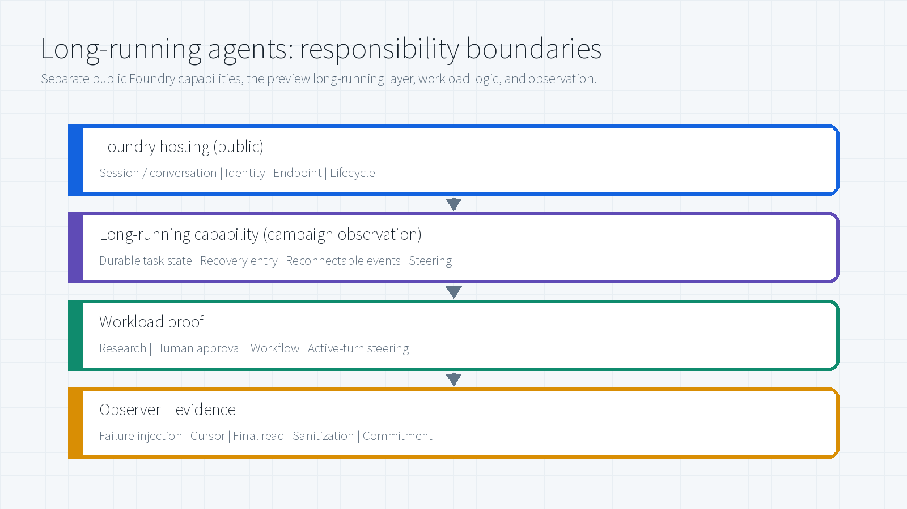
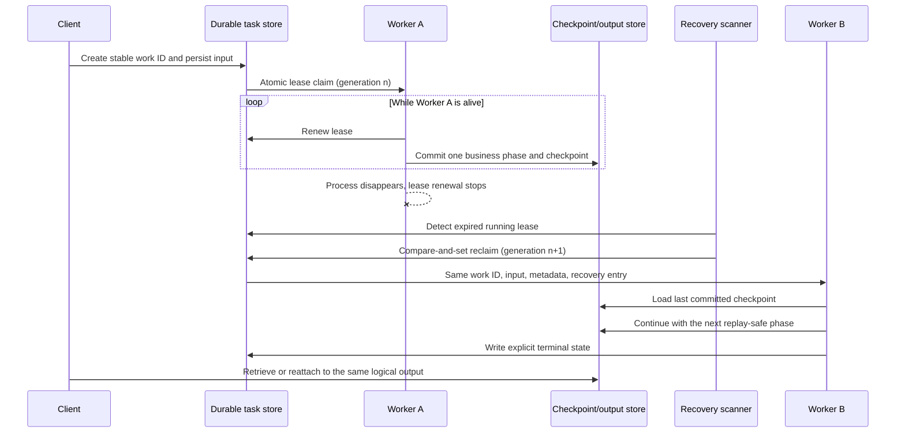
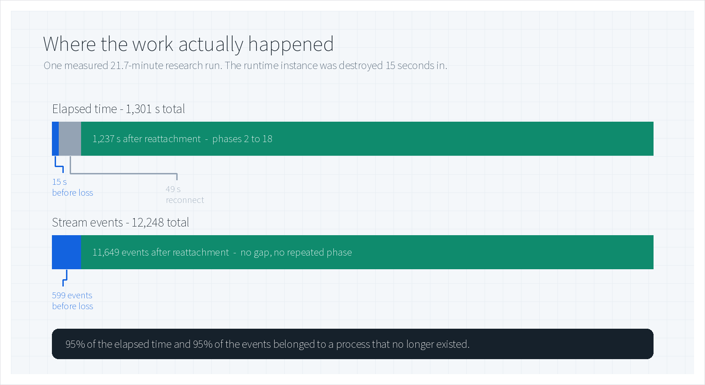
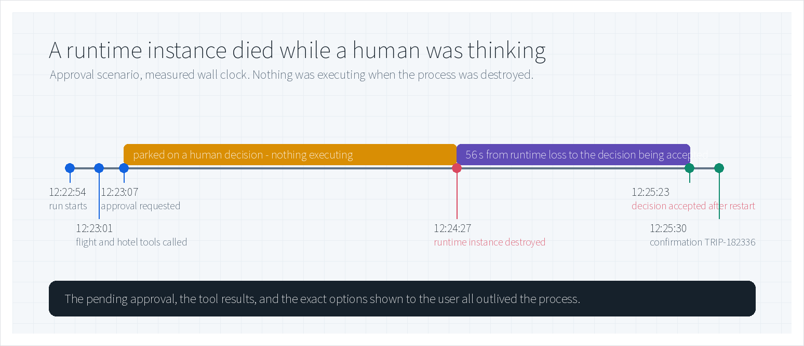
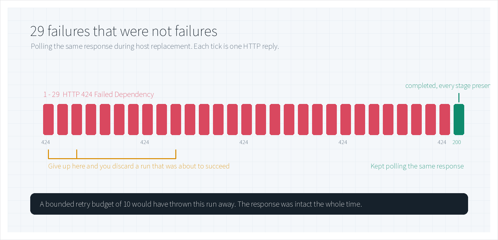
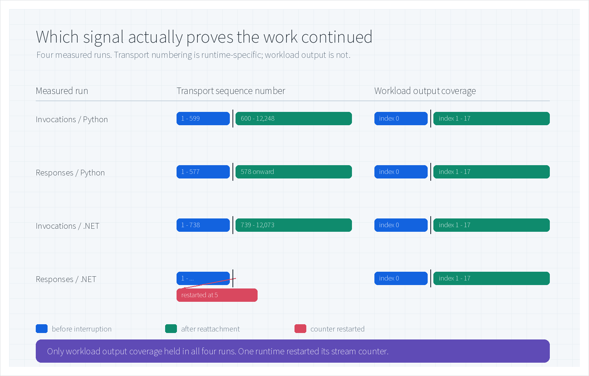
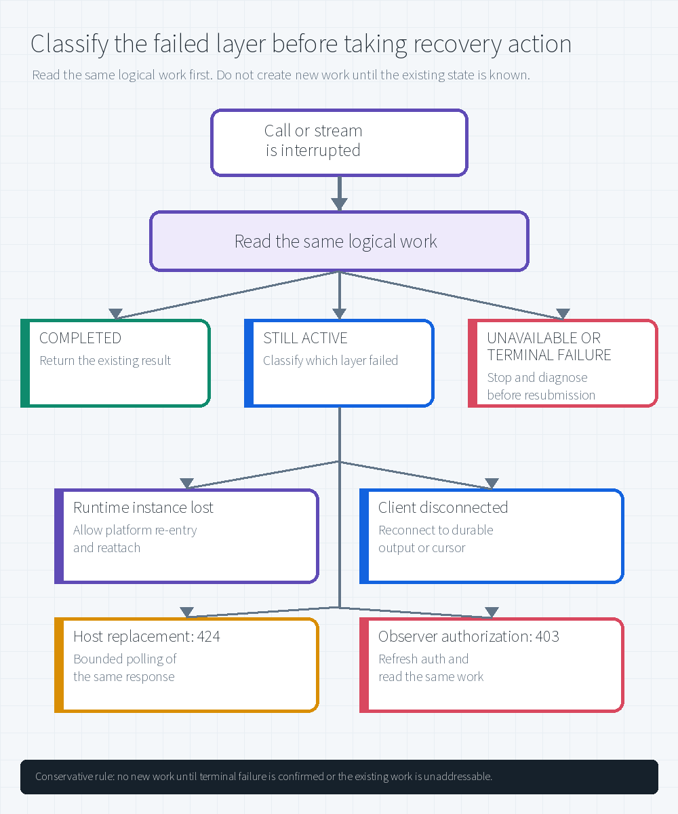

# Long-Running Agents on Microsoft Foundry: What Happens After the Process Dies

[](#3-method-what-was-actually-run)
[](#4-results)
[](#23-where-you-plug-in)
[](LICENSE)

Fifteen seconds into a twenty-two minute job, a research agent had just finished the first of eighteen phases when the process running it was destroyed. Nothing was resubmitted. Twenty-one minutes later the same job reported completion — all eighteen phases delivered, 12,248 stream events, no gap and no repeated phase.

Ninety-five percent of that work was performed by a process that no longer existed.

This page explains why that worked, which signals proved it, and which perfectly reasonable instincts would have destroyed it.

> **What this is.** Measured behavior from a private-preview evaluation of long-running agent execution on Microsoft Foundry Hosted Agents.
> **What it is not.** It ships **no preview SDK source, complete agent implementation, end-to-end deployment recipe, API schema, or raw telemetry**, because the recovery extension was in private preview at the time. Section 2.4 shows only the minimum configuration and call path needed to locate the feature. Every number is an observation from that evaluation, not a service-level commitment.

> **Author:** Xinyu Wei (魏新宇)

[中文](README-CN.md) | English | [Hosted agents overview](https://learn.microsoft.com/en-us/azure/foundry/agents/concepts/hosted-agents) | [Hosted agent quickstart](https://learn.microsoft.com/en-us/azure/foundry/agents/quickstarts/quickstart-hosted-agent)

---

## Executive Summary

Long-running agents fail in a way that short calls do not: **the process disappears while the work is still valid.** A client that treats this as an error and resubmits abandons live work, pays for two runs, and risks committing the same external action twice.

The capability under evaluation separates the **logical work** from the **process that executes it**. The work carries a durable identity, its input and progress outlive the process, and replacement compute re-enters from the last checkpoint. Across eight scenarios — two languages, two protocols, four kinds of interruption — every run reached its documented terminal result after being interrupted.

| Measured | Value | Why it matters |
|---|---|---|
| Work performed after the process was destroyed | **95%** of 1,301 s and 95% of 12,248 events | A destroyed process does not imply lost work |
| Runtime loss to approval decision accepted | **56 s**, with the original selections intact | A pending human decision can outlive the process holding it |
| Consecutive `HTTP 424` before normal completion | **29** | A retry budget of 10 would have discarded a healthy run |
| Scenarios reaching their documented terminal result | **8 of 8**, one accepted run each | Capability validation, not a reliability benchmark |
| Runs where transport sequence numbering proved continuity | **3 of 4** | One runtime restarted its counter; workload output held in all four |

**What this evidence does not establish:** production availability, SLA, behavior under load or concurrency, multi-region recovery, cost, and business correctness. Each scenario ran once. This is a reason to fund a controlled evaluation, not a production sign-off.

---

## 1. Background: the third outcome

A short agent call has two outcomes — it returns, or it throws. A twenty-minute agent run has a third: the process disappears while the work is still valid.

Three things can happen inside that window. The runtime instance can stop, whether from a crash, a redeploy, host replacement, or a lifecycle action. The client's stream can end without ever delivering a terminal event. And the user can change their mind halfway through.

None of these are solved by retrying the request. A retry starts a *new* run and walks away from work that is still alive. You now have two runs, you pay for both, and any external action the first one already committed may happen a second time. That reflex is the most expensive mistake in this space, which is why everything below is about **reattaching to existing work** rather than resubmitting it.

### What "runtime instance" means here

A Hosted Agent is your own agent code, packaged as a container image. Foundry runs that code inside a per-session, VM-isolated sandbox and manages its lifecycle for you. Throughout this page, **runtime instance** means the currently running copy of that code.

It is not a Docker container you operate. Losing it removes the process, its memory, and its open connections. It does not delete the agent definition, the session, or any work that was recorded outside the process — and that distinction is the whole point.

### What the platform already gives you

The public platform provides the hosting baseline: per-session isolation, a persisted `$HOME` and `/files` that survive idle deprovisioning, durable conversation history, a dedicated Microsoft Entra identity, and managed lifecycle and observability ([source](https://learn.microsoft.com/en-us/azure/foundry/agents/concepts/hosted-agents)).

What that documentation does not tell you is whether *your* workload resumes correctly when active work is interrupted. Idle-state restoration and active-work recovery are different claims. The evaluation deliberately targeted the second one.

| Layer | Public documentation (July 21, 2026) | What was measured | Boundary |
|---|---|---|---|
| Session state | `$HOME` and `/files` are restored when idle compute resumes | Active work continued after injected runtime loss | Idle restoration is consistent with, but does not prove, active-work recovery |
| Responses | Conversation history, streaming lifecycle, and background polling are platform-managed | The same response delivered output indexes 0-17 across recovery | Proves this response, not an SLA for every workload |
| Invocations | The application owns payload, session semantics, task tracking, and polling | Explicit recovery events and phases 1-18 were observed | The application still owns correct checkpoint and side-effect semantics |

---

## 2. How it works: address the work, not the process

<div align="center"></div>

Recovery rests on a single idea: **give the work an identity that outlives the process, and re-enter that work rather than resurrecting the process.**

In practice it runs in seven steps. The client starts one logical work item and keeps its stable reference. Before execution begins, the long-running layer persists that identity, the input, and the lease metadata needed to find the work again. As the agent runs, it records business progress — a phase number, a watermark, an approval state, or a pointer to external state. Then the runtime instance is lost: the process, its memory, and the socket vanish, but the durable record does not. Foundry provides replacement compute, the same logical work is re-entered with recovery context, the application loads its checkpoint and continues from a known boundary, and the client reattaches to confirm continuity.

Walk the measured 18-phase run through those steps and the ordering becomes concrete. Steps one through three covered phase 1. Step four destroyed the process. Steps five and six carried phases 2 through 18. The client reattached at step seven — but note *when*: **the workload recovered whether or not anyone was watching.** Reattachment resumes observation, not execution. That single fact is what makes a dropped client stream a non-event instead of an incident.

### 2.1 Four responsibilities that must stay separate

Keeping these apart is most of the design work, because it determines what you are allowed to conclude when something breaks.

| Layer | Owns | Must remain valid | Does not prove |
|---|---|---|---|
| Foundry Hosted Agent platform | Runtime sandbox, endpoint, identity, session and conversation state, lifecycle | The ability to provision replacement compute and address the same session | That application progress was checkpointed correctly |
| Long-running execution layer | Stable work identity, persisted input, recovery entry, task and stream state | The logical work record across process loss | That external business actions are safe to repeat |
| Agent framework or application | Meaningful checkpoints, workflow phase, approval state, terminal result | Enough business progress to resume safely | That the client will reconnect correctly |
| Client or operator | Stable work reference, reconnect cursor, bounded polling, auth refresh | The ability to observe the same work after a disconnect | That a transport error means the workload failed |

The practical rule: **runtime state, workload state, and observer state are three different failure domains.** A failure in one must never be promoted automatically into a failure of the others. Section 6 is essentially this rule turned into a lookup table.

### 2.2 Recovery is at-least-once, and that is your problem to handle

A recovered handler re-enters with the same identity and input. It does **not** replay your code's execution, and it does not re-run individual model or tool calls from where they stopped.

The consequence is unavoidable: work performed after the last durable checkpoint can run again. Checkpoint granularity defines the replay window, and idempotency keys, compare-and-set writes, and durable external operation IDs are what stop that replay from becoming a duplicate booking, payment, or write.

So it is worth being explicit about what recovery is *not*. It is not resurrection of the old socket. It is not deterministic replay. It is not resubmitting the original request as a new job. It is not proven by an agent version showing `active`, which only means the control plane accepted a deployment. And it is not safe at all unless committed side effects can be recognized and skipped on re-entry.

### 2.3 Where you plug in

The model is framework-agnostic. What changes between tiers is how much of it you wire yourself.

| Tier | What the platform handles | What you still own | Best fit |
|---|---|---|---|
| Microsoft Agent Framework on Foundry hosting | The highest-level integration over Responses; most lifecycle behavior is wired for you | Configuration, framework checkpoints, safe side effects | Teams that want the least recovery plumbing |
| Responses protocol | OpenAI-compatible contract, conversation history, streaming lifecycle, background execution, polling, cancellation | Opting into resilient behavior, preserving checkpoints, validating output continuity | Conversational and tool-using agents |
| Invocations protocol | Transport and primitives only | Session and task semantics, event schema, checkpoint mapping, polling, recovery behavior | Structured workflows and custom protocols |

LangGraph, Microsoft Agent Framework, and hand-written orchestration can all participate. None of them removes the application's obligation to define what "already done" means.

### 2.4 The LRA core: durable work, leases, and recovery re-entry

The client code later in this section is **not** the LRA core. The core is a runtime state machine that keeps the identity and input of logical work alive after the worker process disappears. The following model shows the contract without publishing private-preview SDK symbols, storage schemas, or service-internal implementation.

| Core primitive | Durable responsibility | Failure rule |
|---|---|---|
| Work record | Stable work and input identity, persisted input, status, retry state, small metadata | A replacement worker receives the same identity and input; it does not create a new job |
| Lease | One current owner, lease generation, and expiry | The active worker renews it; process loss abandons it without writing a false terminal state |
| Atomic reclaim | Compare-and-set takeover of an expired lease | Only one replacement worker can advance the lease generation and re-enter the work |
| Progress reference | A small watermark or pointer to a framework/application checkpoint | Work after the last committed checkpoint may run again |
| Durable output state | Checkpointed response snapshots, stream events, and explicit terminal state | Observers rebuild from committed output; stream closure alone is not completion |



The old process cannot catch its own hard death. Recovery starts because lease renewal stops, a later scanner observes expiry, and one new worker atomically reclaims the same record. The lease generation prevents split-brain execution: a stale worker from generation $n$ must not commit after generation $n+1$ has taken ownership.

#### 2.4.1 Conceptual runtime loop

This pseudocode describes the runtime contract, not the private SDK or its database implementation:

```python
def recover_expired_work(now):
	for work in task_store.list_expired_running(now):
		claim = task_store.reclaim_if_lease_matches(
			work_id=work.id,
			expected_generation=work.lease_generation,
			new_owner=worker_id,
		)
		if not claim.acquired:
			continue

		run_claimed_work(work, claim, entry_mode="recovered")


def run_claimed_work(work, claim, *, entry_mode):
	# The runtime renews and generation-fences the lease while user code runs.
	with task_store.renew_lease_while_running(work.id, claim.generation):
		invoke_handler(
			work_id=work.id,
			persisted_input=work.input,
			metadata=work.metadata,
			checkpoint=progress_store.load_checkpoint(work.id),
			entry_mode=entry_mode,
			lease_generation=claim.generation,
		)


def run_handler(context):
	for phase in plan.remaining_after(context.checkpoint):
		phase_key = f"{context.work_id}:{phase}"
		result = execute_phase(
			context.persisted_input,
			phase,
			idempotency_key=phase_key,
		)
		commit = progress_store.commit_phase_once(
			work_id=context.work_id,
			expected_checkpoint=context.checkpoint,
			phase=phase,
			result=result,
			side_effect_ids=result.side_effect_ids,
			lease_generation=context.lease_generation,
		)
		output_store.project_snapshot(commit)  # Idempotent, rebuildable projection.
		context.checkpoint = commit.checkpoint

	task_store.mark_completed(
		context.work_id,
		generation=context.lease_generation,
	)
```

Five invariants matter more than the method names:

1. **Reclaim is conditional.** The expired lease generation must still match, otherwise another worker already owns the work.
2. **The runtime owns the heartbeat.** Lease renewal continues while user code runs, and every durable write is fenced by the current lease generation so a stale worker cannot commit.
3. **Recovery is at-least-once.** A crash after an external action but before its phase commit can re-run that phase. The same `phase_key` must deduplicate that action.
4. **One store is the progress authority.** `commit_phase_once` advances the business checkpoint and records result/side-effect identity together. The client-facing output snapshot is an idempotent projection that can be rebuilt from that commit; it is not a second source of truth.
5. **The original deadline does not reset.** Recovery changes the worker and lease generation, not the identity, input, or wall-clock recovery objective of the logical work.

The LRA runtime gets the same work back into a handler. It cannot infer whether a payment, booking, tool call, or workflow node was already committed. That is why the application checkpoint and side-effect ledger are part of the recovery contract even though they are not the lease engine itself.

### 2.5 From Hosted Agent configuration to a recoverable call

The feature is not enabled by one magic switch in the portal. Four layers must line up. The first and fourth use the public Hosted Agents and Responses surfaces. The recovery options and checkpoint hooks in the middle are from the **private-preview build evaluated here**; as of July 26, 2026, they are not available in the public PyPI interface. Treat those lines as preview-specific usage evidence, not a promise about the current public SDK.

| Layer | Configuration | What it enables | What it does not do alone |
|---|---|---|---|
| Hosted Agent version | `host: azure.ai.agent` + Responses protocol | Deploys your code and exposes a managed Responses endpoint | Does not make an active handler crash-recoverable |
| Agent process *(private preview)* | Preview recovery opt-in | Re-invokes a stored background response after process loss | Does not know which business step was committed |
| Handler *(private preview)* | Recovery context + framework checkpoint hook | Defines the last durable output boundary | Does not make external side effects idempotent |
| Client | `store=True`, `background=True`, same `response.id` | Creates addressable work and lets the caller poll or reattach | Must not replace recovery with a new create call |

#### 2.5.1 Declare a Hosted Agent with the Responses protocol

This is a public `services` fragment for an **existing, scaffolded azd project**. It follows the current Foundry `azure.yaml` shape; the required top-level project metadata, model deployment, and provisioning blocks are omitted because they are independent of recovery. Start from the [official Hosted Agent sample](https://github.com/microsoft-foundry/foundry-samples/tree/main/samples/python/hosted-agents) rather than treating this fragment as a complete file.

```yaml
services:
  research-agent:
    host: azure.ai.agent
    project: src/research-agent
    language: python
    kind: hosted
    codeConfiguration:
      runtime: python_3_13
      entryPoint: app.py
    protocols:
      - protocol: responses
        version: 2.0.0
    container:
      resources:
        cpu: "0.5"
        memory: 1Gi
```

In a complete azd project, `azd deploy` reads this service block, creates an immutable Hosted Agent version, and routes the declared protocol endpoint. CPU, memory, image or source packaging, model selection, and identity belong to the version definition; they are not the recovery checkpoint.

#### 2.5.2 Opt the agent process into recovery *(private preview)*

The evaluated build added a **preview recovery opt-in** to the Responses host. That option changed a stored background response from “mark failed after a crash” to “re-invoke the handler in the next process lifetime.” A separate preview steering option allowed an overlapping follow-up turn to queue and cooperatively stop the current turn.

The exact constructor fields are intentionally not reproduced here: they are absent from the public PyPI interface and form part of the private-preview API surface. With public packages, you still get the Hosted Agent and background Responses baseline shown in Sections 2.5.1 and 2.5.4, but you must not infer active-handler crash recovery from that baseline. Preview participants should use the package and enablement instructions supplied with their preview build.

#### 2.5.3 Resume from a business checkpoint *(private preview)*

Re-invocation alone starts the handler again. The private-preview handler received recovery context, loaded the last framework snapshot, and committed a framework checkpoint only after a complete business unit was durable. The evaluated sample made one completed phase equal one finalized output item. A process loss before the checkpoint repeated that phase; a loss after it skipped the phase on recovery.

Those recovery-context members and checkpoint hooks are also private-preview API surface, so this public article describes their contract rather than reproducing their names. The application pattern is still concrete:

1. Read the stable logical-work identity and last committed business watermark.
2. Reconstruct application state from the framework snapshot or an external store.
3. Run exactly one replay-safe phase.
4. Persist its output and side-effect identifiers.
5. Advance the framework checkpoint only after step 4 succeeds.

Any payment, booking, write, or tool action inside the replay window still needs the idempotency discipline from Section 6.4.

#### 2.5.4 Separate dispatch from observation

The standard Hosted Agent client surface comes from the Foundry project client. Keep the code that creates work separate from every process that observes it:

```python
import time


class ResponseReader:
	def __init__(self, responses_api):
		self._responses_api = responses_api

	def retrieve(self, response_id: str):
		return self._responses_api.retrieve(response_id)


def dispatch(client, *, work_key: str, prompt: str) -> None:
	# Atomic unique insert: exactly one concurrent dispatcher can claim this key.
	claim = durable_state.claim_dispatch(
		work_key,
		deadline_at=time.time() + settings.recovery_objective_seconds,
	)
	if not claim.acquired:
		raise RuntimeError(f"work already claimed: {work_key}")

	response = client.responses.create(
		input=prompt,
		store=True,
		background=True,
	)
	durable_state.attach_response(
		work_key,
		response_id=response.id,
		expected_state="dispatching",
	)


def observe(reader: ResponseReader, *, work_key: str):
	work = durable_state.require_dispatched(work_key)
	response = reader.retrieve(work.response_id)

	while response.status in {"queued", "in_progress"}:
		if time.time() >= work.deadline_at:
			raise TimeoutError(f"response {work.response_id} exceeded its deadline")
		time.sleep(2)
		response = reader.retrieve(work.response_id)

	if response.status != "completed":
		raise RuntimeError(f"terminal response status: {response.status}")
	validate_workload_output(response)
	return response
```

`claim_dispatch` must be a unique, atomic insert that moves the logical work to `dispatching`; it closes the concurrent-dispatcher race before the remote call. `attach_response` is a compare-and-set transition to `dispatched`. `durable_state` represents a database or other store that survives the observer process, not an in-memory dictionary. Pass `ResponseReader(client.responses)` to the observer rather than the full client. Its public application interface exposes only `retrieve`, but this is still a maintainability boundary, **not** a security sandbox or RBAC boundary. If observer code is untrusted, isolate it behind a separate service and identity. After a restart it must load a dispatched mapping or fail closed. The recovery objective is workload configuration, not a fixed small retry budget; it must exceed the expected healthy runtime and host-replacement allowance. `validate_workload_output` is application code: for the measured research run it checked the finalized output indexes and expected phase count. Platform status and workload completion are separate checks.

There is one unavoidable public-API boundary in this minimal pattern: remote create and `attach_response` are not one atomic transaction, and the public create call does not expose lookup by your `work_key`. A process can therefore die after the claim, either before remote creation or after remote creation but before the response ID is attached. Leave that record in `dispatching`; do not automatically create again. A normal transactional outbox cannot decide whether an unknown remote create succeeded. Production dispatch needs a product-supported idempotency/deduplication contract or an operational reconciliation path for `dispatching` records and orphaned responses. The evaluation started observation only after the response ID had been durably captured.

If the polling process disappears after the mapping exists, a new observer reads `response_id` and `deadline_at` from `durable_state` and retrieves **that same response**. Streaming is also a public Responses mode, but active-handler crash replay is part of the private-preview recovery contract. The evaluation persisted transport cursors when available, accepted a new `response.in_progress` snapshot as a reset point, and rebuilt observer output from finalized items.

Most importantly, it did **not** make a high transport sequence cursor the sole recovery key: one measured runtime restarted sequence numbering at 5. A sequence number can optimize replay within a compatible stream lifetime, but the durable `response_id` plus workload state are the recovery authority. Continue to validate finalized output indexes, phases, and durable business state as described in Section 5.

A later sequential turn can use `previous_response_id=response_id`. Concurrent queuing and cooperative steering require the preview option shown above; the public `previous_response_id` field by itself only establishes response-chain continuity.

The shortest operational route after deployment is `azd ai agent invoke`; it manages the Hosted Agent session and Responses conversation for ordinary calls. Use the explicit client pattern above when your application must own the background response ID, polling deadline, dispatch/observe separation, and workload-level completion checks.

---

## 3. Method: what was actually run

Everything above is a design claim until it survives a deliberate interruption. This is how that was tested.

| Dimension | Fixed condition | Why it matters |
|---|---|---|
| Execution window | July 22-23, 2026 | Keeps earlier blocked or partial attempts out of the final campaign |
| Hosting | Eight active Hosted Agents in one Canada Central Foundry project | Holds the hosting control plane and region constant |
| Runtime and protocol | Python and .NET; Responses and Invocations | Tests whether the conclusion survives language and protocol changes |
| Scope | Each runnable sample's main documented scenario | Fixes the denominator at **8 scenarios** |
| Accepted evidence | Complete event capture or structured client log, plus terminal service state | A dropped stream or a similar-looking rerun cannot pass |
| Repetition | One accepted end-to-end run per scenario (**N=1 each**) | Capability validation, not a reliability benchmark |
| Excluded | Model quality, business correctness, load, concurrency, cost, multi-region | No conclusions are available on these dimensions |

A scenario passed only when the **complete documented plan reached a terminal result after the interruption**. Partial recovery did not count. A resumed stream that stalled did not count. A fresh run producing similar text definitely did not count.

| # | Runtime / protocol | Scenario and interruption | Required terminal proof | Result |
|---|---|---|---|---|
| 1 | Python / Invocations | Research; runtime-instance loss | Recovery marker, phases 1-18, completed task | **PASS** |
| 2 | Python / Responses | Research; runtime-instance loss | Same response, output indexes 0-17, 18 items | **PASS** |
| 3 | .NET / Invocations | Research; runtime-instance loss | Recovery marker, phases 1-18, completed task | **PASS** |
| 4 | .NET / Responses | Research; runtime-instance loss | Same response, output indexes 0-17, 18 items | **PASS** |
| 5 | Python / Invocations | Approval; runtime loss while suspended | Decision applied after restart, confirmation `TRIP-182336` | **PASS** |
| 6 | Python / Responses | Approval; runtime loss while suspended | Recovery lifecycle, confirmation `TRIP-749637` | **PASS** |
| 7 | Python / Responses | Durable workflow; host replacement | Complete French, Spanish, and round-trip output | **PASS** |
| 8 | Python / Responses | Steering; deliberate interruption | Turn 2 queued, turn 1 ended safely, turn 2 completed | **PASS** |

Optional cancel, delete, and deny branches were outside this matrix and remain unverified here.

---

## 4. Results

### 4.1 A 21.7-minute run that outlived its process

<div align="center"></div>

The Python Invocations research agent produced 599 events in its first 15 seconds and reached phase 1. Then the runtime instance was destroyed and the stream went dead.

No resubmission followed. The client reattached, received an explicit recovery event, and the sequence counter picked up at **600** — exactly where it had stopped. Over the next 1,237 seconds the reattached stream delivered 11,649 more events covering phases 2 through 18, including 192 status events and 17 phase events, and ended in a completed terminal state.

The totals: 1,301 seconds, sequence 1 through 12,248, no gap and no repeated phase. Put another way, both the elapsed time and the event count split 5/95 across the moment the process died. The chart above is that ratio drawn to scale, and it is the single clearest argument against resubmitting.

### 4.2 The same interruption, a different protocol

Language and protocol changed; the conclusion did not.

The Python Responses research run recorded 11,584 events. Before the interruption: 577 events over 13 seconds, output index 0, 570 text deltas. The crash stream reported a failed response. After a **47-second** reconnect gap, lifecycle replay was observed, the sequence resumed at 578, and 11,005 further events arrived over 1,140 seconds carrying output indexes 1 through 17 and 10,918 text deltas. Completion was delivered on the reattached stream.

Output index 0 was produced before the interruption and indexes 1 through 17 after it. **No index was repeated and none was skipped.** For a Responses workload that is the strongest evidence available that this was the same logical response rather than a convincing new one — and it is exactly the check a resubmitted run would fail.

### 4.3 A runtime instance died while a human was thinking

<div align="center"></div>

This is the case teams underestimate, because when it happens **nothing is executing at all**. The graph had parked at an approval and was waiting on a person.

The run started at 12:22:54 and called its flight and hotel tools seven seconds later. At 12:23:07 it requested approval for a three-night Tokyo booking and stopped. Eighty seconds into that wait, at 12:24:27, the runtime instance was destroyed. The approval decision was sent after restart and accepted at 12:25:23 — **56 seconds** after the loss. Two seconds later the agent resumed with the *same* flight and hotel selection it had offered before, and at 12:25:30 it returned confirmation `TRIP-182336`.

The pending approval, the tool results, and the exact options shown to the user all outlived a process that no longer existed. A second run of the same pattern on the Responses protocol reached its own confirmation, `TRIP-749637`.

> These are deterministic sample tools. The confirmation numbers prove durable graph state and exactly-once decision handling — not a real airline or hotel booking.

### 4.4 Twenty-nine failures that were not failures

<div align="center"></div>

While its host was being replaced, the durable workflow run received `HTTP 424 Failed Dependency` **29 consecutive times** on the same response. The client kept polling instead of resubmitting, and the run completed with every stage intact:

```text
[French]
Le rapide renard brun saute par-dessus le chien paresseux.
[Spanish]
El rápido zorro marrón salta por encima del perro perezoso.
[Original English]
The quick brown fox jumps over the lazy dog.
[French]
Le rapide renard brun saute par-dessus le chien paresseux.
[Spanish]
El rápido zorro marrón salta por encima del perro perezoso.
[Round-trip English]
The quick brown fox jumps over the lazy dog.
```

A client that treated the first 424 as terminal would have thrown away a run that was about to succeed. So would a client with a sensible-looking retry budget of ten. The response was intact the entire time; only its host was being replaced.

This is also the finding most easily over-generalized, so to be precise: **this does not make every 424 retryable.** It makes *this* condition — host replacement on a response you can still address — worth classifying before you give up on it.

### 4.5 Interrupting on purpose

Not every interruption is a failure. A second turn was sent while the first was still generating.

The new input was accepted as `queued` rather than rejected. The first turn wound down cooperatively at a safe boundary and was marked completed instead of being killed mid-token. The replacement turn then polled `in_progress` seven times and completed with a correct answer to the new question. Steering, in other words, is a first-class path rather than a race between cancel and restart.

---

## 5. The finding that transfers: don't trust the sequence number

<div align="center"></div>

If you take one engineering rule away from this page, take this one.

Three of the four research runs continued their transport sequence numbers cleanly across reattachment. The fourth did not: the .NET Responses stream **restarted its counter at 5** after reconnecting — while still delivering output indexes 1 through 17 on the same response. By any workload measure that run recovered perfectly. By a sequence-continuity check it would have been flagged as broken.

| Run | Before interruption | After reattachment | Signal |
|---|---|---|---|
| Invocations / Python | seq 1-599 | seq 600-12,248 | Sequence continued |
| Responses / Python | output index 0 | output indexes 1-17 | Index continued |
| Invocations / .NET | seq 1-738 | seq 739-12,073 | Sequence continued |
| Responses / .NET | output index 0 | output indexes 1-17 | Index continued, **sequence restarted at 5** |

So validate continuity on *what the workload produced* — output indexes, phase numbers, durable state — not on *how the transport numbered its frames*.

And while you are there, note a second trap in the same family: a monotonic sequence is not a gap-free sequence. `10, 12` is monotonic and still missing an event. A continuity check that only asserts "increasing" will pass a stream that silently lost data.

---

## 6. Client implementation: code, logs, and fixes

This is where the platform boundary becomes client engineering. The continuity helper below corrects the private evaluation extractor; its companion coverage helper makes the workload-level acceptance rule explicit. Executable counterexamples proved that the original sorted-order check accepted both gaps and duplicates. The other snippets are public-safe patterns distilled from the evaluation harness, not preview SDK source. Log excerpts are sanitized and retain only the behavior needed to explain the failure and fix.

### 6.1 Continuity: reject gaps and duplicates

The broken check was effectively `sequence == sorted(sequence)`. That proves ordering, not continuity. The replacement checks every adjacent step and validates workload output against the complete expected domain.

```python
def sequence_has_no_gap(sequence: list[int]) -> bool:
	return all(
		current - previous == 1
		for previous, current in zip(sequence, sequence[1:])
	)


def output_coverage_complete(indexes: list[int], expected_last: int) -> bool:
	return sorted(indexes) == list(range(expected_last + 1))
```

| Counterexample | Original sorted-order check | Corrected check |
|---|---:|---:|
| Dropped event: `[10, 12]` | `True` | `False` |
| Duplicate event: `[10, 10, 11]` | `True` | `False` |
| Clean stream: `[10, 11, 12]` | `True` | `True` |

The same executable check rejected a finalized output-item list with a missing index and with a duplicated index. Feed it one index per completed output item, not every streaming delta: multiple deltas for one item legitimately reuse that item's `output_index`. Use transport sequence only as diagnostic evidence; make workload indexes, phases, and durable state the acceptance criteria.

### 6.2 Terminal state: a `done` frame is not proof of success

The local evaluation evidence included streams with a bare `done` frame, but the harness pass criteria came from explicit invocation status and workload assertions. A closed stream can mean success, cancellation, failure, or observer loss. Map the protocol-specific terminal event to a workload invariant before declaring success.

```python
def completion_is_proven(snapshot: dict, *, expected_phases: int) -> bool:
	return (
		snapshot.get("status") == "completed"
		and snapshot.get("terminal_event") == "run_complete"
		and snapshot.get("phases_completed") == expected_phases
	)
```

This is the distilled phase-based pattern used by the harness, not a universal adapter. A Responses client should substitute its own explicit terminal event and output-coverage rule; a bare `{"type": "done"}` still does not prove the business result.

### 6.3 Bounded retry: classify `424` separately from `403`

The sanitized failure trace below came from the real workflow client. It kept the same response reference throughout host replacement.

```text
Created durable background response: <response-id>
Redeploy or replace the host while this client continues polling.
Host temporarily unavailable; retrying: Client error '424 Failed Dependency'
Response status: in_progress
... the same response returned 424 a total of 29 times ...
Response status: completed
PASS: The original response completed.
```

The repair was not "retry every error." It was to preserve the same work reference, classify the layer that failed, and stop at a caller-owned deadline.

```python
def recovery_action(
	status_code: int,
	*,
	host_replacement_confirmed: bool,
	same_work_addressable: bool,
	observer_auth_expired: bool,
	deadline_expired: bool,
) -> str:
	if deadline_expired:
		return "timeout"
	if status_code == 424 and host_replacement_confirmed and same_work_addressable:
		return "retry_same_work_with_bounded_backoff"
	if status_code in {401, 403} and observer_auth_expired:
		return "refresh_observer_auth_then_read_again"
	return "fail_closed"
```

The deadline should come from the workload's recovery objective, not an arbitrary small retry count. `403` takes a different path because refreshing observer authorization is safer than replaying business work.

### 6.4 Human approval: make the decision and the side effect idempotent

The real approval run crossed the pause once and produced one confirmation:

```text
[12:25:23Z] lifecycle: running
[12:25:23Z] -> human_approval
[12:25:25Z] agent: selected flight and hotel
[12:25:30Z] -> agent    Confirmation: TRIP-182336
done
```

After recovery, the same approval message may be delivered again. Persist the decision under a stable logical-work checkpoint, reject conflicting replays, and pass the same key to the external side effect.

```python
def apply_approval(ledger, logical_work: str, checkpoint: str, requested: str):
	key = (logical_work, checkpoint, "approval")
	recorded = ledger.put_if_absent(key, requested)
	if recorded != requested:
		raise RuntimeError("conflicting approval replay")
	return ledger.run_once(
		(*key, "booking"),
		lambda: book_trip(recorded, idempotency_key=key),
	)
```

`put_if_absent` and `run_once` are interface sketches, not library calls. Their implementation must atomically claim the operation, persist its terminal result, and return that result on replay; the downstream operation must also honor its idempotency key. Otherwise, durable recovery can correctly replay the step while the client incorrectly books twice.

---

## 7. Failure and recovery playbook

<div align="center"></div>

Every row below follows the same discipline: **read the same logical work first, decide which layer actually failed, and create nothing new until the existing state is known.**

| Symptom | What actually failed | Wrong reflex | Correct recovery | Confirmation |
|---|---|---|---|---|
| Stream stops with no terminal event | One execution process, not necessarily the work | Resubmit the job | Let the platform re-enter, then reattach with the same work reference and last durable position | Recovery marker or continued workload output, then explicit terminal state |
| Workflow parked on an approval, nothing running | The runtime instance; the suspended workflow is intact | Rebuild the approval request | Send the decision to the same logical work after restart | Post-approval path reaches terminal state with identical selections |
| Client loses SSE or HTTP connectivity | The observation channel only | Assume the agent stopped and resubmit | Reconnect to the same work from its durable output position | Output and phase coverage continue with no duplicate business result |
| Repeated `424` on the same response | Nothing yet — the host is being replaced | Treat the first 424 as terminal | After classifying this condition, poll the same response with bounded backoff | Response completes with all expected stages present |
| `403` on a final read | Your authorization, not the workload | Rerun the workload | Refresh observer auth and repeat the read-only query | `200` with completed terminal state |
| Captured log stops at a byte or time limit | Evidence capture | Infer failure from the last captured line | Query durable state directly, or recapture the full stream | Terminal state read from the service, not the log tail |
| New instruction arrives mid-turn | Nothing — this is a steering path | Hard-kill the turn and race a new run | Queue the input and let the current turn stop at a safe boundary | Old turn ends cooperatively; new input reaches a terminal answer |

---

## 8. Design guidance

These generalize well beyond the preview that produced them.

1. **Checkpoint at a boundary you can name.** "Phase 7 of 18 complete" is recoverable. "Somewhere in the middle" is not.
2. **Give the work an identity that outlives the process.** Recovery means addressing a logical work item, not resuming a socket.
3. **Assume at-least-once execution.** Design every external side effect so that repeating it after a checkpoint is harmless.
4. **Separate observer failures from workload failures.** Your token expiring is your problem, not the run's.
5. **Classify status codes before acting on them.** Confirm against durable state before declaring a business failure.
6. **Make terminal state explicit.** A stream that merely ends is not a result.
7. **Decide who owns an approval decision.** Applying it twice is worse than applying it late.
8. **Distinguish suspended work from active work.** A parked graph has no active execution and its compute may be reclaimed. That is expected behavior, not a fault.

---

## 9. Evidence, boundaries, and adoption gate

### 9.1 How these claims were challenged

Eight passing runs are easy to over-read, so each conclusion was attacked before it was published.

| Method | Challenge | Evidence used | Outcome |
|---|---|---|---|
| Confirmation | Did the same logical work reach terminal state? | Same work reference, terminal service state, full phase and output coverage | Supported in all eight scenarios |
| Falsification | Could a fresh rerun look like recovery? | Output index 0 before, 1-17 after, on the same response | Fresh-run explanation rejected for the Responses runs |
| Enumeration | Were only flattering examples selected? | Fixed denominator of eight main scenarios | 8/8 passed; auxiliary branches excluded explicitly |
| Contradiction | If sequence continuity were necessary, would every valid recovery satisfy it? | .NET Responses recovered while restarting its counter at 5 | Universal sequence rule disproved |
| Reverse inference | Does a terminal result alone prove recovery? | Checkpoint, injected loss, connection break, and post-restart continuation were also required | Terminal-only evidence rejected as insufficient |
| Analogy | Do observations align with public platform concepts? | Public session persistence and protocol ownership documentation | Consistent, but idle resume was never used as proof of active recovery |
| Consistency | Does the conclusion survive runtime and protocol changes? | Python/.NET and Responses/Invocations pairs | Workload-output continuity held; transport event shape did not |

### 9.2 What the numbers trace to

| Claim | Source artifact |
|---|---|
| Event counts, sequence ranges, elapsed times | Per-scenario captured event streams |
| Phase and output index coverage | Stream analysis over those captures |
| Approval timeline and confirmation numbers | Client session logs |
| 424 retry behavior and stage output | Workflow client log |
| Steering queue behavior and terminal answers | Steering client log |

Raw artifacts stay private because they contain endpoints, work identifiers, environment metadata, and generated payload text. Every chart on this page is rendered from the aggregate values above and contains no identifiers.

### 9.3 Boundaries

- Numbers are **observed values from one evaluation**, not benchmarks, guarantees, or SLAs.
- The capability was in **private preview**, so its implementation, packages, APIs, and deployment recipes are not published here.
- Results cover **eight documented main scenarios**, each run once. Cancel, delete, and deny branches were not counted.
- Recovery behavior was validated. Business-domain correctness and model quality were not.
- Verify current capabilities against the [official documentation](https://learn.microsoft.com/en-us/azure/foundry/agents/concepts/hosted-agents) before designing against anything described here.

### 9.4 Before you call this production-ready

For a specific workload, require all of the following:

- repeated failure-injection trials with an explicit recovery-time objective and failure budget;
- idempotency tests for every external write, approval, payment, booking, or tool side effect;
- load and concurrency tests that include overlapping turns and replacement compute;
- timeout, cancellation, retention, deletion, and dead-letter policy;
- monitoring that separates runtime, workload, observer, and authentication failures;
- revalidation against current product documentation for your target region, runtime, and protocol.

---

## Related work

| Repository | Relationship |
|---|---|
| [Foundry-Agent-Lifecycle-Build-Deploy-Operate](../Foundry-Agent-Lifecycle-Build-Deploy-Operate/) | The broader build, deploy, and operate lifecycle |
| [Foundry-Hosted-Agent-Toolbox-Demo](../Foundry-Hosted-Agent-Toolbox-Demo/) | Hosted-agent tools, memory, and skills |
| [Foundry-Agent-ModelOps-Governance](../Foundry-Agent-ModelOps-Governance/) | Operational-plane boundary mapping |

## License

[MIT](LICENSE)
