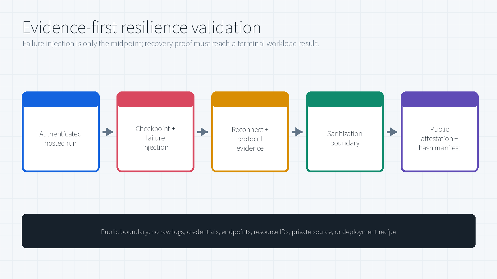

# Foundry Long-Running Agent Resilience — Private Preview Notes

> **Documentation only.** This page records public-safe concepts and high-level lessons from a limited Microsoft Foundry private-preview evaluation. It intentionally contains **no preview SDK/package source, implementation code, API schema, deployment recipe, executable validator, raw telemetry, service endpoint, resource identifier, credential, or customer workload data**.
>
> The observations below are not a production certification, service-level commitment, public product specification, or statement that every region, model, framework, protocol, and topology behaves identically. Use current [Microsoft Foundry documentation](https://learn.microsoft.com/en-us/azure/foundry/agents/concepts/hosted-agents) for publicly supported capabilities.

> **Author:** Xinyu Wei (魏新宇)

[中文](README-CN.md) | English | [Hosted agents overview](https://learn.microsoft.com/en-us/azure/foundry/agents/concepts/hosted-agents) | [Hosted agent quickstart](https://learn.microsoft.com/en-us/azure/foundry/agents/quickstarts/quickstart-hosted-agent)

---

## Executive Summary

Long-running agents need stronger evidence than an active deployment. The useful question is whether a workload preserves the right state, survives an interruption, reconnects to the intended logical work, and reaches the correct terminal outcome.

A limited private-preview campaign evaluated eight documented main scenarios spanning:

- Python and .NET workloads;
- Responses and Invocations protocols;
- active multi-phase research;
- suspended human approval;
- a durable multi-stage workflow;
- active-turn steering.

The campaign reached its documented acceptance criteria for all eight main scenarios. This statement is an **author-provided summary of a private evaluation**. The raw evidence and implementation are not public, so the result cannot be independently replayed from this repository.

## Responsibility Boundaries

| Layer | Responsibility | Public boundary |
|---|---|---|
| Foundry hosting | Publicly documented session/conversation state, identity, endpoint, and lifecycle behavior | Follow current Microsoft Learn documentation |
| Private-preview capability | Long-running behavior observed during the limited campaign | Implementation and private interfaces withheld |
| Workload | Checkpoint meaning, approval ownership, stage state, safe cancellation, and terminal business result | Only high-level proof patterns described here |
| Observer | Disruption, reconnect, final-state read, and evidence review | No raw telemetry or identifiers published |

## Active Work vs. Suspended Work

Long-running does not always mean continuous computation.

| Work shape | Durable state | What resumes it | Evidence target |
|---|---|---|---|
| Active research | Phase watermark and intermediate output | Recovery of pending work | Remaining phases continue and terminal success is reached |
| Suspended approval | Graph checkpoint and pending decision | A later approval request | The decision is applied once and the post-approval path completes |
| Durable workflow | Per-stage outputs | Background workflow recovery | Required stages and final round-trip result exist |
| Steering | Conversation state and queued replacement input | A materially different new turn | Old turn ends cooperatively and the queued turn completes |

A process can disappear while durable state remains. Continuity is a state-management property, not proof that the original process stayed alive.

## Protocol Ownership

| Concern | Responses | Invocations |
|---|---|---|
| Client contract | OpenAI-compatible Responses behavior | Application-defined request and result schema |
| History | Platform-managed conversation history | Application-managed session/task state |
| Long-running shape | Background stored response | Custom task and event contract |
| Reconnect evidence | Same response, output continuity, terminal response state | Application event continuity, recovery marker, terminal task state |

Protocol-specific evidence matters. One SDK may expose a lifecycle event that another client does not replay at the same cursor; the stronger cross-runtime question is whether the same logical work continues and reaches a valid terminal state.

## Four Proof Patterns

### 1. Research durability

The private evaluation used multi-phase, model-backed research workloads. The acceptance path required a checkpoint before interruption, reconnection to the original logical work, complete phase/output coverage, and explicit terminal success.

### 2. Durable human approval

A graph paused before a sensitive action. A valid result required the pending approval to survive process replacement, the human decision to be applied exactly once, and the post-approval path to reach a terminal confirmation.

This validates graph-state durability. It does not claim a real airline, hotel, payment, or reservation-system transaction.

### 3. Durable workflow

A multi-stage translation workflow preserved its stage outputs and reached a final round-trip result despite temporary host replacement. This pattern proves durable stage state; it does not reuse the research crash/reconnect assertion set.

### 4. Active-turn steering

A materially different follow-up arrived while the first turn was active. A valid result required the new turn to queue, the old turn to end cooperatively, and the replacement input to receive a relevant completed answer.

Steering is a control-flow pattern, not crash recovery.

## Evidence Hierarchy

For recovery-oriented scenarios, the following hierarchy avoids false positives:

1. Deployment is active.
2. Work is accepted.
3. A workload checkpoint is observed.
4. The intended interruption and connection loss are observed.
5. Recovery or same-work continuity is observed.
6. The complete documented scenario reaches terminal success.

An active agent version proves only the control-plane state. It does not prove workload resilience.

## Operational Lessons

### Separate service onboarding from customer configuration

During the limited campaign, an agent version could be active while the long-running data path remained unavailable because the target environment had not yet received the required service-side private-preview onboarding. Product-team enablement corrected that condition; enabling an unrelated customer-side resource-provider feature was not the remedy.

This is a scoped private-preview observation, not a public self-service registration instruction.

### Separate observer authentication from workload state

A final read can fail after a workload has already completed. When observer authentication expires, refresh the observer credential and repeat only the read-only final query. Do not automatically reclassify the workload as failed, and do not rerun it merely to repair the observer.

### Do not infer continuity from one event name

Different runtimes and clients may expose different reconnect event sequences. Evaluate durable state, logical-work identity, ordered output, reconnect position, and terminal outcome together.

### Treat truncated streams as incomplete evidence

A log or stream that stops at a byte cap does not prove the workload stopped there. Query durable state or capture the complete stream before drawing a conclusion.

## What Is Withheld

The following remain private:

- private-preview SDK and package source;
- private interfaces and API schemas;
- deployment and enablement recipes;
- raw event streams and generated payload text;
- endpoints, resource/work/session/response identifiers;
- tenant, subscription, project, machine, identity, and credential details;
- internal collaboration records and product-team requests.

## Public Sources

- [Hosted agents in Foundry Agent Service](https://learn.microsoft.com/en-us/azure/foundry/agents/concepts/hosted-agents)
- [Deploy your first hosted agent](https://learn.microsoft.com/en-us/azure/foundry/agents/quickstarts/quickstart-hosted-agent)
- [Microsoft Azure Preview Supplemental Terms](https://azure.microsoft.com/en-us/support/legal/preview-supplemental-terms/)

## License

This documentation is licensed under the [MIT License](LICENSE).
