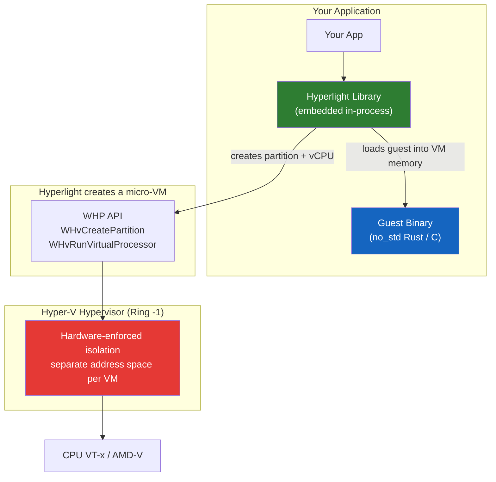
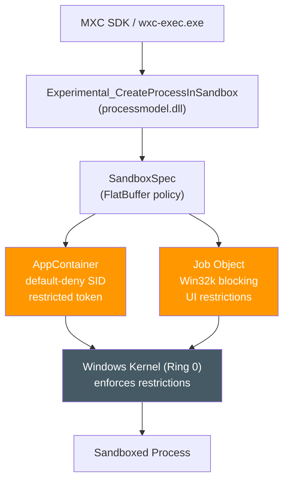

# Hyperlight & MXC — 在 Windows 上构建可信赖的 Agent

[](https://github.com/hyperlight-dev/hyperlight)
[](https://github.com/microsoft/mxc)
[](https://learn.microsoft.com/windows/)
[](https://opensource.org/licenses/MIT)

基于 Build 2026 [BRK262](https://build.microsoft.com/en-US/sessions/BRK262) session，梳理 Windows Agent 信任平台的四大支柱，附带 Hyperlight 和 MXC 的真机冒烟测试。

> **Author**: 魏新宇 (Xinyu Wei) — Microsoft AI GBB

English | [中文版](README-CN.md)

录播: [BRK262 — Building Agents You Can Trust on Windows](https://build.microsoft.com/en-US/sessions/BRK262)

| BRK262 讲了什么 | 本 Repo 验证了什么 |
|----------------|------------------|
| Identity、Containment、Supervision、Manageability 四大支柱 | processcontainer 沙箱（29 ms）、MXC hyperlight backend 通过 Unikraft 在 Hyperlight micro-VM 上跑 CPython/numpy（221 ms），均无 WSL/Docker |
| MXC 策略驱动的多 backend 执行层 | Windows 11 24H2 上的 MXC SDK 冒烟测试，43 份原始日志 |

---

## 目录

- [为什么重要](#为什么重要)
- [Agent 威胁模型](#agent-威胁模型)
- [Windows Agent 安全三支柱](#windows-agent-安全三支柱)
- [支柱一：Identity](#支柱一identity)
- [支柱二：Containment](#支柱二containment)
- [支柱三：Supervision 与 Manageability](#支柱三supervision-与-manageability)
- [Demo 与生态](#demo-与生态)
- [我们的验证：真机冒烟测试](#我们的验证真机冒烟测试)
- [跨平台支持矩阵](#跨平台支持矩阵)
- [Getting Started](#getting-started)
- [Key Resources](#key-resources)
- [Running on Azure](#running-on-azure)
- [Related Repos](#related-repos)

---

## 为什么重要

当 Agent 从回答问题转向执行真实操作，最大挑战是信任。BRK262 展示了 Windows 的方案：Identity、Containment、Supervision、Manageability 四层信任架构内建到 OS。

> "Windows gives you the foundation to handle that shift." — BRK262, Build 2026

| 问题 | Windows 的回答 |
|------|-------------|
| Agent 如何以自己的身份认证？ | **Agent Identity** — Entra 一等公民身份 |
| 如何限制 Agent 能访问什么？ | **Containment** — MXC 策略驱动沙箱 |
| 如何保持人类在环？ | **Supervision** — OS 级 guardrails、HITL 审批 |
| IT 如何大规模治理 Agent？ | **Manageability** — Defender、Entra、Intune、Purview |

---

## Agent 威胁模型

用户、Agent、工具、外部服务之间的每个交互点都有风险。传统应用安全模型无法匹配 Agent 模式 — 一个 Agent 可能调用多个工具、触发子 Agent、执行真实操作，且有自己独立的执行上下文。

<div align="center"></div>

> *来源：BRK262 Slide 11 — Agent 安全威胁模型。*

| 风险面 | 攻击向量 | 举例 |
|--------|---------|------|
| **H2A**（Human → Agent） | Prompt injection | 恶意 prompt 诱骗 Agent 执行破坏性命令 |
| **A2LLM**（Agent → Model） | 数据泄露 | Agent 将敏感上下文发送到模型 |
| **A2A**（Agent → Agent） | Confused deputy | 被攻陷的子 Agent 继承父 Agent 权限 |
| **A2App**（Agent → Tools） | 过度授权 | Agent 通过 SQL tool 删除生产数据库 |
| **External** | 不可信 MCP/API | Agent 调用恶意外部服务 |

---

## Windows Agent 安全三支柱

<div align="center"></div>

> *来源：BRK262 Slide 20 — Identity、Containment、Manageability。*

---

## 支柱一：Identity

<div align="center"></div>

> *来源：BRK262 Slide 26 — Agent 是与 User、Device、App 并列的新型身份。*

Agent 不能用用户的身份跑。它得有自己的权限、策略和审计日志 — 不然你没法控制它能干什么、不能干什么，出了事也查不到是哪个 Agent 干的。

---

## 支柱二：Containment

<div align="center"></div>

> *来源：BRK262 Slide 30 — 不同操作需要不同隔离级别。*

**Policy Gate** 拿到 App Manifest、IT Policy 和用户偏好后，决定这个请求该用哪种隔离：轻量工具用 processcontainer，重活或高风险的用 Hyperlight micro-VM。

### MXC 架构

<div align="center"></div>

> *来源：BRK262 Slide 31 — MXC 架构：Agent → SDK → SandboxPolicy → mxc-exec → Backends → OS Primitives。*

**官方定义**（BRK262 Slide 31）："Microsoft Execution Containers (MXC) is a **policy-driven execution layer** that lets developers declare security requirements, match them to IT and system policies, and translate into native OS primitives at runtime."

### 动态可组合

<div align="center"></div>

> *来源：BRK262 Slide 32 — MXC 运行时从 App Manifest + Agent Request + IT Policy 动态组合沙箱。*

### 执行模型演进

<div align="center"></div>

> *来源：BRK262 Slide 47 — 无沙箱（昨天）→ 沙箱化工具（今天）→ 完全隔离（明天）。*

### Windows 三层隔离

#### Hyperlight: micro-VM（硬件隔离）



**不是容器。** 隔离边界是 Hypervisor（Ring -1）。直接用 Hyperlight core：没有内核、没有 OS、1-2 ms 就能起来。MXC 跑 Python 时要加载 Unikraft snapshot（带一个最小内核），所以启动变慢到 ~221 ms。

### Hyperlight 家族关系图

Hyperlight core 是 micro-VM 引擎。在它上面搭了几个项目，让不同语言的代码都能跑在 micro-VM 里：

| 项目 | 在 Hyperlight core 之上加了什么 | Guest 类型 |
|------|------------------------------|------------|
| [hyperlight](https://github.com/hyperlight-dev/hyperlight) | 引擎本身 | `no_std` Rust / C ELF 二进制 |
| [hyperlight-wasm](https://github.com/hyperlight-dev/hyperlight-wasm) | micro-VM 内的 Wasm 运行时 | Wasm modules/components |
| [hyperlight-js](https://github.com/hyperlight-dev/hyperlight-js) | micro-VM 内的 JS 运行时 | JavaScript |
| [hyperlight-unikraft](https://github.com/hyperlight-dev/hyperlight-unikraft) | micro-VM 内的 Unikraft guest kernel | Linux 应用（Python, Node, Go, Rust, C） |
| [hyperlight-sandbox](https://github.com/hyperlight-dev/hyperlight-sandbox) | 多后端沙箱框架（用 hyperlight-wasm + hyperlight-js） | Python/JS via Wasm |
| [MXC](https://github.com/microsoft/mxc) hyperlight backend | 策略驱动的 harness（用 hyperlight-unikraft） | CPython via Unikraft snapshot |

本 Repo 的冒烟测试走的是 **MXC → hyperlight-unikraft** 路径（表格最后一行）。

#### processcontainer: OS 进程沙箱



进程级隔离，共享 Windows 内核（Ring 0），内核执行 AppContainer + Job Object 限制。

#### 对比

| | MXC processcontainer | MXC hyperlight | Hyperlight（直接） |
|---|---|---|---|
| **隔离** | AppContainer (Ring 0) | Micro-VM (Ring -1) | Micro-VM (Ring -1) |
| **启动** | 29 ms 实测 | 221 ms 实测 | 1-2 ms 上游报告 |
| **Guest** | Host 命令（Python/Node 文档声明） | Unikraft CPython + numpy | no_std Rust / C |
| **Hyper-V？** | 不需要 | 需要 | 需要 |
| **SDK** | TypeScript | TypeScript | Rust |
| **状态** | Early preview | Experimental | Pre-1.0 |

---

## 支柱三：Supervision 与 Manageability

<div align="center"></div>

> *来源：BRK262 Slide 44 — "Earn autonomy with evidence。" Start supervised → build evidence → earn autonomy。*

Windows 在 OS 层面提供了：Agent 活动面板（看它在干什么）、行为护栏、可信通知通道（Agent 请求人类批准的安全路径）、以及完整的操作溯源和审计日志。企业治理整合 Defender（威胁检测）、Entra（身份/Conditional Access）、Intune（设备策略）、Purview（数据治理/审计）。

---

## Demo 与生态

BRK262 演示了：GitHub Copilot CLI sandbox（文件系统 + 网络限制）、Copilot Desktop SDK（Windows 桌面视觉）、OpenClaw with Entra Agent ID。

<div align="center"></div>

> *来源：BRK262 Slide 48 — Copilot CLI 使用 MXC 沙箱化文件系统访问。Public Preview。*

生态伙伴：OpenAI、OpenClaw、Manus、NVIDIA、Hermes Agent 共同验证隔离和身份原语（BRK262 Slide 51）。

---

## 我们的验证：真机冒烟测试

> 以上来自 BRK262 session。以下是我们在真实 Windows 机器上的验证。

### 结果

| 问题 | 答案 | 证据 |
|------|------|------|
| **processcontainer 无 WSL/Docker？** | ✅ 29 ms | [log](mxc-windows-smoke/retest-02-processcontainer-echo.log) |
| **hyperlight 无 WSL/Docker？** | ✅ 221 ms | [log](mxc-windows-smoke/retest-04-hyperlight.log) |
| **hyperlight 跑 Python + numpy/pandas？** | ✅ 可以 | [log](mxc-windows-smoke/retest-05-comprehensive.log) |
| **processcontainer 跑 Python/Node.js？** | ⚠️ 文档声明，此 build 未通过 | [log](mxc-windows-smoke/retest-official-mxc-python-sample.log) |
| **Android 支持？** | ❌ 目前无 host 路径 | [Issue #677](https://github.com/hyperlight-dev/hyperlight/issues/677) |
| **生产就绪？** | ⚠️ Early preview / pre-1.0 | [MXC](https://github.com/microsoft/mxc) |

测试条件：Windows 11 build 26200, Hyper-V/WHP, 2026-06-08。N=1 冒烟测试，全部日志入库。

### 测试 1: processcontainer

```
AppContainerSID: S-1-15-2-765016552-...
MXC_PROCESSCONTAINER_ECHO_ONLY_OK
Runner completed in 29ms    Exit code: 0
```

### 测试 2: hyperlight Python in micro-VM

```
MXC_HYPERLIGHT_OK
hyperlight: run ok (restore=0.0ms call=105.9ms)
Runner completed in 221ms    Exit code: 0
```

numpy + pandas: `{'x': 10, 'y': 30}` ✅

### 测试 3: Hyperlight Sandbox Python SDK

Import 成功（63.6 ms），但 `sandbox.run()` 在 nested virtualization 下失败。需物理机验证。

注意：Sandbox 和 MXC 是两条独立的路 — Sandbox 把 Python 编译成 Wasm 跑在 micro-VM 里，MXC 直接把原生 CPython 塞进 Unikraft 跑。两者互不依赖。

```
✅ WORKS:  processcontainer echo (29ms) · hyperlight Python (221ms) · numpy+pandas
❌ BLOCKED: processcontainer Python/Node.js · Hyperlight SDK (nested virt) · Android
```

### 选型指南

| 场景 | 推荐 | 原因 |
|------|------|------|
| **Windows TypeScript harness** | MXC processcontainer + hyperlight | 一套 SDK，按工作负载切换 backend |
| **AIPC Rust Agent** | Hyperlight core | no_std guest, 1-2 ms, 零中间层 |
| **Python 沙箱（已验证路径）** | MXC hyperlight backend | 硬件隔离 + 原生 CPython via Unikraft |
| **Windows + Android** | 分开评估 | Win: Hyperlight/MXC; Android: AVF/pKVM |

---

## 跨平台支持矩阵

| 平台 | Hyperlight | MXC processcontainer | MXC hyperlight | Android |
|------|:---:|:---:|:---:|:---:|
| **Windows 11 x64** | ✅ WHP | ✅ | ✅ experimental | — |
| **Linux x64** | ✅ KVM | — | ✅ experimental | — |
| **Linux ARM64** | 🔄 PR #1474 | — | ❌ x86_64-only | — |
| **macOS** | ❌ | — | ❌ | — |
| **Android** | ❌ | ❌ | ❌ | ❌ |

---

## Getting Started

<div align="center"></div>

> *来源：BRK262 Slide 60 — Next Steps。*

```bash
# 1. 安装 MXC SDK
mkdir mxc-test && cd mxc-test
npm init -y && npm install @microsoft/mxc-sdk

# 2. processcontainer（无 WSL/Docker）
.\node_modules\@microsoft\mxc-sdk\bin\x64\wxc-exec.exe processcontainer_hello_0_4_echo_only.json

# 3. hyperlight（需要 Hyper-V/WHP）
.\node_modules\@microsoft\mxc-sdk\bin\x64\wxc-exec.exe --setup-hyperlight
.\node_modules\@microsoft\mxc-sdk\bin\x64\wxc-exec.exe --experimental hyperlight_hello.json
```

前提：Windows 11 24H2+, Node.js >= 18, hyperlight 需要 Hyper-V/WHP。

### 测试制品

43 份日志、6 个脚本、7 个配置/package 文件，全部在 `mxc-windows-smoke/` 目录。

### 注意事项

1. MXC = early preview，不是安全边界
2. CreateProcessInSandbox = experimental
3. Hyperlight = pre-1.0
4. 仅 x86_64 — AArch64 开发中
5. hyperlight backend = experimental — 无 guest 网络

---

## Key Resources

| 资源 | URL |
|------|-----|
| **BRK262 Session** | [Building Agents You Can Trust on Windows](https://build.microsoft.com/en-US/sessions/BRK262) |
| MXC | [github.com/microsoft/mxc](https://github.com/microsoft/mxc) |
| Hyperlight | [github.com/hyperlight-dev/hyperlight](https://github.com/hyperlight-dev/hyperlight) |
| Hyperlight Sandbox | [github.com/hyperlight-dev/hyperlight-sandbox](https://github.com/hyperlight-dev/hyperlight-sandbox) |
| CreateProcessInSandbox | [learn.microsoft.com](https://learn.microsoft.com/en-us/windows/win32/secauthz/createprocessinsandbox) |
| Taskbar Tasks API | [aka.ms/agent-taskbar](https://aka.ms/agent-taskbar) |
| CNCF Hyperlight | [cncf.io/projects/hyperlight](https://www.cncf.io/projects/hyperlight/) |
| **BRK243** | [Claw and Agent Harness on Foundry](https://build.microsoft.com/en-US/sessions/BRK243) |

## Running on Azure

| 资源 | 规格 | 用途 |
|------|------|------|
| Azure VM | Standard_D8s_v5 (8 vCPU / 32 GB) | Windows 11 24H2 + Hyper-V/WHP |
| OS | Windows 11 build 26200 | Nested virtualization |
| Hyperlight | Unikraft snapshot ~656 MiB | CPython + numpy/pandas in micro-VM |
| processcontainer | MXC 0.4 AppContainer | Windows-native sandbox |

## Related Repos

| Repo | 关系 |
|------|------|
| [AIPC-Hybrid-Agent-Framework-Evaluation](https://github.com/david-xinyuwei/david-share/tree/master/Agents/AIPC-Hybrid-Agent-Framework-Evaluation) | 上层框架对比 — Sandbox tab 调用本 Repo 的 Hyperlight |
| [Foundry-Agent-Lifecycle-Build-Deploy-Operate](https://github.com/david-xinyuwei/david-share/tree/master/Agents/Foundry-Agent-Lifecycle-Build-Deploy-Operate) | Build 2026 BRK241 — Foundry Agent lifecycle |
| [Foundry-Agent-Post-Training-Deep-Dive](https://github.com/david-xinyuwei/david-share/tree/master/Deep-Learning/Foundry-Agent-Post-Training-Deep-Dive) | Build 2026 BRK232 — Foundry post-training |
