# Hyperlight & MXC — Building Agents You Can Trust on Windows

[](https://github.com/hyperlight-dev/hyperlight)
[](https://github.com/microsoft/mxc)
[](https://learn.microsoft.com/windows/)
[](https://opensource.org/licenses/MIT)

A walkthrough of Microsoft's Windows agent trust platform announced at Build 2026 [BRK262](https://build.microsoft.com/en-US/sessions/BRK262), with real Windows smoke-test results for Hyperlight and MXC.

> **Author**: Xinyu Wei (魏新宇) — Microsoft AI GBB

[中文版](README-CN.md) | English

Recorded walkthrough: [BRK262 — Building Agents You Can Trust on Windows](https://build.microsoft.com/en-US/sessions/BRK262)

| BRK262 presents | This repo verifies |
|-----------------|-------------------|
| Identity, Containment, Supervision, Manageability — four pillars of Windows agent trust | processcontainer sandbox (29 ms), MXC hyperlight backend running CPython/numpy via Unikraft on Hyperlight micro-VMs (221 ms) — both without WSL or Docker |
| MXC as policy-driven execution layer with multiple backends | MXC SDK smoke tests on Windows 11 24H2 with 43 raw logs |

---

## Table of Contents

- [Why This Matters](#why-this-matters)
- [Agent Threat Model](#agent-threat-model)
- [Three Pillars of Windows Agent Security](#three-pillars-of-windows-agent-security)
- [Pillar 1: Identity](#pillar-1-identity)
- [Pillar 2: Containment](#pillar-2-containment)
- [Pillar 3: Supervision and Manageability](#pillar-3-supervision-and-manageability)
- [Demos and Ecosystem](#demos-and-ecosystem)
- [Our Verification: Hands-On Smoke Tests](#our-verification-hands-on-smoke-tests)
- [Platform Matrix](#platform-matrix)
- [Getting Started](#getting-started)
- [Key Resources](#key-resources)
- [Running on Azure](#running-on-azure)
- [Related Repos](#related-repos)

---

## Why This Matters

As agents move from answering questions to taking real actions, the biggest challenge is trust. BRK262 presents Windows' answer: identity, containment, supervision, and manageability built into the OS.

> "Windows gives you the foundation to handle that shift." — BRK262, Build 2026

| Question | Windows answer |
|----------|---------------|
| How do agents authenticate as themselves? | **Agent Identity** — Entra first-class identity |
| How do we limit what an agent can access? | **Containment** — MXC policy-driven sandboxes |
| How do we keep humans in the loop? | **Supervision** — OS-level guardrails, HITL gates |
| How do IT teams govern agents at scale? | **Manageability** — Defender, Entra, Intune, Purview |

---

## Agent Threat Model

Every interaction between a user, an agent, its tools, and external services creates risk. Traditional app security does not match the agent pattern where one agent may call tools, invoke sub-agents, and take real-world actions with its own execution context.

<div align="center">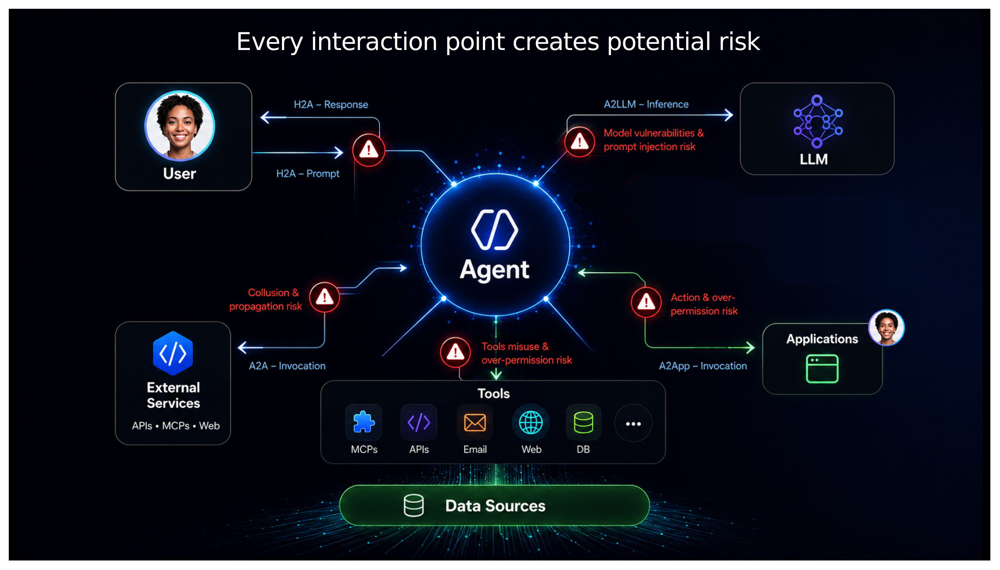</div>

> *Source: BRK262 Slide 11 — Agent security threat model.*

| Risk surface | Attack vector | Example |
|-------------|--------------|---------|
| **H2A** (Human → Agent) | Prompt injection | Malicious prompt tricks agent into destructive commands |
| **A2LLM** (Agent → Model) | Data exfiltration | Agent sends sensitive context to model that leaks it |
| **A2A** (Agent → Agent) | Confused deputy | Compromised sub-agent inherits parent's permissions |
| **A2App** (Agent → Tools) | Over-permission | Agent deletes production database via SQL tool |
| **External** | Untrusted MCP/APIs | Agent calls malicious external service |

---

## Three Pillars of Windows Agent Security

<div align="center">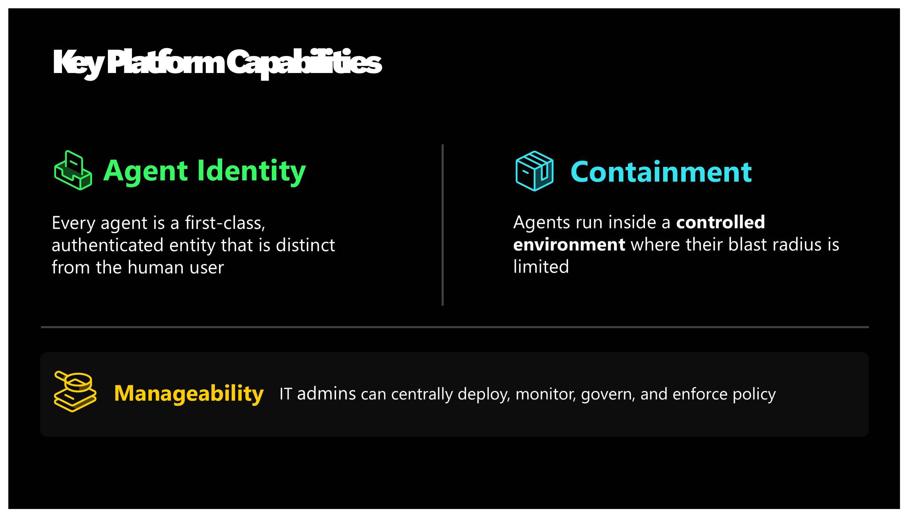</div>

> *Source: BRK262 Slide 20 — Identity, Containment, Manageability.*

---

## Pillar 1: Identity

<div align="center">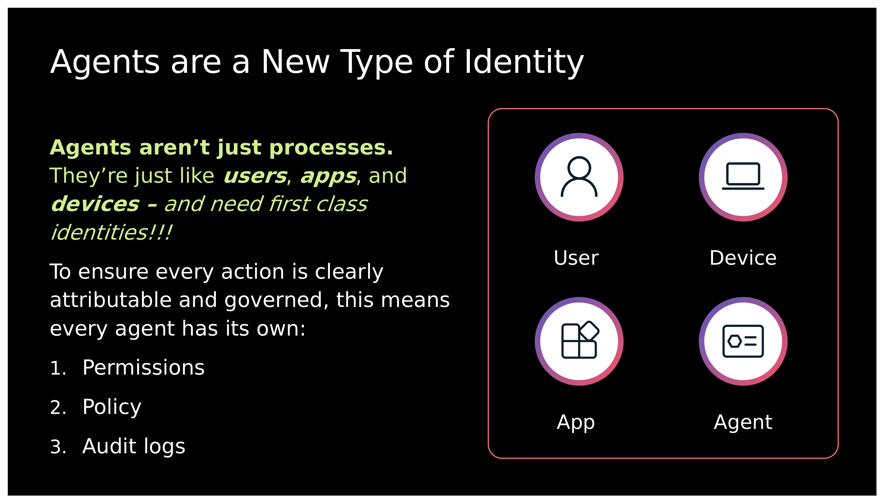</div>

> *Source: BRK262 Slide 26 — Agents are a new type of identity alongside users, devices, and apps.*

Agents should NOT run under the user's identity. They need their own permissions, policy, and audit logs — otherwise you cannot scope access, enforce per-agent policy, or trace which agent did what.

---

## Pillar 2: Containment

<div align="center">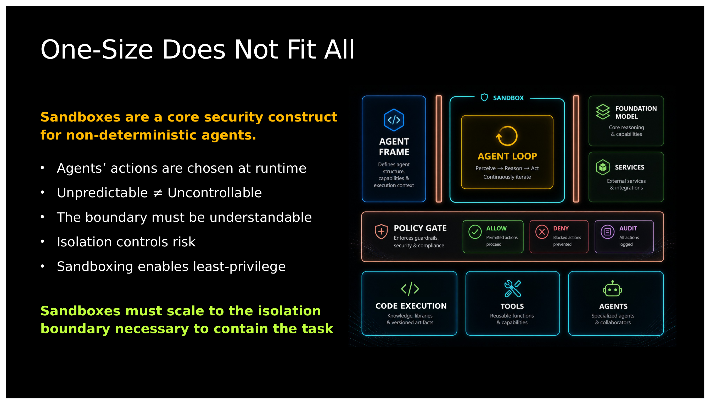</div>

> *Source: BRK262 Slide 30 — Different actions need different isolation levels.*

A **Policy Gate** evaluates each request against the app manifest, IT policy, and user preferences, then selects the right containment: process sandbox for lightweight tools, micro-VM for heavy/risky workloads.

### MXC Architecture

<div align="center">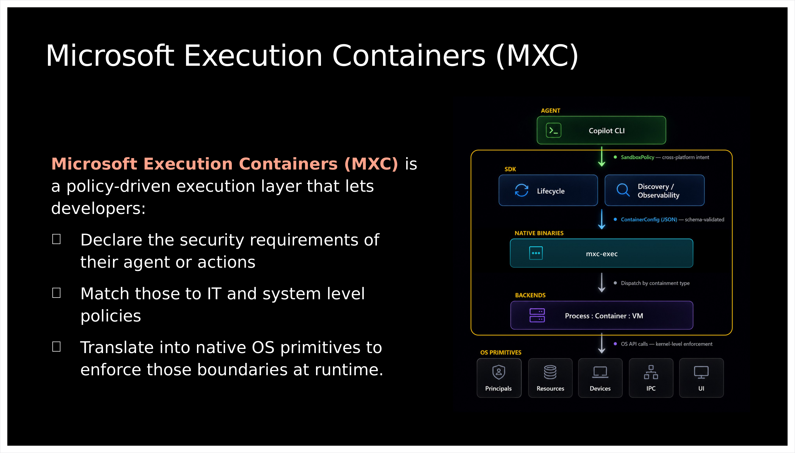</div>

> *Source: BRK262 Slide 31 — MXC architecture: Agent → SDK → SandboxPolicy → mxc-exec → Backends (Process / Container / VM) → OS Primitives.*

**Official definition** (BRK262 Slide 31): "Microsoft Execution Containers (MXC) is a **policy-driven execution layer** that lets developers declare security requirements, match them to IT and system policies, and translate into native OS primitives at runtime."

### Dynamically Composable

<div align="center">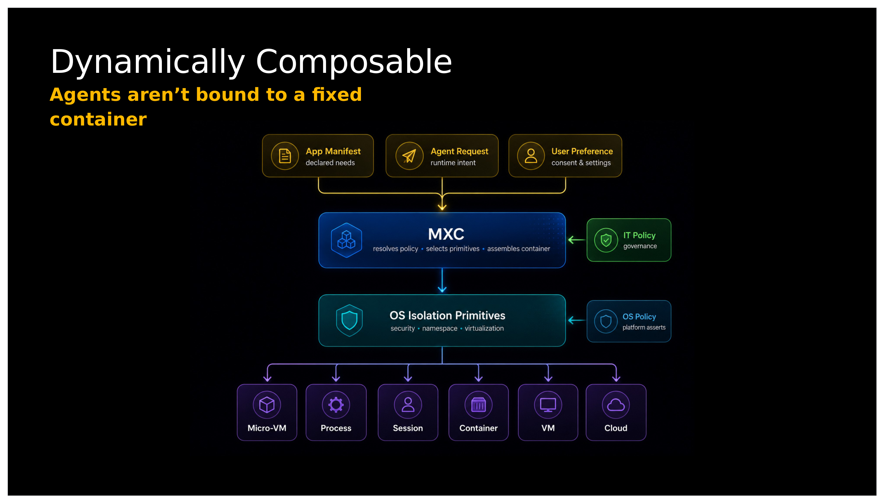</div>

> *Source: BRK262 Slide 32 — MXC composes sandboxes at runtime from App Manifest + Agent Request + IT Policy.*

### Execution Model Evolution

<div align="center">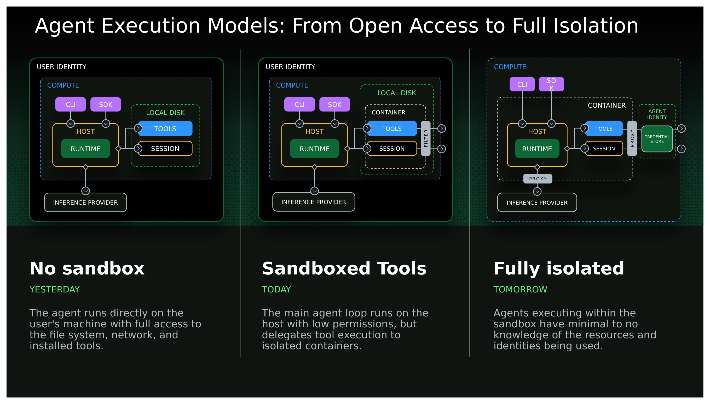</div>

> *Source: BRK262 Slide 47 — Yesterday (no sandbox) → Today (sandboxed tools) → Tomorrow (fully isolated agents).*

### Windows Isolation — Three Levels

#### Hyperlight: micro-VM (hardware isolation)

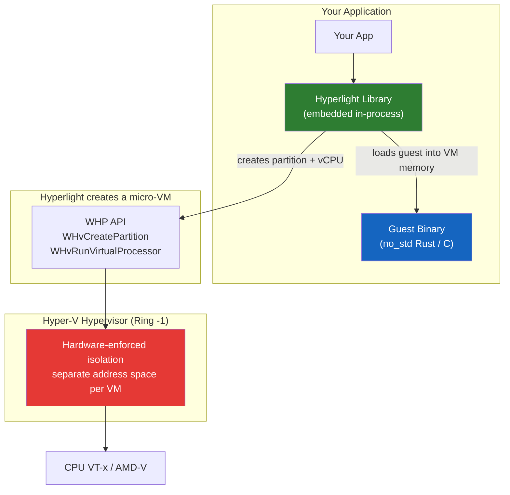

**Not a container.** Isolation boundary is the hypervisor (Ring -1). For direct Hyperlight guests: no guest kernel, no OS, 1-2 ms cold start. When MXC loads a Unikraft snapshot (e.g. for Python), a minimal guest kernel is included and startup rises to ~221 ms.

### The Hyperlight Family

Hyperlight core is the micro-VM engine. Several projects build on top of it for different guest types:

| Project | What it adds on top of Hyperlight core | Guest type |
|---------|---------------------------------------|------------|
| [hyperlight](https://github.com/hyperlight-dev/hyperlight) | Nothing — this IS the engine | `no_std` Rust / C ELF binary |
| [hyperlight-wasm](https://github.com/hyperlight-dev/hyperlight-wasm) | Wasm runtime inside micro-VM | Wasm modules/components |
| [hyperlight-js](https://github.com/hyperlight-dev/hyperlight-js) | JS runtime inside micro-VM | JavaScript |
| [hyperlight-unikraft](https://github.com/hyperlight-dev/hyperlight-unikraft) | Unikraft guest kernel inside micro-VM | Linux apps (Python, Node, Go, Rust, C) |
| [hyperlight-sandbox](https://github.com/hyperlight-dev/hyperlight-sandbox) | Multi-backend sandbox framework (uses hyperlight-wasm + hyperlight-js) | Python/JS via Wasm, JS via HyperlightJS |
| [MXC](https://github.com/microsoft/mxc) hyperlight backend | Policy-driven harness (uses hyperlight-unikraft) | CPython via Unikraft snapshot |

This repo's smoke tests use the **MXC → hyperlight-unikraft** path (bottom row).

#### processcontainer: OS process sandbox

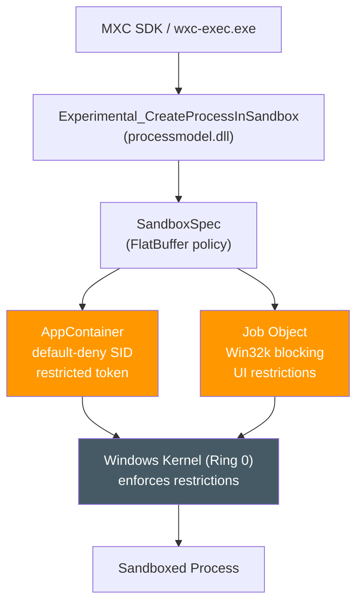

Process-level isolation. Shares the Windows kernel (Ring 0); kernel enforces AppContainer + Job Object restrictions.

#### Comparison

| | MXC processcontainer | MXC hyperlight | Hyperlight (direct) |
|---|---|---|---|
| **Isolation** | AppContainer (Ring 0) | Micro-VM (Ring -1) | Micro-VM (Ring -1) |
| **Startup** | 29 ms observed | 221 ms observed | 1-2 ms upstream |
| **Guest** | Host commands (Python/Node intended) | Unikraft CPython + numpy | no_std Rust / C |
| **Hyper-V needed?** | No | Yes | Yes |
| **SDK** | TypeScript | TypeScript | Rust |
| **Status** | Early preview | Experimental | Pre-1.0 |

> Source: [CreateProcessInSandbox](https://learn.microsoft.com/en-us/windows/win32/secauthz/createprocessinsandbox), [MXC Hyperlight Integration](https://github.com/microsoft/mxc/blob/main/docs/hyperlight-integration-plan.md)

---

## Pillar 3: Supervision and Manageability

<div align="center">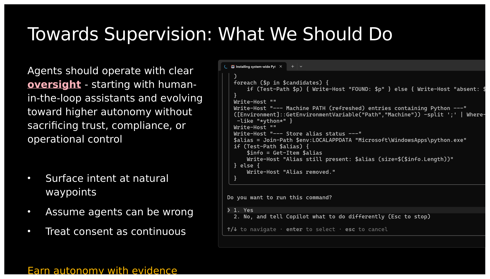</div>

> *Source: BRK262 Slide 44 — "Earn autonomy with evidence." Start supervised → build evidence → earn autonomy.*

Windows provides OS-level agent activity surfaces, guardrails, trusted notification channels, and provenance/audit trails. Enterprise governance integrates with Defender (threat detection), Entra (identity/conditional access), Intune (device policy), and Purview (data governance/audit).

---

## Demos and Ecosystem

BRK262 demonstrates: GitHub Copilot CLI sandbox (filesystem + network restriction via MXC), Copilot Desktop SDK (vision on Windows), and OpenClaw with Entra Agent ID.

<div align="center">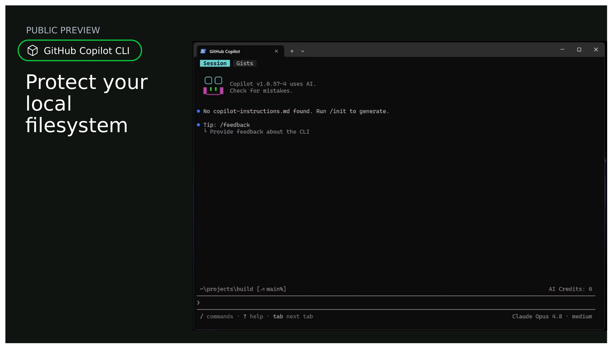</div>

> *Source: BRK262 Slide 48 — Copilot CLI using MXC to sandbox filesystem access. Public Preview.*

Microsoft validated the trust primitives with ecosystem partners including OpenAI, OpenClaw, Manus, NVIDIA, and Hermes Agent (BRK262 Slide 51).

---

## Our Verification: Hands-On Smoke Tests

> Everything above is from BRK262. Below is our verification on a real Windows machine.

### Results

| Question | Answer | Evidence |
|----------|--------|----------|
| **processcontainer without WSL/Docker?** | ✅ 29 ms | [log](mxc-windows-smoke/retest-02-processcontainer-echo.log) |
| **hyperlight without WSL/Docker?** | ✅ 221 ms | [log](mxc-windows-smoke/retest-04-hyperlight.log) |
| **hyperlight runs Python + numpy/pandas?** | ✅ Yes | [log](mxc-windows-smoke/retest-05-comprehensive.log) |
| **processcontainer runs Python/Node.js?** | ⚠️ Intended by docs, blocked on this build | [log](mxc-windows-smoke/retest-official-mxc-python-sample.log) |
| **Android support?** | ❌ No host path today | [Issue #677](https://github.com/hyperlight-dev/hyperlight/issues/677) |
| **Production-ready?** | ⚠️ Early preview / pre-1.0 | [MXC](https://github.com/microsoft/mxc) |

Test conditions: Windows 11 build 26200, Hyper-V/WHP, 2026-06-08. N=1 smoke test. All raw logs included.

### Test 1: processcontainer

```
AppContainerSID: S-1-15-2-765016552-...
MXC_PROCESSCONTAINER_ECHO_ONLY_OK
Runner completed in 29ms    Exit code: 0
```

### Test 2: hyperlight Python in micro-VM

```
MXC_HYPERLIGHT_OK
hyperlight: run ok (restore=0.0ms call=105.9ms)
Runner completed in 221ms    Exit code: 0
```

numpy + pandas: `{'x': 10, 'y': 30}` ✅

### Test 3: Hyperlight Sandbox Python SDK

Import succeeds (63.6 ms), but `sandbox.run()` fails in nested virtualization. Needs physical Windows validation.

Note: Hyperlight Sandbox takes a different path than MXC — it uses `hyperlight-wasm` (Python compiled to Wasm guest running in micro-VM), while MXC uses `hyperlight-unikraft` (native CPython in Unikraft guest kernel). The two paths are independent.

```
✅ WORKS:  processcontainer echo (29ms) · hyperlight Python (221ms) · numpy+pandas
❌ BLOCKED: processcontainer Python/Node.js · Hyperlight SDK (nested virt) · Android
```

### Decision Guide

| Scenario | Recommended | Why |
|----------|------------|-----|
| **Windows TypeScript harness** | MXC processcontainer + hyperlight | One SDK, swap backend per workload |
| **Rust agent on AIPC** | Hyperlight core directly | no_std guest, 1-2 ms, zero layers |
| **Python sandbox (verified path)** | MXC hyperlight backend | Hardware isolation + native CPython via Unikraft |
| **Windows + Android** | Split | Hyperlight/MXC for Win; AVF/pKVM for Android |

---

## Platform Matrix

| Platform | Hyperlight | MXC processcontainer | MXC hyperlight | Android |
|----------|:---:|:---:|:---:|:---:|
| **Windows 11 x64** | ✅ WHP | ✅ | ✅ experimental | — |
| **Linux x64** | ✅ KVM | — | ✅ experimental | — |
| **Linux ARM64** | 🔄 PR #1474 | — | ❌ x86_64-only | — |
| **macOS** | ❌ | — | ❌ | — |
| **Android** | ❌ | ❌ | ❌ | ❌ |

---

## Getting Started

<div align="center">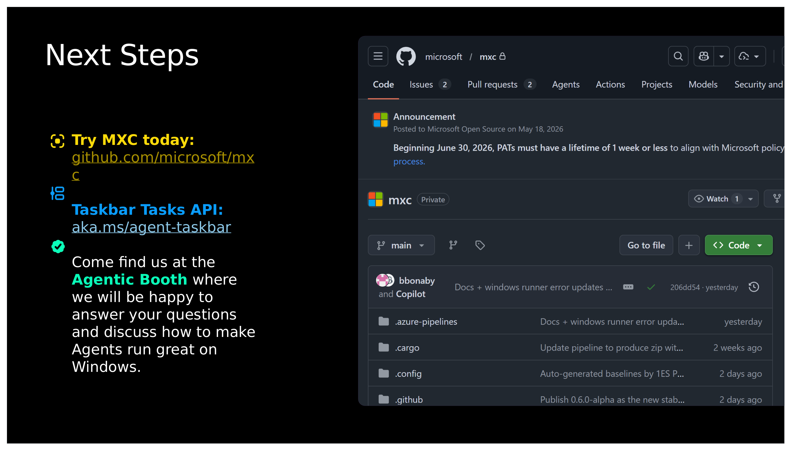</div>

> *Source: BRK262 Slide 60 — Next Steps.*

```bash
# 1. Install MXC SDK
mkdir mxc-test && cd mxc-test
npm init -y && npm install @microsoft/mxc-sdk

# 2. processcontainer (no WSL/Docker)
.\node_modules\@microsoft\mxc-sdk\bin\x64\wxc-exec.exe processcontainer_hello_0_4_echo_only.json

# 3. hyperlight (requires Hyper-V/WHP)
.\node_modules\@microsoft\mxc-sdk\bin\x64\wxc-exec.exe --setup-hyperlight
.\node_modules\@microsoft\mxc-sdk\bin\x64\wxc-exec.exe --experimental hyperlight_hello.json
```

Prerequisites: Windows 11 24H2+, Node.js >= 18, Hyper-V/WHP for hyperlight.

### Test Artifacts

43 logs, 6 scripts, and 7 config/package files in `mxc-windows-smoke/`.

### Caveats

1. MXC = early preview, not a security boundary
2. CreateProcessInSandbox = experimental
3. Hyperlight = pre-1.0
4. x86_64 only — AArch64 in progress
5. hyperlight backend = experimental — no guest network

---

## Key Resources

| Resource | URL |
|----------|-----|
| **BRK262 Session** | [Building Agents You Can Trust on Windows](https://build.microsoft.com/en-US/sessions/BRK262) |
| MXC | [github.com/microsoft/mxc](https://github.com/microsoft/mxc) |
| Hyperlight | [github.com/hyperlight-dev/hyperlight](https://github.com/hyperlight-dev/hyperlight) |
| Hyperlight Sandbox | [github.com/hyperlight-dev/hyperlight-sandbox](https://github.com/hyperlight-dev/hyperlight-sandbox) |
| CreateProcessInSandbox | [learn.microsoft.com](https://learn.microsoft.com/en-us/windows/win32/secauthz/createprocessinsandbox) |
| Taskbar Tasks API | [aka.ms/agent-taskbar](https://aka.ms/agent-taskbar) |
| CNCF Hyperlight | [cncf.io/projects/hyperlight](https://www.cncf.io/projects/hyperlight/) |
| **BRK243** | [Claw and Agent Harness on Foundry](https://build.microsoft.com/en-US/sessions/BRK243) |

## Running on Azure

| Resource | Spec | Purpose |
|----------|------|---------|
| Azure VM | Standard_D8s_v5 (8 vCPU / 32 GB) | Windows 11 24H2 + Hyper-V/WHP |
| OS | Windows 11 build 26200 | Nested virtualization |
| Hyperlight | Unikraft snapshot ~656 MiB | CPython + numpy/pandas in micro-VM |
| processcontainer | MXC 0.4 AppContainer | Windows-native sandbox |

## Related Repos

| Repo | Relationship |
|------|------|
| [AIPC-Hybrid-Agent-Framework-Evaluation](https://github.com/david-xinyuwei/david-share/tree/master/Agents/AIPC-Hybrid-Agent-Framework-Evaluation) | Upper-layer framework comparison — Sandbox tab calls Hyperlight from this repo |
| [Foundry-Agent-Lifecycle-Build-Deploy-Operate](https://github.com/david-xinyuwei/david-share/tree/master/Agents/Foundry-Agent-Lifecycle-Build-Deploy-Operate) | Build 2026 BRK241 — Foundry Agent lifecycle |
| [Foundry-Agent-Post-Training-Deep-Dive](https://github.com/david-xinyuwei/david-share/tree/master/Deep-Learning/Foundry-Agent-Post-Training-Deep-Dive) | Build 2026 BRK232 — Foundry post-training |
