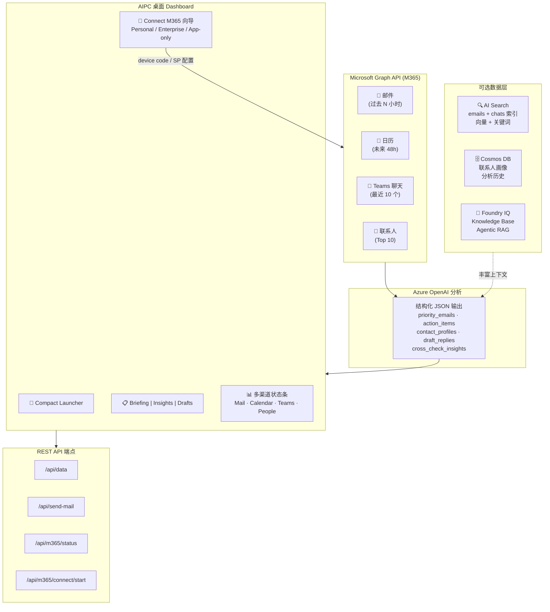
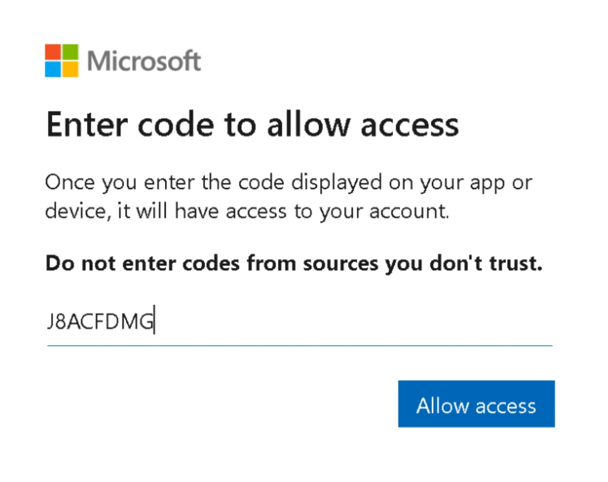
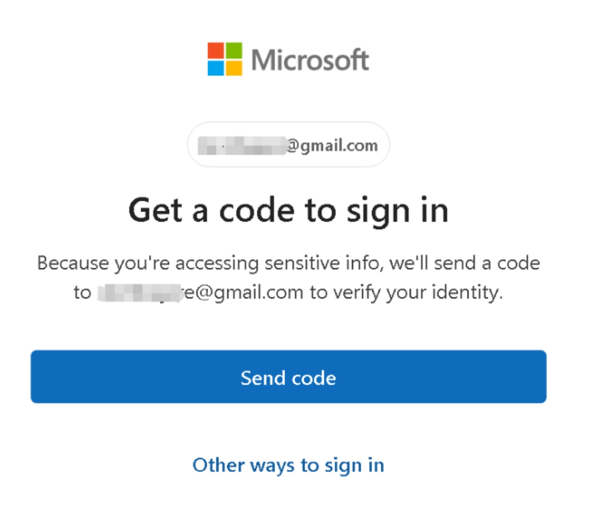
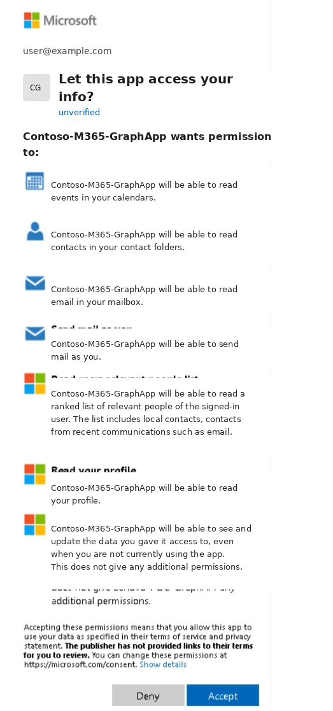
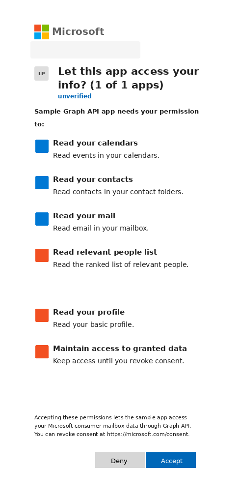
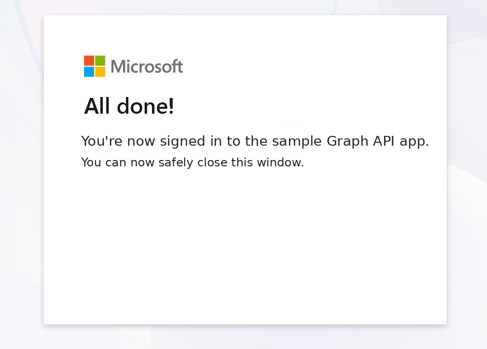

# M365 Morning Sweep Agent

[](https://azure.microsoft.com/products/ai-services/openai-service)
[](https://learn.microsoft.com/graph/overview)
[](https://azure.microsoft.com/products/ai-services/ai-search)
[](https://www.python.org/)
[](https://opensource.org/licenses/MIT)

一个 AI 驱动的 executive assistant——通过 **Microsoft Graph API** 读取 M365 邮件、日历和 Teams 聊天，使用 **Azure OpenAI** 做结构化分析，生成每日简报：邮件优先级排序、带详细上下文的待办事项、联系人画像、关系网络映射、跨数据源智能洞察，以及可直接在 Dashboard 上编辑发送的 AI 草拟回复。

> **Author**: Xinyu Wei (魏新宇) — Microsoft AI GBB Senior System Engineer

English | [中文版](README-CN.md) | [源码仓库](https://github.com/david-xinyuwei/M365-Morning-Sweep)（私有 — [申请访问](https://github.com/david-xinyuwei/david-share/issues)）

---

## Live Demo

**录屏 walkthrough**：compact launcher → Open Briefing → M365 多渠道状态 → tab 切换 → Connect M365 向导 → AI 草拟回复 → Graph `sendMail` 验证。

https://github.com/user-attachments/assets/93510362-c73a-45da-8135-ed6896f02778

---

## 定位

这个 repo **不是为了替代 WorkIQ、Microsoft 365 Copilot 或 Copilot for M365**。它展示的是当这些方案不可用、不适合、或成本不成立时的 fallback / companion pattern：

| 场景 | 推荐路径 | 原因 |
|---|---|---|
| 用户已经有 Copilot for M365，体验可以放在 M365 原生界面里 | 使用 Copilot / WorkIQ | 原生 UX、微软托管 grounding、完整企业治理 |
| 消费者或学生使用个人 Microsoft account | 使用本 repo 的 Graph API 模式，`GRAPH_AUTH_PROFILE=personal` | 无需 Copilot license，无需 tenant admin，无 Teams；邮件/日历/联系人可由用户自助 consent |
| 企业客户需要品牌化 App、自定义 JSON 输出、自定义 Dashboard | 使用本 repo 的 Graph API 模式，`GRAPH_AUTH_PROFILE=enterprise` | 完全控制 prompt、schema、UI、存储和流程 |
| 企业客户需要后台/服务端处理 | 使用 Service Principal 模式 | 需要 admin consent；无交互用户的 app-only access |

一句话：**Copilot/WorkIQ 是 M365 原生 AI 的首选路径；本 repo 是需要自定义 UX、自定义输出，或需要支持个人微软账号低门槛接入时的 Graph API 可编程路径。**

### 个人微软账号说明

Demo 的 "Personal" 模式用的是 `consumers` authority，覆盖所有个人微软账号（MSA）——无论免费还是付费：

| 账号类型 | 费用 | Graph Authority | 邮件/日历/联系人 | Teams | OneDrive |
|---|---|---|---|---|---|
| 免费 Outlook.com / Hotmail / Live | 免费 | `consumers` | ✅ | ❌ | 5 GB |
| M365 Personal | USD 99.99/年 | `consumers` | ✅ | ✅（个人版 Teams） | 1 TB |
| M365 Family | USD 129.99/年 | `consumers` | ✅ | ✅（个人版 Teams） | 1 TB/人 |

三者用的是同一个 MSA 身份、同一条 Graph API 路径——**代码零改动**。关键区别：M365 Personal/Family 用户还能通过 Graph 拿到 Teams 聊天数据，免费 Outlook.com 用户没有 Teams。

> 来源：[Microsoft Graph Auth — tenant 参数](https://learn.microsoft.com/en-us/graph/auth-v2-user) — `consumers` for Microsoft accounts；[M365 Personal 定价](https://www.microsoft.com/en-us/microsoft-365/buy/microsoft-365)（查验日期：2026-06-01）

---

## 在 Azure 上运行

| 组件 | 说明 |
|---|---|
| **Azure OpenAI** | 任意 Chat Completion 部署（GPT-4o、GPT-4.1 等）+ `text-embedding-3-large` 用于向量检索 |
| **Microsoft Graph API** | Mail.Read, Mail.Send, Calendars.Read, Chat.Read, User.Read, People.Read |
| **Azure AI Search** | （可选）邮件/聊天历史的向量+关键词索引 |
| **Azure Cosmos DB** | （可选）联系人画像持久化和分析历史记录 |
| **Foundry IQ** | （可选）Agentic Retrieval——跨邮件和聊天的智能检索 |

---

## 架构



---

## 功能亮点

| 功能 | 说明 |
|---|---|
| **AIPC 桌面 Shell** | Windows 11 / Mica-glass 设计语言，亚克力侧边栏、毛玻璃顶栏、系统原生质感 — 专为 AIPC（AI PC）场景设计 |
| **Compact Launcher** | 迷你应用启动模式，提供 **Open Briefing**、**Connect M365**、**Sync** 三个按钮，展开前即可看到邮件数、待办数等关键指标 |
| **M365 多渠道状态条** | Outlook Mail、Calendar、Microsoft Teams、People Graph 四个实时状态磁贴，各自显示条目数和可用性 |
| **Connect M365 向导** | 内置 M365 对接弹窗，支持三种 auth profile：**Personal**（Outlook.com，device code flow）、**Enterprise**（工作/学校 M365，device code flow）、**App-only**（Service Principal，需 admin consent）。客户无需编辑 `.env` 即可自助完成配置 |
| **Tab 系统** | 三个 Tab：**Briefing**（邮件 + 待办 + 联系人）、**Insights**（跨源智能洞察，含证据/分析/下一步三栏布局）、**Drafts & History**（AI 回复草稿 + CosmosDB 历史时间线） |
| **邮件优先级分拣** | 所有邮件按紧急度（high/medium/low）排序，颜色编码边框，附建议操作和理由 |
| **智能 To-Do 列表** | 提取的待办带 P0/P1/P2 优先级，交互式复选框，可折叠详情（背景、准备项、相关人员） |
| **Teams 聊天摘要** | 按话题分组的近期消息，显示发送者、内容摘要和时间戳 |
| **联系人画像** | 每人的沟通风格（formal/direct/casual）、情感倾向、互动频率、交往建议 |
| **关系网络** | 核心圈（绿色）和需关注（红色）可视化，带角色标签 |
| **跨源洞察** | 同一话题同时出现在邮件和聊天中时自动标记，附来源引用 |
| **Foundry IQ 面板** | Agentic Retrieval 结果——跨源 AI 回答，带引用 |
| **AI 草拟回复** | 为每封邮件生成，匹配联系人沟通风格。可编辑，支持人设优化和一键发送 |
| **拖拽附件** | 文件选择器或拖拽，base64 编码，单文件最大 3MB |
| **历史洞察** | CosmosDB 支撑的时间线，展示分析历史和联系人画像演变 |
| **深色模式** | 跟随系统偏好的深色/浅色切换，平滑 CSS 过渡，偏好持久化到 localStorage |
| **成本监控** | Dashboard 底部 Token 用量追踪 |

---

## 功能详解

### 核心 Agent（`morning_sweep.py`）

**数据采集** — 一次 Sweep 从 4 个 Graph API 端点拉取：
- **邮件**：过去 N 小时（可配置），按主题+发件人去重，带正文摘要
- **日历**：未来 48 小时的事件，含参会人、地点、议程
- **Teams 聊天**：最近 10 个聊天，每个取最新 20 条消息，含群聊
- **联系人**：通过 Microsoft Graph People API 获取最相关的 10 个联系人

**Azure OpenAI 分析** — 将采集到的数据发送给 Chat Completion 模型，以结构化 JSON 输出。System Prompt 要求模型生成：

| 输出字段 | 内容说明 |
|---|---|
| `priority_emails` | **所有**邮件按紧急度（high/medium/low）排序，附建议操作和理由，包含发件人邮箱 |
| `today_schedule` | 日历事件，附准备笔记、关键参会人和上下文 |
| `action_items` | 提取的待办，P0/P1/P2 优先级。每个事项包含 `detail` 对象：background（2-3 句上下文）、prep_needed（具体准备项）、related_people（人名+角色）、related_history、suggested_approach |
| `cross_check_insights` | 跨数据源关联——同一话题同时出现在邮件和聊天中时，标注来源引用 |
| `contact_profiles` | 每人的沟通风格（formal/direct/casual）、关系类型、情感倾向、互动频率、交往建议 |
| `relationship_network` | 核心圈识别 + 需关注的关系预警 |
| `draft_replies` | 为**每封**邮件生成的 AI 回复草稿，根据联系人沟通风格量身定制 |

**认证方式** — 两种模式：
- **委派认证**（交互式）：MSAL Device Code Flow，带持久化 Token 缓存
- **Service Principal**（无人值守）：Client Credentials，适合服务器部署

**跨 Session 记忆** — 基于文件的历史（保留最近 50 次分析的 JSON）。历史分析会回传到 Prompt 中，让模型能说出"这个问题 3 天前就提出了"或"这是一个反复出现的待办"这样的洞察。

### 实时 Dashboard 服务（`live_server.py`）

纯 Python HTTP 服务器（无 Flask/Django 依赖），提供实时 Dashboard：

- **智能轮询**：每 15 秒轮询 Graph API，但只有数据实际变化时才触发 Azure OpenAI 分析（基于邮件主题 + 聊天预览的 MD5 哈希对比），避免不必要的 API 开销
- **SSE 推送**：浏览器每 5-10 秒轮询 `/api/data`，无需刷新页面即可即时更新
- **Basic Auth**：除 `/api/health` 和 `/api/schema` 外，所有端点均需认证
- **线程安全**：分析在后台线程运行，服务器始终保持响应

**REST API 端点**：

| 端点 | 方法 | 认证 | 说明 |
|---|---|---|---|
| `/` | GET | 需要 | Dashboard HTML 页面 |
| `/api/data` | GET | 需要 | 当前分析结果（JSON） |
| `/api/health` | GET | 不需要 | 服务状态、指标、数据时效 |
| `/api/schema` | GET | 不需要 | API 文档，含完整 JSON Schema |
| `/api/send-mail` | POST | 需要 | 通过 Graph API 发送邮件（支持附件） |
| `/api/optimize-draft` | POST | 需要 | 根据特定人设/沟通风格重写草稿 |
| `/api/refresh` | POST | 需要 | 强制重新分析，可自定义时间范围 |
| `/api/insights` | GET | 需要 | CosmosDB 历史趋势 |
| `/api/m365/status` | GET | 需要 | 当前 M365 连接状态：auth profile、channels、缓存账号 |
| `/api/m365/connect/start` | POST | 需要 | 启动 M365 对接流程（personal / enterprise / app-only） |
| `/api/m365/connect/status` | GET | 需要 | 轮询 device-code flow 的登录进度 |
| `/api/m365/disconnect` | POST | 需要 | 从 App 中移除一个缓存的 M365 账号（`{username}` 可选） |

### 富 Dashboard（`dashboard.html`）

单文件 HTML Dashboard，无需构建工具或外部依赖，采用 **Windows 11 / AIPC 桌面应用风格**：

- **AIPC Desktop Shell**：Mica-glass 设计语言，包含亚克力侧边栏、毛玻璃顶栏、系统原生窗口按钮和 `AIPC Ready` 标识。看起来像原生 Windows 桌面应用，而不是普通网页
- **Compact Launcher**：首次打开是迷你应用卡片，展示关键统计，并提供 **Open Briefing**、**Connect**、**Sync** 三个动作，模拟 AIPC widget / launcher 体验
- **M365 多渠道状态条**：Outlook Mail、Calendar、Teams、People 四个状态磁贴，实时显示 `/api/data` 中的条目数；当前 auth profile 不支持的 channel 会显示 `not available`
- **Connect M365 向导**：内置弹窗支持自助对接 M365：
    - **Personal**：不需要 tenant ID。用户只需点击 Personal → Start Device Login → 在 microsoft.com/link 完成登录；系统自动使用 `consumers` authority，Teams 自动关闭
    - **Enterprise**：work/school M365 账号，默认使用 `organizations` authority，可按客户要求改成指定 tenant ID，Teams 可开启
    - **App-only**：展示所需 application permissions 和 server-side env vars，由 IT admin 配置，不在浏览器里输入 secret
    - 连接状态持久化到 `.m365_connection.json`，服务重启后保留
- **Tab 系统**：三个 Tab：**Briefing**（邮件 + 待办 + 联系人）、**Insights**（跨源智能洞察）、**Drafts & History**（AI 回复草稿 + CosmosDB 历史）
- **Nav Rail**：左侧 5 个图标按钮，点击后切换 active 状态并高亮对应卡片
- **Dark Mode**：深色/浅色切换，使用 localStorage 持久化偏好
- **Hero Header**：问候语 + 统计栏（邮件数、待办数、聊天数、画像数）+ 时间范围选择器（24h 到 30 天）+ 手动同步按钮
- **邮件优先级**：按紧急度颜色编码（红/橙/绿边框），可折叠展示建议操作和来源引用
- **To-Do 列表**：交互式复选框（勾选后划线），可折叠详情面板展示背景、准备事项、相关人员和建议方案
- **Teams 聊天**：按聊天主题分组的近期消息，显示发送者、内容摘要和时间戳
- **联系人画像**：头像首字母圆圈、角色/关系标签、沟通风格徽章、情感指示点（绿/橙/红）、交往建议
- **关系网络**：核心圈（绿色标签）和需关注（红色标签）可视化
- **跨源洞察**：渐变卡片展示邮件、聊天、日历之间的关联发现
- **Foundry IQ 面板**：Agentic Retrieval 结果——展示查询、AI 生成的回答、引用数量和来源类型
- **AI 草拟回复**：可折叠的回复卡片，包含：
  - 可编辑的草稿文本（contentEditable）
  - 人设优化按钮——点击联系人名字，根据其沟通风格重写草稿，提供修改前后对比
  - 拖拽或选择文件附件（base64 编码，单文件最大 3MB）
  - 一键发送，带确认弹窗
- **历史洞察**：CosmosDB 支撑的历史面板，展示分析时间线和联系人画像演变
- **Footer**：Token 用量、时间戳、技术栈标签

### 数据层（`data_layer.py`）

可选但推荐在生产环境使用。每个组件独立容错（部分功能失败不影响其他）：

**AI Search 集成**：
- 两个索引：`emails`（含 `body_vector` 用于语义搜索）和 `chats`（含 `content_vector`）
- 数据灌入：Graph API 数据 → `text-embedding-3-large` 向量化 → AI Search 上传
- 检索：关键词搜索、语义/向量搜索、按发件人查询历史
- 用于丰富 GPT 上下文，提供历史模式识别

**Foundry IQ（Agentic Retrieval）**：
- 从 `emails` 和 `chats` AI Search 索引创建 Knowledge Sources
- 创建跨两个来源的 Knowledge Base
- 查询从当前邮件主题和聊天话题自动生成
- 返回带引用的 AI 跨源回答
- 示例："What do I know about: Q2 AI Strategy" → 同时搜索邮件和聊天索引 → 返回综合回答

**CosmosDB 集成**：
- `profiles` 容器：联系人画像（沟通风格、情感、话题），每次分析后更新
- `analyses` 容器：历史分析摘要，用于趋势检测
- 通过 Service Principal 进行 AAD 认证（代码中无 Key）

### 基础设施搭建（`setup_infra.py`）

一条命令搭建所有 Azure 资源：
```bash
python setup_infra.py --all
```
创建：
- AI Search 索引（`emails`、`chats`），HNSW 向量搜索配置，3072 维
- CosmosDB 数据库 `morning_sweep`，含 `profiles` 和 `analyses` 容器
- Foundry IQ Knowledge Sources 和 Knowledge Base
- 从 Graph API 初始数据灌入

---

## 快速开始

### 1. 前置条件

- Python 3.10+
- 一个部署了 Chat Completion 模型的 Azure OpenAI 资源
- 一个配置了 Graph API 权限的 Entra ID 应用注册（参见 [Entra ID 配置](#entra-id-应用注册)）

### 2. 安装

```bash
pip install -r requirements.txt
```

### 3. 配置

```bash
cp .env.example .env
# 编辑 .env，填入 Azure OpenAI endpoint、key、tenant ID 和 client ID
```

选择一种 Graph 授权 profile：

**个人 Microsoft account（Outlook.com / Hotmail / Live）** — 邮件 + 日历 + 联系人，无 Teams，无需 tenant admin：

```bash
GRAPH_AUTH_PROFILE=personal
AUTHORITY_TENANT=consumers
TENANT_ID=
ENABLE_TEAMS=false
GRAPH_SCOPES=
```

App Registration 必须支持个人 Microsoft account（`signInAudience=PersonalMicrosoftAccount` 或 `AzureADandPersonalMicrosoftAccount`），并配置 delegated permissions：`User.Read`、`Mail.Read`、`Mail.Send`、`Calendars.Read`、`Contacts.Read`、`People.Read`。

**企业 M365 account** — 邮件 + 日历 + 联系人 + Teams，可能需要 admin consent：

```bash
GRAPH_AUTH_PROFILE=enterprise
AUTHORITY_TENANT=organizations
TENANT_ID=your-tenant-id
ENABLE_TEAMS=true
GRAPH_SCOPES=
```

如果客户 tenant 禁止用户自行 consent，需要客户 IT admin 先授权配置好的 delegated permissions。`Chat.Read` 是最容易触发 admin review 的权限。

### 4. 验证 Graph API 是否跑通

运行完整 AI 简报前，先用 `--smoke-test` 验证 Graph API 授权。它只输出计数，不打印邮件主题、正文、参会人或联系人姓名。

**个人 Microsoft account 验证**：

```bash
export GRAPH_AUTH_PROFILE=personal
export AUTHORITY_TENANT=consumers
export TENANT_ID=
export ENABLE_TEAMS=false
python morning_sweep.py --login --smoke-test --hours 24
```

重要边界：个人 Microsoft account 支持的是通过 Graph 读取用户的 **Microsoft consumer mailbox**（Outlook.com / Hotmail / Live）。如果用户只是用 Gmail 地址作为 Microsoft account 的登录别名，Microsoft Graph **不会**读取 Gmail 收件箱。Gmail 需要走 Google OAuth + Gmail API（或单独的邮件 connector）。

下面是本次验证中截取的个人 Microsoft account consent 流程：

<div align="center">
    
    <br/>
    <sub>步骤 1 — 在 microsoft.com/link 输入 CLI 显示的 device code。</sub>
</div>

<br/>

<div align="center">
    
    <br/>
    <sub>步骤 2 — 个人 Microsoft account 可能会要求通过邮箱验证码完成身份验证。</sub>
</div>

<br/>

<div align="center">
    
    <br/>
    <sub>步骤 3 — 用户查看 Graph delegated permissions 并点击同意。截图已脱敏，并使用示例 App 名称。</sub>
</div>

<br/>

<div align="center">
    
    <br/>
    <sub>步骤 4 — 真实 Outlook.com consent 页面，已做 public-safe 脱敏。权限集合包括 Mail、Calendar、Contacts、People、Profile 和 offline access。</sub>
</div>

<br/>

<div align="center">
    
    <br/>
    <sub>步骤 5 — Microsoft 确认用户已经登录到 Graph API app。</sub>
</div>

预期输出形态：

```json
{
    "auth_profile": "personal",
    "authority_tenant": "consumers",
    "teams_enabled": false,
    "scopes": ["User.Read", "Mail.Read", "Mail.Send", "Calendars.Read", "Contacts.Read", "People.Read"],
    "profile_ok": true,
    "emails_count": 5,
    "calendar_count": 3,
    "chats_count": 0,
    "people_count": 5,
    "result": "PASS"
}
```

**企业 delegated 验证**：

```bash
export GRAPH_AUTH_PROFILE=enterprise
export AUTHORITY_TENANT=organizations   # 或客户 tenant ID
export TENANT_ID=your-tenant-id
export ENABLE_TEAMS=true
python morning_sweep.py --login --smoke-test --hours 24
```

如果 `Chat.Read` 返回 403 或 `AADSTS65001`，说明客户 tenant 需要 admin consent。让 tenant admin 批准 delegated permissions 后，再运行同一条命令。

**App-only / Service Principal 验证**：

```bash
export USE_SP_AUTH=true
export SP_TENANT=your-tenant-id
export SP_CLIENT_ID=your-sp-client-id
export SP_CLIENT_SECRET=your-sp-client-secret
export SP_TARGET_USER=user@yourtenant.com
python morning_sweep.py --smoke-test --hours 24
```

这条路径需要 application permissions 和 tenant-wide admin consent。它适合后台任务，不适合消费者用户 onboarding。

### 5. 首次运行（交互式登录）

```bash
# 加载环境变量
export $(grep -v '^#' .env | xargs)

# 通过 Device Code Flow 交互式登录
python morning_sweep.py --login --hours 24

# 输出：结构化 JSON 简报打印到控制台
# Token 缓存在 ~/.morning_sweep_token_cache.json，后续运行自动使用
```

### 6. 后续运行

```bash
# 使用缓存 Token，回溯 48 小时，保存到文件
python morning_sweep.py --hours 48 -o briefing.json

# 仅拉取数据（不调用 Azure OpenAI）
python morning_sweep.py --no-ai

# 启用完整数据层（AI Search + CosmosDB + Foundry IQ）
python morning_sweep.py --data-layer --hours 168
```

### 7. 实时 Dashboard

```bash
export $(grep -v '^#' .env | xargs)
python live_server.py
# 浏览器打开 http://localhost:8088
# 默认凭据：admin / changeme（可通过 DASHBOARD_USER/DASHBOARD_PASSWORD 配置）
```

### 8. 从 Dashboard 连接 M365

Dashboard 内置 **Connect M365** 向导，delegated login 场景不需要用户手动编辑 `.env`。

账号连接完成后，顶部栏会在 **Connect M365** 按钮旁显示可点击的 **Connected: user@example.com** 状态 chip。再次打开向导时，也会看到 **Connected accounts** 区域，每个缓存的 delegated 账号都有 **Switch account** 和 **Disconnect** 按钮。**Switch account** 会从本 App 删除缓存 token，并回到输入新邮箱的步骤；它不会把用户从浏览器里的 Microsoft 账号全局登出。

| Profile | 用户需要输入什么 | App 使用的 authority | 可用 Channel |
|---|---|---|---|
| **Personal** | 输入个人邮箱地址。Client ID 留空时使用服务端默认配置；不显示 tenant 字段 | `consumers` | Mail、Calendar、People；Teams 自动关闭 |
| **Enterprise** | 输入工作邮箱地址，可选 tenant authority（默认 `organizations`，客户 IT 要求时可填 tenant ID），可选择 Teams 开关 | `organizations` 或 tenant ID | Mail、Calendar、People、Teams |
| **App-only** | 浏览器里不输入任何 secret，由 IT admin 在服务端配置 env vars | 来自 `SP_TENANT` 的 tenant ID | 取决于 application permissions |

对于 Outlook.com / Hotmail / Live 这类个人 Microsoft account，用户只需要输入想连接的邮箱地址，**普通用户不需要知道 tenant ID，也不用填 tenant 信息**。系统会自动使用 Microsoft Identity Platform 的 consumer authority（`consumers`），然后打开 device-code login 页面。

### 9. 基础设施搭建（可选）

```bash
# 需要 SEARCH_ENDPOINT, SEARCH_KEY, COSMOS_ENDPOINT, COSMOS_KEY
python setup_infra.py --setup    # 创建索引和容器
python setup_infra.py --ingest   # 从 Graph API 灌入数据
python setup_infra.py --all      # 全部执行
```

---

## Service Principal 模式（无人值守）

用于自动化/服务器部署，无需交互式登录：

```bash
export USE_SP_AUTH=true
export SP_TENANT=your-tenant-id
export SP_CLIENT_ID=your-sp-client-id
export SP_CLIENT_SECRET=your-sp-client-secret
export SP_TARGET_USER=user@yourtenant.onmicrosoft.com

# CLI 模式
python morning_sweep.py --hours 24 -o output.json

# 或 Live Server 模式
python live_server.py
```

SP 模式下，Graph API 调用会自动将 `/me` 替换为 `/users/{target_user}`。

---

## 文件结构

```
M365-Morning-Sweep/
├── morning_sweep.py                       # 核心 Agent：Graph API → Azure OpenAI → JSON
│                                          #   认证（MSAL 委派 + SP）、数据采集、
│                                          #   分析、历史持久化
├── live_server.py                         # 实时 Dashboard 服务：SSE + 智能轮询 +
│                                          #   REST API + 内嵌 fallback HTML
├── dashboard.html                         # 富 Dashboard：hero header、可折叠卡片、
│                                          #   人设优化、拖拽附件、CosmosDB 洞察面板
├── data_layer.py                          # AI Search + CosmosDB + Foundry IQ 集成：
│                                          #   灌入、检索、画像、历史
├── setup_infra.py                         # 一键 Azure 资源搭建
├── auto_refresh_server.py                 # 简单自动刷新服务（仅轮询）
├── morning_sweep_dashboard_template.html  # 静态/离线模式的 Dashboard 模板
├── refresh_dashboard.sh                   # 一键：拉取数据 + 重建静态 Dashboard
├── requirements.txt                       # Python 依赖
├── .env.example                           # 环境变量模板
├── .gitignore                             # 排除 .env、JSON 数据、Token 缓存
├── README.md                              # English version
└── README-CN.md                           # 本文件
```

---

## Entra ID 应用注册

### 委派权限（交互式登录）

| 权限 | 个人 MSA | 企业 M365 | 用途 |
|---|:---:|:---:|---|
| `User.Read` | 是 | 是 | 获取当前用户 profile |
| `Mail.Read` | 是 | 是 | 读取用户邮件 |
| `Mail.Send` | 是 | 是 | 从 Dashboard 发送邮件 |
| `Calendars.Read` | 是 | 是 | 读取日历事件 |
| `Contacts.Read` | 是 | 是 | 读取 Outlook 联系人 |
| `People.Read` | 是 | 是 | 获取相关联系人用于关系映射 |
| `Chat.Read` | 否 | 是 | 读取 Teams 聊天消息 |

个人 profile 会刻意不请求 `Chat.Read`，因为个人 Microsoft account 没有 Teams chat 数据。企业 profile 会包含 `Chat.Read`，是否需要 admin consent 取决于客户 tenant 的 consent policy。

### 应用权限（Service Principal）

| 权限 | 用途 |
|---|---|
| `Mail.Read` | 读取目标用户邮件 |
| `Calendars.Read` | 读取目标用户日历 |
| `Chat.Read.All` | 读取 Teams 聊天（需管理员同意） |
| `User.Read.All` | 获取用户信息 |

> **注意**：应用权限需要在 Azure Portal 中进行管理员同意。

### 授权路径

| 路径 | 用户类型 | `.env` profile | Consent 方 | 数据源 |
|---|---|---|---|---|
| 个人 delegated | Outlook.com / Hotmail / Live | `GRAPH_AUTH_PROFILE=personal` | 终端用户 | 邮件、日历、联系人、People |
| 企业 delegated | 工作/学校 M365 | `GRAPH_AUTH_PROFILE=enterprise` | 终端用户或 tenant admin | 邮件、日历、联系人、People、Teams |
| App-only | 企业后台/服务端 | `USE_SP_AUTH=true` | Tenant admin | 按 application permissions 读取目标用户邮箱/日历/聊天 |

### 个人 MSA Auth 底层机制

一个常见误解是：个人 Microsoft account（Outlook.com / Hotmail / Live）没有 tenant，所以不能走 Graph API delegated flow。实际情况是：**每个个人 MSA 背后都有一个 Microsoft 托管的 consumer tenant**：

```
Consumer Tenant ID: 9188040d-6c67-4c5b-b112-36a304b66dad
```

这个 consumer tenant 托管全球个人 Microsoft account。MSAL 里的 `consumers` authority 会路由到同一套 identity plane。可以直接看 Microsoft identity platform metadata：`https://login.microsoftonline.com/consumers/v2.0/.well-known/openid-configuration` 返回的 issuer 是 `https://login.microsoftonline.com/9188040d-6c67-4c5b-b112-36a304b66dad/v2.0`。来源：Microsoft identity platform OpenID metadata endpoint，验证日期 2026-06-01。

Device code flow 官方文档也明确写了 `{tenant}` 可以是 `/common`、`/consumers`、`/organizations` 或 tenant GUID，并且 user code 默认 15 分钟过期。来源：https://learn.microsoft.com/en-us/entra/identity-platform/v2-oauth2-device-code，验证日期 2026-06-01。

**代码里个人版和企业版的区别，其实只有 authority URL：**

```python
# Enterprise：路由到具体组织 tenant
authority = f"https://login.microsoftonline.com/{tenant_id}"

# Personal：通过 consumers alias 路由到 consumer tenant
authority = "https://login.microsoftonline.com/consumers"
```

MSAL 拿到 token 之后，Graph API 调用方式完全一样：`/me/messages`、`/me/calendarView`、`/me/people` 都不需要换 endpoint。Microsoft Identity Platform 会根据 token 里的 `tid` 把请求路由到正确 mailbox。

**GBB 现场排查时最有价值的点：**

| 关注点 | 说明 |
|---|---|
| **Consumer tenant ID** | `9188040d-6c67-4c5b-b112-36a304b66dad`，所有个人 MSA 共用 |
| **Authority alias** | `consumers` → `https://login.microsoftonline.com/consumers` |
| **App Registration** | `signInAudience` 必须是 `AzureADandPersonalMicrosoftAccount` 或 `PersonalMicrosoftAccount`。默认 `AzureADMyOrg` 会拒绝 consumer login。来源：https://learn.microsoft.com/en-us/entra/identity-platform/supported-accounts-validation |
| **ROPC 限制** | username/password auth 不适合作为 consumer onboarding 路径。本次验证中，MSAL Python 对个人 MSA 返回 `Unable to find wstrust endpoint from MEX`。用 device code、auth code 或 interactive flow |
| **Token 验证** | 登录后看 MSAL cache 里的 account `realm`：包含 `9188040d` 就是 personal MSA |
| **Teams 缺口** | 个人 Microsoft account 没有 Teams chat 数据。必须设 `ENABLE_TEAMS=false`，跳过 `/me/chats`，否则 Graph 返回 403 |
| **Consent 模型** | 个人账号是 user-only consent，不需要 admin approval。用户点 Accept 后立即可用 |
| **Gmail-as-MSA 陷阱** | Gmail 地址可以作为 MSA 登录别名。Auth 会成功，`/me` 也会 200，但 Graph 读的是 Microsoft consumer mailbox，不是 Gmail inbox |

**2026-06-01 实测结果**：真实 Outlook.com 账号通过 `/consumers` authority 完成 device code flow，`/me` 返回 200，`/me/messages` 返回 5 封邮件，`/me/calendarView` 正常返回 0 个当前事件；全程不需要 tenant admin consent。

---

## 配置参考

| 变量 | 是否必须 | 默认值 | 说明 |
|---|---|---|---|
| `GRAPH_AUTH_PROFILE` | 否 | `enterprise` | `personal` 用于 Outlook.com/Hotmail/Live（无 Teams）；`enterprise` 用于工作/学校 M365（含 Teams） |
| `AUTHORITY_TENANT` | 否 | profile 决定 | 覆盖 MSAL authority tenant。个人默认 `consumers`，企业默认 `organizations` 或 `TENANT_ID` |
| `GRAPH_SCOPES` | 否 | profile 决定 | 空格或逗号分隔的 Microsoft Graph scopes；仅高级自定义场景使用 |
| `ENABLE_TEAMS` | 否 | 从 scopes 推断 | 是否调用 `/me/chats`。个人 Microsoft account 应设为 `false` |
| `M365_DEFAULT_PERSONAL_EMAIL` | 否 | — | Connect M365 向导中 Personal 账号输入框的可选预填邮箱 |
| `M365_DEFAULT_ENTERPRISE_EMAIL` | 否 | — | Connect M365 向导中 Enterprise 账号输入框的可选预填邮箱 |
| `TENANT_ID` | 是 | — | Azure AD 租户 ID |
| `CLIENT_ID` | 是 | — | 应用注册的 Client ID |
| `AOAI_ENDPOINT` | 是 | — | Azure OpenAI 端点 URL |
| `AOAI_KEY` | 是 | — | Azure OpenAI API Key |
| `AOAI_DEPLOYMENT` | 否 | `gpt-4o` | Chat Completion 部署名称 |
| `AOAI_API_VERSION` | 否 | `2025-04-01-preview` | Azure OpenAI API 版本 |
| `USE_SP_AUTH` | 否 | `false` | 启用 Service Principal 模式 |
| `SP_TENANT` | SP 模式 | — | SP 租户 ID |
| `SP_CLIENT_ID` | SP 模式 | — | SP Client ID |
| `SP_CLIENT_SECRET` | SP 模式 | — | SP Client Secret |
| `SP_TARGET_USER` | SP 模式 | — | 目标用户 UPN（如 `user@tenant.onmicrosoft.com`） |
| `USE_DATA_LAYER` | 否 | `false` | 启用 AI Search + CosmosDB + Foundry IQ |
| `SEARCH_ENDPOINT` | 数据层 | — | Azure AI Search 端点 |
| `SEARCH_KEY` | 数据层 | — | Azure AI Search Admin Key |
| `COSMOS_ENDPOINT` | 数据层 | — | Cosmos DB 端点 |
| `COSMOS_KEY` | 数据层 | — | Cosmos DB Key（仅 setup_infra.py 使用；运行时用 AAD） |
| `FOUNDRY_IQ_KB` | 数据层 | `morning-sweep-kb` | Knowledge Base 名称 |
| `PORT` | 否 | `8088` | Dashboard 服务端口 |
| `DASHBOARD_USER` | 否 | `admin` | Basic Auth 用户名 |
| `DASHBOARD_PASSWORD` | 否 | `changeme` | Basic Auth 密码 |
| `POLL_INTERVAL` | 否 | `15` | Graph API 轮询间隔（秒） |
| `EMAIL_HOURS` | 否 | `168` | 默认邮件回溯窗口（小时） |

---

## 已知问题 / 故障排除

| 问题 | 解决方案 |
|-------|----------|
| 个人 Outlook.com 登录失败或只允许组织账号登录 | 设置 `GRAPH_AUTH_PROFILE=personal`、`AUTHORITY_TENANT=consumers`、留空 `TENANT_ID`，并确认 App Registration 支持个人 Microsoft account |
| 个人 Microsoft account 在 Teams scope 上 consent 失败 | 设置 `ENABLE_TEAMS=false`，且不要在 `GRAPH_SCOPES` 中包含 `Chat.Read` |
| 登录时 `AADSTS65001` | 在 Azure Portal 中为应用注册的权限授予管理员同意 |
| Graph API 访问 `/me/chats` 返回 403 | `Chat.Read` 在大多数租户中需要管理员同意 |
| CosmosDB `(Forbidden) Request originated from IP...` | 将 VM/客户端 IP 添加到 CosmosDB 防火墙白名单，**同时**确保 `publicNetworkAccess` 为 `Enabled`（两者缺一不可） |
| 日历结果为空 | Graph API 使用 UTC 时区；`calendarView` 需要明确的 `startDateTime`/`endDateTime` |
| Token 缓存过期 | 使用 `--login` 通过 Device Code Flow 重新认证 |
| Azure OpenAI 返回非 JSON | 模型偶尔结构化输出失败；Agent 保存原始响应并在下次轮询时重试 |
| Dashboard 显示 "Loading..." | 检查 `/api/health`——如果 status 为 `warming_up`，说明首次 Graph API 轮询尚未完成 |
| Dashboard 发送邮件失败 | 确认 `Mail.Send` 权限已授予并获得管理员同意 |

---

*Author: Xinyu Wei (魏新宇)*
