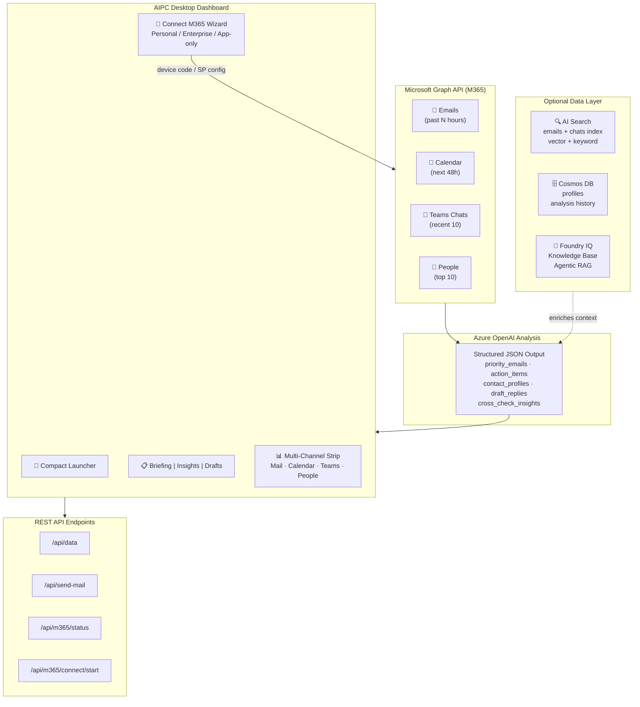

# M365 Morning Sweep Agent

[](https://azure.microsoft.com/products/ai-services/openai-service)
[](https://learn.microsoft.com/graph/overview)
[](https://azure.microsoft.com/products/ai-services/ai-search)
[](https://www.python.org/)
[](https://opensource.org/licenses/MIT)

An AI-powered executive assistant that reads your Microsoft 365 emails, calendar, and Teams chats via **Microsoft Graph API**, analyzes them with **Azure OpenAI**, and produces a structured daily briefing — prioritized emails, action items with detailed context, contact profiles, relationship network mapping, cross-source intelligence, and draft replies you can edit and send directly from the dashboard.

> **Author**: Xinyu Wei (魏新宇) — Microsoft AI GBB Senior System Engineer

[中文版](README-CN.md) | English | [Source Code](https://github.com/david-xinyuwei/M365-Morning-Sweep) (private — [request access](https://github.com/david-xinyuwei/david-share/issues))

---

## Live Demo

**Recorded walkthrough**: compact launcher → Open Briefing → M365 multi-channel status → tab switching → Connect M365 wizard → AI-drafted reply → Graph `sendMail` validation.

https://github.com/user-attachments/assets/93510362-c73a-45da-8135-ed6896f02778

---

## Positioning

This repo is **not a replacement for WorkIQ, Microsoft 365 Copilot, or Copilot for M365**. It demonstrates the fallback and companion pattern for cases where those options are not available, not suitable, or not economical:

| Scenario | Recommended path | Why |
|---|---|---|
| User already has Copilot for M365 and the experience can live inside Microsoft 365 | Use Copilot / WorkIQ | Native UX, Microsoft-managed grounding, full enterprise governance |
| Consumer or student uses a personal Microsoft account | Use this Graph API pattern with `GRAPH_AUTH_PROFILE=personal` | No Copilot license, no tenant admin, no Teams; email/calendar/contacts work with user consent |
| Enterprise customer wants a branded app, custom JSON output, or custom dashboard | Use this Graph API pattern with `GRAPH_AUTH_PROFILE=enterprise` | Full control over prompts, schema, UI, storage, and workflow |
| Enterprise customer wants background/server-side processing | Use Service Principal mode | Admin consent required; app-only access without an interactive user |

In short: **Copilot/WorkIQ is the first-class native M365 AI path. This repo is the programmable Graph API path when you need custom UX, custom outputs, or a lower-friction path for personal Microsoft accounts.**

### Understanding personal Microsoft accounts

The "Personal" mode in this demo uses the `consumers` authority, which covers **all personal Microsoft accounts (MSA)** — both free and paid:

| Account type | Cost | Graph Authority | Mail/Calendar/Contacts | Teams | OneDrive |
|---|---|---|---|---|---|
| Free Outlook.com / Hotmail / Live | Free | `consumers` | Yes | No | 5 GB |
| M365 Personal | USD 99.99/yr | `consumers` | Yes | Yes (personal Teams) | 1 TB |
| M365 Family | USD 129.99/yr | `consumers` | Yes | Yes (personal Teams) | 1 TB/person |

All three use the same MSA identity and the same Graph API path — **zero code change** between free and paid personal accounts. The key difference: M365 Personal/Family subscribers also get Teams chat data through Graph, while free Outlook.com users do not.

> Source: [Microsoft Graph Auth — tenant parameter](https://learn.microsoft.com/en-us/graph/auth-v2-user) — `consumers` for Microsoft accounts; [M365 Personal pricing](https://www.microsoft.com/en-us/microsoft-365/buy/microsoft-365) (retrieved 2026-06-01)

---

## Running on Azure

| Component | Details |
|---|---|
| **Azure OpenAI** | Any chat completion deployment (GPT-4o, GPT-4.1, etc.) + `text-embedding-3-large` for vector search |
| **Microsoft Graph API** | Mail.Read, Mail.Send, Calendars.Read, Chat.Read, User.Read, People.Read |
| **Azure AI Search** | (Optional) Vector + keyword indexes for historical email/chat retrieval |
| **Azure Cosmos DB** | (Optional) Contact profile persistence and analysis history |
| **Foundry IQ** | (Optional) Agentic retrieval — cross-source intelligence across emails and chats |

---

## Architecture



---

## What You'll See

| Feature | Description |
|---|---|
| **AIPC Desktop Shell** | Windows 11 / Mica-glass design language with acrylic sidebar, frosted header, and system-native feel — designed for AIPC (AI PC) scenarios |
| **Compact Launcher** | Mini-app startup mode with **Open Briefing**, **Connect M365**, and **Sync** buttons. Shows at-a-glance stats (email count, to-do count) before expanding to the full dashboard |
| **M365 Multi-Channel Strip** | Real-time status tiles for Outlook Mail, Calendar, Microsoft Teams, and People Graph — each showing item count and availability |
| **Connect M365 Wizard** | Built-in onboarding modal supporting three auth profiles: **Personal** (Outlook.com via device code), **Enterprise** (work/school M365 via device code), and **App-only** (service principal with admin consent). Customers can self-configure without editing `.env` files |
| **Tab System** | Three tabs: **Briefing** (emails + to-do + contacts), **Insights** (cross-source intelligence with evidence/analysis/next-step panels), **Drafts & History** (AI reply drafts + CosmosDB timeline) |
| **Priority Email Triage** | Every email sorted by urgency (high/medium/low) with color-coded borders, suggested actions, and reasoning |
| **Smart To-Do List** | Extracted action items with P0/P1/P2 priority, interactive checkboxes, collapsible detail panels (background, prep items, related people) |
| **Teams Chat Summary** | Recent messages grouped by chat topic, with sender, content preview, and timestamps |
| **Contact Profiles** | Per-person analysis: communication style (formal/direct/casual), sentiment, interaction frequency, engagement tips |
| **Relationship Network** | Inner circle (green) and attention-needed (red) visualization with role tags |
| **Cross-Source Insights** | When the same topic appears in email AND chat, it gets flagged with source references |
| **Foundry IQ Panel** | Agentic retrieval results — AI-generated cross-source answers with citations |
| **AI-Drafted Replies** | For every email, tailored to each contact's communication style. Editable, with persona optimization and one-click send |
| **Drag-Drop Attachments** | File picker or drag-and-drop, base64 encoded, max 3MB per file |
| **Historical Insights** | CosmosDB-backed timeline showing analysis history and contact profile evolution |
| **Dark Mode** | System-aware dark/light toggle with smooth transitions, persisted across sessions |
| **Cost Monitor** | Token usage tracking in the dashboard footer |

---

## Features

### Core Agent (`morning_sweep.py`)

**Data Collection** — Fetches from 4 Graph API endpoints in a single sweep:
- **Emails**: Past N hours (configurable), deduplicated by subject+sender, with body preview
- **Calendar**: Next 48 hours of events with attendees, location, and agenda
- **Teams Chats**: Recent 10 chats with last 20 messages each, including group chats
- **People**: Top 10 relevant contacts via Microsoft Graph People API

**Azure OpenAI Analysis** — Sends all collected data to a chat completion model with structured JSON output. The system prompt instructs the model to produce:

| Output Section | What It Contains |
|---|---|
| `priority_emails` | **Every** email sorted by urgency (high/medium/low), with suggested action and reasoning. Includes sender email address |
| `today_schedule` | Calendar events with preparation notes, key attendees, and context |
| `action_items` | Extracted tasks with P0/P1/P2 priority. Each item includes a `detail` object: background (2-3 sentences), prep_needed (specific items), related_people (name + role), related_history, and suggested_approach |
| `cross_check_insights` | Cross-source correlations — when the same topic appears in email AND chat, it gets flagged with source references |
| `contact_profiles` | Per-person analysis: communication style (formal/direct/casual), relationship type, sentiment, interaction frequency, and engagement tips |
| `relationship_network` | Inner circle identification + attention-needed alerts |
| `draft_replies` | AI-generated reply for **every** email, tailored to the contact's communication style |

**Authentication** — Two modes:
- **Delegated** (interactive): MSAL device code flow with persistent token cache
- **Service Principal** (unattended): Client credentials for automated/server deployment

**Cross-Session Memory** — File-based history (last 50 analyses stored as JSON). Previous analyses are fed back into the prompt so the model can say things like "This issue was first raised 3 days ago" or "This is a recurring action item."

### Live Dashboard Server (`live_server.py`)

A self-contained Python HTTP server (no Flask/Django dependency) that serves a real-time dashboard:

- **Smart Polling**: Polls Graph API every 15 seconds, but only triggers Azure OpenAI analysis when data actually changes (MD5 hash comparison of email subjects + chat previews). This avoids unnecessary API costs
- **SSE Push**: Browser polls `/api/data` every 5-10 seconds for instant updates without page reload
- **Basic Auth**: Username/password protection for all endpoints except `/api/health` and `/api/schema`
- **Thread-Safe**: Analysis runs in background threads; server remains responsive

**REST API endpoints**:

| Endpoint | Method | Auth | Description |
|---|---|---|---|
| `/` | GET | Yes | Dashboard HTML |
| `/api/data` | GET | Yes | Current analysis result as JSON |
| `/api/health` | GET | No | Status, metrics, data freshness |
| `/api/schema` | GET | No | API documentation with full JSON schema |
| `/api/send-mail` | POST | Yes | Send email via Graph API (supports attachments) |
| `/api/optimize-draft` | POST | Yes | Rewrite a draft for a specific persona/communication style |
| `/api/refresh` | POST | Yes | Force re-analysis with custom time range |
| `/api/insights` | GET | Yes | CosmosDB historical trends |
| `/api/m365/status` | GET | Yes | Current M365 connection status: auth profile, channels, cached accounts |
| `/api/m365/connect/start` | POST | Yes | Start M365 onboarding flow (personal / enterprise / app-only) |
| `/api/m365/connect/status` | GET | Yes | Poll device-code flow progress for a pending connection |
| `/api/m365/disconnect` | POST | Yes | Remove one cached M365 account from the app (`{username}` optional) |

### Rich Dashboard (`dashboard.html`)

A single-file HTML dashboard with no build tools or external dependencies, designed with **Windows 11 / AIPC desktop application aesthetics**:

- **AIPC Desktop Shell**: Mica-glass design language — acrylic sidebar, frosted header, system-native window controls, and an "AIPC Ready" chip. The dashboard looks and feels like a native Windows desktop app, not a web page
- **Compact Launcher**: On first load, a mini-app card appears with at-a-glance stats and three action buttons: **Open Briefing** (expand to full dashboard), **Connect** (open M365 wizard), and **Sync** (force refresh). This mimics the AIPC widget/launcher pattern
- **M365 Multi-Channel Strip**: Four status tiles — Outlook Mail, Calendar, Teams, People — each showing real-time item counts fetched from `/api/data`. Channels unavailable for the current auth profile show "not available" gracefully
- **Connect M365 Wizard**: A built-in modal for self-service M365 onboarding:
  - **Personal**: Select → device code displayed → user completes auth at microsoft.com/link → channels light up (Mail ✓, Calendar ✓, People ✓, Teams —)
  - **Enterprise**: Same device code flow with Teams enabled (Mail ✓, Calendar ✓, People ✓, Teams ✓)
  - **App-only**: Shows required application permissions and env vars for admin configuration
  - Connection state persists to `.m365_connection.json` and survives server restarts
- **Tab System**: Three tabs — **Briefing** (priority emails + to-do + contacts), **Insights** (cross-source intelligence with evidence/what-it-means/next-step panels), **Drafts & History** (AI reply drafts + CosmosDB timeline)
- **Nav Rail**: Icon-based sidebar with 5 navigation buttons mapped to dashboard sections
- **Dark Mode**: System-aware toggle with smooth CSS transitions; preference persisted in localStorage
- **Priority Emails**: Color-coded by urgency (red/orange/green border), collapsible to show suggested action and source reference
- **To-Do List**: Interactive checkboxes (checked items get strikethrough), collapsible detail panels showing background, preparation items, related people, and suggested approach
- **Teams Chats**: Recent messages grouped by chat topic, showing sender, content preview, and timestamp
- **Contact Profiles**: Avatar circles with initials, role/relationship tags, communication style badges, sentiment dots (green/orange/red), and engagement tips
- **Relationship Network**: Inner circle (green tags) and attention-needed (red tags) visualization
- **Cross-Source Insights**: Gradient cards showing correlations between emails, chats, and calendar
- **Foundry IQ Panel**: Agentic retrieval results — shows the query, AI-generated answer, reference count, and source types
- **AI-Drafted Replies**: Collapsible reply cards with:
  - Editable draft text (contentEditable)
  - Persona optimization buttons — click a contact name to rewrite the draft matching their communication style, with before/after comparison
  - File attachment via drag-and-drop or file picker (base64 encoded, max 3MB per file)
  - One-click send with confirmation modal
- **Insights Over Time**: CosmosDB-backed historical panel showing analysis timeline and contact profile evolution
- **Footer**: Token usage, timestamp, and technology stack badges (Graph API, Azure OpenAI, AI Search)

### Data Layer (`data_layer.py`)

Optional but recommended for production use. Each component fails independently (partial enrichment is still useful):

**AI Search Integration**:
- Two indexes: `emails` (with `body_vector` for semantic search) and `chats` (with `content_vector`)
- Ingestion: Graph API data → `text-embedding-3-large` embeddings → AI Search upload
- Retrieval: keyword search, semantic/vector search, and sender-specific history lookup
- Used to enrich GPT context with historical patterns

**Foundry IQ (Agentic Retrieval)**:
- Creates Knowledge Sources from the `emails` and `chats` AI Search indexes
- Creates a Knowledge Base that spans both sources
- Queries are auto-generated from current email subjects and chat topics
- Returns AI-generated cross-source answers with citations
- Example: "What do I know about: Q2 AI Strategy" → searches both email and chat indexes → returns synthesized answer

**CosmosDB Integration**:
- `profiles` container: Contact profiles (communication style, sentiment, topics) updated after each analysis
- `analyses` container: Historical analysis summaries for trend detection
- AAD authentication via Service Principal (no key in code)

### Infrastructure Setup (`setup_infra.py`)

One-command setup for all Azure resources:
```bash
python setup_infra.py --all
```
Creates:
- AI Search indexes (`emails`, `chats`) with vector search configuration (HNSW, 3072 dimensions)
- CosmosDB database `morning_sweep` with `profiles` and `analyses` containers
- Foundry IQ Knowledge Sources and Knowledge Base
- Initial data ingestion from Graph API

---

## Quick Start

### 1. Prerequisites

- Python 3.10+
- An Azure OpenAI resource with a chat completion deployment
- An Entra ID app registration with Graph API permissions (see [Entra ID Setup](#entra-id-app-registration))

### 2. Install

```bash
pip install -r requirements.txt
```

### 3. Configure

```bash
cp .env.example .env
# Edit .env with your Azure OpenAI endpoint, key, tenant ID, and client ID
```

Choose one Graph authorization profile:

**Personal Microsoft account (Outlook.com / Hotmail / Live)** — email + calendar + contacts, no Teams, no tenant admin:

```bash
GRAPH_AUTH_PROFILE=personal
AUTHORITY_TENANT=consumers
TENANT_ID=
ENABLE_TEAMS=false
GRAPH_SCOPES=
```

Your app registration must support personal Microsoft accounts (`signInAudience=PersonalMicrosoftAccount` or `AzureADandPersonalMicrosoftAccount`) and include delegated permissions such as `User.Read`, `Mail.Read`, `Mail.Send`, `Calendars.Read`, `Contacts.Read`, and `People.Read`.

**Enterprise M365 account** — email + calendar + contacts + Teams, admin consent may be required:

```bash
GRAPH_AUTH_PROFILE=enterprise
AUTHORITY_TENANT=organizations
TENANT_ID=your-tenant-id
ENABLE_TEAMS=true
GRAPH_SCOPES=
```

For locked-down tenants, ask the customer's IT admin to grant consent for the configured delegated permissions. `Chat.Read` is the permission most likely to trigger admin review.

### 4. Validate Graph API Access

Before running the full AI briefing, validate Graph API auth with `--smoke-test`. It prints counts only and does **not** print email subjects, message bodies, attendees, or contact names.

**Personal Microsoft account validation**:

```bash
export GRAPH_AUTH_PROFILE=personal
export AUTHORITY_TENANT=consumers
export TENANT_ID=
export ENABLE_TEAMS=false
python morning_sweep.py --login --smoke-test --hours 24
```

Important boundary: personal Microsoft account support means Graph can access the user's **Microsoft consumer mailbox** (Outlook.com / Hotmail / Live). If the user signs in with a Gmail address that is only used as a Microsoft account login alias, Microsoft Graph does **not** read the Gmail inbox. Gmail requires Google OAuth + Gmail API (or a separate mail connector).

Actual personal Microsoft account consent flow captured during validation:

<div align="center">
    
    <br/>
    <sub>Step 1 — enter the device code from the CLI at microsoft.com/link.</sub>
</div>

<br/>

<div align="center">
    
    <br/>
    <sub>Step 2 — personal Microsoft account may request an email verification code before consent.</sub>
</div>

<br/>

<div align="center">
    
    <br/>
    <sub>Step 3 — user reviews Graph delegated permissions and accepts. The screenshot is redacted and uses a sample app name.</sub>
</div>

<br/>

<div align="center">
    
    <br/>
    <sub>Step 4 — real Outlook.com consent screen, sanitized for public sharing. The permission set is the same: Mail, Calendar, Contacts, People, Profile, and offline access.</sub>
</div>

<br/>

<div align="center">
    
    <br/>
    <sub>Step 5 — Microsoft confirms the user is signed in to the Graph API app.</sub>
</div>

Expected shape:

```json
{
    "auth_profile": "personal",
    "authority_tenant": "consumers",
    "teams_enabled": false,
    "scopes": ["User.Read", "Mail.Read", "Mail.Send", "Calendars.Read", "Contacts.Read", "People.Read"],
    "profile_ok": true,
    "emails_count": 5,
    "calendar_count": 3,
    "chats_count": 0,
    "people_count": 5,
    "result": "PASS"
}
```

**Enterprise delegated validation**:

```bash
export GRAPH_AUTH_PROFILE=enterprise
export AUTHORITY_TENANT=organizations   # or your tenant ID
export TENANT_ID=your-tenant-id
export ENABLE_TEAMS=true
python morning_sweep.py --login --smoke-test --hours 24
```

If `Chat.Read` fails with 403 or `AADSTS65001`, the customer tenant requires admin consent. Ask the tenant admin to approve the delegated permissions, then rerun the same command.

**App-only / service principal validation**:

```bash
export USE_SP_AUTH=true
export SP_TENANT=your-tenant-id
export SP_CLIENT_ID=your-sp-client-id
export SP_CLIENT_SECRET=your-sp-client-secret
export SP_TARGET_USER=user@yourtenant.com
python morning_sweep.py --smoke-test --hours 24
```

This path requires application permissions and tenant-wide admin consent. It is the right model for backend jobs, but it is not the right onboarding path for consumer users.

### 5. First Run (Interactive Login)

```bash
# Load environment variables
export $(grep -v '^#' .env | xargs)

# Interactive login via device code flow
python morning_sweep.py --login --hours 24

# Output: structured JSON briefing printed to console
# Token is cached at ~/.morning_sweep_token_cache.json for subsequent runs
```

### 6. Subsequent Runs

```bash
# Use cached token, look back 48 hours, save to file
python morning_sweep.py --hours 48 -o briefing.json

# Fetch data only (no Azure OpenAI call)
python morning_sweep.py --no-ai

# Enable full data layer (AI Search + CosmosDB + Foundry IQ)
python morning_sweep.py --data-layer --hours 168
```

### 7. Live Dashboard

```bash
export $(grep -v '^#' .env | xargs)
python live_server.py
# Open http://localhost:8088 in browser
# Default credentials: admin / changeme (configurable via DASHBOARD_USER/DASHBOARD_PASSWORD)
```

### 8. Connect M365 from the Dashboard

The dashboard includes a **Connect M365** wizard so users do not need to edit `.env` files for delegated login flows.

After an account is connected, the top bar shows a clickable **Connected: user@example.com** chip next to the **Connect M365** button. Opening the wizard also shows a **Connected accounts** section with **Switch account** and **Disconnect** buttons for each cached delegated account. **Switch account** removes the cached token from this app and returns the user to the email-entry step; it does not sign the user out of Microsoft in the browser.

| Profile | What the user enters | Authority used by the app | Channels |
|---|---|---|---|
| **Personal** | Personal email address. Leave Client ID blank to use the server default; no tenant field is shown | `consumers` | Mail, Calendar, People. Teams is disabled |
| **Enterprise** | Work email address, optional tenant authority (`organizations` by default, or a tenant ID if required by IT), optional Teams toggle | `organizations` or tenant ID | Mail, Calendar, People, Teams |
| **App-only** | Nothing in the browser. IT admin configures server-side env vars | Tenant ID from `SP_TENANT` | Depends on application permissions |

For personal Outlook.com / Hotmail / Live users, the user enters the email address they want to connect, but there is **no tenant ID to type**. The app automatically uses Microsoft Identity Platform's consumer authority (`consumers`) and opens the device-code login page.

### 9. Infrastructure Setup (Optional)

```bash
# Requires SEARCH_ENDPOINT, SEARCH_KEY, COSMOS_ENDPOINT, COSMOS_KEY
python setup_infra.py --setup    # Create indexes and containers
python setup_infra.py --ingest   # Ingest Graph API data into AI Search
python setup_infra.py --all      # Both
```

---

## Service Principal Mode (Unattended)

For automated/server deployment without interactive login:

```bash
export USE_SP_AUTH=true
export SP_TENANT=your-tenant-id
export SP_CLIENT_ID=your-sp-client-id
export SP_CLIENT_SECRET=your-sp-client-secret
export SP_TARGET_USER=user@yourtenant.onmicrosoft.com

# CLI mode
python morning_sweep.py --hours 24 -o output.json

# Or live server mode
python live_server.py
```

In SP mode, Graph API calls replace `/me` with `/users/{target_user}` automatically.

---

## File Structure

```
M365-Morning-Sweep/
├── morning_sweep.py                       # Core agent: Graph API → Azure OpenAI → JSON
│                                          #   Auth (MSAL delegated + SP), data collection,
│                                          #   analysis, history persistence
├── live_server.py                         # Live dashboard server: SSE + smart polling +
│                                          #   REST API + embedded fallback HTML
├── dashboard.html                         # Rich dashboard: hero header, collapsible cards,
│                                          #   persona optimization, drag-drop attachments,
│                                          #   CosmosDB insights panel
├── data_layer.py                          # AI Search + CosmosDB + Foundry IQ integration:
│                                          #   ingestion, retrieval, profiles, history
├── setup_infra.py                         # One-click Azure resource setup
├── auto_refresh_server.py                 # Simple auto-refresh server (polling only)
├── morning_sweep_dashboard_template.html  # Dashboard template for static/offline mode
├── refresh_dashboard.sh                   # One-click: fetch data + rebuild static dashboard
├── requirements.txt                       # Python dependencies
├── .env.example                           # Environment variable template
├── .gitignore                             # Excludes .env, JSON data, token cache
├── README.md                              # This file
└── README-CN.md                           # Chinese version
```

---

## Entra ID App Registration

### Delegated Permissions (Interactive Login)

| Permission | Personal MSA | Enterprise M365 | Purpose |
|---|:---:|:---:|---|
| `User.Read` | Yes | Yes | Get current user profile |
| `Mail.Read` | Yes | Yes | Read user's emails |
| `Mail.Send` | Yes | Yes | Send emails from dashboard |
| `Calendars.Read` | Yes | Yes | Read calendar events |
| `Contacts.Read` | Yes | Yes | Read Outlook contacts |
| `People.Read` | Yes | Yes | Get relevant contacts for relationship mapping |
| `Chat.Read` | No | Yes | Read Teams chat messages |

Personal profile deliberately does **not** request `Chat.Read`, because Teams chat data is not available to personal Microsoft accounts. Enterprise profile includes `Chat.Read` and may require tenant admin consent depending on customer policy.

### Application Permissions (Service Principal)

| Permission | Purpose |
|---|---|
| `Mail.Read` | Read target user's emails |
| `Calendars.Read` | Read target user's calendar |
| `Chat.Read.All` | Read Teams chats (requires admin consent) |
| `User.Read.All` | Get user profiles |

> **Note**: Application permissions require admin consent in the Azure portal.

### Authorization Paths

| Path | User type | `.env` profile | Consent owner | Data sources |
|---|---|---|---|---|
| Personal delegated | Outlook.com / Hotmail / Live | `GRAPH_AUTH_PROFILE=personal` | End user | Mail, Calendar, Contacts, People |
| Enterprise delegated | Work/school M365 | `GRAPH_AUTH_PROFILE=enterprise` | End user or tenant admin | Mail, Calendar, Contacts, People, Teams |
| App-only | Enterprise daemon/server | `USE_SP_AUTH=true` | Tenant admin | Target user's mailbox/calendar/chats based on app permissions |

### How Personal MSA Auth Works Under the Hood

A common misconception is that personal Microsoft accounts (Outlook.com / Hotmail / Live) don't have a tenant, and therefore can't use Graph API delegated flows. In fact, **every personal MSA is silently backed by a shared consumer tenant**:

```
Consumer Tenant ID: 9188040d-6c67-4c5b-b112-36a304b66dad
```

This is a Microsoft-managed consumer tenant that hosts personal Microsoft accounts globally. The MSAL authority alias `consumers` routes to the same identity plane. You can verify this directly from the Microsoft identity platform metadata endpoint: `https://login.microsoftonline.com/consumers/v2.0/.well-known/openid-configuration` returns issuer `https://login.microsoftonline.com/9188040d-6c67-4c5b-b112-36a304b66dad/v2.0`. Source: Microsoft identity platform OpenID metadata endpoint, verified 2026-06-01.

The device-code protocol also explicitly allows `{tenant}` to be `/common`, `/consumers`, `/organizations`, or a tenant GUID, and the user code expires after 15 minutes by default. Source: https://learn.microsoft.com/en-us/entra/identity-platform/v2-oauth2-device-code, verified 2026-06-01.

**How the code switches between personal and enterprise — the only difference is the authority URL**:

```python
# Enterprise: route to a specific organizational tenant
authority = f"https://login.microsoftonline.com/{tenant_id}"

# Personal: route to the shared consumer tenant via alias
authority = "https://login.microsoftonline.com/consumers"
```

After MSAL acquires a token, the Graph API calls (`/me/messages`, `/me/calendarView`, `/me/people`) are identical regardless of account type. The Microsoft Identity Platform routes the request to the correct mailbox based on the `tid` (tenant ID) claim in the token.

**Key implementation details for GBB reference**:

| Aspect | Detail |
|---|---|
| **Consumer tenant ID** | `9188040d-6c67-4c5b-b112-36a304b66dad` — same for all personal MSAs worldwide |
| **Authority alias** | `consumers` → MSAL expands to `https://login.microsoftonline.com/consumers` |
| **App Registration** | `signInAudience` must be `AzureADandPersonalMicrosoftAccount` or `PersonalMicrosoftAccount`. Default `AzureADMyOrg` rejects consumer logins. Source: https://learn.microsoft.com/en-us/entra/identity-platform/supported-accounts-validation |
| **ROPC limitation** | Username/password auth is not a viable onboarding path for this consumer flow. In validation, MSAL Python returned `Unable to find wstrust endpoint from MEX` for a personal MSA. Use device code, auth code, or interactive flows |
| **Token verification** | After login, check the cached account's `realm` field: if it contains `9188040d`, the account is a personal MSA |
| **Teams gap** | Consumer accounts have no Teams data. Set `ENABLE_TEAMS=false` to skip `/me/chats` calls, otherwise Graph returns 403 |
| **Consent model** | Personal accounts use **user-only consent** — no admin approval needed. The user clicks Accept on the consent screen and it works immediately |
| **Gmail-as-MSA pitfall** | A Gmail address can be registered as an MSA login alias. Auth succeeds (profile returns 200), but `emails_count=0` because Graph reads the Microsoft consumer mailbox, not the Gmail inbox |

**Validated 2026-06-01** with a real Outlook.com account: `/me` returned 200, `/me/messages` returned 5 messages, and `/me/calendarView` completed successfully with 0 current events. The flow used `/consumers` authority and user-only consent; no tenant admin approval was required.

---

## Configuration Reference

| Variable | Required | Default | Description |
|---|---|---|---|
| `GRAPH_AUTH_PROFILE` | No | `enterprise` | `personal` for Outlook.com/Hotmail/Live without Teams; `enterprise` for work/school M365 with Teams |
| `AUTHORITY_TENANT` | No | profile-based | Override MSAL authority tenant. Defaults to `consumers` for personal, `organizations` or `TENANT_ID` for enterprise |
| `GRAPH_SCOPES` | No | profile-based | Space- or comma-separated Microsoft Graph scopes; use only for advanced custom scope sets |
| `ENABLE_TEAMS` | No | inferred from scopes | Enables `/me/chats` calls. Set `false` for personal Microsoft accounts |
| `M365_DEFAULT_PERSONAL_EMAIL` | No | — | Optional email prefill for the Personal account field in the Connect M365 wizard |
| `M365_DEFAULT_ENTERPRISE_EMAIL` | No | — | Optional email prefill for the Enterprise account field in the Connect M365 wizard |
| `TENANT_ID` | Yes | — | Azure AD tenant ID |
| `CLIENT_ID` | Yes | — | App registration client ID |
| `AOAI_ENDPOINT` | Yes | — | Azure OpenAI endpoint URL |
| `AOAI_KEY` | Yes | — | Azure OpenAI API key |
| `AOAI_DEPLOYMENT` | No | `gpt-4o` | Chat completion deployment name |
| `AOAI_API_VERSION` | No | `2025-04-01-preview` | Azure OpenAI API version |
| `USE_SP_AUTH` | No | `false` | Enable Service Principal mode |
| `SP_TENANT` | SP mode | — | SP tenant ID |
| `SP_CLIENT_ID` | SP mode | — | SP client ID |
| `SP_CLIENT_SECRET` | SP mode | — | SP client secret |
| `SP_TARGET_USER` | SP mode | — | Target user UPN (e.g., `user@tenant.onmicrosoft.com`) |
| `USE_DATA_LAYER` | No | `false` | Enable AI Search + CosmosDB + Foundry IQ |
| `SEARCH_ENDPOINT` | Data layer | — | Azure AI Search endpoint |
| `SEARCH_KEY` | Data layer | — | Azure AI Search admin key |
| `COSMOS_ENDPOINT` | Data layer | — | Cosmos DB endpoint |
| `COSMOS_KEY` | Data layer | — | Cosmos DB key (for setup_infra.py only; runtime uses AAD) |
| `FOUNDRY_IQ_KB` | Data layer | `morning-sweep-kb` | Knowledge Base name |
| `PORT` | No | `8088` | Dashboard server port |
| `DASHBOARD_USER` | No | `admin` | Basic Auth username |
| `DASHBOARD_PASSWORD` | No | `changeme` | Basic Auth password |
| `POLL_INTERVAL` | No | `15` | Graph API polling interval (seconds) |
| `EMAIL_HOURS` | No | `168` | Default email lookback window (hours) |

---

## Known Issues / Troubleshooting

| Issue | Solution |
|-------|----------|
| Personal Outlook.com login fails or shows organization-only sign-in | Set `GRAPH_AUTH_PROFILE=personal`, `AUTHORITY_TENANT=consumers`, leave `TENANT_ID` empty, and make sure the app registration supports personal Microsoft accounts |
| Personal Microsoft account consent fails on Teams scope | Set `ENABLE_TEAMS=false` and do not include `Chat.Read` in `GRAPH_SCOPES` |
| `AADSTS65001` on login | Grant admin consent for the app registration permissions in Azure Portal |
| Graph API 403 on `/me/chats` | `Chat.Read` requires admin consent in most tenants |
| CosmosDB `(Forbidden) Request originated from IP...` | Add VM/client IP to CosmosDB firewall allowlist **and** ensure `publicNetworkAccess` is `Enabled` (both are required) |
| Empty calendar results | Graph API uses UTC; `calendarView` requires explicit `startDateTime`/`endDateTime` |
| Token cache expired | Run with `--login` to re-authenticate via device code flow |
| Azure OpenAI returns non-JSON | Model occasionally fails structured output; the agent saves the raw response and retries on next poll cycle |
| Dashboard shows "Loading..." | Check `/api/health` — if status is `warming_up`, the first Graph API poll hasn't completed yet |
| Send email fails from dashboard | Verify `Mail.Send` permission is granted and admin-consented |

---

*Author: Xinyu Wei (魏新宇)*
