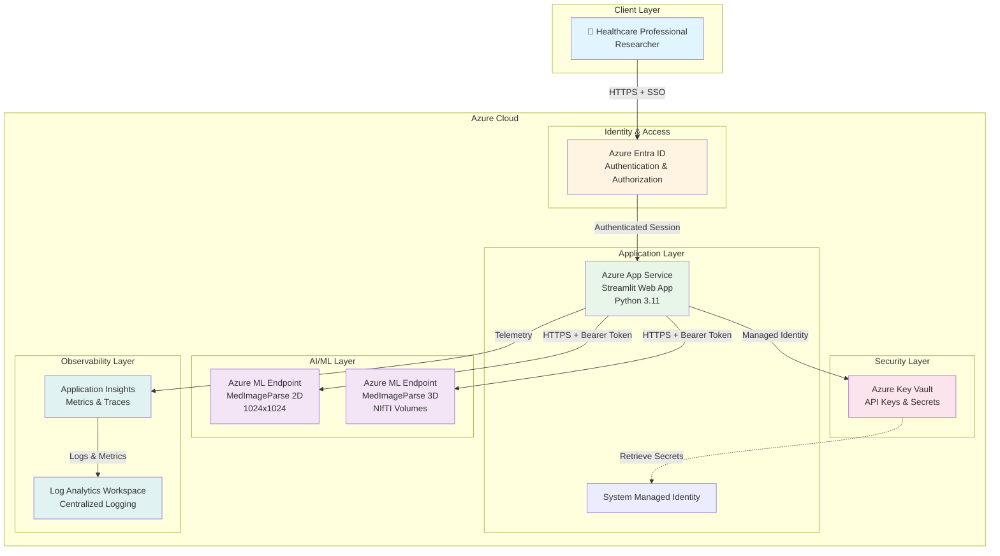
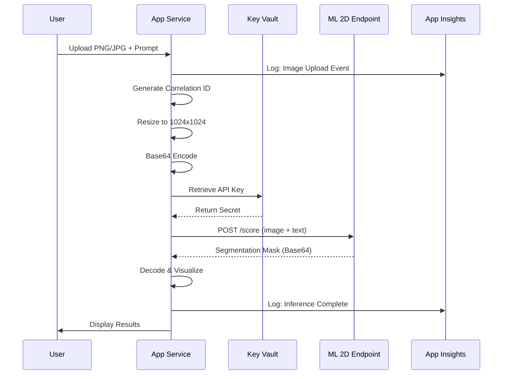
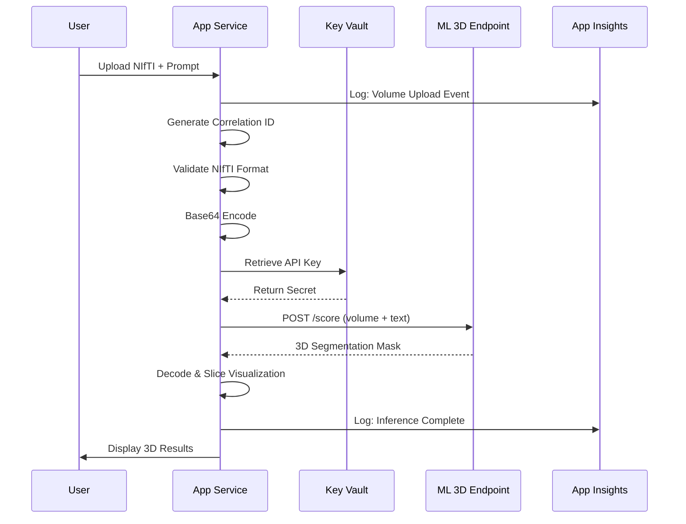

# MedImageParse - Architecture Documentation

## Overview

MedImageParse is a cloud-native medical image segmentation platform built on Azure, designed for healthcare professionals and researchers to perform AI-powered image analysis using natural language prompts.

## Architecture Diagram



## Component Details

### 1. Client Layer

**User Interface**
- Modern, responsive web application built with Streamlit
- Bilingual support (Chinese & English)
- Interactive 3D visualization
- Real-time feedback and progress indicators

**Supported Workflows**
- 2D image segmentation (PNG, JPG, JPEG)
- 3D volume segmentation (NIfTI format)
- Natural language prompt input
- Multi-object segmentation
- Result visualization and download

### 2. Identity & Access Layer

**Azure Entra ID**
- Single Sign-On (SSO) authentication
- Role-Based Access Control (RBAC)
- Multi-factor authentication support
- Session management

**Security Features**
- HTTPS-only communication
- Token-based authentication
- Session timeout policies
- Audit logging

### 3. Application Layer

**Azure App Service**
- **Platform**: Linux (Python 3.11)
- **Framework**: Streamlit
- **Compute**: Scalable App Service Plan (Basic B1+)
- **Features**:
  - Auto-scaling capabilities
  - Zero-downtime deployment
  - Health monitoring
  - Continuous deployment support

**System Managed Identity**
- Eliminates need for stored credentials
- Automatic credential rotation
- Secure service-to-service authentication
- Least-privilege access to Key Vault

**Application Components**

```
src/
├── app.py           # Main Streamlit application
├── config.py        # Configuration management with Key Vault
├── telemetry.py     # Logging and Application Insights integration
└── requirements.txt # Python dependencies
```

### 4. Security Layer

**Azure Key Vault**
- **Purpose**: Secure secret storage
- **Stored Secrets**:
  - MedImageParse 2D endpoint URL
  - MedImageParse 2D API key
  - MedImageParse 3D endpoint URL
  - MedImageParse 3D API key
  - Application Insights connection string

**Access Control**
- RBAC-based permissions
- Managed Identity authentication
- Audit trail for all access
- Secret versioning and rotation

### 5. AI/ML Layer

**MedImageParse 2D Model**
- **Input**: PNG/JPG images (auto-resized to 1024x1024)
- **Output**: Segmentation masks
- **Use Cases**: 
  - Ophthalmology: Retinal analysis, vessel segmentation
  - Pathology: Cell identification, tissue analysis
  - Radiology: CT/X-ray slice segmentation

**MedImageParse 3D Model**
- **Input**: NIfTI volumes (.nii, .nii.gz)
- **Output**: 3D segmentation masks
- **Use Cases**:
  - Brain imaging: Anatomy segmentation
  - Organ segmentation: Liver, kidney, lung
  - Tumor analysis: Volume and boundary detection

**Prompt System**
- Natural language understanding
- 100+ preset medical terminology templates
- Multi-object segmentation (using '&' separator)
- 16 biomedical category classification

### 6. Observability Layer

**Application Insights**
- **Metrics**:
  - Request latency (P50, P95, P99)
  - Model inference time
  - Error rates and types
  - Active sessions
  - Throughput (images/minute)

- **Custom Events**:
  - Page views
  - Model calls
  - User interactions
  - Health checks

- **Correlation Tracking**:
  - Unique correlation IDs for each request
  - Distributed tracing across services
  - End-to-end request tracking

**Log Analytics**
- Centralized log aggregation
- KQL query support
- Retention: 30 days (configurable)
- Daily quota: 1GB (configurable)

## Data Flow

### 2D Image Segmentation Flow



### 3D Volume Segmentation Flow



## Deployment Architecture

### Infrastructure as Code (IaC)

```
infra/
├── main.bicep                    # Main orchestration
├── main.parameters.json          # Parameter template
├── modules/
│   ├── monitor.bicep            # App Insights + Log Analytics
│   ├── keyvault.bicep           # Key Vault provisioning
│   ├── keyvault-access.bicep    # RBAC assignments
│   ├── secrets.bicep            # Secret population
│   └── app-service.bicep        # App Service + Plan
└── scripts/
    └── post-provision.ps1       # Post-deployment scripts
```

### Deployment Process

1. **Developer runs `azd up`**
2. **Authentication**: User authenticates with Azure CLI
3. **Provisioning**: Bicep templates create resources
   - Resource Group
   - Log Analytics Workspace
   - Application Insights
   - Key Vault (with RBAC)
   - App Service Plan
   - App Service (with Managed Identity)
4. **Secret Storage**: API keys stored in Key Vault
5. **Access Grant**: Managed Identity gets Key Vault access
6. **Application Deployment**: Code deployed to App Service
7. **Verification**: Health check confirms deployment

### Resource Naming Convention

- Resource Group: `rg-{environmentName}`
- App Service Plan: `asp-{environmentName}`
- App Service: `app-{environmentName}-{uniqueString}`
- Key Vault: `kv-{uniqueString}`
- Log Analytics: `log-{environmentName}`
- Application Insights: `appi-{environmentName}`

## Security Architecture

### Defense in Depth

```
┌─────────────────────────────────────────┐
│         Azure Entra ID                  │ Layer 1: Identity
├─────────────────────────────────────────┤
│         HTTPS/TLS 1.2+                  │ Layer 2: Transport
├─────────────────────────────────────────┤
│    App Service Authentication           │ Layer 3: Application Auth
├─────────────────────────────────────────┤
│    Managed Identity (No Secrets)        │ Layer 4: Service Auth
├─────────────────────────────────────────┤
│    Key Vault RBAC                       │ Layer 5: Secret Access
├─────────────────────────────────────────┤
│    Network Security (Optional VNET)     │ Layer 6: Network
└─────────────────────────────────────────┘
```

### Authentication Flow

1. User accesses application URL
2. App Service redirects to Entra ID login
3. User authenticates (MFA if configured)
4. Entra ID issues JWT token
5. Token stored in session
6. Subsequent requests validated against token
7. Session expires after inactivity timeout

### Secret Management

- **No hardcoded secrets** in code or configuration
- All secrets stored in Azure Key Vault
- Managed Identity retrieves secrets at runtime
- Automatic secret rotation supported
- Audit logs for all secret access

## Scalability

### Vertical Scaling

- App Service Plan can be upgraded to higher SKUs
- B1 → S1 → P1V2 → P2V2 → P3V2
- Supports up to 14GB RAM, 8 vCPUs

### Horizontal Scaling

- Auto-scale rules based on:
  - CPU percentage
  - Memory percentage
  - Request queue length
  - Custom metrics (e.g., inference time)

### Performance Optimization

- Image caching for repeated requests
- Async processing for long-running tasks
- Connection pooling for ML endpoints
- CDN for static assets (if configured)

## Monitoring & Alerting

### Key Metrics Dashboard

| Metric | Threshold | Alert Action |
|--------|-----------|--------------|
| Availability | < 99% | Email + SMS |
| Response Time P95 | > 10s | Email |
| Error Rate | > 5% | Email + SMS |
| CPU Usage | > 80% | Auto-scale |
| Memory Usage | > 85% | Auto-scale |

### Log Queries (KQL)

**Error Rate (Last 24h)**
```kql
requests
| where timestamp > ago(24h)
| summarize 
    TotalRequests = count(),
    FailedRequests = countif(success == false),
    ErrorRate = 100.0 * countif(success == false) / count()
| project ErrorRate, TotalRequests, FailedRequests
```

**Model Inference Latency**
```kql
customEvents
| where name == "model_inference"
| extend duration = tolong(customDimensions.duration_ms)
| summarize 
    P50 = percentile(duration, 50),
    P95 = percentile(duration, 95),
    P99 = percentile(duration, 99)
```

## Disaster Recovery

### Backup Strategy

- **Application Code**: Version controlled in Git
- **Infrastructure**: Defined in Bicep (reproducible)
- **Secrets**: Key Vault soft-delete (90-day retention)
- **User Data**: No persistent user data stored

### Recovery Process

1. Run `azd up` in new region
2. Update DNS (if custom domain used)
3. Reconfigure ML endpoints
4. Test health checks
5. Redirect traffic

**RTO (Recovery Time Objective)**: < 30 minutes
**RPO (Recovery Point Objective)**: 0 (no data loss, stateless app)

## Compliance & Privacy

### Data Handling

- **Medical Images**: Processed in-memory only
- **No persistent storage** of PHI/PII
- **Logs**: Sanitized to exclude sensitive data
- **Temporary files**: Automatically cleaned up

### Compliance Features

- **HIPAA-ready architecture** (requires BAA with Azure)
- **Encryption at rest**: All Azure services
- **Encryption in transit**: TLS 1.2+
- **Audit logging**: All access tracked
- **Data residency**: Configurable region

## Cost Optimization

### Estimated Monthly Costs

| Resource | SKU | Estimated Cost |
|----------|-----|----------------|
| App Service Plan | B1 | $13 |
| Key Vault | Standard | $0.03 |
| Application Insights | 1GB/day | $2.30 |
| Log Analytics | 1GB/day | $2.76 |
| **Total (approx)** | | **~$18/month** |

*Note: ML endpoint costs are separate and depend on usage*

### Cost Optimization Tips

- Use B1 tier for dev/test
- Enable auto-shutdown for non-prod
- Set retention policies on logs
- Use reserved capacity for production
- Monitor daily cost alerts

## Troubleshooting

### Common Issues

**Issue**: "Authentication failed"
- **Cause**: Entra ID not configured or user not assigned
- **Solution**: Check App Service authentication settings, verify user has access

**Issue**: "Key Vault access denied"
- **Cause**: Managed Identity missing RBAC role
- **Solution**: Run `azd up` again to reassign roles

**Issue**: "Model endpoint timeout"
- **Cause**: Large file or slow network
- **Solution**: Check file size, verify ML endpoint health

**Issue**: "Application Insights not logging"
- **Cause**: Connection string not configured
- **Solution**: Verify `APPLICATIONINSIGHTS_CONNECTION_STRING` in app settings

## Future Enhancements

### Phase 2 (Q1 2026)
- DICOM format support
- Batch processing API
- Multi-region deployment
- Custom model fine-tuning

### Phase 3 (Q2 2026)
- Mobile application
- Real-time collaboration
- Advanced analytics dashboard
- Integration with PACS systems

## References

- [Azure App Service Documentation](https://docs.microsoft.com/azure/app-service/)
- [Azure Key Vault Best Practices](https://docs.microsoft.com/azure/key-vault/general/best-practices)
- [Application Insights Overview](https://docs.microsoft.com/azure/azure-monitor/app/app-insights-overview)
- [MedImageParse Model Card](https://azure.microsoft.com/ai/)

---

**Last Updated**: October 2025
**Document Version**: 1.0.0
**Maintained by**: Xinyuwei
