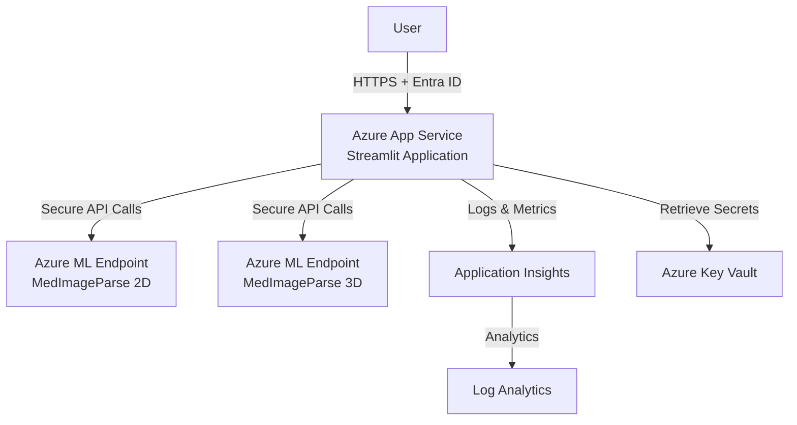

# MedImageParse - Medical Image Segmentation Platform

[](https://portal.azure.com/#create/Microsoft.Template/uri/https%3A%2F%2Fraw.githubusercontent.com%2Fyour-repo%2FMedImageParse%2Fmain%2Finfra%2Fmain.json)

An AI-powered medical image segmentation platform built on Azure, featuring support for 2D/3D medical imaging with natural language prompts. Specialized for ophthalmology, pathology, and radiology applications.

## 🎯 Scenario

MedImageParse enables healthcare professionals and researchers to perform advanced medical image segmentation using natural language descriptions. The platform leverages Azure's MedImageParse AI models to identify and segment anatomical structures, lesions, and abnormalities in medical images.

### Key Use Cases

- **👁️ Ophthalmology**: Retinal vessel segmentation, diabetic retinopathy detection, glaucoma screening
- **🔬 Pathology**: Tumor cell identification, tissue structure analysis
- **🏥 Radiology**: Organ segmentation (liver, lung, kidney), tumor detection, CT/MRI analysis
- **🧠 Neurology**: Brain anatomy segmentation, hemorrhage detection

## ✨ Features

- **2D & 3D Support**: Process both 2D images (PNG, JPG) and 3D volumes (NIfTI format)
- **Natural Language Prompts**: Describe segmentation targets in plain English
- **Interactive Visualization**: Real-time preview with 3D slice browsing
- **Multi-object Segmentation**: Segment multiple anatomical structures simultaneously
- **Bilingual UI**: Full Chinese and English language support
- **Secure Authentication**: Azure Entra ID integration
- **Observability**: Application Insights with correlation tracking

## 🚀 Quick Start

> 🎯 **First-time users**: See [QUICKSTART.md](./QUICKSTART.md) for a complete step-by-step checklist covering both model deployment and application deployment.

### Prerequisites

- [Azure Developer CLI (azd)](https://aka.ms/azure-dev/install)
- [Python 3.9+](https://www.python.org/downloads/)
- **Paid Azure subscription** (free/trial subscriptions are NOT supported)
- **MedImageParse models deployed in Azure AI Foundry** - See [Model Deployment Guide](./docs/model-deployment-guide.md) for detailed instructions

> ⚠️ **Critical**: Before deploying this application, you must first deploy the MedImageParse 2D and 3D models in Azure AI Foundry. This requires:
> - ✅ Hub-based project (NOT standalone project)
> - ✅ Azure AI Developer role assigned
> - ✅ Storage account with public network access enabled
> 
> Read the [Model Deployment Guide](./docs/model-deployment-guide.md) carefully - these requirements are not obvious and cause the most common deployment failures.

### Deploy to Azure

1. **Clone this directory only** (Sparse Checkout)
   ```bash
   git clone --depth 1 --filter=blob:none --sparse https://github.com/david-xinyuwei/david-share.git
   cd david-share
   git sparse-checkout set Agents/MedImageParse
   cd Agents/MedImageParse
   ```
   
   > 💡 **Why sparse checkout?** This repository contains many other projects. Sparse checkout downloads only the MedImageParse directory, saving time and disk space.

2. **Initialize Azure Developer CLI**
   ```bash
   azd auth login
   azd init
   ```

3. **Deploy infrastructure and application**
   ```bash
   azd up
   ```
   
   This command will:
   - Provision all Azure resources (App Service, Key Vault, Application Insights)
   - Configure Entra ID authentication
   - Deploy the Streamlit application
   - Set up monitoring and logging

4. **Access the application**
   ```bash
   azd show
   ```
   Open the displayed URL in your browser.

### Local Development

1. **Install dependencies**
   ```bash
   pip install -r src/requirements.txt
   ```

2. **Configure environment**
   ```bash
   cp .env.example .env
   # Edit .env with your Azure ML endpoint credentials
   ```

3. **Run locally**
   ```bash
   streamlit run src/app.py
   ```

## 📋 Configuration

### Azure ML Endpoints

The application requires two Azure ML endpoints:

1. **MedImageParse 2D**: For 2D image segmentation (1024x1024)
2. **MedImageParse 3D**: For 3D NIfTI volume segmentation

**How to get these endpoints**:
1. Follow the [Model Deployment Guide](./docs/model-deployment-guide.md) to deploy both models in Azure AI Foundry
2. Copy the endpoint URLs and API keys from the Azure AI Foundry portal
3. Configure these in Azure Key Vault after deployment or in `.env` for local development

> 💡 **First-time users**: The Model Deployment Guide includes critical prerequisites like hub-based projects, RBAC roles, and storage account configuration that are not obvious but required for successful deployment.

### Environment Variables

| Variable | Description | Required |
|----------|-------------|----------|
| `AZURE_OPENAI_ENDPOINT_2D` | 2D model endpoint URL | Yes |
| `AZURE_OPENAI_KEY_2D` | 2D model API key | Yes |
| `AZURE_OPENAI_ENDPOINT_3D` | 3D model endpoint URL | Yes |
| `AZURE_OPENAI_KEY_3D` | 3D model API key | Yes |
| `APPLICATIONINSIGHTS_CONNECTION_STRING` | App Insights connection string | Auto-configured |

## 🏗️ Architecture

See [ARCHITECTURE.md](./ARCHITECTURE.md) for detailed architecture documentation.

### High-Level Components



### Key Azure Services

- **Azure App Service**: Hosts the Streamlit web application
- **Azure Key Vault**: Securely stores API keys and secrets
- **Application Insights**: Monitors application performance and usage
- **Log Analytics**: Centralized logging and analytics
- **Azure Entra ID**: User authentication and authorization
- **Azure ML Endpoints**: MedImageParse model inference

## 📊 Supported Segmentation Categories

The model automatically classifies segmented objects into 16 biomedical categories:

- **Organs**: liver, lung, kidney, pancreas, heart, spleen
- **Anatomies**: brain/heart/eye anatomies
- **Vessels**: arteries, veins, capillaries
- **Lesions**: tumors, infections, abnormalities
- **Ophthalmology**: retina, optic disc, macula, vessels
- **Others**: fluid disturbances, histology structures

### Example Prompts

```python
# Single object
"retina"

# Multiple objects
"optic disc & macula"

# Complex descriptions
"diabetic retinopathy lesions & microaneurysms & hemorrhages"

# Organ segmentation
"liver & kidney & pancreas"

# Tumor analysis
"tumor core & enhancing tumor & non-enhancing tumor"
```

## 📚 Usage Examples

### 2D Image Segmentation

1. Select "MedImageParse (2D)" model
2. Upload a PNG/JPG medical image
3. Choose a prompt category or enter custom prompt
4. Click "Start Analysis"
5. View segmentation mask and overlay results
6. Download results as image or JSON

### 3D Volume Segmentation

1. Select "MedImageParse 3D" model
2. Upload a NIfTI file (.nii or .nii.gz)
3. Preview volume with interactive slice browser
4. Enter segmentation prompt
5. Analyze and view results across multiple slices
6. Download 3D segmentation mask

## 🔒 Security

- **Authentication**: Azure Entra ID single sign-on
- **HTTPS Only**: All traffic encrypted in transit
- **Key Vault**: Secrets never stored in code or config files
- **Managed Identity**: Service-to-service authentication without credentials
- **RBAC**: Role-based access control for Azure resources

## 📈 Monitoring & Observability

The application includes comprehensive monitoring:

- **Application Insights**: Performance metrics, exceptions, custom events
- **Correlation IDs**: Track requests across service boundaries
- **Structured Logging**: JSON-formatted logs with context
- **Availability Tests**: Automated health checks
- **Dashboards**: Pre-configured Azure Monitor dashboards

### Key Metrics

- Request latency (p50, p95, p99)
- Model inference time
- Error rates and types
- Active user sessions
- Image processing throughput

## 🧪 Testing

```bash
# Run unit tests
pytest tests/unit/

# Run integration tests
pytest tests/integration/

# Run with coverage
pytest --cov=src tests/
```

## 🛠️ Troubleshooting

### Common Issues

**Issue**: "Model deployment failed in Azure AI Foundry"
- **Solution**: Check [Model Deployment Guide - Common Issues](./docs/model-deployment-guide.md#-common-issues-and-solutions) for detailed troubleshooting

**Issue**: "Entra ID authentication failed"
- **Solution**: Ensure you're signed in with `az login` and have proper Azure subscription access

**Issue**: "Model endpoint timeout"
- **Solution**: Large NIfTI files may take time. Check file size and network connectivity

**Issue**: "nibabel library not found"
- **Solution**: Install dependencies: `pip install nibabel`

**Issue**: "Storage account access denied"
- **Solution**: See [Model Deployment Guide - Storage Public Access](./docs/model-deployment-guide.md#4-storage-account-public-access)

## 📖 Documentation

- 🔥 **[Model Deployment Guide](./docs/model-deployment-guide.md)** - **START HERE** if you haven't deployed the models yet
- [Architecture Guide](./ARCHITECTURE.md)
- [Deployment Guide](./docs/deployment-guide.md)
- [Contributing Guide](./CONTRIBUTING.md)

## 🚧 Limitations

- **2D Model**: Maximum input size 1024x1024 pixels
- **3D Model**: Supports NIfTI format only
- **File Size**: Recommended max 50MB for optimal performance
- **Concurrent Users**: Scales with App Service plan (configurable)
- **Model Availability**: Requires active Azure ML endpoints

## 🗺️ Roadmap

- [ ] Support for DICOM format
- [ ] Batch processing capabilities
- [ ] Custom model fine-tuning
- [ ] REST API endpoints
- [ ] Mobile app support
- [ ] Multi-region deployment

## 📄 License

This project is licensed under the MIT License - see the [LICENSE](LICENSE) file for details.

## 🤝 Contributing

Contributions are welcome! Please see [CONTRIBUTING.md](./CONTRIBUTING.md) for guidelines.

## 📞 Support

- **Issues**: [GitHub Issues](https://github.com/your-repo/MedImageParse/issues)
- **Discussions**: [GitHub Discussions](https://github.com/your-repo/MedImageParse/discussions)
- **Email**: support@example.com

## 👏 Acknowledgments

- **MedImageParse Model**: Microsoft Research & Azure AI
- **Developed by**: Xinyuwei
- **Powered by**: Azure AI & Streamlit

---

## 📊 Project Status

[](https://github.com/your-repo/MedImageParse/actions)
[](LICENSE)
[](https://www.python.org/downloads/)
[](https://azure.microsoft.com)

**Last Updated**: October 2025 | **Version**: 1.0.0
