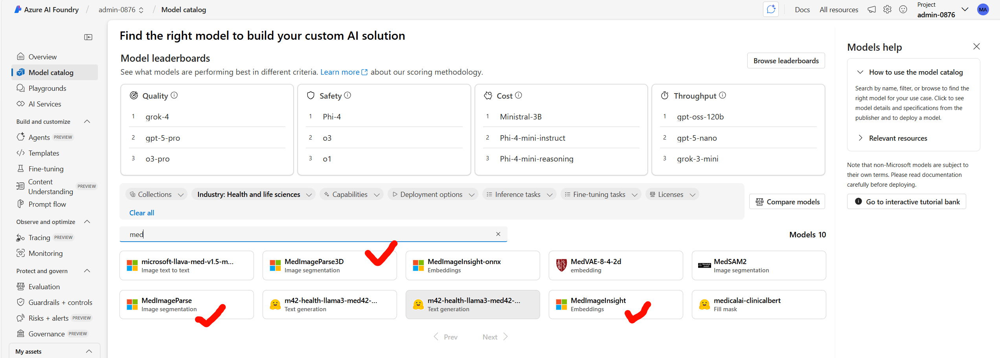
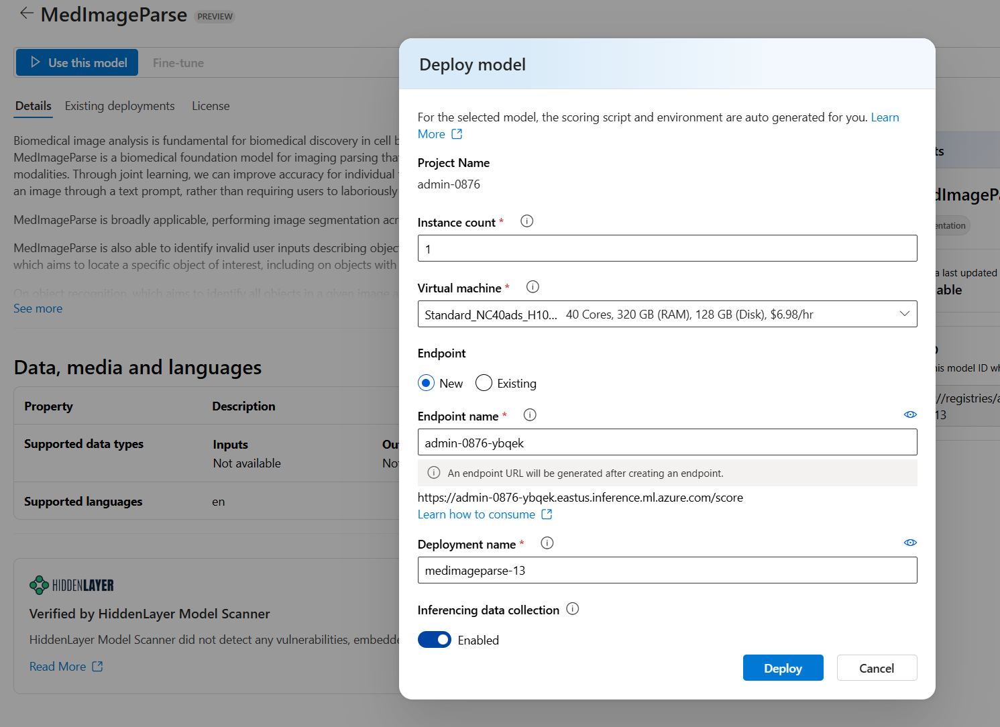
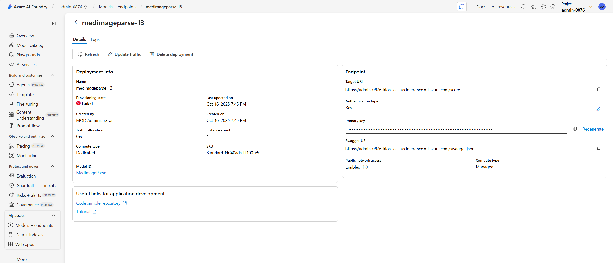
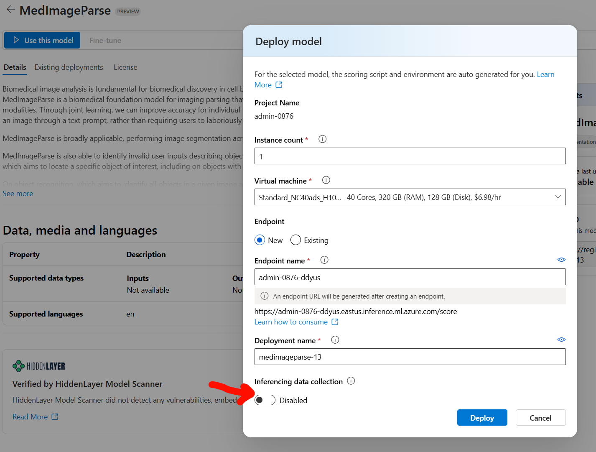
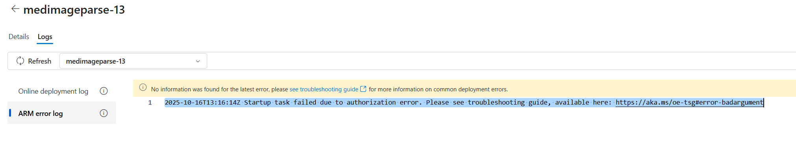

```
Instance status:
SystemSetup: InProgress
UserContainerImagePull: Succeeded
ModelDownload: InProgress
UserContainerStart: Waiting

Container events:
Kind: Pod, Name: DownloadFailed, Type: Warning, Time: 2025-10-16T11:51:39.965418Z, Message: Model download failed, retrying. Please check storage-initializer log for detail.
Kind: Pod, Name: DownloadFailed, Type: Warning, Time: 2025-10-16T11:51:40.972334Z, Message: Model download failed, retrying. Please check storage-initializer log for detail.
Kind: Pod, Name: Downloading, Type: Normal, Time: 2025-10-16T11:51:55.674665Z, Message: Start downloading models
Kind: Pod, Name: DownloadFailed, Type: Warning, Time: 2025-10-16T11:51:57.014118Z, Message: Model download failed, retrying. Please check storage-initializer log for detail.
Kind: Pod, Name: DownloadFailed, Type: Warning, Time: 2025-10-16T11:52:08.66181Z, Message: Model download failed, retrying. Please check storage-initializer log for detail.
Kind: Pod, Name: Downloading, Type: Normal, Time: 2025-10-16T11:52:23.666964Z, Message: Start downloading models
Kind: Pod, Name: DownloadFailed, Type: Warning, Time: 2025-10-16T11:52:24.086833Z, Message: Model download failed, retrying. Please check storage-initializer log for detail.
Kind: Pod, Name: DownloadFailed, Type: Warning, Time: 2025-10-16T11:52:37.663244Z, Message: Model download failed, retrying. Please check storage-initializer log for detail.
Kind: Pod, Name: DownloadFailed, Type: Warning, Time: 2025-10-16T11:52:52.661557Z, Message: Model download failed, retrying. Please check storage-initializer log for detail.
Kind: Pod, Name: Downloading, Type: Normal, Time: 2025-10-16T11:53:04.666523Z, Message: Start downloading models
Kind: Pod, Name: DownloadFailed, Type: Warning, Time: 2025-10-16T11:53:05.15716Z, Message: Model download failed, retrying. Please check storage-initializer log for detail.
Kind: Pod, Name: DownloadFailed, Type: Warning, Time: 2025-10-16T11:53:16.663269Z, Message: Model download failed, retrying. Please check storage-initializer log for detail.
Kind: Pod, Name: DownloadFailed, Type: Warning, Time: 2025-10-16T11:53:31.667373Z, Message: Model download failed, retrying. Please check storage-initializer log for detail.
Kind: Pod, Name: DownloadFailed, Type: Warning, Time: 2025-10-16T11:53:43.662871Z, Message: Model download failed, retrying. Please check storage-initializer log for detail.
Kind: Pod, Name: DownloadFailed, Type: Warning, Time: 2025-10-16T11:53:58.666339Z, Message: Model download failed, retrying. Please check storage-initializer log for detail.
Kind: Pod, Name: DownloadFailed, Type: Warning, Time: 2025-10-16T11:54:13.664741Z, Message: Model download failed, retrying. Please check storage-initializer log for detail.
Kind: Pod, Name: Downloading, Type: Normal, Time: 2025-10-16T11:54:26.674382Z, Message: Start downloading models
Kind: Pod, Name: DownloadFailed, Type: Warning, Time: 2025-10-16T11:54:27.307713Z, Message: Model download failed, retrying. Please check storage-initializer log for detail.
Kind: Pod, Name: DownloadFailed, Type: Warning, Time: 2025-10-16T11:54:39.660723Z, Message: Model download failed, retrying. Please check storage-initializer log for detail.
Kind: Pod, Name: Downloading, Type: Normal, Time: 2025-10-16T11:54:56.813203Z, Message: Start downloading models

Container logs:
+ '[' '!' -S /run/containerd/containerd.sock ']'
+ ./mir-imagefetcher
{"level":"[INFO]","ts":"Oct  16 11:51:37","logger":"VMAgent.ImageFetcher","caller":"imagefetcher/image_fetcher.go:131","msg":"Use environment: AzurePublicCloud"}
{"level":"[INFO]","ts":"Oct  16 11:51:37","logger":"VMAgent.ImageFetcher","caller":"imagefetcher/image_fetcher.go:157","msg":"Parse image name","ImageUrl":"mcr.microsoft.com/azureml/curated/mlflow-model-inference:5","repo":"mcr.microsoft.com/azureml/curated/mlflow-model-inference","tag":"5","digest":""}
{"level":"[INFO]","ts":"Oct  16 11:51:37","logger":"VMAgent.ImageFetcher","caller":"imagefetcher/image_fetcher.go:290","msg":"Start getting image credential","ImageUrl":"mcr.microsoft.com/azureml/curated/mlflow-model-inference:5"}
{"level":"[INFO]","ts":"Oct  16 11:51:37","logger":"VMAgent.ImageFetcher","caller":"imagefetcher/image_fetcher.go:339","msg":"Found image from non-ACR repository","ImageUrl":"mcr.microsoft.com/azureml/curated/mlflow-model-inference:5"}
{"level":"[INFO]","ts":"Oct  16 11:51:37","logger":"VMAgent.ImageFetcher","caller":"imagefetcher/image_fetcher.go:194","msg":"Start pulling image","imageUrl":"mcr.microsoft.com/azureml/curated/mlflow-model-inference:5","imageType":"PublicImage"}
time="2025-10-16T11:51:37Z" level=warning msg="DEPRECATION: The `mirrors` property of `[plugins.\"io.containerd.grpc.v1.cri\".registry]` is deprecated since containerd v1.5 and will be removed in containerd v2.1. Use `config_path` instead."
mcr.microsoft.com/azureml/curated/mlflow-model-inference:5: resolving      |--------------------------------------| 
elapsed: 0.1 s                                              total:   0.0 B (0.0 B/s)                                         
mcr.microsoft.com/azureml/curated/mlflow-model-inference:5:                       resolved       |++++++++++++++++++++++++++++++++++++++| 
manifest-sha256:8de64a91f286ab07d8ddac53914d74ec83ddc6f1c30febe105c23f145c7f7c5d: done           |++++++++++++++++++++++++++++++++++++++| 
layer-sha256:3964b93183234f2619dc7a4a532d67172450cb17d84ee1c99310679031594536:    downloading    |--------------------------------------|    0.0 B/317.3 MiB 
layer-sha256:4dcab7cb62f186a0435f54e697090f200f3a07f3ea3bd323b22a9f4c6ec2fa1c:    downloading    |--------------------------------------|    0.0 B/120.0 B   
layer-sha256:c9872bed9bd7e5ccf1e74c37e2aa52ff54c67a91600ae1381549a2bd96463bad:    downloading    |--------------------------------------|    0.0 B/113.0 B   
layer-sha256:e73fe809a4771715ab40837370d4c48bd30b9adf47a394fb449f474722af1e80:    downloading    |--------------------------------------|    0.0 B/351.0 B   
layer-sha256:9c001c8d01c6f07bb432ff8fc9ca716b9da120518f2d412d7297140d25781741:    downloading    |--------------------------------------|    0.0 B/116.0 B   
layer-sha256:bd070c6e34e29397aa31ed12ccb8912c7013d0306fbffefbab6e9667b3842d59:    downloading    |--------------------------------------|    0.0 B/328.0 B   
layer-sha256:1c025d68016021bb3cfcb10f6c6746da87301d4433ab17244b98f0d6f7cab790:    downloading    |--------------------------------------|    0.0 B/410.0 B   
layer-sha256:2e6415c9cf053b1c88d8e9b999de3adad1ced3208d04c52e270430046152f69f:    downloading    |--------------------------------------|    0.0 B/1.1 KiB   
config-sha256:d9217ebf87a638cd7d33c4e9328def050e149f72e52ae2ea15205d6da41fcbbd:   downloading    |--------------------------------------|    0.0 B/14.1 KiB  
layer-sha256:4e368335348a011e9b5b45bf6f7048b5defa89d69020873881791dee6e18a8ce:    downloading    |--------------------------------------|    0.0 B/3.5 KiB   
layer-sha256:d839d4ca69dd7a65d037c7e5b7f6222a05cd12eed9523d78e7537236bcc7c8c5:    downloading    |--------------------------------------|    0.0 B/1.8 KiB   
layer-sha256:0c0e6dd46b7522ccbb9b6cf617b69777ab5a6a76619cf85953d5a5db9eb99a38:    downloading    |--------------------------------------|    0.0 B/68.5 KiB  
layer-sha256:328111530da44df34802d282777fbd29750177094a0d03a02f083624ad57c88f:    downloading    |--------------------------------------|    0.0 B/124.0 B   
layer-sha256:f557aa5ee22480ee9e1af0a094ce5174a8c3d83e1aa20dc8482e4e387546e0c3:    downloading    |--------------------------------------|    0.0 B/29.0 MiB  
layer-sha256:5c116e86305fab321df90380f4681f33d2270328c266729d9acace0fc5b56a98:    downloading    |--------------------------------------|    0.0 B/240.0 B   
layer-sha256:83ddd140e16f9ad85db8552d6d178e1f77f3682cfd8ba0169e07c7b028ecacc4:    downloading    |--------------------------------------|    0.0 B/2.1 KiB   
layer-sha256:07cdcae07463e7000e283cc01fbe2988a13fd4e872e8e10d86542e3dbca0afa6:    downloading    |--------------------------------------|    0.0 B/2.5 KiB   
layer-sha256:4d172f7443fd887364d44987a4fe8041b9f940da9039cac1257afac00d157984:    downloading    |--------------------------------------|    0.0 B/3.8 KiB   
layer-sha256:6bf45bb5405f446d004f4deb5bda7df7a55bb4b253942248f6dd1a4e6034ecda:    downloading    |--------------------------------------|    0.0 B/133.2 MiB 
layer-sha256:d5615febc45253268a9bbde65d830ed47c21d2770a63180243205a2124320175:    downloading    |--------------------------------------|    0.0 B/251.0 B   
layer-sha256:2988b56f02c5fd9a89712ccefd9f81daf5056c301184e2b253a14a9bab18d41e:    downloading    |--------------------------------------|    0.0 B/240.0 B   
layer-sha256:2bee497efa35d5eb9a8c55f5c8e851017c4b2c2b4110df7212fd8498681cfb73:    waiting        |--------------------------------------| 
layer-sha256:916209d9278bf2aa62e711f857b1b7e35476e286ba7ba5087242935ac6899b42:    waiting        |--------------------------------------| 
layer-sha256:21374ebc1d1cd607e3def114844d11d762bc92aa1591047255b3c9da72833d69:    downloading    |--------------------------------------|    0.0 B/2.5 KiB 
layer-sha256:787355c2161e9c3dad93ad1331d1de8468052f84d9e6d97eec8bbb59f5211fbd:    waiting        |--------------------------------------| 
layer-sha256:892bf667282ca131a6b9fe1f42b38398b70c3c241e1d81b727e4cafd061254c0:    downloading    |--------------------------------------|    0.0 B/329.0 B 
layer-sha256:233ec8e591fa9bb7f75c6878388a19b4a9a06518dedc8ed82b707b489ab5367b:    waiting        |--------------------------------------| 
layer-sha256:8c6019330245c5617bc23ce74d05d738482b612f5e5aad13bc5fab281e7d01e6:    waiting        |--------------------------------------| 
layer-sha256:fd8eb69f5f47b44e2841e657869754a792dff9b2dd36aa311ae03630d1315fff:    waiting        |--------------------------------------| 
layer-sha256:92bfb89f60d1f5bd0b2cb45cb70332a4db4ae80b936e09164086a1746c6271f4:    waiting        |--------------------------------------| 
elapsed: 0.2 s                                                                    total:  6.2 Ki (30.6 KiB/s)                                      
mcr.microsoft.com/azureml/curated/mlflow-model-inference:5:                       resolved       |++++++++++++++++++++++++++++++++++++++| 
manifest-sha256:8de64a91f286ab07d8ddac53914d74ec83ddc6f1c30febe105c23f145c7f7c5d: done           |++++++++++++++++++++++++++++++++++++++| 
layer-sha256:3964b93183234f2619dc7a4a532d67172450cb17d84ee1c99310679031594536:    downloading    |--------------------------------------|    0.0 B/317.3 MiB 
layer-sha256:4dcab7cb62f186a0435f54e697090f200f3a07f3ea3bd323b22a9f4c6ec2fa1c:    done           |++++++++++++++++++++++++++++++++++++++| 
layer-sha256:c9872bed9bd7e5ccf1e74c37e2aa52ff54c67a91600ae1381549a2bd96463bad:    done           |++++++++++++++++++++++++++++++++++++++| 
layer-sha256:e73fe809a4771715ab40837370d4c48bd30b9adf47a394fb449f474722af1e80:    done           |++++++++++++++++++++++++++++++++++++++| 
layer-sha256:9c001c8d01c6f07bb432ff8fc9ca716b9da120518f2d412d7297140d25781741:    downloading    |--------------------------------------|    0.0 B/116.0 B   
layer-sha256:bd070c6e34e29397aa31ed12ccb8912c7013d0306fbffefbab6e9667b3842d59:    downloading    |--------------------------------------|    0.0 B/328.0 B   
layer-sha256:1c025d68016021bb3cfcb10f6c6746da87301d4433ab17244b98f0d6f7cab790:    downloading    |--------------------------------------|    0.0 B/410.0 B   
layer-sha256:2e6415c9cf053b1c88d8e9b999de3adad1ced3208d04c52e270430046152f69f:    downloading    |--------------------------------------|    0.0 B/1.1 KiB   
config-sha256:d9217ebf87a638cd7d33c4e9328def050e149f72e52ae2ea15205d6da41fcbbd:   downloading    |--------------------------------------|    0.0 B/14.1 KiB  
layer-sha256:4e368335348a011e9b5b45bf6f7048b5defa89d69020873881791dee6e18a8ce:    downloading    |--------------------------------------|    0.0 B/3.5 KiB   
layer-sha256:d839d4ca69dd7a65d037c7e5b7f6222a05cd12eed9523d78e7537236bcc7c8c5:    downloading    |--------------------------------------|    0.0 B/1.8 KiB   
layer-sha256:0c0e6dd46b7522ccbb9b6cf617b69777ab5a6a76619cf85953d5a5db9eb99a38:    downloading    |--------------------------------------|    0.0 B/68.5 KiB  
layer-sha256:328111530da44df34802d282777fbd29750177094a0d03a02f083624ad57c88f:    downloading    |--------------------------------------|    0.0 B/124.0 B   
layer-sha256:f557aa5ee22480ee9e1af0a094ce5174a8c3d83e1aa20dc8482e4e387546e0c3:    downloading    |--------------------------------------|    0.0 B/29.0 MiB  
layer-sha256:5c116e86305fab321df90380f4681f33d2270328c266729d9acace0fc5b56a98:    downloading    |--------------------------------------|    0.0 B/240.0 B   
layer-sha256:83ddd140e16f9ad85db8552d6d178e1f77f3682cfd8ba0169e07c7b028ecacc4:    downloading    |--------------------------------------|    0.0 B/2.1 KiB   
layer-sha256:07cdcae07463e7000e283cc01fbe2988a13fd4e872e8e10d86542e3dbca0afa6:    downloading    |--------------------------------------|    0.0 B/2.5 KiB   
layer-sha256:4d172f7443fd887364d44987a4fe8041b9f940da9039cac1257afac00d157984:    downloading    |--------------------------------------|    0.0 B/3.8 KiB   
layer-sha256:6bf45bb5405f446d004f4deb5bda7df7a55bb4b253942248f6dd1a4e6034ecda:    downloading    |--------------------------------------|    0.0 B/133.2 MiB 
layer-sha256:d5615febc45253268a9bbde65d830ed47c21d2770a63180243205a2124320175:    downloading    |--------------------------------------|    0.0 B/251.0 B   
layer-sha256:2988b56f02c5fd9a89712ccefd9f81daf5056c301184e2b253a14a9bab18d41e:    downloading    |--------------------------------------|    0.0 B/240.0 B   
layer-sha256:2bee497efa35d5eb9a8c55f5c8e851017c4b2c2b4110df7212fd8498681cfb73:    downloading    |--------------------------------------|    0.0 B/1.3 KiB   
layer-sha256:916209d9278bf2aa62e711f857b1b7e35476e286ba7ba5087242935ac6899b42:    downloading    |--------------------------------------|    0.0 B/500.0 B   
layer-sha256:21374ebc1d1cd607e3def114844d11d762bc92aa1591047255b3c9da72833d69:    downloading    |--------------------------------------|    0.0 B/2.5 KiB   
layer-sha256:787355c2161e9c3dad93ad1331d1de8468052f84d9e6d97eec8bbb59f5211fbd:    downloading    |--------------------------------------|    0.0 B/119.8 MiB 
layer-sha256:892bf667282ca131a6b9fe1f42b38398b70c3c241e1d81b727e4cafd061254c0:    downloading    |--------------------------------------|    0.0 B/329.0 B   
layer-sha256:233ec8e591fa9bb7f75c6878388a19b4a9a06518dedc8ed82b707b489ab5367b:    downloading    |--------------------------------------|    0.0 B/210.0 B   
layer-sha256:8c6019330245c5617bc23ce74d05d738482b612f5e5aad13bc5fab281e7d01e6:    downloading    |--------------------------------------|    0.0 B/6.4 KiB   
layer-sha256:fd8eb69f5f47b44e2841e657869754a792dff9b2dd36aa311ae03630d1315fff:    downloading    |--------------------------------------|    0.0 B/8.0 KiB   
layer-sha256:92bfb89f60d1f5bd0b2cb45cb70332a4db4ae80b936e09164086a1746c6271f4:    downloading    |--------------------------------------|    0.0 B/341.0 B   
elapsed: 0.3 s                                                                    total:  6.8 Ki (22.4 KiB/s)                                      
mcr.microsoft.com/azureml/curated/mlflow-model-inference:5:                       resolved       |++++++++++++++++++++++++++++++++++++++| 
manifest-sha256:8de64a91f286ab07d8ddac53914d74ec83ddc6f1c30febe105c23f145c7f7c5d: done           |++++++++++++++++++++++++++++++++++++++| 
layer-sha256:3964b93183234f2619dc7a4a532d67172450cb17d84ee1c99310679031594536:    downloading    |--------------------------------------|  8.0 MiB/317.3 MiB 
layer-sha256:4dcab7cb62f186a0435f54e697090f200f3a07f3ea3bd323b22a9f4c6ec2fa1c:    done           |++++++++++++++++++++++++++++++++++++++| 
layer-sha256:c9872bed9bd7e5ccf1e74c37e2aa52ff54c67a91600ae1381549a2bd96463bad:    done           |++++++++++++++++++++++++++++++++++++++| 
layer-sha256:e73fe809a4771715ab40837370d4c48bd30b9adf47a394fb449f474722af1e80:    done           |++++++++++++++++++++++++++++++++++++++| 
layer-sha256:9c001c8d01c6f07bb432ff8fc9ca716b9da120518f2d412d7297140d25781741:    downloading    |--------------------------------------|    0.0 B/116.0 B 
layer-sha256:bd070c6e34e29397aa31ed12ccb8912c7013d0306fbffefbab6e9667b3842d59:    done           |++++++++++++++++++++++++++++++++++++++| 
layer-sha256:1c025d68016021bb3cfcb10f6c6746da87301d4433ab17244b98f0d6f7cab790:    done           |++++++++++++++++++++++++++++++++++++++| 
layer-sha256:2e6415c9cf053b1c88d8e9b999de3adad1ced3208d04c52e270430046152f69f:    done           |++++++++++++++++++++++++++++++++++++++| 
config-sha256:d9217ebf87a638cd7d33c4e9328def050e149f72e52ae2ea15205d6da41fcbbd:   done           |++++++++++++++++++++++++++++++++++++++| 
layer-sha256:4e368335348a011e9b5b45bf6f7048b5defa89d69020873881791dee6e18a8ce:    done           |++++++++++++++++++++++++++++++++++++++| 
layer-sha256:d839d4ca69dd7a65d037c7e5b7f6222a05cd12eed9523d78e7537236bcc7c8c5:    done           |++++++++++++++++++++++++++++++++++++++| 
layer-sha256:0c0e6dd46b7522ccbb9b6cf617b69777ab5a6a76619cf85953d5a5db9eb99a38:    done           |++++++++++++++++++++++++++++++++++++++| 
layer-sha256:328111530da44df34802d282777fbd29750177094a0d03a02f083624ad57c88f:    done           |++++++++++++++++++++++++++++++++++++++| 
layer-sha256:f557aa5ee22480ee9e1af0a094ce5174a8c3d83e1aa20dc8482e4e387546e0c3:    downloading    |--------------------------------------|    0.0 B/29.0 MiB 
layer-sha256:5c116e86305fab321df90380f4681f33d2270328c266729d9acace0fc5b56a98:    done           |++++++++++++++++++++++++++++++++++++++| 
layer-sha256:83ddd140e16f9ad85db8552d6d178e1f77f3682cfd8ba0169e07c7b028ecacc4:    downloading    |--------------------------------------|    0.0 B/2.1 KiB 
layer-sha256:07cdcae07463e7000e283cc01fbe2988a13fd4e872e8e10d86542e3dbca0afa6:    done           |++++++++++++++++++++++++++++++++++++++| 
layer-sha256:4d172f7443fd887364d44987a4fe8041b9f940da9039cac1257afac00d157984:    done           |++++++++++++++++++++++++++++++++++++++| 
layer-sha256:6bf45bb5405f446d004f4deb5bda7df7a55bb4b253942248f6dd1a4e6034ecda:    downloading    |++------------------------------------| 10.0 MiB/133.2 MiB 
layer-sha256:d5615febc45253268a9bbde65d830ed47c21d2770a63180243205a2124320175:    done           |++++++++++++++++++++++++++++++++++++++| 
layer-sha256:2988b56f02c5fd9a89712ccefd9f81daf5056c301184e2b253a14a9bab18d41e:    done           |++++++++++++++++++++++++++++++++++++++| 
layer-sha256:2bee497efa35d5eb9a8c55f5c8e851017c4b2c2b4110df7212fd8498681cfb73:    done           |++++++++++++++++++++++++++++++++++++++| 
layer-sha256:916209d9278bf2aa62e711f857b1b7e35476e286ba7ba5087242935ac6899b42:    done           |++++++++++++++++++++++++++++++++++++++| 
layer-sha256:21374ebc1d1cd607e3def114844d11d762bc92aa1591047255b3c9da72833d69:    done           |++++++++++++++++++++++++++++++++++++++| 
layer-sha256:787355c2161e9c3dad93ad1331d1de8468052f84d9e6d97eec8bbb59f5211fbd:    downloading    |++++----------------------------------| 15.0 MiB/119.8 MiB 
layer-sha256:892bf667282ca131a6b9fe1f42b38398b70c3c241e1d81b727e4cafd061254c0:    done           |++++++++++++++++++++++++++++++++++++++| 
layer-sha256:233ec8e591fa9bb7f75c6878388a19b4a9a06518dedc8ed82b707b489ab5367b:    done           |++++++++++++++++++++++++++++++++++++++| 
layer-sha256:8c6019330245c5617bc23ce74d05d738482b612f5e5aad13bc5fab281e7d01e6:    done           |++++++++++++++++++++++++++++++++++++++| 
layer-sha256:fd8eb69f5f47b44e2841e657869754a792dff9b2dd36aa311ae03630d1315fff:    done           |++++++++++++++++++++++++++++++++++++++| 
layer-sha256:92bfb89f60d1f5bd0b2cb45cb70332a4db4ae80b936e09164086a1746c6271f4:    done           |++++++++++++++++++++++++++++++++++++++| 
elapsed: 0.4 s                                                                    total:  33.1 M (81.9 MiB/s)                                      
mcr.microsoft.com/azureml/curated/mlflow-model-inference:5:                       resolved       |++++++++++++++++++++++++++++++++++++++| 
manifest-sha256:8de64a91f286ab07d8ddac53914d74ec83ddc6f1c30febe105c23f145c7f7c5d: done           |++++++++++++++++++++++++++++++++++++++| 
layer-sha256:3964b93183234f2619dc7a4a532d67172450cb17d84ee1c99310679031594536:    downloading    |+-------------------------------------| 16.0 MiB/317.3 MiB 
layer-sha256:4dcab7cb62f186a0435f54e697090f200f3a07f3ea3bd323b22a9f4c6ec2fa1c:    done           |++++++++++++++++++++++++++++++++++++++| 
layer-sha256:c9872bed9bd7e5ccf1e74c37e2aa52ff54c67a91600ae1381549a2bd96463bad:    done           |++++++++++++++++++++++++++++++++++++++| 
layer-sha256:e73fe809a4771715ab40837370d4c48bd30b9adf47a394fb449f474722af1e80:    done           |++++++++++++++++++++++++++++++++++++++| 
layer-sha256:9c001c8d01c6f07bb432ff8fc9ca716b9da120518f2d412d7297140d25781741:    done           |++++++++++++++++++++++++++++++++++++++| 
layer-sha256:bd070c6e34e29397aa31ed12ccb8912c7013d0306fbffefbab6e9667b3842d59:    done           |++++++++++++++++++++++++++++++++++++++| 
layer-sha256:1c025d68016021bb3cfcb10f6c6746da87301d4433ab17244b98f0d6f7cab790:    done           |++++++++++++++++++++++++++++++++++++++| 
layer-sha256:2e6415c9cf053b1c88d8e9b999de3adad1ced3208d04c52e270430046152f69f:    done           |++++++++++++++++++++++++++++++++++++++| 
config-sha256:d9217ebf87a638cd7d33c4e9328def050e149f72e52ae2ea15205d6da41fcbbd:   done           |++++++++++++++++++++++++++++++++++++++| 
layer-sha256:4e368335348a011e9b5b45bf6f7048b5defa89d69020873881791dee6e18a8ce:    done           |++++++++++++++++++++++++++++++++++++++| 
layer-sha256:d839d4ca69dd7a65d037c7e5b7f6222a05cd12eed9523d78e7537236bcc7c8c5:    done           |++++++++++++++++++++++++++++++++++++++| 
layer-sha256:0c0e6dd46b7522ccbb9b6cf617b69777ab5a6a76619cf85953d5a5db9eb99a38:    done           |++++++++++++++++++++++++++++++++++++++| 
layer-sha256:328111530da44df34802d282777fbd29750177094a0d03a02f083624ad57c88f:    done           |++++++++++++++++++++++++++++++++++++++| 
layer-sha256:f557aa5ee22480ee9e1af0a094ce5174a8c3d83e1aa20dc8482e4e387546e0c3:    downloading    |++------------------------------------|  2.0 MiB/29.0 MiB 
layer-sha256:5c116e86305fab321df90380f4681f33d2270328c266729d9acace0fc5b56a98:    done           |++++++++++++++++++++++++++++++++++++++| 
layer-sha256:83ddd140e16f9ad85db8552d6d178e1f77f3682cfd8ba0169e07c7b028ecacc4:    downloading    |--------------------------------------|    0.0 B/2.1 KiB 
layer-sha256:07cdcae07463e7000e283cc01fbe2988a13fd4e872e8e10d86542e3dbca0afa6:    done           |++++++++++++++++++++++++++++++++++++++| 
layer-sha256:4d172f7443fd887364d44987a4fe8041b9f940da9039cac1257afac00d157984:    done           |++++++++++++++++++++++++++++++++++++++| 
layer-sha256:6bf45bb5405f446d004f4deb5bda7df7a55bb4b253942248f6dd1a4e6034ecda:    downloading    |+++++++-------------------------------| 26.0 MiB/133.2 MiB 
layer-sha256:d5615febc45253268a9bbde65d830ed47c21d2770a63180243205a2124320175:    done           |++++++++++++++++++++++++++++++++++++++| 
layer-sha256:2988b56f02c5fd9a89712ccefd9f81daf5056c301184e2b253a14a9bab18d41e:    done           |++++++++++++++++++++++++++++++++++++++| 
layer-sha256:2bee497efa35d5eb9a8c55f5c8e851017c4b2c2b4110df7212fd8498681cfb73:    done           |++++++++++++++++++++++++++++++++++++++| 
layer-sha256:916209d9278bf2aa62e711f857b1b7e35476e286ba7ba5087242935ac6899b42:    done           |++++++++++++++++++++++++++++++++++++++| 
layer-sha256:21374ebc1d1cd607e3def114844d11d762bc92aa1591047255b3c9da72833d69:    done           |++++++++++++++++++++++++++++++++++++++| 
layer-sha256:787355c2161e9c3dad93ad1331d1de8468052f84d9e6d97eec8bbb59f5211fbd:    downloading    |+++++---------------------------------| 16.0 MiB/119.8 MiB 
layer-sha256:892bf667282ca131a6b9fe1f42b38398b70c3c241e1d81b727e4cafd061254c0:    done           |++++++++++++++++++++++++++++++++++++++| 
layer-sha256:233ec8e591fa9bb7f75c6878388a19b4a9a06518dedc8ed82b707b489ab5367b:    done           |++++++++++++++++++++++++++++++++++++++| 
layer-sha256:8c6019330245c5617bc23ce74d05d738482b612f5e5aad13bc5fab281e7d01e6:    done           |++++++++++++++++++++++++++++++++++++++| 
layer-sha256:fd8eb69f5f47b44e2841e657869754a792dff9b2dd36aa311ae03630d1315fff:    done           |++++++++++++++++++++++++++++++++++++++| 
layer-sha256:92bfb89f60d1f5bd0b2cb45cb70332a4db4ae80b936e09164086a1746c6271f4:    done           |++++++++++++++++++++++++++++++++++++++| 
elapsed: 0.5 s                                                                    total:  60.1 M (119.8 MiB/s)                                     
mcr.microsoft.com/azureml/curated/mlflow-model-inference:5:                       resolved       |++++++++++++++++++++++++++++++++++++++| 
manifest-sha256:8de64a91f286ab07d8ddac53914d74ec83ddc6f1c30febe105c23f145c7f7c5d: done           |++++++++++++++++++++++++++++++++++++++| 
layer-sha256:3964b93183234f2619dc7a4a532d67172450cb17d84ee1c99310679031594536:    downloading    |++------------------------------------| 23.0 MiB/317.3 MiB 
layer-sha256:4dcab7cb62f186a0435f54e697090f200f3a07f3ea3bd323b22a9f4c6ec2fa1c:    done           |++++++++++++++++++++++++++++++++++++++| 
layer-sha256:c9872bed9bd7e5ccf1e74c37e2aa52ff54c67a91600ae1381549a2bd96463bad:    done           |++++++++++++++++++++++++++++++++++++++| 
layer-sha256:e73fe809a4771715ab40837370d4c48bd30b9adf47a394fb449f474722af1e80:    done           |++++++++++++++++++++++++++++++++++++++| 
layer-sha256:9c001c8d01c6f07bb432ff8fc9ca716b9da120518f2d412d7297140d25781741:    done           |++++++++++++++++++++++++++++++++++++++| 
layer-sha256:bd070c6e34e29397aa31ed12ccb8912c7013d0306fbffefbab6e9667b3842d59:    done           |++++++++++++++++++++++++++++++++++++++| 
layer-sha256:1c025d68016021bb3cfcb10f6c6746da87301d4433ab17244b98f0d6f7cab790:    done           |++++++++++++++++++++++++++++++++++++++| 
layer-sha256:2e6415c9cf053b1c88d8e9b999de3adad1ced3208d04c52e270430046152f69f:    done           |++++++++++++++++++++++++++++++++++++++| 
config-sha256:d9217ebf87a638cd7d33c4e9328def050e149f72e52ae2ea15205d6da41fcbbd:   done           |++++++++++++++++++++++++++++++++++++++| 
layer-sha256:4e368335348a011e9b5b45bf6f7048b5defa89d69020873881791dee6e18a8ce:    done           |++++++++++++++++++++++++++++++++++++++| 
layer-sha256:d839d4ca69dd7a65d037c7e5b7f6222a05cd12eed9523d78e7537236bcc7c8c5:    done           |++++++++++++++++++++++++++++++++++++++| 
layer-sha256:0c0e6dd46b7522ccbb9b6cf617b69777ab5a6a76619cf85953d5a5db9eb99a38:    done           |++++++++++++++++++++++++++++++++++++++| 
layer-sha256:328111530da44df34802d282777fbd29750177094a0d03a02f083624ad57c88f:    done           |++++++++++++++++++++++++++++++++++++++| 
layer-sha256:f557aa5ee22480ee9e1af0a094ce5174a8c3d83e1aa20dc8482e4e387546e0c3:    downloading    |++++++++++++++++++++++++++++----------| 22.0 MiB/29.0 MiB 
layer-sha256:5c116e86305fab321df90380f4681f33d2270328c266729d9acace0fc5b56a98:    done           |++++++++++++++++++++++++++++++++++++++| 
layer-sha256:83ddd140e16f9ad85db8552d6d178e1f77f3682cfd8ba0169e07c7b028ecacc4:    downloading    |--------------------------------------|    0.0 B/2.1 KiB 
layer-sha256:07cdcae07463e7000e283cc01fbe2988a13fd4e872e8e10d86542e3dbca0afa6:    done           |++++++++++++++++++++++++++++++++++++++| 
layer-sha256:4d172f7443fd887364d44987a4fe8041b9f940da9039cac1257afac00d157984:    done           |++++++++++++++++++++++++++++++++++++++| 
layer-sha256:6bf45bb5405f446d004f4deb5bda7df7a55bb4b253942248f6dd1a4e6034ecda:    downloading    |+++++++++++---------------------------| 40.0 MiB/133.2 MiB 
layer-sha256:d5615febc45253268a9bbde65d830ed47c21d2770a63180243205a2124320175:    done           |++++++++++++++++++++++++++++++++++++++| 
layer-sha256:2988b56f02c5fd9a89712ccefd9f81daf5056c301184e2b253a14a9bab18d41e:    done           |++++++++++++++++++++++++++++++++++++++| 
layer-sha256:2bee497efa35d5eb9a8c55f5c8e851017c4b2c2b4110df7212fd8498681cfb73:    done           |++++++++++++++++++++++++++++++++++++++| 
layer-sha256:916209d9278bf2aa62e711f857b1b7e35476e286ba7ba5087242935ac6899b42:    done           |++++++++++++++++++++++++++++++++++++++| 
layer-sha256:21374ebc1d1cd607e3def114844d11d762bc92aa1591047255b3c9da72833d69:    done           |++++++++++++++++++++++++++++++++++++++| 
layer-sha256:787355c2161e9c3dad93ad1331d1de8468052f84d9e6d97eec8bbb59f5211fbd:    downloading    |++++++++++----------------------------| 32.0 MiB/119.8 MiB 
layer-sha256:892bf667282ca131a6b9fe1f42b38398b70c3c241e1d81b727e4cafd061254c0:    done           |++++++++++++++++++++++++++++++++++++++| 
layer-sha256:233ec8e591fa9bb7f75c6878388a19b4a9a06518dedc8ed82b707b489ab5367b:    done           |++++++++++++++++++++++++++++++++++++++| 
layer-sha256:8c6019330245c5617bc23ce74d05d738482b612f5e5aad13bc5fab281e7d01e6:    done           |++++++++++++++++++++++++++++++++++++++| 
layer-sha256:fd8eb69f5f47b44e2841e657869754a792dff9b2dd36aa311ae03630d1315fff:    done           |++++++++++++++++++++++++++++++++++++++| 
layer-sha256:92bfb89f60d1f5bd0b2cb45cb70332a4db4ae80b936e09164086a1746c6271f4:    done           |++++++++++++++++++++++++++++++++++++++| 
elapsed: 0.6 s                                                                    total:  117.1  (194.7 MiB/s)                                     
mcr.microsoft.com/azureml/curated/mlflow-model-inference:5:                       resolved       |++++++++++++++++++++++++++++++++++++++| 
manifest-sha256:8de64a91f286ab07d8ddac53914d74ec83ddc6f1c30febe105c23f145c7f7c5d: done           |++++++++++++++++++++++++++++++++++++++| 
layer-sha256:3964b93183234f2619dc7a4a532d67172450cb17d84ee1c99310679031594536:    downloading    |+++-----------------------------------| 32.0 MiB/317.3 MiB 
layer-sha256:4dcab7cb62f186a0435f54e697090f200f3a07f3ea3bd323b22a9f4c6ec2fa1c:    done           |++++++++++++++++++++++++++++++++++++++| 
layer-sha256:c9872bed9bd7e5ccf1e74c37e2aa52ff54c67a91600ae1381549a2bd96463bad:    done           |++++++++++++++++++++++++++++++++++++++| 
layer-sha256:e73fe809a4771715ab40837370d4c48bd30b9adf47a394fb449f474722af1e80:    done           |++++++++++++++++++++++++++++++++++++++| 
layer-sha256:9c001c8d01c6f07bb432ff8fc9ca716b9da120518f2d412d7297140d25781741:    done           |++++++++++++++++++++++++++++++++++++++| 
layer-sha256:bd070c6e34e29397aa31ed12ccb8912c7013d0306fbffefbab6e9667b3842d59:    done           |++++++++++++++++++++++++++++++++++++++| 
layer-sha256:1c025d68016021bb3cfcb10f6c6746da87301d4433ab17244b98f0d6f7cab790:    done           |++++++++++++++++++++++++++++++++++++++| 
layer-sha256:2e6415c9cf053b1c88d8e9b999de3adad1ced3208d04c52e270430046152f69f:    done           |++++++++++++++++++++++++++++++++++++++| 
config-sha256:d9217ebf87a638cd7d33c4e9328def050e149f72e52ae2ea15205d6da41fcbbd:   done           |++++++++++++++++++++++++++++++++++++++| 
layer-sha256:4e368335348a011e9b5b45bf6f7048b5defa89d69020873881791dee6e18a8ce:    done           |++++++++++++++++++++++++++++++++++++++| 
layer-sha256:d839d4ca69dd7a65d037c7e5b7f6222a05cd12eed9523d78e7537236bcc7c8c5:    done           |++++++++++++++++++++++++++++++++++++++| 
layer-sha256:0c0e6dd46b7522ccbb9b6cf617b69777ab5a6a76619cf85953d5a5db9eb99a38:    done           |++++++++++++++++++++++++++++++++++++++| 
layer-sha256:328111530da44df34802d282777fbd29750177094a0d03a02f083624ad57c88f:    done           |++++++++++++++++++++++++++++++++++++++| 
layer-sha256:f557aa5ee22480ee9e1af0a094ce5174a8c3d83e1aa20dc8482e4e387546e0c3:    done           |++++++++++++++++++++++++++++++++++++++| 
layer-sha256:5c116e86305fab321df90380f4681f33d2270328c266729d9acace0fc5b56a98:    done           |++++++++++++++++++++++++++++++++++++++| 
layer-sha256:83ddd140e16f9ad85db8552d6d178e1f77f3682cfd8ba0169e07c7b028ecacc4:    downloading    |--------------------------------------|    0.0 B/2.1 KiB 
layer-sha256:07cdcae07463e7000e283cc01fbe2988a13fd4e872e8e10d86542e3dbca0afa6:    done           |++++++++++++++++++++++++++++++++++++++| 
layer-sha256:4d172f7443fd887364d44987a4fe8041b9f940da9039cac1257afac00d157984:    done           |++++++++++++++++++++++++++++++++++++++| 
layer-sha256:6bf45bb5405f446d004f4deb5bda7df7a55bb4b253942248f6dd1a4e6034ecda:    downloading    |++++++++++++++------------------------| 51.0 MiB/133.2 MiB 
layer-sha256:d5615febc45253268a9bbde65d830ed47c21d2770a63180243205a2124320175:    done           |++++++++++++++++++++++++++++++++++++++| 
layer-sha256:2988b56f02c5fd9a89712ccefd9f81daf5056c301184e2b253a14a9bab18d41e:    done           |++++++++++++++++++++++++++++++++++++++| 
layer-sha256:2bee497efa35d5eb9a8c55f5c8e851017c4b2c2b4110df7212fd8498681cfb73:    done           |++++++++++++++++++++++++++++++++++++++| 
layer-sha256:916209d9278bf2aa62e711f857b1b7e35476e286ba7ba5087242935ac6899b42:    done           |++++++++++++++++++++++++++++++++++++++| 
layer-sha256:21374ebc1d1cd607e3def114844d11d762bc92aa1591047255b3c9da72833d69:    done           |++++++++++++++++++++++++++++++++++++++| 
layer-sha256:787355c2161e9c3dad93ad1331d1de8468052f84d9e6d97eec8bbb59f5211fbd:    downloading    |++++++++++++--------------------------| 40.0 MiB/119.8 MiB 
layer-sha256:892bf667282ca131a6b9fe1f42b38398b70c3c241e1d81b727e4cafd061254c0:    done           |++++++++++++++++++++++++++++++++++++++| 
layer-sha256:233ec8e591fa9bb7f75c6878388a19b4a9a06518dedc8ed82b707b489ab5367b:    done           |++++++++++++++++++++++++++++++++++++++| 
layer-sha256:8c6019330245c5617bc23ce74d05d738482b612f5e5aad13bc5fab281e7d01e6:    done           |++++++++++++++++++++++++++++++++++++++| 
layer-sha256:fd8eb69f5f47b44e2841e657869754a792dff9b2dd36aa311ae03630d1315fff:    done           |++++++++++++++++++++++++++++++++++++++| 
layer-sha256:92bfb89f60d1f5bd0b2cb45cb70332a4db4ae80b936e09164086a1746c6271f4:    done           |++++++++++++++++++++++++++++++++++++++| 
elapsed: 0.7 s                                                                    total:  152.1  (217.0 MiB/s)                                     
mcr.microsoft.com/azureml/curated/mlflow-model-inference:5:                       resolved       |++++++++++++++++++++++++++++++++++++++| 
manifest-sha256:8de64a91f286ab07d8ddac53914d74ec83ddc6f1c30febe105c23f145c7f7c5d: done           |++++++++++++++++++++++++++++++++++++++| 
layer-sha256:3964b93183234f2619dc7a4a532d67172450cb17d84ee1c99310679031594536:    downloading    |+++++---------------------------------| 48.0 MiB/317.3 MiB 
layer-sha256:4dcab7cb62f186a0435f54e697090f200f3a07f3ea3bd323b22a9f4c6ec2fa1c:    done           |++++++++++++++++++++++++++++++++++++++| 
layer-sha256:c9872bed9bd7e5ccf1e74c37e2aa52ff54c67a91600ae1381549a2bd96463bad:    done           |++++++++++++++++++++++++++++++++++++++| 
layer-sha256:e73fe809a4771715ab40837370d4c48bd30b9adf47a394fb449f474722af1e80:    done           |++++++++++++++++++++++++++++++++++++++| 
layer-sha256:9c001c8d01c6f07bb432ff8fc9ca716b9da120518f2d412d7297140d25781741:    done           |++++++++++++++++++++++++++++++++++++++| 
layer-sha256:bd070c6e34e29397aa31ed12ccb8912c7013d0306fbffefbab6e9667b3842d59:    done           |++++++++++++++++++++++++++++++++++++++| 
layer-sha256:1c025d68016021bb3cfcb10f6c6746da87301d4433ab17244b98f0d6f7cab790:    done           |++++++++++++++++++++++++++++++++++++++| 
layer-sha256:2e6415c9cf053b1c88d8e9b999de3adad1ced3208d04c52e270430046152f69f:    done           |++++++++++++++++++++++++++++++++++++++| 
config-sha256:d9217ebf87a638cd7d33c4e9328def050e149f72e52ae2ea15205d6da41fcbbd:   done           |++++++++++++++++++++++++++++++++++++++| 
layer-sha256:4e368335348a011e9b5b45bf6f7048b5defa89d69020873881791dee6e18a8ce:    done           |++++++++++++++++++++++++++++++++++++++| 
layer-sha256:d839d4ca69dd7a65d037c7e5b7f6222a05cd12eed9523d78e7537236bcc7c8c5:    done           |++++++++++++++++++++++++++++++++++++++| 
layer-sha256:0c0e6dd46b7522ccbb9b6cf617b69777ab5a6a76619cf85953d5a5db9eb99a38:    done           |++++++++++++++++++++++++++++++++++++++| 
layer-sha256:328111530da44df34802d282777fbd29750177094a0d03a02f083624ad57c88f:    done           |++++++++++++++++++++++++++++++++++++++| 
layer-sha256:f557aa5ee22480ee9e1af0a094ce5174a8c3d83e1aa20dc8482e4e387546e0c3:    done           |++++++++++++++++++++++++++++++++++++++| 
layer-sha256:5c116e86305fab321df90380f4681f33d2270328c266729d9acace0fc5b56a98:    done           |++++++++++++++++++++++++++++++++++++++| 
layer-sha256:83ddd140e16f9ad85db8552d6d178e1f77f3682cfd8ba0169e07c7b028ecacc4:    done           |++++++++++++++++++++++++++++++++++++++| 
layer-sha256:07cdcae07463e7000e283cc01fbe2988a13fd4e872e8e10d86542e3dbca0afa6:    done           |++++++++++++++++++++++++++++++++++++++| 
layer-sha256:4d172f7443fd887364d44987a4fe8041b9f940da9039cac1257afac00d157984:    done           |++++++++++++++++++++++++++++++++++++++| 
layer-sha256:6bf45bb5405f446d004f4deb5bda7df7a55bb4b253942248f6dd1a4e6034ecda:    downloading    |++++++++++++++++++--------------------| 64.0 MiB/133.2 MiB 
layer-sha256:d5615febc45253268a9bbde65d830ed47c21d2770a63180243205a2124320175:    done           |++++++++++++++++++++++++++++++++++++++| 
layer-sha256:2988b56f02c5fd9a89712ccefd9f81daf5056c301184e2b253a14a9bab18d41e:    done           |++++++++++++++++++++++++++++++++++++++| 
layer-sha256:2bee497efa35d5eb9a8c55f5c8e851017c4b2c2b4110df7212fd8498681cfb73:    done           |++++++++++++++++++++++++++++++++++++++| 
layer-sha256:916209d9278bf2aa62e711f857b1b7e35476e286ba7ba5087242935ac6899b42:    done           |++++++++++++++++++++++++++++++++++++++| 
layer-sha256:21374ebc1d1cd607e3def114844d11d762bc92aa1591047255b3c9da72833d69:    done           |++++++++++++++++++++++++++++++++++++++| 
layer-sha256:787355c2161e9c3dad93ad1331d1de8468052f84d9e6d97eec8bbb59f5211fbd:    downloading    |+++++++++++++-------------------------| 43.9 MiB/119.8 MiB 
layer-sha256:892bf667282ca131a6b9fe1f42b38398b70c3c241e1d81b727e4cafd061254c0:    done           |++++++++++++++++++++++++++++++++++++++| 
layer-sha256:233ec8e591fa9bb7f75c6878388a19b4a9a06518dedc8ed82b707b489ab5367b:    done           |++++++++++++++++++++++++++++++++++++++| 
layer-sha256:8c6019330245c5617bc23ce74d05d738482b612f5e5aad13bc5fab281e7d01e6:    done           |++++++++++++++++++++++++++++++++++++++| 
layer-sha256:fd8eb69f5f47b44e2841e657869754a792dff9b2dd36aa311ae03630d1315fff:    done           |++++++++++++++++++++++++++++++++++++++| 
layer-sha256:92bfb89f60d1f5bd0b2cb45cb70332a4db4ae80b936e09164086a1746c6271f4:    done           |++++++++++++++++++++++++++++++++++++++| 
elapsed: 0.8 s                                                                    total:  185.0  (231.0 MiB/s)                                     
mcr.microsoft.com/azureml/curated/mlflow-model-inference:5:                       resolved       |++++++++++++++++++++++++++++++++++++++| 
manifest-sha256:8de64a91f286ab07d8ddac53914d74ec83ddc6f1c30febe105c23f145c7f7c5d: done           |++++++++++++++++++++++++++++++++++++++| 
layer-sha256:3964b93183234f2619dc7a4a532d67172450cb17d84ee1c99310679031594536:    downloading    |+++++---------------------------------| 49.0 MiB/317.3 MiB 
layer-sha256:4dcab7cb62f186a0435f54e697090f200f3a07f3ea3bd323b22a9f4c6ec2fa1c:    done           |++++++++++++++++++++++++++++++++++++++| 
layer-sha256:c9872bed9bd7e5ccf1e74c37e2aa52ff54c67a91600ae1381549a2bd96463bad:    done           |++++++++++++++++++++++++++++++++++++++| 
layer-sha256:e73fe809a4771715ab40837370d4c48bd30b9adf47a394fb449f474722af1e80:    done           |++++++++++++++++++++++++++++++++++++++| 
layer-sha256:9c001c8d01c6f07bb432ff8fc9ca716b9da120518f2d412d7297140d25781741:    done           |++++++++++++++++++++++++++++++++++++++| 
layer-sha256:bd070c6e34e29397aa31ed12ccb8912c7013d0306fbffefbab6e9667b3842d59:    done           |++++++++++++++++++++++++++++++++++++++| 
layer-sha256:1c025d68016021bb3cfcb10f6c6746da87301d4433ab17244b98f0d6f7cab790:    done           |++++++++++++++++++++++++++++++++++++++| 
layer-sha256:2e6415c9cf053b1c88d8e9b999de3adad1ced3208d04c52e270430046152f69f:    done           |++++++++++++++++++++++++++++++++++++++| 
config-sha256:d9217ebf87a638cd7d33c4e9328def050e149f72e52ae2ea15205d6da41fcbbd:   done           |++++++++++++++++++++++++++++++++++++++| 
layer-sha256:4e368335348a011e9b5b45bf6f7048b5defa89d69020873881791dee6e18a8ce:    done           |++++++++++++++++++++++++++++++++++++++| 
layer-sha256:d839d4ca69dd7a65d037c7e5b7f6222a05cd12eed9523d78e7537236bcc7c8c5:    done           |++++++++++++++++++++++++++++++++++++++| 
layer-sha256:0c0e6dd46b7522ccbb9b6cf617b69777ab5a6a76619cf85953d5a5db9eb99a38:    done           |++++++++++++++++++++++++++++++++++++++| 
layer-sha256:328111530da44df34802d282777fbd29750177094a0d03a02f083624ad57c88f:    done           |++++++++++++++++++++++++++++++++++++++| 
layer-sha256:f557aa5ee22480ee9e1af0a094ce5174a8c3d83e1aa20dc8482e4e387546e0c3:    done           |++++++++++++++++++++++++++++++++++++++| 
layer-sha256:5c116e86305fab321df90380f4681f33d2270328c266729d9acace0fc5b56a98:    done           |++++++++++++++++++++++++++++++++++++++| 
layer-sha256:83ddd140e16f9ad85db8552d6d178e1f77f3682cfd8ba0169e07c7b028ecacc4:    done           |++++++++++++++++++++++++++++++++++++++| 
layer-sha256:07cdcae07463e7000e283cc01fbe2988a13fd4e872e8e10d86542e3dbca0afa6:    done           |++++++++++++++++++++++++++++++++++++++| 
layer-sha256:4d172f7443fd887364d44987a4fe8041b9f940da9039cac1257afac00d157984:    done           |++++++++++++++++++++++++++++++++++++++| 
layer-sha256:6bf45bb5405f446d004f4deb5bda7df7a55bb4b253942248f6dd1a4e6034ecda:    downloading    |++++++++++++++++++++------------------| 72.0 MiB/133.2 MiB 
layer-sha256:d5615febc45253268a9bbde65d830ed47c21d2770a63180243205a2124320175:    done           |++++++++++++++++++++++++++++++++++++++| 
layer-sha256:2988b56f02c5fd9a89712ccefd9f81daf5056c301184e2b253a14a9bab18d41e:    done           |++++++++++++++++++++++++++++++++++++++| 
layer-sha256:2bee497efa35d5eb9a8c55f5c8e851017c4b2c2b4110df7212fd8498681cfb73:    done           |++++++++++++++++++++++++++++++++++++++| 
layer-sha256:916209d9278bf2aa62e711f857b1b7e35476e286ba7ba5087242935ac6899b42:    done           |++++++++++++++++++++++++++++++++++++++| 
layer-sha256:21374ebc1d1cd607e3def114844d11d762bc92aa1591047255b3c9da72833d69:    done           |++++++++++++++++++++++++++++++++++++++| 
layer-sha256:787355c2161e9c3dad93ad1331d1de8468052f84d9e6d97eec8bbb59f5211fbd:    downloading    |+++++++++++++++-----------------------| 48.0 MiB/119.8 MiB 
layer-sha256:892bf667282ca131a6b9fe1f42b38398b70c3c241e1d81b727e4cafd061254c0:    done           |++++++++++++++++++++++++++++++++++++++| 
layer-sha256:233ec8e591fa9bb7f75c6878388a19b4a9a06518dedc8ed82b707b489ab5367b:    done           |++++++++++++++++++++++++++++++++++++++| 
layer-sha256:8c6019330245c5617bc23ce74d05d738482b612f5e5aad13bc5fab281e7d01e6:    done           |++++++++++++++++++++++++++++++++++++++| 
layer-sha256:fd8eb69f5f47b44e2841e657869754a792dff9b2dd36aa311ae03630d1315fff:    done           |++++++++++++++++++++++++++++++++++++++| 
layer-sha256:92bfb89f60d1f5bd0b2cb45cb70332a4db4ae80b936e09164086a1746c6271f4:    done           |++++++++++++++++++++++++++++++++++++++| 
elapsed: 0.9 s                                                                    total:  198.2  (220.0 MiB/s)                                     
mcr.microsoft.com/azureml/curated/mlflow-model-inference:5:                       resolved       |++++++++++++++++++++++++++++++++++++++| 
manifest-sha256:8de64a91f286ab07d8ddac53914d74ec83ddc6f1c30febe105c23f145c7f7c5d: done           |++++++++++++++++++++++++++++++++++++++| 
layer-sha256:3964b93183234f2619dc7a4a532d67172450cb17d84ee1c99310679031594536:    downloading    |+++++++-------------------------------| 64.0 MiB/317.3 MiB 
layer-sha256:4dcab7cb62f186a0435f54e697090f200f3a07f3ea3bd323b22a9f4c6ec2fa1c:    done           |++++++++++++++++++++++++++++++++++++++| 
layer-sha256:c9872bed9bd7e5ccf1e74c37e2aa52ff54c67a91600ae1381549a2bd96463bad:    done           |++++++++++++++++++++++++++++++++++++++| 
layer-sha256:e73fe809a4771715ab40837370d4c48bd30b9adf47a394fb449f474722af1e80:    done           |++++++++++++++++++++++++++++++++++++++| 
layer-sha256:9c001c8d01c6f07bb432ff8fc9ca716b9da120518f2d412d7297140d25781741:    done           |++++++++++++++++++++++++++++++++++++++| 
layer-sha256:bd070c6e34e29397aa31ed12ccb8912c7013d0306fbffefbab6e9667b3842d59:    done           |++++++++++++++++++++++++++++++++++++++| 
layer-sha256:1c025d68016021bb3cfcb10f6c6746da87301d4433ab17244b98f0d6f7cab790:    done           |++++++++++++++++++++++++++++++++++++++| 
layer-sha256:2e6415c9cf053b1c88d8e9b999de3adad1ced3208d04c52e270430046152f69f:    done           |++++++++++++++++++++++++++++++++++++++| 
config-sha256:d9217ebf87a638cd7d33c4e9328def050e149f72e52ae2ea15205d6da41fcbbd:   done           |++++++++++++++++++++++++++++++++++++++| 
layer-sha256:4e368335348a011e9b5b45bf6f7048b5defa89d69020873881791dee6e18a8ce:    done           |++++++++++++++++++++++++++++++++++++++| 
layer-sha256:d839d4ca69dd7a65d037c7e5b7f6222a05cd12eed9523d78e7537236bcc7c8c5:    done           |++++++++++++++++++++++++++++++++++++++| 
layer-sha256:0c0e6dd46b7522ccbb9b6cf617b69777ab5a6a76619cf85953d5a5db9eb99a38:    done           |++++++++++++++++++++++++++++++++++++++| 
layer-sha256:328111530da44df34802d282777fbd29750177094a0d03a02f083624ad57c88f:    done           |++++++++++++++++++++++++++++++++++++++| 
layer-sha256:f557aa5ee22480ee9e1af0a094ce5174a8c3d83e1aa20dc8482e4e387546e0c3:    done           |++++++++++++++++++++++++++++++++++++++| 
layer-sha256:5c116e86305fab321df90380f4681f33d2270328c266729d9acace0fc5b56a98:    done           |++++++++++++++++++++++++++++++++++++++| 
layer-sha256:83ddd140e16f9ad85db8552d6d178e1f77f3682cfd8ba0169e07c7b028ecacc4:    done           |++++++++++++++++++++++++++++++++++++++| 
layer-sha256:07cdcae07463e7000e283cc01fbe2988a13fd4e872e8e10d86542e3dbca0afa6:    done           |++++++++++++++++++++++++++++++++++++++| 
layer-sha256:4d172f7443fd887364d44987a4fe8041b9f940da9039cac1257afac00d157984:    done           |++++++++++++++++++++++++++++++++++++++| 
layer-sha256:6bf45bb5405f446d004f4deb5bda7df7a55bb4b253942248f6dd1a4e6034ecda:    downloading    |++++++++++++++++++++++----------------| 78.0 MiB/133.2 MiB 
layer-sha256:d5615febc45253268a9bbde65d830ed47c21d2770a63180243205a2124320175:    done           |++++++++++++++++++++++++++++++++++++++| 
layer-sha256:2988b56f02c5fd9a89712ccefd9f81daf5056c301184e2b253a14a9bab18d41e:    done           |++++++++++++++++++++++++++++++++++++++| 
layer-sha256:2bee497efa35d5eb9a8c55f5c8e851017c4b2c2b4110df7212fd8498681cfb73:    done           |++++++++++++++++++++++++++++++++++++++| 
layer-sha256:916209d9278bf2aa62e711f857b1b7e35476e286ba7ba5087242935ac6899b42:    done           |++++++++++++++++++++++++++++++++++++++| 
layer-sha256:21374ebc1d1cd607e3def114844d11d762bc92aa1591047255b3c9da72833d69:    done           |++++++++++++++++++++++++++++++++++++++| 
layer-sha256:787355c2161e9c3dad93ad1331d1de8468052f84d9e6d97eec8bbb59f5211fbd:    downloading    |+++++++++++++++++---------------------| 56.0 MiB/119.8 MiB 
layer-sha256:892bf667282ca131a6b9fe1f42b38398b70c3c241e1d81b727e4cafd061254c0:    done           |++++++++++++++++++++++++++++++++++++++| 
layer-sha256:233ec8e591fa9bb7f75c6878388a19b4a9a06518dedc8ed82b707b489ab5367b:    done           |++++++++++++++++++++++++++++++++++++++| 
layer-sha256:8c6019330245c5617bc23ce74d05d738482b612f5e5aad13bc5fab281e7d01e6:    done           |++++++++++++++++++++++++++++++++++++++| 
layer-sha256:fd8eb69f5f47b44e2841e657869754a792dff9b2dd36aa311ae03630d1315fff:    done           |++++++++++++++++++++++++++++++++++++++| 
layer-sha256:92bfb89f60d1f5bd0b2cb45cb70332a4db4ae80b936e09164086a1746c6271f4:    done           |++++++++++++++++++++++++++++++++++++++| 
elapsed: 1.0 s                                                                    total:  227.2  (227.0 MiB/s)                                     
mcr.microsoft.com/azureml/curated/mlflow-model-inference:5:                       resolved       |++++++++++++++++++++++++++++++++++++++| 
manifest-sha256:8de64a91f286ab07d8ddac53914d74ec83ddc6f1c30febe105c23f145c7f7c5d: done           |++++++++++++++++++++++++++++++++++++++| 
layer-sha256:3964b93183234f2619dc7a4a532d67172450cb17d84ee1c99310679031594536:    downloading    |+++++++++-----------------------------| 80.0 MiB/317.3 MiB 
layer-sha256:4dcab7cb62f186a0435f54e697090f200f3a07f3ea3bd323b22a9f4c6ec2fa1c:    done           |++++++++++++++++++++++++++++++++++++++| 
layer-sha256:c9872bed9bd7e5ccf1e74c37e2aa52ff54c67a91600ae1381549a2bd96463bad:    done           |++++++++++++++++++++++++++++++++++++++| 
layer-sha256:e73fe809a4771715ab40837370d4c48bd30b9adf47a394fb449f474722af1e80:    done           |++++++++++++++++++++++++++++++++++++++| 
layer-sha256:9c001c8d01c6f07bb432ff8fc9ca716b9da120518f2d412d7297140d25781741:    done           |++++++++++++++++++++++++++++++++++++++| 
layer-sha256:bd070c6e34e29397aa31ed12ccb8912c7013d0306fbffefbab6e9667b3842d59:    done           |++++++++++++++++++++++++++++++++++++++| 
layer-sha256:1c025d68016021bb3cfcb10f6c6746da87301d4433ab17244b98f0d6f7cab790:    done           |++++++++++++++++++++++++++++++++++++++| 
layer-sha256:2e6415c9cf053b1c88d8e9b999de3adad1ced3208d04c52e270430046152f69f:    done           |++++++++++++++++++++++++++++++++++++++| 
config-sha256:d9217ebf87a638cd7d33c4e9328def050e149f72e52ae2ea15205d6da41fcbbd:   done           |++++++++++++++++++++++++++++++++++++++| 
layer-sha256:4e368335348a011e9b5b45bf6f7048b5defa89d69020873881791dee6e18a8ce:    done           |++++++++++++++++++++++++++++++++++++++| 
layer-sha256:d839d4ca69dd7a65d037c7e5b7f6222a05cd12eed9523d78e7537236bcc7c8c5:    done           |++++++++++++++++++++++++++++++++++++++| 
layer-sha256:0c0e6dd46b7522ccbb9b6cf617b69777ab5a6a76619cf85953d5a5db9eb99a38:    done           |++++++++++++++++++++++++++++++++++++++| 
layer-sha256:328111530da44df34802d282777fbd29750177094a0d03a02f083624ad57c88f:    done           |++++++++++++++++++++++++++++++++++++++| 
layer-sha256:f557aa5ee22480ee9e1af0a094ce5174a8c3d83e1aa20dc8482e4e387546e0c3:    done           |++++++++++++++++++++++++++++++++++++++| 
layer-sha256:5c116e86305fab321df90380f4681f33d2270328c266729d9acace0fc5b56a98:    done           |++++++++++++++++++++++++++++++++++++++| 
layer-sha256:83ddd140e16f9ad85db8552d6d178e1f77f3682cfd8ba0169e07c7b028ecacc4:    done           |++++++++++++++++++++++++++++++++++++++| 
layer-sha256:07cdcae07463e7000e283cc01fbe2988a13fd4e872e8e10d86542e3dbca0afa6:    done           |++++++++++++++++++++++++++++++++++++++| 
layer-sha256:4d172f7443fd887364d44987a4fe8041b9f940da9039cac1257afac00d157984:    done           |++++++++++++++++++++++++++++++++++++++| 
layer-sha256:6bf45bb5405f446d004f4deb5bda7df7a55bb4b253942248f6dd1a4e6034ecda:    downloading    |+++++++++++++++++++++++---------------| 82.0 MiB/133.2 MiB 
layer-sha256:d5615febc45253268a9bbde65d830ed47c21d2770a63180243205a2124320175:    done           |++++++++++++++++++++++++++++++++++++++| 
layer-sha256:2988b56f02c5fd9a89712ccefd9f81daf5056c301184e2b253a14a9bab18d41e:    done           |++++++++++++++++++++++++++++++++++++++| 
layer-sha256:2bee497efa35d5eb9a8c55f5c8e851017c4b2c2b4110df7212fd8498681cfb73:    done           |++++++++++++++++++++++++++++++++++++++| 
layer-sha256:916209d9278bf2aa62e711f857b1b7e35476e286ba7ba5087242935ac6899b42:    done           |++++++++++++++++++++++++++++++++++++++| 
layer-sha256:21374ebc1d1cd607e3def114844d11d762bc92aa1591047255b3c9da72833d69:    done           |++++++++++++++++++++++++++++++++++++++| 
layer-sha256:787355c2161e9c3dad93ad1331d1de8468052f84d9e6d97eec8bbb59f5211fbd:    downloading    |++++++++++++++++++++------------------| 64.0 MiB/119.8 MiB 
layer-sha256:892bf667282ca131a6b9fe1f42b38398b70c3c241e1d81b727e4cafd061254c0:    done           |++++++++++++++++++++++++++++++++++++++| 
layer-sha256:233ec8e591fa9bb7f75c6878388a19b4a9a06518dedc8ed82b707b489ab5367b:    done           |++++++++++++++++++++++++++++++++++++++| 
layer-sha256:8c6019330245c5617bc23ce74d05d738482b612f5e5aad13bc5fab281e7d01e6:    done           |++++++++++++++++++++++++++++++++++++++| 
layer-sha256:fd8eb69f5f47b44e2841e657869754a792dff9b2dd36aa311ae03630d1315fff:    done           |++++++++++++++++++++++++++++++++++++++| 
layer-sha256:92bfb89f60d1f5bd0b2cb45cb70332a4db4ae80b936e09164086a1746c6271f4:    done           |++++++++++++++++++++++++++++++++++++++| 
elapsed: 1.1 s                                                                    total:  255.2  (231.7 MiB/s)                                     
mcr.microsoft.com/azureml/curated/mlflow-model-inference:5:                       resolved       |++++++++++++++++++++++++++++++++++++++| 
manifest-sha256:8de64a91f286ab07d8ddac53914d74ec83ddc6f1c30febe105c23f145c7f7c5d: done           |++++++++++++++++++++++++++++++++++++++| 
layer-sha256:3964b93183234f2619dc7a4a532d67172450cb17d84ee1c99310679031594536:    downloading    |+++++++++++---------------------------| 96.0 MiB/317.3 MiB 
layer-sha256:4dcab7cb62f186a0435f54e697090f200f3a07f3ea3bd323b22a9f4c6ec2fa1c:    done           |++++++++++++++++++++++++++++++++++++++| 
layer-sha256:c9872bed9bd7e5ccf1e74c37e2aa52ff54c67a91600ae1381549a2bd96463bad:    done           |++++++++++++++++++++++++++++++++++++++| 
layer-sha256:e73fe809a4771715ab40837370d4c48bd30b9adf47a394fb449f474722af1e80:    done           |++++++++++++++++++++++++++++++++++++++| 
layer-sha256:9c001c8d01c6f07bb432ff8fc9ca716b9da120518f2d412d7297140d25781741:    done           |++++++++++++++++++++++++++++++++++++++| 
layer-sha256:bd070c6e34e29397aa31ed12ccb8912c7013d0306fbffefbab6e9667b3842d59:    done           |++++++++++++++++++++++++++++++++++++++| 
layer-sha256:1c025d68016021bb3cfcb10f6c6746da87301d4433ab17244b98f0d6f7cab790:    done           |++++++++++++++++++++++++++++++++++++++| 
layer-sha256:2e6415c9cf053b1c88d8e9b999de3adad1ced3208d04c52e270430046152f69f:    done           |++++++++++++++++++++++++++++++++++++++| 
config-sha256:d9217ebf87a638cd7d33c4e9328def050e149f72e52ae2ea15205d6da41fcbbd:   done           |++++++++++++++++++++++++++++++++++++++| 
layer-sha256:4e368335348a011e9b5b45bf6f7048b5defa89d69020873881791dee6e18a8ce:    done           |++++++++++++++++++++++++++++++++++++++| 
layer-sha256:d839d4ca69dd7a65d037c7e5b7f6222a05cd12eed9523d78e7537236bcc7c8c5:    done           |++++++++++++++++++++++++++++++++++++++| 
layer-sha256:0c0e6dd46b7522ccbb9b6cf617b69777ab5a6a76619cf85953d5a5db9eb99a38:    done           |++++++++++++++++++++++++++++++++++++++| 
layer-sha256:328111530da44df34802d282777fbd29750177094a0d03a02f083624ad57c88f:    done           |++++++++++++++++++++++++++++++++++++++| 
layer-sha256:f557aa5ee22480ee9e1af0a094ce5174a8c3d83e1aa20dc8482e4e387546e0c3:    done           |++++++++++++++++++++++++++++++++++++++| 
layer-sha256:5c116e86305fab321df90380f4681f33d2270328c266729d9acace0fc5b56a98:    done           |++++++++++++++++++++++++++++++++++++++| 
layer-sha256:83ddd140e16f9ad85db8552d6d178e1f77f3682cfd8ba0169e07c7b028ecacc4:    done           |++++++++++++++++++++++++++++++++++++++| 
layer-sha256:07cdcae07463e7000e283cc01fbe2988a13fd4e872e8e10d86542e3dbca0afa6:    done           |++++++++++++++++++++++++++++++++++++++| 
layer-sha256:4d172f7443fd887364d44987a4fe8041b9f940da9039cac1257afac00d157984:    done           |++++++++++++++++++++++++++++++++++++++| 
layer-sha256:6bf45bb5405f446d004f4deb5bda7df7a55bb4b253942248f6dd1a4e6034ecda:    downloading    |++++++++++++++++++++++++++++----------| 101.0 Mi/133.2 MiB 
layer-sha256:d5615febc45253268a9bbde65d830ed47c21d2770a63180243205a2124320175:    done           |++++++++++++++++++++++++++++++++++++++| 
layer-sha256:2988b56f02c5fd9a89712ccefd9f81daf5056c301184e2b253a14a9bab18d41e:    done           |++++++++++++++++++++++++++++++++++++++| 
layer-sha256:2bee497efa35d5eb9a8c55f5c8e851017c4b2c2b4110df7212fd8498681cfb73:    done           |++++++++++++++++++++++++++++++++++++++| 
layer-sha256:916209d9278bf2aa62e711f857b1b7e35476e286ba7ba5087242935ac6899b42:    done           |++++++++++++++++++++++++++++++++++++++| 
layer-sha256:21374ebc1d1cd607e3def114844d11d762bc92aa1591047255b3c9da72833d69:    done           |++++++++++++++++++++++++++++++++++++++| 
layer-sha256:787355c2161e9c3dad93ad1331d1de8468052f84d9e6d97eec8bbb59f5211fbd:    downloading    |++++++++++++++++++++++----------------| 70.0 MiB/119.8 MiB 
layer-sha256:892bf667282ca131a6b9fe1f42b38398b70c3c241e1d81b727e4cafd061254c0:    done           |++++++++++++++++++++++++++++++++++++++| 
layer-sha256:233ec8e591fa9bb7f75c6878388a19b4a9a06518dedc8ed82b707b489ab5367b:    done           |++++++++++++++++++++++++++++++++++++++| 
layer-sha256:8c6019330245c5617bc23ce74d05d738482b612f5e5aad13bc5fab281e7d01e6:    done           |++++++++++++++++++++++++++++++++++++++| 
layer-sha256:fd8eb69f5f47b44e2841e657869754a792dff9b2dd36aa311ae03630d1315fff:    done           |++++++++++++++++++++++++++++++++++++++| 
layer-sha256:92bfb89f60d1f5bd0b2cb45cb70332a4db4ae80b936e09164086a1746c6271f4:    done           |++++++++++++++++++++++++++++++++++++++| 
elapsed: 1.2 s                                                                    total:  296.2  (246.6 MiB/s)                                     
mcr.microsoft.com/azureml/curated/mlflow-model-inference:5:                       resolved       |++++++++++++++++++++++++++++++++++++++| 
manifest-sha256:8de64a91f286ab07d8ddac53914d74ec83ddc6f1c30febe105c23f145c7f7c5d: done           |++++++++++++++++++++++++++++++++++++++| 
layer-sha256:3964b93183234f2619dc7a4a532d67172450cb17d84ee1c99310679031594536:    downloading    |+++++++++++---------------------------| 96.0 MiB/317.3 MiB 
layer-sha256:4dcab7cb62f186a0435f54e697090f200f3a07f3ea3bd323b22a9f4c6ec2fa1c:    done           |++++++++++++++++++++++++++++++++++++++| 
layer-sha256:c9872bed9bd7e5ccf1e74c37e2aa52ff54c67a91600ae1381549a2bd96463bad:    done           |++++++++++++++++++++++++++++++++++++++| 
layer-sha256:e73fe809a4771715ab40837370d4c48bd30b9adf47a394fb449f474722af1e80:    done           |++++++++++++++++++++++++++++++++++++++| 
layer-sha256:9c001c8d01c6f07bb432ff8fc9ca716b9da120518f2d412d7297140d25781741:    done           |++++++++++++++++++++++++++++++++++++++| 
layer-sha256:bd070c6e34e29397aa31ed12ccb8912c7013d0306fbffefbab6e9667b3842d59:    done           |++++++++++++++++++++++++++++++++++++++| 
layer-sha256:1c025d68016021bb3cfcb10f6c6746da87301d4433ab17244b98f0d6f7cab790:    done           |++++++++++++++++++++++++++++++++++++++| 
layer-sha256:2e6415c9cf053b1c88d8e9b999de3adad1ced3208d04c52e270430046152f69f:    done           |++++++++++++++++++++++++++++++++++++++| 
config-sha256:d9217ebf87a638cd7d33c4e9328def050e149f72e52ae2ea15205d6da41fcbbd:   done           |++++++++++++++++++++++++++++++++++++++| 
layer-sha256:4e368335348a011e9b5b45bf6f7048b5defa89d69020873881791dee6e18a8ce:    done           |++++++++++++++++++++++++++++++++++++++| 
layer-sha256:d839d4ca69dd7a65d037c7e5b7f6222a05cd12eed9523d78e7537236bcc7c8c5:    done           |++++++++++++++++++++++++++++++++++++++| 
layer-sha256:0c0e6dd46b7522ccbb9b6cf617b69777ab5a6a76619cf85953d5a5db9eb99a38:    done           |++++++++++++++++++++++++++++++++++++++| 
layer-sha256:328111530da44df34802d282777fbd29750177094a0d03a02f083624ad57c88f:    done           |++++++++++++++++++++++++++++++++++++++| 
layer-sha256:f557aa5ee22480ee9e1af0a094ce5174a8c3d83e1aa20dc8482e4e387546e0c3:    done           |++++++++++++++++++++++++++++++++++++++| 
layer-sha256:5c116e86305fab321df90380f4681f33d2270328c266729d9acace0fc5b56a98:    done           |++++++++++++++++++++++++++++++++++++++| 
layer-sha256:83ddd140e16f9ad85db8552d6d178e1f77f3682cfd8ba0169e07c7b028ecacc4:    done           |++++++++++++++++++++++++++++++++++++++| 
layer-sha256:07cdcae07463e7000e283cc01fbe2988a13fd4e872e8e10d86542e3dbca0afa6:    done           |++++++++++++++++++++++++++++++++++++++| 
layer-sha256:4d172f7443fd887364d44987a4fe8041b9f940da9039cac1257afac00d157984:    done           |++++++++++++++++++++++++++++++++++++++| 
layer-sha256:6bf45bb5405f446d004f4deb5bda7df7a55bb4b253942248f6dd1a4e6034ecda:    downloading    |+++++++++++++++++++++++++++++---------| 105.0 Mi/133.2 MiB 
layer-sha256:d5615febc45253268a9bbde65d830ed47c21d2770a63180243205a2124320175:    done           |++++++++++++++++++++++++++++++++++++++| 
layer-sha256:2988b56f02c5fd9a89712ccefd9f81daf5056c301184e2b253a14a9bab18d41e:    done           |++++++++++++++++++++++++++++++++++++++| 
layer-sha256:2bee497efa35d5eb9a8c55f5c8e851017c4b2c2b4110df7212fd8498681cfb73:    done           |++++++++++++++++++++++++++++++++++++++| 
layer-sha256:916209d9278bf2aa62e711f857b1b7e35476e286ba7ba5087242935ac6899b42:    done           |++++++++++++++++++++++++++++++++++++++| 
layer-sha256:21374ebc1d1cd607e3def114844d11d762bc92aa1591047255b3c9da72833d69:    done           |++++++++++++++++++++++++++++++++++++++| 
layer-sha256:787355c2161e9c3dad93ad1331d1de8468052f84d9e6d97eec8bbb59f5211fbd:    downloading    |+++++++++++++++++++++++++-------------| 80.0 MiB/119.8 MiB 
layer-sha256:892bf667282ca131a6b9fe1f42b38398b70c3c241e1d81b727e4cafd061254c0:    done           |++++++++++++++++++++++++++++++++++++++| 
layer-sha256:233ec8e591fa9bb7f75c6878388a19b4a9a06518dedc8ed82b707b489ab5367b:    done           |++++++++++++++++++++++++++++++++++++++| 
layer-sha256:8c6019330245c5617bc23ce74d05d738482b612f5e5aad13bc5fab281e7d01e6:    done           |++++++++++++++++++++++++++++++++++++++| 
layer-sha256:fd8eb69f5f47b44e2841e657869754a792dff9b2dd36aa311ae03630d1315fff:    done           |++++++++++++++++++++++++++++++++++++++| 
layer-sha256:92bfb89f60d1f5bd0b2cb45cb70332a4db4ae80b936e09164086a1746c6271f4:    done           |++++++++++++++++++++++++++++++++++++++| 
elapsed: 1.3 s                                                                    total:  310.2  (238.4 MiB/s)                                     
mcr.microsoft.com/azureml/curated/mlflow-model-inference:5:                       resolved       |++++++++++++++++++++++++++++++++++++++| 
manifest-sha256:8de64a91f286ab07d8ddac53914d74ec83ddc6f1c30febe105c23f145c7f7c5d: done           |++++++++++++++++++++++++++++++++++++++| 
layer-sha256:3964b93183234f2619dc7a4a532d67172450cb17d84ee1c99310679031594536:    downloading    |++++++++++++--------------------------| 103.0 Mi/317.3 MiB 
layer-sha256:4dcab7cb62f186a0435f54e697090f200f3a07f3ea3bd323b22a9f4c6ec2fa1c:    done           |++++++++++++++++++++++++++++++++++++++| 
layer-sha256:c9872bed9bd7e5ccf1e74c37e2aa52ff54c67a91600ae1381549a2bd96463bad:    done           |++++++++++++++++++++++++++++++++++++++| 
layer-sha256:e73fe809a4771715ab40837370d4c48bd30b9adf47a394fb449f474722af1e80:    done           |++++++++++++++++++++++++++++++++++++++| 
layer-sha256:9c001c8d01c6f07bb432ff8fc9ca716b9da120518f2d412d7297140d25781741:    done           |++++++++++++++++++++++++++++++++++++++| 
layer-sha256:bd070c6e34e29397aa31ed12ccb8912c7013d0306fbffefbab6e9667b3842d59:    done           |++++++++++++++++++++++++++++++++++++++| 
layer-sha256:1c025d68016021bb3cfcb10f6c6746da87301d4433ab17244b98f0d6f7cab790:    done           |++++++++++++++++++++++++++++++++++++++| 
layer-sha256:2e6415c9cf053b1c88d8e9b999de3adad1ced3208d04c52e270430046152f69f:    done           |++++++++++++++++++++++++++++++++++++++| 
config-sha256:d9217ebf87a638cd7d33c4e9328def050e149f72e52ae2ea15205d6da41fcbbd:   done           |++++++++++++++++++++++++++++++++++++++| 
layer-sha256:4e368335348a011e9b5b45bf6f7048b5defa89d69020873881791dee6e18a8ce:    done           |++++++++++++++++++++++++++++++++++++++| 
layer-sha256:d839d4ca69dd7a65d037c7e5b7f6222a05cd12eed9523d78e7537236bcc7c8c5:    done           |++++++++++++++++++++++++++++++++++++++| 
layer-sha256:0c0e6dd46b7522ccbb9b6cf617b69777ab5a6a76619cf85953d5a5db9eb99a38:    done           |++++++++++++++++++++++++++++++++++++++| 
layer-sha256:328111530da44df34802d282777fbd29750177094a0d03a02f083624ad57c88f:    done           |++++++++++++++++++++++++++++++++++++++| 
layer-sha256:f557aa5ee22480ee9e1af0a094ce5174a8c3d83e1aa20dc8482e4e387546e0c3:    done           |++++++++++++++++++++++++++++++++++++++| 
layer-sha256:5c116e86305fab321df90380f4681f33d2270328c266729d9acace0fc5b56a98:    done           |++++++++++++++++++++++++++++++++++++++| 
layer-sha256:83ddd140e16f9ad85db8552d6d178e1f77f3682cfd8ba0169e07c7b028ecacc4:    done           |++++++++++++++++++++++++++++++++++++++| 
layer-sha256:07cdcae07463e7000e283cc01fbe2988a13fd4e872e8e10d86542e3dbca0afa6:    done           |++++++++++++++++++++++++++++++++++++++| 
layer-sha256:4d172f7443fd887364d44987a4fe8041b9f940da9039cac1257afac00d157984:    done           |++++++++++++++++++++++++++++++++++++++| 
layer-sha256:6bf45bb5405f446d004f4deb5bda7df7a55bb4b253942248f6dd1a4e6034ecda:    downloading    |++++++++++++++++++++++++++++++++------| 115.0 Mi/133.2 MiB 
layer-sha256:d5615febc45253268a9bbde65d830ed47c21d2770a63180243205a2124320175:    done           |++++++++++++++++++++++++++++++++++++++| 
layer-sha256:2988b56f02c5fd9a89712ccefd9f81daf5056c301184e2b253a14a9bab18d41e:    done           |++++++++++++++++++++++++++++++++++++++| 
layer-sha256:2bee497efa35d5eb9a8c55f5c8e851017c4b2c2b4110df7212fd8498681cfb73:    done           |++++++++++++++++++++++++++++++++++++++| 
layer-sha256:916209d9278bf2aa62e711f857b1b7e35476e286ba7ba5087242935ac6899b42:    done           |++++++++++++++++++++++++++++++++++++++| 
layer-sha256:21374ebc1d1cd607e3def114844d11d762bc92aa1591047255b3c9da72833d69:    done           |++++++++++++++++++++++++++++++++++++++| 
layer-sha256:787355c2161e9c3dad93ad1331d1de8468052f84d9e6d97eec8bbb59f5211fbd:    downloading    |+++++++++++++++++++++++++-------------| 81.0 MiB/119.8 MiB 
layer-sha256:892bf667282ca131a6b9fe1f42b38398b70c3c241e1d81b727e4cafd061254c0:    done           |++++++++++++++++++++++++++++++++++++++| 
layer-sha256:233ec8e591fa9bb7f75c6878388a19b4a9a06518dedc8ed82b707b489ab5367b:    done           |++++++++++++++++++++++++++++++++++++++| 
layer-sha256:8c6019330245c5617bc23ce74d05d738482b612f5e5aad13bc5fab281e7d01e6:    done           |++++++++++++++++++++++++++++++++++++++| 
layer-sha256:fd8eb69f5f47b44e2841e657869754a792dff9b2dd36aa311ae03630d1315fff:    done           |++++++++++++++++++++++++++++++++++++++| 
layer-sha256:92bfb89f60d1f5bd0b2cb45cb70332a4db4ae80b936e09164086a1746c6271f4:    done           |++++++++++++++++++++++++++++++++++++++| 
elapsed: 1.4 s                                                                    total:  328.2  (234.2 MiB/s)                                     
mcr.microsoft.com/azureml/curated/mlflow-model-inference:5:                       resolved       |++++++++++++++++++++++++++++++++++++++| 
manifest-sha256:8de64a91f286ab07d8ddac53914d74ec83ddc6f1c30febe105c23f145c7f7c5d: done           |++++++++++++++++++++++++++++++++++++++| 
layer-sha256:3964b93183234f2619dc7a4a532d67172450cb17d84ee1c99310679031594536:    downloading    |+++++++++++++-------------------------| 112.0 Mi/317.3 MiB 
layer-sha256:4dcab7cb62f186a0435f54e697090f200f3a07f3ea3bd323b22a9f4c6ec2fa1c:    done           |++++++++++++++++++++++++++++++++++++++| 
layer-sha256:c9872bed9bd7e5ccf1e74c37e2aa52ff54c67a91600ae1381549a2bd96463bad:    done           |++++++++++++++++++++++++++++++++++++++| 
layer-sha256:e73fe809a4771715ab40837370d4c48bd30b9adf47a394fb449f474722af1e80:    done           |++++++++++++++++++++++++++++++++++++++| 
layer-sha256:9c001c8d01c6f07bb432ff8fc9ca716b9da120518f2d412d7297140d25781741:    done           |++++++++++++++++++++++++++++++++++++++| 
layer-sha256:bd070c6e34e29397aa31ed12ccb8912c7013d0306fbffefbab6e9667b3842d59:    done           |++++++++++++++++++++++++++++++++++++++| 
layer-sha256:1c025d68016021bb3cfcb10f6c6746da87301d4433ab17244b98f0d6f7cab790:    done           |++++++++++++++++++++++++++++++++++++++| 
layer-sha256:2e6415c9cf053b1c88d8e9b999de3adad1ced3208d04c52e270430046152f69f:    done           |++++++++++++++++++++++++++++++++++++++| 
config-sha256:d9217ebf87a638cd7d33c4e9328def050e149f72e52ae2ea15205d6da41fcbbd:   done           |++++++++++++++++++++++++++++++++++++++| 
layer-sha256:4e368335348a011e9b5b45bf6f7048b5defa89d69020873881791dee6e18a8ce:    done           |++++++++++++++++++++++++++++++++++++++| 
layer-sha256:d839d4ca69dd7a65d037c7e5b7f6222a05cd12eed9523d78e7537236bcc7c8c5:    done           |++++++++++++++++++++++++++++++++++++++| 
layer-sha256:0c0e6dd46b7522ccbb9b6cf617b69777ab5a6a76619cf85953d5a5db9eb99a38:    done           |++++++++++++++++++++++++++++++++++++++| 
layer-sha256:328111530da44df34802d282777fbd29750177094a0d03a02f083624ad57c88f:    done           |++++++++++++++++++++++++++++++++++++++| 
layer-sha256:f557aa5ee22480ee9e1af0a094ce5174a8c3d83e1aa20dc8482e4e387546e0c3:    done           |++++++++++++++++++++++++++++++++++++++| 
layer-sha256:5c116e86305fab321df90380f4681f33d2270328c266729d9acace0fc5b56a98:    done           |++++++++++++++++++++++++++++++++++++++| 
layer-sha256:83ddd140e16f9ad85db8552d6d178e1f77f3682cfd8ba0169e07c7b028ecacc4:    done           |++++++++++++++++++++++++++++++++++++++| 
layer-sha256:07cdcae07463e7000e283cc01fbe2988a13fd4e872e8e10d86542e3dbca0afa6:    done           |++++++++++++++++++++++++++++++++++++++| 
layer-sha256:4d172f7443fd887364d44987a4fe8041b9f940da9039cac1257afac00d157984:    done           |++++++++++++++++++++++++++++++++++++++| 
layer-sha256:6bf45bb5405f446d004f4deb5bda7df7a55bb4b253942248f6dd1a4e6034ecda:    done           |++++++++++++++++++++++++++++++++++++++| 
layer-sha256:d5615febc45253268a9bbde65d830ed47c21d2770a63180243205a2124320175:    done           |++++++++++++++++++++++++++++++++++++++| 
layer-sha256:2988b56f02c5fd9a89712ccefd9f81daf5056c301184e2b253a14a9bab18d41e:    done           |++++++++++++++++++++++++++++++++++++++| 
layer-sha256:2bee497efa35d5eb9a8c55f5c8e851017c4b2c2b4110df7212fd8498681cfb73:    done           |++++++++++++++++++++++++++++++++++++++| 
layer-sha256:916209d9278bf2aa62e711f857b1b7e35476e286ba7ba5087242935ac6899b42:    done           |++++++++++++++++++++++++++++++++++++++| 
layer-sha256:21374ebc1d1cd607e3def114844d11d762bc92aa1591047255b3c9da72833d69:    done           |++++++++++++++++++++++++++++++++++++++| 
layer-sha256:787355c2161e9c3dad93ad1331d1de8468052f84d9e6d97eec8bbb59f5211fbd:    downloading    |++++++++++++++++++++++++++++----------| 91.2 MiB/119.8 MiB 
layer-sha256:892bf667282ca131a6b9fe1f42b38398b70c3c241e1d81b727e4cafd061254c0:    done           |++++++++++++++++++++++++++++++++++++++| 
layer-sha256:233ec8e591fa9bb7f75c6878388a19b4a9a06518dedc8ed82b707b489ab5367b:    done           |++++++++++++++++++++++++++++++++++++++| 
layer-sha256:8c6019330245c5617bc23ce74d05d738482b612f5e5aad13bc5fab281e7d01e6:    done           |++++++++++++++++++++++++++++++++++++++| 
layer-sha256:fd8eb69f5f47b44e2841e657869754a792dff9b2dd36aa311ae03630d1315fff:    done           |++++++++++++++++++++++++++++++++++++++| 
layer-sha256:92bfb89f60d1f5bd0b2cb45cb70332a4db4ae80b936e09164086a1746c6271f4:    done           |++++++++++++++++++++++++++++++++++++++| 
elapsed: 1.5 s                                                                    total:  365.5  (243.5 MiB/s)                                     
mcr.microsoft.com/azureml/curated/mlflow-model-inference:5:                       resolved       |++++++++++++++++++++++++++++++++++++++| 
manifest-sha256:8de64a91f286ab07d8ddac53914d74ec83ddc6f1c30febe105c23f145c7f7c5d: done           |++++++++++++++++++++++++++++++++++++++| 
layer-sha256:3964b93183234f2619dc7a4a532d67172450cb17d84ee1c99310679031594536:    downloading    |+++++++++++++++-----------------------| 128.0 Mi/317.3 MiB 
layer-sha256:4dcab7cb62f186a0435f54e697090f200f3a07f3ea3bd323b22a9f4c6ec2fa1c:    done           |++++++++++++++++++++++++++++++++++++++| 
layer-sha256:c9872bed9bd7e5ccf1e74c37e2aa52ff54c67a91600ae1381549a2bd96463bad:    done           |++++++++++++++++++++++++++++++++++++++| 
layer-sha256:e73fe809a4771715ab40837370d4c48bd30b9adf47a394fb449f474722af1e80:    done           |++++++++++++++++++++++++++++++++++++++| 
layer-sha256:9c001c8d01c6f07bb432ff8fc9ca716b9da120518f2d412d7297140d25781741:    done           |++++++++++++++++++++++++++++++++++++++| 
layer-sha256:bd070c6e34e29397aa31ed12ccb8912c7013d0306fbffefbab6e9667b3842d59:    done           |++++++++++++++++++++++++++++++++++++++| 
layer-sha256:1c025d68016021bb3cfcb10f6c6746da87301d4433ab17244b98f0d6f7cab790:    done           |++++++++++++++++++++++++++++++++++++++| 
layer-sha256:2e6415c9cf053b1c88d8e9b999de3adad1ced3208d04c52e270430046152f69f:    done           |++++++++++++++++++++++++++++++++++++++| 
config-sha256:d9217ebf87a638cd7d33c4e9328def050e149f72e52ae2ea15205d6da41fcbbd:   done           |++++++++++++++++++++++++++++++++++++++| 
layer-sha256:4e368335348a011e9b5b45bf6f7048b5defa89d69020873881791dee6e18a8ce:    done           |++++++++++++++++++++++++++++++++++++++| 
layer-sha256:d839d4ca69dd7a65d037c7e5b7f6222a05cd12eed9523d78e7537236bcc7c8c5:    done           |++++++++++++++++++++++++++++++++++++++| 
layer-sha256:0c0e6dd46b7522ccbb9b6cf617b69777ab5a6a76619cf85953d5a5db9eb99a38:    done           |++++++++++++++++++++++++++++++++++++++| 
layer-sha256:328111530da44df34802d282777fbd29750177094a0d03a02f083624ad57c88f:    done           |++++++++++++++++++++++++++++++++++++++| 
layer-sha256:f557aa5ee22480ee9e1af0a094ce5174a8c3d83e1aa20dc8482e4e387546e0c3:    done           |++++++++++++++++++++++++++++++++++++++| 
layer-sha256:5c116e86305fab321df90380f4681f33d2270328c266729d9acace0fc5b56a98:    done           |++++++++++++++++++++++++++++++++++++++| 
layer-sha256:83ddd140e16f9ad85db8552d6d178e1f77f3682cfd8ba0169e07c7b028ecacc4:    done           |++++++++++++++++++++++++++++++++++++++| 
layer-sha256:07cdcae07463e7000e283cc01fbe2988a13fd4e872e8e10d86542e3dbca0afa6:    done           |++++++++++++++++++++++++++++++++++++++| 
layer-sha256:4d172f7443fd887364d44987a4fe8041b9f940da9039cac1257afac00d157984:    done           |++++++++++++++++++++++++++++++++++++++| 
layer-sha256:6bf45bb5405f446d004f4deb5bda7df7a55bb4b253942248f6dd1a4e6034ecda:    done           |++++++++++++++++++++++++++++++++++++++| 
layer-sha256:d5615febc45253268a9bbde65d830ed47c21d2770a63180243205a2124320175:    done           |++++++++++++++++++++++++++++++++++++++| 
layer-sha256:2988b56f02c5fd9a89712ccefd9f81daf5056c301184e2b253a14a9bab18d41e:    done           |++++++++++++++++++++++++++++++++++++++| 
layer-sha256:2bee497efa35d5eb9a8c55f5c8e851017c4b2c2b4110df7212fd8498681cfb73:    done           |++++++++++++++++++++++++++++++++++++++| 
layer-sha256:916209d9278bf2aa62e711f857b1b7e35476e286ba7ba5087242935ac6899b42:    done           |++++++++++++++++++++++++++++++++++++++| 
layer-sha256:21374ebc1d1cd607e3def114844d11d762bc92aa1591047255b3c9da72833d69:    done           |++++++++++++++++++++++++++++++++++++++| 
layer-sha256:787355c2161e9c3dad93ad1331d1de8468052f84d9e6d97eec8bbb59f5211fbd:    downloading    |++++++++++++++++++++++++++++++++------| 104.0 Mi/119.8 MiB 
layer-sha256:892bf667282ca131a6b9fe1f42b38398b70c3c241e1d81b727e4cafd061254c0:    done           |++++++++++++++++++++++++++++++++++++++| 
layer-sha256:233ec8e591fa9bb7f75c6878388a19b4a9a06518dedc8ed82b707b489ab5367b:    done           |++++++++++++++++++++++++++++++++++++++| 
layer-sha256:8c6019330245c5617bc23ce74d05d738482b612f5e5aad13bc5fab281e7d01e6:    done           |++++++++++++++++++++++++++++++++++++++| 
layer-sha256:fd8eb69f5f47b44e2841e657869754a792dff9b2dd36aa311ae03630d1315fff:    done           |++++++++++++++++++++++++++++++++++++++| 
layer-sha256:92bfb89f60d1f5bd0b2cb45cb70332a4db4ae80b936e09164086a1746c6271f4:    done           |++++++++++++++++++++++++++++++++++++++| 
elapsed: 1.6 s                                                                    total:  394.4  (246.3 MiB/s)                                     
mcr.microsoft.com/azureml/curated/mlflow-model-inference:5:                       resolved       |++++++++++++++++++++++++++++++++++++++| 
manifest-sha256:8de64a91f286ab07d8ddac53914d74ec83ddc6f1c30febe105c23f145c7f7c5d: done           |++++++++++++++++++++++++++++++++++++++| 
layer-sha256:3964b93183234f2619dc7a4a532d67172450cb17d84ee1c99310679031594536:    downloading    |++++++++++++++++----------------------| 139.0 Mi/317.3 MiB 
layer-sha256:4dcab7cb62f186a0435f54e697090f200f3a07f3ea3bd323b22a9f4c6ec2fa1c:    done           |++++++++++++++++++++++++++++++++++++++| 
layer-sha256:c9872bed9bd7e5ccf1e74c37e2aa52ff54c67a91600ae1381549a2bd96463bad:    done           |++++++++++++++++++++++++++++++++++++++| 
layer-sha256:e73fe809a4771715ab40837370d4c48bd30b9adf47a394fb449f474722af1e80:    done           |++++++++++++++++++++++++++++++++++++++| 
layer-sha256:9c001c8d01c6f07bb432ff8fc9ca716b9da120518f2d412d7297140d25781741:    done           |++++++++++++++++++++++++++++++++++++++| 
layer-sha256:bd070c6e34e29397aa31ed12ccb8912c7013d0306fbffefbab6e9667b3842d59:    done           |++++++++++++++++++++++++++++++++++++++| 
layer-sha256:1c025d68016021bb3cfcb10f6c6746da87301d4433ab17244b98f0d6f7cab790:    done           |++++++++++++++++++++++++++++++++++++++| 
layer-sha256:2e6415c9cf053b1c88d8e9b999de3adad1ced3208d04c52e270430046152f69f:    done           |++++++++++++++++++++++++++++++++++++++| 
config-sha256:d9217ebf87a638cd7d33c4e9328def050e149f72e52ae2ea15205d6da41fcbbd:   done           |++++++++++++++++++++++++++++++++++++++| 
layer-sha256:4e368335348a011e9b5b45bf6f7048b5defa89d69020873881791dee6e18a8ce:    done           |++++++++++++++++++++++++++++++++++++++| 
layer-sha256:d839d4ca69dd7a65d037c7e5b7f6222a05cd12eed9523d78e7537236bcc7c8c5:    done           |++++++++++++++++++++++++++++++++++++++| 
layer-sha256:0c0e6dd46b7522ccbb9b6cf617b69777ab5a6a76619cf85953d5a5db9eb99a38:    done           |++++++++++++++++++++++++++++++++++++++| 
layer-sha256:328111530da44df34802d282777fbd29750177094a0d03a02f083624ad57c88f:    done           |++++++++++++++++++++++++++++++++++++++| 
layer-sha256:f557aa5ee22480ee9e1af0a094ce5174a8c3d83e1aa20dc8482e4e387546e0c3:    done           |++++++++++++++++++++++++++++++++++++++| 
layer-sha256:5c116e86305fab321df90380f4681f33d2270328c266729d9acace0fc5b56a98:    done           |++++++++++++++++++++++++++++++++++++++| 
layer-sha256:83ddd140e16f9ad85db8552d6d178e1f77f3682cfd8ba0169e07c7b028ecacc4:    done           |++++++++++++++++++++++++++++++++++++++| 
layer-sha256:07cdcae07463e7000e283cc01fbe2988a13fd4e872e8e10d86542e3dbca0afa6:    done           |++++++++++++++++++++++++++++++++++++++| 
layer-sha256:4d172f7443fd887364d44987a4fe8041b9f940da9039cac1257afac00d157984:    done           |++++++++++++++++++++++++++++++++++++++| 
layer-sha256:6bf45bb5405f446d004f4deb5bda7df7a55bb4b253942248f6dd1a4e6034ecda:    done           |++++++++++++++++++++++++++++++++++++++| 
layer-sha256:d5615febc45253268a9bbde65d830ed47c21d2770a63180243205a2124320175:    done           |++++++++++++++++++++++++++++++++++++++| 
layer-sha256:2988b56f02c5fd9a89712ccefd9f81daf5056c301184e2b253a14a9bab18d41e:    done           |++++++++++++++++++++++++++++++++++++++| 
layer-sha256:2bee497efa35d5eb9a8c55f5c8e851017c4b2c2b4110df7212fd8498681cfb73:    done           |++++++++++++++++++++++++++++++++++++++| 
layer-sha256:916209d9278bf2aa62e711f857b1b7e35476e286ba7ba5087242935ac6899b42:    done           |++++++++++++++++++++++++++++++++++++++| 
layer-sha256:21374ebc1d1cd607e3def114844d11d762bc92aa1591047255b3c9da72833d69:    done           |++++++++++++++++++++++++++++++++++++++| 
layer-sha256:787355c2161e9c3dad93ad1331d1de8468052f84d9e6d97eec8bbb59f5211fbd:    downloading    |+++++++++++++++++++++++++++++++++++---| 112.0 Mi/119.8 MiB 
layer-sha256:892bf667282ca131a6b9fe1f42b38398b70c3c241e1d81b727e4cafd061254c0:    done           |++++++++++++++++++++++++++++++++++++++| 
layer-sha256:233ec8e591fa9bb7f75c6878388a19b4a9a06518dedc8ed82b707b489ab5367b:    done           |++++++++++++++++++++++++++++++++++++++| 
layer-sha256:8c6019330245c5617bc23ce74d05d738482b612f5e5aad13bc5fab281e7d01e6:    done           |++++++++++++++++++++++++++++++++++++++| 
layer-sha256:fd8eb69f5f47b44e2841e657869754a792dff9b2dd36aa311ae03630d1315fff:    done           |++++++++++++++++++++++++++++++++++++++| 
layer-sha256:92bfb89f60d1f5bd0b2cb45cb70332a4db4ae80b936e09164086a1746c6271f4:    done           |++++++++++++++++++++++++++++++++++++++| 
elapsed: 1.7 s                                                                    total:  413.4  (243.1 MiB/s)                                     
mcr.microsoft.com/azureml/curated/mlflow-model-inference:5:                       resolved       |++++++++++++++++++++++++++++++++++++++| 
manifest-sha256:8de64a91f286ab07d8ddac53914d74ec83ddc6f1c30febe105c23f145c7f7c5d: done           |++++++++++++++++++++++++++++++++++++++| 
layer-sha256:3964b93183234f2619dc7a4a532d67172450cb17d84ee1c99310679031594536:    downloading    |++++++++++++++++++--------------------| 152.0 Mi/317.3 MiB 
layer-sha256:4dcab7cb62f186a0435f54e697090f200f3a07f3ea3bd323b22a9f4c6ec2fa1c:    done           |++++++++++++++++++++++++++++++++++++++| 
layer-sha256:c9872bed9bd7e5ccf1e74c37e2aa52ff54c67a91600ae1381549a2bd96463bad:    done           |++++++++++++++++++++++++++++++++++++++| 
layer-sha256:e73fe809a4771715ab40837370d4c48bd30b9adf47a394fb449f474722af1e80:    done           |++++++++++++++++++++++++++++++++++++++| 
layer-sha256:9c001c8d01c6f07bb432ff8fc9ca716b9da120518f2d412d7297140d25781741:    done           |++++++++++++++++++++++++++++++++++++++| 
layer-sha256:bd070c6e34e29397aa31ed12ccb8912c7013d0306fbffefbab6e9667b3842d59:    done           |++++++++++++++++++++++++++++++++++++++| 
layer-sha256:1c025d68016021bb3cfcb10f6c6746da87301d4433ab17244b98f0d6f7cab790:    done           |++++++++++++++++++++++++++++++++++++++| 
layer-sha256:2e6415c9cf053b1c88d8e9b999de3adad1ced3208d04c52e270430046152f69f:    done           |++++++++++++++++++++++++++++++++++++++| 
config-sha256:d9217ebf87a638cd7d33c4e9328def050e149f72e52ae2ea15205d6da41fcbbd:   done           |++++++++++++++++++++++++++++++++++++++| 
layer-sha256:4e368335348a011e9b5b45bf6f7048b5defa89d69020873881791dee6e18a8ce:    done           |++++++++++++++++++++++++++++++++++++++| 
layer-sha256:d839d4ca69dd7a65d037c7e5b7f6222a05cd12eed9523d78e7537236bcc7c8c5:    done           |++++++++++++++++++++++++++++++++++++++| 
layer-sha256:0c0e6dd46b7522ccbb9b6cf617b69777ab5a6a76619cf85953d5a5db9eb99a38:    done           |++++++++++++++++++++++++++++++++++++++| 
layer-sha256:328111530da44df34802d282777fbd29750177094a0d03a02f083624ad57c88f:    done           |++++++++++++++++++++++++++++++++++++++| 
layer-sha256:f557aa5ee22480ee9e1af0a094ce5174a8c3d83e1aa20dc8482e4e387546e0c3:    done           |++++++++++++++++++++++++++++++++++++++| 
layer-sha256:5c116e86305fab321df90380f4681f33d2270328c266729d9acace0fc5b56a98:    done           |++++++++++++++++++++++++++++++++++++++| 
layer-sha256:83ddd140e16f9ad85db8552d6d178e1f77f3682cfd8ba0169e07c7b028ecacc4:    done           |++++++++++++++++++++++++++++++++++++++| 
layer-sha256:07cdcae07463e7000e283cc01fbe2988a13fd4e872e8e10d86542e3dbca0afa6:    done           |++++++++++++++++++++++++++++++++++++++| 
layer-sha256:4d172f7443fd887364d44987a4fe8041b9f940da9039cac1257afac00d157984:    done           |++++++++++++++++++++++++++++++++++++++| 
layer-sha256:6bf45bb5405f446d004f4deb5bda7df7a55bb4b253942248f6dd1a4e6034ecda:    done           |++++++++++++++++++++++++++++++++++++++| 
layer-sha256:d5615febc45253268a9bbde65d830ed47c21d2770a63180243205a2124320175:    done           |++++++++++++++++++++++++++++++++++++++| 
layer-sha256:2988b56f02c5fd9a89712ccefd9f81daf5056c301184e2b253a14a9bab18d41e:    done           |++++++++++++++++++++++++++++++++++++++| 
layer-sha256:2bee497efa35d5eb9a8c55f5c8e851017c4b2c2b4110df7212fd8498681cfb73:    done           |++++++++++++++++++++++++++++++++++++++| 
layer-sha256:916209d9278bf2aa62e711f857b1b7e35476e286ba7ba5087242935ac6899b42:    done           |++++++++++++++++++++++++++++++++++++++| 
layer-sha256:21374ebc1d1cd607e3def114844d11d762bc92aa1591047255b3c9da72833d69:    done           |++++++++++++++++++++++++++++++++++++++| 
layer-sha256:787355c2161e9c3dad93ad1331d1de8468052f84d9e6d97eec8bbb59f5211fbd:    done           |++++++++++++++++++++++++++++++++++++++| 
layer-sha256:892bf667282ca131a6b9fe1f42b38398b70c3c241e1d81b727e4cafd061254c0:    done           |++++++++++++++++++++++++++++++++++++++| 
layer-sha256:233ec8e591fa9bb7f75c6878388a19b4a9a06518dedc8ed82b707b489ab5367b:    done           |++++++++++++++++++++++++++++++++++++++| 
layer-sha256:8c6019330245c5617bc23ce74d05d738482b612f5e5aad13bc5fab281e7d01e6:    done           |++++++++++++++++++++++++++++++++++++++| 
layer-sha256:fd8eb69f5f47b44e2841e657869754a792dff9b2dd36aa311ae03630d1315fff:    done           |++++++++++++++++++++++++++++++++++++++| 
layer-sha256:92bfb89f60d1f5bd0b2cb45cb70332a4db4ae80b936e09164086a1746c6271f4:    done           |++++++++++++++++++++++++++++++++++++++| 
elapsed: 1.8 s                                                                    total:  434.2  (241.0 MiB/s)                                     
mcr.microsoft.com/azureml/curated/mlflow-model-inference:5:                       resolved       |++++++++++++++++++++++++++++++++++++++| 
manifest-sha256:8de64a91f286ab07d8ddac53914d74ec83ddc6f1c30febe105c23f145c7f7c5d: done           |++++++++++++++++++++++++++++++++++++++| 
layer-sha256:3964b93183234f2619dc7a4a532d67172450cb17d84ee1c99310679031594536:    downloading    |+++++++++++++++++++-------------------| 160.0 Mi/317.3 MiB 
layer-sha256:4dcab7cb62f186a0435f54e697090f200f3a07f3ea3bd323b22a9f4c6ec2fa1c:    done           |++++++++++++++++++++++++++++++++++++++| 
layer-sha256:c9872bed9bd7e5ccf1e74c37e2aa52ff54c67a91600ae1381549a2bd96463bad:    done           |++++++++++++++++++++++++++++++++++++++| 
layer-sha256:e73fe809a4771715ab40837370d4c48bd30b9adf47a394fb449f474722af1e80:    done           |++++++++++++++++++++++++++++++++++++++| 
layer-sha256:9c001c8d01c6f07bb432ff8fc9ca716b9da120518f2d412d7297140d25781741:    done           |++++++++++++++++++++++++++++++++++++++| 
layer-sha256:bd070c6e34e29397aa31ed12ccb8912c7013d0306fbffefbab6e9667b3842d59:    done           |++++++++++++++++++++++++++++++++++++++| 
layer-sha256:1c025d68016021bb3cfcb10f6c6746da87301d4433ab17244b98f0d6f7cab790:    done           |++++++++++++++++++++++++++++++++++++++| 
layer-sha256:2e6415c9cf053b1c88d8e9b999de3adad1ced3208d04c52e270430046152f69f:    done           |++++++++++++++++++++++++++++++++++++++| 
config-sha256:d9217ebf87a638cd7d33c4e9328def050e149f72e52ae2ea15205d6da41fcbbd:   done           |++++++++++++++++++++++++++++++++++++++| 
layer-sha256:4e368335348a011e9b5b45bf6f7048b5defa89d69020873881791dee6e18a8ce:    done           |++++++++++++++++++++++++++++++++++++++| 
layer-sha256:d839d4ca69dd7a65d037c7e5b7f6222a05cd12eed9523d78e7537236bcc7c8c5:    done           |++++++++++++++++++++++++++++++++++++++| 
layer-sha256:0c0e6dd46b7522ccbb9b6cf617b69777ab5a6a76619cf85953d5a5db9eb99a38:    done           |++++++++++++++++++++++++++++++++++++++| 
layer-sha256:328111530da44df34802d282777fbd29750177094a0d03a02f083624ad57c88f:    done           |++++++++++++++++++++++++++++++++++++++| 
layer-sha256:f557aa5ee22480ee9e1af0a094ce5174a8c3d83e1aa20dc8482e4e387546e0c3:    done           |++++++++++++++++++++++++++++++++++++++| 
layer-sha256:5c116e86305fab321df90380f4681f33d2270328c266729d9acace0fc5b56a98:    done           |++++++++++++++++++++++++++++++++++++++| 
layer-sha256:83ddd140e16f9ad85db8552d6d178e1f77f3682cfd8ba0169e07c7b028ecacc4:    done           |++++++++++++++++++++++++++++++++++++++| 
layer-sha256:07cdcae07463e7000e283cc01fbe2988a13fd4e872e8e10d86542e3dbca0afa6:    done           |++++++++++++++++++++++++++++++++++++++| 
layer-sha256:4d172f7443fd887364d44987a4fe8041b9f940da9039cac1257afac00d157984:    done           |++++++++++++++++++++++++++++++++++++++| 
layer-sha256:6bf45bb5405f446d004f4deb5bda7df7a55bb4b253942248f6dd1a4e6034ecda:    done           |++++++++++++++++++++++++++++++++++++++| 
layer-sha256:d5615febc45253268a9bbde65d830ed47c21d2770a63180243205a2124320175:    done           |++++++++++++++++++++++++++++++++++++++| 
layer-sha256:2988b56f02c5fd9a89712ccefd9f81daf5056c301184e2b253a14a9bab18d41e:    done           |++++++++++++++++++++++++++++++++++++++| 
layer-sha256:2bee497efa35d5eb9a8c55f5c8e851017c4b2c2b4110df7212fd8498681cfb73:    done           |++++++++++++++++++++++++++++++++++++++| 
layer-sha256:916209d9278bf2aa62e711f857b1b7e35476e286ba7ba5087242935ac6899b42:    done           |++++++++++++++++++++++++++++++++++++++| 
layer-sha256:21374ebc1d1cd607e3def114844d11d762bc92aa1591047255b3c9da72833d69:    done           |++++++++++++++++++++++++++++++++++++++| 
layer-sha256:787355c2161e9c3dad93ad1331d1de8468052f84d9e6d97eec8bbb59f5211fbd:    done           |++++++++++++++++++++++++++++++++++++++| 
layer-sha256:892bf667282ca131a6b9fe1f42b38398b70c3c241e1d81b727e4cafd061254c0:    done           |++++++++++++++++++++++++++++++++++++++| 
layer-sha256:233ec8e591fa9bb7f75c6878388a19b4a9a06518dedc8ed82b707b489ab5367b:    done           |++++++++++++++++++++++++++++++++++++++| 
layer-sha256:8c6019330245c5617bc23ce74d05d738482b612f5e5aad13bc5fab281e7d01e6:    done           |++++++++++++++++++++++++++++++++++++++| 
layer-sha256:fd8eb69f5f47b44e2841e657869754a792dff9b2dd36aa311ae03630d1315fff:    done           |++++++++++++++++++++++++++++++++++++++| 
layer-sha256:92bfb89f60d1f5bd0b2cb45cb70332a4db4ae80b936e09164086a1746c6271f4:    done           |++++++++++++++++++++++++++++++++++++++| 
elapsed: 1.9 s                                                                    total:  442.2  (232.6 MiB/s)                                     
mcr.microsoft.com/azureml/curated/mlflow-model-inference:5:                       resolved       |++++++++++++++++++++++++++++++++++++++| 
manifest-sha256:8de64a91f286ab07d8ddac53914d74ec83ddc6f1c30febe105c23f145c7f7c5d: done           |++++++++++++++++++++++++++++++++++++++| 
layer-sha256:3964b93183234f2619dc7a4a532d67172450cb17d84ee1c99310679031594536:    downloading    |++++++++++++++++++++------------------| 168.0 Mi/317.3 MiB 
layer-sha256:4dcab7cb62f186a0435f54e697090f200f3a07f3ea3bd323b22a9f4c6ec2fa1c:    done           |++++++++++++++++++++++++++++++++++++++| 
layer-sha256:c9872bed9bd7e5ccf1e74c37e2aa52ff54c67a91600ae1381549a2bd96463bad:    done           |++++++++++++++++++++++++++++++++++++++| 
layer-sha256:e73fe809a4771715ab40837370d4c48bd30b9adf47a394fb449f474722af1e80:    done           |++++++++++++++++++++++++++++++++++++++| 
layer-sha256:9c001c8d01c6f07bb432ff8fc9ca716b9da120518f2d412d7297140d25781741:    done           |++++++++++++++++++++++++++++++++++++++| 
layer-sha256:bd070c6e34e29397aa31ed12ccb8912c7013d0306fbffefbab6e9667b3842d59:    done           |++++++++++++++++++++++++++++++++++++++| 
layer-sha256:1c025d68016021bb3cfcb10f6c6746da87301d4433ab17244b98f0d6f7cab790:    done           |++++++++++++++++++++++++++++++++++++++| 
layer-sha256:2e6415c9cf053b1c88d8e9b999de3adad1ced3208d04c52e270430046152f69f:    done           |++++++++++++++++++++++++++++++++++++++| 
config-sha256:d9217ebf87a638cd7d33c4e9328def050e149f72e52ae2ea15205d6da41fcbbd:   done           |++++++++++++++++++++++++++++++++++++++| 
layer-sha256:4e368335348a011e9b5b45bf6f7048b5defa89d69020873881791dee6e18a8ce:    done           |++++++++++++++++++++++++++++++++++++++| 
layer-sha256:d839d4ca69dd7a65d037c7e5b7f6222a05cd12eed9523d78e7537236bcc7c8c5:    done           |++++++++++++++++++++++++++++++++++++++| 
layer-sha256:0c0e6dd46b7522ccbb9b6cf617b69777ab5a6a76619cf85953d5a5db9eb99a38:    done           |++++++++++++++++++++++++++++++++++++++| 
layer-sha256:328111530da44df34802d282777fbd29750177094a0d03a02f083624ad57c88f:    done           |++++++++++++++++++++++++++++++++++++++| 
layer-sha256:f557aa5ee22480ee9e1af0a094ce5174a8c3d83e1aa20dc8482e4e387546e0c3:    done           |++++++++++++++++++++++++++++++++++++++| 
layer-sha256:5c116e86305fab321df90380f4681f33d2270328c266729d9acace0fc5b56a98:    done           |++++++++++++++++++++++++++++++++++++++| 
layer-sha256:83ddd140e16f9ad85db8552d6d178e1f77f3682cfd8ba0169e07c7b028ecacc4:    done           |++++++++++++++++++++++++++++++++++++++| 
layer-sha256:07cdcae07463e7000e283cc01fbe2988a13fd4e872e8e10d86542e3dbca0afa6:    done           |++++++++++++++++++++++++++++++++++++++| 
layer-sha256:4d172f7443fd887364d44987a4fe8041b9f940da9039cac1257afac00d157984:    done           |++++++++++++++++++++++++++++++++++++++| 
layer-sha256:6bf45bb5405f446d004f4deb5bda7df7a55bb4b253942248f6dd1a4e6034ecda:    done           |++++++++++++++++++++++++++++++++++++++| 
layer-sha256:d5615febc45253268a9bbde65d830ed47c21d2770a63180243205a2124320175:    done           |++++++++++++++++++++++++++++++++++++++| 
layer-sha256:2988b56f02c5fd9a89712ccefd9f81daf5056c301184e2b253a14a9bab18d41e:    done           |++++++++++++++++++++++++++++++++++++++| 
layer-sha256:2bee497efa35d5eb9a8c55f5c8e851017c4b2c2b4110df7212fd8498681cfb73:    done           |++++++++++++++++++++++++++++++++++++++| 
layer-sha256:916209d9278bf2aa62e711f857b1b7e35476e286ba7ba5087242935ac6899b42:    done           |++++++++++++++++++++++++++++++++++++++| 
layer-sha256:21374ebc1d1cd607e3def114844d11d762bc92aa1591047255b3c9da72833d69:    done           |++++++++++++++++++++++++++++++++++++++| 
layer-sha256:787355c2161e9c3dad93ad1331d1de8468052f84d9e6d97eec8bbb59f5211fbd:    done           |++++++++++++++++++++++++++++++++++++++| 
layer-sha256:892bf667282ca131a6b9fe1f42b38398b70c3c241e1d81b727e4cafd061254c0:    done           |++++++++++++++++++++++++++++++++++++++| 
layer-sha256:233ec8e591fa9bb7f75c6878388a19b4a9a06518dedc8ed82b707b489ab5367b:    done           |++++++++++++++++++++++++++++++++++++++| 
layer-sha256:8c6019330245c5617bc23ce74d05d738482b612f5e5aad13bc5fab281e7d01e6:    done           |++++++++++++++++++++++++++++++++++++++| 
layer-sha256:fd8eb69f5f47b44e2841e657869754a792dff9b2dd36aa311ae03630d1315fff:    done           |++++++++++++++++++++++++++++++++++++++| 
layer-sha256:92bfb89f60d1f5bd0b2cb45cb70332a4db4ae80b936e09164086a1746c6271f4:    done           |++++++++++++++++++++++++++++++++++++++| 
elapsed: 2.0 s                                                                    total:  450.2  (225.0 MiB/s)                                     
mcr.microsoft.com/azureml/curated/mlflow-model-inference:5:                       resolved       |++++++++++++++++++++++++++++++++++++++| 
manifest-sha256:8de64a91f286ab07d8ddac53914d74ec83ddc6f1c30febe105c23f145c7f7c5d: done           |++++++++++++++++++++++++++++++++++++++| 
layer-sha256:3964b93183234f2619dc7a4a532d67172450cb17d84ee1c99310679031594536:    downloading    |++++++++++++++++++++------------------| 170.0 Mi/317.3 MiB 
layer-sha256:4dcab7cb62f186a0435f54e697090f200f3a07f3ea3bd323b22a9f4c6ec2fa1c:    done           |++++++++++++++++++++++++++++++++++++++| 
layer-sha256:c9872bed9bd7e5ccf1e74c37e2aa52ff54c67a91600ae1381549a2bd96463bad:    done           |++++++++++++++++++++++++++++++++++++++| 
layer-sha256:e73fe809a4771715ab40837370d4c48bd30b9adf47a394fb449f474722af1e80:    done           |++++++++++++++++++++++++++++++++++++++| 
layer-sha256:9c001c8d01c6f07bb432ff8fc9ca716b9da120518f2d412d7297140d25781741:    done           |++++++++++++++++++++++++++++++++++++++| 
layer-sha256:bd070c6e34e29397aa31ed12ccb8912c7013d0306fbffefbab6e9667b3842d59:    done           |++++++++++++++++++++++++++++++++++++++| 
layer-sha256:1c025d68016021bb3cfcb10f6c6746da87301d4433ab17244b98f0d6f7cab790:    done           |++++++++++++++++++++++++++++++++++++++| 
layer-sha256:2e6415c9cf053b1c88d8e9b999de3adad1ced3208d04c52e270430046152f69f:    done           |++++++++++++++++++++++++++++++++++++++| 
config-sha256:d9217ebf87a638cd7d33c4e9328def050e149f72e52ae2ea15205d6da41fcbbd:   done           |++++++++++++++++++++++++++++++++++++++| 
layer-sha256:4e368335348a011e9b5b45bf6f7048b5defa89d69020873881791dee6e18a8ce:    done           |++++++++++++++++++++++++++++++++++++++| 
layer-sha256:d839d4ca69dd7a65d037c7e5b7f6222a05cd12eed9523d78e7537236bcc7c8c5:    done           |++++++++++++++++++++++++++++++++++++++| 
layer-sha256:0c0e6dd46b7522ccbb9b6cf617b69777ab5a6a76619cf85953d5a5db9eb99a38:    done           |++++++++++++++++++++++++++++++++++++++| 
layer-sha256:328111530da44df34802d282777fbd29750177094a0d03a02f083624ad57c88f:    done           |++++++++++++++++++++++++++++++++++++++| 
layer-sha256:f557aa5ee22480ee9e1af0a094ce5174a8c3d83e1aa20dc8482e4e387546e0c3:    done           |++++++++++++++++++++++++++++++++++++++| 
layer-sha256:5c116e86305fab321df90380f4681f33d2270328c266729d9acace0fc5b56a98:    done           |++++++++++++++++++++++++++++++++++++++| 
layer-sha256:83ddd140e16f9ad85db8552d6d178e1f77f3682cfd8ba0169e07c7b028ecacc4:    done           |++++++++++++++++++++++++++++++++++++++| 
layer-sha256:07cdcae07463e7000e283cc01fbe2988a13fd4e872e8e10d86542e3dbca0afa6:    done           |++++++++++++++++++++++++++++++++++++++| 
layer-sha256:4d172f7443fd887364d44987a4fe8041b9f940da9039cac1257afac00d157984:    done           |++++++++++++++++++++++++++++++++++++++| 
layer-sha256:6bf45bb5405f446d004f4deb5bda7df7a55bb4b253942248f6dd1a4e6034ecda:    done           |++++++++++++++++++++++++++++++++++++++| 
layer-sha256:d5615febc45253268a9bbde65d830ed47c21d2770a63180243205a2124320175:    done           |++++++++++++++++++++++++++++++++++++++| 
layer-sha256:2988b56f02c5fd9a89712ccefd9f81daf5056c301184e2b253a14a9bab18d41e:    done           |++++++++++++++++++++++++++++++++++++++| 
layer-sha256:2bee497efa35d5eb9a8c55f5c8e851017c4b2c2b4110df7212fd8498681cfb73:    done           |++++++++++++++++++++++++++++++++++++++| 
layer-sha256:916209d9278bf2aa62e711f857b1b7e35476e286ba7ba5087242935ac6899b42:    done           |++++++++++++++++++++++++++++++++++++++| 
layer-sha256:21374ebc1d1cd607e3def114844d11d762bc92aa1591047255b3c9da72833d69:    done           |++++++++++++++++++++++++++++++++++++++| 
layer-sha256:787355c2161e9c3dad93ad1331d1de8468052f84d9e6d97eec8bbb59f5211fbd:    done           |++++++++++++++++++++++++++++++++++++++| 
layer-sha256:892bf667282ca131a6b9fe1f42b38398b70c3c241e1d81b727e4cafd061254c0:    done           |++++++++++++++++++++++++++++++++++++++| 
layer-sha256:233ec8e591fa9bb7f75c6878388a19b4a9a06518dedc8ed82b707b489ab5367b:    done           |++++++++++++++++++++++++++++++++++++++| 
layer-sha256:8c6019330245c5617bc23ce74d05d738482b612f5e5aad13bc5fab281e7d01e6:    done           |++++++++++++++++++++++++++++++++++++++| 
layer-sha256:fd8eb69f5f47b44e2841e657869754a792dff9b2dd36aa311ae03630d1315fff:    done           |++++++++++++++++++++++++++++++++++++++| 
layer-sha256:92bfb89f60d1f5bd0b2cb45cb70332a4db4ae80b936e09164086a1746c6271f4:    done           |++++++++++++++++++++++++++++++++++++++| 
elapsed: 2.1 s                                                                    total:  452.2  (215.2 MiB/s)                                     
mcr.microsoft.com/azureml/curated/mlflow-model-inference:5:                       resolved       |++++++++++++++++++++++++++++++++++++++| 
manifest-sha256:8de64a91f286ab07d8ddac53914d74ec83ddc6f1c30febe105c23f145c7f7c5d: done           |++++++++++++++++++++++++++++++++++++++| 
layer-sha256:3964b93183234f2619dc7a4a532d67172450cb17d84ee1c99310679031594536:    downloading    |+++++++++++++++++++++-----------------| 176.0 Mi/317.3 MiB 
layer-sha256:4dcab7cb62f186a0435f54e697090f200f3a07f3ea3bd323b22a9f4c6ec2fa1c:    done           |++++++++++++++++++++++++++++++++++++++| 
layer-sha256:c9872bed9bd7e5ccf1e74c37e2aa52ff54c67a91600ae1381549a2bd96463bad:    done           |++++++++++++++++++++++++++++++++++++++| 
layer-sha256:e73fe809a4771715ab40837370d4c48bd30b9adf47a394fb449f474722af1e80:    done           |++++++++++++++++++++++++++++++++++++++| 
layer-sha256:9c001c8d01c6f07bb432ff8fc9ca716b9da120518f2d412d7297140d25781741:    done           |++++++++++++++++++++++++++++++++++++++| 
layer-sha256:bd070c6e34e29397aa31ed12ccb8912c7013d0306fbffefbab6e9667b3842d59:    done           |++++++++++++++++++++++++++++++++++++++| 
layer-sha256:1c025d68016021bb3cfcb10f6c6746da87301d4433ab17244b98f0d6f7cab790:    done           |++++++++++++++++++++++++++++++++++++++| 
layer-sha256:2e6415c9cf053b1c88d8e9b999de3adad1ced3208d04c52e270430046152f69f:    done           |++++++++++++++++++++++++++++++++++++++| 
config-sha256:d9217ebf87a638cd7d33c4e9328def050e149f72e52ae2ea15205d6da41fcbbd:   done           |++++++++++++++++++++++++++++++++++++++| 
layer-sha256:4e368335348a011e9b5b45bf6f7048b5defa89d69020873881791dee6e18a8ce:    done           |++++++++++++++++++++++++++++++++++++++| 
layer-sha256:d839d4ca69dd7a65d037c7e5b7f6222a05cd12eed9523d78e7537236bcc7c8c5:    done           |++++++++++++++++++++++++++++++++++++++| 
layer-sha256:0c0e6dd46b7522ccbb9b6cf617b69777ab5a6a76619cf85953d5a5db9eb99a38:    done           |++++++++++++++++++++++++++++++++++++++| 
layer-sha256:328111530da44df34802d282777fbd29750177094a0d03a02f083624ad57c88f:    done           |++++++++++++++++++++++++++++++++++++++| 
layer-sha256:f557aa5ee22480ee9e1af0a094ce5174a8c3d83e1aa20dc8482e4e387546e0c3:    done           |++++++++++++++++++++++++++++++++++++++| 
layer-sha256:5c116e86305fab321df90380f4681f33d2270328c266729d9acace0fc5b56a98:    done           |++++++++++++++++++++++++++++++++++++++| 
layer-sha256:83ddd140e16f9ad85db8552d6d178e1f77f3682cfd8ba0169e07c7b028ecacc4:    done           |++++++++++++++++++++++++++++++++++++++| 
layer-sha256:07cdcae07463e7000e283cc01fbe2988a13fd4e872e8e10d86542e3dbca0afa6:    done           |++++++++++++++++++++++++++++++++++++++| 
layer-sha256:4d172f7443fd887364d44987a4fe8041b9f940da9039cac1257afac00d157984:    done           |++++++++++++++++++++++++++++++++++++++| 
layer-sha256:6bf45bb5405f446d004f4deb5bda7df7a55bb4b253942248f6dd1a4e6034ecda:    done           |++++++++++++++++++++++++++++++++++++++| 
layer-sha256:d5615febc45253268a9bbde65d830ed47c21d2770a63180243205a2124320175:    done           |++++++++++++++++++++++++++++++++++++++| 
layer-sha256:2988b56f02c5fd9a89712ccefd9f81daf5056c301184e2b253a14a9bab18d41e:    done           |++++++++++++++++++++++++++++++++++++++| 
layer-sha256:2bee497efa35d5eb9a8c55f5c8e851017c4b2c2b4110df7212fd8498681cfb73:    done           |++++++++++++++++++++++++++++++++++++++| 
layer-sha256:916209d9278bf2aa62e711f857b1b7e35476e286ba7ba5087242935ac6899b42:    done           |++++++++++++++++++++++++++++++++++++++| 
layer-sha256:21374ebc1d1cd607e3def114844d11d762bc92aa1591047255b3c9da72833d69:    done           |++++++++++++++++++++++++++++++++++++++| 
layer-sha256:787355c2161e9c3dad93ad1331d1de8468052f84d9e6d97eec8bbb59f5211fbd:    done           |++++++++++++++++++++++++++++++++++++++| 
layer-sha256:892bf667282ca131a6b9fe1f42b38398b70c3c241e1d81b727e4cafd061254c0:    done           |++++++++++++++++++++++++++++++++++++++| 
layer-sha256:233ec8e591fa9bb7f75c6878388a19b4a9a06518dedc8ed82b707b489ab5367b:    done           |++++++++++++++++++++++++++++++++++++++| 
layer-sha256:8c6019330245c5617bc23ce74d05d738482b612f5e5aad13bc5fab281e7d01e6:    done           |++++++++++++++++++++++++++++++++++++++| 
layer-sha256:fd8eb69f5f47b44e2841e657869754a792dff9b2dd36aa311ae03630d1315fff:    done           |++++++++++++++++++++++++++++++++++++++| 
layer-sha256:92bfb89f60d1f5bd0b2cb45cb70332a4db4ae80b936e09164086a1746c6271f4:    done           |++++++++++++++++++++++++++++++++++++++| 
elapsed: 2.2 s                                                                    total:  458.2  (208.1 MiB/s)                                     
mcr.microsoft.com/azureml/curated/mlflow-model-inference:5:                       resolved       |++++++++++++++++++++++++++++++++++++++| 
manifest-sha256:8de64a91f286ab07d8ddac53914d74ec83ddc6f1c30febe105c23f145c7f7c5d: done           |++++++++++++++++++++++++++++++++++++++| 
layer-sha256:3964b93183234f2619dc7a4a532d67172450cb17d84ee1c99310679031594536:    downloading    |++++++++++++++++++++++----------------| 184.0 Mi/317.3 MiB 
layer-sha256:4dcab7cb62f186a0435f54e697090f200f3a07f3ea3bd323b22a9f4c6ec2fa1c:    done           |++++++++++++++++++++++++++++++++++++++| 
layer-sha256:c9872bed9bd7e5ccf1e74c37e2aa52ff54c67a91600ae1381549a2bd96463bad:    done           |++++++++++++++++++++++++++++++++++++++| 
layer-sha256:e73fe809a4771715ab40837370d4c48bd30b9adf47a394fb449f474722af1e80:    done           |++++++++++++++++++++++++++++++++++++++| 
layer-sha256:9c001c8d01c6f07bb432ff8fc9ca716b9da120518f2d412d7297140d25781741:    done           |++++++++++++++++++++++++++++++++++++++| 
layer-sha256:bd070c6e34e29397aa31ed12ccb8912c7013d0306fbffefbab6e9667b3842d59:    done           |++++++++++++++++++++++++++++++++++++++| 
layer-sha256:1c025d68016021bb3cfcb10f6c6746da87301d4433ab17244b98f0d6f7cab790:    done           |++++++++++++++++++++++++++++++++++++++| 
layer-sha256:2e6415c9cf053b1c88d8e9b999de3adad1ced3208d04c52e270430046152f69f:    done           |++++++++++++++++++++++++++++++++++++++| 
config-sha256:d9217ebf87a638cd7d33c4e9328def050e149f72e52ae2ea15205d6da41fcbbd:   done           |++++++++++++++++++++++++++++++++++++++| 
layer-sha256:4e368335348a011e9b5b45bf6f7048b5defa89d69020873881791dee6e18a8ce:    done           |++++++++++++++++++++++++++++++++++++++| 
layer-sha256:d839d4ca69dd7a65d037c7e5b7f6222a05cd12eed9523d78e7537236bcc7c8c5:    done           |++++++++++++++++++++++++++++++++++++++| 
layer-sha256:0c0e6dd46b7522ccbb9b6cf617b69777ab5a6a76619cf85953d5a5db9eb99a38:    done           |++++++++++++++++++++++++++++++++++++++| 
layer-sha256:328111530da44df34802d282777fbd29750177094a0d03a02f083624ad57c88f:    done           |++++++++++++++++++++++++++++++++++++++| 
layer-sha256:f557aa5ee22480ee9e1af0a094ce5174a8c3d83e1aa20dc8482e4e387546e0c3:    done           |++++++++++++++++++++++++++++++++++++++| 
layer-sha256:5c116e86305fab321df90380f4681f33d2270328c266729d9acace0fc5b56a98:    done           |++++++++++++++++++++++++++++++++++++++| 
layer-sha256:83ddd140e16f9ad85db8552d6d178e1f77f3682cfd8ba0169e07c7b028ecacc4:    done           |++++++++++++++++++++++++++++++++++++++| 
layer-sha256:07cdcae07463e7000e283cc01fbe2988a13fd4e872e8e10d86542e3dbca0afa6:    done           |++++++++++++++++++++++++++++++++++++++| 
layer-sha256:4d172f7443fd887364d44987a4fe8041b9f940da9039cac1257afac00d157984:    done           |++++++++++++++++++++++++++++++++++++++| 
layer-sha256:6bf45bb5405f446d004f4deb5bda7df7a55bb4b253942248f6dd1a4e6034ecda:    done           |++++++++++++++++++++++++++++++++++++++| 
layer-sha256:d5615febc45253268a9bbde65d830ed47c21d2770a63180243205a2124320175:    done           |++++++++++++++++++++++++++++++++++++++| 
layer-sha256:2988b56f02c5fd9a89712ccefd9f81daf5056c301184e2b253a14a9bab18d41e:    done           |++++++++++++++++++++++++++++++++++++++| 
layer-sha256:2bee497efa35d5eb9a8c55f5c8e851017c4b2c2b4110df7212fd8498681cfb73:    done           |++++++++++++++++++++++++++++++++++++++| 
layer-sha256:916209d9278bf2aa62e711f857b1b7e35476e286ba7ba5087242935ac6899b42:    done           |++++++++++++++++++++++++++++++++++++++| 
layer-sha256:21374ebc1d1cd607e3def114844d11d762bc92aa1591047255b3c9da72833d69:    done           |++++++++++++++++++++++++++++++++++++++| 
layer-sha256:787355c2161e9c3dad93ad1331d1de8468052f84d9e6d97eec8bbb59f5211fbd:    done           |++++++++++++++++++++++++++++++++++++++| 
layer-sha256:892bf667282ca131a6b9fe1f42b38398b70c3c241e1d81b727e4cafd061254c0:    done           |++++++++++++++++++++++++++++++++++++++| 
layer-sha256:233ec8e591fa9bb7f75c6878388a19b4a9a06518dedc8ed82b707b489ab5367b:    done           |++++++++++++++++++++++++++++++++++++++| 
layer-sha256:8c6019330245c5617bc23ce74d05d738482b612f5e5aad13bc5fab281e7d01e6:    done           |++++++++++++++++++++++++++++++++++++++| 
layer-sha256:fd8eb69f5f47b44e2841e657869754a792dff9b2dd36aa311ae03630d1315fff:    done           |++++++++++++++++++++++++++++++++++++++| 
layer-sha256:92bfb89f60d1f5bd0b2cb45cb70332a4db4ae80b936e09164086a1746c6271f4:    done           |++++++++++++++++++++++++++++++++++++++| 
elapsed: 2.3 s                                                                    total:  466.2  (202.6 MiB/s)                                     
mcr.microsoft.com/azureml/curated/mlflow-model-inference:5:                       resolved       |++++++++++++++++++++++++++++++++++++++| 
manifest-sha256:8de64a91f286ab07d8ddac53914d74ec83ddc6f1c30febe105c23f145c7f7c5d: done           |++++++++++++++++++++++++++++++++++++++| 
layer-sha256:3964b93183234f2619dc7a4a532d67172450cb17d84ee1c99310679031594536:    downloading    |++++++++++++++++++++++----------------| 192.0 Mi/317.3 MiB 
layer-sha256:4dcab7cb62f186a0435f54e697090f200f3a07f3ea3bd323b22a9f4c6ec2fa1c:    done           |++++++++++++++++++++++++++++++++++++++| 
layer-sha256:c9872bed9bd7e5ccf1e74c37e2aa52ff54c67a91600ae1381549a2bd96463bad:    done           |++++++++++++++++++++++++++++++++++++++| 
layer-sha256:e73fe809a4771715ab40837370d4c48bd30b9adf47a394fb449f474722af1e80:    done           |++++++++++++++++++++++++++++++++++++++| 
layer-sha256:9c001c8d01c6f07bb432ff8fc9ca716b9da120518f2d412d7297140d25781741:    done           |++++++++++++++++++++++++++++++++++++++| 
layer-sha256:bd070c6e34e29397aa31ed12ccb8912c7013d0306fbffefbab6e9667b3842d59:    done           |++++++++++++++++++++++++++++++++++++++| 
layer-sha256:1c025d68016021bb3cfcb10f6c6746da87301d4433ab17244b98f0d6f7cab790:    done           |++++++++++++++++++++++++++++++++++++++| 
layer-sha256:2e6415c9cf053b1c88d8e9b999de3adad1ced3208d04c52e270430046152f69f:    done           |++++++++++++++++++++++++++++++++++++++| 
config-sha256:d9217ebf87a638cd7d33c4e9328def050e149f72e52ae2ea15205d6da41fcbbd:   done           |++++++++++++++++++++++++++++++++++++++| 
layer-sha256:4e368335348a011e9b5b45bf6f7048b5defa89d69020873881791dee6e18a8ce:    done           |++++++++++++++++++++++++++++++++++++++| 
layer-sha256:d839d4ca69dd7a65d037c7e5b7f6222a05cd12eed9523d78e7537236bcc7c8c5:    done           |++++++++++++++++++++++++++++++++++++++| 
layer-sha256:0c0e6dd46b7522ccbb9b6cf617b69777ab5a6a76619cf85953d5a5db9eb99a38:    done           |++++++++++++++++++++++++++++++++++++++| 
layer-sha256:328111530da44df34802d282777fbd29750177094a0d03a02f083624ad57c88f:    done           |++++++++++++++++++++++++++++++++++++++| 
layer-sha256:f557aa5ee22480ee9e1af0a094ce5174a8c3d83e1aa20dc8482e4e387546e0c3:    done           |++++++++++++++++++++++++++++++++++++++| 
layer-sha256:5c116e86305fab321df90380f4681f33d2270328c266729d9acace0fc5b56a98:    done           |++++++++++++++++++++++++++++++++++++++| 
layer-sha256:83ddd140e16f9ad85db8552d6d178e1f77f3682cfd8ba0169e07c7b028ecacc4:    done           |++++++++++++++++++++++++++++++++++++++| 
layer-sha256:07cdcae07463e7000e283cc01fbe2988a13fd4e872e8e10d86542e3dbca0afa6:    done           |++++++++++++++++++++++++++++++++++++++| 
layer-sha256:4d172f7443fd887364d44987a4fe8041b9f940da9039cac1257afac00d157984:    done           |++++++++++++++++++++++++++++++++++++++| 
layer-sha256:6bf45bb5405f446d004f4deb5bda7df7a55bb4b253942248f6dd1a4e6034ecda:    done           |++++++++++++++++++++++++++++++++++++++| 
layer-sha256:d5615febc45253268a9bbde65d830ed47c21d2770a63180243205a2124320175:    done           |++++++++++++++++++++++++++++++++++++++| 
layer-sha256:2988b56f02c5fd9a89712ccefd9f81daf5056c301184e2b253a14a9bab18d41e:    done           |++++++++++++++++++++++++++++++++++++++| 
layer-sha256:2bee497efa35d5eb9a8c55f5c8e851017c4b2c2b4110df7212fd8498681cfb73:    done           |++++++++++++++++++++++++++++++++++++++| 
layer-sha256:916209d9278bf2aa62e711f857b1b7e35476e286ba7ba5087242935ac6899b42:    done           |++++++++++++++++++++++++++++++++++++++| 
layer-sha256:21374ebc1d1cd607e3def114844d11d762bc92aa1591047255b3c9da72833d69:    done           |++++++++++++++++++++++++++++++++++++++| 
layer-sha256:787355c2161e9c3dad93ad1331d1de8468052f84d9e6d97eec8bbb59f5211fbd:    done           |++++++++++++++++++++++++++++++++++++++| 
layer-sha256:892bf667282ca131a6b9fe1f42b38398b70c3c241e1d81b727e4cafd061254c0:    done           |++++++++++++++++++++++++++++++++++++++| 
layer-sha256:233ec8e591fa9bb7f75c6878388a19b4a9a06518dedc8ed82b707b489ab5367b:    done           |++++++++++++++++++++++++++++++++++++++| 
layer-sha256:8c6019330245c5617bc23ce74d05d738482b612f5e5aad13bc5fab281e7d01e6:    done           |++++++++++++++++++++++++++++++++++++++| 
layer-sha256:fd8eb69f5f47b44e2841e657869754a792dff9b2dd36aa311ae03630d1315fff:    done           |++++++++++++++++++++++++++++++++++++++| 
layer-sha256:92bfb89f60d1f5bd0b2cb45cb70332a4db4ae80b936e09164086a1746c6271f4:    done           |++++++++++++++++++++++++++++++++++++++| 
elapsed: 2.4 s                                                                    total:  474.2  (197.5 MiB/s)                                     
mcr.microsoft.com/azureml/curated/mlflow-model-inference:5:                       resolved       |++++++++++++++++++++++++++++++++++++++| 
manifest-sha256:8de64a91f286ab07d8ddac53914d74ec83ddc6f1c30febe105c23f145c7f7c5d: done           |++++++++++++++++++++++++++++++++++++++| 
layer-sha256:3964b93183234f2619dc7a4a532d67172450cb17d84ee1c99310679031594536:    downloading    |+++++++++++++++++++++++---------------| 194.0 Mi/317.3 MiB 
layer-sha256:4dcab7cb62f186a0435f54e697090f200f3a07f3ea3bd323b22a9f4c6ec2fa1c:    done           |++++++++++++++++++++++++++++++++++++++| 
layer-sha256:c9872bed9bd7e5ccf1e74c37e2aa52ff54c67a91600ae1381549a2bd96463bad:    done           |++++++++++++++++++++++++++++++++++++++| 
layer-sha256:e73fe809a4771715ab40837370d4c48bd30b9adf47a394fb449f474722af1e80:    done           |++++++++++++++++++++++++++++++++++++++| 
layer-sha256:9c001c8d01c6f07bb432ff8fc9ca716b9da120518f2d412d7297140d25781741:    done           |++++++++++++++++++++++++++++++++++++++| 
layer-sha256:bd070c6e34e29397aa31ed12ccb8912c7013d0306fbffefbab6e9667b3842d59:    done           |++++++++++++++++++++++++++++++++++++++| 
layer-sha256:1c025d68016021bb3cfcb10f6c6746da87301d4433ab17244b98f0d6f7cab790:    done           |++++++++++++++++++++++++++++++++++++++| 
layer-sha256:2e6415c9cf053b1c88d8e9b999de3adad1ced3208d04c52e270430046152f69f:    done           |++++++++++++++++++++++++++++++++++++++| 
config-sha256:d9217ebf87a638cd7d33c4e9328def050e149f72e52ae2ea15205d6da41fcbbd:   done           |++++++++++++++++++++++++++++++++++++++| 
layer-sha256:4e368335348a011e9b5b45bf6f7048b5defa89d69020873881791dee6e18a8ce:    done           |++++++++++++++++++++++++++++++++++++++| 
layer-sha256:d839d4ca69dd7a65d037c7e5b7f6222a05cd12eed9523d78e7537236bcc7c8c5:    done           |++++++++++++++++++++++++++++++++++++++| 
layer-sha256:0c0e6dd46b7522ccbb9b6cf617b69777ab5a6a76619cf85953d5a5db9eb99a38:    done           |++++++++++++++++++++++++++++++++++++++| 
layer-sha256:328111530da44df34802d282777fbd29750177094a0d03a02f083624ad57c88f:    done           |++++++++++++++++++++++++++++++++++++++| 
layer-sha256:f557aa5ee22480ee9e1af0a094ce5174a8c3d83e1aa20dc8482e4e387546e0c3:    done           |++++++++++++++++++++++++++++++++++++++| 
layer-sha256:5c116e86305fab321df90380f4681f33d2270328c266729d9acace0fc5b56a98:    done           |++++++++++++++++++++++++++++++++++++++| 
layer-sha256:83ddd140e16f9ad85db8552d6d178e1f77f3682cfd8ba0169e07c7b028ecacc4:    done           |++++++++++++++++++++++++++++++++++++++| 
layer-sha256:07cdcae07463e7000e283cc01fbe2988a13fd4e872e8e10d86542e3dbca0afa6:    done           |++++++++++++++++++++++++++++++++++++++| 
layer-sha256:4d172f7443fd887364d44987a4fe8041b9f940da9039cac1257afac00d157984:    done           |++++++++++++++++++++++++++++++++++++++| 
layer-sha256:6bf45bb5405f446d004f4deb5bda7df7a55bb4b253942248f6dd1a4e6034ecda:    done           |++++++++++++++++++++++++++++++++++++++| 
layer-sha256:d5615febc45253268a9bbde65d830ed47c21d2770a63180243205a2124320175:    done           |++++++++++++++++++++++++++++++++++++++| 
layer-sha256:2988b56f02c5fd9a89712ccefd9f81daf5056c301184e2b253a14a9bab18d41e:    done           |++++++++++++++++++++++++++++++++++++++| 
layer-sha256:2bee497efa35d5eb9a8c55f5c8e851017c4b2c2b4110df7212fd8498681cfb73:    done           |++++++++++++++++++++++++++++++++++++++| 
layer-sha256:916209d9278bf2aa62e711f857b1b7e35476e286ba7ba5087242935ac6899b42:    done           |++++++++++++++++++++++++++++++++++++++| 
layer-sha256:21374ebc1d1cd607e3def114844d11d762bc92aa1591047255b3c9da72833d69:    done           |++++++++++++++++++++++++++++++++++++++| 
layer-sha256:787355c2161e9c3dad93ad1331d1de8468052f84d9e6d97eec8bbb59f5211fbd:    done           |++++++++++++++++++++++++++++++++++++++| 
layer-sha256:892bf667282ca131a6b9fe1f42b38398b70c3c241e1d81b727e4cafd061254c0:    done           |++++++++++++++++++++++++++++++++++++++| 
layer-sha256:233ec8e591fa9bb7f75c6878388a19b4a9a06518dedc8ed82b707b489ab5367b:    done           |++++++++++++++++++++++++++++++++++++++| 
layer-sha256:8c6019330245c5617bc23ce74d05d738482b612f5e5aad13bc5fab281e7d01e6:    done           |++++++++++++++++++++++++++++++++++++++| 
layer-sha256:fd8eb69f5f47b44e2841e657869754a792dff9b2dd36aa311ae03630d1315fff:    done           |++++++++++++++++++++++++++++++++++++++| 
layer-sha256:92bfb89f60d1f5bd0b2cb45cb70332a4db4ae80b936e09164086a1746c6271f4:    done           |++++++++++++++++++++++++++++++++++++++| 
elapsed: 2.5 s                                                                    total:  476.2  (190.4 MiB/s)                                     
mcr.microsoft.com/azureml/curated/mlflow-model-inference:5:                       resolved       |++++++++++++++++++++++++++++++++++++++| 
manifest-sha256:8de64a91f286ab07d8ddac53914d74ec83ddc6f1c30febe105c23f145c7f7c5d: done           |++++++++++++++++++++++++++++++++++++++| 
layer-sha256:3964b93183234f2619dc7a4a532d67172450cb17d84ee1c99310679031594536:    downloading    |++++++++++++++++++++++++--------------| 208.0 Mi/317.3 MiB 
layer-sha256:4dcab7cb62f186a0435f54e697090f200f3a07f3ea3bd323b22a9f4c6ec2fa1c:    done           |++++++++++++++++++++++++++++++++++++++| 
layer-sha256:c9872bed9bd7e5ccf1e74c37e2aa52ff54c67a91600ae1381549a2bd96463bad:    done           |++++++++++++++++++++++++++++++++++++++| 
layer-sha256:e73fe809a4771715ab40837370d4c48bd30b9adf47a394fb449f474722af1e80:    done           |++++++++++++++++++++++++++++++++++++++| 
layer-sha256:9c001c8d01c6f07bb432ff8fc9ca716b9da120518f2d412d7297140d25781741:    done           |++++++++++++++++++++++++++++++++++++++| 
layer-sha256:bd070c6e34e29397aa31ed12ccb8912c7013d0306fbffefbab6e9667b3842d59:    done           |++++++++++++++++++++++++++++++++++++++| 
layer-sha256:1c025d68016021bb3cfcb10f6c6746da87301d4433ab17244b98f0d6f7cab790:    done           |++++++++++++++++++++++++++++++++++++++| 
layer-sha256:2e6415c9cf053b1c88d8e9b999de3adad1ced3208d04c52e270430046152f69f:    done           |++++++++++++++++++++++++++++++++++++++| 
config-sha256:d9217ebf87a638cd7d33c4e9328def050e149f72e52ae2ea15205d6da41fcbbd:   done           |++++++++++++++++++++++++++++++++++++++| 
layer-sha256:4e368335348a011e9b5b45bf6f7048b5defa89d69020873881791dee6e18a8ce:    done           |++++++++++++++++++++++++++++++++++++++| 
layer-sha256:d839d4ca69dd7a65d037c7e5b7f6222a05cd12eed9523d78e7537236bcc7c8c5:    done           |++++++++++++++++++++++++++++++++++++++| 
layer-sha256:0c0e6dd46b7522ccbb9b6cf617b69777ab5a6a76619cf85953d5a5db9eb99a38:    done           |++++++++++++++++++++++++++++++++++++++| 
layer-sha256:328111530da44df34802d282777fbd29750177094a0d03a02f083624ad57c88f:    done           |++++++++++++++++++++++++++++++++++++++| 
layer-sha256:f557aa5ee22480ee9e1af0a094ce5174a8c3d83e1aa20dc8482e4e387546e0c3:    done           |++++++++++++++++++++++++++++++++++++++| 
layer-sha256:5c116e86305fab321df90380f4681f33d2270328c266729d9acace0fc5b56a98:    done           |++++++++++++++++++++++++++++++++++++++| 
layer-sha256:83ddd140e16f9ad85db8552d6d178e1f77f3682cfd8ba0169e07c7b028ecacc4:    done           |++++++++++++++++++++++++++++++++++++++| 
layer-sha256:07cdcae07463e7000e283cc01fbe2988a13fd4e872e8e10d86542e3dbca0afa6:    done           |++++++++++++++++++++++++++++++++++++++| 
layer-sha256:4d172f7443fd887364d44987a4fe8041b9f940da9039cac1257afac00d157984:    done           |++++++++++++++++++++++++++++++++++++++| 
layer-sha256:6bf45bb5405f446d004f4deb5bda7df7a55bb4b253942248f6dd1a4e6034ecda:    done           |++++++++++++++++++++++++++++++++++++++| 
layer-sha256:d5615febc45253268a9bbde65d830ed47c21d2770a63180243205a2124320175:    done           |++++++++++++++++++++++++++++++++++++++| 
layer-sha256:2988b56f02c5fd9a89712ccefd9f81daf5056c301184e2b253a14a9bab18d41e:    done           |++++++++++++++++++++++++++++++++++++++| 
layer-sha256:2bee497efa35d5eb9a8c55f5c8e851017c4b2c2b4110df7212fd8498681cfb73:    done           |++++++++++++++++++++++++++++++++++++++| 
layer-sha256:916209d9278bf2aa62e711f857b1b7e35476e286ba7ba5087242935ac6899b42:    done           |++++++++++++++++++++++++++++++++++++++| 
layer-sha256:21374ebc1d1cd607e3def114844d11d762bc92aa1591047255b3c9da72833d69:    done           |++++++++++++++++++++++++++++++++++++++| 
layer-sha256:787355c2161e9c3dad93ad1331d1de8468052f84d9e6d97eec8bbb59f5211fbd:    done           |++++++++++++++++++++++++++++++++++++++| 
layer-sha256:892bf667282ca131a6b9fe1f42b38398b70c3c241e1d81b727e4cafd061254c0:    done           |++++++++++++++++++++++++++++++++++++++| 
layer-sha256:233ec8e591fa9bb7f75c6878388a19b4a9a06518dedc8ed82b707b489ab5367b:    done           |++++++++++++++++++++++++++++++++++++++| 
layer-sha256:8c6019330245c5617bc23ce74d05d738482b612f5e5aad13bc5fab281e7d01e6:    done           |++++++++++++++++++++++++++++++++++++++| 
layer-sha256:fd8eb69f5f47b44e2841e657869754a792dff9b2dd36aa311ae03630d1315fff:    done           |++++++++++++++++++++++++++++++++++++++| 
layer-sha256:92bfb89f60d1f5bd0b2cb45cb70332a4db4ae80b936e09164086a1746c6271f4:    done           |++++++++++++++++++++++++++++++++++++++| 
elapsed: 2.6 s                                                                    total:  490.2  (188.5 MiB/s)                                     
mcr.microsoft.com/azureml/curated/mlflow-model-inference:5:                       resolved       |++++++++++++++++++++++++++++++++++++++| 
manifest-sha256:8de64a91f286ab07d8ddac53914d74ec83ddc6f1c30febe105c23f145c7f7c5d: done           |++++++++++++++++++++++++++++++++++++++| 
layer-sha256:3964b93183234f2619dc7a4a532d67172450cb17d84ee1c99310679031594536:    downloading    |++++++++++++++++++++++++++------------| 224.0 Mi/317.3 MiB 
layer-sha256:4dcab7cb62f186a0435f54e697090f200f3a07f3ea3bd323b22a9f4c6ec2fa1c:    done           |++++++++++++++++++++++++++++++++++++++| 
layer-sha256:c9872bed9bd7e5ccf1e74c37e2aa52ff54c67a91600ae1381549a2bd96463bad:    done           |++++++++++++++++++++++++++++++++++++++| 
layer-sha256:e73fe809a4771715ab40837370d4c48bd30b9adf47a394fb449f474722af1e80:    done           |++++++++++++++++++++++++++++++++++++++| 
layer-sha256:9c001c8d01c6f07bb432ff8fc9ca716b9da120518f2d412d7297140d25781741:    done           |++++++++++++++++++++++++++++++++++++++| 
layer-sha256:bd070c6e34e29397aa31ed12ccb8912c7013d0306fbffefbab6e9667b3842d59:    done           |++++++++++++++++++++++++++++++++++++++| 
layer-sha256:1c025d68016021bb3cfcb10f6c6746da87301d4433ab17244b98f0d6f7cab790:    done           |++++++++++++++++++++++++++++++++++++++| 
layer-sha256:2e6415c9cf053b1c88d8e9b999de3adad1ced3208d04c52e270430046152f69f:    done           |++++++++++++++++++++++++++++++++++++++| 
config-sha256:d9217ebf87a638cd7d33c4e9328def050e149f72e52ae2ea15205d6da41fcbbd:   done           |++++++++++++++++++++++++++++++++++++++| 
layer-sha256:4e368335348a011e9b5b45bf6f7048b5defa89d69020873881791dee6e18a8ce:    done           |++++++++++++++++++++++++++++++++++++++| 
layer-sha256:d839d4ca69dd7a65d037c7e5b7f6222a05cd12eed9523d78e7537236bcc7c8c5:    done           |++++++++++++++++++++++++++++++++++++++| 
layer-sha256:0c0e6dd46b7522ccbb9b6cf617b69777ab5a6a76619cf85953d5a5db9eb99a38:    done           |++++++++++++++++++++++++++++++++++++++| 
layer-sha256:328111530da44df34802d282777fbd29750177094a0d03a02f083624ad57c88f:    done           |++++++++++++++++++++++++++++++++++++++| 
layer-sha256:f557aa5ee22480ee9e1af0a094ce5174a8c3d83e1aa20dc8482e4e387546e0c3:    done           |++++++++++++++++++++++++++++++++++++++| 
layer-sha256:5c116e86305fab321df90380f4681f33d2270328c266729d9acace0fc5b56a98:    done           |++++++++++++++++++++++++++++++++++++++| 
layer-sha256:83ddd140e16f9ad85db8552d6d178e1f77f3682cfd8ba0169e07c7b028ecacc4:    done           |++++++++++++++++++++++++++++++++++++++| 
layer-sha256:07cdcae07463e7000e283cc01fbe2988a13fd4e872e8e10d86542e3dbca0afa6:    done           |++++++++++++++++++++++++++++++++++++++| 
layer-sha256:4d172f7443fd887364d44987a4fe8041b9f940da9039cac1257afac00d157984:    done           |++++++++++++++++++++++++++++++++++++++| 
layer-sha256:6bf45bb5405f446d004f4deb5bda7df7a55bb4b253942248f6dd1a4e6034ecda:    done           |++++++++++++++++++++++++++++++++++++++| 
layer-sha256:d5615febc45253268a9bbde65d830ed47c21d2770a63180243205a2124320175:    done           |++++++++++++++++++++++++++++++++++++++| 
layer-sha256:2988b56f02c5fd9a89712ccefd9f81daf5056c301184e2b253a14a9bab18d41e:    done           |++++++++++++++++++++++++++++++++++++++| 
layer-sha256:2bee497efa35d5eb9a8c55f5c8e851017c4b2c2b4110df7212fd8498681cfb73:    done           |++++++++++++++++++++++++++++++++++++++| 
layer-sha256:916209d9278bf2aa62e711f857b1b7e35476e286ba7ba5087242935ac6899b42:    done           |++++++++++++++++++++++++++++++++++++++| 
layer-sha256:21374ebc1d1cd607e3def114844d11d762bc92aa1591047255b3c9da72833d69:    done           |++++++++++++++++++++++++++++++++++++++| 
layer-sha256:787355c2161e9c3dad93ad1331d1de8468052f84d9e6d97eec8bbb59f5211fbd:    done           |++++++++++++++++++++++++++++++++++++++| 
layer-sha256:892bf667282ca131a6b9fe1f42b38398b70c3c241e1d81b727e4cafd061254c0:    done           |++++++++++++++++++++++++++++++++++++++| 
layer-sha256:233ec8e591fa9bb7f75c6878388a19b4a9a06518dedc8ed82b707b489ab5367b:    done           |++++++++++++++++++++++++++++++++++++++| 
layer-sha256:8c6019330245c5617bc23ce74d05d738482b612f5e5aad13bc5fab281e7d01e6:    done           |++++++++++++++++++++++++++++++++++++++| 
layer-sha256:fd8eb69f5f47b44e2841e657869754a792dff9b2dd36aa311ae03630d1315fff:    done           |++++++++++++++++++++++++++++++++++++++| 
layer-sha256:92bfb89f60d1f5bd0b2cb45cb70332a4db4ae80b936e09164086a1746c6271f4:    done           |++++++++++++++++++++++++++++++++++++++| 
elapsed: 2.7 s                                                                    total:  506.2  (187.4 MiB/s)                                     
mcr.microsoft.com/azureml/curated/mlflow-model-inference:5:                       resolved       |++++++++++++++++++++++++++++++++++++++| 
manifest-sha256:8de64a91f286ab07d8ddac53914d74ec83ddc6f1c30febe105c23f145c7f7c5d: done           |++++++++++++++++++++++++++++++++++++++| 
layer-sha256:3964b93183234f2619dc7a4a532d67172450cb17d84ee1c99310679031594536:    downloading    |++++++++++++++++++++++++++++----------| 235.0 Mi/317.3 MiB 
layer-sha256:4dcab7cb62f186a0435f54e697090f200f3a07f3ea3bd323b22a9f4c6ec2fa1c:    done           |++++++++++++++++++++++++++++++++++++++| 
layer-sha256:c9872bed9bd7e5ccf1e74c37e2aa52ff54c67a91600ae1381549a2bd96463bad:    done           |++++++++++++++++++++++++++++++++++++++| 
layer-sha256:e73fe809a4771715ab40837370d4c48bd30b9adf47a394fb449f474722af1e80:    done           |++++++++++++++++++++++++++++++++++++++| 
layer-sha256:9c001c8d01c6f07bb432ff8fc9ca716b9da120518f2d412d7297140d25781741:    done           |++++++++++++++++++++++++++++++++++++++| 
layer-sha256:bd070c6e34e29397aa31ed12ccb8912c7013d0306fbffefbab6e9667b3842d59:    done           |++++++++++++++++++++++++++++++++++++++| 
layer-sha256:1c025d68016021bb3cfcb10f6c6746da87301d4433ab17244b98f0d6f7cab790:    done           |++++++++++++++++++++++++++++++++++++++| 
layer-sha256:2e6415c9cf053b1c88d8e9b999de3adad1ced3208d04c52e270430046152f69f:    done           |++++++++++++++++++++++++++++++++++++++| 
config-sha256:d9217ebf87a638cd7d33c4e9328def050e149f72e52ae2ea15205d6da41fcbbd:   done           |++++++++++++++++++++++++++++++++++++++| 
layer-sha256:4e368335348a011e9b5b45bf6f7048b5defa89d69020873881791dee6e18a8ce:    done           |++++++++++++++++++++++++++++++++++++++| 
layer-sha256:d839d4ca69dd7a65d037c7e5b7f6222a05cd12eed9523d78e7537236bcc7c8c5:    done           |++++++++++++++++++++++++++++++++++++++| 
layer-sha256:0c0e6dd46b7522ccbb9b6cf617b69777ab5a6a76619cf85953d5a5db9eb99a38:    done           |++++++++++++++++++++++++++++++++++++++| 
layer-sha256:328111530da44df34802d282777fbd29750177094a0d03a02f083624ad57c88f:    done           |++++++++++++++++++++++++++++++++++++++| 
layer-sha256:f557aa5ee22480ee9e1af0a094ce5174a8c3d83e1aa20dc8482e4e387546e0c3:    done           |++++++++++++++++++++++++++++++++++++++| 
layer-sha256:5c116e86305fab321df90380f4681f33d2270328c266729d9acace0fc5b56a98:    done           |++++++++++++++++++++++++++++++++++++++| 
layer-sha256:83ddd140e16f9ad85db8552d6d178e1f77f3682cfd8ba0169e07c7b028ecacc4:    done           |++++++++++++++++++++++++++++++++++++++| 
layer-sha256:07cdcae07463e7000e283cc01fbe2988a13fd4e872e8e10d86542e3dbca0afa6:    done           |++++++++++++++++++++++++++++++++++++++| 
layer-sha256:4d172f7443fd887364d44987a4fe8041b9f940da9039cac1257afac00d157984:    done           |++++++++++++++++++++++++++++++++++++++| 
layer-sha256:6bf45bb5405f446d004f4deb5bda7df7a55bb4b253942248f6dd1a4e6034ecda:    done           |++++++++++++++++++++++++++++++++++++++| 
layer-sha256:d5615febc45253268a9bbde65d830ed47c21d2770a63180243205a2124320175:    done           |++++++++++++++++++++++++++++++++++++++| 
layer-sha256:2988b56f02c5fd9a89712ccefd9f81daf5056c301184e2b253a14a9bab18d41e:    done           |++++++++++++++++++++++++++++++++++++++| 
layer-sha256:2bee497efa35d5eb9a8c55f5c8e851017c4b2c2b4110df7212fd8498681cfb73:    done           |++++++++++++++++++++++++++++++++++++++| 
layer-sha256:916209d9278bf2aa62e711f857b1b7e35476e286ba7ba5087242935ac6899b42:    done           |++++++++++++++++++++++++++++++++++++++| 
layer-sha256:21374ebc1d1cd607e3def114844d11d762bc92aa1591047255b3c9da72833d69:    done           |++++++++++++++++++++++++++++++++++++++| 
layer-sha256:787355c2161e9c3dad93ad1331d1de8468052f84d9e6d97eec8bbb59f5211fbd:    done           |++++++++++++++++++++++++++++++++++++++| 
layer-sha256:892bf667282ca131a6b9fe1f42b38398b70c3c241e1d81b727e4cafd061254c0:    done           |++++++++++++++++++++++++++++++++++++++| 
layer-sha256:233ec8e591fa9bb7f75c6878388a19b4a9a06518dedc8ed82b707b489ab5367b:    done           |++++++++++++++++++++++++++++++++++++++| 
layer-sha256:8c6019330245c5617bc23ce74d05d738482b612f5e5aad13bc5fab281e7d01e6:    done           |++++++++++++++++++++++++++++++++++++++| 
layer-sha256:fd8eb69f5f47b44e2841e657869754a792dff9b2dd36aa311ae03630d1315fff:    done           |++++++++++++++++++++++++++++++++++++++| 
layer-sha256:92bfb89f60d1f5bd0b2cb45cb70332a4db4ae80b936e09164086a1746c6271f4:    done           |++++++++++++++++++++++++++++++++++++++| 
elapsed: 2.8 s                                                                    total:  517.2  (184.7 MiB/s)                                     
mcr.microsoft.com/azureml/curated/mlflow-model-inference:5:                       resolved       |++++++++++++++++++++++++++++++++++++++| 
manifest-sha256:8de64a91f286ab07d8ddac53914d74ec83ddc6f1c30febe105c23f145c7f7c5d: done           |++++++++++++++++++++++++++++++++++++++| 
layer-sha256:3964b93183234f2619dc7a4a532d67172450cb17d84ee1c99310679031594536:    downloading    |++++++++++++++++++++++++++++----------| 240.0 Mi/317.3 MiB 
layer-sha256:4dcab7cb62f186a0435f54e697090f200f3a07f3ea3bd323b22a9f4c6ec2fa1c:    done           |++++++++++++++++++++++++++++++++++++++| 
layer-sha256:c9872bed9bd7e5ccf1e74c37e2aa52ff54c67a91600ae1381549a2bd96463bad:    done           |++++++++++++++++++++++++++++++++++++++| 
layer-sha256:e73fe809a4771715ab40837370d4c48bd30b9adf47a394fb449f474722af1e80:    done           |++++++++++++++++++++++++++++++++++++++| 
layer-sha256:9c001c8d01c6f07bb432ff8fc9ca716b9da120518f2d412d7297140d25781741:    done           |++++++++++++++++++++++++++++++++++++++| 
layer-sha256:bd070c6e34e29397aa31ed12ccb8912c7013d0306fbffefbab6e9667b3842d59:    done           |++++++++++++++++++++++++++++++++++++++| 
layer-sha256:1c025d68016021bb3cfcb10f6c6746da87301d4433ab17244b98f0d6f7cab790:    done           |++++++++++++++++++++++++++++++++++++++| 
layer-sha256:2e6415c9cf053b1c88d8e9b999de3adad1ced3208d04c52e270430046152f69f:    done           |++++++++++++++++++++++++++++++++++++++| 
config-sha256:d9217ebf87a638cd7d33c4e9328def050e149f72e52ae2ea15205d6da41fcbbd:   done           |++++++++++++++++++++++++++++++++++++++| 
layer-sha256:4e368335348a011e9b5b45bf6f7048b5defa89d69020873881791dee6e18a8ce:    done           |++++++++++++++++++++++++++++++++++++++| 
layer-sha256:d839d4ca69dd7a65d037c7e5b7f6222a05cd12eed9523d78e7537236bcc7c8c5:    done           |++++++++++++++++++++++++++++++++++++++| 
layer-sha256:0c0e6dd46b7522ccbb9b6cf617b69777ab5a6a76619cf85953d5a5db9eb99a38:    done           |++++++++++++++++++++++++++++++++++++++| 
layer-sha256:328111530da44df34802d282777fbd29750177094a0d03a02f083624ad57c88f:    done           |++++++++++++++++++++++++++++++++++++++| 
layer-sha256:f557aa5ee22480ee9e1af0a094ce5174a8c3d83e1aa20dc8482e4e387546e0c3:    done           |++++++++++++++++++++++++++++++++++++++| 
layer-sha256:5c116e86305fab321df90380f4681f33d2270328c266729d9acace0fc5b56a98:    done           |++++++++++++++++++++++++++++++++++++++| 
layer-sha256:83ddd140e16f9ad85db8552d6d178e1f77f3682cfd8ba0169e07c7b028ecacc4:    done           |++++++++++++++++++++++++++++++++++++++| 
layer-sha256:07cdcae07463e7000e283cc01fbe2988a13fd4e872e8e10d86542e3dbca0afa6:    done           |++++++++++++++++++++++++++++++++++++++| 
layer-sha256:4d172f7443fd887364d44987a4fe8041b9f940da9039cac1257afac00d157984:    done           |++++++++++++++++++++++++++++++++++++++| 
layer-sha256:6bf45bb5405f446d004f4deb5bda7df7a55bb4b253942248f6dd1a4e6034ecda:    done           |++++++++++++++++++++++++++++++++++++++| 
layer-sha256:d5615febc45253268a9bbde65d830ed47c21d2770a63180243205a2124320175:    done           |++++++++++++++++++++++++++++++++++++++| 
layer-sha256:2988b56f02c5fd9a89712ccefd9f81daf5056c301184e2b253a14a9bab18d41e:    done           |++++++++++++++++++++++++++++++++++++++| 
layer-sha256:2bee497efa35d5eb9a8c55f5c8e851017c4b2c2b4110df7212fd8498681cfb73:    done           |++++++++++++++++++++++++++++++++++++++| 
layer-sha256:916209d9278bf2aa62e711f857b1b7e35476e286ba7ba5087242935ac6899b42:    done           |++++++++++++++++++++++++++++++++++++++| 
layer-sha256:21374ebc1d1cd607e3def114844d11d762bc92aa1591047255b3c9da72833d69:    done           |++++++++++++++++++++++++++++++++++++++| 
layer-sha256:787355c2161e9c3dad93ad1331d1de8468052f84d9e6d97eec8bbb59f5211fbd:    done           |++++++++++++++++++++++++++++++++++++++| 
layer-sha256:892bf667282ca131a6b9fe1f42b38398b70c3c241e1d81b727e4cafd061254c0:    done           |++++++++++++++++++++++++++++++++++++++| 
layer-sha256:233ec8e591fa9bb7f75c6878388a19b4a9a06518dedc8ed82b707b489ab5367b:    done           |++++++++++++++++++++++++++++++++++++++| 
layer-sha256:8c6019330245c5617bc23ce74d05d738482b612f5e5aad13bc5fab281e7d01e6:    done           |++++++++++++++++++++++++++++++++++++++| 
layer-sha256:fd8eb69f5f47b44e2841e657869754a792dff9b2dd36aa311ae03630d1315fff:    done           |++++++++++++++++++++++++++++++++++++++| 
layer-sha256:92bfb89f60d1f5bd0b2cb45cb70332a4db4ae80b936e09164086a1746c6271f4:    done           |++++++++++++++++++++++++++++++++++++++| 
elapsed: 2.9 s                                                                    total:  522.2  (180.0 MiB/s)                                     
mcr.microsoft.com/azureml/curated/mlflow-model-inference:5:                       resolved       |++++++++++++++++++++++++++++++++++++++| 
manifest-sha256:8de64a91f286ab07d8ddac53914d74ec83ddc6f1c30febe105c23f145c7f7c5d: done           |++++++++++++++++++++++++++++++++++++++| 
layer-sha256:3964b93183234f2619dc7a4a532d67172450cb17d84ee1c99310679031594536:    downloading    |+++++++++++++++++++++++++++++---------| 248.0 Mi/317.3 MiB 
layer-sha256:4dcab7cb62f186a0435f54e697090f200f3a07f3ea3bd323b22a9f4c6ec2fa1c:    done           |++++++++++++++++++++++++++++++++++++++| 
layer-sha256:c9872bed9bd7e5ccf1e74c37e2aa52ff54c67a91600ae1381549a2bd96463bad:    done           |++++++++++++++++++++++++++++++++++++++| 
layer-sha256:e73fe809a4771715ab40837370d4c48bd30b9adf47a394fb449f474722af1e80:    done           |++++++++++++++++++++++++++++++++++++++| 
layer-sha256:9c001c8d01c6f07bb432ff8fc9ca716b9da120518f2d412d7297140d25781741:    done           |++++++++++++++++++++++++++++++++++++++| 
layer-sha256:bd070c6e34e29397aa31ed12ccb8912c7013d0306fbffefbab6e9667b3842d59:    done           |++++++++++++++++++++++++++++++++++++++| 
layer-sha256:1c025d68016021bb3cfcb10f6c6746da87301d4433ab17244b98f0d6f7cab790:    done           |++++++++++++++++++++++++++++++++++++++| 
layer-sha256:2e6415c9cf053b1c88d8e9b999de3adad1ced3208d04c52e270430046152f69f:    done           |++++++++++++++++++++++++++++++++++++++| 
config-sha256:d9217ebf87a638cd7d33c4e9328def050e149f72e52ae2ea15205d6da41fcbbd:   done           |++++++++++++++++++++++++++++++++++++++| 
layer-sha256:4e368335348a011e9b5b45bf6f7048b5defa89d69020873881791dee6e18a8ce:    done           |++++++++++++++++++++++++++++++++++++++| 
layer-sha256:d839d4ca69dd7a65d037c7e5b7f6222a05cd12eed9523d78e7537236bcc7c8c5:    done           |++++++++++++++++++++++++++++++++++++++| 
layer-sha256:0c0e6dd46b7522ccbb9b6cf617b69777ab5a6a76619cf85953d5a5db9eb99a38:    done           |++++++++++++++++++++++++++++++++++++++| 
layer-sha256:328111530da44df34802d282777fbd29750177094a0d03a02f083624ad57c88f:    done           |++++++++++++++++++++++++++++++++++++++| 
layer-sha256:f557aa5ee22480ee9e1af0a094ce5174a8c3d83e1aa20dc8482e4e387546e0c3:    done           |++++++++++++++++++++++++++++++++++++++| 
layer-sha256:5c116e86305fab321df90380f4681f33d2270328c266729d9acace0fc5b56a98:    done           |++++++++++++++++++++++++++++++++++++++| 
layer-sha256:83ddd140e16f9ad85db8552d6d178e1f77f3682cfd8ba0169e07c7b028ecacc4:    done           |++++++++++++++++++++++++++++++++++++++| 
layer-sha256:07cdcae07463e7000e283cc01fbe2988a13fd4e872e8e10d86542e3dbca0afa6:    done           |++++++++++++++++++++++++++++++++++++++| 
layer-sha256:4d172f7443fd887364d44987a4fe8041b9f940da9039cac1257afac00d157984:    done           |++++++++++++++++++++++++++++++++++++++| 
layer-sha256:6bf45bb5405f446d004f4deb5bda7df7a55bb4b253942248f6dd1a4e6034ecda:    done           |++++++++++++++++++++++++++++++++++++++| 
layer-sha256:d5615febc45253268a9bbde65d830ed47c21d2770a63180243205a2124320175:    done           |++++++++++++++++++++++++++++++++++++++| 
layer-sha256:2988b56f02c5fd9a89712ccefd9f81daf5056c301184e2b253a14a9bab18d41e:    done           |++++++++++++++++++++++++++++++++++++++| 
layer-sha256:2bee497efa35d5eb9a8c55f5c8e851017c4b2c2b4110df7212fd8498681cfb73:    done           |++++++++++++++++++++++++++++++++++++++| 
layer-sha256:916209d9278bf2aa62e711f857b1b7e35476e286ba7ba5087242935ac6899b42:    done           |++++++++++++++++++++++++++++++++++++++| 
layer-sha256:21374ebc1d1cd607e3def114844d11d762bc92aa1591047255b3c9da72833d69:    done           |++++++++++++++++++++++++++++++++++++++| 
layer-sha256:787355c2161e9c3dad93ad1331d1de8468052f84d9e6d97eec8bbb59f5211fbd:    done           |++++++++++++++++++++++++++++++++++++++| 
layer-sha256:892bf667282ca131a6b9fe1f42b38398b70c3c241e1d81b727e4cafd061254c0:    done           |++++++++++++++++++++++++++++++++++++++| 
layer-sha256:233ec8e591fa9bb7f75c6878388a19b4a9a06518dedc8ed82b707b489ab5367b:    done           |++++++++++++++++++++++++++++++++++++++| 
layer-sha256:8c6019330245c5617bc23ce74d05d738482b612f5e5aad13bc5fab281e7d01e6:    done           |++++++++++++++++++++++++++++++++++++++| 
layer-sha256:fd8eb69f5f47b44e2841e657869754a792dff9b2dd36aa311ae03630d1315fff:    done           |++++++++++++++++++++++++++++++++++++++| 
layer-sha256:92bfb89f60d1f5bd0b2cb45cb70332a4db4ae80b936e09164086a1746c6271f4:    done           |++++++++++++++++++++++++++++++++++++++| 
elapsed: 3.0 s                                                                    total:  530.2  (176.7 MiB/s)                                     
mcr.microsoft.com/azureml/curated/mlflow-model-inference:5:                       resolved       |++++++++++++++++++++++++++++++++++++++| 
manifest-sha256:8de64a91f286ab07d8ddac53914d74ec83ddc6f1c30febe105c23f145c7f7c5d: done           |++++++++++++++++++++++++++++++++++++++| 
layer-sha256:3964b93183234f2619dc7a4a532d67172450cb17d84ee1c99310679031594536:    downloading    |++++++++++++++++++++++++++++++--------| 256.0 Mi/317.3 MiB 
layer-sha256:4dcab7cb62f186a0435f54e697090f200f3a07f3ea3bd323b22a9f4c6ec2fa1c:    done           |++++++++++++++++++++++++++++++++++++++| 
layer-sha256:c9872bed9bd7e5ccf1e74c37e2aa52ff54c67a91600ae1381549a2bd96463bad:    done           |++++++++++++++++++++++++++++++++++++++| 
layer-sha256:e73fe809a4771715ab40837370d4c48bd30b9adf47a394fb449f474722af1e80:    done           |++++++++++++++++++++++++++++++++++++++| 
layer-sha256:9c001c8d01c6f07bb432ff8fc9ca716b9da120518f2d412d7297140d25781741:    done           |++++++++++++++++++++++++++++++++++++++| 
layer-sha256:bd070c6e34e29397aa31ed12ccb8912c7013d0306fbffefbab6e9667b3842d59:    done           |++++++++++++++++++++++++++++++++++++++| 
layer-sha256:1c025d68016021bb3cfcb10f6c6746da87301d4433ab17244b98f0d6f7cab790:    done           |++++++++++++++++++++++++++++++++++++++| 
layer-sha256:2e6415c9cf053b1c88d8e9b999de3adad1ced3208d04c52e270430046152f69f:    done           |++++++++++++++++++++++++++++++++++++++| 
config-sha256:d9217ebf87a638cd7d33c4e9328def050e149f72e52ae2ea15205d6da41fcbbd:   done           |++++++++++++++++++++++++++++++++++++++| 
layer-sha256:4e368335348a011e9b5b45bf6f7048b5defa89d69020873881791dee6e18a8ce:    done           |++++++++++++++++++++++++++++++++++++++| 
layer-sha256:d839d4ca69dd7a65d037c7e5b7f6222a05cd12eed9523d78e7537236bcc7c8c5:    done           |++++++++++++++++++++++++++++++++++++++| 
layer-sha256:0c0e6dd46b7522ccbb9b6cf617b69777ab5a6a76619cf85953d5a5db9eb99a38:    done           |++++++++++++++++++++++++++++++++++++++| 
layer-sha256:328111530da44df34802d282777fbd29750177094a0d03a02f083624ad57c88f:    done           |++++++++++++++++++++++++++++++++++++++| 
layer-sha256:f557aa5ee22480ee9e1af0a094ce5174a8c3d83e1aa20dc8482e4e387546e0c3:    done           |++++++++++++++++++++++++++++++++++++++| 
layer-sha256:5c116e86305fab321df90380f4681f33d2270328c266729d9acace0fc5b56a98:    done           |++++++++++++++++++++++++++++++++++++++| 
layer-sha256:83ddd140e16f9ad85db8552d6d178e1f77f3682cfd8ba0169e07c7b028ecacc4:    done           |++++++++++++++++++++++++++++++++++++++| 
layer-sha256:07cdcae07463e7000e283cc01fbe2988a13fd4e872e8e10d86542e3dbca0afa6:    done           |++++++++++++++++++++++++++++++++++++++| 
layer-sha256:4d172f7443fd887364d44987a4fe8041b9f940da9039cac1257afac00d157984:    done           |++++++++++++++++++++++++++++++++++++++| 
layer-sha256:6bf45bb5405f446d004f4deb5bda7df7a55bb4b253942248f6dd1a4e6034ecda:    done           |++++++++++++++++++++++++++++++++++++++| 
layer-sha256:d5615febc45253268a9bbde65d830ed47c21d2770a63180243205a2124320175:    done           |++++++++++++++++++++++++++++++++++++++| 
layer-sha256:2988b56f02c5fd9a89712ccefd9f81daf5056c301184e2b253a14a9bab18d41e:    done           |++++++++++++++++++++++++++++++++++++++| 
layer-sha256:2bee497efa35d5eb9a8c55f5c8e851017c4b2c2b4110df7212fd8498681cfb73:    done           |++++++++++++++++++++++++++++++++++++++| 
layer-sha256:916209d9278bf2aa62e711f857b1b7e35476e286ba7ba5087242935ac6899b42:    done           |++++++++++++++++++++++++++++++++++++++| 
layer-sha256:21374ebc1d1cd607e3def114844d11d762bc92aa1591047255b3c9da72833d69:    done           |++++++++++++++++++++++++++++++++++++++| 
layer-sha256:787355c2161e9c3dad93ad1331d1de8468052f84d9e6d97eec8bbb59f5211fbd:    done           |++++++++++++++++++++++++++++++++++++++| 
layer-sha256:892bf667282ca131a6b9fe1f42b38398b70c3c241e1d81b727e4cafd061254c0:    done           |++++++++++++++++++++++++++++++++++++++| 
layer-sha256:233ec8e591fa9bb7f75c6878388a19b4a9a06518dedc8ed82b707b489ab5367b:    done           |++++++++++++++++++++++++++++++++++++++| 
layer-sha256:8c6019330245c5617bc23ce74d05d738482b612f5e5aad13bc5fab281e7d01e6:    done           |++++++++++++++++++++++++++++++++++++++| 
layer-sha256:fd8eb69f5f47b44e2841e657869754a792dff9b2dd36aa311ae03630d1315fff:    done           |++++++++++++++++++++++++++++++++++++++| 
layer-sha256:92bfb89f60d1f5bd0b2cb45cb70332a4db4ae80b936e09164086a1746c6271f4:    done           |++++++++++++++++++++++++++++++++++++++| 
elapsed: 3.1 s                                                                    total:  538.2  (173.6 MiB/s)                                     
mcr.microsoft.com/azureml/curated/mlflow-model-inference:5:                       resolved       |++++++++++++++++++++++++++++++++++++++| 
manifest-sha256:8de64a91f286ab07d8ddac53914d74ec83ddc6f1c30febe105c23f145c7f7c5d: done           |++++++++++++++++++++++++++++++++++++++| 
layer-sha256:3964b93183234f2619dc7a4a532d67172450cb17d84ee1c99310679031594536:    downloading    |++++++++++++++++++++++++++++++++------| 272.0 Mi/317.3 MiB 
layer-sha256:4dcab7cb62f186a0435f54e697090f200f3a07f3ea3bd323b22a9f4c6ec2fa1c:    done           |++++++++++++++++++++++++++++++++++++++| 
layer-sha256:c9872bed9bd7e5ccf1e74c37e2aa52ff54c67a91600ae1381549a2bd96463bad:    done           |++++++++++++++++++++++++++++++++++++++| 
layer-sha256:e73fe809a4771715ab40837370d4c48bd30b9adf47a394fb449f474722af1e80:    done           |++++++++++++++++++++++++++++++++++++++| 
layer-sha256:9c001c8d01c6f07bb432ff8fc9ca716b9da120518f2d412d7297140d25781741:    done           |++++++++++++++++++++++++++++++++++++++| 
layer-sha256:bd070c6e34e29397aa31ed12ccb8912c7013d0306fbffefbab6e9667b3842d59:    done           |++++++++++++++++++++++++++++++++++++++| 
layer-sha256:1c025d68016021bb3cfcb10f6c6746da87301d4433ab17244b98f0d6f7cab790:    done           |++++++++++++++++++++++++++++++++++++++| 
layer-sha256:2e6415c9cf053b1c88d8e9b999de3adad1ced3208d04c52e270430046152f69f:    done           |++++++++++++++++++++++++++++++++++++++| 
config-sha256:d9217ebf87a638cd7d33c4e9328def050e149f72e52ae2ea15205d6da41fcbbd:   done           |++++++++++++++++++++++++++++++++++++++| 
layer-sha256:4e368335348a011e9b5b45bf6f7048b5defa89d69020873881791dee6e18a8ce:    done           |++++++++++++++++++++++++++++++++++++++| 
layer-sha256:d839d4ca69dd7a65d037c7e5b7f6222a05cd12eed9523d78e7537236bcc7c8c5:    done           |++++++++++++++++++++++++++++++++++++++| 
layer-sha256:0c0e6dd46b7522ccbb9b6cf617b69777ab5a6a76619cf85953d5a5db9eb99a38:    done           |++++++++++++++++++++++++++++++++++++++| 
layer-sha256:328111530da44df34802d282777fbd29750177094a0d03a02f083624ad57c88f:    done           |++++++++++++++++++++++++++++++++++++++| 
layer-sha256:f557aa5ee22480ee9e1af0a094ce5174a8c3d83e1aa20dc8482e4e387546e0c3:    done           |++++++++++++++++++++++++++++++++++++++| 
layer-sha256:5c116e86305fab321df90380f4681f33d2270328c266729d9acace0fc5b56a98:    done           |++++++++++++++++++++++++++++++++++++++| 
layer-sha256:83ddd140e16f9ad85db8552d6d178e1f77f3682cfd8ba0169e07c7b028ecacc4:    done           |++++++++++++++++++++++++++++++++++++++| 
layer-sha256:07cdcae07463e7000e283cc01fbe2988a13fd4e872e8e10d86542e3dbca0afa6:    done           |++++++++++++++++++++++++++++++++++++++| 
layer-sha256:4d172f7443fd887364d44987a4fe8041b9f940da9039cac1257afac00d157984:    done           |++++++++++++++++++++++++++++++++++++++| 
layer-sha256:6bf45bb5405f446d004f4deb5bda7df7a55bb4b253942248f6dd1a4e6034ecda:    done           |++++++++++++++++++++++++++++++++++++++| 
layer-sha256:d5615febc45253268a9bbde65d830ed47c21d2770a63180243205a2124320175:    done           |++++++++++++++++++++++++++++++++++++++| 
layer-sha256:2988b56f02c5fd9a89712ccefd9f81daf5056c301184e2b253a14a9bab18d41e:    done           |++++++++++++++++++++++++++++++++++++++| 
layer-sha256:2bee497efa35d5eb9a8c55f5c8e851017c4b2c2b4110df7212fd8498681cfb73:    done           |++++++++++++++++++++++++++++++++++++++| 
layer-sha256:916209d9278bf2aa62e711f857b1b7e35476e286ba7ba5087242935ac6899b42:    done           |++++++++++++++++++++++++++++++++++++++| 
layer-sha256:21374ebc1d1cd607e3def114844d11d762bc92aa1591047255b3c9da72833d69:    done           |++++++++++++++++++++++++++++++++++++++| 
layer-sha256:787355c2161e9c3dad93ad1331d1de8468052f84d9e6d97eec8bbb59f5211fbd:    done           |++++++++++++++++++++++++++++++++++++++| 
layer-sha256:892bf667282ca131a6b9fe1f42b38398b70c3c241e1d81b727e4cafd061254c0:    done           |++++++++++++++++++++++++++++++++++++++| 
layer-sha256:233ec8e591fa9bb7f75c6878388a19b4a9a06518dedc8ed82b707b489ab5367b:    done           |++++++++++++++++++++++++++++++++++++++| 
layer-sha256:8c6019330245c5617bc23ce74d05d738482b612f5e5aad13bc5fab281e7d01e6:    done           |++++++++++++++++++++++++++++++++++++++| 
layer-sha256:fd8eb69f5f47b44e2841e657869754a792dff9b2dd36aa311ae03630d1315fff:    done           |++++++++++++++++++++++++++++++++++++++| 
layer-sha256:92bfb89f60d1f5bd0b2cb45cb70332a4db4ae80b936e09164086a1746c6271f4:    done           |++++++++++++++++++++++++++++++++++++++| 
elapsed: 3.2 s                                                                    total:  554.2  (173.1 MiB/s)                                     
mcr.microsoft.com/azureml/curated/mlflow-model-inference:5:                       resolved       |++++++++++++++++++++++++++++++++++++++| 
manifest-sha256:8de64a91f286ab07d8ddac53914d74ec83ddc6f1c30febe105c23f145c7f7c5d: done           |++++++++++++++++++++++++++++++++++++++| 
layer-sha256:3964b93183234f2619dc7a4a532d67172450cb17d84ee1c99310679031594536:    downloading    |+++++++++++++++++++++++++++++++++-----| 282.3 Mi/317.3 MiB 
layer-sha256:4dcab7cb62f186a0435f54e697090f200f3a07f3ea3bd323b22a9f4c6ec2fa1c:    done           |++++++++++++++++++++++++++++++++++++++| 
layer-sha256:c9872bed9bd7e5ccf1e74c37e2aa52ff54c67a91600ae1381549a2bd96463bad:    done           |++++++++++++++++++++++++++++++++++++++| 
layer-sha256:e73fe809a4771715ab40837370d4c48bd30b9adf47a394fb449f474722af1e80:    done           |++++++++++++++++++++++++++++++++++++++| 
layer-sha256:9c001c8d01c6f07bb432ff8fc9ca716b9da120518f2d412d7297140d25781741:    done           |++++++++++++++++++++++++++++++++++++++| 
layer-sha256:bd070c6e34e29397aa31ed12ccb8912c7013d0306fbffefbab6e9667b3842d59:    done           |++++++++++++++++++++++++++++++++++++++| 
layer-sha256:1c025d68016021bb3cfcb10f6c6746da87301d4433ab17244b98f0d6f7cab790:    done           |++++++++++++++++++++++++++++++++++++++| 
layer-sha256:2e6415c9cf053b1c88d8e9b999de3adad1ced3208d04c52e270430046152f69f:    done           |++++++++++++++++++++++++++++++++++++++| 
config-sha256:d9217ebf87a638cd7d33c4e9328def050e149f72e52ae2ea15205d6da41fcbbd:   done           |++++++++++++++++++++++++++++++++++++++| 
layer-sha256:4e368335348a011e9b5b45bf6f7048b5defa89d69020873881791dee6e18a8ce:    done           |++++++++++++++++++++++++++++++++++++++| 
layer-sha256:d839d4ca69dd7a65d037c7e5b7f6222a05cd12eed9523d78e7537236bcc7c8c5:    done           |++++++++++++++++++++++++++++++++++++++| 
layer-sha256:0c0e6dd46b7522ccbb9b6cf617b69777ab5a6a76619cf85953d5a5db9eb99a38:    done           |++++++++++++++++++++++++++++++++++++++| 
layer-sha256:328111530da44df34802d282777fbd29750177094a0d03a02f083624ad57c88f:    done           |++++++++++++++++++++++++++++++++++++++| 
layer-sha256:f557aa5ee22480ee9e1af0a094ce5174a8c3d83e1aa20dc8482e4e387546e0c3:    done           |++++++++++++++++++++++++++++++++++++++| 
layer-sha256:5c116e86305fab321df90380f4681f33d2270328c266729d9acace0fc5b56a98:    done           |++++++++++++++++++++++++++++++++++++++| 
layer-sha256:83ddd140e16f9ad85db8552d6d178e1f77f3682cfd8ba0169e07c7b028ecacc4:    done           |++++++++++++++++++++++++++++++++++++++| 
layer-sha256:07cdcae07463e7000e283cc01fbe2988a13fd4e872e8e10d86542e3dbca0afa6:    done           |++++++++++++++++++++++++++++++++++++++| 
layer-sha256:4d172f7443fd887364d44987a4fe8041b9f940da9039cac1257afac00d157984:    done           |++++++++++++++++++++++++++++++++++++++| 
layer-sha256:6bf45bb5405f446d004f4deb5bda7df7a55bb4b253942248f6dd1a4e6034ecda:    done           |++++++++++++++++++++++++++++++++++++++| 
layer-sha256:d5615febc45253268a9bbde65d830ed47c21d2770a63180243205a2124320175:    done           |++++++++++++++++++++++++++++++++++++++| 
layer-sha256:2988b56f02c5fd9a89712ccefd9f81daf5056c301184e2b253a14a9bab18d41e:    done           |++++++++++++++++++++++++++++++++++++++| 
layer-sha256:2bee497efa35d5eb9a8c55f5c8e851017c4b2c2b4110df7212fd8498681cfb73:    done           |++++++++++++++++++++++++++++++++++++++| 
layer-sha256:916209d9278bf2aa62e711f857b1b7e35476e286ba7ba5087242935ac6899b42:    done           |++++++++++++++++++++++++++++++++++++++| 
layer-sha256:21374ebc1d1cd607e3def114844d11d762bc92aa1591047255b3c9da72833d69:    done           |++++++++++++++++++++++++++++++++++++++| 
layer-sha256:787355c2161e9c3dad93ad1331d1de8468052f84d9e6d97eec8bbb59f5211fbd:    done           |++++++++++++++++++++++++++++++++++++++| 
layer-sha256:892bf667282ca131a6b9fe1f42b38398b70c3c241e1d81b727e4cafd061254c0:    done           |++++++++++++++++++++++++++++++++++++++| 
layer-sha256:233ec8e591fa9bb7f75c6878388a19b4a9a06518dedc8ed82b707b489ab5367b:    done           |++++++++++++++++++++++++++++++++++++++| 
layer-sha256:8c6019330245c5617bc23ce74d05d738482b612f5e5aad13bc5fab281e7d01e6:    done           |++++++++++++++++++++++++++++++++++++++| 
layer-sha256:fd8eb69f5f47b44e2841e657869754a792dff9b2dd36aa311ae03630d1315fff:    done           |++++++++++++++++++++++++++++++++++++++| 
layer-sha256:92bfb89f60d1f5bd0b2cb45cb70332a4db4ae80b936e09164086a1746c6271f4:    done           |++++++++++++++++++++++++++++++++++++++| 
elapsed: 3.3 s                                                                    total:  564.5  (171.0 MiB/s)                                     
mcr.microsoft.com/azureml/curated/mlflow-model-inference:5:                       resolved       |++++++++++++++++++++++++++++++++++++++| 
manifest-sha256:8de64a91f286ab07d8ddac53914d74ec83ddc6f1c30febe105c23f145c7f7c5d: done           |++++++++++++++++++++++++++++++++++++++| 
layer-sha256:3964b93183234f2619dc7a4a532d67172450cb17d84ee1c99310679031594536:    downloading    |+++++++++++++++++++++++++++++++++++---| 296.0 Mi/317.3 MiB 
layer-sha256:4dcab7cb62f186a0435f54e697090f200f3a07f3ea3bd323b22a9f4c6ec2fa1c:    done           |++++++++++++++++++++++++++++++++++++++| 
layer-sha256:c9872bed9bd7e5ccf1e74c37e2aa52ff54c67a91600ae1381549a2bd96463bad:    done           |++++++++++++++++++++++++++++++++++++++| 
layer-sha256:e73fe809a4771715ab40837370d4c48bd30b9adf47a394fb449f474722af1e80:    done           |++++++++++++++++++++++++++++++++++++++| 
layer-sha256:9c001c8d01c6f07bb432ff8fc9ca716b9da120518f2d412d7297140d25781741:    done           |++++++++++++++++++++++++++++++++++++++| 
layer-sha256:bd070c6e34e29397aa31ed12ccb8912c7013d0306fbffefbab6e9667b3842d59:    done           |++++++++++++++++++++++++++++++++++++++| 
layer-sha256:1c025d68016021bb3cfcb10f6c6746da87301d4433ab17244b98f0d6f7cab790:    done           |++++++++++++++++++++++++++++++++++++++| 
layer-sha256:2e6415c9cf053b1c88d8e9b999de3adad1ced3208d04c52e270430046152f69f:    done           |++++++++++++++++++++++++++++++++++++++| 
config-sha256:d9217ebf87a638cd7d33c4e9328def050e149f72e52ae2ea15205d6da41fcbbd:   done           |++++++++++++++++++++++++++++++++++++++| 
layer-sha256:4e368335348a011e9b5b45bf6f7048b5defa89d69020873881791dee6e18a8ce:    done           |++++++++++++++++++++++++++++++++++++++| 
layer-sha256:d839d4ca69dd7a65d037c7e5b7f6222a05cd12eed9523d78e7537236bcc7c8c5:    done           |++++++++++++++++++++++++++++++++++++++| 
layer-sha256:0c0e6dd46b7522ccbb9b6cf617b69777ab5a6a76619cf85953d5a5db9eb99a38:    done           |++++++++++++++++++++++++++++++++++++++| 
layer-sha256:328111530da44df34802d282777fbd29750177094a0d03a02f083624ad57c88f:    done           |++++++++++++++++++++++++++++++++++++++| 
layer-sha256:f557aa5ee22480ee9e1af0a094ce5174a8c3d83e1aa20dc8482e4e387546e0c3:    done           |++++++++++++++++++++++++++++++++++++++| 
layer-sha256:5c116e86305fab321df90380f4681f33d2270328c266729d9acace0fc5b56a98:    done           |++++++++++++++++++++++++++++++++++++++| 
layer-sha256:83ddd140e16f9ad85db8552d6d178e1f77f3682cfd8ba0169e07c7b028ecacc4:    done           |++++++++++++++++++++++++++++++++++++++| 
layer-sha256:07cdcae07463e7000e283cc01fbe2988a13fd4e872e8e10d86542e3dbca0afa6:    done           |++++++++++++++++++++++++++++++++++++++| 
layer-sha256:4d172f7443fd887364d44987a4fe8041b9f940da9039cac1257afac00d157984:    done           |++++++++++++++++++++++++++++++++++++++| 
layer-sha256:6bf45bb5405f446d004f4deb5bda7df7a55bb4b253942248f6dd1a4e6034ecda:    done           |++++++++++++++++++++++++++++++++++++++| 
layer-sha256:d5615febc45253268a9bbde65d830ed47c21d2770a63180243205a2124320175:    done           |++++++++++++++++++++++++++++++++++++++| 
layer-sha256:2988b56f02c5fd9a89712ccefd9f81daf5056c301184e2b253a14a9bab18d41e:    done           |++++++++++++++++++++++++++++++++++++++| 
layer-sha256:2bee497efa35d5eb9a8c55f5c8e851017c4b2c2b4110df7212fd8498681cfb73:    done           |++++++++++++++++++++++++++++++++++++++| 
layer-sha256:916209d9278bf2aa62e711f857b1b7e35476e286ba7ba5087242935ac6899b42:    done           |++++++++++++++++++++++++++++++++++++++| 
layer-sha256:21374ebc1d1cd607e3def114844d11d762bc92aa1591047255b3c9da72833d69:    done           |++++++++++++++++++++++++++++++++++++++| 
layer-sha256:787355c2161e9c3dad93ad1331d1de8468052f84d9e6d97eec8bbb59f5211fbd:    done           |++++++++++++++++++++++++++++++++++++++| 
layer-sha256:892bf667282ca131a6b9fe1f42b38398b70c3c241e1d81b727e4cafd061254c0:    done           |++++++++++++++++++++++++++++++++++++++| 
layer-sha256:233ec8e591fa9bb7f75c6878388a19b4a9a06518dedc8ed82b707b489ab5367b:    done           |++++++++++++++++++++++++++++++++++++++| 
layer-sha256:8c6019330245c5617bc23ce74d05d738482b612f5e5aad13bc5fab281e7d01e6:    done           |++++++++++++++++++++++++++++++++++++++| 
layer-sha256:fd8eb69f5f47b44e2841e657869754a792dff9b2dd36aa311ae03630d1315fff:    done           |++++++++++++++++++++++++++++++++++++++| 
layer-sha256:92bfb89f60d1f5bd0b2cb45cb70332a4db4ae80b936e09164086a1746c6271f4:    done           |++++++++++++++++++++++++++++++++++++++| 
elapsed: 3.4 s                                                                    total:  578.2  (170.0 MiB/s)                                     
mcr.microsoft.com/azureml/curated/mlflow-model-inference:5:                       resolved       |++++++++++++++++++++++++++++++++++++++| 
manifest-sha256:8de64a91f286ab07d8ddac53914d74ec83ddc6f1c30febe105c23f145c7f7c5d: done           |++++++++++++++++++++++++++++++++++++++| 
layer-sha256:3964b93183234f2619dc7a4a532d67172450cb17d84ee1c99310679031594536:    downloading    |++++++++++++++++++++++++++++++++++++--| 308.0 Mi/317.3 MiB 
layer-sha256:4dcab7cb62f186a0435f54e697090f200f3a07f3ea3bd323b22a9f4c6ec2fa1c:    done           |++++++++++++++++++++++++++++++++++++++| 
layer-sha256:c9872bed9bd7e5ccf1e74c37e2aa52ff54c67a91600ae1381549a2bd96463bad:    done           |++++++++++++++++++++++++++++++++++++++| 
layer-sha256:e73fe809a4771715ab40837370d4c48bd30b9adf47a394fb449f474722af1e80:    done           |++++++++++++++++++++++++++++++++++++++| 
layer-sha256:9c001c8d01c6f07bb432ff8fc9ca716b9da120518f2d412d7297140d25781741:    done           |++++++++++++++++++++++++++++++++++++++| 
layer-sha256:bd070c6e34e29397aa31ed12ccb8912c7013d0306fbffefbab6e9667b3842d59:    done           |++++++++++++++++++++++++++++++++++++++| 
layer-sha256:1c025d68016021bb3cfcb10f6c6746da87301d4433ab17244b98f0d6f7cab790:    done           |++++++++++++++++++++++++++++++++++++++| 
layer-sha256:2e6415c9cf053b1c88d8e9b999de3adad1ced3208d04c52e270430046152f69f:    done           |++++++++++++++++++++++++++++++++++++++| 
config-sha256:d9217ebf87a638cd7d33c4e9328def050e149f72e52ae2ea15205d6da41fcbbd:   done           |++++++++++++++++++++++++++++++++++++++| 
layer-sha256:4e368335348a011e9b5b45bf6f7048b5defa89d69020873881791dee6e18a8ce:    done           |++++++++++++++++++++++++++++++++++++++| 
layer-sha256:d839d4ca69dd7a65d037c7e5b7f6222a05cd12eed9523d78e7537236bcc7c8c5:    done           |++++++++++++++++++++++++++++++++++++++| 
layer-sha256:0c0e6dd46b7522ccbb9b6cf617b69777ab5a6a76619cf85953d5a5db9eb99a38:    done           |++++++++++++++++++++++++++++++++++++++| 
layer-sha256:328111530da44df34802d282777fbd29750177094a0d03a02f083624ad57c88f:    done           |++++++++++++++++++++++++++++++++++++++| 
layer-sha256:f557aa5ee22480ee9e1af0a094ce5174a8c3d83e1aa20dc8482e4e387546e0c3:    done           |++++++++++++++++++++++++++++++++++++++| 
layer-sha256:5c116e86305fab321df90380f4681f33d2270328c266729d9acace0fc5b56a98:    done           |++++++++++++++++++++++++++++++++++++++| 
layer-sha256:83ddd140e16f9ad85db8552d6d178e1f77f3682cfd8ba0169e07c7b028ecacc4:    done           |++++++++++++++++++++++++++++++++++++++| 
layer-sha256:07cdcae07463e7000e283cc01fbe2988a13fd4e872e8e10d86542e3dbca0afa6:    done           |++++++++++++++++++++++++++++++++++++++| 
layer-sha256:4d172f7443fd887364d44987a4fe8041b9f940da9039cac1257afac00d157984:    done           |++++++++++++++++++++++++++++++++++++++| 
layer-sha256:6bf45bb5405f446d004f4deb5bda7df7a55bb4b253942248f6dd1a4e6034ecda:    done           |++++++++++++++++++++++++++++++++++++++| 
layer-sha256:d5615febc45253268a9bbde65d830ed47c21d2770a63180243205a2124320175:    done           |++++++++++++++++++++++++++++++++++++++| 
layer-sha256:2988b56f02c5fd9a89712ccefd9f81daf5056c301184e2b253a14a9bab18d41e:    done           |++++++++++++++++++++++++++++++++++++++| 
layer-sha256:2bee497efa35d5eb9a8c55f5c8e851017c4b2c2b4110df7212fd8498681cfb73:    done           |++++++++++++++++++++++++++++++++++++++| 
layer-sha256:916209d9278bf2aa62e711f857b1b7e35476e286ba7ba5087242935ac6899b42:    done           |++++++++++++++++++++++++++++++++++++++| 
layer-sha256:21374ebc1d1cd607e3def114844d11d762bc92aa1591047255b3c9da72833d69:    done           |++++++++++++++++++++++++++++++++++++++| 
layer-sha256:787355c2161e9c3dad93ad1331d1de8468052f84d9e6d97eec8bbb59f5211fbd:    done           |++++++++++++++++++++++++++++++++++++++| 
layer-sha256:892bf667282ca131a6b9fe1f42b38398b70c3c241e1d81b727e4cafd061254c0:    done           |++++++++++++++++++++++++++++++++++++++| 
layer-sha256:233ec8e591fa9bb7f75c6878388a19b4a9a06518dedc8ed82b707b489ab5367b:    done           |++++++++++++++++++++++++++++++++++++++| 
layer-sha256:8c6019330245c5617bc23ce74d05d738482b612f5e5aad13bc5fab281e7d01e6:    done           |++++++++++++++++++++++++++++++++++++++| 
layer-sha256:fd8eb69f5f47b44e2841e657869754a792dff9b2dd36aa311ae03630d1315fff:    done           |++++++++++++++++++++++++++++++++++++++| 
layer-sha256:92bfb89f60d1f5bd0b2cb45cb70332a4db4ae80b936e09164086a1746c6271f4:    done           |++++++++++++++++++++++++++++++++++++++| 
elapsed: 3.5 s                                                                    total:  590.2  (168.6 MiB/s)                                     
mcr.microsoft.com/azureml/curated/mlflow-model-inference:5:                       resolved       |++++++++++++++++++++++++++++++++++++++| 
manifest-sha256:8de64a91f286ab07d8ddac53914d74ec83ddc6f1c30febe105c23f145c7f7c5d: done           |++++++++++++++++++++++++++++++++++++++| 
layer-sha256:3964b93183234f2619dc7a4a532d67172450cb17d84ee1c99310679031594536:    downloading    |++++++++++++++++++++++++++++++++++++++| 317.3 Mi/317.3 MiB 
layer-sha256:4dcab7cb62f186a0435f54e697090f200f3a07f3ea3bd323b22a9f4c6ec2fa1c:    done           |++++++++++++++++++++++++++++++++++++++| 
layer-sha256:c9872bed9bd7e5ccf1e74c37e2aa52ff54c67a91600ae1381549a2bd96463bad:    done           |++++++++++++++++++++++++++++++++++++++| 
layer-sha256:e73fe809a4771715ab40837370d4c48bd30b9adf47a394fb449f474722af1e80:    done           |++++++++++++++++++++++++++++++++++++++| 
layer-sha256:9c001c8d01c6f07bb432ff8fc9ca716b9da120518f2d412d7297140d25781741:    done           |++++++++++++++++++++++++++++++++++++++| 
layer-sha256:bd070c6e34e29397aa31ed12ccb8912c7013d0306fbffefbab6e9667b3842d59:    done           |++++++++++++++++++++++++++++++++++++++| 
layer-sha256:1c025d68016021bb3cfcb10f6c6746da87301d4433ab17244b98f0d6f7cab790:    done           |++++++++++++++++++++++++++++++++++++++| 
layer-sha256:2e6415c9cf053b1c88d8e9b999de3adad1ced3208d04c52e270430046152f69f:    done           |++++++++++++++++++++++++++++++++++++++| 
config-sha256:d9217ebf87a638cd7d33c4e9328def050e149f72e52ae2ea15205d6da41fcbbd:   done           |++++++++++++++++++++++++++++++++++++++| 
layer-sha256:4e368335348a011e9b5b45bf6f7048b5defa89d69020873881791dee6e18a8ce:    done           |++++++++++++++++++++++++++++++++++++++| 
layer-sha256:d839d4ca69dd7a65d037c7e5b7f6222a05cd12eed9523d78e7537236bcc7c8c5:    done           |++++++++++++++++++++++++++++++++++++++| 
layer-sha256:0c0e6dd46b7522ccbb9b6cf617b69777ab5a6a76619cf85953d5a5db9eb99a38:    done           |++++++++++++++++++++++++++++++++++++++| 
layer-sha256:328111530da44df34802d282777fbd29750177094a0d03a02f083624ad57c88f:    done           |++++++++++++++++++++++++++++++++++++++| 
layer-sha256:f557aa5ee22480ee9e1af0a094ce5174a8c3d83e1aa20dc8482e4e387546e0c3:    done           |++++++++++++++++++++++++++++++++++++++| 
layer-sha256:5c116e86305fab321df90380f4681f33d2270328c266729d9acace0fc5b56a98:    done           |++++++++++++++++++++++++++++++++++++++| 
layer-sha256:83ddd140e16f9ad85db8552d6d178e1f77f3682cfd8ba0169e07c7b028ecacc4:    done           |++++++++++++++++++++++++++++++++++++++| 
layer-sha256:07cdcae07463e7000e283cc01fbe2988a13fd4e872e8e10d86542e3dbca0afa6:    done           |++++++++++++++++++++++++++++++++++++++| 
layer-sha256:4d172f7443fd887364d44987a4fe8041b9f940da9039cac1257afac00d157984:    done           |++++++++++++++++++++++++++++++++++++++| 
layer-sha256:6bf45bb5405f446d004f4deb5bda7df7a55bb4b253942248f6dd1a4e6034ecda:    done           |++++++++++++++++++++++++++++++++++++++| 
layer-sha256:d5615febc45253268a9bbde65d830ed47c21d2770a63180243205a2124320175:    done           |++++++++++++++++++++++++++++++++++++++| 
layer-sha256:2988b56f02c5fd9a89712ccefd9f81daf5056c301184e2b253a14a9bab18d41e:    done           |++++++++++++++++++++++++++++++++++++++| 
layer-sha256:2bee497efa35d5eb9a8c55f5c8e851017c4b2c2b4110df7212fd8498681cfb73:    done           |++++++++++++++++++++++++++++++++++++++| 
layer-sha256:916209d9278bf2aa62e711f857b1b7e35476e286ba7ba5087242935ac6899b42:    done           |++++++++++++++++++++++++++++++++++++++| 
layer-sha256:21374ebc1d1cd607e3def114844d11d762bc92aa1591047255b3c9da72833d69:    done           |++++++++++++++++++++++++++++++++++++++| 
layer-sha256:787355c2161e9c3dad93ad1331d1de8468052f84d9e6d97eec8bbb59f5211fbd:    done           |++++++++++++++++++++++++++++++++++++++| 
layer-sha256:892bf667282ca131a6b9fe1f42b38398b70c3c241e1d81b727e4cafd061254c0:    done           |++++++++++++++++++++++++++++++++++++++| 
layer-sha256:233ec8e591fa9bb7f75c6878388a19b4a9a06518dedc8ed82b707b489ab5367b:    done           |++++++++++++++++++++++++++++++++++++++| 
layer-sha256:8c6019330245c5617bc23ce74d05d738482b612f5e5aad13bc5fab281e7d01e6:    done           |++++++++++++++++++++++++++++++++++++++| 
layer-sha256:fd8eb69f5f47b44e2841e657869754a792dff9b2dd36aa311ae03630d1315fff:    done           |++++++++++++++++++++++++++++++++++++++| 
layer-sha256:92bfb89f60d1f5bd0b2cb45cb70332a4db4ae80b936e09164086a1746c6271f4:    done           |++++++++++++++++++++++++++++++++++++++| 
elapsed: 3.6 s                                                                    total:  599.5  (166.5 MiB/s)                                     
mcr.microsoft.com/azureml/curated/mlflow-model-inference:5:                       resolved       |++++++++++++++++++++++++++++++++++++++| 
manifest-sha256:8de64a91f286ab07d8ddac53914d74ec83ddc6f1c30febe105c23f145c7f7c5d: done           |++++++++++++++++++++++++++++++++++++++| 
layer-sha256:3964b93183234f2619dc7a4a532d67172450cb17d84ee1c99310679031594536:    downloading    |++++++++++++++++++++++++++++++++++++++| 317.3 Mi/317.3 MiB 
layer-sha256:4dcab7cb62f186a0435f54e697090f200f3a07f3ea3bd323b22a9f4c6ec2fa1c:    done           |++++++++++++++++++++++++++++++++++++++| 
layer-sha256:c9872bed9bd7e5ccf1e74c37e2aa52ff54c67a91600ae1381549a2bd96463bad:    done           |++++++++++++++++++++++++++++++++++++++| 
layer-sha256:e73fe809a4771715ab40837370d4c48bd30b9adf47a394fb449f474722af1e80:    done           |++++++++++++++++++++++++++++++++++++++| 
layer-sha256:9c001c8d01c6f07bb432ff8fc9ca716b9da120518f2d412d7297140d25781741:    done           |++++++++++++++++++++++++++++++++++++++| 
layer-sha256:bd070c6e34e29397aa31ed12ccb8912c7013d0306fbffefbab6e9667b3842d59:    done           |++++++++++++++++++++++++++++++++++++++| 
layer-sha256:1c025d68016021bb3cfcb10f6c6746da87301d4433ab17244b98f0d6f7cab790:    done           |++++++++++++++++++++++++++++++++++++++| 
layer-sha256:2e6415c9cf053b1c88d8e9b999de3adad1ced3208d04c52e270430046152f69f:    done           |++++++++++++++++++++++++++++++++++++++| 
config-sha256:d9217ebf87a638cd7d33c4e9328def050e149f72e52ae2ea15205d6da41fcbbd:   done           |++++++++++++++++++++++++++++++++++++++| 
layer-sha256:4e368335348a011e9b5b45bf6f7048b5defa89d69020873881791dee6e18a8ce:    done           |++++++++++++++++++++++++++++++++++++++| 
layer-sha256:d839d4ca69dd7a65d037c7e5b7f6222a05cd12eed9523d78e7537236bcc7c8c5:    done           |++++++++++++++++++++++++++++++++++++++| 
layer-sha256:0c0e6dd46b7522ccbb9b6cf617b69777ab5a6a76619cf85953d5a5db9eb99a38:    done           |++++++++++++++++++++++++++++++++++++++| 
layer-sha256:328111530da44df34802d282777fbd29750177094a0d03a02f083624ad57c88f:    done           |++++++++++++++++++++++++++++++++++++++| 
layer-sha256:f557aa5ee22480ee9e1af0a094ce5174a8c3d83e1aa20dc8482e4e387546e0c3:    done           |++++++++++++++++++++++++++++++++++++++| 
layer-sha256:5c116e86305fab321df90380f4681f33d2270328c266729d9acace0fc5b56a98:    done           |++++++++++++++++++++++++++++++++++++++| 
layer-sha256:83ddd140e16f9ad85db8552d6d178e1f77f3682cfd8ba0169e07c7b028ecacc4:    done           |++++++++++++++++++++++++++++++++++++++| 
layer-sha256:07cdcae07463e7000e283cc01fbe2988a13fd4e872e8e10d86542e3dbca0afa6:    done           |++++++++++++++++++++++++++++++++++++++| 
layer-sha256:4d172f7443fd887364d44987a4fe8041b9f940da9039cac1257afac00d157984:    done           |++++++++++++++++++++++++++++++++++++++| 
layer-sha256:6bf45bb5405f446d004f4deb5bda7df7a55bb4b253942248f6dd1a4e6034ecda:    done           |++++++++++++++++++++++++++++++++++++++| 
layer-sha256:d5615febc45253268a9bbde65d830ed47c21d2770a63180243205a2124320175:    done           |++++++++++++++++++++++++++++++++++++++| 
layer-sha256:2988b56f02c5fd9a89712ccefd9f81daf5056c301184e2b253a14a9bab18d41e:    done           |++++++++++++++++++++++++++++++++++++++| 
layer-sha256:2bee497efa35d5eb9a8c55f5c8e851017c4b2c2b4110df7212fd8498681cfb73:    done           |++++++++++++++++++++++++++++++++++++++| 
layer-sha256:916209d9278bf2aa62e711f857b1b7e35476e286ba7ba5087242935ac6899b42:    done           |++++++++++++++++++++++++++++++++++++++| 
layer-sha256:21374ebc1d1cd607e3def114844d11d762bc92aa1591047255b3c9da72833d69:    done           |++++++++++++++++++++++++++++++++++++++| 
layer-sha256:787355c2161e9c3dad93ad1331d1de8468052f84d9e6d97eec8bbb59f5211fbd:    done           |++++++++++++++++++++++++++++++++++++++| 
layer-sha256:892bf667282ca131a6b9fe1f42b38398b70c3c241e1d81b727e4cafd061254c0:    done           |++++++++++++++++++++++++++++++++++++++| 
layer-sha256:233ec8e591fa9bb7f75c6878388a19b4a9a06518dedc8ed82b707b489ab5367b:    done           |++++++++++++++++++++++++++++++++++++++| 
layer-sha256:8c6019330245c5617bc23ce74d05d738482b612f5e5aad13bc5fab281e7d01e6:    done           |++++++++++++++++++++++++++++++++++++++| 
layer-sha256:fd8eb69f5f47b44e2841e657869754a792dff9b2dd36aa311ae03630d1315fff:    done           |++++++++++++++++++++++++++++++++++++++| 
layer-sha256:92bfb89f60d1f5bd0b2cb45cb70332a4db4ae80b936e09164086a1746c6271f4:    done           |++++++++++++++++++++++++++++++++++++++| 
elapsed: 3.7 s                                                                    total:  599.5  (162.0 MiB/s)                                     
mcr.microsoft.com/azureml/curated/mlflow-model-inference:5:                       resolved       |++++++++++++++++++++++++++++++++++++++| 
manifest-sha256:8de64a91f286ab07d8ddac53914d74ec83ddc6f1c30febe105c23f145c7f7c5d: done           |++++++++++++++++++++++++++++++++++++++| 
layer-sha256:3964b93183234f2619dc7a4a532d67172450cb17d84ee1c99310679031594536:    done           |++++++++++++++++++++++++++++++++++++++| 
layer-sha256:4dcab7cb62f186a0435f54e697090f200f3a07f3ea3bd323b22a9f4c6ec2fa1c:    done           |++++++++++++++++++++++++++++++++++++++| 
layer-sha256:c9872bed9bd7e5ccf1e74c37e2aa52ff54c67a91600ae1381549a2bd96463bad:    done           |++++++++++++++++++++++++++++++++++++++| 
layer-sha256:e73fe809a4771715ab40837370d4c48bd30b9adf47a394fb449f474722af1e80:    done           |++++++++++++++++++++++++++++++++++++++| 
layer-sha256:9c001c8d01c6f07bb432ff8fc9ca716b9da120518f2d412d7297140d25781741:    done           |++++++++++++++++++++++++++++++++++++++| 
layer-sha256:bd070c6e34e29397aa31ed12ccb8912c7013d0306fbffefbab6e9667b3842d59:    done           |++++++++++++++++++++++++++++++++++++++| 
layer-sha256:1c025d68016021bb3cfcb10f6c6746da87301d4433ab17244b98f0d6f7cab790:    done           |++++++++++++++++++++++++++++++++++++++| 
layer-sha256:2e6415c9cf053b1c88d8e9b999de3adad1ced3208d04c52e270430046152f69f:    done           |++++++++++++++++++++++++++++++++++++++| 
config-sha256:d9217ebf87a638cd7d33c4e9328def050e149f72e52ae2ea15205d6da41fcbbd:   done           |++++++++++++++++++++++++++++++++++++++| 
layer-sha256:4e368335348a011e9b5b45bf6f7048b5defa89d69020873881791dee6e18a8ce:    done           |++++++++++++++++++++++++++++++++++++++| 
layer-sha256:d839d4ca69dd7a65d037c7e5b7f6222a05cd12eed9523d78e7537236bcc7c8c5:    done           |++++++++++++++++++++++++++++++++++++++| 
layer-sha256:0c0e6dd46b7522ccbb9b6cf617b69777ab5a6a76619cf85953d5a5db9eb99a38:    done           |++++++++++++++++++++++++++++++++++++++| 
layer-sha256:328111530da44df34802d282777fbd29750177094a0d03a02f083624ad57c88f:    done           |++++++++++++++++++++++++++++++++++++++| 
layer-sha256:f557aa5ee22480ee9e1af0a094ce5174a8c3d83e1aa20dc8482e4e387546e0c3:    done           |++++++++++++++++++++++++++++++++++++++| 
layer-sha256:5c116e86305fab321df90380f4681f33d2270328c266729d9acace0fc5b56a98:    done           |++++++++++++++++++++++++++++++++++++++| 
layer-sha256:83ddd140e16f9ad85db8552d6d178e1f77f3682cfd8ba0169e07c7b028ecacc4:    done           |++++++++++++++++++++++++++++++++++++++| 
layer-sha256:07cdcae07463e7000e283cc01fbe2988a13fd4e872e8e10d86542e3dbca0afa6:    done           |++++++++++++++++++++++++++++++++++++++| 
layer-sha256:4d172f7443fd887364d44987a4fe8041b9f940da9039cac1257afac00d157984:    done           |++++++++++++++++++++++++++++++++++++++| 
layer-sha256:6bf45bb5405f446d004f4deb5bda7df7a55bb4b253942248f6dd1a4e6034ecda:    done           |++++++++++++++++++++++++++++++++++++++| 
layer-sha256:d5615febc45253268a9bbde65d830ed47c21d2770a63180243205a2124320175:    done           |++++++++++++++++++++++++++++++++++++++| 
layer-sha256:2988b56f02c5fd9a89712ccefd9f81daf5056c301184e2b253a14a9bab18d41e:    done           |++++++++++++++++++++++++++++++++++++++| 
layer-sha256:2bee497efa35d5eb9a8c55f5c8e851017c4b2c2b4110df7212fd8498681cfb73:    done           |++++++++++++++++++++++++++++++++++++++| 
layer-sha256:916209d9278bf2aa62e711f857b1b7e35476e286ba7ba5087242935ac6899b42:    done           |++++++++++++++++++++++++++++++++++++++| 
layer-sha256:21374ebc1d1cd607e3def114844d11d762bc92aa1591047255b3c9da72833d69:    done           |++++++++++++++++++++++++++++++++++++++| 
layer-sha256:787355c2161e9c3dad93ad1331d1de8468052f84d9e6d97eec8bbb59f5211fbd:    done           |++++++++++++++++++++++++++++++++++++++| 
layer-sha256:892bf667282ca131a6b9fe1f42b38398b70c3c241e1d81b727e4cafd061254c0:    done           |++++++++++++++++++++++++++++++++++++++| 
layer-sha256:233ec8e591fa9bb7f75c6878388a19b4a9a06518dedc8ed82b707b489ab5367b:    done           |++++++++++++++++++++++++++++++++++++++| 
layer-sha256:8c6019330245c5617bc23ce74d05d738482b612f5e5aad13bc5fab281e7d01e6:    done           |++++++++++++++++++++++++++++++++++++++| 
layer-sha256:fd8eb69f5f47b44e2841e657869754a792dff9b2dd36aa311ae03630d1315fff:    done           |++++++++++++++++++++++++++++++++++++++| 
layer-sha256:92bfb89f60d1f5bd0b2cb45cb70332a4db4ae80b936e09164086a1746c6271f4:    done           |++++++++++++++++++++++++++++++++++++++| 
elapsed: 3.8 s                                                                    total:  599.5  (157.7 MiB/s)                                     
unpacking linux/amd64 sha256:8de64a91f286ab07d8ddac53914d74ec83ddc6f1c30febe105c23f145c7f7c5d...
done: 15.0987786s	
{"level":"[INFO]","ts":"Oct  16 11:51:56","logger":"VMAgent.ImageFetcher","caller":"imagefetcher/image_fetcher.go:221","msg":"found 1 image with filter name==mcr.microsoft.com/azureml/curated/mlflow-model-inference:5"}
{"level":"[INFO]","ts":"Oct  16 11:51:56","logger":"VMAgent.ImageFetcher","caller":"imagefetcher/image_fetcher.go:233","msg":"found 2 image with filter target.digest==sha256:8de64a91f286ab07d8ddac53914d74ec83ddc6f1c30febe105c23f145c7f7c5d"}
{"level":"[INFO]","ts":"Oct  16 11:51:56","logger":"VMAgent.ImageFetcher","caller":"imagefetcher/image_fetcher.go:275","msg":"Prepare to GC 0 images."}
{"level":"[INFO]","ts":"Oct  16 11:51:56","logger":"VMAgent.main","caller":"image-fetcher/main.go:65","msg":"Imagefetcher runs successfully."}
time="2025-10-16T11:51:37Z" level=warning msg="DEPRECATION: CRI API v1alpha2 is deprecated since containerd v1.7 and removed in containerd v2.0. Use CRI API v1 instead."
```


```
2025-10-16T11:57:33Z Startup task failed due to incorrect role assignments on storage account when mdc is enabled. Assign the role 'Storage Blob Data Contributor' on storage account to endpoint identity to collect model data. Please see troubleshooting guide, available here: https://aka.ms/oe-tsg#error-badargument
```

## 关闭MDM  重新进行部署



```
Instance status:
SystemSetup: Succeeded
UserContainerImagePull: Succeeded
ModelDownload: InProgress
UserContainerStart: Waiting

Container events:
Kind: Pod, Name: DownloadFailed, Type: Warning, Time: 2025-10-16T13:10:02.938163Z, Message: Model download failed, retrying. Please check storage-initializer log for detail.
Kind: Pod, Name: DownloadFailed, Type: Warning, Time: 2025-10-16T13:10:17.948281Z, Message: Model download failed, retrying. Please check storage-initializer log for detail.
Kind: Pod, Name: DownloadFailed, Type: Warning, Time: 2025-10-16T13:10:32.938484Z, Message: Model download failed, retrying. Please check storage-initializer log for detail.
Kind: Pod, Name: DownloadFailed, Type: Warning, Time: 2025-10-16T13:10:43.938179Z, Message: Model download failed, retrying. Please check storage-initializer log for detail.
Kind: Pod, Name: DownloadFailed, Type: Warning, Time: 2025-10-16T13:10:54.950786Z, Message: Model download failed, retrying. Please check storage-initializer log for detail.
Kind: Pod, Name: DownloadFailed, Type: Warning, Time: 2025-10-16T13:11:07.93825Z, Message: Model download failed, retrying. Please check storage-initializer log for detail.
Kind: Pod, Name: DownloadFailed, Type: Warning, Time: 2025-10-16T13:11:19.940522Z, Message: Model download failed, retrying. Please check storage-initializer log for detail.
Kind: Pod, Name: DownloadFailed, Type: Warning, Time: 2025-10-16T13:11:34.951225Z, Message: Model download failed, retrying. Please check storage-initializer log for detail.
Kind: Pod, Name: DownloadFailed, Type: Warning, Time: 2025-10-16T13:11:48.937859Z, Message: Model download failed, retrying. Please check storage-initializer log for detail.
Kind: Pod, Name: DownloadFailed, Type: Warning, Time: 2025-10-16T13:12:03.942211Z, Message: Model download failed, retrying. Please check storage-initializer log for detail.
Kind: Pod, Name: DownloadFailed, Type: Warning, Time: 2025-10-16T13:12:16.938937Z, Message: Model download failed, retrying. Please check storage-initializer log for detail.
Kind: Pod, Name: DownloadFailed, Type: Warning, Time: 2025-10-16T13:12:27.939559Z, Message: Model download failed, retrying. Please check storage-initializer log for detail.
Kind: Pod, Name: DownloadFailed, Type: Warning, Time: 2025-10-16T13:12:41.938416Z, Message: Model download failed, retrying. Please check storage-initializer log for detail.
Kind: Pod, Name: DownloadFailed, Type: Warning, Time: 2025-10-16T13:12:52.937228Z, Message: Model download failed, retrying. Please check storage-initializer log for detail.
Kind: Pod, Name: DownloadFailed, Type: Warning, Time: 2025-10-16T13:13:07.938403Z, Message: Model download failed, retrying. Please check storage-initializer log for detail.
Kind: Pod, Name: DownloadFailed, Type: Warning, Time: 2025-10-16T13:13:22.938518Z, Message: Model download failed, retrying. Please check storage-initializer log for detail.
Kind: Pod, Name: DownloadFailed, Type: Warning, Time: 2025-10-16T13:13:35.938252Z, Message: Model download failed, retrying. Please check storage-initializer log for detail.
Kind: Pod, Name: Downloading, Type: Normal, Time: 2025-10-16T13:13:48.942536Z, Message: Start downloading models
Kind: Pod, Name: DownloadFailed, Type: Warning, Time: 2025-10-16T13:13:49.601146Z, Message: Model download failed, retrying. Please check storage-initializer log for detail.
Kind: Pod, Name: Downloading, Type: Normal, Time: 2025-10-16T13:14:06.020194Z, Message: Start downloading models

Container logs:
+ '[' '!' -S /run/containerd/containerd.sock ']'
+ ./mir-imagefetcher
{"level":"[INFO]","ts":"Oct  16 12:57:46","logger":"VMAgent.ImageFetcher","caller":"imagefetcher/image_fetcher.go:131","msg":"Use environment: AzurePublicCloud"}
{"level":"[INFO]","ts":"Oct  16 12:57:46","logger":"VMAgent.ImageFetcher","caller":"imagefetcher/image_fetcher.go:157","msg":"Parse image name","ImageUrl":"mcr.microsoft.com/azureml/curated/mlflow-model-inference:5","repo":"mcr.microsoft.com/azureml/curated/mlflow-model-inference","tag":"5","digest":""}
{"level":"[INFO]","ts":"Oct  16 12:57:46","logger":"VMAgent.ImageFetcher","caller":"imagefetcher/image_fetcher.go:290","msg":"Start getting image credential","ImageUrl":"mcr.microsoft.com/azureml/curated/mlflow-model-inference:5"}
{"level":"[INFO]","ts":"Oct  16 12:57:46","logger":"VMAgent.ImageFetcher","caller":"imagefetcher/image_fetcher.go:339","msg":"Found image from non-ACR repository","ImageUrl":"mcr.microsoft.com/azureml/curated/mlflow-model-inference:5"}
{"level":"[INFO]","ts":"Oct  16 12:57:46","logger":"VMAgent.ImageFetcher","caller":"imagefetcher/image_fetcher.go:194","msg":"Start pulling image","imageUrl":"mcr.microsoft.com/azureml/curated/mlflow-model-inference:5","imageType":"PublicImage"}
time="2025-10-16T12:57:46Z" level=warning msg="DEPRECATION: The `mirrors` property of `[plugins.\"io.containerd.grpc.v1.cri\".registry]` is deprecated since containerd v1.5 and will be removed in containerd v2.1. Use `config_path` instead."
mcr.microsoft.com/azureml/curated/mlflow-model-inference:5:                       resolved       |++++++++++++++++++++++++++++++++++++++| 
manifest-sha256:8de64a91f286ab07d8ddac53914d74ec83ddc6f1c30febe105c23f145c7f7c5d: downloading    |--------------------------------------|    0.0 B/6.2 KiB 
elapsed: 0.1 s                                                                    total:   0.0 B (0.0 B/s)                                         
mcr.microsoft.com/azureml/curated/mlflow-model-inference:5:                       resolved       |++++++++++++++++++++++++++++++++++++++| 
manifest-sha256:8de64a91f286ab07d8ddac53914d74ec83ddc6f1c30febe105c23f145c7f7c5d: done           |++++++++++++++++++++++++++++++++++++++| 
layer-sha256:4e368335348a011e9b5b45bf6f7048b5defa89d69020873881791dee6e18a8ce:    downloading    |--------------------------------------|    0.0 B/3.5 KiB   
layer-sha256:3964b93183234f2619dc7a4a532d67172450cb17d84ee1c99310679031594536:    downloading    |--------------------------------------|    0.0 B/317.3 MiB 
layer-sha256:92bfb89f60d1f5bd0b2cb45cb70332a4db4ae80b936e09164086a1746c6271f4:    downloading    |--------------------------------------|    0.0 B/341.0 B   
layer-sha256:c9872bed9bd7e5ccf1e74c37e2aa52ff54c67a91600ae1381549a2bd96463bad:    downloading    |--------------------------------------|    0.0 B/113.0 B   
layer-sha256:6bf45bb5405f446d004f4deb5bda7df7a55bb4b253942248f6dd1a4e6034ecda:    downloading    |--------------------------------------|    0.0 B/133.2 MiB 
layer-sha256:9c001c8d01c6f07bb432ff8fc9ca716b9da120518f2d412d7297140d25781741:    downloading    |--------------------------------------|    0.0 B/116.0 B   
layer-sha256:e73fe809a4771715ab40837370d4c48bd30b9adf47a394fb449f474722af1e80:    downloading    |--------------------------------------|    0.0 B/351.0 B   
layer-sha256:916209d9278bf2aa62e711f857b1b7e35476e286ba7ba5087242935ac6899b42:    downloading    |--------------------------------------|    0.0 B/500.0 B   
layer-sha256:4d172f7443fd887364d44987a4fe8041b9f940da9039cac1257afac00d157984:    downloading    |--------------------------------------|    0.0 B/3.8 KiB   
layer-sha256:bd070c6e34e29397aa31ed12ccb8912c7013d0306fbffefbab6e9667b3842d59:    downloading    |--------------------------------------|    0.0 B/328.0 B   
layer-sha256:2988b56f02c5fd9a89712ccefd9f81daf5056c301184e2b253a14a9bab18d41e:    downloading    |--------------------------------------|    0.0 B/240.0 B   
layer-sha256:1c025d68016021bb3cfcb10f6c6746da87301d4433ab17244b98f0d6f7cab790:    downloading    |--------------------------------------|    0.0 B/410.0 B   
config-sha256:d9217ebf87a638cd7d33c4e9328def050e149f72e52ae2ea15205d6da41fcbbd:   downloading    |--------------------------------------|    0.0 B/14.1 KiB  
layer-sha256:0c0e6dd46b7522ccbb9b6cf617b69777ab5a6a76619cf85953d5a5db9eb99a38:    downloading    |--------------------------------------|    0.0 B/68.5 KiB  
layer-sha256:4dcab7cb62f186a0435f54e697090f200f3a07f3ea3bd323b22a9f4c6ec2fa1c:    downloading    |--------------------------------------|    0.0 B/120.0 B   
layer-sha256:2bee497efa35d5eb9a8c55f5c8e851017c4b2c2b4110df7212fd8498681cfb73:    downloading    |--------------------------------------|    0.0 B/1.3 KiB   
layer-sha256:d839d4ca69dd7a65d037c7e5b7f6222a05cd12eed9523d78e7537236bcc7c8c5:    downloading    |--------------------------------------|    0.0 B/1.8 KiB   
layer-sha256:21374ebc1d1cd607e3def114844d11d762bc92aa1591047255b3c9da72833d69:    downloading    |--------------------------------------|    0.0 B/2.5 KiB   
layer-sha256:328111530da44df34802d282777fbd29750177094a0d03a02f083624ad57c88f:    downloading    |--------------------------------------|    0.0 B/124.0 B   
layer-sha256:f557aa5ee22480ee9e1af0a094ce5174a8c3d83e1aa20dc8482e4e387546e0c3:    downloading    |--------------------------------------|    0.0 B/29.0 MiB  
layer-sha256:5c116e86305fab321df90380f4681f33d2270328c266729d9acace0fc5b56a98:    downloading    |--------------------------------------|    0.0 B/240.0 B   
layer-sha256:2e6415c9cf053b1c88d8e9b999de3adad1ced3208d04c52e270430046152f69f:    downloading    |--------------------------------------|    0.0 B/1.1 KiB   
layer-sha256:787355c2161e9c3dad93ad1331d1de8468052f84d9e6d97eec8bbb59f5211fbd:    downloading    |--------------------------------------|    0.0 B/119.8 MiB 
layer-sha256:892bf667282ca131a6b9fe1f42b38398b70c3c241e1d81b727e4cafd061254c0:    downloading    |--------------------------------------|    0.0 B/329.0 B   
layer-sha256:83ddd140e16f9ad85db8552d6d178e1f77f3682cfd8ba0169e07c7b028ecacc4:    downloading    |--------------------------------------|    0.0 B/2.1 KiB   
layer-sha256:fd8eb69f5f47b44e2841e657869754a792dff9b2dd36aa311ae03630d1315fff:    downloading    |--------------------------------------|    0.0 B/8.0 KiB   
layer-sha256:8c6019330245c5617bc23ce74d05d738482b612f5e5aad13bc5fab281e7d01e6:    downloading    |--------------------------------------|    0.0 B/6.4 KiB   
layer-sha256:07cdcae07463e7000e283cc01fbe2988a13fd4e872e8e10d86542e3dbca0afa6:    downloading    |--------------------------------------|    0.0 B/2.5 KiB   
layer-sha256:d5615febc45253268a9bbde65d830ed47c21d2770a63180243205a2124320175:    downloading    |--------------------------------------|    0.0 B/251.0 B   
layer-sha256:233ec8e591fa9bb7f75c6878388a19b4a9a06518dedc8ed82b707b489ab5367b:    downloading    |--------------------------------------|    0.0 B/210.0 B   
elapsed: 0.2 s                                                                    total:  6.2 Ki (30.6 KiB/s)                                      
mcr.microsoft.com/azureml/curated/mlflow-model-inference:5:                       resolved       |++++++++++++++++++++++++++++++++++++++| 
manifest-sha256:8de64a91f286ab07d8ddac53914d74ec83ddc6f1c30febe105c23f145c7f7c5d: done           |++++++++++++++++++++++++++++++++++++++| 
layer-sha256:4e368335348a011e9b5b45bf6f7048b5defa89d69020873881791dee6e18a8ce:    downloading    |--------------------------------------|    0.0 B/3.5 KiB   
layer-sha256:3964b93183234f2619dc7a4a532d67172450cb17d84ee1c99310679031594536:    downloading    |--------------------------------------|  2.0 MiB/317.3 MiB 
layer-sha256:92bfb89f60d1f5bd0b2cb45cb70332a4db4ae80b936e09164086a1746c6271f4:    done           |++++++++++++++++++++++++++++++++++++++| 
layer-sha256:c9872bed9bd7e5ccf1e74c37e2aa52ff54c67a91600ae1381549a2bd96463bad:    done           |++++++++++++++++++++++++++++++++++++++| 
layer-sha256:6bf45bb5405f446d004f4deb5bda7df7a55bb4b253942248f6dd1a4e6034ecda:    downloading    |--------------------------------------|    0.0 B/133.2 MiB 
layer-sha256:9c001c8d01c6f07bb432ff8fc9ca716b9da120518f2d412d7297140d25781741:    done           |++++++++++++++++++++++++++++++++++++++| 
layer-sha256:e73fe809a4771715ab40837370d4c48bd30b9adf47a394fb449f474722af1e80:    done           |++++++++++++++++++++++++++++++++++++++| 
layer-sha256:916209d9278bf2aa62e711f857b1b7e35476e286ba7ba5087242935ac6899b42:    done           |++++++++++++++++++++++++++++++++++++++| 
layer-sha256:4d172f7443fd887364d44987a4fe8041b9f940da9039cac1257afac00d157984:    done           |++++++++++++++++++++++++++++++++++++++| 
layer-sha256:bd070c6e34e29397aa31ed12ccb8912c7013d0306fbffefbab6e9667b3842d59:    done           |++++++++++++++++++++++++++++++++++++++| 
layer-sha256:2988b56f02c5fd9a89712ccefd9f81daf5056c301184e2b253a14a9bab18d41e:    downloading    |--------------------------------------|    0.0 B/240.0 B 
layer-sha256:1c025d68016021bb3cfcb10f6c6746da87301d4433ab17244b98f0d6f7cab790:    done           |++++++++++++++++++++++++++++++++++++++| 
config-sha256:d9217ebf87a638cd7d33c4e9328def050e149f72e52ae2ea15205d6da41fcbbd:   done           |++++++++++++++++++++++++++++++++++++++| 
layer-sha256:0c0e6dd46b7522ccbb9b6cf617b69777ab5a6a76619cf85953d5a5db9eb99a38:    done           |++++++++++++++++++++++++++++++++++++++| 
layer-sha256:4dcab7cb62f186a0435f54e697090f200f3a07f3ea3bd323b22a9f4c6ec2fa1c:    done           |++++++++++++++++++++++++++++++++++++++| 
layer-sha256:2bee497efa35d5eb9a8c55f5c8e851017c4b2c2b4110df7212fd8498681cfb73:    done           |++++++++++++++++++++++++++++++++++++++| 
layer-sha256:d839d4ca69dd7a65d037c7e5b7f6222a05cd12eed9523d78e7537236bcc7c8c5:    done           |++++++++++++++++++++++++++++++++++++++| 
layer-sha256:21374ebc1d1cd607e3def114844d11d762bc92aa1591047255b3c9da72833d69:    downloading    |--------------------------------------|    0.0 B/2.5 KiB 
layer-sha256:328111530da44df34802d282777fbd29750177094a0d03a02f083624ad57c88f:    done           |++++++++++++++++++++++++++++++++++++++| 
layer-sha256:f557aa5ee22480ee9e1af0a094ce5174a8c3d83e1aa20dc8482e4e387546e0c3:    downloading    |+++++---------------------------------|  4.0 MiB/29.0 MiB 
layer-sha256:5c116e86305fab321df90380f4681f33d2270328c266729d9acace0fc5b56a98:    done           |++++++++++++++++++++++++++++++++++++++| 
layer-sha256:2e6415c9cf053b1c88d8e9b999de3adad1ced3208d04c52e270430046152f69f:    done           |++++++++++++++++++++++++++++++++++++++| 
layer-sha256:787355c2161e9c3dad93ad1331d1de8468052f84d9e6d97eec8bbb59f5211fbd:    downloading    |+-------------------------------------|  3.3 MiB/119.8 MiB 
layer-sha256:892bf667282ca131a6b9fe1f42b38398b70c3c241e1d81b727e4cafd061254c0:    done           |++++++++++++++++++++++++++++++++++++++| 
layer-sha256:83ddd140e16f9ad85db8552d6d178e1f77f3682cfd8ba0169e07c7b028ecacc4:    done           |++++++++++++++++++++++++++++++++++++++| 
layer-sha256:fd8eb69f5f47b44e2841e657869754a792dff9b2dd36aa311ae03630d1315fff:    done           |++++++++++++++++++++++++++++++++++++++| 
layer-sha256:8c6019330245c5617bc23ce74d05d738482b612f5e5aad13bc5fab281e7d01e6:    downloading    |--------------------------------------|    0.0 B/6.4 KiB 
layer-sha256:07cdcae07463e7000e283cc01fbe2988a13fd4e872e8e10d86542e3dbca0afa6:    done           |++++++++++++++++++++++++++++++++++++++| 
layer-sha256:d5615febc45253268a9bbde65d830ed47c21d2770a63180243205a2124320175:    done           |++++++++++++++++++++++++++++++++++++++| 
layer-sha256:233ec8e591fa9bb7f75c6878388a19b4a9a06518dedc8ed82b707b489ab5367b:    done           |++++++++++++++++++++++++++++++++++++++| 
elapsed: 0.3 s                                                                    total:  9.4 Mi (30.5 MiB/s)                                      
mcr.microsoft.com/azureml/curated/mlflow-model-inference:5:                       resolved       |++++++++++++++++++++++++++++++++++++++| 
manifest-sha256:8de64a91f286ab07d8ddac53914d74ec83ddc6f1c30febe105c23f145c7f7c5d: done           |++++++++++++++++++++++++++++++++++++++| 
layer-sha256:4e368335348a011e9b5b45bf6f7048b5defa89d69020873881791dee6e18a8ce:    downloading    |--------------------------------------|    0.0 B/3.5 KiB   
layer-sha256:3964b93183234f2619dc7a4a532d67172450cb17d84ee1c99310679031594536:    downloading    |+-------------------------------------| 16.0 MiB/317.3 MiB 
layer-sha256:92bfb89f60d1f5bd0b2cb45cb70332a4db4ae80b936e09164086a1746c6271f4:    done           |++++++++++++++++++++++++++++++++++++++| 
layer-sha256:c9872bed9bd7e5ccf1e74c37e2aa52ff54c67a91600ae1381549a2bd96463bad:    done           |++++++++++++++++++++++++++++++++++++++| 
layer-sha256:6bf45bb5405f446d004f4deb5bda7df7a55bb4b253942248f6dd1a4e6034ecda:    downloading    |+++++---------------------------------| 18.0 MiB/133.2 MiB 
layer-sha256:9c001c8d01c6f07bb432ff8fc9ca716b9da120518f2d412d7297140d25781741:    done           |++++++++++++++++++++++++++++++++++++++| 
layer-sha256:e73fe809a4771715ab40837370d4c48bd30b9adf47a394fb449f474722af1e80:    done           |++++++++++++++++++++++++++++++++++++++| 
layer-sha256:916209d9278bf2aa62e711f857b1b7e35476e286ba7ba5087242935ac6899b42:    done           |++++++++++++++++++++++++++++++++++++++| 
layer-sha256:4d172f7443fd887364d44987a4fe8041b9f940da9039cac1257afac00d157984:    done           |++++++++++++++++++++++++++++++++++++++| 
layer-sha256:bd070c6e34e29397aa31ed12ccb8912c7013d0306fbffefbab6e9667b3842d59:    done           |++++++++++++++++++++++++++++++++++++++| 
layer-sha256:2988b56f02c5fd9a89712ccefd9f81daf5056c301184e2b253a14a9bab18d41e:    done           |++++++++++++++++++++++++++++++++++++++| 
layer-sha256:1c025d68016021bb3cfcb10f6c6746da87301d4433ab17244b98f0d6f7cab790:    done           |++++++++++++++++++++++++++++++++++++++| 
config-sha256:d9217ebf87a638cd7d33c4e9328def050e149f72e52ae2ea15205d6da41fcbbd:   done           |++++++++++++++++++++++++++++++++++++++| 
layer-sha256:0c0e6dd46b7522ccbb9b6cf617b69777ab5a6a76619cf85953d5a5db9eb99a38:    done           |++++++++++++++++++++++++++++++++++++++| 
layer-sha256:4dcab7cb62f186a0435f54e697090f200f3a07f3ea3bd323b22a9f4c6ec2fa1c:    done           |++++++++++++++++++++++++++++++++++++++| 
layer-sha256:2bee497efa35d5eb9a8c55f5c8e851017c4b2c2b4110df7212fd8498681cfb73:    done           |++++++++++++++++++++++++++++++++++++++| 
layer-sha256:d839d4ca69dd7a65d037c7e5b7f6222a05cd12eed9523d78e7537236bcc7c8c5:    done           |++++++++++++++++++++++++++++++++++++++| 
layer-sha256:21374ebc1d1cd607e3def114844d11d762bc92aa1591047255b3c9da72833d69:    done           |++++++++++++++++++++++++++++++++++++++| 
layer-sha256:328111530da44df34802d282777fbd29750177094a0d03a02f083624ad57c88f:    done           |++++++++++++++++++++++++++++++++++++++| 
layer-sha256:f557aa5ee22480ee9e1af0a094ce5174a8c3d83e1aa20dc8482e4e387546e0c3:    downloading    |++++++++++++++++++++++++--------------| 19.0 MiB/29.0 MiB 
layer-sha256:5c116e86305fab321df90380f4681f33d2270328c266729d9acace0fc5b56a98:    done           |++++++++++++++++++++++++++++++++++++++| 
layer-sha256:2e6415c9cf053b1c88d8e9b999de3adad1ced3208d04c52e270430046152f69f:    done           |++++++++++++++++++++++++++++++++++++++| 
layer-sha256:787355c2161e9c3dad93ad1331d1de8468052f84d9e6d97eec8bbb59f5211fbd:    downloading    |++++++--------------------------------| 20.0 MiB/119.8 MiB 
layer-sha256:892bf667282ca131a6b9fe1f42b38398b70c3c241e1d81b727e4cafd061254c0:    done           |++++++++++++++++++++++++++++++++++++++| 
layer-sha256:83ddd140e16f9ad85db8552d6d178e1f77f3682cfd8ba0169e07c7b028ecacc4:    done           |++++++++++++++++++++++++++++++++++++++| 
layer-sha256:fd8eb69f5f47b44e2841e657869754a792dff9b2dd36aa311ae03630d1315fff:    done           |++++++++++++++++++++++++++++++++++++++| 
layer-sha256:8c6019330245c5617bc23ce74d05d738482b612f5e5aad13bc5fab281e7d01e6:    done           |++++++++++++++++++++++++++++++++++++++| 
layer-sha256:07cdcae07463e7000e283cc01fbe2988a13fd4e872e8e10d86542e3dbca0afa6:    done           |++++++++++++++++++++++++++++++++++++++| 
layer-sha256:d5615febc45253268a9bbde65d830ed47c21d2770a63180243205a2124320175:    done           |++++++++++++++++++++++++++++++++++++++| 
layer-sha256:233ec8e591fa9bb7f75c6878388a19b4a9a06518dedc8ed82b707b489ab5367b:    done           |++++++++++++++++++++++++++++++++++++++| 
elapsed: 0.4 s                                                                    total:  73.1 M (181.9 MiB/s)                                     
mcr.microsoft.com/azureml/curated/mlflow-model-inference:5:                       resolved       |++++++++++++++++++++++++++++++++++++++| 
manifest-sha256:8de64a91f286ab07d8ddac53914d74ec83ddc6f1c30febe105c23f145c7f7c5d: done           |++++++++++++++++++++++++++++++++++++++| 
layer-sha256:4e368335348a011e9b5b45bf6f7048b5defa89d69020873881791dee6e18a8ce:    downloading    |--------------------------------------|    0.0 B/3.5 KiB   
layer-sha256:3964b93183234f2619dc7a4a532d67172450cb17d84ee1c99310679031594536:    downloading    |+++-----------------------------------| 30.0 MiB/317.3 MiB 
layer-sha256:92bfb89f60d1f5bd0b2cb45cb70332a4db4ae80b936e09164086a1746c6271f4:    done           |++++++++++++++++++++++++++++++++++++++| 
layer-sha256:c9872bed9bd7e5ccf1e74c37e2aa52ff54c67a91600ae1381549a2bd96463bad:    done           |++++++++++++++++++++++++++++++++++++++| 
layer-sha256:6bf45bb5405f446d004f4deb5bda7df7a55bb4b253942248f6dd1a4e6034ecda:    downloading    |++++++--------------------------------| 24.0 MiB/133.2 MiB 
layer-sha256:9c001c8d01c6f07bb432ff8fc9ca716b9da120518f2d412d7297140d25781741:    done           |++++++++++++++++++++++++++++++++++++++| 
layer-sha256:e73fe809a4771715ab40837370d4c48bd30b9adf47a394fb449f474722af1e80:    done           |++++++++++++++++++++++++++++++++++++++| 
layer-sha256:916209d9278bf2aa62e711f857b1b7e35476e286ba7ba5087242935ac6899b42:    done           |++++++++++++++++++++++++++++++++++++++| 
layer-sha256:4d172f7443fd887364d44987a4fe8041b9f940da9039cac1257afac00d157984:    done           |++++++++++++++++++++++++++++++++++++++| 
layer-sha256:bd070c6e34e29397aa31ed12ccb8912c7013d0306fbffefbab6e9667b3842d59:    done           |++++++++++++++++++++++++++++++++++++++| 
layer-sha256:2988b56f02c5fd9a89712ccefd9f81daf5056c301184e2b253a14a9bab18d41e:    done           |++++++++++++++++++++++++++++++++++++++| 
layer-sha256:1c025d68016021bb3cfcb10f6c6746da87301d4433ab17244b98f0d6f7cab790:    done           |++++++++++++++++++++++++++++++++++++++| 
config-sha256:d9217ebf87a638cd7d33c4e9328def050e149f72e52ae2ea15205d6da41fcbbd:   done           |++++++++++++++++++++++++++++++++++++++| 
layer-sha256:0c0e6dd46b7522ccbb9b6cf617b69777ab5a6a76619cf85953d5a5db9eb99a38:    done           |++++++++++++++++++++++++++++++++++++++| 
layer-sha256:4dcab7cb62f186a0435f54e697090f200f3a07f3ea3bd323b22a9f4c6ec2fa1c:    done           |++++++++++++++++++++++++++++++++++++++| 
layer-sha256:2bee497efa35d5eb9a8c55f5c8e851017c4b2c2b4110df7212fd8498681cfb73:    done           |++++++++++++++++++++++++++++++++++++++| 
layer-sha256:d839d4ca69dd7a65d037c7e5b7f6222a05cd12eed9523d78e7537236bcc7c8c5:    done           |++++++++++++++++++++++++++++++++++++++| 
layer-sha256:21374ebc1d1cd607e3def114844d11d762bc92aa1591047255b3c9da72833d69:    done           |++++++++++++++++++++++++++++++++++++++| 
layer-sha256:328111530da44df34802d282777fbd29750177094a0d03a02f083624ad57c88f:    done           |++++++++++++++++++++++++++++++++++++++| 
layer-sha256:f557aa5ee22480ee9e1af0a094ce5174a8c3d83e1aa20dc8482e4e387546e0c3:    done           |++++++++++++++++++++++++++++++++++++++| 
layer-sha256:5c116e86305fab321df90380f4681f33d2270328c266729d9acace0fc5b56a98:    done           |++++++++++++++++++++++++++++++++++++++| 
layer-sha256:2e6415c9cf053b1c88d8e9b999de3adad1ced3208d04c52e270430046152f69f:    done           |++++++++++++++++++++++++++++++++++++++| 
layer-sha256:787355c2161e9c3dad93ad1331d1de8468052f84d9e6d97eec8bbb59f5211fbd:    downloading    |++++++++++++--------------------------| 40.0 MiB/119.8 MiB 
layer-sha256:892bf667282ca131a6b9fe1f42b38398b70c3c241e1d81b727e4cafd061254c0:    done           |++++++++++++++++++++++++++++++++++++++| 
layer-sha256:83ddd140e16f9ad85db8552d6d178e1f77f3682cfd8ba0169e07c7b028ecacc4:    done           |++++++++++++++++++++++++++++++++++++++| 
layer-sha256:fd8eb69f5f47b44e2841e657869754a792dff9b2dd36aa311ae03630d1315fff:    done           |++++++++++++++++++++++++++++++++++++++| 
layer-sha256:8c6019330245c5617bc23ce74d05d738482b612f5e5aad13bc5fab281e7d01e6:    done           |++++++++++++++++++++++++++++++++++++++| 
layer-sha256:07cdcae07463e7000e283cc01fbe2988a13fd4e872e8e10d86542e3dbca0afa6:    done           |++++++++++++++++++++++++++++++++++++++| 
layer-sha256:d5615febc45253268a9bbde65d830ed47c21d2770a63180243205a2124320175:    done           |++++++++++++++++++++++++++++++++++++++| 
layer-sha256:233ec8e591fa9bb7f75c6878388a19b4a9a06518dedc8ed82b707b489ab5367b:    done           |++++++++++++++++++++++++++++++++++++++| 
elapsed: 0.5 s                                                                    total:  123.1  (245.8 MiB/s)                                     
mcr.microsoft.com/azureml/curated/mlflow-model-inference:5:                       resolved       |++++++++++++++++++++++++++++++++++++++| 
manifest-sha256:8de64a91f286ab07d8ddac53914d74ec83ddc6f1c30febe105c23f145c7f7c5d: done           |++++++++++++++++++++++++++++++++++++++| 
layer-sha256:4e368335348a011e9b5b45bf6f7048b5defa89d69020873881791dee6e18a8ce:    downloading    |--------------------------------------|    0.0 B/3.5 KiB   
layer-sha256:3964b93183234f2619dc7a4a532d67172450cb17d84ee1c99310679031594536:    downloading    |++++----------------------------------| 40.0 MiB/317.3 MiB 
layer-sha256:92bfb89f60d1f5bd0b2cb45cb70332a4db4ae80b936e09164086a1746c6271f4:    done           |++++++++++++++++++++++++++++++++++++++| 
layer-sha256:c9872bed9bd7e5ccf1e74c37e2aa52ff54c67a91600ae1381549a2bd96463bad:    done           |++++++++++++++++++++++++++++++++++++++| 
layer-sha256:6bf45bb5405f446d004f4deb5bda7df7a55bb4b253942248f6dd1a4e6034ecda:    downloading    |++++++++++----------------------------| 36.0 MiB/133.2 MiB 
layer-sha256:9c001c8d01c6f07bb432ff8fc9ca716b9da120518f2d412d7297140d25781741:    done           |++++++++++++++++++++++++++++++++++++++| 
layer-sha256:e73fe809a4771715ab40837370d4c48bd30b9adf47a394fb449f474722af1e80:    done           |++++++++++++++++++++++++++++++++++++++| 
layer-sha256:916209d9278bf2aa62e711f857b1b7e35476e286ba7ba5087242935ac6899b42:    done           |++++++++++++++++++++++++++++++++++++++| 
layer-sha256:4d172f7443fd887364d44987a4fe8041b9f940da9039cac1257afac00d157984:    done           |++++++++++++++++++++++++++++++++++++++| 
layer-sha256:bd070c6e34e29397aa31ed12ccb8912c7013d0306fbffefbab6e9667b3842d59:    done           |++++++++++++++++++++++++++++++++++++++| 
layer-sha256:2988b56f02c5fd9a89712ccefd9f81daf5056c301184e2b253a14a9bab18d41e:    done           |++++++++++++++++++++++++++++++++++++++| 
layer-sha256:1c025d68016021bb3cfcb10f6c6746da87301d4433ab17244b98f0d6f7cab790:    done           |++++++++++++++++++++++++++++++++++++++| 
config-sha256:d9217ebf87a638cd7d33c4e9328def050e149f72e52ae2ea15205d6da41fcbbd:   done           |++++++++++++++++++++++++++++++++++++++| 
layer-sha256:0c0e6dd46b7522ccbb9b6cf617b69777ab5a6a76619cf85953d5a5db9eb99a38:    done           |++++++++++++++++++++++++++++++++++++++| 
layer-sha256:4dcab7cb62f186a0435f54e697090f200f3a07f3ea3bd323b22a9f4c6ec2fa1c:    done           |++++++++++++++++++++++++++++++++++++++| 
layer-sha256:2bee497efa35d5eb9a8c55f5c8e851017c4b2c2b4110df7212fd8498681cfb73:    done           |++++++++++++++++++++++++++++++++++++++| 
layer-sha256:d839d4ca69dd7a65d037c7e5b7f6222a05cd12eed9523d78e7537236bcc7c8c5:    done           |++++++++++++++++++++++++++++++++++++++| 
layer-sha256:21374ebc1d1cd607e3def114844d11d762bc92aa1591047255b3c9da72833d69:    done           |++++++++++++++++++++++++++++++++++++++| 
layer-sha256:328111530da44df34802d282777fbd29750177094a0d03a02f083624ad57c88f:    done           |++++++++++++++++++++++++++++++++++++++| 
layer-sha256:f557aa5ee22480ee9e1af0a094ce5174a8c3d83e1aa20dc8482e4e387546e0c3:    done           |++++++++++++++++++++++++++++++++++++++| 
layer-sha256:5c116e86305fab321df90380f4681f33d2270328c266729d9acace0fc5b56a98:    done           |++++++++++++++++++++++++++++++++++++++| 
layer-sha256:2e6415c9cf053b1c88d8e9b999de3adad1ced3208d04c52e270430046152f69f:    done           |++++++++++++++++++++++++++++++++++++++| 
layer-sha256:787355c2161e9c3dad93ad1331d1de8468052f84d9e6d97eec8bbb59f5211fbd:    downloading    |+++++++++++++++++---------------------| 56.0 MiB/119.8 MiB 
layer-sha256:892bf667282ca131a6b9fe1f42b38398b70c3c241e1d81b727e4cafd061254c0:    done           |++++++++++++++++++++++++++++++++++++++| 
layer-sha256:83ddd140e16f9ad85db8552d6d178e1f77f3682cfd8ba0169e07c7b028ecacc4:    done           |++++++++++++++++++++++++++++++++++++++| 
layer-sha256:fd8eb69f5f47b44e2841e657869754a792dff9b2dd36aa311ae03630d1315fff:    done           |++++++++++++++++++++++++++++++++++++++| 
layer-sha256:8c6019330245c5617bc23ce74d05d738482b612f5e5aad13bc5fab281e7d01e6:    done           |++++++++++++++++++++++++++++++++++++++| 
layer-sha256:07cdcae07463e7000e283cc01fbe2988a13fd4e872e8e10d86542e3dbca0afa6:    done           |++++++++++++++++++++++++++++++++++++++| 
layer-sha256:d5615febc45253268a9bbde65d830ed47c21d2770a63180243205a2124320175:    done           |++++++++++++++++++++++++++++++++++++++| 
layer-sha256:233ec8e591fa9bb7f75c6878388a19b4a9a06518dedc8ed82b707b489ab5367b:    done           |++++++++++++++++++++++++++++++++++++++| 
elapsed: 0.6 s                                                                    total:  161.1  (268.3 MiB/s)                                     
mcr.microsoft.com/azureml/curated/mlflow-model-inference:5:                       resolved       |++++++++++++++++++++++++++++++++++++++| 
manifest-sha256:8de64a91f286ab07d8ddac53914d74ec83ddc6f1c30febe105c23f145c7f7c5d: done           |++++++++++++++++++++++++++++++++++++++| 
layer-sha256:4e368335348a011e9b5b45bf6f7048b5defa89d69020873881791dee6e18a8ce:    done           |++++++++++++++++++++++++++++++++++++++| 
layer-sha256:3964b93183234f2619dc7a4a532d67172450cb17d84ee1c99310679031594536:    downloading    |+++++---------------------------------| 49.0 MiB/317.3 MiB 
layer-sha256:92bfb89f60d1f5bd0b2cb45cb70332a4db4ae80b936e09164086a1746c6271f4:    done           |++++++++++++++++++++++++++++++++++++++| 
layer-sha256:c9872bed9bd7e5ccf1e74c37e2aa52ff54c67a91600ae1381549a2bd96463bad:    done           |++++++++++++++++++++++++++++++++++++++| 
layer-sha256:6bf45bb5405f446d004f4deb5bda7df7a55bb4b253942248f6dd1a4e6034ecda:    downloading    |++++++++++++--------------------------| 44.0 MiB/133.2 MiB 
layer-sha256:9c001c8d01c6f07bb432ff8fc9ca716b9da120518f2d412d7297140d25781741:    done           |++++++++++++++++++++++++++++++++++++++| 
layer-sha256:e73fe809a4771715ab40837370d4c48bd30b9adf47a394fb449f474722af1e80:    done           |++++++++++++++++++++++++++++++++++++++| 
layer-sha256:916209d9278bf2aa62e711f857b1b7e35476e286ba7ba5087242935ac6899b42:    done           |++++++++++++++++++++++++++++++++++++++| 
layer-sha256:4d172f7443fd887364d44987a4fe8041b9f940da9039cac1257afac00d157984:    done           |++++++++++++++++++++++++++++++++++++++| 
layer-sha256:bd070c6e34e29397aa31ed12ccb8912c7013d0306fbffefbab6e9667b3842d59:    done           |++++++++++++++++++++++++++++++++++++++| 
layer-sha256:2988b56f02c5fd9a89712ccefd9f81daf5056c301184e2b253a14a9bab18d41e:    done           |++++++++++++++++++++++++++++++++++++++| 
layer-sha256:1c025d68016021bb3cfcb10f6c6746da87301d4433ab17244b98f0d6f7cab790:    done           |++++++++++++++++++++++++++++++++++++++| 
config-sha256:d9217ebf87a638cd7d33c4e9328def050e149f72e52ae2ea15205d6da41fcbbd:   done           |++++++++++++++++++++++++++++++++++++++| 
layer-sha256:0c0e6dd46b7522ccbb9b6cf617b69777ab5a6a76619cf85953d5a5db9eb99a38:    done           |++++++++++++++++++++++++++++++++++++++| 
layer-sha256:4dcab7cb62f186a0435f54e697090f200f3a07f3ea3bd323b22a9f4c6ec2fa1c:    done           |++++++++++++++++++++++++++++++++++++++| 
layer-sha256:2bee497efa35d5eb9a8c55f5c8e851017c4b2c2b4110df7212fd8498681cfb73:    done           |++++++++++++++++++++++++++++++++++++++| 
layer-sha256:d839d4ca69dd7a65d037c7e5b7f6222a05cd12eed9523d78e7537236bcc7c8c5:    done           |++++++++++++++++++++++++++++++++++++++| 
layer-sha256:21374ebc1d1cd607e3def114844d11d762bc92aa1591047255b3c9da72833d69:    done           |++++++++++++++++++++++++++++++++++++++| 
layer-sha256:328111530da44df34802d282777fbd29750177094a0d03a02f083624ad57c88f:    done           |++++++++++++++++++++++++++++++++++++++| 
layer-sha256:f557aa5ee22480ee9e1af0a094ce5174a8c3d83e1aa20dc8482e4e387546e0c3:    done           |++++++++++++++++++++++++++++++++++++++| 
layer-sha256:5c116e86305fab321df90380f4681f33d2270328c266729d9acace0fc5b56a98:    done           |++++++++++++++++++++++++++++++++++++++| 
layer-sha256:2e6415c9cf053b1c88d8e9b999de3adad1ced3208d04c52e270430046152f69f:    done           |++++++++++++++++++++++++++++++++++++++| 
layer-sha256:787355c2161e9c3dad93ad1331d1de8468052f84d9e6d97eec8bbb59f5211fbd:    downloading    |++++++++++++++++++--------------------| 57.0 MiB/119.8 MiB 
layer-sha256:892bf667282ca131a6b9fe1f42b38398b70c3c241e1d81b727e4cafd061254c0:    done           |++++++++++++++++++++++++++++++++++++++| 
layer-sha256:83ddd140e16f9ad85db8552d6d178e1f77f3682cfd8ba0169e07c7b028ecacc4:    done           |++++++++++++++++++++++++++++++++++++++| 
layer-sha256:fd8eb69f5f47b44e2841e657869754a792dff9b2dd36aa311ae03630d1315fff:    done           |++++++++++++++++++++++++++++++++++++++| 
layer-sha256:8c6019330245c5617bc23ce74d05d738482b612f5e5aad13bc5fab281e7d01e6:    done           |++++++++++++++++++++++++++++++++++++++| 
layer-sha256:07cdcae07463e7000e283cc01fbe2988a13fd4e872e8e10d86542e3dbca0afa6:    done           |++++++++++++++++++++++++++++++++++++++| 
layer-sha256:d5615febc45253268a9bbde65d830ed47c21d2770a63180243205a2124320175:    done           |++++++++++++++++++++++++++++++++++++++| 
layer-sha256:233ec8e591fa9bb7f75c6878388a19b4a9a06518dedc8ed82b707b489ab5367b:    done           |++++++++++++++++++++++++++++++++++++++| 
elapsed: 0.7 s                                                                    total:  179.2  (255.3 MiB/s)                                     
mcr.microsoft.com/azureml/curated/mlflow-model-inference:5:                       resolved       |++++++++++++++++++++++++++++++++++++++| 
manifest-sha256:8de64a91f286ab07d8ddac53914d74ec83ddc6f1c30febe105c23f145c7f7c5d: done           |++++++++++++++++++++++++++++++++++++++| 
layer-sha256:4e368335348a011e9b5b45bf6f7048b5defa89d69020873881791dee6e18a8ce:    done           |++++++++++++++++++++++++++++++++++++++| 
layer-sha256:3964b93183234f2619dc7a4a532d67172450cb17d84ee1c99310679031594536:    downloading    |+++++++-------------------------------| 64.0 MiB/317.3 MiB 
layer-sha256:92bfb89f60d1f5bd0b2cb45cb70332a4db4ae80b936e09164086a1746c6271f4:    done           |++++++++++++++++++++++++++++++++++++++| 
layer-sha256:c9872bed9bd7e5ccf1e74c37e2aa52ff54c67a91600ae1381549a2bd96463bad:    done           |++++++++++++++++++++++++++++++++++++++| 
layer-sha256:6bf45bb5405f446d004f4deb5bda7df7a55bb4b253942248f6dd1a4e6034ecda:    downloading    |+++++++++++++++++---------------------| 62.8 MiB/133.2 MiB 
layer-sha256:9c001c8d01c6f07bb432ff8fc9ca716b9da120518f2d412d7297140d25781741:    done           |++++++++++++++++++++++++++++++++++++++| 
layer-sha256:e73fe809a4771715ab40837370d4c48bd30b9adf47a394fb449f474722af1e80:    done           |++++++++++++++++++++++++++++++++++++++| 
layer-sha256:916209d9278bf2aa62e711f857b1b7e35476e286ba7ba5087242935ac6899b42:    done           |++++++++++++++++++++++++++++++++++++++| 
layer-sha256:4d172f7443fd887364d44987a4fe8041b9f940da9039cac1257afac00d157984:    done           |++++++++++++++++++++++++++++++++++++++| 
layer-sha256:bd070c6e34e29397aa31ed12ccb8912c7013d0306fbffefbab6e9667b3842d59:    done           |++++++++++++++++++++++++++++++++++++++| 
layer-sha256:2988b56f02c5fd9a89712ccefd9f81daf5056c301184e2b253a14a9bab18d41e:    done           |++++++++++++++++++++++++++++++++++++++| 
layer-sha256:1c025d68016021bb3cfcb10f6c6746da87301d4433ab17244b98f0d6f7cab790:    done           |++++++++++++++++++++++++++++++++++++++| 
config-sha256:d9217ebf87a638cd7d33c4e9328def050e149f72e52ae2ea15205d6da41fcbbd:   done           |++++++++++++++++++++++++++++++++++++++| 
layer-sha256:0c0e6dd46b7522ccbb9b6cf617b69777ab5a6a76619cf85953d5a5db9eb99a38:    done           |++++++++++++++++++++++++++++++++++++++| 
layer-sha256:4dcab7cb62f186a0435f54e697090f200f3a07f3ea3bd323b22a9f4c6ec2fa1c:    done           |++++++++++++++++++++++++++++++++++++++| 
layer-sha256:2bee497efa35d5eb9a8c55f5c8e851017c4b2c2b4110df7212fd8498681cfb73:    done           |++++++++++++++++++++++++++++++++++++++| 
layer-sha256:d839d4ca69dd7a65d037c7e5b7f6222a05cd12eed9523d78e7537236bcc7c8c5:    done           |++++++++++++++++++++++++++++++++++++++| 
layer-sha256:21374ebc1d1cd607e3def114844d11d762bc92aa1591047255b3c9da72833d69:    done           |++++++++++++++++++++++++++++++++++++++| 
layer-sha256:328111530da44df34802d282777fbd29750177094a0d03a02f083624ad57c88f:    done           |++++++++++++++++++++++++++++++++++++++| 
layer-sha256:f557aa5ee22480ee9e1af0a094ce5174a8c3d83e1aa20dc8482e4e387546e0c3:    done           |++++++++++++++++++++++++++++++++++++++| 
layer-sha256:5c116e86305fab321df90380f4681f33d2270328c266729d9acace0fc5b56a98:    done           |++++++++++++++++++++++++++++++++++++++| 
layer-sha256:2e6415c9cf053b1c88d8e9b999de3adad1ced3208d04c52e270430046152f69f:    done           |++++++++++++++++++++++++++++++++++++++| 
layer-sha256:787355c2161e9c3dad93ad1331d1de8468052f84d9e6d97eec8bbb59f5211fbd:    downloading    |++++++++++++++++++++++++++------------| 82.9 MiB/119.8 MiB 
layer-sha256:892bf667282ca131a6b9fe1f42b38398b70c3c241e1d81b727e4cafd061254c0:    done           |++++++++++++++++++++++++++++++++++++++| 
layer-sha256:83ddd140e16f9ad85db8552d6d178e1f77f3682cfd8ba0169e07c7b028ecacc4:    done           |++++++++++++++++++++++++++++++++++++++| 
layer-sha256:fd8eb69f5f47b44e2841e657869754a792dff9b2dd36aa311ae03630d1315fff:    done           |++++++++++++++++++++++++++++++++++++++| 
layer-sha256:8c6019330245c5617bc23ce74d05d738482b612f5e5aad13bc5fab281e7d01e6:    done           |++++++++++++++++++++++++++++++++++++++| 
layer-sha256:07cdcae07463e7000e283cc01fbe2988a13fd4e872e8e10d86542e3dbca0afa6:    done           |++++++++++++++++++++++++++++++++++++++| 
layer-sha256:d5615febc45253268a9bbde65d830ed47c21d2770a63180243205a2124320175:    done           |++++++++++++++++++++++++++++++++++++++| 
layer-sha256:233ec8e591fa9bb7f75c6878388a19b4a9a06518dedc8ed82b707b489ab5367b:    done           |++++++++++++++++++++++++++++++++++++++| 
elapsed: 0.8 s                                                                    total:  238.8  (298.3 MiB/s)                                     
mcr.microsoft.com/azureml/curated/mlflow-model-inference:5:                       resolved       |++++++++++++++++++++++++++++++++++++++| 
manifest-sha256:8de64a91f286ab07d8ddac53914d74ec83ddc6f1c30febe105c23f145c7f7c5d: done           |++++++++++++++++++++++++++++++++++++++| 
layer-sha256:4e368335348a011e9b5b45bf6f7048b5defa89d69020873881791dee6e18a8ce:    done           |++++++++++++++++++++++++++++++++++++++| 
layer-sha256:3964b93183234f2619dc7a4a532d67172450cb17d84ee1c99310679031594536:    downloading    |+++++++++-----------------------------| 77.0 MiB/317.3 MiB 
layer-sha256:92bfb89f60d1f5bd0b2cb45cb70332a4db4ae80b936e09164086a1746c6271f4:    done           |++++++++++++++++++++++++++++++++++++++| 
layer-sha256:c9872bed9bd7e5ccf1e74c37e2aa52ff54c67a91600ae1381549a2bd96463bad:    done           |++++++++++++++++++++++++++++++++++++++| 
layer-sha256:6bf45bb5405f446d004f4deb5bda7df7a55bb4b253942248f6dd1a4e6034ecda:    downloading    |++++++++++++++++++++++----------------| 77.1 MiB/133.2 MiB 
layer-sha256:9c001c8d01c6f07bb432ff8fc9ca716b9da120518f2d412d7297140d25781741:    done           |++++++++++++++++++++++++++++++++++++++| 
layer-sha256:e73fe809a4771715ab40837370d4c48bd30b9adf47a394fb449f474722af1e80:    done           |++++++++++++++++++++++++++++++++++++++| 
layer-sha256:916209d9278bf2aa62e711f857b1b7e35476e286ba7ba5087242935ac6899b42:    done           |++++++++++++++++++++++++++++++++++++++| 
layer-sha256:4d172f7443fd887364d44987a4fe8041b9f940da9039cac1257afac00d157984:    done           |++++++++++++++++++++++++++++++++++++++| 
layer-sha256:bd070c6e34e29397aa31ed12ccb8912c7013d0306fbffefbab6e9667b3842d59:    done           |++++++++++++++++++++++++++++++++++++++| 
layer-sha256:2988b56f02c5fd9a89712ccefd9f81daf5056c301184e2b253a14a9bab18d41e:    done           |++++++++++++++++++++++++++++++++++++++| 
layer-sha256:1c025d68016021bb3cfcb10f6c6746da87301d4433ab17244b98f0d6f7cab790:    done           |++++++++++++++++++++++++++++++++++++++| 
config-sha256:d9217ebf87a638cd7d33c4e9328def050e149f72e52ae2ea15205d6da41fcbbd:   done           |++++++++++++++++++++++++++++++++++++++| 
layer-sha256:0c0e6dd46b7522ccbb9b6cf617b69777ab5a6a76619cf85953d5a5db9eb99a38:    done           |++++++++++++++++++++++++++++++++++++++| 
layer-sha256:4dcab7cb62f186a0435f54e697090f200f3a07f3ea3bd323b22a9f4c6ec2fa1c:    done           |++++++++++++++++++++++++++++++++++++++| 
layer-sha256:2bee497efa35d5eb9a8c55f5c8e851017c4b2c2b4110df7212fd8498681cfb73:    done           |++++++++++++++++++++++++++++++++++++++| 
layer-sha256:d839d4ca69dd7a65d037c7e5b7f6222a05cd12eed9523d78e7537236bcc7c8c5:    done           |++++++++++++++++++++++++++++++++++++++| 
layer-sha256:21374ebc1d1cd607e3def114844d11d762bc92aa1591047255b3c9da72833d69:    done           |++++++++++++++++++++++++++++++++++++++| 
layer-sha256:328111530da44df34802d282777fbd29750177094a0d03a02f083624ad57c88f:    done           |++++++++++++++++++++++++++++++++++++++| 
layer-sha256:f557aa5ee22480ee9e1af0a094ce5174a8c3d83e1aa20dc8482e4e387546e0c3:    done           |++++++++++++++++++++++++++++++++++++++| 
layer-sha256:5c116e86305fab321df90380f4681f33d2270328c266729d9acace0fc5b56a98:    done           |++++++++++++++++++++++++++++++++++++++| 
layer-sha256:2e6415c9cf053b1c88d8e9b999de3adad1ced3208d04c52e270430046152f69f:    done           |++++++++++++++++++++++++++++++++++++++| 
layer-sha256:787355c2161e9c3dad93ad1331d1de8468052f84d9e6d97eec8bbb59f5211fbd:    downloading    |++++++++++++++++++++++++++++++++------| 104.0 Mi/119.8 MiB 
layer-sha256:892bf667282ca131a6b9fe1f42b38398b70c3c241e1d81b727e4cafd061254c0:    done           |++++++++++++++++++++++++++++++++++++++| 
layer-sha256:83ddd140e16f9ad85db8552d6d178e1f77f3682cfd8ba0169e07c7b028ecacc4:    done           |++++++++++++++++++++++++++++++++++++++| 
layer-sha256:fd8eb69f5f47b44e2841e657869754a792dff9b2dd36aa311ae03630d1315fff:    done           |++++++++++++++++++++++++++++++++++++++| 
layer-sha256:8c6019330245c5617bc23ce74d05d738482b612f5e5aad13bc5fab281e7d01e6:    done           |++++++++++++++++++++++++++++++++++++++| 
layer-sha256:07cdcae07463e7000e283cc01fbe2988a13fd4e872e8e10d86542e3dbca0afa6:    done           |++++++++++++++++++++++++++++++++++++++| 
layer-sha256:d5615febc45253268a9bbde65d830ed47c21d2770a63180243205a2124320175:    done           |++++++++++++++++++++++++++++++++++++++| 
layer-sha256:233ec8e591fa9bb7f75c6878388a19b4a9a06518dedc8ed82b707b489ab5367b:    done           |++++++++++++++++++++++++++++++++++++++| 
elapsed: 0.9 s                                                                    total:  287.3  (319.0 MiB/s)                                     
mcr.microsoft.com/azureml/curated/mlflow-model-inference:5:                       resolved       |++++++++++++++++++++++++++++++++++++++| 
manifest-sha256:8de64a91f286ab07d8ddac53914d74ec83ddc6f1c30febe105c23f145c7f7c5d: done           |++++++++++++++++++++++++++++++++++++++| 
layer-sha256:4e368335348a011e9b5b45bf6f7048b5defa89d69020873881791dee6e18a8ce:    done           |++++++++++++++++++++++++++++++++++++++| 
layer-sha256:3964b93183234f2619dc7a4a532d67172450cb17d84ee1c99310679031594536:    downloading    |++++++++++----------------------------| 88.0 MiB/317.3 MiB 
layer-sha256:92bfb89f60d1f5bd0b2cb45cb70332a4db4ae80b936e09164086a1746c6271f4:    done           |++++++++++++++++++++++++++++++++++++++| 
layer-sha256:c9872bed9bd7e5ccf1e74c37e2aa52ff54c67a91600ae1381549a2bd96463bad:    done           |++++++++++++++++++++++++++++++++++++++| 
layer-sha256:6bf45bb5405f446d004f4deb5bda7df7a55bb4b253942248f6dd1a4e6034ecda:    downloading    |+++++++++++++++++++++++++++-----------| 96.0 MiB/133.2 MiB 
layer-sha256:9c001c8d01c6f07bb432ff8fc9ca716b9da120518f2d412d7297140d25781741:    done           |++++++++++++++++++++++++++++++++++++++| 
layer-sha256:e73fe809a4771715ab40837370d4c48bd30b9adf47a394fb449f474722af1e80:    done           |++++++++++++++++++++++++++++++++++++++| 
layer-sha256:916209d9278bf2aa62e711f857b1b7e35476e286ba7ba5087242935ac6899b42:    done           |++++++++++++++++++++++++++++++++++++++| 
layer-sha256:4d172f7443fd887364d44987a4fe8041b9f940da9039cac1257afac00d157984:    done           |++++++++++++++++++++++++++++++++++++++| 
layer-sha256:bd070c6e34e29397aa31ed12ccb8912c7013d0306fbffefbab6e9667b3842d59:    done           |++++++++++++++++++++++++++++++++++++++| 
layer-sha256:2988b56f02c5fd9a89712ccefd9f81daf5056c301184e2b253a14a9bab18d41e:    done           |++++++++++++++++++++++++++++++++++++++| 
layer-sha256:1c025d68016021bb3cfcb10f6c6746da87301d4433ab17244b98f0d6f7cab790:    done           |++++++++++++++++++++++++++++++++++++++| 
config-sha256:d9217ebf87a638cd7d33c4e9328def050e149f72e52ae2ea15205d6da41fcbbd:   done           |++++++++++++++++++++++++++++++++++++++| 
layer-sha256:0c0e6dd46b7522ccbb9b6cf617b69777ab5a6a76619cf85953d5a5db9eb99a38:    done           |++++++++++++++++++++++++++++++++++++++| 
layer-sha256:4dcab7cb62f186a0435f54e697090f200f3a07f3ea3bd323b22a9f4c6ec2fa1c:    done           |++++++++++++++++++++++++++++++++++++++| 
layer-sha256:2bee497efa35d5eb9a8c55f5c8e851017c4b2c2b4110df7212fd8498681cfb73:    done           |++++++++++++++++++++++++++++++++++++++| 
layer-sha256:d839d4ca69dd7a65d037c7e5b7f6222a05cd12eed9523d78e7537236bcc7c8c5:    done           |++++++++++++++++++++++++++++++++++++++| 
layer-sha256:21374ebc1d1cd607e3def114844d11d762bc92aa1591047255b3c9da72833d69:    done           |++++++++++++++++++++++++++++++++++++++| 
layer-sha256:328111530da44df34802d282777fbd29750177094a0d03a02f083624ad57c88f:    done           |++++++++++++++++++++++++++++++++++++++| 
layer-sha256:f557aa5ee22480ee9e1af0a094ce5174a8c3d83e1aa20dc8482e4e387546e0c3:    done           |++++++++++++++++++++++++++++++++++++++| 
layer-sha256:5c116e86305fab321df90380f4681f33d2270328c266729d9acace0fc5b56a98:    done           |++++++++++++++++++++++++++++++++++++++| 
layer-sha256:2e6415c9cf053b1c88d8e9b999de3adad1ced3208d04c52e270430046152f69f:    done           |++++++++++++++++++++++++++++++++++++++| 
layer-sha256:787355c2161e9c3dad93ad1331d1de8468052f84d9e6d97eec8bbb59f5211fbd:    downloading    |++++++++++++++++++++++++++++++++++++++| 119.8 Mi/119.8 MiB 
layer-sha256:892bf667282ca131a6b9fe1f42b38398b70c3c241e1d81b727e4cafd061254c0:    done           |++++++++++++++++++++++++++++++++++++++| 
layer-sha256:83ddd140e16f9ad85db8552d6d178e1f77f3682cfd8ba0169e07c7b028ecacc4:    done           |++++++++++++++++++++++++++++++++++++++| 
layer-sha256:fd8eb69f5f47b44e2841e657869754a792dff9b2dd36aa311ae03630d1315fff:    done           |++++++++++++++++++++++++++++++++++++++| 
layer-sha256:8c6019330245c5617bc23ce74d05d738482b612f5e5aad13bc5fab281e7d01e6:    done           |++++++++++++++++++++++++++++++++++++++| 
layer-sha256:07cdcae07463e7000e283cc01fbe2988a13fd4e872e8e10d86542e3dbca0afa6:    done           |++++++++++++++++++++++++++++++++++++++| 
layer-sha256:d5615febc45253268a9bbde65d830ed47c21d2770a63180243205a2124320175:    done           |++++++++++++++++++++++++++++++++++++++| 
layer-sha256:233ec8e591fa9bb7f75c6878388a19b4a9a06518dedc8ed82b707b489ab5367b:    done           |++++++++++++++++++++++++++++++++++++++| 
elapsed: 1.0 s                                                                    total:  333.0  (332.5 MiB/s)                                     
mcr.microsoft.com/azureml/curated/mlflow-model-inference:5:                       resolved       |++++++++++++++++++++++++++++++++++++++| 
manifest-sha256:8de64a91f286ab07d8ddac53914d74ec83ddc6f1c30febe105c23f145c7f7c5d: done           |++++++++++++++++++++++++++++++++++++++| 
layer-sha256:4e368335348a011e9b5b45bf6f7048b5defa89d69020873881791dee6e18a8ce:    done           |++++++++++++++++++++++++++++++++++++++| 
layer-sha256:3964b93183234f2619dc7a4a532d67172450cb17d84ee1c99310679031594536:    downloading    |++++++++++----------------------------| 88.0 MiB/317.3 MiB 
layer-sha256:92bfb89f60d1f5bd0b2cb45cb70332a4db4ae80b936e09164086a1746c6271f4:    done           |++++++++++++++++++++++++++++++++++++++| 
layer-sha256:c9872bed9bd7e5ccf1e74c37e2aa52ff54c67a91600ae1381549a2bd96463bad:    done           |++++++++++++++++++++++++++++++++++++++| 
layer-sha256:6bf45bb5405f446d004f4deb5bda7df7a55bb4b253942248f6dd1a4e6034ecda:    downloading    |+++++++++++++++++++++++++++-----------| 96.0 MiB/133.2 MiB 
layer-sha256:9c001c8d01c6f07bb432ff8fc9ca716b9da120518f2d412d7297140d25781741:    done           |++++++++++++++++++++++++++++++++++++++| 
layer-sha256:e73fe809a4771715ab40837370d4c48bd30b9adf47a394fb449f474722af1e80:    done           |++++++++++++++++++++++++++++++++++++++| 
layer-sha256:916209d9278bf2aa62e711f857b1b7e35476e286ba7ba5087242935ac6899b42:    done           |++++++++++++++++++++++++++++++++++++++| 
layer-sha256:4d172f7443fd887364d44987a4fe8041b9f940da9039cac1257afac00d157984:    done           |++++++++++++++++++++++++++++++++++++++| 
layer-sha256:bd070c6e34e29397aa31ed12ccb8912c7013d0306fbffefbab6e9667b3842d59:    done           |++++++++++++++++++++++++++++++++++++++| 
layer-sha256:2988b56f02c5fd9a89712ccefd9f81daf5056c301184e2b253a14a9bab18d41e:    done           |++++++++++++++++++++++++++++++++++++++| 
layer-sha256:1c025d68016021bb3cfcb10f6c6746da87301d4433ab17244b98f0d6f7cab790:    done           |++++++++++++++++++++++++++++++++++++++| 
config-sha256:d9217ebf87a638cd7d33c4e9328def050e149f72e52ae2ea15205d6da41fcbbd:   done           |++++++++++++++++++++++++++++++++++++++| 
layer-sha256:0c0e6dd46b7522ccbb9b6cf617b69777ab5a6a76619cf85953d5a5db9eb99a38:    done           |++++++++++++++++++++++++++++++++++++++| 
layer-sha256:4dcab7cb62f186a0435f54e697090f200f3a07f3ea3bd323b22a9f4c6ec2fa1c:    done           |++++++++++++++++++++++++++++++++++++++| 
layer-sha256:2bee497efa35d5eb9a8c55f5c8e851017c4b2c2b4110df7212fd8498681cfb73:    done           |++++++++++++++++++++++++++++++++++++++| 
layer-sha256:d839d4ca69dd7a65d037c7e5b7f6222a05cd12eed9523d78e7537236bcc7c8c5:    done           |++++++++++++++++++++++++++++++++++++++| 
layer-sha256:21374ebc1d1cd607e3def114844d11d762bc92aa1591047255b3c9da72833d69:    done           |++++++++++++++++++++++++++++++++++++++| 
layer-sha256:328111530da44df34802d282777fbd29750177094a0d03a02f083624ad57c88f:    done           |++++++++++++++++++++++++++++++++++++++| 
layer-sha256:f557aa5ee22480ee9e1af0a094ce5174a8c3d83e1aa20dc8482e4e387546e0c3:    done           |++++++++++++++++++++++++++++++++++++++| 
layer-sha256:5c116e86305fab321df90380f4681f33d2270328c266729d9acace0fc5b56a98:    done           |++++++++++++++++++++++++++++++++++++++| 
layer-sha256:2e6415c9cf053b1c88d8e9b999de3adad1ced3208d04c52e270430046152f69f:    done           |++++++++++++++++++++++++++++++++++++++| 
layer-sha256:787355c2161e9c3dad93ad1331d1de8468052f84d9e6d97eec8bbb59f5211fbd:    done           |++++++++++++++++++++++++++++++++++++++| 
layer-sha256:892bf667282ca131a6b9fe1f42b38398b70c3c241e1d81b727e4cafd061254c0:    done           |++++++++++++++++++++++++++++++++++++++| 
layer-sha256:83ddd140e16f9ad85db8552d6d178e1f77f3682cfd8ba0169e07c7b028ecacc4:    done           |++++++++++++++++++++++++++++++++++++++| 
layer-sha256:fd8eb69f5f47b44e2841e657869754a792dff9b2dd36aa311ae03630d1315fff:    done           |++++++++++++++++++++++++++++++++++++++| 
layer-sha256:8c6019330245c5617bc23ce74d05d738482b612f5e5aad13bc5fab281e7d01e6:    done           |++++++++++++++++++++++++++++++++++++++| 
layer-sha256:07cdcae07463e7000e283cc01fbe2988a13fd4e872e8e10d86542e3dbca0afa6:    done           |++++++++++++++++++++++++++++++++++++++| 
layer-sha256:d5615febc45253268a9bbde65d830ed47c21d2770a63180243205a2124320175:    done           |++++++++++++++++++++++++++++++++++++++| 
layer-sha256:233ec8e591fa9bb7f75c6878388a19b4a9a06518dedc8ed82b707b489ab5367b:    done           |++++++++++++++++++++++++++++++++++++++| 
elapsed: 1.1 s                                                                    total:  333.0  (302.3 MiB/s)                                     
mcr.microsoft.com/azureml/curated/mlflow-model-inference:5:                       resolved       |++++++++++++++++++++++++++++++++++++++| 
manifest-sha256:8de64a91f286ab07d8ddac53914d74ec83ddc6f1c30febe105c23f145c7f7c5d: done           |++++++++++++++++++++++++++++++++++++++| 
layer-sha256:4e368335348a011e9b5b45bf6f7048b5defa89d69020873881791dee6e18a8ce:    done           |++++++++++++++++++++++++++++++++++++++| 
layer-sha256:3964b93183234f2619dc7a4a532d67172450cb17d84ee1c99310679031594536:    downloading    |++++++++++----------------------------| 91.0 MiB/317.3 MiB 
layer-sha256:92bfb89f60d1f5bd0b2cb45cb70332a4db4ae80b936e09164086a1746c6271f4:    done           |++++++++++++++++++++++++++++++++++++++| 
layer-sha256:c9872bed9bd7e5ccf1e74c37e2aa52ff54c67a91600ae1381549a2bd96463bad:    done           |++++++++++++++++++++++++++++++++++++++| 
layer-sha256:6bf45bb5405f446d004f4deb5bda7df7a55bb4b253942248f6dd1a4e6034ecda:    downloading    |+++++++++++++++++++++++++++-----------| 98.0 MiB/133.2 MiB 
layer-sha256:9c001c8d01c6f07bb432ff8fc9ca716b9da120518f2d412d7297140d25781741:    done           |++++++++++++++++++++++++++++++++++++++| 
layer-sha256:e73fe809a4771715ab40837370d4c48bd30b9adf47a394fb449f474722af1e80:    done           |++++++++++++++++++++++++++++++++++++++| 
layer-sha256:916209d9278bf2aa62e711f857b1b7e35476e286ba7ba5087242935ac6899b42:    done           |++++++++++++++++++++++++++++++++++++++| 
layer-sha256:4d172f7443fd887364d44987a4fe8041b9f940da9039cac1257afac00d157984:    done           |++++++++++++++++++++++++++++++++++++++| 
layer-sha256:bd070c6e34e29397aa31ed12ccb8912c7013d0306fbffefbab6e9667b3842d59:    done           |++++++++++++++++++++++++++++++++++++++| 
layer-sha256:2988b56f02c5fd9a89712ccefd9f81daf5056c301184e2b253a14a9bab18d41e:    done           |++++++++++++++++++++++++++++++++++++++| 
layer-sha256:1c025d68016021bb3cfcb10f6c6746da87301d4433ab17244b98f0d6f7cab790:    done           |++++++++++++++++++++++++++++++++++++++| 
config-sha256:d9217ebf87a638cd7d33c4e9328def050e149f72e52ae2ea15205d6da41fcbbd:   done           |++++++++++++++++++++++++++++++++++++++| 
layer-sha256:0c0e6dd46b7522ccbb9b6cf617b69777ab5a6a76619cf85953d5a5db9eb99a38:    done           |++++++++++++++++++++++++++++++++++++++| 
layer-sha256:4dcab7cb62f186a0435f54e697090f200f3a07f3ea3bd323b22a9f4c6ec2fa1c:    done           |++++++++++++++++++++++++++++++++++++++| 
layer-sha256:2bee497efa35d5eb9a8c55f5c8e851017c4b2c2b4110df7212fd8498681cfb73:    done           |++++++++++++++++++++++++++++++++++++++| 
layer-sha256:d839d4ca69dd7a65d037c7e5b7f6222a05cd12eed9523d78e7537236bcc7c8c5:    done           |++++++++++++++++++++++++++++++++++++++| 
layer-sha256:21374ebc1d1cd607e3def114844d11d762bc92aa1591047255b3c9da72833d69:    done           |++++++++++++++++++++++++++++++++++++++| 
layer-sha256:328111530da44df34802d282777fbd29750177094a0d03a02f083624ad57c88f:    done           |++++++++++++++++++++++++++++++++++++++| 
layer-sha256:f557aa5ee22480ee9e1af0a094ce5174a8c3d83e1aa20dc8482e4e387546e0c3:    done           |++++++++++++++++++++++++++++++++++++++| 
layer-sha256:5c116e86305fab321df90380f4681f33d2270328c266729d9acace0fc5b56a98:    done           |++++++++++++++++++++++++++++++++++++++| 
layer-sha256:2e6415c9cf053b1c88d8e9b999de3adad1ced3208d04c52e270430046152f69f:    done           |++++++++++++++++++++++++++++++++++++++| 
layer-sha256:787355c2161e9c3dad93ad1331d1de8468052f84d9e6d97eec8bbb59f5211fbd:    done           |++++++++++++++++++++++++++++++++++++++| 
layer-sha256:892bf667282ca131a6b9fe1f42b38398b70c3c241e1d81b727e4cafd061254c0:    done           |++++++++++++++++++++++++++++++++++++++| 
layer-sha256:83ddd140e16f9ad85db8552d6d178e1f77f3682cfd8ba0169e07c7b028ecacc4:    done           |++++++++++++++++++++++++++++++++++++++| 
layer-sha256:fd8eb69f5f47b44e2841e657869754a792dff9b2dd36aa311ae03630d1315fff:    done           |++++++++++++++++++++++++++++++++++++++| 
layer-sha256:8c6019330245c5617bc23ce74d05d738482b612f5e5aad13bc5fab281e7d01e6:    done           |++++++++++++++++++++++++++++++++++++++| 
layer-sha256:07cdcae07463e7000e283cc01fbe2988a13fd4e872e8e10d86542e3dbca0afa6:    done           |++++++++++++++++++++++++++++++++++++++| 
layer-sha256:d5615febc45253268a9bbde65d830ed47c21d2770a63180243205a2124320175:    done           |++++++++++++++++++++++++++++++++++++++| 
layer-sha256:233ec8e591fa9bb7f75c6878388a19b4a9a06518dedc8ed82b707b489ab5367b:    done           |++++++++++++++++++++++++++++++++++++++| 
elapsed: 1.2 s                                                                    total:  338.0  (281.4 MiB/s)                                     
mcr.microsoft.com/azureml/curated/mlflow-model-inference:5:                       resolved       |++++++++++++++++++++++++++++++++++++++| 
manifest-sha256:8de64a91f286ab07d8ddac53914d74ec83ddc6f1c30febe105c23f145c7f7c5d: done           |++++++++++++++++++++++++++++++++++++++| 
layer-sha256:4e368335348a011e9b5b45bf6f7048b5defa89d69020873881791dee6e18a8ce:    done           |++++++++++++++++++++++++++++++++++++++| 
layer-sha256:3964b93183234f2619dc7a4a532d67172450cb17d84ee1c99310679031594536:    downloading    |++++++++++++--------------------------| 101.0 Mi/317.3 MiB 
layer-sha256:92bfb89f60d1f5bd0b2cb45cb70332a4db4ae80b936e09164086a1746c6271f4:    done           |++++++++++++++++++++++++++++++++++++++| 
layer-sha256:c9872bed9bd7e5ccf1e74c37e2aa52ff54c67a91600ae1381549a2bd96463bad:    done           |++++++++++++++++++++++++++++++++++++++| 
layer-sha256:6bf45bb5405f446d004f4deb5bda7df7a55bb4b253942248f6dd1a4e6034ecda:    downloading    |++++++++++++++++++++++++++++++++------| 114.1 Mi/133.2 MiB 
layer-sha256:9c001c8d01c6f07bb432ff8fc9ca716b9da120518f2d412d7297140d25781741:    done           |++++++++++++++++++++++++++++++++++++++| 
layer-sha256:e73fe809a4771715ab40837370d4c48bd30b9adf47a394fb449f474722af1e80:    done           |++++++++++++++++++++++++++++++++++++++| 
layer-sha256:916209d9278bf2aa62e711f857b1b7e35476e286ba7ba5087242935ac6899b42:    done           |++++++++++++++++++++++++++++++++++++++| 
layer-sha256:4d172f7443fd887364d44987a4fe8041b9f940da9039cac1257afac00d157984:    done           |++++++++++++++++++++++++++++++++++++++| 
layer-sha256:bd070c6e34e29397aa31ed12ccb8912c7013d0306fbffefbab6e9667b3842d59:    done           |++++++++++++++++++++++++++++++++++++++| 
layer-sha256:2988b56f02c5fd9a89712ccefd9f81daf5056c301184e2b253a14a9bab18d41e:    done           |++++++++++++++++++++++++++++++++++++++| 
layer-sha256:1c025d68016021bb3cfcb10f6c6746da87301d4433ab17244b98f0d6f7cab790:    done           |++++++++++++++++++++++++++++++++++++++| 
config-sha256:d9217ebf87a638cd7d33c4e9328def050e149f72e52ae2ea15205d6da41fcbbd:   done           |++++++++++++++++++++++++++++++++++++++| 
layer-sha256:0c0e6dd46b7522ccbb9b6cf617b69777ab5a6a76619cf85953d5a5db9eb99a38:    done           |++++++++++++++++++++++++++++++++++++++| 
layer-sha256:4dcab7cb62f186a0435f54e697090f200f3a07f3ea3bd323b22a9f4c6ec2fa1c:    done           |++++++++++++++++++++++++++++++++++++++| 
layer-sha256:2bee497efa35d5eb9a8c55f5c8e851017c4b2c2b4110df7212fd8498681cfb73:    done           |++++++++++++++++++++++++++++++++++++++| 
layer-sha256:d839d4ca69dd7a65d037c7e5b7f6222a05cd12eed9523d78e7537236bcc7c8c5:    done           |++++++++++++++++++++++++++++++++++++++| 
layer-sha256:21374ebc1d1cd607e3def114844d11d762bc92aa1591047255b3c9da72833d69:    done           |++++++++++++++++++++++++++++++++++++++| 
layer-sha256:328111530da44df34802d282777fbd29750177094a0d03a02f083624ad57c88f:    done           |++++++++++++++++++++++++++++++++++++++| 
layer-sha256:f557aa5ee22480ee9e1af0a094ce5174a8c3d83e1aa20dc8482e4e387546e0c3:    done           |++++++++++++++++++++++++++++++++++++++| 
layer-sha256:5c116e86305fab321df90380f4681f33d2270328c266729d9acace0fc5b56a98:    done           |++++++++++++++++++++++++++++++++++++++| 
layer-sha256:2e6415c9cf053b1c88d8e9b999de3adad1ced3208d04c52e270430046152f69f:    done           |++++++++++++++++++++++++++++++++++++++| 
layer-sha256:787355c2161e9c3dad93ad1331d1de8468052f84d9e6d97eec8bbb59f5211fbd:    done           |++++++++++++++++++++++++++++++++++++++| 
layer-sha256:892bf667282ca131a6b9fe1f42b38398b70c3c241e1d81b727e4cafd061254c0:    done           |++++++++++++++++++++++++++++++++++++++| 
layer-sha256:83ddd140e16f9ad85db8552d6d178e1f77f3682cfd8ba0169e07c7b028ecacc4:    done           |++++++++++++++++++++++++++++++++++++++| 
layer-sha256:fd8eb69f5f47b44e2841e657869754a792dff9b2dd36aa311ae03630d1315fff:    done           |++++++++++++++++++++++++++++++++++++++| 
layer-sha256:8c6019330245c5617bc23ce74d05d738482b612f5e5aad13bc5fab281e7d01e6:    done           |++++++++++++++++++++++++++++++++++++++| 
layer-sha256:07cdcae07463e7000e283cc01fbe2988a13fd4e872e8e10d86542e3dbca0afa6:    done           |++++++++++++++++++++++++++++++++++++++| 
layer-sha256:d5615febc45253268a9bbde65d830ed47c21d2770a63180243205a2124320175:    done           |++++++++++++++++++++++++++++++++++++++| 
layer-sha256:233ec8e591fa9bb7f75c6878388a19b4a9a06518dedc8ed82b707b489ab5367b:    done           |++++++++++++++++++++++++++++++++++++++| 
elapsed: 1.3 s                                                                    total:  364.1  (279.9 MiB/s)                                     
mcr.microsoft.com/azureml/curated/mlflow-model-inference:5:                       resolved       |++++++++++++++++++++++++++++++++++++++| 
manifest-sha256:8de64a91f286ab07d8ddac53914d74ec83ddc6f1c30febe105c23f145c7f7c5d: done           |++++++++++++++++++++++++++++++++++++++| 
layer-sha256:4e368335348a011e9b5b45bf6f7048b5defa89d69020873881791dee6e18a8ce:    done           |++++++++++++++++++++++++++++++++++++++| 
layer-sha256:3964b93183234f2619dc7a4a532d67172450cb17d84ee1c99310679031594536:    downloading    |++++++++++++--------------------------| 101.0 Mi/317.3 MiB 
layer-sha256:92bfb89f60d1f5bd0b2cb45cb70332a4db4ae80b936e09164086a1746c6271f4:    done           |++++++++++++++++++++++++++++++++++++++| 
layer-sha256:c9872bed9bd7e5ccf1e74c37e2aa52ff54c67a91600ae1381549a2bd96463bad:    done           |++++++++++++++++++++++++++++++++++++++| 
layer-sha256:6bf45bb5405f446d004f4deb5bda7df7a55bb4b253942248f6dd1a4e6034ecda:    downloading    |++++++++++++++++++++++++++++++++++----| 120.0 Mi/133.2 MiB 
layer-sha256:9c001c8d01c6f07bb432ff8fc9ca716b9da120518f2d412d7297140d25781741:    done           |++++++++++++++++++++++++++++++++++++++| 
layer-sha256:e73fe809a4771715ab40837370d4c48bd30b9adf47a394fb449f474722af1e80:    done           |++++++++++++++++++++++++++++++++++++++| 
layer-sha256:916209d9278bf2aa62e711f857b1b7e35476e286ba7ba5087242935ac6899b42:    done           |++++++++++++++++++++++++++++++++++++++| 
layer-sha256:4d172f7443fd887364d44987a4fe8041b9f940da9039cac1257afac00d157984:    done           |++++++++++++++++++++++++++++++++++++++| 
layer-sha256:bd070c6e34e29397aa31ed12ccb8912c7013d0306fbffefbab6e9667b3842d59:    done           |++++++++++++++++++++++++++++++++++++++| 
layer-sha256:2988b56f02c5fd9a89712ccefd9f81daf5056c301184e2b253a14a9bab18d41e:    done           |++++++++++++++++++++++++++++++++++++++| 
layer-sha256:1c025d68016021bb3cfcb10f6c6746da87301d4433ab17244b98f0d6f7cab790:    done           |++++++++++++++++++++++++++++++++++++++| 
config-sha256:d9217ebf87a638cd7d33c4e9328def050e149f72e52ae2ea15205d6da41fcbbd:   done           |++++++++++++++++++++++++++++++++++++++| 
layer-sha256:0c0e6dd46b7522ccbb9b6cf617b69777ab5a6a76619cf85953d5a5db9eb99a38:    done           |++++++++++++++++++++++++++++++++++++++| 
layer-sha256:4dcab7cb62f186a0435f54e697090f200f3a07f3ea3bd323b22a9f4c6ec2fa1c:    done           |++++++++++++++++++++++++++++++++++++++| 
layer-sha256:2bee497efa35d5eb9a8c55f5c8e851017c4b2c2b4110df7212fd8498681cfb73:    done           |++++++++++++++++++++++++++++++++++++++| 
layer-sha256:d839d4ca69dd7a65d037c7e5b7f6222a05cd12eed9523d78e7537236bcc7c8c5:    done           |++++++++++++++++++++++++++++++++++++++| 
layer-sha256:21374ebc1d1cd607e3def114844d11d762bc92aa1591047255b3c9da72833d69:    done           |++++++++++++++++++++++++++++++++++++++| 
layer-sha256:328111530da44df34802d282777fbd29750177094a0d03a02f083624ad57c88f:    done           |++++++++++++++++++++++++++++++++++++++| 
layer-sha256:f557aa5ee22480ee9e1af0a094ce5174a8c3d83e1aa20dc8482e4e387546e0c3:    done           |++++++++++++++++++++++++++++++++++++++| 
layer-sha256:5c116e86305fab321df90380f4681f33d2270328c266729d9acace0fc5b56a98:    done           |++++++++++++++++++++++++++++++++++++++| 
layer-sha256:2e6415c9cf053b1c88d8e9b999de3adad1ced3208d04c52e270430046152f69f:    done           |++++++++++++++++++++++++++++++++++++++| 
layer-sha256:787355c2161e9c3dad93ad1331d1de8468052f84d9e6d97eec8bbb59f5211fbd:    done           |++++++++++++++++++++++++++++++++++++++| 
layer-sha256:892bf667282ca131a6b9fe1f42b38398b70c3c241e1d81b727e4cafd061254c0:    done           |++++++++++++++++++++++++++++++++++++++| 
layer-sha256:83ddd140e16f9ad85db8552d6d178e1f77f3682cfd8ba0169e07c7b028ecacc4:    done           |++++++++++++++++++++++++++++++++++++++| 
layer-sha256:fd8eb69f5f47b44e2841e657869754a792dff9b2dd36aa311ae03630d1315fff:    done           |++++++++++++++++++++++++++++++++++++++| 
layer-sha256:8c6019330245c5617bc23ce74d05d738482b612f5e5aad13bc5fab281e7d01e6:    done           |++++++++++++++++++++++++++++++++++++++| 
layer-sha256:07cdcae07463e7000e283cc01fbe2988a13fd4e872e8e10d86542e3dbca0afa6:    done           |++++++++++++++++++++++++++++++++++++++| 
layer-sha256:d5615febc45253268a9bbde65d830ed47c21d2770a63180243205a2124320175:    done           |++++++++++++++++++++++++++++++++++++++| 
layer-sha256:233ec8e591fa9bb7f75c6878388a19b4a9a06518dedc8ed82b707b489ab5367b:    done           |++++++++++++++++++++++++++++++++++++++| 
elapsed: 1.4 s                                                                    total:  370.0  (264.1 MiB/s)                                     
mcr.microsoft.com/azureml/curated/mlflow-model-inference:5:                       resolved       |++++++++++++++++++++++++++++++++++++++| 
manifest-sha256:8de64a91f286ab07d8ddac53914d74ec83ddc6f1c30febe105c23f145c7f7c5d: done           |++++++++++++++++++++++++++++++++++++++| 
layer-sha256:4e368335348a011e9b5b45bf6f7048b5defa89d69020873881791dee6e18a8ce:    done           |++++++++++++++++++++++++++++++++++++++| 
layer-sha256:3964b93183234f2619dc7a4a532d67172450cb17d84ee1c99310679031594536:    downloading    |+++++++++++++-------------------------| 115.0 Mi/317.3 MiB 
layer-sha256:92bfb89f60d1f5bd0b2cb45cb70332a4db4ae80b936e09164086a1746c6271f4:    done           |++++++++++++++++++++++++++++++++++++++| 
layer-sha256:c9872bed9bd7e5ccf1e74c37e2aa52ff54c67a91600ae1381549a2bd96463bad:    done           |++++++++++++++++++++++++++++++++++++++| 
layer-sha256:6bf45bb5405f446d004f4deb5bda7df7a55bb4b253942248f6dd1a4e6034ecda:    downloading    |++++++++++++++++++++++++++++++++++++++| 133.2 Mi/133.2 MiB 
layer-sha256:9c001c8d01c6f07bb432ff8fc9ca716b9da120518f2d412d7297140d25781741:    done           |++++++++++++++++++++++++++++++++++++++| 
layer-sha256:e73fe809a4771715ab40837370d4c48bd30b9adf47a394fb449f474722af1e80:    done           |++++++++++++++++++++++++++++++++++++++| 
layer-sha256:916209d9278bf2aa62e711f857b1b7e35476e286ba7ba5087242935ac6899b42:    done           |++++++++++++++++++++++++++++++++++++++| 
layer-sha256:4d172f7443fd887364d44987a4fe8041b9f940da9039cac1257afac00d157984:    done           |++++++++++++++++++++++++++++++++++++++| 
layer-sha256:bd070c6e34e29397aa31ed12ccb8912c7013d0306fbffefbab6e9667b3842d59:    done           |++++++++++++++++++++++++++++++++++++++| 
layer-sha256:2988b56f02c5fd9a89712ccefd9f81daf5056c301184e2b253a14a9bab18d41e:    done           |++++++++++++++++++++++++++++++++++++++| 
layer-sha256:1c025d68016021bb3cfcb10f6c6746da87301d4433ab17244b98f0d6f7cab790:    done           |++++++++++++++++++++++++++++++++++++++| 
config-sha256:d9217ebf87a638cd7d33c4e9328def050e149f72e52ae2ea15205d6da41fcbbd:   done           |++++++++++++++++++++++++++++++++++++++| 
layer-sha256:0c0e6dd46b7522ccbb9b6cf617b69777ab5a6a76619cf85953d5a5db9eb99a38:    done           |++++++++++++++++++++++++++++++++++++++| 
layer-sha256:4dcab7cb62f186a0435f54e697090f200f3a07f3ea3bd323b22a9f4c6ec2fa1c:    done           |++++++++++++++++++++++++++++++++++++++| 
layer-sha256:2bee497efa35d5eb9a8c55f5c8e851017c4b2c2b4110df7212fd8498681cfb73:    done           |++++++++++++++++++++++++++++++++++++++| 
layer-sha256:d839d4ca69dd7a65d037c7e5b7f6222a05cd12eed9523d78e7537236bcc7c8c5:    done           |++++++++++++++++++++++++++++++++++++++| 
layer-sha256:21374ebc1d1cd607e3def114844d11d762bc92aa1591047255b3c9da72833d69:    done           |++++++++++++++++++++++++++++++++++++++| 
layer-sha256:328111530da44df34802d282777fbd29750177094a0d03a02f083624ad57c88f:    done           |++++++++++++++++++++++++++++++++++++++| 
layer-sha256:f557aa5ee22480ee9e1af0a094ce5174a8c3d83e1aa20dc8482e4e387546e0c3:    done           |++++++++++++++++++++++++++++++++++++++| 
layer-sha256:5c116e86305fab321df90380f4681f33d2270328c266729d9acace0fc5b56a98:    done           |++++++++++++++++++++++++++++++++++++++| 
layer-sha256:2e6415c9cf053b1c88d8e9b999de3adad1ced3208d04c52e270430046152f69f:    done           |++++++++++++++++++++++++++++++++++++++| 
layer-sha256:787355c2161e9c3dad93ad1331d1de8468052f84d9e6d97eec8bbb59f5211fbd:    done           |++++++++++++++++++++++++++++++++++++++| 
layer-sha256:892bf667282ca131a6b9fe1f42b38398b70c3c241e1d81b727e4cafd061254c0:    done           |++++++++++++++++++++++++++++++++++++++| 
layer-sha256:83ddd140e16f9ad85db8552d6d178e1f77f3682cfd8ba0169e07c7b028ecacc4:    done           |++++++++++++++++++++++++++++++++++++++| 
layer-sha256:fd8eb69f5f47b44e2841e657869754a792dff9b2dd36aa311ae03630d1315fff:    done           |++++++++++++++++++++++++++++++++++++++| 
layer-sha256:8c6019330245c5617bc23ce74d05d738482b612f5e5aad13bc5fab281e7d01e6:    done           |++++++++++++++++++++++++++++++++++++++| 
layer-sha256:07cdcae07463e7000e283cc01fbe2988a13fd4e872e8e10d86542e3dbca0afa6:    done           |++++++++++++++++++++++++++++++++++++++| 
layer-sha256:d5615febc45253268a9bbde65d830ed47c21d2770a63180243205a2124320175:    done           |++++++++++++++++++++++++++++++++++++++| 
layer-sha256:233ec8e591fa9bb7f75c6878388a19b4a9a06518dedc8ed82b707b489ab5367b:    done           |++++++++++++++++++++++++++++++++++++++| 
elapsed: 1.5 s                                                                    total:  397.2  (264.7 MiB/s)                                     
mcr.microsoft.com/azureml/curated/mlflow-model-inference:5:                       resolved       |++++++++++++++++++++++++++++++++++++++| 
manifest-sha256:8de64a91f286ab07d8ddac53914d74ec83ddc6f1c30febe105c23f145c7f7c5d: done           |++++++++++++++++++++++++++++++++++++++| 
layer-sha256:4e368335348a011e9b5b45bf6f7048b5defa89d69020873881791dee6e18a8ce:    done           |++++++++++++++++++++++++++++++++++++++| 
layer-sha256:3964b93183234f2619dc7a4a532d67172450cb17d84ee1c99310679031594536:    downloading    |+++++++++++++++-----------------------| 128.0 Mi/317.3 MiB 
layer-sha256:92bfb89f60d1f5bd0b2cb45cb70332a4db4ae80b936e09164086a1746c6271f4:    done           |++++++++++++++++++++++++++++++++++++++| 
layer-sha256:c9872bed9bd7e5ccf1e74c37e2aa52ff54c67a91600ae1381549a2bd96463bad:    done           |++++++++++++++++++++++++++++++++++++++| 
layer-sha256:6bf45bb5405f446d004f4deb5bda7df7a55bb4b253942248f6dd1a4e6034ecda:    downloading    |++++++++++++++++++++++++++++++++++++++| 133.2 Mi/133.2 MiB 
layer-sha256:9c001c8d01c6f07bb432ff8fc9ca716b9da120518f2d412d7297140d25781741:    done           |++++++++++++++++++++++++++++++++++++++| 
layer-sha256:e73fe809a4771715ab40837370d4c48bd30b9adf47a394fb449f474722af1e80:    done           |++++++++++++++++++++++++++++++++++++++| 
layer-sha256:916209d9278bf2aa62e711f857b1b7e35476e286ba7ba5087242935ac6899b42:    done           |++++++++++++++++++++++++++++++++++++++| 
layer-sha256:4d172f7443fd887364d44987a4fe8041b9f940da9039cac1257afac00d157984:    done           |++++++++++++++++++++++++++++++++++++++| 
layer-sha256:bd070c6e34e29397aa31ed12ccb8912c7013d0306fbffefbab6e9667b3842d59:    done           |++++++++++++++++++++++++++++++++++++++| 
layer-sha256:2988b56f02c5fd9a89712ccefd9f81daf5056c301184e2b253a14a9bab18d41e:    done           |++++++++++++++++++++++++++++++++++++++| 
layer-sha256:1c025d68016021bb3cfcb10f6c6746da87301d4433ab17244b98f0d6f7cab790:    done           |++++++++++++++++++++++++++++++++++++++| 
config-sha256:d9217ebf87a638cd7d33c4e9328def050e149f72e52ae2ea15205d6da41fcbbd:   done           |++++++++++++++++++++++++++++++++++++++| 
layer-sha256:0c0e6dd46b7522ccbb9b6cf617b69777ab5a6a76619cf85953d5a5db9eb99a38:    done           |++++++++++++++++++++++++++++++++++++++| 
layer-sha256:4dcab7cb62f186a0435f54e697090f200f3a07f3ea3bd323b22a9f4c6ec2fa1c:    done           |++++++++++++++++++++++++++++++++++++++| 
layer-sha256:2bee497efa35d5eb9a8c55f5c8e851017c4b2c2b4110df7212fd8498681cfb73:    done           |++++++++++++++++++++++++++++++++++++++| 
layer-sha256:d839d4ca69dd7a65d037c7e5b7f6222a05cd12eed9523d78e7537236bcc7c8c5:    done           |++++++++++++++++++++++++++++++++++++++| 
layer-sha256:21374ebc1d1cd607e3def114844d11d762bc92aa1591047255b3c9da72833d69:    done           |++++++++++++++++++++++++++++++++++++++| 
layer-sha256:328111530da44df34802d282777fbd29750177094a0d03a02f083624ad57c88f:    done           |++++++++++++++++++++++++++++++++++++++| 
layer-sha256:f557aa5ee22480ee9e1af0a094ce5174a8c3d83e1aa20dc8482e4e387546e0c3:    done           |++++++++++++++++++++++++++++++++++++++| 
layer-sha256:5c116e86305fab321df90380f4681f33d2270328c266729d9acace0fc5b56a98:    done           |++++++++++++++++++++++++++++++++++++++| 
layer-sha256:2e6415c9cf053b1c88d8e9b999de3adad1ced3208d04c52e270430046152f69f:    done           |++++++++++++++++++++++++++++++++++++++| 
layer-sha256:787355c2161e9c3dad93ad1331d1de8468052f84d9e6d97eec8bbb59f5211fbd:    done           |++++++++++++++++++++++++++++++++++++++| 
layer-sha256:892bf667282ca131a6b9fe1f42b38398b70c3c241e1d81b727e4cafd061254c0:    done           |++++++++++++++++++++++++++++++++++++++| 
layer-sha256:83ddd140e16f9ad85db8552d6d178e1f77f3682cfd8ba0169e07c7b028ecacc4:    done           |++++++++++++++++++++++++++++++++++++++| 
layer-sha256:fd8eb69f5f47b44e2841e657869754a792dff9b2dd36aa311ae03630d1315fff:    done           |++++++++++++++++++++++++++++++++++++++| 
layer-sha256:8c6019330245c5617bc23ce74d05d738482b612f5e5aad13bc5fab281e7d01e6:    done           |++++++++++++++++++++++++++++++++++++++| 
layer-sha256:07cdcae07463e7000e283cc01fbe2988a13fd4e872e8e10d86542e3dbca0afa6:    done           |++++++++++++++++++++++++++++++++++++++| 
layer-sha256:d5615febc45253268a9bbde65d830ed47c21d2770a63180243205a2124320175:    done           |++++++++++++++++++++++++++++++++++++++| 
layer-sha256:233ec8e591fa9bb7f75c6878388a19b4a9a06518dedc8ed82b707b489ab5367b:    done           |++++++++++++++++++++++++++++++++++++++| 
elapsed: 1.6 s                                                                    total:  410.2  (256.2 MiB/s)                                     
mcr.microsoft.com/azureml/curated/mlflow-model-inference:5:                       resolved       |++++++++++++++++++++++++++++++++++++++| 
manifest-sha256:8de64a91f286ab07d8ddac53914d74ec83ddc6f1c30febe105c23f145c7f7c5d: done           |++++++++++++++++++++++++++++++++++++++| 
layer-sha256:4e368335348a011e9b5b45bf6f7048b5defa89d69020873881791dee6e18a8ce:    done           |++++++++++++++++++++++++++++++++++++++| 
layer-sha256:3964b93183234f2619dc7a4a532d67172450cb17d84ee1c99310679031594536:    downloading    |++++++++++++++++----------------------| 136.0 Mi/317.3 MiB 
layer-sha256:92bfb89f60d1f5bd0b2cb45cb70332a4db4ae80b936e09164086a1746c6271f4:    done           |++++++++++++++++++++++++++++++++++++++| 
layer-sha256:c9872bed9bd7e5ccf1e74c37e2aa52ff54c67a91600ae1381549a2bd96463bad:    done           |++++++++++++++++++++++++++++++++++++++| 
layer-sha256:6bf45bb5405f446d004f4deb5bda7df7a55bb4b253942248f6dd1a4e6034ecda:    downloading    |++++++++++++++++++++++++++++++++++++++| 133.2 Mi/133.2 MiB 
layer-sha256:9c001c8d01c6f07bb432ff8fc9ca716b9da120518f2d412d7297140d25781741:    done           |++++++++++++++++++++++++++++++++++++++| 
layer-sha256:e73fe809a4771715ab40837370d4c48bd30b9adf47a394fb449f474722af1e80:    done           |++++++++++++++++++++++++++++++++++++++| 
layer-sha256:916209d9278bf2aa62e711f857b1b7e35476e286ba7ba5087242935ac6899b42:    done           |++++++++++++++++++++++++++++++++++++++| 
layer-sha256:4d172f7443fd887364d44987a4fe8041b9f940da9039cac1257afac00d157984:    done           |++++++++++++++++++++++++++++++++++++++| 
layer-sha256:bd070c6e34e29397aa31ed12ccb8912c7013d0306fbffefbab6e9667b3842d59:    done           |++++++++++++++++++++++++++++++++++++++| 
layer-sha256:2988b56f02c5fd9a89712ccefd9f81daf5056c301184e2b253a14a9bab18d41e:    done           |++++++++++++++++++++++++++++++++++++++| 
layer-sha256:1c025d68016021bb3cfcb10f6c6746da87301d4433ab17244b98f0d6f7cab790:    done           |++++++++++++++++++++++++++++++++++++++| 
config-sha256:d9217ebf87a638cd7d33c4e9328def050e149f72e52ae2ea15205d6da41fcbbd:   done           |++++++++++++++++++++++++++++++++++++++| 
layer-sha256:0c0e6dd46b7522ccbb9b6cf617b69777ab5a6a76619cf85953d5a5db9eb99a38:    done           |++++++++++++++++++++++++++++++++++++++| 
layer-sha256:4dcab7cb62f186a0435f54e697090f200f3a07f3ea3bd323b22a9f4c6ec2fa1c:    done           |++++++++++++++++++++++++++++++++++++++| 
layer-sha256:2bee497efa35d5eb9a8c55f5c8e851017c4b2c2b4110df7212fd8498681cfb73:    done           |++++++++++++++++++++++++++++++++++++++| 
layer-sha256:d839d4ca69dd7a65d037c7e5b7f6222a05cd12eed9523d78e7537236bcc7c8c5:    done           |++++++++++++++++++++++++++++++++++++++| 
layer-sha256:21374ebc1d1cd607e3def114844d11d762bc92aa1591047255b3c9da72833d69:    done           |++++++++++++++++++++++++++++++++++++++| 
layer-sha256:328111530da44df34802d282777fbd29750177094a0d03a02f083624ad57c88f:    done           |++++++++++++++++++++++++++++++++++++++| 
layer-sha256:f557aa5ee22480ee9e1af0a094ce5174a8c3d83e1aa20dc8482e4e387546e0c3:    done           |++++++++++++++++++++++++++++++++++++++| 
layer-sha256:5c116e86305fab321df90380f4681f33d2270328c266729d9acace0fc5b56a98:    done           |++++++++++++++++++++++++++++++++++++++| 
layer-sha256:2e6415c9cf053b1c88d8e9b999de3adad1ced3208d04c52e270430046152f69f:    done           |++++++++++++++++++++++++++++++++++++++| 
layer-sha256:787355c2161e9c3dad93ad1331d1de8468052f84d9e6d97eec8bbb59f5211fbd:    done           |++++++++++++++++++++++++++++++++++++++| 
layer-sha256:892bf667282ca131a6b9fe1f42b38398b70c3c241e1d81b727e4cafd061254c0:    done           |++++++++++++++++++++++++++++++++++++++| 
layer-sha256:83ddd140e16f9ad85db8552d6d178e1f77f3682cfd8ba0169e07c7b028ecacc4:    done           |++++++++++++++++++++++++++++++++++++++| 
layer-sha256:fd8eb69f5f47b44e2841e657869754a792dff9b2dd36aa311ae03630d1315fff:    done           |++++++++++++++++++++++++++++++++++++++| 
layer-sha256:8c6019330245c5617bc23ce74d05d738482b612f5e5aad13bc5fab281e7d01e6:    done           |++++++++++++++++++++++++++++++++++++++| 
layer-sha256:07cdcae07463e7000e283cc01fbe2988a13fd4e872e8e10d86542e3dbca0afa6:    done           |++++++++++++++++++++++++++++++++++++++| 
layer-sha256:d5615febc45253268a9bbde65d830ed47c21d2770a63180243205a2124320175:    done           |++++++++++++++++++++++++++++++++++++++| 
layer-sha256:233ec8e591fa9bb7f75c6878388a19b4a9a06518dedc8ed82b707b489ab5367b:    done           |++++++++++++++++++++++++++++++++++++++| 
elapsed: 1.7 s                                                                    total:  418.2  (245.8 MiB/s)                                     
mcr.microsoft.com/azureml/curated/mlflow-model-inference:5:                       resolved       |++++++++++++++++++++++++++++++++++++++| 
manifest-sha256:8de64a91f286ab07d8ddac53914d74ec83ddc6f1c30febe105c23f145c7f7c5d: done           |++++++++++++++++++++++++++++++++++++++| 
layer-sha256:4e368335348a011e9b5b45bf6f7048b5defa89d69020873881791dee6e18a8ce:    done           |++++++++++++++++++++++++++++++++++++++| 
layer-sha256:3964b93183234f2619dc7a4a532d67172450cb17d84ee1c99310679031594536:    downloading    |+++++++++++++++++---------------------| 150.0 Mi/317.3 MiB 
layer-sha256:92bfb89f60d1f5bd0b2cb45cb70332a4db4ae80b936e09164086a1746c6271f4:    done           |++++++++++++++++++++++++++++++++++++++| 
layer-sha256:c9872bed9bd7e5ccf1e74c37e2aa52ff54c67a91600ae1381549a2bd96463bad:    done           |++++++++++++++++++++++++++++++++++++++| 
layer-sha256:6bf45bb5405f446d004f4deb5bda7df7a55bb4b253942248f6dd1a4e6034ecda:    done           |++++++++++++++++++++++++++++++++++++++| 
layer-sha256:9c001c8d01c6f07bb432ff8fc9ca716b9da120518f2d412d7297140d25781741:    done           |++++++++++++++++++++++++++++++++++++++| 
layer-sha256:e73fe809a4771715ab40837370d4c48bd30b9adf47a394fb449f474722af1e80:    done           |++++++++++++++++++++++++++++++++++++++| 
layer-sha256:916209d9278bf2aa62e711f857b1b7e35476e286ba7ba5087242935ac6899b42:    done           |++++++++++++++++++++++++++++++++++++++| 
layer-sha256:4d172f7443fd887364d44987a4fe8041b9f940da9039cac1257afac00d157984:    done           |++++++++++++++++++++++++++++++++++++++| 
layer-sha256:bd070c6e34e29397aa31ed12ccb8912c7013d0306fbffefbab6e9667b3842d59:    done           |++++++++++++++++++++++++++++++++++++++| 
layer-sha256:2988b56f02c5fd9a89712ccefd9f81daf5056c301184e2b253a14a9bab18d41e:    done           |++++++++++++++++++++++++++++++++++++++| 
layer-sha256:1c025d68016021bb3cfcb10f6c6746da87301d4433ab17244b98f0d6f7cab790:    done           |++++++++++++++++++++++++++++++++++++++| 
config-sha256:d9217ebf87a638cd7d33c4e9328def050e149f72e52ae2ea15205d6da41fcbbd:   done           |++++++++++++++++++++++++++++++++++++++| 
layer-sha256:0c0e6dd46b7522ccbb9b6cf617b69777ab5a6a76619cf85953d5a5db9eb99a38:    done           |++++++++++++++++++++++++++++++++++++++| 
layer-sha256:4dcab7cb62f186a0435f54e697090f200f3a07f3ea3bd323b22a9f4c6ec2fa1c:    done           |++++++++++++++++++++++++++++++++++++++| 
layer-sha256:2bee497efa35d5eb9a8c55f5c8e851017c4b2c2b4110df7212fd8498681cfb73:    done           |++++++++++++++++++++++++++++++++++++++| 
layer-sha256:d839d4ca69dd7a65d037c7e5b7f6222a05cd12eed9523d78e7537236bcc7c8c5:    done           |++++++++++++++++++++++++++++++++++++++| 
layer-sha256:21374ebc1d1cd607e3def114844d11d762bc92aa1591047255b3c9da72833d69:    done           |++++++++++++++++++++++++++++++++++++++| 
layer-sha256:328111530da44df34802d282777fbd29750177094a0d03a02f083624ad57c88f:    done           |++++++++++++++++++++++++++++++++++++++| 
layer-sha256:f557aa5ee22480ee9e1af0a094ce5174a8c3d83e1aa20dc8482e4e387546e0c3:    done           |++++++++++++++++++++++++++++++++++++++| 
layer-sha256:5c116e86305fab321df90380f4681f33d2270328c266729d9acace0fc5b56a98:    done           |++++++++++++++++++++++++++++++++++++++| 
layer-sha256:2e6415c9cf053b1c88d8e9b999de3adad1ced3208d04c52e270430046152f69f:    done           |++++++++++++++++++++++++++++++++++++++| 
layer-sha256:787355c2161e9c3dad93ad1331d1de8468052f84d9e6d97eec8bbb59f5211fbd:    done           |++++++++++++++++++++++++++++++++++++++| 
layer-sha256:892bf667282ca131a6b9fe1f42b38398b70c3c241e1d81b727e4cafd061254c0:    done           |++++++++++++++++++++++++++++++++++++++| 
layer-sha256:83ddd140e16f9ad85db8552d6d178e1f77f3682cfd8ba0169e07c7b028ecacc4:    done           |++++++++++++++++++++++++++++++++++++++| 
layer-sha256:fd8eb69f5f47b44e2841e657869754a792dff9b2dd36aa311ae03630d1315fff:    done           |++++++++++++++++++++++++++++++++++++++| 
layer-sha256:8c6019330245c5617bc23ce74d05d738482b612f5e5aad13bc5fab281e7d01e6:    done           |++++++++++++++++++++++++++++++++++++++| 
layer-sha256:07cdcae07463e7000e283cc01fbe2988a13fd4e872e8e10d86542e3dbca0afa6:    done           |++++++++++++++++++++++++++++++++++++++| 
layer-sha256:d5615febc45253268a9bbde65d830ed47c21d2770a63180243205a2124320175:    done           |++++++++++++++++++++++++++++++++++++++| 
layer-sha256:233ec8e591fa9bb7f75c6878388a19b4a9a06518dedc8ed82b707b489ab5367b:    done           |++++++++++++++++++++++++++++++++++++++| 
elapsed: 1.8 s                                                                    total:  432.2  (240.0 MiB/s)                                     
mcr.microsoft.com/azureml/curated/mlflow-model-inference:5:                       resolved       |++++++++++++++++++++++++++++++++++++++| 
manifest-sha256:8de64a91f286ab07d8ddac53914d74ec83ddc6f1c30febe105c23f145c7f7c5d: done           |++++++++++++++++++++++++++++++++++++++| 
layer-sha256:4e368335348a011e9b5b45bf6f7048b5defa89d69020873881791dee6e18a8ce:    done           |++++++++++++++++++++++++++++++++++++++| 
layer-sha256:3964b93183234f2619dc7a4a532d67172450cb17d84ee1c99310679031594536:    downloading    |+++++++++++++++++++-------------------| 160.0 Mi/317.3 MiB 
layer-sha256:92bfb89f60d1f5bd0b2cb45cb70332a4db4ae80b936e09164086a1746c6271f4:    done           |++++++++++++++++++++++++++++++++++++++| 
layer-sha256:c9872bed9bd7e5ccf1e74c37e2aa52ff54c67a91600ae1381549a2bd96463bad:    done           |++++++++++++++++++++++++++++++++++++++| 
layer-sha256:6bf45bb5405f446d004f4deb5bda7df7a55bb4b253942248f6dd1a4e6034ecda:    done           |++++++++++++++++++++++++++++++++++++++| 
layer-sha256:9c001c8d01c6f07bb432ff8fc9ca716b9da120518f2d412d7297140d25781741:    done           |++++++++++++++++++++++++++++++++++++++| 
layer-sha256:e73fe809a4771715ab40837370d4c48bd30b9adf47a394fb449f474722af1e80:    done           |++++++++++++++++++++++++++++++++++++++| 
layer-sha256:916209d9278bf2aa62e711f857b1b7e35476e286ba7ba5087242935ac6899b42:    done           |++++++++++++++++++++++++++++++++++++++| 
layer-sha256:4d172f7443fd887364d44987a4fe8041b9f940da9039cac1257afac00d157984:    done           |++++++++++++++++++++++++++++++++++++++| 
layer-sha256:bd070c6e34e29397aa31ed12ccb8912c7013d0306fbffefbab6e9667b3842d59:    done           |++++++++++++++++++++++++++++++++++++++| 
layer-sha256:2988b56f02c5fd9a89712ccefd9f81daf5056c301184e2b253a14a9bab18d41e:    done           |++++++++++++++++++++++++++++++++++++++| 
layer-sha256:1c025d68016021bb3cfcb10f6c6746da87301d4433ab17244b98f0d6f7cab790:    done           |++++++++++++++++++++++++++++++++++++++| 
config-sha256:d9217ebf87a638cd7d33c4e9328def050e149f72e52ae2ea15205d6da41fcbbd:   done           |++++++++++++++++++++++++++++++++++++++| 
layer-sha256:0c0e6dd46b7522ccbb9b6cf617b69777ab5a6a76619cf85953d5a5db9eb99a38:    done           |++++++++++++++++++++++++++++++++++++++| 
layer-sha256:4dcab7cb62f186a0435f54e697090f200f3a07f3ea3bd323b22a9f4c6ec2fa1c:    done           |++++++++++++++++++++++++++++++++++++++| 
layer-sha256:2bee497efa35d5eb9a8c55f5c8e851017c4b2c2b4110df7212fd8498681cfb73:    done           |++++++++++++++++++++++++++++++++++++++| 
layer-sha256:d839d4ca69dd7a65d037c7e5b7f6222a05cd12eed9523d78e7537236bcc7c8c5:    done           |++++++++++++++++++++++++++++++++++++++| 
layer-sha256:21374ebc1d1cd607e3def114844d11d762bc92aa1591047255b3c9da72833d69:    done           |++++++++++++++++++++++++++++++++++++++| 
layer-sha256:328111530da44df34802d282777fbd29750177094a0d03a02f083624ad57c88f:    done           |++++++++++++++++++++++++++++++++++++++| 
layer-sha256:f557aa5ee22480ee9e1af0a094ce5174a8c3d83e1aa20dc8482e4e387546e0c3:    done           |++++++++++++++++++++++++++++++++++++++| 
layer-sha256:5c116e86305fab321df90380f4681f33d2270328c266729d9acace0fc5b56a98:    done           |++++++++++++++++++++++++++++++++++++++| 
layer-sha256:2e6415c9cf053b1c88d8e9b999de3adad1ced3208d04c52e270430046152f69f:    done           |++++++++++++++++++++++++++++++++++++++| 
layer-sha256:787355c2161e9c3dad93ad1331d1de8468052f84d9e6d97eec8bbb59f5211fbd:    done           |++++++++++++++++++++++++++++++++++++++| 
layer-sha256:892bf667282ca131a6b9fe1f42b38398b70c3c241e1d81b727e4cafd061254c0:    done           |++++++++++++++++++++++++++++++++++++++| 
layer-sha256:83ddd140e16f9ad85db8552d6d178e1f77f3682cfd8ba0169e07c7b028ecacc4:    done           |++++++++++++++++++++++++++++++++++++++| 
layer-sha256:fd8eb69f5f47b44e2841e657869754a792dff9b2dd36aa311ae03630d1315fff:    done           |++++++++++++++++++++++++++++++++++++++| 
layer-sha256:8c6019330245c5617bc23ce74d05d738482b612f5e5aad13bc5fab281e7d01e6:    done           |++++++++++++++++++++++++++++++++++++++| 
layer-sha256:07cdcae07463e7000e283cc01fbe2988a13fd4e872e8e10d86542e3dbca0afa6:    done           |++++++++++++++++++++++++++++++++++++++| 
layer-sha256:d5615febc45253268a9bbde65d830ed47c21d2770a63180243205a2124320175:    done           |++++++++++++++++++++++++++++++++++++++| 
layer-sha256:233ec8e591fa9bb7f75c6878388a19b4a9a06518dedc8ed82b707b489ab5367b:    done           |++++++++++++++++++++++++++++++++++++++| 
elapsed: 1.9 s                                                                    total:  442.2  (232.6 MiB/s)                                     
mcr.microsoft.com/azureml/curated/mlflow-model-inference:5:                       resolved       |++++++++++++++++++++++++++++++++++++++| 
manifest-sha256:8de64a91f286ab07d8ddac53914d74ec83ddc6f1c30febe105c23f145c7f7c5d: done           |++++++++++++++++++++++++++++++++++++++| 
layer-sha256:4e368335348a011e9b5b45bf6f7048b5defa89d69020873881791dee6e18a8ce:    done           |++++++++++++++++++++++++++++++++++++++| 
layer-sha256:3964b93183234f2619dc7a4a532d67172450cb17d84ee1c99310679031594536:    downloading    |+++++++++++++++++++-------------------| 163.1 Mi/317.3 MiB 
layer-sha256:92bfb89f60d1f5bd0b2cb45cb70332a4db4ae80b936e09164086a1746c6271f4:    done           |++++++++++++++++++++++++++++++++++++++| 
layer-sha256:c9872bed9bd7e5ccf1e74c37e2aa52ff54c67a91600ae1381549a2bd96463bad:    done           |++++++++++++++++++++++++++++++++++++++| 
layer-sha256:6bf45bb5405f446d004f4deb5bda7df7a55bb4b253942248f6dd1a4e6034ecda:    done           |++++++++++++++++++++++++++++++++++++++| 
layer-sha256:9c001c8d01c6f07bb432ff8fc9ca716b9da120518f2d412d7297140d25781741:    done           |++++++++++++++++++++++++++++++++++++++| 
layer-sha256:e73fe809a4771715ab40837370d4c48bd30b9adf47a394fb449f474722af1e80:    done           |++++++++++++++++++++++++++++++++++++++| 
layer-sha256:916209d9278bf2aa62e711f857b1b7e35476e286ba7ba5087242935ac6899b42:    done           |++++++++++++++++++++++++++++++++++++++| 
layer-sha256:4d172f7443fd887364d44987a4fe8041b9f940da9039cac1257afac00d157984:    done           |++++++++++++++++++++++++++++++++++++++| 
layer-sha256:bd070c6e34e29397aa31ed12ccb8912c7013d0306fbffefbab6e9667b3842d59:    done           |++++++++++++++++++++++++++++++++++++++| 
layer-sha256:2988b56f02c5fd9a89712ccefd9f81daf5056c301184e2b253a14a9bab18d41e:    done           |++++++++++++++++++++++++++++++++++++++| 
layer-sha256:1c025d68016021bb3cfcb10f6c6746da87301d4433ab17244b98f0d6f7cab790:    done           |++++++++++++++++++++++++++++++++++++++| 
config-sha256:d9217ebf87a638cd7d33c4e9328def050e149f72e52ae2ea15205d6da41fcbbd:   done           |++++++++++++++++++++++++++++++++++++++| 
layer-sha256:0c0e6dd46b7522ccbb9b6cf617b69777ab5a6a76619cf85953d5a5db9eb99a38:    done           |++++++++++++++++++++++++++++++++++++++| 
layer-sha256:4dcab7cb62f186a0435f54e697090f200f3a07f3ea3bd323b22a9f4c6ec2fa1c:    done           |++++++++++++++++++++++++++++++++++++++| 
layer-sha256:2bee497efa35d5eb9a8c55f5c8e851017c4b2c2b4110df7212fd8498681cfb73:    done           |++++++++++++++++++++++++++++++++++++++| 
layer-sha256:d839d4ca69dd7a65d037c7e5b7f6222a05cd12eed9523d78e7537236bcc7c8c5:    done           |++++++++++++++++++++++++++++++++++++++| 
layer-sha256:21374ebc1d1cd607e3def114844d11d762bc92aa1591047255b3c9da72833d69:    done           |++++++++++++++++++++++++++++++++++++++| 
layer-sha256:328111530da44df34802d282777fbd29750177094a0d03a02f083624ad57c88f:    done           |++++++++++++++++++++++++++++++++++++++| 
layer-sha256:f557aa5ee22480ee9e1af0a094ce5174a8c3d83e1aa20dc8482e4e387546e0c3:    done           |++++++++++++++++++++++++++++++++++++++| 
layer-sha256:5c116e86305fab321df90380f4681f33d2270328c266729d9acace0fc5b56a98:    done           |++++++++++++++++++++++++++++++++++++++| 
layer-sha256:2e6415c9cf053b1c88d8e9b999de3adad1ced3208d04c52e270430046152f69f:    done           |++++++++++++++++++++++++++++++++++++++| 
layer-sha256:787355c2161e9c3dad93ad1331d1de8468052f84d9e6d97eec8bbb59f5211fbd:    done           |++++++++++++++++++++++++++++++++++++++| 
layer-sha256:892bf667282ca131a6b9fe1f42b38398b70c3c241e1d81b727e4cafd061254c0:    done           |++++++++++++++++++++++++++++++++++++++| 
layer-sha256:83ddd140e16f9ad85db8552d6d178e1f77f3682cfd8ba0169e07c7b028ecacc4:    done           |++++++++++++++++++++++++++++++++++++++| 
layer-sha256:fd8eb69f5f47b44e2841e657869754a792dff9b2dd36aa311ae03630d1315fff:    done           |++++++++++++++++++++++++++++++++++++++| 
layer-sha256:8c6019330245c5617bc23ce74d05d738482b612f5e5aad13bc5fab281e7d01e6:    done           |++++++++++++++++++++++++++++++++++++++| 
layer-sha256:07cdcae07463e7000e283cc01fbe2988a13fd4e872e8e10d86542e3dbca0afa6:    done           |++++++++++++++++++++++++++++++++++++++| 
layer-sha256:d5615febc45253268a9bbde65d830ed47c21d2770a63180243205a2124320175:    done           |++++++++++++++++++++++++++++++++++++++| 
layer-sha256:233ec8e591fa9bb7f75c6878388a19b4a9a06518dedc8ed82b707b489ab5367b:    done           |++++++++++++++++++++++++++++++++++++++| 
elapsed: 2.0 s                                                                    total:  445.3  (222.6 MiB/s)                                     
mcr.microsoft.com/azureml/curated/mlflow-model-inference:5:                       resolved       |++++++++++++++++++++++++++++++++++++++| 
manifest-sha256:8de64a91f286ab07d8ddac53914d74ec83ddc6f1c30febe105c23f145c7f7c5d: done           |++++++++++++++++++++++++++++++++++++++| 
layer-sha256:4e368335348a011e9b5b45bf6f7048b5defa89d69020873881791dee6e18a8ce:    done           |++++++++++++++++++++++++++++++++++++++| 
layer-sha256:3964b93183234f2619dc7a4a532d67172450cb17d84ee1c99310679031594536:    downloading    |+++++++++++++++++++++-----------------| 176.0 Mi/317.3 MiB 
layer-sha256:92bfb89f60d1f5bd0b2cb45cb70332a4db4ae80b936e09164086a1746c6271f4:    done           |++++++++++++++++++++++++++++++++++++++| 
layer-sha256:c9872bed9bd7e5ccf1e74c37e2aa52ff54c67a91600ae1381549a2bd96463bad:    done           |++++++++++++++++++++++++++++++++++++++| 
layer-sha256:6bf45bb5405f446d004f4deb5bda7df7a55bb4b253942248f6dd1a4e6034ecda:    done           |++++++++++++++++++++++++++++++++++++++| 
layer-sha256:9c001c8d01c6f07bb432ff8fc9ca716b9da120518f2d412d7297140d25781741:    done           |++++++++++++++++++++++++++++++++++++++| 
layer-sha256:e73fe809a4771715ab40837370d4c48bd30b9adf47a394fb449f474722af1e80:    done           |++++++++++++++++++++++++++++++++++++++| 
layer-sha256:916209d9278bf2aa62e711f857b1b7e35476e286ba7ba5087242935ac6899b42:    done           |++++++++++++++++++++++++++++++++++++++| 
layer-sha256:4d172f7443fd887364d44987a4fe8041b9f940da9039cac1257afac00d157984:    done           |++++++++++++++++++++++++++++++++++++++| 
layer-sha256:bd070c6e34e29397aa31ed12ccb8912c7013d0306fbffefbab6e9667b3842d59:    done           |++++++++++++++++++++++++++++++++++++++| 
layer-sha256:2988b56f02c5fd9a89712ccefd9f81daf5056c301184e2b253a14a9bab18d41e:    done           |++++++++++++++++++++++++++++++++++++++| 
layer-sha256:1c025d68016021bb3cfcb10f6c6746da87301d4433ab17244b98f0d6f7cab790:    done           |++++++++++++++++++++++++++++++++++++++| 
config-sha256:d9217ebf87a638cd7d33c4e9328def050e149f72e52ae2ea15205d6da41fcbbd:   done           |++++++++++++++++++++++++++++++++++++++| 
layer-sha256:0c0e6dd46b7522ccbb9b6cf617b69777ab5a6a76619cf85953d5a5db9eb99a38:    done           |++++++++++++++++++++++++++++++++++++++| 
layer-sha256:4dcab7cb62f186a0435f54e697090f200f3a07f3ea3bd323b22a9f4c6ec2fa1c:    done           |++++++++++++++++++++++++++++++++++++++| 
layer-sha256:2bee497efa35d5eb9a8c55f5c8e851017c4b2c2b4110df7212fd8498681cfb73:    done           |++++++++++++++++++++++++++++++++++++++| 
layer-sha256:d839d4ca69dd7a65d037c7e5b7f6222a05cd12eed9523d78e7537236bcc7c8c5:    done           |++++++++++++++++++++++++++++++++++++++| 
layer-sha256:21374ebc1d1cd607e3def114844d11d762bc92aa1591047255b3c9da72833d69:    done           |++++++++++++++++++++++++++++++++++++++| 
layer-sha256:328111530da44df34802d282777fbd29750177094a0d03a02f083624ad57c88f:    done           |++++++++++++++++++++++++++++++++++++++| 
layer-sha256:f557aa5ee22480ee9e1af0a094ce5174a8c3d83e1aa20dc8482e4e387546e0c3:    done           |++++++++++++++++++++++++++++++++++++++| 
layer-sha256:5c116e86305fab321df90380f4681f33d2270328c266729d9acace0fc5b56a98:    done           |++++++++++++++++++++++++++++++++++++++| 
layer-sha256:2e6415c9cf053b1c88d8e9b999de3adad1ced3208d04c52e270430046152f69f:    done           |++++++++++++++++++++++++++++++++++++++| 
layer-sha256:787355c2161e9c3dad93ad1331d1de8468052f84d9e6d97eec8bbb59f5211fbd:    done           |++++++++++++++++++++++++++++++++++++++| 
layer-sha256:892bf667282ca131a6b9fe1f42b38398b70c3c241e1d81b727e4cafd061254c0:    done           |++++++++++++++++++++++++++++++++++++++| 
layer-sha256:83ddd140e16f9ad85db8552d6d178e1f77f3682cfd8ba0169e07c7b028ecacc4:    done           |++++++++++++++++++++++++++++++++++++++| 
layer-sha256:fd8eb69f5f47b44e2841e657869754a792dff9b2dd36aa311ae03630d1315fff:    done           |++++++++++++++++++++++++++++++++++++++| 
layer-sha256:8c6019330245c5617bc23ce74d05d738482b612f5e5aad13bc5fab281e7d01e6:    done           |++++++++++++++++++++++++++++++++++++++| 
layer-sha256:07cdcae07463e7000e283cc01fbe2988a13fd4e872e8e10d86542e3dbca0afa6:    done           |++++++++++++++++++++++++++++++++++++++| 
layer-sha256:d5615febc45253268a9bbde65d830ed47c21d2770a63180243205a2124320175:    done           |++++++++++++++++++++++++++++++++++++++| 
layer-sha256:233ec8e591fa9bb7f75c6878388a19b4a9a06518dedc8ed82b707b489ab5367b:    done           |++++++++++++++++++++++++++++++++++++++| 
elapsed: 2.1 s                                                                    total:  458.2  (218.1 MiB/s)                                     
mcr.microsoft.com/azureml/curated/mlflow-model-inference:5:                       resolved       |++++++++++++++++++++++++++++++++++++++| 
manifest-sha256:8de64a91f286ab07d8ddac53914d74ec83ddc6f1c30febe105c23f145c7f7c5d: done           |++++++++++++++++++++++++++++++++++++++| 
layer-sha256:4e368335348a011e9b5b45bf6f7048b5defa89d69020873881791dee6e18a8ce:    done           |++++++++++++++++++++++++++++++++++++++| 
layer-sha256:3964b93183234f2619dc7a4a532d67172450cb17d84ee1c99310679031594536:    downloading    |++++++++++++++++++++++----------------| 184.0 Mi/317.3 MiB 
layer-sha256:92bfb89f60d1f5bd0b2cb45cb70332a4db4ae80b936e09164086a1746c6271f4:    done           |++++++++++++++++++++++++++++++++++++++| 
layer-sha256:c9872bed9bd7e5ccf1e74c37e2aa52ff54c67a91600ae1381549a2bd96463bad:    done           |++++++++++++++++++++++++++++++++++++++| 
layer-sha256:6bf45bb5405f446d004f4deb5bda7df7a55bb4b253942248f6dd1a4e6034ecda:    done           |++++++++++++++++++++++++++++++++++++++| 
layer-sha256:9c001c8d01c6f07bb432ff8fc9ca716b9da120518f2d412d7297140d25781741:    done           |++++++++++++++++++++++++++++++++++++++| 
layer-sha256:e73fe809a4771715ab40837370d4c48bd30b9adf47a394fb449f474722af1e80:    done           |++++++++++++++++++++++++++++++++++++++| 
layer-sha256:916209d9278bf2aa62e711f857b1b7e35476e286ba7ba5087242935ac6899b42:    done           |++++++++++++++++++++++++++++++++++++++| 
layer-sha256:4d172f7443fd887364d44987a4fe8041b9f940da9039cac1257afac00d157984:    done           |++++++++++++++++++++++++++++++++++++++| 
layer-sha256:bd070c6e34e29397aa31ed12ccb8912c7013d0306fbffefbab6e9667b3842d59:    done           |++++++++++++++++++++++++++++++++++++++| 
layer-sha256:2988b56f02c5fd9a89712ccefd9f81daf5056c301184e2b253a14a9bab18d41e:    done           |++++++++++++++++++++++++++++++++++++++| 
layer-sha256:1c025d68016021bb3cfcb10f6c6746da87301d4433ab17244b98f0d6f7cab790:    done           |++++++++++++++++++++++++++++++++++++++| 
config-sha256:d9217ebf87a638cd7d33c4e9328def050e149f72e52ae2ea15205d6da41fcbbd:   done           |++++++++++++++++++++++++++++++++++++++| 
layer-sha256:0c0e6dd46b7522ccbb9b6cf617b69777ab5a6a76619cf85953d5a5db9eb99a38:    done           |++++++++++++++++++++++++++++++++++++++| 
layer-sha256:4dcab7cb62f186a0435f54e697090f200f3a07f3ea3bd323b22a9f4c6ec2fa1c:    done           |++++++++++++++++++++++++++++++++++++++| 
layer-sha256:2bee497efa35d5eb9a8c55f5c8e851017c4b2c2b4110df7212fd8498681cfb73:    done           |++++++++++++++++++++++++++++++++++++++| 
layer-sha256:d839d4ca69dd7a65d037c7e5b7f6222a05cd12eed9523d78e7537236bcc7c8c5:    done           |++++++++++++++++++++++++++++++++++++++| 
layer-sha256:21374ebc1d1cd607e3def114844d11d762bc92aa1591047255b3c9da72833d69:    done           |++++++++++++++++++++++++++++++++++++++| 
layer-sha256:328111530da44df34802d282777fbd29750177094a0d03a02f083624ad57c88f:    done           |++++++++++++++++++++++++++++++++++++++| 
layer-sha256:f557aa5ee22480ee9e1af0a094ce5174a8c3d83e1aa20dc8482e4e387546e0c3:    done           |++++++++++++++++++++++++++++++++++++++| 
layer-sha256:5c116e86305fab321df90380f4681f33d2270328c266729d9acace0fc5b56a98:    done           |++++++++++++++++++++++++++++++++++++++| 
layer-sha256:2e6415c9cf053b1c88d8e9b999de3adad1ced3208d04c52e270430046152f69f:    done           |++++++++++++++++++++++++++++++++++++++| 
layer-sha256:787355c2161e9c3dad93ad1331d1de8468052f84d9e6d97eec8bbb59f5211fbd:    done           |++++++++++++++++++++++++++++++++++++++| 
layer-sha256:892bf667282ca131a6b9fe1f42b38398b70c3c241e1d81b727e4cafd061254c0:    done           |++++++++++++++++++++++++++++++++++++++| 
layer-sha256:83ddd140e16f9ad85db8552d6d178e1f77f3682cfd8ba0169e07c7b028ecacc4:    done           |++++++++++++++++++++++++++++++++++++++| 
layer-sha256:fd8eb69f5f47b44e2841e657869754a792dff9b2dd36aa311ae03630d1315fff:    done           |++++++++++++++++++++++++++++++++++++++| 
layer-sha256:8c6019330245c5617bc23ce74d05d738482b612f5e5aad13bc5fab281e7d01e6:    done           |++++++++++++++++++++++++++++++++++++++| 
layer-sha256:07cdcae07463e7000e283cc01fbe2988a13fd4e872e8e10d86542e3dbca0afa6:    done           |++++++++++++++++++++++++++++++++++++++| 
layer-sha256:d5615febc45253268a9bbde65d830ed47c21d2770a63180243205a2124320175:    done           |++++++++++++++++++++++++++++++++++++++| 
layer-sha256:233ec8e591fa9bb7f75c6878388a19b4a9a06518dedc8ed82b707b489ab5367b:    done           |++++++++++++++++++++++++++++++++++++++| 
elapsed: 2.2 s                                                                    total:  466.2  (211.8 MiB/s)                                     
mcr.microsoft.com/azureml/curated/mlflow-model-inference:5:                       resolved       |++++++++++++++++++++++++++++++++++++++| 
manifest-sha256:8de64a91f286ab07d8ddac53914d74ec83ddc6f1c30febe105c23f145c7f7c5d: done           |++++++++++++++++++++++++++++++++++++++| 
layer-sha256:4e368335348a011e9b5b45bf6f7048b5defa89d69020873881791dee6e18a8ce:    done           |++++++++++++++++++++++++++++++++++++++| 
layer-sha256:3964b93183234f2619dc7a4a532d67172450cb17d84ee1c99310679031594536:    downloading    |++++++++++++++++++++++----------------| 192.0 Mi/317.3 MiB 
layer-sha256:92bfb89f60d1f5bd0b2cb45cb70332a4db4ae80b936e09164086a1746c6271f4:    done           |++++++++++++++++++++++++++++++++++++++| 
layer-sha256:c9872bed9bd7e5ccf1e74c37e2aa52ff54c67a91600ae1381549a2bd96463bad:    done           |++++++++++++++++++++++++++++++++++++++| 
layer-sha256:6bf45bb5405f446d004f4deb5bda7df7a55bb4b253942248f6dd1a4e6034ecda:    done           |++++++++++++++++++++++++++++++++++++++| 
layer-sha256:9c001c8d01c6f07bb432ff8fc9ca716b9da120518f2d412d7297140d25781741:    done           |++++++++++++++++++++++++++++++++++++++| 
layer-sha256:e73fe809a4771715ab40837370d4c48bd30b9adf47a394fb449f474722af1e80:    done           |++++++++++++++++++++++++++++++++++++++| 
layer-sha256:916209d9278bf2aa62e711f857b1b7e35476e286ba7ba5087242935ac6899b42:    done           |++++++++++++++++++++++++++++++++++++++| 
layer-sha256:4d172f7443fd887364d44987a4fe8041b9f940da9039cac1257afac00d157984:    done           |++++++++++++++++++++++++++++++++++++++| 
layer-sha256:bd070c6e34e29397aa31ed12ccb8912c7013d0306fbffefbab6e9667b3842d59:    done           |++++++++++++++++++++++++++++++++++++++| 
layer-sha256:2988b56f02c5fd9a89712ccefd9f81daf5056c301184e2b253a14a9bab18d41e:    done           |++++++++++++++++++++++++++++++++++++++| 
layer-sha256:1c025d68016021bb3cfcb10f6c6746da87301d4433ab17244b98f0d6f7cab790:    done           |++++++++++++++++++++++++++++++++++++++| 
config-sha256:d9217ebf87a638cd7d33c4e9328def050e149f72e52ae2ea15205d6da41fcbbd:   done           |++++++++++++++++++++++++++++++++++++++| 
layer-sha256:0c0e6dd46b7522ccbb9b6cf617b69777ab5a6a76619cf85953d5a5db9eb99a38:    done           |++++++++++++++++++++++++++++++++++++++| 
layer-sha256:4dcab7cb62f186a0435f54e697090f200f3a07f3ea3bd323b22a9f4c6ec2fa1c:    done           |++++++++++++++++++++++++++++++++++++++| 
layer-sha256:2bee497efa35d5eb9a8c55f5c8e851017c4b2c2b4110df7212fd8498681cfb73:    done           |++++++++++++++++++++++++++++++++++++++| 
layer-sha256:d839d4ca69dd7a65d037c7e5b7f6222a05cd12eed9523d78e7537236bcc7c8c5:    done           |++++++++++++++++++++++++++++++++++++++| 
layer-sha256:21374ebc1d1cd607e3def114844d11d762bc92aa1591047255b3c9da72833d69:    done           |++++++++++++++++++++++++++++++++++++++| 
layer-sha256:328111530da44df34802d282777fbd29750177094a0d03a02f083624ad57c88f:    done           |++++++++++++++++++++++++++++++++++++++| 
layer-sha256:f557aa5ee22480ee9e1af0a094ce5174a8c3d83e1aa20dc8482e4e387546e0c3:    done           |++++++++++++++++++++++++++++++++++++++| 
layer-sha256:5c116e86305fab321df90380f4681f33d2270328c266729d9acace0fc5b56a98:    done           |++++++++++++++++++++++++++++++++++++++| 
layer-sha256:2e6415c9cf053b1c88d8e9b999de3adad1ced3208d04c52e270430046152f69f:    done           |++++++++++++++++++++++++++++++++++++++| 
layer-sha256:787355c2161e9c3dad93ad1331d1de8468052f84d9e6d97eec8bbb59f5211fbd:    done           |++++++++++++++++++++++++++++++++++++++| 
layer-sha256:892bf667282ca131a6b9fe1f42b38398b70c3c241e1d81b727e4cafd061254c0:    done           |++++++++++++++++++++++++++++++++++++++| 
layer-sha256:83ddd140e16f9ad85db8552d6d178e1f77f3682cfd8ba0169e07c7b028ecacc4:    done           |++++++++++++++++++++++++++++++++++++++| 
layer-sha256:fd8eb69f5f47b44e2841e657869754a792dff9b2dd36aa311ae03630d1315fff:    done           |++++++++++++++++++++++++++++++++++++++| 
layer-sha256:8c6019330245c5617bc23ce74d05d738482b612f5e5aad13bc5fab281e7d01e6:    done           |++++++++++++++++++++++++++++++++++++++| 
layer-sha256:07cdcae07463e7000e283cc01fbe2988a13fd4e872e8e10d86542e3dbca0afa6:    done           |++++++++++++++++++++++++++++++++++++++| 
layer-sha256:d5615febc45253268a9bbde65d830ed47c21d2770a63180243205a2124320175:    done           |++++++++++++++++++++++++++++++++++++++| 
layer-sha256:233ec8e591fa9bb7f75c6878388a19b4a9a06518dedc8ed82b707b489ab5367b:    done           |++++++++++++++++++++++++++++++++++++++| 
elapsed: 2.3 s                                                                    total:  474.2  (206.0 MiB/s)                                     
mcr.microsoft.com/azureml/curated/mlflow-model-inference:5:                       resolved       |++++++++++++++++++++++++++++++++++++++| 
manifest-sha256:8de64a91f286ab07d8ddac53914d74ec83ddc6f1c30febe105c23f145c7f7c5d: done           |++++++++++++++++++++++++++++++++++++++| 
layer-sha256:4e368335348a011e9b5b45bf6f7048b5defa89d69020873881791dee6e18a8ce:    done           |++++++++++++++++++++++++++++++++++++++| 
layer-sha256:3964b93183234f2619dc7a4a532d67172450cb17d84ee1c99310679031594536:    downloading    |+++++++++++++++++++++++---------------| 194.0 Mi/317.3 MiB 
layer-sha256:92bfb89f60d1f5bd0b2cb45cb70332a4db4ae80b936e09164086a1746c6271f4:    done           |++++++++++++++++++++++++++++++++++++++| 
layer-sha256:c9872bed9bd7e5ccf1e74c37e2aa52ff54c67a91600ae1381549a2bd96463bad:    done           |++++++++++++++++++++++++++++++++++++++| 
layer-sha256:6bf45bb5405f446d004f4deb5bda7df7a55bb4b253942248f6dd1a4e6034ecda:    done           |++++++++++++++++++++++++++++++++++++++| 
layer-sha256:9c001c8d01c6f07bb432ff8fc9ca716b9da120518f2d412d7297140d25781741:    done           |++++++++++++++++++++++++++++++++++++++| 
layer-sha256:e73fe809a4771715ab40837370d4c48bd30b9adf47a394fb449f474722af1e80:    done           |++++++++++++++++++++++++++++++++++++++| 
layer-sha256:916209d9278bf2aa62e711f857b1b7e35476e286ba7ba5087242935ac6899b42:    done           |++++++++++++++++++++++++++++++++++++++| 
layer-sha256:4d172f7443fd887364d44987a4fe8041b9f940da9039cac1257afac00d157984:    done           |++++++++++++++++++++++++++++++++++++++| 
layer-sha256:bd070c6e34e29397aa31ed12ccb8912c7013d0306fbffefbab6e9667b3842d59:    done           |++++++++++++++++++++++++++++++++++++++| 
layer-sha256:2988b56f02c5fd9a89712ccefd9f81daf5056c301184e2b253a14a9bab18d41e:    done           |++++++++++++++++++++++++++++++++++++++| 
layer-sha256:1c025d68016021bb3cfcb10f6c6746da87301d4433ab17244b98f0d6f7cab790:    done           |++++++++++++++++++++++++++++++++++++++| 
config-sha256:d9217ebf87a638cd7d33c4e9328def050e149f72e52ae2ea15205d6da41fcbbd:   done           |++++++++++++++++++++++++++++++++++++++| 
layer-sha256:0c0e6dd46b7522ccbb9b6cf617b69777ab5a6a76619cf85953d5a5db9eb99a38:    done           |++++++++++++++++++++++++++++++++++++++| 
layer-sha256:4dcab7cb62f186a0435f54e697090f200f3a07f3ea3bd323b22a9f4c6ec2fa1c:    done           |++++++++++++++++++++++++++++++++++++++| 
layer-sha256:2bee497efa35d5eb9a8c55f5c8e851017c4b2c2b4110df7212fd8498681cfb73:    done           |++++++++++++++++++++++++++++++++++++++| 
layer-sha256:d839d4ca69dd7a65d037c7e5b7f6222a05cd12eed9523d78e7537236bcc7c8c5:    done           |++++++++++++++++++++++++++++++++++++++| 
layer-sha256:21374ebc1d1cd607e3def114844d11d762bc92aa1591047255b3c9da72833d69:    done           |++++++++++++++++++++++++++++++++++++++| 
layer-sha256:328111530da44df34802d282777fbd29750177094a0d03a02f083624ad57c88f:    done           |++++++++++++++++++++++++++++++++++++++| 
layer-sha256:f557aa5ee22480ee9e1af0a094ce5174a8c3d83e1aa20dc8482e4e387546e0c3:    done           |++++++++++++++++++++++++++++++++++++++| 
layer-sha256:5c116e86305fab321df90380f4681f33d2270328c266729d9acace0fc5b56a98:    done           |++++++++++++++++++++++++++++++++++++++| 
layer-sha256:2e6415c9cf053b1c88d8e9b999de3adad1ced3208d04c52e270430046152f69f:    done           |++++++++++++++++++++++++++++++++++++++| 
layer-sha256:787355c2161e9c3dad93ad1331d1de8468052f84d9e6d97eec8bbb59f5211fbd:    done           |++++++++++++++++++++++++++++++++++++++| 
layer-sha256:892bf667282ca131a6b9fe1f42b38398b70c3c241e1d81b727e4cafd061254c0:    done           |++++++++++++++++++++++++++++++++++++++| 
layer-sha256:83ddd140e16f9ad85db8552d6d178e1f77f3682cfd8ba0169e07c7b028ecacc4:    done           |++++++++++++++++++++++++++++++++++++++| 
layer-sha256:fd8eb69f5f47b44e2841e657869754a792dff9b2dd36aa311ae03630d1315fff:    done           |++++++++++++++++++++++++++++++++++++++| 
layer-sha256:8c6019330245c5617bc23ce74d05d738482b612f5e5aad13bc5fab281e7d01e6:    done           |++++++++++++++++++++++++++++++++++++++| 
layer-sha256:07cdcae07463e7000e283cc01fbe2988a13fd4e872e8e10d86542e3dbca0afa6:    done           |++++++++++++++++++++++++++++++++++++++| 
layer-sha256:d5615febc45253268a9bbde65d830ed47c21d2770a63180243205a2124320175:    done           |++++++++++++++++++++++++++++++++++++++| 
layer-sha256:233ec8e591fa9bb7f75c6878388a19b4a9a06518dedc8ed82b707b489ab5367b:    done           |++++++++++++++++++++++++++++++++++++++| 
elapsed: 2.4 s                                                                    total:  476.2  (198.4 MiB/s)                                     
mcr.microsoft.com/azureml/curated/mlflow-model-inference:5:                       resolved       |++++++++++++++++++++++++++++++++++++++| 
manifest-sha256:8de64a91f286ab07d8ddac53914d74ec83ddc6f1c30febe105c23f145c7f7c5d: done           |++++++++++++++++++++++++++++++++++++++| 
layer-sha256:4e368335348a011e9b5b45bf6f7048b5defa89d69020873881791dee6e18a8ce:    done           |++++++++++++++++++++++++++++++++++++++| 
layer-sha256:3964b93183234f2619dc7a4a532d67172450cb17d84ee1c99310679031594536:    downloading    |+++++++++++++++++++++++---------------| 198.0 Mi/317.3 MiB 
layer-sha256:92bfb89f60d1f5bd0b2cb45cb70332a4db4ae80b936e09164086a1746c6271f4:    done           |++++++++++++++++++++++++++++++++++++++| 
layer-sha256:c9872bed9bd7e5ccf1e74c37e2aa52ff54c67a91600ae1381549a2bd96463bad:    done           |++++++++++++++++++++++++++++++++++++++| 
layer-sha256:6bf45bb5405f446d004f4deb5bda7df7a55bb4b253942248f6dd1a4e6034ecda:    done           |++++++++++++++++++++++++++++++++++++++| 
layer-sha256:9c001c8d01c6f07bb432ff8fc9ca716b9da120518f2d412d7297140d25781741:    done           |++++++++++++++++++++++++++++++++++++++| 
layer-sha256:e73fe809a4771715ab40837370d4c48bd30b9adf47a394fb449f474722af1e80:    done           |++++++++++++++++++++++++++++++++++++++| 
layer-sha256:916209d9278bf2aa62e711f857b1b7e35476e286ba7ba5087242935ac6899b42:    done           |++++++++++++++++++++++++++++++++++++++| 
layer-sha256:4d172f7443fd887364d44987a4fe8041b9f940da9039cac1257afac00d157984:    done           |++++++++++++++++++++++++++++++++++++++| 
layer-sha256:bd070c6e34e29397aa31ed12ccb8912c7013d0306fbffefbab6e9667b3842d59:    done           |++++++++++++++++++++++++++++++++++++++| 
layer-sha256:2988b56f02c5fd9a89712ccefd9f81daf5056c301184e2b253a14a9bab18d41e:    done           |++++++++++++++++++++++++++++++++++++++| 
layer-sha256:1c025d68016021bb3cfcb10f6c6746da87301d4433ab17244b98f0d6f7cab790:    done           |++++++++++++++++++++++++++++++++++++++| 
config-sha256:d9217ebf87a638cd7d33c4e9328def050e149f72e52ae2ea15205d6da41fcbbd:   done           |++++++++++++++++++++++++++++++++++++++| 
layer-sha256:0c0e6dd46b7522ccbb9b6cf617b69777ab5a6a76619cf85953d5a5db9eb99a38:    done           |++++++++++++++++++++++++++++++++++++++| 
layer-sha256:4dcab7cb62f186a0435f54e697090f200f3a07f3ea3bd323b22a9f4c6ec2fa1c:    done           |++++++++++++++++++++++++++++++++++++++| 
layer-sha256:2bee497efa35d5eb9a8c55f5c8e851017c4b2c2b4110df7212fd8498681cfb73:    done           |++++++++++++++++++++++++++++++++++++++| 
layer-sha256:d839d4ca69dd7a65d037c7e5b7f6222a05cd12eed9523d78e7537236bcc7c8c5:    done           |++++++++++++++++++++++++++++++++++++++| 
layer-sha256:21374ebc1d1cd607e3def114844d11d762bc92aa1591047255b3c9da72833d69:    done           |++++++++++++++++++++++++++++++++++++++| 
layer-sha256:328111530da44df34802d282777fbd29750177094a0d03a02f083624ad57c88f:    done           |++++++++++++++++++++++++++++++++++++++| 
layer-sha256:f557aa5ee22480ee9e1af0a094ce5174a8c3d83e1aa20dc8482e4e387546e0c3:    done           |++++++++++++++++++++++++++++++++++++++| 
layer-sha256:5c116e86305fab321df90380f4681f33d2270328c266729d9acace0fc5b56a98:    done           |++++++++++++++++++++++++++++++++++++++| 
layer-sha256:2e6415c9cf053b1c88d8e9b999de3adad1ced3208d04c52e270430046152f69f:    done           |++++++++++++++++++++++++++++++++++++++| 
layer-sha256:787355c2161e9c3dad93ad1331d1de8468052f84d9e6d97eec8bbb59f5211fbd:    done           |++++++++++++++++++++++++++++++++++++++| 
layer-sha256:892bf667282ca131a6b9fe1f42b38398b70c3c241e1d81b727e4cafd061254c0:    done           |++++++++++++++++++++++++++++++++++++++| 
layer-sha256:83ddd140e16f9ad85db8552d6d178e1f77f3682cfd8ba0169e07c7b028ecacc4:    done           |++++++++++++++++++++++++++++++++++++++| 
layer-sha256:fd8eb69f5f47b44e2841e657869754a792dff9b2dd36aa311ae03630d1315fff:    done           |++++++++++++++++++++++++++++++++++++++| 
layer-sha256:8c6019330245c5617bc23ce74d05d738482b612f5e5aad13bc5fab281e7d01e6:    done           |++++++++++++++++++++++++++++++++++++++| 
layer-sha256:07cdcae07463e7000e283cc01fbe2988a13fd4e872e8e10d86542e3dbca0afa6:    done           |++++++++++++++++++++++++++++++++++++++| 
layer-sha256:d5615febc45253268a9bbde65d830ed47c21d2770a63180243205a2124320175:    done           |++++++++++++++++++++++++++++++++++++++| 
layer-sha256:233ec8e591fa9bb7f75c6878388a19b4a9a06518dedc8ed82b707b489ab5367b:    done           |++++++++++++++++++++++++++++++++++++++| 
elapsed: 2.5 s                                                                    total:  480.2  (192.0 MiB/s)                                     
mcr.microsoft.com/azureml/curated/mlflow-model-inference:5:                       resolved       |++++++++++++++++++++++++++++++++++++++| 
manifest-sha256:8de64a91f286ab07d8ddac53914d74ec83ddc6f1c30febe105c23f145c7f7c5d: done           |++++++++++++++++++++++++++++++++++++++| 
layer-sha256:4e368335348a011e9b5b45bf6f7048b5defa89d69020873881791dee6e18a8ce:    done           |++++++++++++++++++++++++++++++++++++++| 
layer-sha256:3964b93183234f2619dc7a4a532d67172450cb17d84ee1c99310679031594536:    downloading    |++++++++++++++++++++++++--------------| 208.0 Mi/317.3 MiB 
layer-sha256:92bfb89f60d1f5bd0b2cb45cb70332a4db4ae80b936e09164086a1746c6271f4:    done           |++++++++++++++++++++++++++++++++++++++| 
layer-sha256:c9872bed9bd7e5ccf1e74c37e2aa52ff54c67a91600ae1381549a2bd96463bad:    done           |++++++++++++++++++++++++++++++++++++++| 
layer-sha256:6bf45bb5405f446d004f4deb5bda7df7a55bb4b253942248f6dd1a4e6034ecda:    done           |++++++++++++++++++++++++++++++++++++++| 
layer-sha256:9c001c8d01c6f07bb432ff8fc9ca716b9da120518f2d412d7297140d25781741:    done           |++++++++++++++++++++++++++++++++++++++| 
layer-sha256:e73fe809a4771715ab40837370d4c48bd30b9adf47a394fb449f474722af1e80:    done           |++++++++++++++++++++++++++++++++++++++| 
layer-sha256:916209d9278bf2aa62e711f857b1b7e35476e286ba7ba5087242935ac6899b42:    done           |++++++++++++++++++++++++++++++++++++++| 
layer-sha256:4d172f7443fd887364d44987a4fe8041b9f940da9039cac1257afac00d157984:    done           |++++++++++++++++++++++++++++++++++++++| 
layer-sha256:bd070c6e34e29397aa31ed12ccb8912c7013d0306fbffefbab6e9667b3842d59:    done           |++++++++++++++++++++++++++++++++++++++| 
layer-sha256:2988b56f02c5fd9a89712ccefd9f81daf5056c301184e2b253a14a9bab18d41e:    done           |++++++++++++++++++++++++++++++++++++++| 
layer-sha256:1c025d68016021bb3cfcb10f6c6746da87301d4433ab17244b98f0d6f7cab790:    done           |++++++++++++++++++++++++++++++++++++++| 
config-sha256:d9217ebf87a638cd7d33c4e9328def050e149f72e52ae2ea15205d6da41fcbbd:   done           |++++++++++++++++++++++++++++++++++++++| 
layer-sha256:0c0e6dd46b7522ccbb9b6cf617b69777ab5a6a76619cf85953d5a5db9eb99a38:    done           |++++++++++++++++++++++++++++++++++++++| 
layer-sha256:4dcab7cb62f186a0435f54e697090f200f3a07f3ea3bd323b22a9f4c6ec2fa1c:    done           |++++++++++++++++++++++++++++++++++++++| 
layer-sha256:2bee497efa35d5eb9a8c55f5c8e851017c4b2c2b4110df7212fd8498681cfb73:    done           |++++++++++++++++++++++++++++++++++++++| 
layer-sha256:d839d4ca69dd7a65d037c7e5b7f6222a05cd12eed9523d78e7537236bcc7c8c5:    done           |++++++++++++++++++++++++++++++++++++++| 
layer-sha256:21374ebc1d1cd607e3def114844d11d762bc92aa1591047255b3c9da72833d69:    done           |++++++++++++++++++++++++++++++++++++++| 
layer-sha256:328111530da44df34802d282777fbd29750177094a0d03a02f083624ad57c88f:    done           |++++++++++++++++++++++++++++++++++++++| 
layer-sha256:f557aa5ee22480ee9e1af0a094ce5174a8c3d83e1aa20dc8482e4e387546e0c3:    done           |++++++++++++++++++++++++++++++++++++++| 
layer-sha256:5c116e86305fab321df90380f4681f33d2270328c266729d9acace0fc5b56a98:    done           |++++++++++++++++++++++++++++++++++++++| 
layer-sha256:2e6415c9cf053b1c88d8e9b999de3adad1ced3208d04c52e270430046152f69f:    done           |++++++++++++++++++++++++++++++++++++++| 
layer-sha256:787355c2161e9c3dad93ad1331d1de8468052f84d9e6d97eec8bbb59f5211fbd:    done           |++++++++++++++++++++++++++++++++++++++| 
layer-sha256:892bf667282ca131a6b9fe1f42b38398b70c3c241e1d81b727e4cafd061254c0:    done           |++++++++++++++++++++++++++++++++++++++| 
layer-sha256:83ddd140e16f9ad85db8552d6d178e1f77f3682cfd8ba0169e07c7b028ecacc4:    done           |++++++++++++++++++++++++++++++++++++++| 
layer-sha256:fd8eb69f5f47b44e2841e657869754a792dff9b2dd36aa311ae03630d1315fff:    done           |++++++++++++++++++++++++++++++++++++++| 
layer-sha256:8c6019330245c5617bc23ce74d05d738482b612f5e5aad13bc5fab281e7d01e6:    done           |++++++++++++++++++++++++++++++++++++++| 
layer-sha256:07cdcae07463e7000e283cc01fbe2988a13fd4e872e8e10d86542e3dbca0afa6:    done           |++++++++++++++++++++++++++++++++++++++| 
layer-sha256:d5615febc45253268a9bbde65d830ed47c21d2770a63180243205a2124320175:    done           |++++++++++++++++++++++++++++++++++++++| 
layer-sha256:233ec8e591fa9bb7f75c6878388a19b4a9a06518dedc8ed82b707b489ab5367b:    done           |++++++++++++++++++++++++++++++++++++++| 
elapsed: 2.6 s                                                                    total:  490.2  (188.5 MiB/s)                                     
mcr.microsoft.com/azureml/curated/mlflow-model-inference:5:                       resolved       |++++++++++++++++++++++++++++++++++++++| 
manifest-sha256:8de64a91f286ab07d8ddac53914d74ec83ddc6f1c30febe105c23f145c7f7c5d: done           |++++++++++++++++++++++++++++++++++++++| 
layer-sha256:4e368335348a011e9b5b45bf6f7048b5defa89d69020873881791dee6e18a8ce:    done           |++++++++++++++++++++++++++++++++++++++| 
layer-sha256:3964b93183234f2619dc7a4a532d67172450cb17d84ee1c99310679031594536:    downloading    |++++++++++++++++++++++++++------------| 222.0 Mi/317.3 MiB 
layer-sha256:92bfb89f60d1f5bd0b2cb45cb70332a4db4ae80b936e09164086a1746c6271f4:    done           |++++++++++++++++++++++++++++++++++++++| 
layer-sha256:c9872bed9bd7e5ccf1e74c37e2aa52ff54c67a91600ae1381549a2bd96463bad:    done           |++++++++++++++++++++++++++++++++++++++| 
layer-sha256:6bf45bb5405f446d004f4deb5bda7df7a55bb4b253942248f6dd1a4e6034ecda:    done           |++++++++++++++++++++++++++++++++++++++| 
layer-sha256:9c001c8d01c6f07bb432ff8fc9ca716b9da120518f2d412d7297140d25781741:    done           |++++++++++++++++++++++++++++++++++++++| 
layer-sha256:e73fe809a4771715ab40837370d4c48bd30b9adf47a394fb449f474722af1e80:    done           |++++++++++++++++++++++++++++++++++++++| 
layer-sha256:916209d9278bf2aa62e711f857b1b7e35476e286ba7ba5087242935ac6899b42:    done           |++++++++++++++++++++++++++++++++++++++| 
layer-sha256:4d172f7443fd887364d44987a4fe8041b9f940da9039cac1257afac00d157984:    done           |++++++++++++++++++++++++++++++++++++++| 
layer-sha256:bd070c6e34e29397aa31ed12ccb8912c7013d0306fbffefbab6e9667b3842d59:    done           |++++++++++++++++++++++++++++++++++++++| 
layer-sha256:2988b56f02c5fd9a89712ccefd9f81daf5056c301184e2b253a14a9bab18d41e:    done           |++++++++++++++++++++++++++++++++++++++| 
layer-sha256:1c025d68016021bb3cfcb10f6c6746da87301d4433ab17244b98f0d6f7cab790:    done           |++++++++++++++++++++++++++++++++++++++| 
config-sha256:d9217ebf87a638cd7d33c4e9328def050e149f72e52ae2ea15205d6da41fcbbd:   done           |++++++++++++++++++++++++++++++++++++++| 
layer-sha256:0c0e6dd46b7522ccbb9b6cf617b69777ab5a6a76619cf85953d5a5db9eb99a38:    done           |++++++++++++++++++++++++++++++++++++++| 
layer-sha256:4dcab7cb62f186a0435f54e697090f200f3a07f3ea3bd323b22a9f4c6ec2fa1c:    done           |++++++++++++++++++++++++++++++++++++++| 
layer-sha256:2bee497efa35d5eb9a8c55f5c8e851017c4b2c2b4110df7212fd8498681cfb73:    done           |++++++++++++++++++++++++++++++++++++++| 
layer-sha256:d839d4ca69dd7a65d037c7e5b7f6222a05cd12eed9523d78e7537236bcc7c8c5:    done           |++++++++++++++++++++++++++++++++++++++| 
layer-sha256:21374ebc1d1cd607e3def114844d11d762bc92aa1591047255b3c9da72833d69:    done           |++++++++++++++++++++++++++++++++++++++| 
layer-sha256:328111530da44df34802d282777fbd29750177094a0d03a02f083624ad57c88f:    done           |++++++++++++++++++++++++++++++++++++++| 
layer-sha256:f557aa5ee22480ee9e1af0a094ce5174a8c3d83e1aa20dc8482e4e387546e0c3:    done           |++++++++++++++++++++++++++++++++++++++| 
layer-sha256:5c116e86305fab321df90380f4681f33d2270328c266729d9acace0fc5b56a98:    done           |++++++++++++++++++++++++++++++++++++++| 
layer-sha256:2e6415c9cf053b1c88d8e9b999de3adad1ced3208d04c52e270430046152f69f:    done           |++++++++++++++++++++++++++++++++++++++| 
layer-sha256:787355c2161e9c3dad93ad1331d1de8468052f84d9e6d97eec8bbb59f5211fbd:    done           |++++++++++++++++++++++++++++++++++++++| 
layer-sha256:892bf667282ca131a6b9fe1f42b38398b70c3c241e1d81b727e4cafd061254c0:    done           |++++++++++++++++++++++++++++++++++++++| 
layer-sha256:83ddd140e16f9ad85db8552d6d178e1f77f3682cfd8ba0169e07c7b028ecacc4:    done           |++++++++++++++++++++++++++++++++++++++| 
layer-sha256:fd8eb69f5f47b44e2841e657869754a792dff9b2dd36aa311ae03630d1315fff:    done           |++++++++++++++++++++++++++++++++++++++| 
layer-sha256:8c6019330245c5617bc23ce74d05d738482b612f5e5aad13bc5fab281e7d01e6:    done           |++++++++++++++++++++++++++++++++++++++| 
layer-sha256:07cdcae07463e7000e283cc01fbe2988a13fd4e872e8e10d86542e3dbca0afa6:    done           |++++++++++++++++++++++++++++++++++++++| 
layer-sha256:d5615febc45253268a9bbde65d830ed47c21d2770a63180243205a2124320175:    done           |++++++++++++++++++++++++++++++++++++++| 
layer-sha256:233ec8e591fa9bb7f75c6878388a19b4a9a06518dedc8ed82b707b489ab5367b:    done           |++++++++++++++++++++++++++++++++++++++| 
elapsed: 2.7 s                                                                    total:  504.2  (186.6 MiB/s)                                     
mcr.microsoft.com/azureml/curated/mlflow-model-inference:5:                       resolved       |++++++++++++++++++++++++++++++++++++++| 
manifest-sha256:8de64a91f286ab07d8ddac53914d74ec83ddc6f1c30febe105c23f145c7f7c5d: done           |++++++++++++++++++++++++++++++++++++++| 
layer-sha256:4e368335348a011e9b5b45bf6f7048b5defa89d69020873881791dee6e18a8ce:    done           |++++++++++++++++++++++++++++++++++++++| 
layer-sha256:3964b93183234f2619dc7a4a532d67172450cb17d84ee1c99310679031594536:    downloading    |++++++++++++++++++++++++++++----------| 235.0 Mi/317.3 MiB 
layer-sha256:92bfb89f60d1f5bd0b2cb45cb70332a4db4ae80b936e09164086a1746c6271f4:    done           |++++++++++++++++++++++++++++++++++++++| 
layer-sha256:c9872bed9bd7e5ccf1e74c37e2aa52ff54c67a91600ae1381549a2bd96463bad:    done           |++++++++++++++++++++++++++++++++++++++| 
layer-sha256:6bf45bb5405f446d004f4deb5bda7df7a55bb4b253942248f6dd1a4e6034ecda:    done           |++++++++++++++++++++++++++++++++++++++| 
layer-sha256:9c001c8d01c6f07bb432ff8fc9ca716b9da120518f2d412d7297140d25781741:    done           |++++++++++++++++++++++++++++++++++++++| 
layer-sha256:e73fe809a4771715ab40837370d4c48bd30b9adf47a394fb449f474722af1e80:    done           |++++++++++++++++++++++++++++++++++++++| 
layer-sha256:916209d9278bf2aa62e711f857b1b7e35476e286ba7ba5087242935ac6899b42:    done           |++++++++++++++++++++++++++++++++++++++| 
layer-sha256:4d172f7443fd887364d44987a4fe8041b9f940da9039cac1257afac00d157984:    done           |++++++++++++++++++++++++++++++++++++++| 
layer-sha256:bd070c6e34e29397aa31ed12ccb8912c7013d0306fbffefbab6e9667b3842d59:    done           |++++++++++++++++++++++++++++++++++++++| 
layer-sha256:2988b56f02c5fd9a89712ccefd9f81daf5056c301184e2b253a14a9bab18d41e:    done           |++++++++++++++++++++++++++++++++++++++| 
layer-sha256:1c025d68016021bb3cfcb10f6c6746da87301d4433ab17244b98f0d6f7cab790:    done           |++++++++++++++++++++++++++++++++++++++| 
config-sha256:d9217ebf87a638cd7d33c4e9328def050e149f72e52ae2ea15205d6da41fcbbd:   done           |++++++++++++++++++++++++++++++++++++++| 
layer-sha256:0c0e6dd46b7522ccbb9b6cf617b69777ab5a6a76619cf85953d5a5db9eb99a38:    done           |++++++++++++++++++++++++++++++++++++++| 
layer-sha256:4dcab7cb62f186a0435f54e697090f200f3a07f3ea3bd323b22a9f4c6ec2fa1c:    done           |++++++++++++++++++++++++++++++++++++++| 
layer-sha256:2bee497efa35d5eb9a8c55f5c8e851017c4b2c2b4110df7212fd8498681cfb73:    done           |++++++++++++++++++++++++++++++++++++++| 
layer-sha256:d839d4ca69dd7a65d037c7e5b7f6222a05cd12eed9523d78e7537236bcc7c8c5:    done           |++++++++++++++++++++++++++++++++++++++| 
layer-sha256:21374ebc1d1cd607e3def114844d11d762bc92aa1591047255b3c9da72833d69:    done           |++++++++++++++++++++++++++++++++++++++| 
layer-sha256:328111530da44df34802d282777fbd29750177094a0d03a02f083624ad57c88f:    done           |++++++++++++++++++++++++++++++++++++++| 
layer-sha256:f557aa5ee22480ee9e1af0a094ce5174a8c3d83e1aa20dc8482e4e387546e0c3:    done           |++++++++++++++++++++++++++++++++++++++| 
layer-sha256:5c116e86305fab321df90380f4681f33d2270328c266729d9acace0fc5b56a98:    done           |++++++++++++++++++++++++++++++++++++++| 
layer-sha256:2e6415c9cf053b1c88d8e9b999de3adad1ced3208d04c52e270430046152f69f:    done           |++++++++++++++++++++++++++++++++++++++| 
layer-sha256:787355c2161e9c3dad93ad1331d1de8468052f84d9e6d97eec8bbb59f5211fbd:    done           |++++++++++++++++++++++++++++++++++++++| 
layer-sha256:892bf667282ca131a6b9fe1f42b38398b70c3c241e1d81b727e4cafd061254c0:    done           |++++++++++++++++++++++++++++++++++++++| 
layer-sha256:83ddd140e16f9ad85db8552d6d178e1f77f3682cfd8ba0169e07c7b028ecacc4:    done           |++++++++++++++++++++++++++++++++++++++| 
layer-sha256:fd8eb69f5f47b44e2841e657869754a792dff9b2dd36aa311ae03630d1315fff:    done           |++++++++++++++++++++++++++++++++++++++| 
layer-sha256:8c6019330245c5617bc23ce74d05d738482b612f5e5aad13bc5fab281e7d01e6:    done           |++++++++++++++++++++++++++++++++++++++| 
layer-sha256:07cdcae07463e7000e283cc01fbe2988a13fd4e872e8e10d86542e3dbca0afa6:    done           |++++++++++++++++++++++++++++++++++++++| 
layer-sha256:d5615febc45253268a9bbde65d830ed47c21d2770a63180243205a2124320175:    done           |++++++++++++++++++++++++++++++++++++++| 
layer-sha256:233ec8e591fa9bb7f75c6878388a19b4a9a06518dedc8ed82b707b489ab5367b:    done           |++++++++++++++++++++++++++++++++++++++| 
elapsed: 2.8 s                                                                    total:  517.2  (184.7 MiB/s)                                     
mcr.microsoft.com/azureml/curated/mlflow-model-inference:5:                       resolved       |++++++++++++++++++++++++++++++++++++++| 
manifest-sha256:8de64a91f286ab07d8ddac53914d74ec83ddc6f1c30febe105c23f145c7f7c5d: done           |++++++++++++++++++++++++++++++++++++++| 
layer-sha256:4e368335348a011e9b5b45bf6f7048b5defa89d69020873881791dee6e18a8ce:    done           |++++++++++++++++++++++++++++++++++++++| 
layer-sha256:3964b93183234f2619dc7a4a532d67172450cb17d84ee1c99310679031594536:    downloading    |+++++++++++++++++++++++++++++---------| 248.0 Mi/317.3 MiB 
layer-sha256:92bfb89f60d1f5bd0b2cb45cb70332a4db4ae80b936e09164086a1746c6271f4:    done           |++++++++++++++++++++++++++++++++++++++| 
layer-sha256:c9872bed9bd7e5ccf1e74c37e2aa52ff54c67a91600ae1381549a2bd96463bad:    done           |++++++++++++++++++++++++++++++++++++++| 
layer-sha256:6bf45bb5405f446d004f4deb5bda7df7a55bb4b253942248f6dd1a4e6034ecda:    done           |++++++++++++++++++++++++++++++++++++++| 
layer-sha256:9c001c8d01c6f07bb432ff8fc9ca716b9da120518f2d412d7297140d25781741:    done           |++++++++++++++++++++++++++++++++++++++| 
layer-sha256:e73fe809a4771715ab40837370d4c48bd30b9adf47a394fb449f474722af1e80:    done           |++++++++++++++++++++++++++++++++++++++| 
layer-sha256:916209d9278bf2aa62e711f857b1b7e35476e286ba7ba5087242935ac6899b42:    done           |++++++++++++++++++++++++++++++++++++++| 
layer-sha256:4d172f7443fd887364d44987a4fe8041b9f940da9039cac1257afac00d157984:    done           |++++++++++++++++++++++++++++++++++++++| 
layer-sha256:bd070c6e34e29397aa31ed12ccb8912c7013d0306fbffefbab6e9667b3842d59:    done           |++++++++++++++++++++++++++++++++++++++| 
layer-sha256:2988b56f02c5fd9a89712ccefd9f81daf5056c301184e2b253a14a9bab18d41e:    done           |++++++++++++++++++++++++++++++++++++++| 
layer-sha256:1c025d68016021bb3cfcb10f6c6746da87301d4433ab17244b98f0d6f7cab790:    done           |++++++++++++++++++++++++++++++++++++++| 
config-sha256:d9217ebf87a638cd7d33c4e9328def050e149f72e52ae2ea15205d6da41fcbbd:   done           |++++++++++++++++++++++++++++++++++++++| 
layer-sha256:0c0e6dd46b7522ccbb9b6cf617b69777ab5a6a76619cf85953d5a5db9eb99a38:    done           |++++++++++++++++++++++++++++++++++++++| 
layer-sha256:4dcab7cb62f186a0435f54e697090f200f3a07f3ea3bd323b22a9f4c6ec2fa1c:    done           |++++++++++++++++++++++++++++++++++++++| 
layer-sha256:2bee497efa35d5eb9a8c55f5c8e851017c4b2c2b4110df7212fd8498681cfb73:    done           |++++++++++++++++++++++++++++++++++++++| 
layer-sha256:d839d4ca69dd7a65d037c7e5b7f6222a05cd12eed9523d78e7537236bcc7c8c5:    done           |++++++++++++++++++++++++++++++++++++++| 
layer-sha256:21374ebc1d1cd607e3def114844d11d762bc92aa1591047255b3c9da72833d69:    done           |++++++++++++++++++++++++++++++++++++++| 
layer-sha256:328111530da44df34802d282777fbd29750177094a0d03a02f083624ad57c88f:    done           |++++++++++++++++++++++++++++++++++++++| 
layer-sha256:f557aa5ee22480ee9e1af0a094ce5174a8c3d83e1aa20dc8482e4e387546e0c3:    done           |++++++++++++++++++++++++++++++++++++++| 
layer-sha256:5c116e86305fab321df90380f4681f33d2270328c266729d9acace0fc5b56a98:    done           |++++++++++++++++++++++++++++++++++++++| 
layer-sha256:2e6415c9cf053b1c88d8e9b999de3adad1ced3208d04c52e270430046152f69f:    done           |++++++++++++++++++++++++++++++++++++++| 
layer-sha256:787355c2161e9c3dad93ad1331d1de8468052f84d9e6d97eec8bbb59f5211fbd:    done           |++++++++++++++++++++++++++++++++++++++| 
layer-sha256:892bf667282ca131a6b9fe1f42b38398b70c3c241e1d81b727e4cafd061254c0:    done           |++++++++++++++++++++++++++++++++++++++| 
layer-sha256:83ddd140e16f9ad85db8552d6d178e1f77f3682cfd8ba0169e07c7b028ecacc4:    done           |++++++++++++++++++++++++++++++++++++++| 
layer-sha256:fd8eb69f5f47b44e2841e657869754a792dff9b2dd36aa311ae03630d1315fff:    done           |++++++++++++++++++++++++++++++++++++++| 
layer-sha256:8c6019330245c5617bc23ce74d05d738482b612f5e5aad13bc5fab281e7d01e6:    done           |++++++++++++++++++++++++++++++++++++++| 
layer-sha256:07cdcae07463e7000e283cc01fbe2988a13fd4e872e8e10d86542e3dbca0afa6:    done           |++++++++++++++++++++++++++++++++++++++| 
layer-sha256:d5615febc45253268a9bbde65d830ed47c21d2770a63180243205a2124320175:    done           |++++++++++++++++++++++++++++++++++++++| 
layer-sha256:233ec8e591fa9bb7f75c6878388a19b4a9a06518dedc8ed82b707b489ab5367b:    done           |++++++++++++++++++++++++++++++++++++++| 
elapsed: 2.9 s                                                                    total:  530.2  (182.8 MiB/s)                                     
mcr.microsoft.com/azureml/curated/mlflow-model-inference:5:                       resolved       |++++++++++++++++++++++++++++++++++++++| 
manifest-sha256:8de64a91f286ab07d8ddac53914d74ec83ddc6f1c30febe105c23f145c7f7c5d: done           |++++++++++++++++++++++++++++++++++++++| 
layer-sha256:4e368335348a011e9b5b45bf6f7048b5defa89d69020873881791dee6e18a8ce:    done           |++++++++++++++++++++++++++++++++++++++| 
layer-sha256:3964b93183234f2619dc7a4a532d67172450cb17d84ee1c99310679031594536:    downloading    |++++++++++++++++++++++++++++++--------| 253.0 Mi/317.3 MiB 
layer-sha256:92bfb89f60d1f5bd0b2cb45cb70332a4db4ae80b936e09164086a1746c6271f4:    done           |++++++++++++++++++++++++++++++++++++++| 
layer-sha256:c9872bed9bd7e5ccf1e74c37e2aa52ff54c67a91600ae1381549a2bd96463bad:    done           |++++++++++++++++++++++++++++++++++++++| 
layer-sha256:6bf45bb5405f446d004f4deb5bda7df7a55bb4b253942248f6dd1a4e6034ecda:    done           |++++++++++++++++++++++++++++++++++++++| 
layer-sha256:9c001c8d01c6f07bb432ff8fc9ca716b9da120518f2d412d7297140d25781741:    done           |++++++++++++++++++++++++++++++++++++++| 
layer-sha256:e73fe809a4771715ab40837370d4c48bd30b9adf47a394fb449f474722af1e80:    done           |++++++++++++++++++++++++++++++++++++++| 
layer-sha256:916209d9278bf2aa62e711f857b1b7e35476e286ba7ba5087242935ac6899b42:    done           |++++++++++++++++++++++++++++++++++++++| 
layer-sha256:4d172f7443fd887364d44987a4fe8041b9f940da9039cac1257afac00d157984:    done           |++++++++++++++++++++++++++++++++++++++| 
layer-sha256:bd070c6e34e29397aa31ed12ccb8912c7013d0306fbffefbab6e9667b3842d59:    done           |++++++++++++++++++++++++++++++++++++++| 
layer-sha256:2988b56f02c5fd9a89712ccefd9f81daf5056c301184e2b253a14a9bab18d41e:    done           |++++++++++++++++++++++++++++++++++++++| 
layer-sha256:1c025d68016021bb3cfcb10f6c6746da87301d4433ab17244b98f0d6f7cab790:    done           |++++++++++++++++++++++++++++++++++++++| 
config-sha256:d9217ebf87a638cd7d33c4e9328def050e149f72e52ae2ea15205d6da41fcbbd:   done           |++++++++++++++++++++++++++++++++++++++| 
layer-sha256:0c0e6dd46b7522ccbb9b6cf617b69777ab5a6a76619cf85953d5a5db9eb99a38:    done           |++++++++++++++++++++++++++++++++++++++| 
layer-sha256:4dcab7cb62f186a0435f54e697090f200f3a07f3ea3bd323b22a9f4c6ec2fa1c:    done           |++++++++++++++++++++++++++++++++++++++| 
layer-sha256:2bee497efa35d5eb9a8c55f5c8e851017c4b2c2b4110df7212fd8498681cfb73:    done           |++++++++++++++++++++++++++++++++++++++| 
layer-sha256:d839d4ca69dd7a65d037c7e5b7f6222a05cd12eed9523d78e7537236bcc7c8c5:    done           |++++++++++++++++++++++++++++++++++++++| 
layer-sha256:21374ebc1d1cd607e3def114844d11d762bc92aa1591047255b3c9da72833d69:    done           |++++++++++++++++++++++++++++++++++++++| 
layer-sha256:328111530da44df34802d282777fbd29750177094a0d03a02f083624ad57c88f:    done           |++++++++++++++++++++++++++++++++++++++| 
layer-sha256:f557aa5ee22480ee9e1af0a094ce5174a8c3d83e1aa20dc8482e4e387546e0c3:    done           |++++++++++++++++++++++++++++++++++++++| 
layer-sha256:5c116e86305fab321df90380f4681f33d2270328c266729d9acace0fc5b56a98:    done           |++++++++++++++++++++++++++++++++++++++| 
layer-sha256:2e6415c9cf053b1c88d8e9b999de3adad1ced3208d04c52e270430046152f69f:    done           |++++++++++++++++++++++++++++++++++++++| 
layer-sha256:787355c2161e9c3dad93ad1331d1de8468052f84d9e6d97eec8bbb59f5211fbd:    done           |++++++++++++++++++++++++++++++++++++++| 
layer-sha256:892bf667282ca131a6b9fe1f42b38398b70c3c241e1d81b727e4cafd061254c0:    done           |++++++++++++++++++++++++++++++++++++++| 
layer-sha256:83ddd140e16f9ad85db8552d6d178e1f77f3682cfd8ba0169e07c7b028ecacc4:    done           |++++++++++++++++++++++++++++++++++++++| 
layer-sha256:fd8eb69f5f47b44e2841e657869754a792dff9b2dd36aa311ae03630d1315fff:    done           |++++++++++++++++++++++++++++++++++++++| 
layer-sha256:8c6019330245c5617bc23ce74d05d738482b612f5e5aad13bc5fab281e7d01e6:    done           |++++++++++++++++++++++++++++++++++++++| 
layer-sha256:07cdcae07463e7000e283cc01fbe2988a13fd4e872e8e10d86542e3dbca0afa6:    done           |++++++++++++++++++++++++++++++++++++++| 
layer-sha256:d5615febc45253268a9bbde65d830ed47c21d2770a63180243205a2124320175:    done           |++++++++++++++++++++++++++++++++++++++| 
layer-sha256:233ec8e591fa9bb7f75c6878388a19b4a9a06518dedc8ed82b707b489ab5367b:    done           |++++++++++++++++++++++++++++++++++++++| 
elapsed: 3.0 s                                                                    total:  535.2  (178.3 MiB/s)                                     
mcr.microsoft.com/azureml/curated/mlflow-model-inference:5:                       resolved       |++++++++++++++++++++++++++++++++++++++| 
manifest-sha256:8de64a91f286ab07d8ddac53914d74ec83ddc6f1c30febe105c23f145c7f7c5d: done           |++++++++++++++++++++++++++++++++++++++| 
layer-sha256:4e368335348a011e9b5b45bf6f7048b5defa89d69020873881791dee6e18a8ce:    done           |++++++++++++++++++++++++++++++++++++++| 
layer-sha256:3964b93183234f2619dc7a4a532d67172450cb17d84ee1c99310679031594536:    downloading    |+++++++++++++++++++++++++++++++-------| 264.0 Mi/317.3 MiB 
layer-sha256:92bfb89f60d1f5bd0b2cb45cb70332a4db4ae80b936e09164086a1746c6271f4:    done           |++++++++++++++++++++++++++++++++++++++| 
layer-sha256:c9872bed9bd7e5ccf1e74c37e2aa52ff54c67a91600ae1381549a2bd96463bad:    done           |++++++++++++++++++++++++++++++++++++++| 
layer-sha256:6bf45bb5405f446d004f4deb5bda7df7a55bb4b253942248f6dd1a4e6034ecda:    done           |++++++++++++++++++++++++++++++++++++++| 
layer-sha256:9c001c8d01c6f07bb432ff8fc9ca716b9da120518f2d412d7297140d25781741:    done           |++++++++++++++++++++++++++++++++++++++| 
layer-sha256:e73fe809a4771715ab40837370d4c48bd30b9adf47a394fb449f474722af1e80:    done           |++++++++++++++++++++++++++++++++++++++| 
layer-sha256:916209d9278bf2aa62e711f857b1b7e35476e286ba7ba5087242935ac6899b42:    done           |++++++++++++++++++++++++++++++++++++++| 
layer-sha256:4d172f7443fd887364d44987a4fe8041b9f940da9039cac1257afac00d157984:    done           |++++++++++++++++++++++++++++++++++++++| 
layer-sha256:bd070c6e34e29397aa31ed12ccb8912c7013d0306fbffefbab6e9667b3842d59:    done           |++++++++++++++++++++++++++++++++++++++| 
layer-sha256:2988b56f02c5fd9a89712ccefd9f81daf5056c301184e2b253a14a9bab18d41e:    done           |++++++++++++++++++++++++++++++++++++++| 
layer-sha256:1c025d68016021bb3cfcb10f6c6746da87301d4433ab17244b98f0d6f7cab790:    done           |++++++++++++++++++++++++++++++++++++++| 
config-sha256:d9217ebf87a638cd7d33c4e9328def050e149f72e52ae2ea15205d6da41fcbbd:   done           |++++++++++++++++++++++++++++++++++++++| 
layer-sha256:0c0e6dd46b7522ccbb9b6cf617b69777ab5a6a76619cf85953d5a5db9eb99a38:    done           |++++++++++++++++++++++++++++++++++++++| 
layer-sha256:4dcab7cb62f186a0435f54e697090f200f3a07f3ea3bd323b22a9f4c6ec2fa1c:    done           |++++++++++++++++++++++++++++++++++++++| 
layer-sha256:2bee497efa35d5eb9a8c55f5c8e851017c4b2c2b4110df7212fd8498681cfb73:    done           |++++++++++++++++++++++++++++++++++++++| 
layer-sha256:d839d4ca69dd7a65d037c7e5b7f6222a05cd12eed9523d78e7537236bcc7c8c5:    done           |++++++++++++++++++++++++++++++++++++++| 
layer-sha256:21374ebc1d1cd607e3def114844d11d762bc92aa1591047255b3c9da72833d69:    done           |++++++++++++++++++++++++++++++++++++++| 
layer-sha256:328111530da44df34802d282777fbd29750177094a0d03a02f083624ad57c88f:    done           |++++++++++++++++++++++++++++++++++++++| 
layer-sha256:f557aa5ee22480ee9e1af0a094ce5174a8c3d83e1aa20dc8482e4e387546e0c3:    done           |++++++++++++++++++++++++++++++++++++++| 
layer-sha256:5c116e86305fab321df90380f4681f33d2270328c266729d9acace0fc5b56a98:    done           |++++++++++++++++++++++++++++++++++++++| 
layer-sha256:2e6415c9cf053b1c88d8e9b999de3adad1ced3208d04c52e270430046152f69f:    done           |++++++++++++++++++++++++++++++++++++++| 
layer-sha256:787355c2161e9c3dad93ad1331d1de8468052f84d9e6d97eec8bbb59f5211fbd:    done           |++++++++++++++++++++++++++++++++++++++| 
layer-sha256:892bf667282ca131a6b9fe1f42b38398b70c3c241e1d81b727e4cafd061254c0:    done           |++++++++++++++++++++++++++++++++++++++| 
layer-sha256:83ddd140e16f9ad85db8552d6d178e1f77f3682cfd8ba0169e07c7b028ecacc4:    done           |++++++++++++++++++++++++++++++++++++++| 
layer-sha256:fd8eb69f5f47b44e2841e657869754a792dff9b2dd36aa311ae03630d1315fff:    done           |++++++++++++++++++++++++++++++++++++++| 
layer-sha256:8c6019330245c5617bc23ce74d05d738482b612f5e5aad13bc5fab281e7d01e6:    done           |++++++++++++++++++++++++++++++++++++++| 
layer-sha256:07cdcae07463e7000e283cc01fbe2988a13fd4e872e8e10d86542e3dbca0afa6:    done           |++++++++++++++++++++++++++++++++++++++| 
layer-sha256:d5615febc45253268a9bbde65d830ed47c21d2770a63180243205a2124320175:    done           |++++++++++++++++++++++++++++++++++++++| 
layer-sha256:233ec8e591fa9bb7f75c6878388a19b4a9a06518dedc8ed82b707b489ab5367b:    done           |++++++++++++++++++++++++++++++++++++++| 
elapsed: 3.1 s                                                                    total:  546.2  (176.1 MiB/s)                                     
mcr.microsoft.com/azureml/curated/mlflow-model-inference:5:                       resolved       |++++++++++++++++++++++++++++++++++++++| 
manifest-sha256:8de64a91f286ab07d8ddac53914d74ec83ddc6f1c30febe105c23f145c7f7c5d: done           |++++++++++++++++++++++++++++++++++++++| 
layer-sha256:4e368335348a011e9b5b45bf6f7048b5defa89d69020873881791dee6e18a8ce:    done           |++++++++++++++++++++++++++++++++++++++| 
layer-sha256:3964b93183234f2619dc7a4a532d67172450cb17d84ee1c99310679031594536:    downloading    |++++++++++++++++++++++++++++++++------| 272.0 Mi/317.3 MiB 
layer-sha256:92bfb89f60d1f5bd0b2cb45cb70332a4db4ae80b936e09164086a1746c6271f4:    done           |++++++++++++++++++++++++++++++++++++++| 
layer-sha256:c9872bed9bd7e5ccf1e74c37e2aa52ff54c67a91600ae1381549a2bd96463bad:    done           |++++++++++++++++++++++++++++++++++++++| 
layer-sha256:6bf45bb5405f446d004f4deb5bda7df7a55bb4b253942248f6dd1a4e6034ecda:    done           |++++++++++++++++++++++++++++++++++++++| 
layer-sha256:9c001c8d01c6f07bb432ff8fc9ca716b9da120518f2d412d7297140d25781741:    done           |++++++++++++++++++++++++++++++++++++++| 
layer-sha256:e73fe809a4771715ab40837370d4c48bd30b9adf47a394fb449f474722af1e80:    done           |++++++++++++++++++++++++++++++++++++++| 
layer-sha256:916209d9278bf2aa62e711f857b1b7e35476e286ba7ba5087242935ac6899b42:    done           |++++++++++++++++++++++++++++++++++++++| 
layer-sha256:4d172f7443fd887364d44987a4fe8041b9f940da9039cac1257afac00d157984:    done           |++++++++++++++++++++++++++++++++++++++| 
layer-sha256:bd070c6e34e29397aa31ed12ccb8912c7013d0306fbffefbab6e9667b3842d59:    done           |++++++++++++++++++++++++++++++++++++++| 
layer-sha256:2988b56f02c5fd9a89712ccefd9f81daf5056c301184e2b253a14a9bab18d41e:    done           |++++++++++++++++++++++++++++++++++++++| 
layer-sha256:1c025d68016021bb3cfcb10f6c6746da87301d4433ab17244b98f0d6f7cab790:    done           |++++++++++++++++++++++++++++++++++++++| 
config-sha256:d9217ebf87a638cd7d33c4e9328def050e149f72e52ae2ea15205d6da41fcbbd:   done           |++++++++++++++++++++++++++++++++++++++| 
layer-sha256:0c0e6dd46b7522ccbb9b6cf617b69777ab5a6a76619cf85953d5a5db9eb99a38:    done           |++++++++++++++++++++++++++++++++++++++| 
layer-sha256:4dcab7cb62f186a0435f54e697090f200f3a07f3ea3bd323b22a9f4c6ec2fa1c:    done           |++++++++++++++++++++++++++++++++++++++| 
layer-sha256:2bee497efa35d5eb9a8c55f5c8e851017c4b2c2b4110df7212fd8498681cfb73:    done           |++++++++++++++++++++++++++++++++++++++| 
layer-sha256:d839d4ca69dd7a65d037c7e5b7f6222a05cd12eed9523d78e7537236bcc7c8c5:    done           |++++++++++++++++++++++++++++++++++++++| 
layer-sha256:21374ebc1d1cd607e3def114844d11d762bc92aa1591047255b3c9da72833d69:    done           |++++++++++++++++++++++++++++++++++++++| 
layer-sha256:328111530da44df34802d282777fbd29750177094a0d03a02f083624ad57c88f:    done           |++++++++++++++++++++++++++++++++++++++| 
layer-sha256:f557aa5ee22480ee9e1af0a094ce5174a8c3d83e1aa20dc8482e4e387546e0c3:    done           |++++++++++++++++++++++++++++++++++++++| 
layer-sha256:5c116e86305fab321df90380f4681f33d2270328c266729d9acace0fc5b56a98:    done           |++++++++++++++++++++++++++++++++++++++| 
layer-sha256:2e6415c9cf053b1c88d8e9b999de3adad1ced3208d04c52e270430046152f69f:    done           |++++++++++++++++++++++++++++++++++++++| 
layer-sha256:787355c2161e9c3dad93ad1331d1de8468052f84d9e6d97eec8bbb59f5211fbd:    done           |++++++++++++++++++++++++++++++++++++++| 
layer-sha256:892bf667282ca131a6b9fe1f42b38398b70c3c241e1d81b727e4cafd061254c0:    done           |++++++++++++++++++++++++++++++++++++++| 
layer-sha256:83ddd140e16f9ad85db8552d6d178e1f77f3682cfd8ba0169e07c7b028ecacc4:    done           |++++++++++++++++++++++++++++++++++++++| 
layer-sha256:fd8eb69f5f47b44e2841e657869754a792dff9b2dd36aa311ae03630d1315fff:    done           |++++++++++++++++++++++++++++++++++++++| 
layer-sha256:8c6019330245c5617bc23ce74d05d738482b612f5e5aad13bc5fab281e7d01e6:    done           |++++++++++++++++++++++++++++++++++++++| 
layer-sha256:07cdcae07463e7000e283cc01fbe2988a13fd4e872e8e10d86542e3dbca0afa6:    done           |++++++++++++++++++++++++++++++++++++++| 
layer-sha256:d5615febc45253268a9bbde65d830ed47c21d2770a63180243205a2124320175:    done           |++++++++++++++++++++++++++++++++++++++| 
layer-sha256:233ec8e591fa9bb7f75c6878388a19b4a9a06518dedc8ed82b707b489ab5367b:    done           |++++++++++++++++++++++++++++++++++++++| 
elapsed: 3.2 s                                                                    total:  554.2  (173.2 MiB/s)                                     
mcr.microsoft.com/azureml/curated/mlflow-model-inference:5:                       resolved       |++++++++++++++++++++++++++++++++++++++| 
manifest-sha256:8de64a91f286ab07d8ddac53914d74ec83ddc6f1c30febe105c23f145c7f7c5d: done           |++++++++++++++++++++++++++++++++++++++| 
layer-sha256:4e368335348a011e9b5b45bf6f7048b5defa89d69020873881791dee6e18a8ce:    done           |++++++++++++++++++++++++++++++++++++++| 
layer-sha256:3964b93183234f2619dc7a4a532d67172450cb17d84ee1c99310679031594536:    downloading    |++++++++++++++++++++++++++++++++++----| 284.0 Mi/317.3 MiB 
layer-sha256:92bfb89f60d1f5bd0b2cb45cb70332a4db4ae80b936e09164086a1746c6271f4:    done           |++++++++++++++++++++++++++++++++++++++| 
layer-sha256:c9872bed9bd7e5ccf1e74c37e2aa52ff54c67a91600ae1381549a2bd96463bad:    done           |++++++++++++++++++++++++++++++++++++++| 
layer-sha256:6bf45bb5405f446d004f4deb5bda7df7a55bb4b253942248f6dd1a4e6034ecda:    done           |++++++++++++++++++++++++++++++++++++++| 
layer-sha256:9c001c8d01c6f07bb432ff8fc9ca716b9da120518f2d412d7297140d25781741:    done           |++++++++++++++++++++++++++++++++++++++| 
layer-sha256:e73fe809a4771715ab40837370d4c48bd30b9adf47a394fb449f474722af1e80:    done           |++++++++++++++++++++++++++++++++++++++| 
layer-sha256:916209d9278bf2aa62e711f857b1b7e35476e286ba7ba5087242935ac6899b42:    done           |++++++++++++++++++++++++++++++++++++++| 
layer-sha256:4d172f7443fd887364d44987a4fe8041b9f940da9039cac1257afac00d157984:    done           |++++++++++++++++++++++++++++++++++++++| 
layer-sha256:bd070c6e34e29397aa31ed12ccb8912c7013d0306fbffefbab6e9667b3842d59:    done           |++++++++++++++++++++++++++++++++++++++| 
layer-sha256:2988b56f02c5fd9a89712ccefd9f81daf5056c301184e2b253a14a9bab18d41e:    done           |++++++++++++++++++++++++++++++++++++++| 
layer-sha256:1c025d68016021bb3cfcb10f6c6746da87301d4433ab17244b98f0d6f7cab790:    done           |++++++++++++++++++++++++++++++++++++++| 
config-sha256:d9217ebf87a638cd7d33c4e9328def050e149f72e52ae2ea15205d6da41fcbbd:   done           |++++++++++++++++++++++++++++++++++++++| 
layer-sha256:0c0e6dd46b7522ccbb9b6cf617b69777ab5a6a76619cf85953d5a5db9eb99a38:    done           |++++++++++++++++++++++++++++++++++++++| 
layer-sha256:4dcab7cb62f186a0435f54e697090f200f3a07f3ea3bd323b22a9f4c6ec2fa1c:    done           |++++++++++++++++++++++++++++++++++++++| 
layer-sha256:2bee497efa35d5eb9a8c55f5c8e851017c4b2c2b4110df7212fd8498681cfb73:    done           |++++++++++++++++++++++++++++++++++++++| 
layer-sha256:d839d4ca69dd7a65d037c7e5b7f6222a05cd12eed9523d78e7537236bcc7c8c5:    done           |++++++++++++++++++++++++++++++++++++++| 
layer-sha256:21374ebc1d1cd607e3def114844d11d762bc92aa1591047255b3c9da72833d69:    done           |++++++++++++++++++++++++++++++++++++++| 
layer-sha256:328111530da44df34802d282777fbd29750177094a0d03a02f083624ad57c88f:    done           |++++++++++++++++++++++++++++++++++++++| 
layer-sha256:f557aa5ee22480ee9e1af0a094ce5174a8c3d83e1aa20dc8482e4e387546e0c3:    done           |++++++++++++++++++++++++++++++++++++++| 
layer-sha256:5c116e86305fab321df90380f4681f33d2270328c266729d9acace0fc5b56a98:    done           |++++++++++++++++++++++++++++++++++++++| 
layer-sha256:2e6415c9cf053b1c88d8e9b999de3adad1ced3208d04c52e270430046152f69f:    done           |++++++++++++++++++++++++++++++++++++++| 
layer-sha256:787355c2161e9c3dad93ad1331d1de8468052f84d9e6d97eec8bbb59f5211fbd:    done           |++++++++++++++++++++++++++++++++++++++| 
layer-sha256:892bf667282ca131a6b9fe1f42b38398b70c3c241e1d81b727e4cafd061254c0:    done           |++++++++++++++++++++++++++++++++++++++| 
layer-sha256:83ddd140e16f9ad85db8552d6d178e1f77f3682cfd8ba0169e07c7b028ecacc4:    done           |++++++++++++++++++++++++++++++++++++++| 
layer-sha256:fd8eb69f5f47b44e2841e657869754a792dff9b2dd36aa311ae03630d1315fff:    done           |++++++++++++++++++++++++++++++++++++++| 
layer-sha256:8c6019330245c5617bc23ce74d05d738482b612f5e5aad13bc5fab281e7d01e6:    done           |++++++++++++++++++++++++++++++++++++++| 
layer-sha256:07cdcae07463e7000e283cc01fbe2988a13fd4e872e8e10d86542e3dbca0afa6:    done           |++++++++++++++++++++++++++++++++++++++| 
layer-sha256:d5615febc45253268a9bbde65d830ed47c21d2770a63180243205a2124320175:    done           |++++++++++++++++++++++++++++++++++++++| 
layer-sha256:233ec8e591fa9bb7f75c6878388a19b4a9a06518dedc8ed82b707b489ab5367b:    done           |++++++++++++++++++++++++++++++++++++++| 
elapsed: 3.3 s                                                                    total:  566.2  (171.5 MiB/s)                                     
mcr.microsoft.com/azureml/curated/mlflow-model-inference:5:                       resolved       |++++++++++++++++++++++++++++++++++++++| 
manifest-sha256:8de64a91f286ab07d8ddac53914d74ec83ddc6f1c30febe105c23f145c7f7c5d: done           |++++++++++++++++++++++++++++++++++++++| 
layer-sha256:4e368335348a011e9b5b45bf6f7048b5defa89d69020873881791dee6e18a8ce:    done           |++++++++++++++++++++++++++++++++++++++| 
layer-sha256:3964b93183234f2619dc7a4a532d67172450cb17d84ee1c99310679031594536:    downloading    |+++++++++++++++++++++++++++++++++++---| 296.0 Mi/317.3 MiB 
layer-sha256:92bfb89f60d1f5bd0b2cb45cb70332a4db4ae80b936e09164086a1746c6271f4:    done           |++++++++++++++++++++++++++++++++++++++| 
layer-sha256:c9872bed9bd7e5ccf1e74c37e2aa52ff54c67a91600ae1381549a2bd96463bad:    done           |++++++++++++++++++++++++++++++++++++++| 
layer-sha256:6bf45bb5405f446d004f4deb5bda7df7a55bb4b253942248f6dd1a4e6034ecda:    done           |++++++++++++++++++++++++++++++++++++++| 
layer-sha256:9c001c8d01c6f07bb432ff8fc9ca716b9da120518f2d412d7297140d25781741:    done           |++++++++++++++++++++++++++++++++++++++| 
layer-sha256:e73fe809a4771715ab40837370d4c48bd30b9adf47a394fb449f474722af1e80:    done           |++++++++++++++++++++++++++++++++++++++| 
layer-sha256:916209d9278bf2aa62e711f857b1b7e35476e286ba7ba5087242935ac6899b42:    done           |++++++++++++++++++++++++++++++++++++++| 
layer-sha256:4d172f7443fd887364d44987a4fe8041b9f940da9039cac1257afac00d157984:    done           |++++++++++++++++++++++++++++++++++++++| 
layer-sha256:bd070c6e34e29397aa31ed12ccb8912c7013d0306fbffefbab6e9667b3842d59:    done           |++++++++++++++++++++++++++++++++++++++| 
layer-sha256:2988b56f02c5fd9a89712ccefd9f81daf5056c301184e2b253a14a9bab18d41e:    done           |++++++++++++++++++++++++++++++++++++++| 
layer-sha256:1c025d68016021bb3cfcb10f6c6746da87301d4433ab17244b98f0d6f7cab790:    done           |++++++++++++++++++++++++++++++++++++++| 
config-sha256:d9217ebf87a638cd7d33c4e9328def050e149f72e52ae2ea15205d6da41fcbbd:   done           |++++++++++++++++++++++++++++++++++++++| 
layer-sha256:0c0e6dd46b7522ccbb9b6cf617b69777ab5a6a76619cf85953d5a5db9eb99a38:    done           |++++++++++++++++++++++++++++++++++++++| 
layer-sha256:4dcab7cb62f186a0435f54e697090f200f3a07f3ea3bd323b22a9f4c6ec2fa1c:    done           |++++++++++++++++++++++++++++++++++++++| 
layer-sha256:2bee497efa35d5eb9a8c55f5c8e851017c4b2c2b4110df7212fd8498681cfb73:    done           |++++++++++++++++++++++++++++++++++++++| 
layer-sha256:d839d4ca69dd7a65d037c7e5b7f6222a05cd12eed9523d78e7537236bcc7c8c5:    done           |++++++++++++++++++++++++++++++++++++++| 
layer-sha256:21374ebc1d1cd607e3def114844d11d762bc92aa1591047255b3c9da72833d69:    done           |++++++++++++++++++++++++++++++++++++++| 
layer-sha256:328111530da44df34802d282777fbd29750177094a0d03a02f083624ad57c88f:    done           |++++++++++++++++++++++++++++++++++++++| 
layer-sha256:f557aa5ee22480ee9e1af0a094ce5174a8c3d83e1aa20dc8482e4e387546e0c3:    done           |++++++++++++++++++++++++++++++++++++++| 
layer-sha256:5c116e86305fab321df90380f4681f33d2270328c266729d9acace0fc5b56a98:    done           |++++++++++++++++++++++++++++++++++++++| 
layer-sha256:2e6415c9cf053b1c88d8e9b999de3adad1ced3208d04c52e270430046152f69f:    done           |++++++++++++++++++++++++++++++++++++++| 
layer-sha256:787355c2161e9c3dad93ad1331d1de8468052f84d9e6d97eec8bbb59f5211fbd:    done           |++++++++++++++++++++++++++++++++++++++| 
layer-sha256:892bf667282ca131a6b9fe1f42b38398b70c3c241e1d81b727e4cafd061254c0:    done           |++++++++++++++++++++++++++++++++++++++| 
layer-sha256:83ddd140e16f9ad85db8552d6d178e1f77f3682cfd8ba0169e07c7b028ecacc4:    done           |++++++++++++++++++++++++++++++++++++++| 
layer-sha256:fd8eb69f5f47b44e2841e657869754a792dff9b2dd36aa311ae03630d1315fff:    done           |++++++++++++++++++++++++++++++++++++++| 
layer-sha256:8c6019330245c5617bc23ce74d05d738482b612f5e5aad13bc5fab281e7d01e6:    done           |++++++++++++++++++++++++++++++++++++++| 
layer-sha256:07cdcae07463e7000e283cc01fbe2988a13fd4e872e8e10d86542e3dbca0afa6:    done           |++++++++++++++++++++++++++++++++++++++| 
layer-sha256:d5615febc45253268a9bbde65d830ed47c21d2770a63180243205a2124320175:    done           |++++++++++++++++++++++++++++++++++++++| 
layer-sha256:233ec8e591fa9bb7f75c6878388a19b4a9a06518dedc8ed82b707b489ab5367b:    done           |++++++++++++++++++++++++++++++++++++++| 
elapsed: 3.4 s                                                                    total:  578.2  (170.0 MiB/s)                                     
mcr.microsoft.com/azureml/curated/mlflow-model-inference:5:                       resolved       |++++++++++++++++++++++++++++++++++++++| 
manifest-sha256:8de64a91f286ab07d8ddac53914d74ec83ddc6f1c30febe105c23f145c7f7c5d: done           |++++++++++++++++++++++++++++++++++++++| 
layer-sha256:4e368335348a011e9b5b45bf6f7048b5defa89d69020873881791dee6e18a8ce:    done           |++++++++++++++++++++++++++++++++++++++| 
layer-sha256:3964b93183234f2619dc7a4a532d67172450cb17d84ee1c99310679031594536:    downloading    |++++++++++++++++++++++++++++++++++++--| 308.0 Mi/317.3 MiB 
layer-sha256:92bfb89f60d1f5bd0b2cb45cb70332a4db4ae80b936e09164086a1746c6271f4:    done           |++++++++++++++++++++++++++++++++++++++| 
layer-sha256:c9872bed9bd7e5ccf1e74c37e2aa52ff54c67a91600ae1381549a2bd96463bad:    done           |++++++++++++++++++++++++++++++++++++++| 
layer-sha256:6bf45bb5405f446d004f4deb5bda7df7a55bb4b253942248f6dd1a4e6034ecda:    done           |++++++++++++++++++++++++++++++++++++++| 
layer-sha256:9c001c8d01c6f07bb432ff8fc9ca716b9da120518f2d412d7297140d25781741:    done           |++++++++++++++++++++++++++++++++++++++| 
layer-sha256:e73fe809a4771715ab40837370d4c48bd30b9adf47a394fb449f474722af1e80:    done           |++++++++++++++++++++++++++++++++++++++| 
layer-sha256:916209d9278bf2aa62e711f857b1b7e35476e286ba7ba5087242935ac6899b42:    done           |++++++++++++++++++++++++++++++++++++++| 
layer-sha256:4d172f7443fd887364d44987a4fe8041b9f940da9039cac1257afac00d157984:    done           |++++++++++++++++++++++++++++++++++++++| 
layer-sha256:bd070c6e34e29397aa31ed12ccb8912c7013d0306fbffefbab6e9667b3842d59:    done           |++++++++++++++++++++++++++++++++++++++| 
layer-sha256:2988b56f02c5fd9a89712ccefd9f81daf5056c301184e2b253a14a9bab18d41e:    done           |++++++++++++++++++++++++++++++++++++++| 
layer-sha256:1c025d68016021bb3cfcb10f6c6746da87301d4433ab17244b98f0d6f7cab790:    done           |++++++++++++++++++++++++++++++++++++++| 
config-sha256:d9217ebf87a638cd7d33c4e9328def050e149f72e52ae2ea15205d6da41fcbbd:   done           |++++++++++++++++++++++++++++++++++++++| 
layer-sha256:0c0e6dd46b7522ccbb9b6cf617b69777ab5a6a76619cf85953d5a5db9eb99a38:    done           |++++++++++++++++++++++++++++++++++++++| 
layer-sha256:4dcab7cb62f186a0435f54e697090f200f3a07f3ea3bd323b22a9f4c6ec2fa1c:    done           |++++++++++++++++++++++++++++++++++++++| 
layer-sha256:2bee497efa35d5eb9a8c55f5c8e851017c4b2c2b4110df7212fd8498681cfb73:    done           |++++++++++++++++++++++++++++++++++++++| 
layer-sha256:d839d4ca69dd7a65d037c7e5b7f6222a05cd12eed9523d78e7537236bcc7c8c5:    done           |++++++++++++++++++++++++++++++++++++++| 
layer-sha256:21374ebc1d1cd607e3def114844d11d762bc92aa1591047255b3c9da72833d69:    done           |++++++++++++++++++++++++++++++++++++++| 
layer-sha256:328111530da44df34802d282777fbd29750177094a0d03a02f083624ad57c88f:    done           |++++++++++++++++++++++++++++++++++++++| 
layer-sha256:f557aa5ee22480ee9e1af0a094ce5174a8c3d83e1aa20dc8482e4e387546e0c3:    done           |++++++++++++++++++++++++++++++++++++++| 
layer-sha256:5c116e86305fab321df90380f4681f33d2270328c266729d9acace0fc5b56a98:    done           |++++++++++++++++++++++++++++++++++++++| 
layer-sha256:2e6415c9cf053b1c88d8e9b999de3adad1ced3208d04c52e270430046152f69f:    done           |++++++++++++++++++++++++++++++++++++++| 
layer-sha256:787355c2161e9c3dad93ad1331d1de8468052f84d9e6d97eec8bbb59f5211fbd:    done           |++++++++++++++++++++++++++++++++++++++| 
layer-sha256:892bf667282ca131a6b9fe1f42b38398b70c3c241e1d81b727e4cafd061254c0:    done           |++++++++++++++++++++++++++++++++++++++| 
layer-sha256:83ddd140e16f9ad85db8552d6d178e1f77f3682cfd8ba0169e07c7b028ecacc4:    done           |++++++++++++++++++++++++++++++++++++++| 
layer-sha256:fd8eb69f5f47b44e2841e657869754a792dff9b2dd36aa311ae03630d1315fff:    done           |++++++++++++++++++++++++++++++++++++++| 
layer-sha256:8c6019330245c5617bc23ce74d05d738482b612f5e5aad13bc5fab281e7d01e6:    done           |++++++++++++++++++++++++++++++++++++++| 
layer-sha256:07cdcae07463e7000e283cc01fbe2988a13fd4e872e8e10d86542e3dbca0afa6:    done           |++++++++++++++++++++++++++++++++++++++| 
layer-sha256:d5615febc45253268a9bbde65d830ed47c21d2770a63180243205a2124320175:    done           |++++++++++++++++++++++++++++++++++++++| 
layer-sha256:233ec8e591fa9bb7f75c6878388a19b4a9a06518dedc8ed82b707b489ab5367b:    done           |++++++++++++++++++++++++++++++++++++++| 
elapsed: 3.5 s                                                                    total:  590.2  (168.6 MiB/s)                                     
mcr.microsoft.com/azureml/curated/mlflow-model-inference:5:                       resolved       |++++++++++++++++++++++++++++++++++++++| 
manifest-sha256:8de64a91f286ab07d8ddac53914d74ec83ddc6f1c30febe105c23f145c7f7c5d: done           |++++++++++++++++++++++++++++++++++++++| 
layer-sha256:4e368335348a011e9b5b45bf6f7048b5defa89d69020873881791dee6e18a8ce:    done           |++++++++++++++++++++++++++++++++++++++| 
layer-sha256:3964b93183234f2619dc7a4a532d67172450cb17d84ee1c99310679031594536:    downloading    |++++++++++++++++++++++++++++++++++++++| 317.3 Mi/317.3 MiB 
layer-sha256:92bfb89f60d1f5bd0b2cb45cb70332a4db4ae80b936e09164086a1746c6271f4:    done           |++++++++++++++++++++++++++++++++++++++| 
layer-sha256:c9872bed9bd7e5ccf1e74c37e2aa52ff54c67a91600ae1381549a2bd96463bad:    done           |++++++++++++++++++++++++++++++++++++++| 
layer-sha256:6bf45bb5405f446d004f4deb5bda7df7a55bb4b253942248f6dd1a4e6034ecda:    done           |++++++++++++++++++++++++++++++++++++++| 
layer-sha256:9c001c8d01c6f07bb432ff8fc9ca716b9da120518f2d412d7297140d25781741:    done           |++++++++++++++++++++++++++++++++++++++| 
layer-sha256:e73fe809a4771715ab40837370d4c48bd30b9adf47a394fb449f474722af1e80:    done           |++++++++++++++++++++++++++++++++++++++| 
layer-sha256:916209d9278bf2aa62e711f857b1b7e35476e286ba7ba5087242935ac6899b42:    done           |++++++++++++++++++++++++++++++++++++++| 
layer-sha256:4d172f7443fd887364d44987a4fe8041b9f940da9039cac1257afac00d157984:    done           |++++++++++++++++++++++++++++++++++++++| 
layer-sha256:bd070c6e34e29397aa31ed12ccb8912c7013d0306fbffefbab6e9667b3842d59:    done           |++++++++++++++++++++++++++++++++++++++| 
layer-sha256:2988b56f02c5fd9a89712ccefd9f81daf5056c301184e2b253a14a9bab18d41e:    done           |++++++++++++++++++++++++++++++++++++++| 
layer-sha256:1c025d68016021bb3cfcb10f6c6746da87301d4433ab17244b98f0d6f7cab790:    done           |++++++++++++++++++++++++++++++++++++++| 
config-sha256:d9217ebf87a638cd7d33c4e9328def050e149f72e52ae2ea15205d6da41fcbbd:   done           |++++++++++++++++++++++++++++++++++++++| 
layer-sha256:0c0e6dd46b7522ccbb9b6cf617b69777ab5a6a76619cf85953d5a5db9eb99a38:    done           |++++++++++++++++++++++++++++++++++++++| 
layer-sha256:4dcab7cb62f186a0435f54e697090f200f3a07f3ea3bd323b22a9f4c6ec2fa1c:    done           |++++++++++++++++++++++++++++++++++++++| 
layer-sha256:2bee497efa35d5eb9a8c55f5c8e851017c4b2c2b4110df7212fd8498681cfb73:    done           |++++++++++++++++++++++++++++++++++++++| 
layer-sha256:d839d4ca69dd7a65d037c7e5b7f6222a05cd12eed9523d78e7537236bcc7c8c5:    done           |++++++++++++++++++++++++++++++++++++++| 
layer-sha256:21374ebc1d1cd607e3def114844d11d762bc92aa1591047255b3c9da72833d69:    done           |++++++++++++++++++++++++++++++++++++++| 
layer-sha256:328111530da44df34802d282777fbd29750177094a0d03a02f083624ad57c88f:    done           |++++++++++++++++++++++++++++++++++++++| 
layer-sha256:f557aa5ee22480ee9e1af0a094ce5174a8c3d83e1aa20dc8482e4e387546e0c3:    done           |++++++++++++++++++++++++++++++++++++++| 
layer-sha256:5c116e86305fab321df90380f4681f33d2270328c266729d9acace0fc5b56a98:    done           |++++++++++++++++++++++++++++++++++++++| 
layer-sha256:2e6415c9cf053b1c88d8e9b999de3adad1ced3208d04c52e270430046152f69f:    done           |++++++++++++++++++++++++++++++++++++++| 
layer-sha256:787355c2161e9c3dad93ad1331d1de8468052f84d9e6d97eec8bbb59f5211fbd:    done           |++++++++++++++++++++++++++++++++++++++| 
layer-sha256:892bf667282ca131a6b9fe1f42b38398b70c3c241e1d81b727e4cafd061254c0:    done           |++++++++++++++++++++++++++++++++++++++| 
layer-sha256:83ddd140e16f9ad85db8552d6d178e1f77f3682cfd8ba0169e07c7b028ecacc4:    done           |++++++++++++++++++++++++++++++++++++++| 
layer-sha256:fd8eb69f5f47b44e2841e657869754a792dff9b2dd36aa311ae03630d1315fff:    done           |++++++++++++++++++++++++++++++++++++++| 
layer-sha256:8c6019330245c5617bc23ce74d05d738482b612f5e5aad13bc5fab281e7d01e6:    done           |++++++++++++++++++++++++++++++++++++++| 
layer-sha256:07cdcae07463e7000e283cc01fbe2988a13fd4e872e8e10d86542e3dbca0afa6:    done           |++++++++++++++++++++++++++++++++++++++| 
layer-sha256:d5615febc45253268a9bbde65d830ed47c21d2770a63180243205a2124320175:    done           |++++++++++++++++++++++++++++++++++++++| 
layer-sha256:233ec8e591fa9bb7f75c6878388a19b4a9a06518dedc8ed82b707b489ab5367b:    done           |++++++++++++++++++++++++++++++++++++++| 
elapsed: 3.6 s                                                                    total:  599.5  (166.4 MiB/s)                                     
mcr.microsoft.com/azureml/curated/mlflow-model-inference:5:                       resolved       |++++++++++++++++++++++++++++++++++++++| 
manifest-sha256:8de64a91f286ab07d8ddac53914d74ec83ddc6f1c30febe105c23f145c7f7c5d: done           |++++++++++++++++++++++++++++++++++++++| 
layer-sha256:4e368335348a011e9b5b45bf6f7048b5defa89d69020873881791dee6e18a8ce:    done           |++++++++++++++++++++++++++++++++++++++| 
layer-sha256:3964b93183234f2619dc7a4a532d67172450cb17d84ee1c99310679031594536:    done           |++++++++++++++++++++++++++++++++++++++| 
layer-sha256:92bfb89f60d1f5bd0b2cb45cb70332a4db4ae80b936e09164086a1746c6271f4:    done           |++++++++++++++++++++++++++++++++++++++| 
layer-sha256:c9872bed9bd7e5ccf1e74c37e2aa52ff54c67a91600ae1381549a2bd96463bad:    done           |++++++++++++++++++++++++++++++++++++++| 
layer-sha256:6bf45bb5405f446d004f4deb5bda7df7a55bb4b253942248f6dd1a4e6034ecda:    done           |++++++++++++++++++++++++++++++++++++++| 
layer-sha256:9c001c8d01c6f07bb432ff8fc9ca716b9da120518f2d412d7297140d25781741:    done           |++++++++++++++++++++++++++++++++++++++| 
layer-sha256:e73fe809a4771715ab40837370d4c48bd30b9adf47a394fb449f474722af1e80:    done           |++++++++++++++++++++++++++++++++++++++| 
layer-sha256:916209d9278bf2aa62e711f857b1b7e35476e286ba7ba5087242935ac6899b42:    done           |++++++++++++++++++++++++++++++++++++++| 
layer-sha256:4d172f7443fd887364d44987a4fe8041b9f940da9039cac1257afac00d157984:    done           |++++++++++++++++++++++++++++++++++++++| 
layer-sha256:bd070c6e34e29397aa31ed12ccb8912c7013d0306fbffefbab6e9667b3842d59:    done           |++++++++++++++++++++++++++++++++++++++| 
layer-sha256:2988b56f02c5fd9a89712ccefd9f81daf5056c301184e2b253a14a9bab18d41e:    done           |++++++++++++++++++++++++++++++++++++++| 
layer-sha256:1c025d68016021bb3cfcb10f6c6746da87301d4433ab17244b98f0d6f7cab790:    done           |++++++++++++++++++++++++++++++++++++++| 
config-sha256:d9217ebf87a638cd7d33c4e9328def050e149f72e52ae2ea15205d6da41fcbbd:   done           |++++++++++++++++++++++++++++++++++++++| 
layer-sha256:0c0e6dd46b7522ccbb9b6cf617b69777ab5a6a76619cf85953d5a5db9eb99a38:    done           |++++++++++++++++++++++++++++++++++++++| 
layer-sha256:4dcab7cb62f186a0435f54e697090f200f3a07f3ea3bd323b22a9f4c6ec2fa1c:    done           |++++++++++++++++++++++++++++++++++++++| 
layer-sha256:2bee497efa35d5eb9a8c55f5c8e851017c4b2c2b4110df7212fd8498681cfb73:    done           |++++++++++++++++++++++++++++++++++++++| 
layer-sha256:d839d4ca69dd7a65d037c7e5b7f6222a05cd12eed9523d78e7537236bcc7c8c5:    done           |++++++++++++++++++++++++++++++++++++++| 
layer-sha256:21374ebc1d1cd607e3def114844d11d762bc92aa1591047255b3c9da72833d69:    done           |++++++++++++++++++++++++++++++++++++++| 
layer-sha256:328111530da44df34802d282777fbd29750177094a0d03a02f083624ad57c88f:    done           |++++++++++++++++++++++++++++++++++++++| 
layer-sha256:f557aa5ee22480ee9e1af0a094ce5174a8c3d83e1aa20dc8482e4e387546e0c3:    done           |++++++++++++++++++++++++++++++++++++++| 
layer-sha256:5c116e86305fab321df90380f4681f33d2270328c266729d9acace0fc5b56a98:    done           |++++++++++++++++++++++++++++++++++++++| 
layer-sha256:2e6415c9cf053b1c88d8e9b999de3adad1ced3208d04c52e270430046152f69f:    done           |++++++++++++++++++++++++++++++++++++++| 
layer-sha256:787355c2161e9c3dad93ad1331d1de8468052f84d9e6d97eec8bbb59f5211fbd:    done           |++++++++++++++++++++++++++++++++++++++| 
layer-sha256:892bf667282ca131a6b9fe1f42b38398b70c3c241e1d81b727e4cafd061254c0:    done           |++++++++++++++++++++++++++++++++++++++| 
layer-sha256:83ddd140e16f9ad85db8552d6d178e1f77f3682cfd8ba0169e07c7b028ecacc4:    done           |++++++++++++++++++++++++++++++++++++++| 
layer-sha256:fd8eb69f5f47b44e2841e657869754a792dff9b2dd36aa311ae03630d1315fff:    done           |++++++++++++++++++++++++++++++++++++++| 
layer-sha256:8c6019330245c5617bc23ce74d05d738482b612f5e5aad13bc5fab281e7d01e6:    done           |++++++++++++++++++++++++++++++++++++++| 
layer-sha256:07cdcae07463e7000e283cc01fbe2988a13fd4e872e8e10d86542e3dbca0afa6:    done           |++++++++++++++++++++++++++++++++++++++| 
layer-sha256:d5615febc45253268a9bbde65d830ed47c21d2770a63180243205a2124320175:    done           |++++++++++++++++++++++++++++++++++++++| 
layer-sha256:233ec8e591fa9bb7f75c6878388a19b4a9a06518dedc8ed82b707b489ab5367b:    done           |++++++++++++++++++++++++++++++++++++++| 
elapsed: 3.7 s                                                                    total:  599.5  (162.0 MiB/s)                                     
unpacking linux/amd64 sha256:8de64a91f286ab07d8ddac53914d74ec83ddc6f1c30febe105c23f145c7f7c5d...
done: 15.316659257s	
{"level":"[INFO]","ts":"Oct  16 12:58:05","logger":"VMAgent.ImageFetcher","caller":"imagefetcher/image_fetcher.go:221","msg":"found 1 image with filter name==mcr.microsoft.com/azureml/curated/mlflow-model-inference:5"}
{"level":"[INFO]","ts":"Oct  16 12:58:05","logger":"VMAgent.ImageFetcher","caller":"imagefetcher/image_fetcher.go:233","msg":"found 2 image with filter target.digest==sha256:8de64a91f286ab07d8ddac53914d74ec83ddc6f1c30febe105c23f145c7f7c5d"}
{"level":"[INFO]","ts":"Oct  16 12:58:05","logger":"VMAgent.ImageFetcher","caller":"imagefetcher/image_fetcher.go:275","msg":"Prepare to GC 0 images."}
{"level":"[INFO]","ts":"Oct  16 12:58:05","logger":"VMAgent.main","caller":"image-fetcher/main.go:65","msg":"Imagefetcher runs successfully."}
time="2025-10-16T12:57:46Z" level=warning msg="DEPRECATION: CRI API v1alpha2 is deprecated since containerd v1.7 and removed in containerd v2.0. Use CRI API v1 instead."
```

```
2025-10-16T13:16:14Z Startup task failed due to authorization error. Please see troubleshooting guide, available here: https://aka.ms/oe-tsg#error-badargument
```

