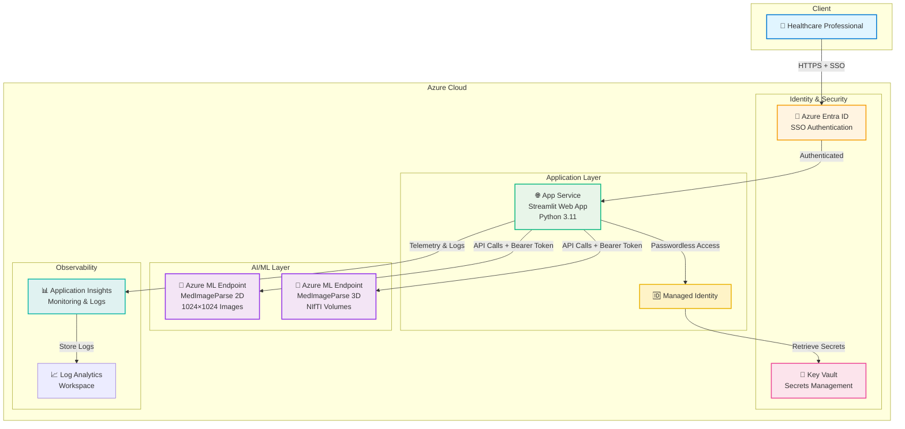

# 🤖 MedImageParse - AI Medical Imaging Agent

## Intelligent Medical Image Analysis with Natural Language Understanding

**Developed by Xinyuwei**

[](https://azure.microsoft.com)
[](https://www.python.org)
[](https://streamlit.io)
[](https://azure.microsoft.com/products/ai-services)

An enterprise-grade **AI Agent** for medical image segmentation powered by Azure AI Foundry.  
Supports **2D/3D medical imaging** with **conversational natural language prompts** for ophthalmology, radiology, and pathology applications.

**Quick Links**: [🚀 Quick Start](#-quick-start) • [📖 Documentation](#-documentation) • [💡 Examples](#-how-to-use)

---

## 🎬 Demo Video

https://github.com/user-attachments/assets/7983ecb1-328d-421c-986f-8e22d7f9813d

---

## ✨ Features

### 🤖 AI Agent Capabilities
- **Conversational Interface** - Interact with medical images using natural language
- **Intelligent Understanding** - Automatically interprets medical terminology and context
- **Multi-Modal Analysis** - Seamlessly handles 2D images and 3D volumes
- **Autonomous Task Execution** - From prompt to segmentation, fully automated

### 🔬 Medical Imaging Support
- **2D Images** - PNG, JPG for pathology, X-rays, fundus photography
- **3D Volumes** - NIfTI format for CT, MRI scans
- **Interactive Visualization** - Real-time preview with 3D slice browsing
- **Multiple Objects** - Segment multiple anatomical structures simultaneously

### 🌐 User Experience
- **Bilingual UI** - Full Chinese and English support
- **Conversational Prompts** - "segment the liver", "find the tumor", "analyze retinal vessels"
- **Visual Feedback** - Instant preview and result validation

### 🔒 Enterprise Features
- **Production-Ready** - Azure Entra ID authentication, Key Vault, HTTPS-only
- **One-Click Deployment** - Deploy entire stack with `azd up`
- **Observability** - Application Insights with distributed tracing

### Use Cases

| Domain | Applications |
|--------|--------------|
| 👁️ Ophthalmology | Retinal vessel segmentation, diabetic retinopathy detection |
| 🔬 Pathology | Tumor cell identification, tissue structure analysis |
| 🏥 Radiology | Organ segmentation (liver, lung, kidney), tumor detection |
| 🧠 Neurology | Brain anatomy segmentation, hemorrhage detection |

---

## 🏗️ System Architecture



**Key Components:**
- **User** - Healthcare professionals and researchers
- **Azure Entra ID** - Enterprise SSO authentication
- **App Service** - Streamlit web application (Python 3.11)
- **Key Vault** - Secure storage for API keys and secrets
- **Managed Identity** - Passwordless authentication for Azure services
- **ML Endpoints** - MedImageParse 2D (images) and 3D (volumes)
- **Application Insights** - Real-time monitoring and distributed tracing
- **Log Analytics** - Centralized log storage and querying

---

## 📦 Prerequisites

### 1. Azure Subscription
⚠️ **Paid subscription required** (free/trial subscriptions do NOT work)

### 2. Deploy ML Models First (Critical!)

**You must deploy MedImageParse models BEFORE deploying this application.**

#### Required Setup:
- ✅ Hub-based project in Azure AI Foundry (NOT standalone)
- ✅ Azure AI Developer role assigned to your account
- ✅ Storage account public access enabled

#### Deployment Steps:
1. Go to https://ai.azure.com
2. Create AI Hub → Create project under that hub
3. Hub → IAM → Add "Azure AI Developer" role to yourself
4. Storage Account → Networking → Enable "Public network access"
5. Model Catalog → Search "MedImageParse" → Deploy both 2D and 3D models
6. **Save the endpoints and API keys** (you'll need them later)

📖 **Detailed guide**: [docs/model-deployment-guide.md](./docs/model-deployment-guide.md)

### 3. Required Tools
- [Azure Developer CLI (azd)](https://aka.ms/azure-dev/install)
- [Python 3.9+](https://www.python.org/downloads/)

### 4. Test Images
The repository includes sample images in `test_images/` for testing:
- **2D Example**: `page_1_img_1.png_region_1.png` - Pathology image for 2D segmentation
- **3D Example**: `chris_t1.nii.gz` - Brain MRI volume for 3D segmentation

---

## 🚀 Quick Start

### Deploy to Azure (Recommended)

**Step 1: Clone this directory**
```bash
git clone --depth 1 --filter=blob:none --sparse https://github.com/david-xinyuwei/david-share.git
cd david-share
git sparse-checkout set Agents/MedImageParse
cd Agents/MedImageParse
```

**Step 2: Login and deploy**
```bash
# Login to Azure (use device code for headless/SSH environments)
azd auth login --use-device-code

# Deploy infrastructure and application
azd up
```

⏱️ **Deployment time**: 5-7 minutes

**If deployment fails with quota errors**, see Troubleshooting section below for how to check your actual quota.

**Step 3: Access your application**
```bash
azd show
```
Open the displayed URL in your browser.

**Step 4: Configure ML endpoints in the UI**

After deployment, open the application and enter your ML endpoints in the sidebar:
1. Select language (Chinese/English)
2. Enter MedImageParse 2D Endpoint URL and API Key
3. Enter MedImageParse 3D Endpoint URL and API Key
4. Start using the application

---

### Run Locally (Development)

```bash
# Install dependencies
pip install -r src/requirements.txt

# Run application
streamlit run app_clean.py

# Open browser: http://localhost:8501
```

After the application starts, enter your ML endpoints in the UI sidebar.

---

## 💡 How to Use

### 2D Image Segmentation

1. Select language (Chinese/English) in sidebar
2. Choose "MedImageParse (2D)" model
3. Upload PNG or JPG medical image
4. Enter prompt (e.g., "segment retinal vessels")
5. Click analyze and view results
6. Download segmentation mask

### 3D Volume Segmentation

1. Choose "MedImageParse 3D" model
2. Upload NIfTI file (.nii or .nii.gz)
3. Enter prompt (e.g., "segment brain")
4. Browse through 3D slices with slider
5. Download 3D segmentation mask

### Example Prompts

**Ophthalmology:**
- "segment retinal vessels"
- "detect optic disc"
- "find hemorrhages"

**Radiology:**
- "segment liver"
- "segment left lung"
- "find tumor"

**Neurology:**
- "segment brain"
- "segment gray matter"
- "detect lesions"

---

## 🔧 Configuration

### ML Endpoint Configuration

The application (`app_clean.py`) uses a **UI-based configuration** approach:

1. After starting the application, open the sidebar
2. Select your preferred language (Chinese/English)
3. Enter the following information:
   - **2D Model Endpoint URL**: Your MedImageParse 2D endpoint
   - **2D Model API Key**: Your 2D model API key
   - **3D Model Endpoint URL**: Your MedImageParse 3D endpoint
   - **3D Model API Key**: Your 3D model API key
4. Click "Save Configuration"

**No hardcoded credentials needed** - all configuration is done through the UI at runtime.

---

## 🐛 Troubleshooting

### Common Issues

**Problem: Model deployment failed in Azure AI Foundry**
- ✅ Verify "Azure AI Developer" role is assigned
- ✅ Check storage account has public access enabled
- ✅ Ensure using paid subscription (not free/trial)

**Problem: 401 Unauthorized error when calling ML endpoint**
- ✅ Verify API key is correct
- ✅ Check endpoint URL matches your deployment
- ✅ Ensure Key Vault secrets are properly configured

**Problem: Application won't start**
```bash
pip install -r src/requirements.txt --upgrade
```

**Problem: NIfTI file won't load**
- ✅ Ensure valid NIfTI format (.nii or .nii.gz)
- ✅ Check file size < 100MB
- ✅ Verify file is not corrupted

**Problem: Key Vault access denied**
- ✅ Check Managed Identity is assigned to App Service
- ✅ Verify RBAC roles on Key Vault
- ✅ Wait 5-10 minutes after deployment for permissions

**Problem: Quota/SKU deployment errors**

Error: `InternalSubscriptionIsOverQuotaForSku` means your subscription lacks quota for the selected region/SKU.

**How to check your actual App Service quota:**

```bash
# Replace YOUR_SUBSCRIPTION_ID with your subscription ID
SUBSCRIPTION_ID="YOUR_SUBSCRIPTION_ID"

# Check quota for specific region and SKU
REGION="eastus"  # Change to your target region
az rest --method get \
  --uri "https://management.azure.com/subscriptions/$SUBSCRIPTION_ID/providers/Microsoft.Web/locations/$REGION/usages?api-version=2024-04-01" \
  --query "value[?contains(name.localizedValue, 'Basic') || contains(name.localizedValue, 'Standard') || contains(name.localizedValue, 'Premium')].{SKU:name.localizedValue, Current:currentValue, Limit:limit}" \
  -o table

# Check multiple regions at once
for region in canadacentral eastus westus northeurope; do
  echo "=== $region ==="
  az rest --method get \
    --uri "https://management.azure.com/subscriptions/$SUBSCRIPTION_ID/providers/Microsoft.Web/locations/$region/usages?api-version=2024-04-01" \
    --query "value[?contains(name.localizedValue, 'Basic') || contains(name.localizedValue, 'Standard') || contains(name.localizedValue, 'Premium')].{SKU:name.localizedValue, Current:currentValue, Limit:limit}" \
    -o table
  echo ""
done
```

**Understanding quota values:**
- `Limit: 0` = No quota (cannot deploy)
- `Limit: -1` = Unlimited quota ✅
- `Limit: 360` = 360 cores available
- `Current: 2, Limit: 0` = Legacy resources using expired quota

**Solution options:**

1. **Find region with quota** (recommended):
   ```bash
   # Delete current environment
   azd env delete your-env-name
   
   # Create new environment with working region
   azd env new your-new-env
   azd env set AZURE_LOCATION canadacentral  # Use region with quota
   azd up
   ```

2. **Change SKU in bicep**:
   Edit `infra/modules/app-service.bicep` line 13-18:
   ```bicep
   sku: {
     name: 'P0v3'  // Change to SKU with quota
     tier: 'PremiumV3'
     size: 'P0v3'
     family: 'Pv3'
     capacity: 1
   }
   ```
   
   Common SKUs and pricing:
   - `B1` (Basic) - ~$13/month, no Always On
   - `S1` (Standard) - ~$70/month, Always On supported
   - `P0v3` (Premium v3) - ~$100/month, best performance
   - `P1v2` (Premium v2) - ~$146/month

3. **Request quota increase**:
   - Visit [Azure Portal Quotas](https://portal.azure.com/#view/Microsoft_Azure_Capacity/QuotaMenuBlade/~/myQuotas)
   - Search for "App Service Plan"
   - Request increase for desired region/SKU
   - Wait 1-3 business days for approval

**Problem: Git LFS file not downloaded (shows "version https://git-lfs..." in file)**

If `infra/main.parameters.json` shows LFS pointer instead of JSON:
```bash
# Install Git LFS
sudo apt-get install git-lfs  # Ubuntu/Debian
git lfs install
git lfs pull
```

**Problem: "clientId cannot exceed 64 characters" error**

This was fixed in recent versions. If you still see it:
- Entra ID authentication has been removed from bicep
- Application now allows public access
- Pull latest code: `git pull origin master`

**Problem: "resource not found: unable to find a resource tagged with 'azd-service-name: web'"**

This means App Service is missing the deployment tag. Fixed in latest version:
```bash
git pull origin master
azd provision  # Re-run to update tags
azd deploy web
```

**Problem: PowerShell 7 warnings during deployment**

This is safe to ignore on Linux systems. The warning appears because:
- Post-provision hook requires PowerShell 7
- Hook has been removed in latest version
- If using old version: `git pull origin master`

**Problem: Application Insights / Log Analytics not working**

Current version deploys these resources but doesn't use them in application code:
- Monitoring infrastructure is created for future use
- Application doesn't send telemetry yet
- You can safely ignore these resources or remove them to save cost

### Health Check

Test if your application is running:
```bash
curl https://your-app.azurewebsites.net/healthz
```

---

## 🔒 Security Features

- ✅ HTTPS-only (TLS 1.2+)
- ✅ No hardcoded secrets - all configuration via UI
- ✅ Managed Identity for Azure resources
- ✅ Configuration persistence in user directory
- ⚠️ Public access (no authentication) - suitable for demos
- 💡 For production: Add IP restrictions or authentication

**Note**: Enterprise authentication (Entra ID) was removed to simplify deployment. For production use, consider adding:
- IP whitelist in App Service networking
- Application-level authentication
- Azure Front Door with WAF

---

## 📚 Documentation

- [Model Deployment Guide](./docs/model-deployment-guide.md) - **START HERE** if models not deployed yet
- [Application Deployment Guide](./docs/deployment-guide.md) - Detailed deployment instructions
- [Azure AI Foundry Docs](https://learn.microsoft.com/azure/ai-foundry/) - Official Azure documentation
- [MedImageParse Research](https://www.microsoft.com/research/project/medimageparse/) - Research project details

---

## 📄 License

MIT License - see [LICENSE](./LICENSE)

---

## 👨‍💻 Author

**Developed by Xinyuwei**

For questions or issues, please open an issue on GitHub.

---

## 🙏 Acknowledgments

- Microsoft Azure AI team for MedImageParse models
- Azure Machine Learning team
- Streamlit community
