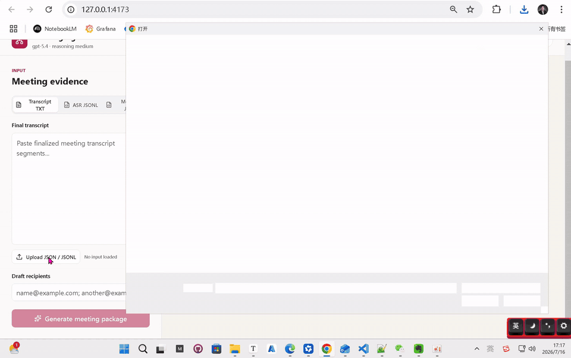
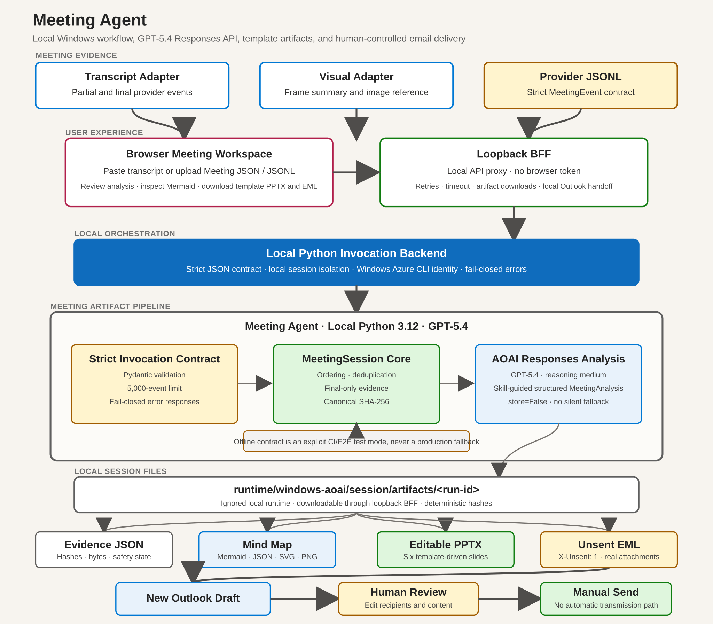
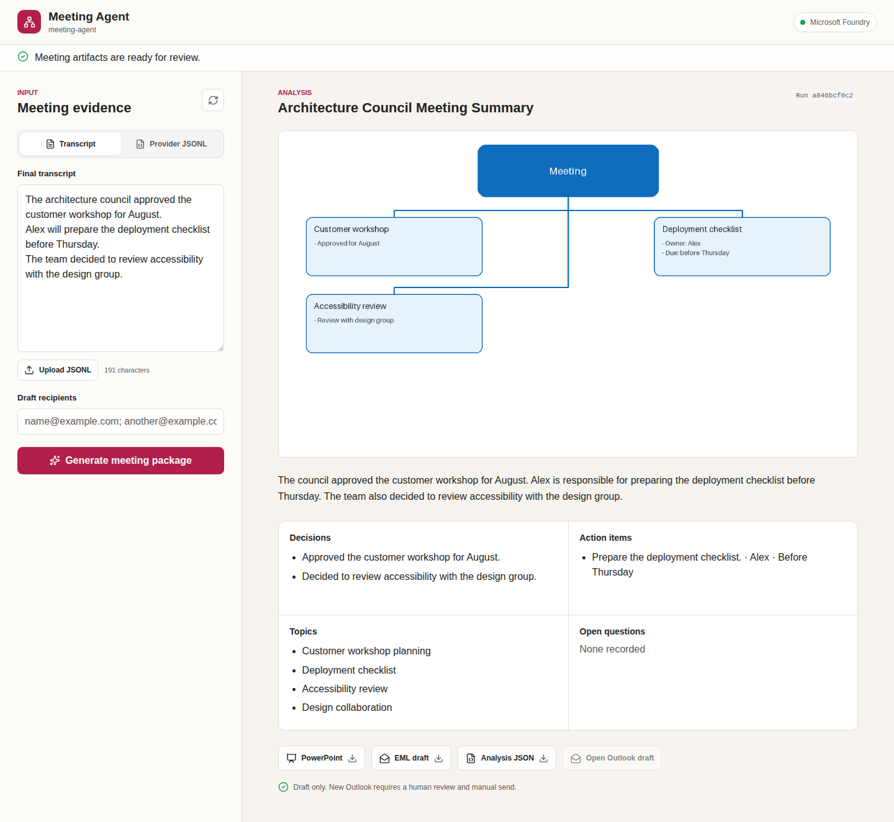
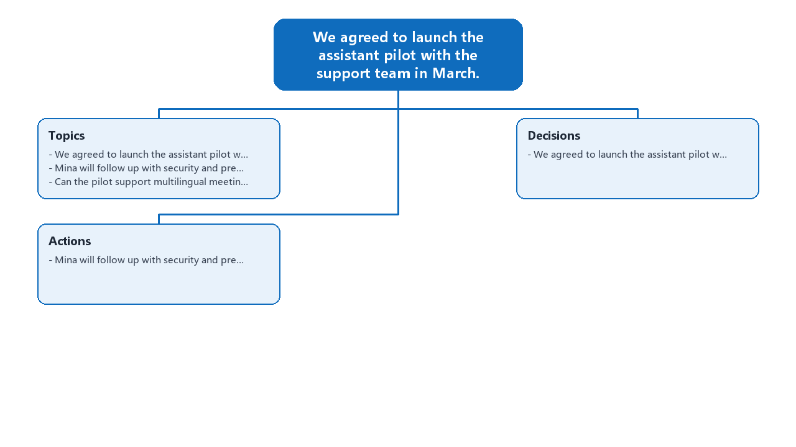
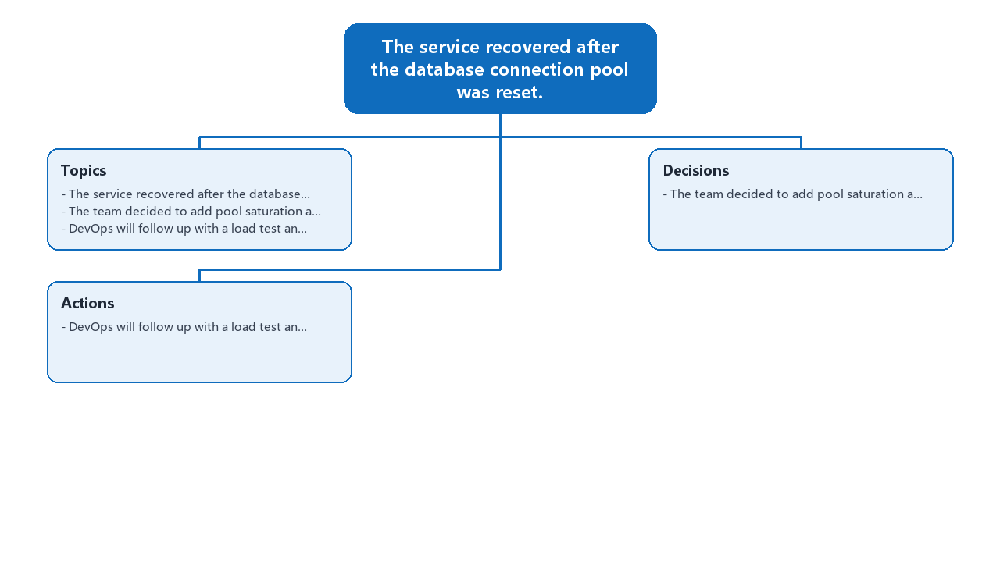
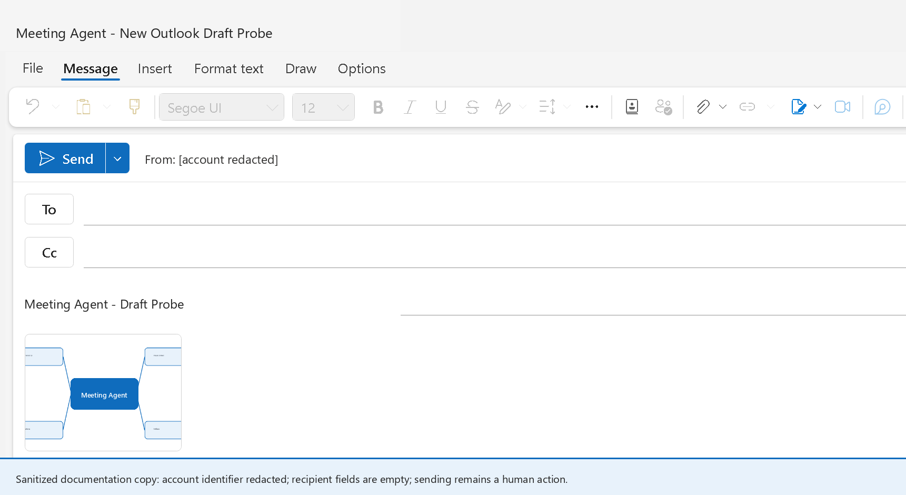

# Meeting Agent

[](https://www.python.org/)
[](LICENSE)
[](https://github.com/david-xinyuwei/david-share/actions/workflows/meeting-agent-ci.yml)
[](#人工控制的-outlook-交接)

一个本机 Windows 会议工作区：通过 Azure OpenAI Responses API 调用 GPT-5.4，生成结构化纪要、Mermaid 思维导图、模板化 PowerPoint，以及未发送的 New Outlook 草稿。

> 作者：魏新宇

**中文** | [English](README.md) | [源码](https://github.com/david-xinyuwei/david-share/tree/master/Agents/Meeting-Agent)

## 一个Meeting Agent，两条实现路径

本Repo包含同一个Meeting Agent产品契约的两条实现：

| 维度 | Classic Direct Responses实现 | 使用Managed GHCP Harness的Foundry Prompt Agent实现 |
|---|---|---|
| 位置 | Repo根目录 | [`managed-agent/`](managed-agent/) |
| 模型循环责任方 | 本机应用代码 | Foundry托管的GHCP Harness |
| 模型访问 | 直接调用Azure OpenAI Responses | 调用Foundry Agent Responses Endpoint |
| 认证 | 本机Backend进程使用API Key | Entra ID；客户主路径不使用模型API Key |
| Skill生命周期 | 应用代码加载本机`SKILL.md` | 版本化Foundry Skill通过Toolbox MCP绑定 |
| 产物与UI契约 | JSON、Mermaid、SVG、PNG、可编辑PPTX、EML、浏览器UI、New Outlook草稿 | 完全相同；八个共用核心模块逐字节一致 |
| 客户代码责任 | 负责模型请求构造与编排 | 负责事件校验、产物与Outlook交接；Foundry负责模型循环 |
| 适用场景 | 需要最大直接控制，以及GA风格API简洁性 | 希望减少编排责任、使用托管Skill生命周期和平台治理Agent Runtime |

Classic路径是**本机prompt-style编排**，并不是已经部署的Foundry Prompt Agent。这个口径能准确隔离Managed Agent带来的责任转移，不会把早期实现包装成不存在的产品能力。

详见[Managed实现](managed-agent/README-CN.md)和[功能等价证据](managed-agent/FEATURE-PARITY-CN.md)。

## 演示视频

https://github.com/user-attachments/assets/023f22f0-31f2-4039-85f0-e22712770ff2

[](https://github.com/user-attachments/assets/023f22f0-31f2-4039-85f0-e22712770ff2)

[下载Repo内视频副本](https://github.com/david-xinyuwei/david-share/raw/refs/heads/master/Agents/Meeting-Agent/media/meeting-agent-demo-1.6x.mp4?download=1)

*GitHub会把user-attachment裸链接渲染为原生视频播放器；动画图片用于兼容回退。完整视频保持`2392x1500`分辨率并以原视频的`1.6x`速度播放，保留全部3,860帧；实测SSIM为`0.99966`、PSNR为`56.17 dB`。[查看验证证据](evidence/meeting-agent-demo-video.json)。*

## 执行摘要

客户主路径是本机浏览器工作区，而不是 Python 命令行。转写、结构化会议 JSON 或视觉适配器会转换成严格会议事件；本机 Python backend 使用 GPT-5.4 Responses API 结构化输出和 Medium reasoning，生成可追溯产物，并让 Windows UI 在 New Outlook 中打开 EML 草稿供人工审阅。

生成过程使用有限 NDJSON 响应流。UI 先显示真实 `response.output_text.delta` 内容，随后仅在对应 backend 阶段实际完成后，依次开放结构化分析、Mermaid 思维图、PowerPoint 和 EML。实现中不使用 timer、打字机模拟、固定进度百分比或合成流事件。

| 结果 | 已实现行为 | 验证 |
|---|---|---|
| 浏览器体验 | Transcript TXT、标准化 ASR JSONL 或 Meeting JSON 输入；卡片式思维图预览；复制富文本；下载同图 PNG 和 Mermaid 源码 | Playwright 桌面/移动端 E2E |
| 本机运行时 | 带严格 Pydantic 校验的 loopback Python artifact backend | `tests/test_hosted_api.py` |
| 会议分析 | GPT-5.4 Responses API、结构化输出、reasoning `medium`、`store=False` | `tests/test_azure_analyzer.py`、运行时 HTTP 日志 |
| Session 产物 | 受管 `$HOME` 下的 JSON、SVG、PNG、可编辑 PPTX、HTML/纯文本 EML | `tests/test_hosted_pipeline.py` |
| Outlook 交接 | 通过 `olk.exe` 打开带 `X-Unsent: 1` 的草稿 | `evidence/outlook-draft-probe.json` |
| 发送安全 | Python/Node/UI/脚本均不含 SMTP、Graph `sendMail`、Outlook `.Send` 或 UI Send 激活 | `scripts/audit_no_send.py` |

## 真实能力与适配器边界

| 能力 | 本仓库实际执行 | 证据 | 边界 |
|---|---|---|---|
| 浏览器 UI | 通过 loopback BFF 调用本机 artifact backend 并渲染真实返回产物 | 浏览器 E2E 和 Node 测试 | 当前版本在本地运行，不是公开云端网站 |
| AOAI 运行时 | 通过API Key认证调用`https://<resource>.openai.azure.com/openai/v1/responses` | Key认证Responses API 200日志和SDK契约测试 | 资源必须满足`disableLocalAuth=false` |
| 事件接入 | 校验、排序、去重并计算标准化 ASR JSONL 事件 hash | 单元测试和两份样例事件流 | 采集传输由适配器提供 |
| 转写处理 | 生成产物时只使用 `transcript.final` | `tests/test_session.py` | Embedded Speech 返回内存识别结果，由适配器映射为 JSONL |
| 视觉上下文 | 接受视觉摘要和可选 `image_uri` | 事件 schema 测试 | 屏幕捕获和图片理解属于视觉适配器 |
| GPT-5.4 分析 | 加载 meeting-package skill，使用 Pydantic 结构化输出、Medium reasoning 和 `store=False` | SDK 契约与真实 AOAI response | 不会 fallback 到本地 fixture |
| 已提交样例 fixture | 用于渲染器、EML 和 evidence 契约回归测试的静态产物 | Hash 校验和单元测试 | 不是 AI 质量替代品、可执行分析器或生产 fallback |
| 产物生成 | 创建真实且可解析的 PNG/SVG/JSON/PPTX/EML | SHA-256 manifest 和产物测试 | 布局保持简洁，可按需定制 |
| New Outlook | 打开包含真实附件的可编辑 EML 草稿 | 脱敏 Windows 实测证据 | UI 按钮或 `--open-outlook` 需要 Windows 和 New Outlook |
| 邮件传输 | 不发送邮件 | 每个 CI job 执行静态审计 | 用户审阅后手动点击 Send |

已提交的样例产物是用于确定性渲染器和草稿契约回归测试的静态 `test-fixture` 证据；客户路径不能调用任何 fixture。Live 验证使用本机 Windows UI 和 full GPT-5.4 Responses API：结构化会议 JSON 会生成有依据的分析；页面、PNG 下载和 Outlook 草稿正文共用同一张卡片式思维图，同时保留 renderer-neutral Mermaid 源码；另生成六页可编辑 PPTX，以及含两个附件的 EML。这是功能证据，不是生产认证或模型质量 benchmark。脱敏 Outlook probe 仅验证 Windows 草稿交接。

[真实Runtime Differential证据](evidence/aoai-runtime-differential.json)记录了两份内容显著不同的真实Responses API输入；它们的source、标题、analysis、卡片PNG、PPTX和EML hash均不同；response ID在本机完成核验，但不会进入公开记录。

## 架构



*全尺寸矢量架构图：Windows 浏览器工作区、loopback BFF、本机 Python artifact backend、GPT-5.4 Responses API、本机 session 文件和人工控制的 New Outlook 交接。[直接打开 SVG](images/meeting-agent-architecture.svg)。*

### 浏览器工作区



*来自真实本机 AOAI 路径的 1440 px 脱敏 Playwright 截图。tenant、subscription、资源、endpoint、token 和 session 标识均未渲染或发布。*

### 处理不变量

1. `event_id` 具有幂等性。相同 ID 对应不同内容时 fail closed。
2. 事件依次按 `sequence`、`timestamp`、`event_id` 排序。
3. ASR partial 假设永不进入摘要或附件。
4. 每个输入事件流和输出产物都有 SHA-256 摘要。
5. Azure 路径把事件内容视为不可信数据，而不是模型指令。
6. EML 必须包含 `X-Unsent: 1` 和至少一个真实附件。
7. 代码库不具备自动发送邮件的能力。
8. Azure 分析会把每个事件规范为单行，并拒绝超过 200,000 字符的输入。
9. 本机 invocation request 会拒绝未知字段和超过 5,000 个事件的输入。
10. Runtime 产物始终位于被忽略的本机 session 目录；BFF 会拒绝路径穿越。
11. 浏览器代码永远拿不到 Azure access token；只有 loopback BFF 获取 token。

## 事件契约

每一行是一个 JSON 对象，未声明字段会被拒绝。

| 字段 | 类型 | 约束 | 用途 |
|---|---|---|---|
| `event_id` | string | 1 到 128 个字符 | 幂等键 |
| `session_id` | string | 1 到 128 个字符 | 会议边界 |
| `sequence` | integer | `>= 0` | 提供方顺序 |
| `timestamp` | RFC 3339 datetime | 必须带时区 | 确定性排序 |
| `kind` | enum | 见下表 | 事件行为 |
| `text` | string 或 null | 最长 20,000 字符 | 转写或视觉摘要 |
| `image_uri` | string 或 null | 最长 2,048 字符；禁止 `data:` URI 和换行符 | 适配器管理的图片引用 |
| `metadata` | object | 默认 `{}` | 提供方特有的非秘密元数据 |

| `kind` | 必要 payload | 流水线行为 |
|---|---|---|
| `transcript.partial` | 非空 `text` | 接收用于观测，但不进入产物 |
| `transcript.final` | 非空 `text` | 进入分析 |
| `visual.frame` | `text` 或 `image_uri` | 增加由适配器提供的视觉上下文 |
| `meeting.end` | 无 | 标记上游会议边界 |

示例：

```json
{"event_id":"event-004","session_id":"product-planning","sequence":4,"timestamp":"2026-01-15T09:00:08Z","kind":"transcript.final","text":"Mina will follow up with security and prepare the pilot checklist.","metadata":{"source":"local-asr"}}
```

完整事件流见 [examples/product-planning.jsonl](examples/product-planning.jsonl) 和 [examples/operations-review.jsonl](examples/operations-review.jsonl)。

## 证据展示

两次已提交运行的源内容、分析输出、思维导图、演示文稿和 EML hash 均不同。CI 会从磁盘重新计算每个摘要，并用来源事件流核对 evidence manifest。

| 运行 | 事件数 | 来源 SHA-256 | 分析 SHA-256 | 结果 |
|---|---:|---|---|---|
| `product-planning` | 6 | `413799e9783ac40a5a4e225a553bef94f33fd4c5990607add57e50547f91486b` | `988d06fa2c29be218c8945ddb23734ce07752e5e5428b5e80506194f30fd4864` | 独立的产品规划摘要 |
| `operations-review` | 6 | `88d71ad49cd875e2eb958c884e1ce2eb76a208576047df923decda79e7e109fb` | `22e4e3c9a679d3d3e3a7fbca64a16166ef4e4e546c5d2d35f2413cea9675dd13` | 独立的故障复盘摘要 |

### 产品规划样例



### 运维复盘样例



每次运行包含：

| 文件 | 用途 |
|---|---|
| `meeting-analysis.json` | 完整结构化分析 |
| `mind-map.json` | 与渲染器解耦的图结构 |
| `mind-map.svg` | 可缩放的六卡片布局 |
| `mind-map.png` | 页面、下载、PPTX 和邮件共用的六卡片位图 |
| `meeting-summary.pptx` | 可编辑的六页模板化演示文稿 |
| `meeting-follow-up.eml` | 正文内嵌卡片图且带 PNG/PPTX 附件的未发送 MIME 草稿 |
| `evidence.json` | 来源和产物大小/hash manifest |

## 快速开始

### 前置条件

- Windows 11、New Outlook、Python 3.12和Node.js 22或更高版本
- 已有Azure OpenAI endpoint、deployment名称和API Key
- Azure OpenAI资源必须允许Local Auth（`disableLocalAuth=false`）

本机 Demo 使用 GA 的 AOAI Responses API。在将其作为生产部署标准前，必须确认模型可用性、quota、identity policy 和数据驻留要求。

### AIPC客户端到端Runbook（Key认证）

这是完整“浏览器 → Azure OpenAI → 产物 → New Outlook”流程的AIPC支持路径，不要求Azure账号登录或Azure命令行工具。所有命令都在Windows原生PowerShell中运行，不使用WSL。

1. 获取源码并进入项目目录。如果收到的是客户ZIP，先解压并进入其中的`Meeting-Agent`目录：

```powershell
Expand-Archive .\Meeting-Agent-Customer-Package-*.zip -DestinationPath .\Meeting-Agent-Delivery
Set-Location .\Meeting-Agent-Delivery\Meeting-Agent
```

如果通过GitHub交付，则改为克隆Repo：

```powershell
git clone https://github.com/david-xinyuwei/david-share.git
Set-Location .\david-share\Agents\Meeting-Agent
```

2. 在Azure Portal中获取Azure OpenAI连接信息：

- 打开目标 **Azure OpenAI** 或 **Azure AI Services** 资源。
- 进入 **Resource Management > Keys and Endpoint**。
- 复制 **Endpoint**，以及 **KEY 1** 或 **KEY 2** 中任意一个。
- 在 **Model deployments** 中确认deployment名称；本文示例使用`gpt-5.4`。

3. 使用现有Azure OpenAI资源启动应用。只替换endpoint和deployment占位符，不要把API Key写进命令：

```powershell
.\scripts\start-ui-key.ps1 `
  -Endpoint "https://<your-resource>.openai.azure.com/" `
  -Deployment "gpt-5.4"
```

启动器会用隐藏输入询问API Key。粘贴Key并按Enter；Key不会显示，也不会写入文件。启动器会校验Windows、Node.js、Python和New Outlook，安装锁定依赖，在`18089`启动Python backend，并在`http://127.0.0.1:4173`启动loopback UI。

执行命令后，PowerShell会显示：

```text
Azure OpenAI API key:
```

在这个提示后粘贴 **KEY 1** 或 **KEY 2**，然后按Enter。因为是隐藏输入，粘贴时屏幕不会显示任何字符。启动器特意不提供`-ApiKey`命令参数，避免Key进入PowerShell历史记录。

4. 打开`http://127.0.0.1:4173`，选择 **Meeting JSON**，上传`examples/meeting-record-stargate.json`，按需填写草稿收件人，然后点击 **Generate meeting package**。

5. 只有以下条件全部满足才算验收通过：

- 页头显示 **Azure OpenAI Responses API** 和`gpt-5.4 · reasoning medium · key auth`。
- 六个真实生成阶段全部完成；模型文字先于分析和产物出现。
- 页面显示六卡片思维图；**Save PNG**下载同一张图。
- PowerPoint可以作为可编辑的六页演示文稿打开。
- EML作为未发送的New Outlook草稿打开，正文内嵌同一卡片图，带PNG/PPTX附件，并且只能人工Send。

在启动器终端按`Ctrl+C`即可停止UI和backend。以后继续使用同一条`start-ui-key.ps1`命令。Key只传给Python backend进程，并在Node BFF启动前从父进程环境中删除；不会写入`.env`、命令行参数、日志、浏览器响应、生成产物、Git或客户ZIP。如果Azure返回`403 AuthenticationTypeDisabled`，需要资源管理员根据组织策略启用Local Auth。

### 确定性测试 fixture

```bash
git clone https://github.com/david-xinyuwei/david-share.git
cd david-share/Agents/Meeting-Agent
python3 -m venv .venv
source .venv/bin/activate
python -m pip install -r requirements-dev.txt
python -m pip install -e .
python -m pytest \
  tests/test_artifacts.py \
  tests/test_hosted_pipeline.py \
  tests/test_draft.py
```

安装后，`meeting-agent` 与 `python -m meeting_agent.cli` 等价。

### Windows 测试命令

```powershell
py -3.12 -m venv .venv
.\.venv\Scripts\python.exe -m pip install -r requirements-dev.txt
.\.venv\Scripts\python.exe -m pip install -e .
.\.venv\Scripts\python.exe -m pytest `
  tests\test_artifacts.py `
  tests\test_hosted_pipeline.py `
  tests\test_draft.py
```

### 运行日志

事件校验输出：

```json
{"session_id":"product-planning","event_count":6,"content_sha256":"413799e9783ac40a5a4e225a553bef94f33fd4c5990607add57e50547f91486b"}
```

Evidence 摘要：

```json
{
  "analyzer": "test-fixture",
  "source": {
    "session_id": "product-planning",
    "event_count": 6,
    "content_sha256": "413799e9783ac40a5a4e225a553bef94f33fd4c5990607add57e50547f91486b"
  },
  "eml": {
    "x_unsent": "1",
    "recipient_count": 0,
    "attachment_count": 2
  },
  "automatic_send": false,
  "next_state": "DRAFT_READY_MANUAL_SEND_REQUIRED"
}
```

## GPT-5.4 Key认证Responses分析器

本机 Azure OpenAI 分析器是主要运行时：

- `InvocationAgentServerHost` 通过 `/invocations` 暴露严格本机 JSON 契约。
- `AzureOpenAIAnalyzer`使用API Key认证调用AOAI `/openai/v1/responses` endpoint。
- GPT-5.4 加载打包后的会议 skill，使用 Pydantic 结构化输出、reasoning `medium` 和 `store=False`。
- Windows启动器通过隐藏提示读取Key，并且只传给Python backend进程。
- 生成文件写入被忽略的本机 runtime session，而不是公开目录。

Standalone CLI 继续用于适配器开发和故障恢复。它的 Azure 路径遵循当前 Responses v1 模式：

- `OpenAI(base_url="https://<resource>.openai.azure.com/openai/v1/")`
- 仅在进程内存中提供`AZURE_OPENAI_API_KEY`
- 把 Pydantic `MeetingAnalysis` 传给 `responses.parse`
- Response 请求设置 `store=False`
- 每个事件文本规范化为一行，并以 200,000 字符上限 fail closed

本仓库锁定`openai==2.32.0`。从[.env.example](.env.example)开始，但真实Key不要进入源代码，应使用隐藏输入启动器。

配置资源和 deployment，不提交凭据：

```bash
export AZURE_OPENAI_ENDPOINT="https://<resource>.openai.azure.com/"
export AZURE_OPENAI_DEPLOYMENT="<deployment-name>"
export AZURE_OPENAI_API_KEY="<api-key>"
python -m meeting_agent.cli build \
  --events examples/product-planning.jsonl \
  --output-dir artifacts/azure-product-planning
```

这个CLI示例只适合临时开发shell。客户应使用隐藏输入启动器。禁止把API Key、租户专属endpoint或客户数据放入本仓库。

官方参考：

- [Azure OpenAI Responses API](https://learn.microsoft.com/azure/ai-foundry/openai/how-to/responses)
- [Structured Outputs parsing helpers](https://github.com/openai/openai-python/blob/main/helpers.md)

## 人工控制的 Outlook 交接

在 Windows 上，客户主路径是浏览器工作区中的 **Open Outlook draft** 按钮。Loopback BFF 从当前本机 session 读取 EML，原子写入本地临时目录，并用该文件启动 `olk.exe`。BFF 不提供 send endpoint。

启动完整本机应用：

```powershell
.\scripts\start-ui-key.ps1 `
  -Endpoint "https://<your-resource>.openai.azure.com/" `
  -Deployment "gpt-5.4"
```

必须在Windows PowerShell中运行该命令，不能在WSL中运行。启动器会在启用Outlook按钮前验证Node.js、Python、HTTPS endpoint和`olk.exe`。

Standalone CLI 只支持 Azure。CI 通过静态测试 fixture 验证 EML 草稿，而不是暴露另一个本地分析器。支持的 UI 路径会先写入或下载 EML、校验其契约，再启动 `olk.exe <absolute-eml-path>`。Compose window 保持可编辑。本仓库不会点击 Send，也不会调用发送 API。



*真实 New Outlook probe 的公开脱敏衍生图。账户标识已遮盖，原内部工作名已统一为公开项目名，收件人字段保持为空，私有原图不公开。*

脱敏 Windows probe 记录：

| 检查 | 实测值 |
|---|---:|
| `X-Unsent` | `1` |
| 收件人数 | `0` |
| 附件数 | `2` |
| New Outlook window 变化 | `+1` |
| 自动发送 | `false` |

证据见 [evidence/outlook-draft-probe.json](evidence/outlook-draft-probe.json)。记录分别标识私有 probe 产物与公开脱敏截图；私有文件本体和用户专属窗口数据仍不公开。

## CLI 参考

```text
meeting-agent validate-events --events <meeting.jsonl>

meeting-agent build \
  --events <meeting.jsonl> \
  --output-dir <directory> \
  [--recipient <address>] \
  [--open-outlook]
```

`--recipient` 可以预填草稿地址，但不会发送。已提交证据有意使用零收件人。
多次指定 `--recipient` 可以预填多个审阅人，每个值必须是一个有效地址。Build 会对输出目录持有独占 `.meeting-agent.lock`；并发 build 必须使用不同输出目录，或等待当前 build 完成。执行 `build` 前，输入 JSONL 必须已经完整且不可变。

## Evidence 格式

每次 build 都会写入 `evidence.json`：

| Key | 含义 |
|---|---|
| `schema_version` | Evidence 契约版本 |
| `analyzer` | 可执行 CLI build 为 `azure`；已提交的静态回归资产为 `test-fixture` |
| `source` | Session ID、事件数和 canonical source SHA-256 |
| `artifacts` | 每个输出的相对文件名、字节数与 SHA-256 |
| `eml` | `X-Unsent`、收件人数、附件数/名称、Subject 和 SHA-256 |
| `automatic_send` | 在本仓库中始终为 `false` |
| `next_state` | `DRAFT_READY_MANUAL_SEND_REQUIRED` |

使用 `scripts/validate_sample_runs.py` 验证已提交样例。对于新运行，对照 `artifacts` 检查每个文件，并在打开草稿前确认 EML 安全字段。

## 测试与质量门禁

```bash
python scripts/audit_no_send.py
python scripts/audit_public_content.py
python scripts/validate_evidence.py
python scripts/validate_sample_runs.py
python scripts/validate_readmes.py
python scripts/pre_delivery_check.py
ruff check src tests scripts main.py
pytest
pip-audit -r requirements.txt --progress-spinner off
python -m build --wheel
python -m pip check
cd ui
npm ci --no-audit --no-fund
npm test
npm run build
npm run test:e2e
npm audit --omit=dev --audit-level=high
```

CI 在 Ubuntu 和 Windows 上运行 Python 3.11、3.12 与 3.13 gate。独立的 Ubuntu/Node 22 job 运行 UI/BFF 测试、TypeScript build、Vite production build 和生产依赖审计。

| 测试区域 | 覆盖范围 |
|---|---|
| Schema | 每个 `MeetingEvent` 字段、全部四种 kind、未知字段、非法 payload |
| Session | 排序、幂等重复、冲突 ID、只选择 final transcript |
| Hosted 协议 | Invocations request 校验、显式测试 fixture 注入门、OpenAPI、错误响应和 session 路径 |
| Azure 契约 | v1 base URL、Key必填、结构化输出类型、`store=False`、prompt边界 |
| 真实性 | 两份内容显著不同的输入必须生成不同分析与 source hash |
| 产物 | 非空 `1280x720` PNG、有效 SVG/JSON、可解析 PPTX package |
| 草稿 | `X-Unsent`、收件人、附件、MIME 解析、规范化 Subject |
| UI/BFF | 输入转换、仅loopback路由、路径穿越拒绝、响应式浏览器E2E和真实下载 |
| 安全 | 自动传输 API 与 Send activation 静态失败门禁 |
| 证据 | 来源 hash、文件大小、产物 hash、EML 状态、跨运行差异 |

## 安全与隐私

- 输入是会议内容。调用云端分析器前，必须遵守所在组织的数据分类和保留策略。
- Azure 请求设置 `store=False`；Azure service 和 deployment policy 仍然适用。
- 浏览器只与loopback BFF通信；Azure OpenAI API Key不会被BFF继承，也不会返回给浏览器JavaScript。
- 本机 runtime session 文件位于被忽略的目录，不是公开下载 URL。
- 事件 metadata 不得包含 secret、access token 或不必要的个人数据。
- Git 忽略 `.env`、`password.txt`、token 文件、runtime 输出和本地产物。
- Endpoint 和 deployment 值从环境变量读取。
- 公开证据为合成或脱敏内容，不含客户 endpoint、tenant、subscription、邮件地址或私有路径。
- `SECURITY.md` 规定负责任的漏洞报告方式。

## Schema 版本管理

`schema_version` 当前用于标识 `evidence.json`，版本 `1` 随 package `0.1.0` 引入。增加可选 evidence 字段可以不提升版本；删除字段、改变字段含义或改变 enum 值时必须使用新的 schema version 并提供迁移说明。当前不提供自动迁移工具。严格的 `MeetingEvent` 输入模型会拒绝未知字段，因此适配器维护者应锁定兼容 package 版本，并显式升级。

## 扩展流水线

在 core package 外实现适配器，并输出文档中的 JSONL 契约。对于 Microsoft Embedded Speech，应把每个 SDK 识别结果中的 `text`、offset、duration、speaker ID、confidence，以及可用的 final/partial 状态映射为一条事件；SDK 默认不会生成 TXT 文件。这样可以让采集库、设备协议和提供方 SDK 与分析和产物层解耦。

新增分析器时实现：

```python
class Analyzer(Protocol):
    def analyze(self, session: MeetingSession) -> MeetingAnalysis:
        ...
```

返回现有 `MeetingAnalysis` schema，即可保持所有下游生成器和安全检查不变。

Custom analyzer 当前通过编程方式接入，而不是加入内置 CLI choice：

```python
from pathlib import Path

from meeting_agent.artifacts import generate_artifacts
from meeting_agent.session import load_jsonl

session = load_jsonl(Path("meeting.jsonl"))
analysis = CustomAnalyzer().analyze(session)
generate_artifacts(analysis, Path("artifacts/custom"))
```

## 项目结构

```text
main.py                                    本机严格 invocation backend 入口
src/meeting_agent/skills/                  运行时 meeting-package 提示 skill
src/meeting_agent/templates/               可编辑六页 PPTX 模板
src/meeting_agent/                         核心schema、本机handler、session、analyzer、artifact、EML handoff和CLI
ui/                                        React工作区与Key隔离的loopback BFF
examples/                                  JSONL 事件流与结构化 meeting-record JSON
images/                                    全尺寸架构图与 Outlook 脱敏证据
tests/                                     Schema、Hosted 协议、跨输入、产物、草稿和 CLI 测试
scripts/                                   Key启动器、no-send和证据验证门禁
evidence/                                  脱敏 Outlook probe 与已提交样例运行的 manifest/产物
../../.github/workflows/meeting-agent-ci.yml  Monorepo 范围跨平台 CI
```

## 局限性

- 本仓库不采集麦克风音频或屏幕像素。
- `visual.frame` 是外部适配器提供的文本摘要或引用。
- 确定性测试 fixture 仅位于 `tests/`，不是生产 fallback。
- 已提交的确定性样例不用于评测模型质量。
- 浏览器 UI 是 loopback companion，不是面向互联网的多用户 Web 服务。
- 现有Azure OpenAI资源必须允许Key认证（`disableLocalAuth=false`）。
- SHA-256 manifest 证明单次运行的完整性。PPTX ZIP metadata 和 MIME boundary 在重建时可能改变 binary hash，但不会改变结构化分析。
- New Outlook 启动仅支持 Windows，并依赖 `olk.exe` 可用。
- 生成的摘要和 action item 在外部使用前必须由人工审阅。
- 代码只创建草稿；交付、mailbox policy、signature 和 Send 仍由 Outlook 与用户负责。

## 故障排查

| 现象 | 检查项 |
|---|---|
| `at least one transcript.final event is required` | Build 前至少输出一个 final transcript segment |
| `AZURE_OPENAI_ENDPOINT ... required` | 通过`start-ui-key.ps1`启动，并提供HTTPS endpoint和deployment |
| Azure `401` | 在隐藏提示中重新输入当前Azure OpenAI API Key |
| Azure `403 AuthenticationTypeDisabled` | 让资源管理员设置`disableLocalAuth=false` |
| Azure `404` | 检查 deployment name 与 Responses API availability |
| 找不到 `olk.exe` | 安装 New Outlook，并确认同一 Windows session 可启动 |
| Outlook 按钮被禁用 | 在 Windows 上运行 loopback UI；非 Windows 仍可下载 EML |
| 草稿缺少预期数据 | 检查 `evidence.json`；对已提交样例运行 `validate_sample_runs.py` |

## 贡献

见 [CONTRIBUTING.md](CONTRIBUTING.md)。任何增加自动发信能力或削弱证据校验的修改都会被 CI 拒绝。

## 许可证

采用 [MIT License](LICENSE)。