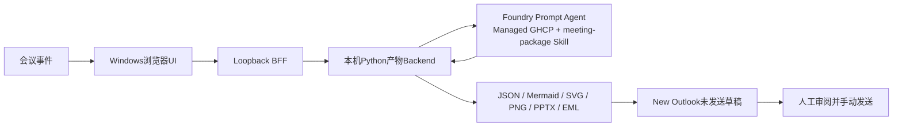

# Meeting Agent — Managed Agent 实现

[](https://www.python.org/)
[](agent.yaml)
[](https://github.com/david-xinyuwei/david-share/actions/workflows/managed-meeting-agent-ci.yml)
[](#outlook-安全边界)

同一个Meeting Agent Repo中的Managed Agent实现。它与根目录Classic Direct Responses实现共用事件、产物、UI、PowerPoint、EML和Outlook契约，同时把模型循环与Skill生命周期交给使用Managed GHCP Harness的Foundry Prompt Agent。

> 作者：魏新宇

**中文** | [English](README.md) | [客户快速入口](CUSTOMER-START-HERE-CN.md) | [源码](https://github.com/david-xinyuwei/david-share/tree/master/Agents/Meeting-Agent/managed-agent)

## 真实能力

| 层级 | 真实实现 | 证据 |
|---|---|---|
| 云端运行时 | 一套Private Preview v1部署于2026-07-23完成实测，Public证据使用脱敏别名`managed-meeting-agent`；当时状态为`active`、`harness=ghcp`、模型`gpt-oss-120b`、Responses协议和Entra认证 | [带日期的云端快照](evidence-managed-agent.json) |
| 云端Skill | 版本化`meeting-package` Skill，通过Agent专属Foundry Toolbox MCP提供 | [Skill验证](evidence/managed-live/toolbox-skill-validation.json) |
| 会议分析 | `ManagedAgentAnalyzer`把实际标准化会议事件和严格`MeetingAnalysis` Schema发送到已部署Agent | [客户端契约](tests/test_managed_analyzer.py) |
| 产物流水线 | 真实生成JSON、Mermaid、SVG、1280x720 PNG、可编辑六页PPTX和MIME EML | [产物验证](evidence/managed-live/artifact-validation.json) |
| 浏览器UI | React工作区、loopback BFF、真实模型delta流、产物下载和Outlook草稿操作 | Playwright桌面端/移动端E2E |
| 邮件安全 | 默认`X-Unsent: 1`、0个收件人、2个真实附件，不包含发送API或Send按钮自动化 | `scripts/audit_no_send.py` |

客户主路径不存在AOAI API Key fallback。静态fixture analyzer只用于测试，生产Host和CLI无法选择。浏览器永远拿不到Azure token。

## 功能范围

本实现完整保留早期Meeting Agent的用户可见契约：

- 支持转写文本、标准化ASR JSONL、结构化Meeting JSON和视觉摘要事件。
- 严格事件Schema、排序、幂等重复处理、冲突检测、最终转写选择和来源SHA-256。
- 真实有限NDJSON流：`accepted`、`analysis_started`、模型delta、分析完成、导图完成、PPT完成和整体完成。
- 结构化标题、摘要、主题、决策、行动项、开放问题，以及与渲染器解耦的思维导图树。
- 思维导图JSON、Mermaid、SVG和非空PNG。
- 从内置模板生成可编辑六页PowerPoint。
- 同时包含纯文本和HTML正文的MIME EML，正文内嵌思维图，附带PNG与PPTX，只允许人工发送。
- React/Vite浏览器UI、安全的本机产物下载、路径穿越防护和New Outlook交接。
- CLI验证/恢复入口，以及Python、Node和Playwright回归测试。

## 架构




Foundry负责模型循环、GHCP Harness和Skill/Toolbox集成。本机应用负责与Provider解耦的事件校验、确定性产物生成、本机文件安全，以及人工控制的Outlook交接。应用不依赖Private Preview的持久文件系统Session API。

## 云端部署

代码声明了独立Prompt Agent：

- Agent示例：`managed-meeting-agent`
- 已验证版本：`1`
- 模型：`gpt-oss-120b`
- Harness：`ghcp`
- Skill：`meeting-package`
- 认证：仅Entra

`agent.yaml`、`instructions.md`、`skills/meeting-package/SKILL.md`和`azure.yaml`共同构成部署源。代码中的capacity只是最小示例；扩容前必须完成quota与成本审批。部署时必须为目标Tenant和Subscription使用隔离的Azure CLI与azd profile。每次成功部署都会创建不可变Agent版本。

## Windows启动

### 前置条件

- Windows 11和New Outlook（`olk.exe`）
- Python 3.12
- Node.js 22或更高版本
- Azure CLI已在独立`AZURE_CONFIG_DIR`中登录
- 当前身份有权访问已部署Foundry Agent

在Windows原生PowerShell中运行：

```powershell
$env:AZURE_CONFIG_DIR = "$env:USERPROFILE\.azure-<tenant>-<subscription>"
az account show

.\scripts\start-ui.ps1 `
  -ManagedAgentEndpoint "https://<account>.services.ai.azure.com/api/projects/<project>/openai/v1/responses" `
  -ManagedAgentName "managed-meeting-agent" `
  -ManagedAgentVersion "1" `
  -AzureConfigDir $env:AZURE_CONFIG_DIR
```

打开`http://127.0.0.1:4173`。选择转写、ASR JSONL或Meeting JSON输入，然后点击 **Generate meeting package**。启动器会在本机Backend启动前验证隔离Azure CLI profile和Foundry token scope。

## CLI

开发Shell使用同一个Managed Agent环境：

```bash
export AZURE_CONFIG_DIR="$HOME/.azure-<tenant>-<subscription>"
export MANAGED_AGENT_ENDPOINT="https://<account>.services.ai.azure.com/api/projects/<project>/openai/v1/responses"
export MANAGED_AGENT_NAME="managed-meeting-agent"
export MANAGED_AGENT_VERSION="1"

python -m meeting_agent.cli build \
  --events examples/product-planning.jsonl \
  --output-dir artifacts/product-planning
```

Entra认证、配置的Agent版本、HTTP响应或严格JSON契约任一不满足时，CLI都会明确失败，不会静默fallback。

## 验证结果

两份内容显著不同的输入已真实发送到v1 Agent。它们的来源和分析Hash均不同，证明运行结果随输入变化，不是固定场景。

| 运行 | 来源SHA-256 | 分析SHA-256 | PPTX | EML |
|---|---|---|---:|---|
| `product-planning` | `413799e9783ac40a5a4e225a553bef94f33fd4c5990607add57e50547f91486b` | `e87a6b96f62ca039473282365ff7fdd016618067e711d8e55e859a72413df2ef` | 6页 | `X-Unsent: 1`、0个收件人、2个附件 |
| `operations-review` | `88d71ad49cd875e2eb958c884e1ce2eb76a208576047df923decda79e7e109fb` | `52919943a30afa727cef8605a21b5215f65687e240017f537d65b3213e1104f3` | 6页 | `X-Unsent: 1`、0个收件人、2个附件 |

独立验收使用Pillow重新打开两张PNG，使用`python-pptx`重新解析两份PPTX，使用Pydantic重新校验两份Analysis，并使用Python MIME Parser重新解析两封EML。这是功能证据，不是生产认证，也不是模型质量Benchmark。

本机质量门禁：

```bash
python3 -m venv .venv-wsl
source .venv-wsl/bin/activate
python -m pip install -r requirements-dev.txt
python -m pip install -e .
npm --prefix ui ci
npx --prefix ui playwright install chromium

python -m pytest
ruff check src tests scripts
python scripts/audit_no_send.py
npm --prefix ui test
npm --prefix ui run build
python scripts/run_ui_e2e.py
```

默认E2E模式是页面明确标注的测试fixture。只有在配置了获授权的Managed
Agent endpoint、name、version和credential后，才设置
`MEETING_AGENT_E2E_MODE=live`。

## Outlook安全边界

本机BFF以原子方式写入生成的EML，然后执行`olk.exe <absolute-eml-path>`。它不会点击Send。代码库不包含Graph `sendMail`、SMTP、EWS、Outlook Object Model `.Send`或UI Send自动化。用户可以在生成草稿前填写收件人，但邮件始终需要用户在Compose窗口中审阅并手动点击 **Send**。

## 与Classic实现对比

Classic实现保留在Repo根目录；当前`managed-agent/`是同一个Repo里的第二条实现路径，不是第二个Repo。比较固定到baseline commit `667357dac6ee2dc30102d572c458c77861112bea`；[Parity Manifest](evidence/managed-live/parity-manifest.json)记录八个共用核心模块逐字节SHA-256一致，Artifact行为另行独立验证。[FEATURE-PARITY-CN.md](FEATURE-PARITY-CN.md)集中比较运行时责任、认证、Skill生命周期和运维边界。

Classic路径是本机prompt-style编排，并不是已经部署的Foundry Prompt Agent。这个区分让对比聚焦于Managed GHCP Harness真正带来的责任转移。

## 已知边界

- 转写采集、ASR、屏幕捕获和视觉理解仍由上游Adapter负责。
- 当前UI仅监听loopback，不是公网网站。
- New Outlook交接需要交互式Windows桌面。
- 不声明、也不依赖跨Invocation的持久文件系统Session。
- 已验证的云端Agent和模型属于Private Preview依赖；迁移到其他Tenant或Project后必须重新验证。
