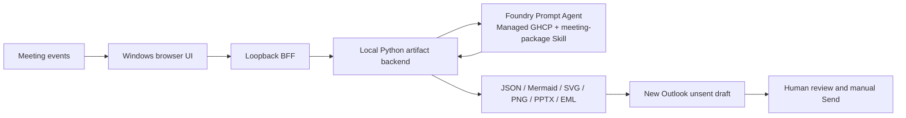

# Meeting Agent — Managed Agent Implementation

[](https://www.python.org/)
[](agent.yaml)
[](#outlook-safety)

The Managed Agent implementation inside the single Meeting Agent repository. It uses the same event, artifact, UI, PowerPoint, EML, and Outlook contracts as the classic direct Responses implementation, while moving the model loop and Skill lifecycle to a Foundry prompt agent with a managed GHCP harness.

> Author: Xinyu Wei

[Chinese](README-CN.md) | **English** | [Customer Start Here](CUSTOMER-START-HERE.md)

## What Is Real

| Layer | Real implementation | Evidence |
|---|---|---|
| Cloud runtime | A private-preview v1 deployment, published under the redacted alias `managed-meeting-agent`, was validated on 2026-07-23 with `status=active`, `harness=ghcp`, `gpt-oss-120b`, Responses protocol, and Entra authentication | [Dated cloud snapshot](evidence-managed-agent.json) |
| Cloud Skill | Versioned `meeting-package` Skill exposed through the Agent's Foundry Toolbox MCP | [Skill validation](evidence/managed-live/toolbox-skill-validation.json) |
| Meeting analysis | `ManagedAgentAnalyzer` sends the actual normalized meeting events and strict `MeetingAnalysis` schema to the deployed Agent | [Client contract](tests/test_managed_analyzer.py) |
| Artifact pipeline | Real JSON, Mermaid, SVG, 1280x720 PNG, editable six-slide PPTX, and MIME EML | [Artifact validation](evidence/managed-live/artifact-validation.json) |
| Browser UI | React workspace, loopback BFF, real streamed model deltas, artifact downloads, and Outlook draft action | Playwright desktop/mobile E2E |
| Mail safety | `X-Unsent: 1`, zero recipients by default, two real attachments, no send API or Send-button automation | `scripts/audit_no_send.py` |

No AOAI API-key fallback exists in the customer path. Static fixture analyzers are test-only and cannot be selected by the production host or CLI. The browser never receives an Azure token.

## Functional Scope

The implementation preserves the earlier Meeting Agent's user-visible contracts:

- Transcript text, normalized ASR JSONL, structured Meeting JSON, and visual-summary events.
- Strict event schema, ordering, idempotent duplicate handling, conflict detection, final-transcript selection, and source SHA-256.
- Real finite NDJSON streaming: `accepted`, `analysis_started`, model deltas, analysis, mind map, presentation, and completion.
- Structured title, summary, topics, decisions, action items, open questions, and renderer-neutral mind-map tree.
- Mind-map JSON, Mermaid, SVG, and nonblank PNG.
- Editable six-slide PowerPoint generated from the packaged template.
- Plain/HTML MIME EML with inline mind map, PNG and PPTX attachments, and manual Send only.
- React/Vite browser UI, secure local artifact downloads, path-traversal protection, and New Outlook handoff.
- CLI validation and recovery path plus Python, Node, and Playwright regression suites.

## Architecture




Foundry owns the model loop, GHCP harness, and Skill/Toolbox integration. The local application owns provider-neutral event validation, deterministic artifact generation, local file safety, and the human-controlled Outlook handoff. The application does not depend on the private-preview persistent-filesystem session API.

## Cloud Deployment

The checked-in source declares a dedicated prompt Agent:

- Agent example: `managed-meeting-agent`
- Version validated: `1`
- Model: `gpt-oss-120b`
- Harness: `ghcp`
- Skill: `meeting-package`
- Authentication: Entra only

`agent.yaml`, `instructions.md`, `skills/meeting-package/SKILL.md`, and `azure.yaml` are the deployment source. The checked-in capacity is a minimal example; quota and cost approval are required before increasing it. Deploy with an isolated Azure CLI and azd profile for the target tenant and subscription. A successful deploy creates a new immutable Agent version.

## Windows Start

### Prerequisites

- Windows 11 and New Outlook (`olk.exe`)
- Python 3.12
- Node.js 22 or newer
- Azure CLI signed in through a dedicated `AZURE_CONFIG_DIR`
- Access to the deployed Foundry Agent

Run in native Windows PowerShell:

```powershell
$env:AZURE_CONFIG_DIR = "$env:USERPROFILE\.azure-<tenant>-<subscription>"
az account show

.\scripts\start-ui.ps1 `
  -ManagedAgentEndpoint "https://<account>.services.ai.azure.com/api/projects/<project>/openai/v1/responses" `
  -ManagedAgentName "managed-meeting-agent" `
  -ManagedAgentVersion "1" `
  -AzureConfigDir $env:AZURE_CONFIG_DIR
```

Open `http://127.0.0.1:4173`. Choose transcript, ASR JSONL, or Meeting JSON input, then select **Generate meeting package**. The launcher validates the isolated Azure CLI profile and Foundry token scope before starting the local backend.

## CLI

Use the same Managed Agent environment in a developer shell:

```bash
export AZURE_CONFIG_DIR="$HOME/.azure-<tenant>-<subscription>"
export MANAGED_AGENT_ENDPOINT="https://<account>.services.ai.azure.com/api/projects/<project>/openai/v1/responses"
export MANAGED_AGENT_NAME="managed-meeting-agent"
export MANAGED_AGENT_VERSION="1"

python -m meeting_agent.cli build \
  --events examples/product-planning.jsonl \
  --output-dir artifacts/product-planning
```

The CLI fails closed when Entra authentication, the configured Agent version, the HTTP response, or the strict JSON contract is invalid.

## Validation

Two materially different inputs were sent to the deployed v1 Agent. Their source and analysis hashes differ, proving the runtime is input-dependent rather than a fixed scenario.

| Run | Source SHA-256 | Analysis SHA-256 | PPTX | EML |
|---|---|---|---:|---|
| `product-planning` | `413799e9783ac40a5a4e225a553bef94f33fd4c5990607add57e50547f91486b` | `e87a6b96f62ca039473282365ff7fdd016618067e711d8e55e859a72413df2ef` | 6 slides | `X-Unsent: 1`, 0 recipients, 2 attachments |
| `operations-review` | `88d71ad49cd875e2eb958c884e1ce2eb76a208576047df923decda79e7e109fb` | `52919943a30afa727cef8605a21b5215f65687e240017f537d65b3213e1104f3` | 6 slides | `X-Unsent: 1`, 0 recipients, 2 attachments |

Independent validation reopened both PNGs with Pillow, both PPTX files with `python-pptx`, both analyses with Pydantic, and both EML files with Python's MIME parser. This is functional evidence, not production certification or a model-quality benchmark.

Run local gates:

```bash
python3 -m venv .venv-wsl
source .venv-wsl/bin/activate
python -m pip install -r requirements-dev.txt
python -m pip install -e .
npm --prefix ui ci
npx --prefix ui playwright install chromium

python -m pytest
ruff check src tests scripts
python scripts/audit_no_send.py
npm --prefix ui test
npm --prefix ui run build
python scripts/run_ui_e2e.py
```

The default E2E mode is the visibly labeled test fixture. Set
`MEETING_AGENT_E2E_MODE=live` only with an authorized Managed Agent endpoint,
name, version, and credential configuration.

## Outlook Safety

The local BFF writes the generated EML atomically and starts `olk.exe <absolute-eml-path>`. It never clicks Send. The codebase contains no Graph `sendMail`, SMTP, EWS, Outlook object-model `.Send`, or UI Send activation path. Recipients may be entered before draft generation, but transmission always requires the user to review the compose window and select **Send** manually.

## Comparison With The Classic Implementation

The classic implementation remains at the repository root. This `managed-agent/` directory is the second implementation in the same repository, not a second repository. The comparison is fixed to baseline commit `667357dac6ee2dc30102d572c458c77861112bea`; the [parity manifest](evidence/managed-live/parity-manifest.json) records byte-for-byte SHA-256 equality for eight shared core modules, while artifact behavior is checked independently. [FEATURE-PARITY.md](FEATURE-PARITY.md) compares runtime ownership, authentication, Skill lifecycle, and operational responsibilities.

The classic path is prompt-style local orchestration, not a deployed Foundry Prompt Agent. This distinction keeps the comparison focused on the real ownership transfer introduced by the managed GHCP harness.

## Known Boundary

- Transcript capture, ASR, screen capture, and visual interpretation remain adapter-owned inputs.
- The current UI is loopback-only, not a public website.
- New Outlook handoff requires an interactive Windows desktop.
- Explicit cross-invocation persistent filesystem sessions are not claimed or required.
- The validated cloud Agent and model remain private-preview dependencies and must be revalidated before customer delivery in another tenant or project.
