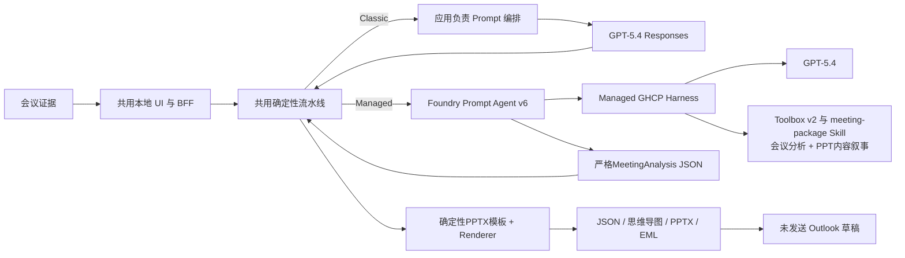

# Meeting Agent 两种实现方式对比

本文说明为什么同一个 Meeting Agent 产品保留两条实现路径，以及什么情况下应该选择其中一种。

**中文** | [English](IMPLEMENTATION-COMPARISON.md) | [产品主页](../../README-CN.md)

## 选型结论

两种实现都使用 GPT-5.4，也都保留相同的用户流程：会议事件经过校验后，生成结构化纪要、思维导图、可编辑 PowerPoint 和未发送的 New Outlook 草稿。区别不在于模型是否更聪明，而在于 **Agent Runtime（智能体运行时）由谁负责**。

- 如果只有一个应用、调用链短、强调可移植性和完整控制，优先选择 **Classic Direct Responses**。
- 如果更看重 Agent 身份、版本化 Instructions 和 Skill、Tool 集中治理、跨应用复用、持续评测及企业分发，选择 **Foundry Managed Agent**。

> Classic 调用的是模型；Managed 调用的是一个带模型、Instructions、Skill、Tool、身份和托管模型循环的版本化 Agent。

## 架构边界

共用的确定性流水线始终负责事件校验、排序、幂等、严格的 `MeetingAnalysis` 校验、产物生成、文件安全和人工发送边界。无论采用哪种实现，这些确定性控制都不交给 LLM。

## `GHCP Harness` 到底是什么

`GHCP` 是本项目已验证的 Prompt Agent Runtime（提示词智能体运行时）所使用的托管模型循环标识，不代表 Meeting Agent 必须运行在 GitHub，也不要求源码必须公开。Foundry 处理请求时不会临时读取 GitHub Repo。这里应当把两件事分开：**GitHub 可以承载源码和 CI/CD；Microsoft Foundry 才是 Agent Runtime 的运行位置。**

本项目使用的 Private Preview API 清楚体现了这条边界：Agent 定义只选择了 `harness: ghcp`，没有填写 Repo URL、Branch、Commit 或 GitHub Token；云端 Agent Version 也只返回同一个 Harness 标识。Harness 的定位、版本和运行由平台负责，不由 Wrapper 提供。

| 容易混淆的对象 | 存放或运行位置 | 是否必须使用 GitHub |
|---|---|---|
| Meeting Agent 源码：`agent.yaml`、Instructions、Skill、Wrapper 代码 | 本地目录、GitHub 私有/公开 Repo、Azure DevOps 或其他获批准的源码系统 | 否 |
| 部署后的 Agent 名称/版本、身份、Instructions 与 Toolbox 绑定 | Microsoft Foundry Project | 否 |
| `ghcp` Harness 执行 | Foundry 托管的 Prompt Agent Runtime | 不需要客户提供 Repo |
| 本项目历史部署使用的 Preview `azd` Extension | 从 Extension Registry 下载；当时的 Preview Registry 恰好使用 GitHub raw/release URL | GitHub 只是安装包分发通道，不是 Agent Runtime |
| LangGraph、Agent Framework、OpenAI Agents SDK、Semantic Kernel 或自定义模型循环 | 客户代码打包为 Foundry Hosted Agent | 不能靠替换 `harness` 字符串实现，应部署代码或容器 |

### `harness` 是不是框架选择器

在本 Repo 已验证的产品路径中，不是。Private Preview Managed Prompt Agent API 已验证接受并返回的值是 `ghcp`，没有证据证明还可以设置其他值；当前公开的 `PromptAgent` Schema 没有把 `harness` 暴露为可配置字段。因此，不能凭框架名称写出 `harness: langgraph`、`harness: semantic-kernel` 或 `harness: autogen`。需要自定义编排时，应选择 [Foundry Hosted Agent](https://learn.microsoft.com/azure/foundry/agents/concepts/hosted-agents)，而不是自造 Harness 值。

### 三条认证链必须分开

“托管”也不表示所有连接都使用同一种凭据：

1. **Wrapper → 已部署 Agent：** 本项目使用 Microsoft Entra Bearer Token 与 RBAC。GPT-5.4 模型 API Key 不能替代这条身份链；使用模型 Key 直连会绕过 Agent，退回 Classic 路径。
2. **Agent Runtime → 模型：** Foundry 解析 Agent 选择的模型部署，Wrapper 不传模型 API Key。
3. **Agent → Toolbox 或外部 Tool：** 根据具体连接选择 Agent Identity、Project Managed Identity、OAuth On-Behalf-Of 或平台管理的 Key-based Connection。

由此可以得到三个明确结论：源码可以放在私有 Repo；调用 Agent 时不会读取客户提供的 GitHub Repo，也不需要客户提供 GitHub 凭据；Tool API Key 不能用于调用 Agent Endpoint。这里不推断服务未公开的内部依赖。

公开参考：[Foundry Agent Service 概览](https://learn.microsoft.com/azure/foundry/agents/overview)与 [Hosted Agent](https://learn.microsoft.com/azure/foundry/agents/concepts/hosted-agents)。

## 详细对比

| 对比维度 | Classic：应用自编排 GPT-5.4 | Managed：Foundry Agent + GPT-5.4 | 对本项目的实际意义 |
|---|---|---|---|
| 主要调用对象 | GPT-5.4 Responses deployment | `managed-meeting-agent` 名称和不可变版本 | Classic 调模型；Managed 调 Agent 资源 |
| 模型 | GPT-5.4 | GPT-5.4 | 固定模型家族，避免把模型差异误当成框架差异 |
| Agent 资源 | 没有独立云端 Agent，应用本身承担 Orchestrator | Foundry Prompt Agent v6 | Agent 行为可以独立部署和版本化 |
| 模型循环责任方 | 本地应用代码 | Foundry 托管的 GHCP Harness | 这是两种实现最核心的责任转移 |
| Instructions | 由本地应用代码构造 | 随 Agent 部署 | Instructions 成为受管、可版本化资产 |
| 会议分析与 Presentation 方法 | 请求时注入本地 `SKILL.md` | Toolbox 分别引用 `meeting-package` 与 `presentation-story` Skill | 会议分析与 PPT 写作可独立演进；双 Skill Live 证据需要新 Agent Version |
| PowerPoint 契约与视觉格式 | 内置模板与确定性 Renderer | 严格`DeckPlan`、外置Deck/Style YAML与内置Template驱动Renderer | 故事线、映射、视觉Token和几何有独立版本责任方 |
| Tool 管理 | 每个应用分别注册和连接 | 通过 Toolbox 集中组织和版本化 | 多个 Agent 和客户端可以复用同一 Tool 集合 |
| Tool 循环 | 应用解释并继续 tool call | Managed Harness 选择 Tool 并继续循环 | Wrapper 中的 Agent loop 代码减少 |
| 模型认证 | 本地 Backend 保存 API Key | 使用 Entra 调用 Agent | Managed 客户路径不保存模型 API Key |
| Tool 认证 | 应用保管 Tool 凭据 | Agentic Identity 与 Project Scope RBAC | 权限可以跟随 Agent 身份而不是共享账号 |
| 发布单位 | 应用版本 | Agent 名称/版本 + 应用版本 | Agent 行为可以独立升级和回滚 |
| 扩缩容 | 应用负责集成层运行 | Prompt Agent Runtime 由 Foundry 托管 | 本项目无需维护 Agent 容器 |
| Streaming | 直接消费 Responses 文本 Delta | 消费 Managed Responses SSE Delta | UI 流式合同保持一致 |
| 输出校验 | 本地严格校验 `MeetingAnalysis` | Agent 返回后仍执行同一严格校验 | 平台托管不能替代应用侧防线 |
| 产物生成 | 本地确定性生成 | 仍由本地确定性生成 | JSON、PNG、PPTX、EML 可审计、可复现 |
| Outlook 边界 | 未发送草稿，由人手动 Send | 相同 | 两条路径均不自动发送邮件 |
| 可观测性 | 应用日志和自建 Trace | 可继续接入 Foundry Trace、Eval 和 Monitor | Managed 的平台生命周期更强，但每项声明仍需实测 |
| 跨应用复用 | Prompt 和 Tool 容易被复制 | 多个 Wrapper 可调用同一 Agent/Toolbox | 客户端和 Tool 越多，Managed 收益越明显 |
| 可移植性 | 较高，平台假设少 | 对 Foundry 依赖更强 | 以平台耦合换取治理能力 |
| 延迟 | 原理上控制链更短 | 多一层 Agent Runtime，可能还有 Tool 调用 | 本 Repo 不声称 Managed 更快 |
| 成本 | 模型调用与应用运维成本 | 模型/Tool 用量；Prompt Agent 无需客户维护容器 | 本 Repo 不声称 Managed 更便宜 |
| 模型质量 | 取决于模型、Prompt、Skill 和输入证据 | 同样取决于这些因素 | Managed 不会天然让 GPT-5.4 更聪明 |
| 故障面 | Key、Endpoint、Prompt/Parser、模型配额 | Entra、RBAC、Agent 版本、Toolbox、SSE、模型配额、Preview Runtime | Managed 治理更强，但平台排障链更长 |
| 最适合场景 | 单应用、少量 Tool、简单流程、强调可移植性 | 多应用、多 Tool、企业身份、版本治理、持续评测 | 根据运维模型选型，不根据产品标签选型 |

## 实测结果

下表来自可执行证据，而不是只根据架构图推断。

| 验证门 | Classic Direct Responses | Managed Agent v6 | 结论 |
|---|---|---|---|
| 真实模型 | GPT-5.4 `2026-03-05` | GPT-5.4 `2026-03-05` | 模型家族一致 |
| 认证 | 本地 Backend 使用 Key | Entra 调用 Agent，Agentic Identity 访问 Toolbox | 信任边界不同 |
| 跨输入差分 | 两份明显不同的输入生成不同标题和产物 Hash | 两份明显不同的输入生成不同标题和产物 Hash | 均非固定输出 |
| Streaming | 真实模型 Delta 先于产物阶段 | 真实 Managed SSE Delta 先于产物阶段 | UI 合同等价 |
| 思维导图 | 非空 1280×720 PNG 与 Mermaid 源码 | 非空 1280×720 PNG 与 Mermaid 源码 | 产物合同等价 |
| PowerPoint | 可编辑六页 PPTX | 可编辑六页 PPTX | 产物合同等价 |
| 邮件 | `X-Unsent: 1`、2 个附件、人工发送 | `X-Unsent: 1`、2 个附件、人工发送 | 安全边界等价 |
| 浏览器 | 桌面端/移动端 UI；带日期证据中 Console Error 为 0 | Windows ARM64 桌面端/移动端 `2/2`，Console Error 为 0 | 两条真实链路均通过 |
| 共用确定性行为 | 基线实现 | Schema、Artifact、Draft、安全和UI契约均有回归测试 | Presentation拆分会有意改变Models/Pipeline/Artifact模块 |

证据入口：

- [Classic GPT-5.4 真实验证](../../evidence/aoai-live-validation.json)
- [Classic 跨输入差分](../../evidence/aoai-runtime-differential.json)
- [Managed v6 Runtime](../evidence/managed-live-gpt54/runtime-validation.json)
- [Managed v6 跨输入差分](../evidence/managed-live-gpt54/dual-input-validation.json)
- [Managed v6 浏览器验证](../evidence/managed-live-gpt54/ui-validation.json)
- [大输入恢复与 SSE 错误路径验证](../evidence/managed-live-gpt54/large-input-recovery-validation.json)

这些证据证明功能行为和责任转移，不是模型质量 Benchmark、延迟对比、成本对比或生产认证。

## Managed Agent 真正带来的收益

### 本 Repo 已经证明

1. Managed 路径的 Wrapper 不再保存模型 API Key。
2. 客户端可以按 Agent 名称和不可变版本调用。
3. Instructions、`meeting-package` 与 `presentation-story` 成为可部署资产，而不是每次请求时临时拼装。
4. Toolbox 使用 Agent 专属身份和 Project Scope RBAC。
5. 应用不再承担模型循环，但继续保留严格的确定性控制。
6. 完成责任转移后，用户流程与产物安全合同没有回退。

当前源码已实现 `presentation-story`、严格 `DeckPlan`、外置 Deck/Style YAML 与确定性 Renderer。Skill 是行为资产，不是 Runtime 框架。Live v6 证据早于双 Skill 契约；下一 Agent Version 必须证明两个 Skill 可发现，并由 Agent 直接返回 `deck_plan`。

### 后续潜力，当前不作为已实现能力

- 多个 Agent 和应用共用企业 Toolbox。
- 通过 On-Behalf-Of 访问用户范围内的企业数据。
- 持续评测、版本晋级和回滚门禁。
- 端到端 Trace 分析与生产监控。
- Teams、Microsoft 365 Copilot 和 Entra Agent Registry 分发。
- A2A 与多 Agent 任务委派。
- 需要自定义编排代码时，进一步演进为 Hosted Agent。

这些属于平台演进方向。只有 Repo 中补齐对应 Runtime evidence 后，才能写成已实现能力。

## 作战教训如何变成工程门禁

| 现象 | 根因 | 固化措施 |
|---|---|---|
| 跨租户 Preview 部署返回 403 | Azure CLI 与 Azure Developer CLI 使用不同认证缓存，Extension 选中了 Home Tenant 身份 | 同时隔离两套 CLI，并在父部署进程显式传入 Tenant 与 Subscription |
| 控制面显示 Agent Active，但某个 Preview Session API 失败 | `active` 不代表每个 Runtime substrate 都已就绪；显式持久文件系统 Session 是独立产品边界 | Brain、Tool、Session API 和 Artifact 分别验收，不能以一种能力推断另一种能力 |
| 大型 Meeting 输入只显示泛化 Stream 错误 | GPT-5.4 deployment 只有 1K TPM，低于请求规模；空 `response.failed` 又遮住了后续详细 `error` | 按真实输入规划容量，并继续解析 SSE，直到取得详细错误 |
| WSL 重启后 UI Build 失败 | Node 与 Playwright 依赖放在 `/tmp` | 工具链迁移到持久用户目录 |
| Python Backend 看似卡死 | OneDrive/9p 路径上的运行环境阻塞在 `p9_client_rpc` | Backend 环境和可变 Runtime 状态放到 WSL ext4 |
| 代码没变但 Evidence Hash 改变 | Microsoft Purview 就地加密了 PPTX | Hash 关键证据避开自动 Office 加密边界，或从独立 Hash 附件恢复 |

`test_surfaces_error_after_empty_response_failed` 已覆盖实际 SSE 事件顺序，避免同类错误重新退化为无细节提示。

## 选择建议

以下条件同时成立时，选择 Classic：

- 只有一个应用拥有完整工作流；
- Tool 数量少，认证简单；
- 可移植性和本地调试优先；
- 不需要独立的 Agent 治理。

只要出现以下任一需求，就应重点考虑 Managed：

- 多个客户端或 Agent 需要复用同一套 Instructions、Skill 或 Toolbox；
- Tool 需要企业身份和最小权限 RBAC；
- Agent 行为需要独立版本化、晋级、评测和回滚；
- 组织需要托管 Agent Endpoint 与企业分发路径；
- 后续预计引入多 Agent 或用户身份透传。

结论不是“所有场景都用 Managed”，而是：**当业务能从 Agent Runtime 责任转移中获益时，才采用 Managed。**
