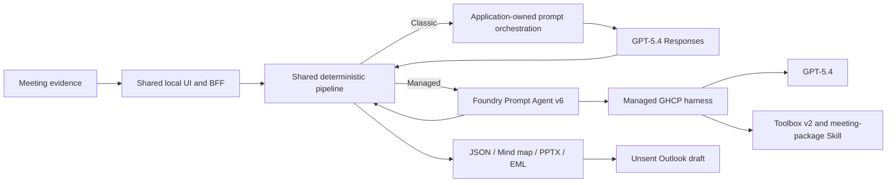

# Meeting Agent Implementation Comparison

This guide explains why the repository contains two implementations of one Meeting Agent product and when each implementation is appropriate.

[中文](IMPLEMENTATION-COMPARISON-CN.md) | **English** | [Product README](../../README.md)

## Decision Summary

Both implementations use GPT-5.4 and preserve the same user-visible workflow: validated meeting events become structured notes, a mind map, an editable PowerPoint, and an unsent New Outlook draft. The difference is not model intelligence. The difference is **who owns the agent runtime**.

- Choose **Classic direct Responses** when one application needs a short, portable path and the team wants complete control over each model call.
- Choose **Foundry Managed Agent** when agent identity, versioned instructions and Skills, centralized tools, governed access, shared reuse, evaluation, and enterprise distribution matter more than minimizing platform dependencies.

> Classic calls a model. Managed calls a versioned Agent that combines a model, instructions, Skills, tools, identity, and a managed model loop.

## Architecture Boundary

The shared deterministic pipeline remains responsible for event validation, ordering, idempotency, strict `MeetingAnalysis` validation, artifact generation, file safety, and the human-controlled Outlook boundary. The LLM does not own these deterministic controls in either implementation.

## Detailed Comparison

| Dimension | Classic: application-owned GPT-5.4 | Managed: Foundry Agent + GPT-5.4 | Meaning for this repository |
|---|---|---|---|
| Primary invocation target | GPT-5.4 Responses deployment | `managed-meeting-agent` name and immutable version | Classic addresses a model; Managed addresses an Agent resource |
| Model | GPT-5.4 | GPT-5.4 | The model family is held constant so the runtime boundary can be compared |
| Agent resource | None; the application is the orchestrator | Foundry Prompt Agent v6 | Agent behavior can be deployed and versioned independently |
| Model loop owner | Local application code | Foundry-managed GHCP harness | The principal responsibility transfer |
| Instructions | Constructed by local application code | Deployed with the Agent | Instructions become a managed, versioned asset |
| Meeting method | Local `SKILL.md` injected into requests | Versioned `meeting-package` Skill through Toolbox v2 | Skill lifecycle moves out of each wrapper |
| Tool catalog | Registered and wired by each application | Curated and versioned through Toolbox | Shared tools can be reused across agents and clients |
| Tool loop | Application interprets and continues tool calls | Managed harness selects and continues tool calls | Less agent-loop code in the wrapper |
| Model authentication | API key in the local backend | Entra authentication to the Agent | The Managed customer path carries no model API key |
| Tool authentication | Application-managed credentials | Agentic identity and project-scoped RBAC | Credentials and permissions can follow the Agent identity |
| Release unit | Application release | Agent name/version plus application release | Agent behavior can roll forward or back separately |
| Scaling | Application and inference integration are application-owned | Prompt Agent runtime is managed by Foundry | No Agent container is maintained for this Prompt Agent |
| Streaming | Direct Responses text deltas | Managed Responses SSE deltas | The UI contract remains the same |
| Output validation | Strict local `MeetingAnalysis` schema | The same strict local schema after the Agent response | Platform management does not replace application validation |
| Artifacts | Local deterministic generation | The same local deterministic generation | JSON, PNG, PPTX, and EML stay auditable and reproducible |
| Outlook boundary | Unsent draft; human selects Send | The same boundary | No automatic mail transmission in either path |
| Observability | Application logs and custom traces | Foundry tracing, evaluation, and monitoring can be added | Managed has a stronger platform lifecycle, but each claim still needs validation |
| Reuse | Prompt and tools are often copied between applications | Multiple clients can target one Agent/Toolbox | Managed value rises as the number of clients and tools grows |
| Portability | Higher; fewer platform assumptions | Higher Foundry dependency | Governance is gained in exchange for platform coupling |
| Latency | Shorter control path in principle | Adds Agent runtime and possible tool hops | This repository does not claim Managed is faster |
| Cost | Model and application operation | Model/tool usage; Prompt Agent has no customer-managed container | This repository does not claim Managed is cheaper |
| Model quality | Depends on model, prompt, Skill, and evidence | Depends on the same factors | Managed does not inherently make GPT-5.4 smarter |
| Failure surface | Key, endpoint, prompt/parser, model quota | Entra, RBAC, Agent version, Toolbox, SSE, model quota, Preview runtime | Managed improves governance but adds platform diagnostics |
| Best fit | One app, few tools, simple flow, portability | Shared agents/tools, enterprise identity, version governance, continuous evaluation | Select by operating model, not by marketing label |

## What Was Measured

The comparison is based on executable evidence, not architecture diagrams alone.

| Gate | Classic direct Responses | Managed Agent v6 | Result |
|---|---|---|---|
| Real model | GPT-5.4 `2026-03-05` | GPT-5.4 `2026-03-05` | Same model family |
| Authentication | Key in local backend | Entra to Agent; Agentic identity to Toolbox | Different trust boundary |
| Cross-input differential | Two materially different inputs produced different titles and artifact hashes | Two materially different inputs produced different titles and artifact hashes | No fixed-output implementation |
| Streaming | Real model delta before artifact stages | Real Managed SSE delta before artifact stages | Equivalent UI contract |
| Mind map | Nonblank 1280×720 PNG plus Mermaid source | Nonblank 1280×720 PNG plus Mermaid source | Equivalent artifact contract |
| PowerPoint | Editable six-slide PPTX | Editable six-slide PPTX | Equivalent artifact contract |
| Email | `X-Unsent: 1`, two attachments, human Send | `X-Unsent: 1`, two attachments, human Send | Equivalent safety boundary |
| Browser | Desktop/mobile UI, zero reported console errors in the dated live evidence | Windows ARM64 desktop/mobile `2/2`, zero console errors | Both live paths validated |
| Shared deterministic core | Baseline | Eight modules match byte-for-byte | Business invariants preserved |

Evidence:

- [Classic live GPT-5.4 validation](../../evidence/aoai-live-validation.json)
- [Classic cross-input differential](../../evidence/aoai-runtime-differential.json)
- [Managed v6 runtime](../evidence/managed-live-gpt54/runtime-validation.json)
- [Managed v6 cross-input differential](../evidence/managed-live-gpt54/dual-input-validation.json)
- [Managed v6 browser validation](../evidence/managed-live-gpt54/ui-validation.json)
- [Large-input recovery and SSE error-path validation](../evidence/managed-live-gpt54/large-input-recovery-validation.json)

These records prove functional behavior and responsibility transfer. They are not a model-quality benchmark, a latency comparison, a cost comparison, or production certification.

## What Managed Agent Really Adds

### Proven in this repository

1. The wrapper no longer stores a model API key for the Managed path.
2. Calls are pinned to an Agent name and immutable version.
3. Instructions and the `meeting-package` Skill are deployable assets rather than request-time prompt assembly.
4. Toolbox access uses an Agent-specific identity with project-scoped RBAC.
5. The application gives up the model loop while retaining strict deterministic controls.
6. The user workflow and artifact safety contract remain intact after that responsibility transfer.

### Potential, not yet claimed as complete here

- Shared enterprise Toolboxes across multiple agents and applications.
- On-Behalf-Of access to user-scoped enterprise data.
- Continuous evaluation and version promotion gates.
- End-to-end trace analytics and production monitoring.
- Teams, Microsoft 365 Copilot, and Entra Agent Registry distribution.
- A2A and multi-agent task delegation.
- Migration to a Hosted Agent if custom orchestration code later becomes necessary.

These are platform evolution paths. They must not be described as implemented until this repository contains corresponding runtime evidence.

## Failure Lessons Converted Into Engineering Gates

| Symptom | Root cause | Durable correction |
|---|---|---|
| Cross-tenant Preview deployment returned 403 | Azure CLI and Azure Developer CLI used different identity caches; the extension selected a home-tenant identity | Isolate both CLIs and pass tenant/subscription explicitly to the parent deployment process |
| Agent control plane appeared active while a Preview session API failed | Control-plane status did not prove every runtime substrate was ready; explicit persistent filesystem sessions were a separate product boundary | Validate Brain, tools, session APIs, and artifacts independently; do not infer one capability from another |
| Large meeting failed with a generic stream error | GPT-5.4 deployment was configured at 1K TPM, below the request size; an empty `response.failed` event hid the following detailed `error` event | Size deployment capacity for realistic inputs and continue parsing until the detailed SSE error arrives |
| UI build failed after restart | Node and Playwright libraries were stored in `/tmp` | Use persistent user tool directories |
| Python backend appeared hung | Running the environment from a OneDrive/9p path blocked in `p9_client_rpc` | Run the backend environment and mutable runtime state on WSL ext4 |
| Evidence hashes changed without code changes | Microsoft Purview encrypted PPTX files in place | Keep hash-critical evidence outside automatic Office encryption boundaries or recover from independently hashed attachments |

The detailed SSE error behavior is covered by `test_surfaces_error_after_empty_response_failed` so the original failure cannot regress to an unhelpful generic message.

## Selection Guide

Use Classic when all of the following are true:

- one application owns the workflow;
- tool count and tool authentication are simple;
- portability and local debugging dominate;
- independent Agent governance is unnecessary.

Use Managed when any of the following becomes important:

- multiple clients or agents reuse the same instructions, Skill, or Toolbox;
- tools require enterprise identity and least-privilege RBAC;
- Agent behavior must be versioned, promoted, evaluated, and rolled back independently;
- the organization wants a managed Agent endpoint and an enterprise distribution path;
- future multi-agent or user-identity flows are expected.

The recommendation is not “Managed everywhere.” It is: **use Managed when the operating model benefits from transferring Agent-runtime ownership to the platform.**
