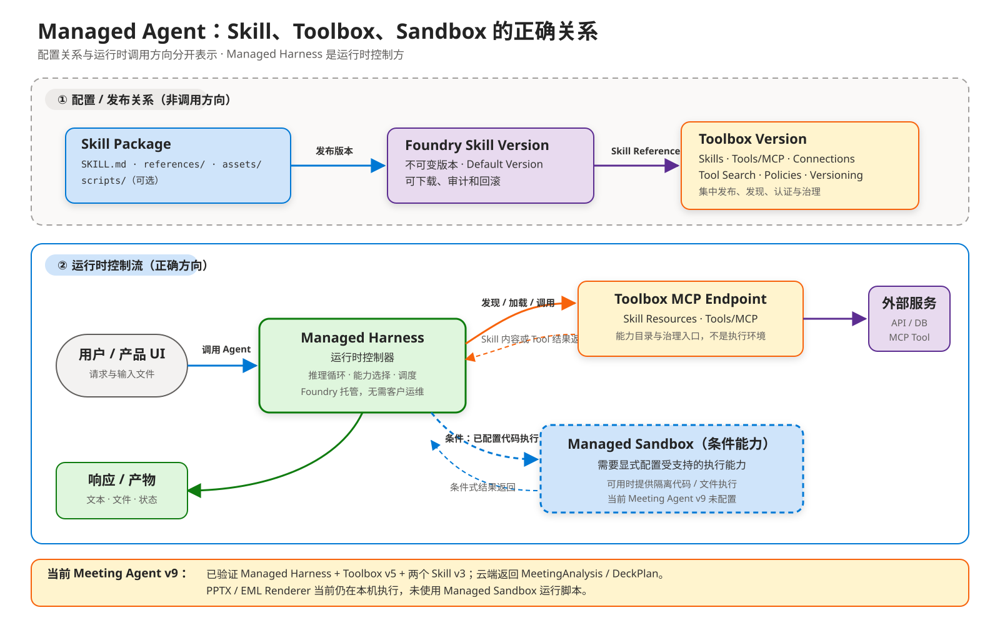
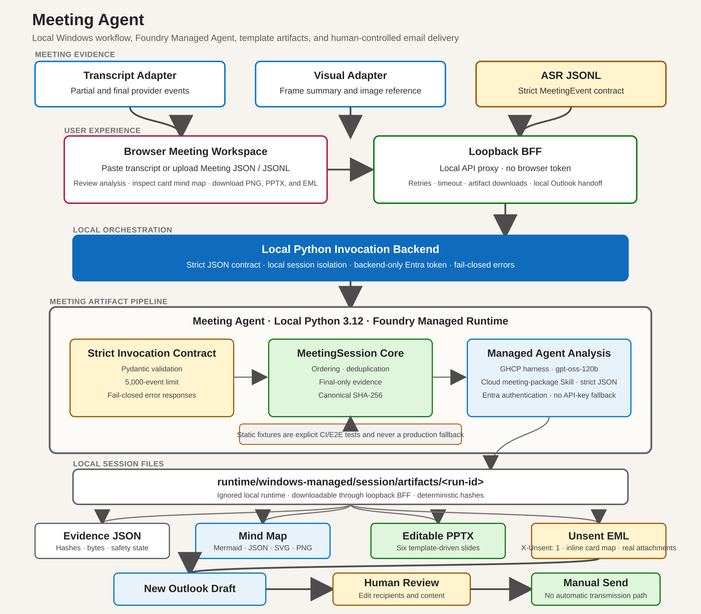
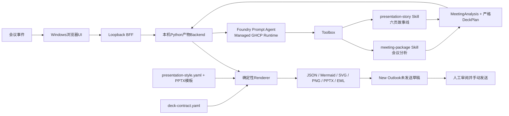

# Meeting Agent — Managed Agent 实现

[](https://www.python.org/)
[](../agent.yaml)
[](https://github.com/david-xinyuwei/david-share/actions/workflows/managed-meeting-agent-ci.yml)
[](#outlook-安全边界)

同一个 Meeting Agent Repo 中的 Managed Agent 实现。它与根目录 Classic Direct Responses 实现共用事件、产物、UI、PowerPoint、EML 和 Outlook 契约，同时把模型循环，以及会议分析/PPT 内容叙事 Skill 的生命周期交给使用 Managed GHCP Harness 的 Foundry Prompt Agent。确定性的 PowerPoint 渲染仍由应用负责。

> 作者：魏新宇

**中文** | [English](MANAGED-IMPLEMENTATION.md) | [客户快速入口](../CUSTOMER-START-HERE-CN.md) | [产品首页](https://github.com/david-xinyuwei/david-share/tree/master/Agents/Meeting-Agent)

## 微软官方定义与本项目映射

根据 Microsoft Learn，[Foundry Agent Service](https://learn.microsoft.com/azure/foundry/agents/overview) 是构建、部署和扩缩 AI Agent 的托管平台。一个 Agent 由模型、Instructions 和 Tools 三类核心组件组成；Agent Runtime 负责托管和扩缩 Prompt Agent 与 Hosted Agent，并管理 Conversation、Tool Call 和 Agent 生命周期。

微软官方手册区分两种主要 Agent 类型：

| 官方 Agent 类型 | Microsoft 定义 | 本 Repo 对应关系 |
|---|---|---|
| Prompt Agent | 由 Foundry 模型、Instructions、Tools 和自然语言 Prompt 组成的声明式 Agent。Foundry 负责运行，不需要客户维护 Agent Runtime 代码或容器。 | **本项目部署的 Managed Meeting Agent 属于这一类。** `agent.yaml`、`instructions.md`、`meeting-package` Skill 与 Toolbox Binding 共同定义云端 Agent 行为。 |
| Hosted Agent | 客户使用 Agent Framework、LangGraph、OpenAI Agents SDK、Semantic Kernel 或自定义代码实现编排，再部署到 Foundry 托管的容器计算；平台提供托管 Endpoint、扩缩、身份、状态和可观测性。 | **不是当前云端 Agent 类型。** 如果后续模型循环需要自定义代码或协议，才考虑迁移到 Hosted Agent。 |

Microsoft Learn 还说明，既有应用可以直接调用 Responses API，而不创建 Agent 资源。这是一种集成方式，不是第三种 Agent 类型。它在责任划分上接近 Classic 路径，但本 Repo 的 Classic 实现使用其文档说明的 Azure OpenAI Endpoint。

### 为什么 Managed Agent 使用 `PromptAgent.yaml`

`agent.yaml` 第一行是 YAML Language Server 的编写期指令（注释）：

```yaml
# yaml-language-server: $schema=https://raw.githubusercontent.com/microsoft/AgentSchema/refs/heads/main/schemas/v1.0/PromptAgent.yaml
```

它从微软公开 Schema Repo 读取 YAML 校验与编辑器补全规则；不会选择 Runtime Host，不会把业务源码上传到 GitHub，也不会让每次 Agent 请求经过 GitHub。它不是部署属性、Runtime Endpoint、Repo Binding 或托管指令。

微软官方 Schema 把 `kind` 固定为 `prompt`，Microsoft Learn 的 Prompt Agent Quickstart 在 SDK 与 REST 示例中同样使用 `kind: "prompt"`。**`kind: prompt` 说明“定义了哪种 Agent”，Foundry-managed 说明“运行责任由谁承担”。** 当前 AgentSchema 没有文档化的 `kind: managed` 或 `ManagedAgent.yaml`。官方不存在 `kind: managed`。把 `kind: prompt` 或 `PromptAgent.yaml` 改成自造的 Managed Kind，不会让 Agent “更 Managed”，只会让定义失效。

这几个词描述的是不同维度：

- **Prompt Agent** 是 Agent 类型：由声明式 Model、Instructions 和 Tools 构成。
- **Managed** 是运行责任：Foundry 托管 Agent Runtime，并负责扩缩和生命周期。
- **Hosted Agent** 是另一种主要 Agent 类型：客户编排代码运行在 Foundry 托管的容器计算中。

`raw.githubusercontent.com` 在这里只负责向开发工具分发微软公开 Schema 文件，不会把 Agent 绑定到客户 GitHub Repo；调用 Agent 也不需要客户提供 GitHub 凭据。这里不推断服务未公开的内部依赖。

本机 React UI、Loopback BFF 和 Python 产物 Backend 不是 Hosted Agent，也不会改变 Prompt Agent 的产品分类。它们属于确定性客户端/应用层：负责会议事件校验、调用已部署 Agent、严格校验结构化返回、生成文件并守住 Outlook 人工发送边界；本机没有重新实现模型循环。

### Instructions 和 Skill 是不是 Managed Agent 框架

不是。它们是 **Managed Prompt Agent 架构中的版本化行为资产**，不是 Agent Runtime 框架本身：

```text
Foundry Agent Service / Prompt Agent Runtime
└─ Agent Version
  ├─ Model
  ├─ Instructions
  └─ Toolbox Binding
    └─ Toolbox Version
      └─ Skill Reference
            └─ Skill Version（显式 Pin 时；否则跟随 Default）
```

Runtime 负责执行 Agent；Instructions 定义 Agent 级行为；Skill 封装可复用方法；Toolbox 负责治理和暴露 Skill/Tool。它们可以独立演进。当前 v9 证据证明 Toolbox v5 同时解析到 `meeting-package` v3 与 `presentation-story` v3；`presentation-story` 的 Default Version 和实际引用版本均为 v3。

### 官方生命周期与本 Repo 证据边界

Microsoft Learn 描述了 Create、Test、Version、Trace、Evaluate、Publish 和 Monitor 的完整生命周期，也说明 Microsoft Entra Agent Identity 用于治理及下游 Tool 认证，Toolbox 则提供集中管理、可版本化、兼容 MCP 的 Tool Surface。本 Repo 只声明已证实的子集：

| 微软官方能力 | 本 Repo 已证明 | 本 Repo 不声明 |
|---|---|---|
| Agent Version | 调用锁定已部署 Agent v9 的名称和不可变版本；v6 保留为带日期的历史证据 | 完整生产晋级或回滚服务 |
| Prompt Agent 托管 Runtime | Foundry 负责模型/Tool 循环；Wrapper 负责确定性校验和产物 | 托管编排天然提升模型智力、延迟或成本 |
| Agent Identity 与 Tool 认证 | 客户端路径使用 Entra；Toolbox Connection 使用 Agentic Identity 与 Scope RBAC | 所有 OBO、Published Identity 或外部 Tool 流程 |
| Toolbox 与 Skill | v9 证据覆盖 Toolbox v5 解析 `meeting-package` v3、规范化的 `presentation-story` v3，以及 Agent 原生严格 `DeckPlan` | Managed Sandbox 运行或所有可能的 Tool 类型 |
| Trace、Evaluation、Publishing、Monitoring | 仅保留架构扩展点 | 已完成生产监控、持续评测或企业渠道发布 |

官方来源（访问日期：2026-07-27）：

- [什么是 Microsoft Foundry Agent Service](https://learn.microsoft.com/azure/foundry/agents/overview)
- [快速入门：创建 Prompt Agent](https://learn.microsoft.com/azure/foundry/agents/quickstarts/prompt-agent)
- [Foundry Agent Service 中的 Hosted Agent](https://learn.microsoft.com/azure/foundry/agents/concepts/hosted-agents)
- [Agent 开发生命周期](https://learn.microsoft.com/azure/foundry/agents/concepts/development-lifecycle)
- [Agent Identity 概念](https://learn.microsoft.com/azure/foundry/agents/concepts/agent-identity)
- [创建、测试和部署 Toolbox](https://learn.microsoft.com/azure/foundry/agents/how-to/tools/toolbox)
- [Microsoft AgentSchema](https://github.com/microsoft/AgentSchema)
- [PromptAgent v1.0 Schema](https://raw.githubusercontent.com/microsoft/AgentSchema/refs/heads/main/schemas/v1.0/PromptAgent.yaml)

产品术语和可用范围可能变化。将这个依赖 Preview 的实现用于其他交付前，必须重新核对上述 Microsoft Learn 页面。

## 真实能力

| 层级 | 真实实现 | 证据 |
|---|---|---|
| 云端运行时 | `managed-meeting-agent` v9 已完成 `active`、`harness=ghcp`、`gpt-5.4`、严格 Agent 原生 `DeckPlan`、Responses 协议和 Entra 认证实测；v6 保留为历史基线 | [v9 Presentation 验证](../evidence/managed-live-gpt54/presentation-skill-v9-validation.json) · [v6 历史运行时验证](../evidence/managed-live-gpt54/runtime-validation.json) |
| 云端 Skill | Toolbox v5 通过 Agentic Identity 绑定 `meeting-package` v3 与规范化的 `presentation-story` v3（`SKILL.md`、`references/`、`assets/`） | [v9 Presentation 验证](../evidence/managed-live-gpt54/presentation-skill-v9-validation.json) · [历史 v2 Skill 正文 Hash](../evidence/managed-live/toolbox-skill-validation.json) |
| Presentation 源码契约 | 当前源码已拆分 `presentation-story`、严格 `DeckPlan`、`deck-contract.yaml`、`presentation-style.yaml` 与确定性 Renderer；部署 Reconciler 强制要求两个 Skill | `tests/test_presentation_responsibility_contract.py` · `tests/test_runtime_reconciler.py` |
| 会议分析 | `ManagedAgentAnalyzer`把实际标准化会议事件和严格`MeetingAnalysis` Schema发送到已部署Agent | [客户端契约](../tests/test_managed_analyzer.py) |
| 产物流水线 | 真实生成JSON、Mermaid、SVG、1280x720 PNG、可编辑六页PPTX和MIME EML | [GPT-5.4双输入验证](../evidence/managed-live-gpt54/dual-input-validation.json) |
| 浏览器UI | React工作区、loopback BFF、真实模型delta流、产物下载和Outlook草稿操作 | [ARM64桌面端/移动端验证](../evidence/managed-live-gpt54/ui-validation.json) |
| 邮件安全 | 默认`X-Unsent: 1`、0个收件人、2个真实附件，不包含发送API或Send按钮自动化 | `scripts/audit_no_send.py` |

客户主路径不存在AOAI API Key fallback。静态fixture analyzer只用于测试，生产Host和CLI无法选择。浏览器永远拿不到Azure token。



Managed Harness 内置按需 Hand/Sandbox 执行面，用于 Skill 代码、Shell、CLI 和文件操作；它与 Toolbox 能力目录分离，也不是常驻计算。当前 Meeting Agent v9 的 PPTX 与 EML Renderer 仍在本机运行，且带日期的 East US 2 证据没有实际调用 Private Preview Hand/Sandbox。Sandbox Ready 必须在 West US 2 环境通过真实内置 Hand Tool 调用单独证明。

## 功能范围

本实现完整保留早期Meeting Agent的用户可见契约：

- 支持转写文本、标准化ASR JSONL、结构化Meeting JSON和视觉摘要事件。
- 严格事件Schema、排序、幂等重复处理、冲突检测、最终转写选择和来源SHA-256。
- 真实有限NDJSON流：`accepted`、`analysis_started`、模型delta、分析完成、导图完成、PPT完成和整体完成。
- 结构化标题、摘要、主题、决策、行动项、开放问题，以及与渲染器解耦的思维导图树。
- 严格六段 `DeckPlan`，并单独生成可下载的 `deck-plan.json`。
- 思维导图JSON、Mermaid、SVG和非空PNG。
- 从内置模板生成可编辑六页PowerPoint。
- 同时包含纯文本和HTML正文的MIME EML，正文内嵌思维图，附带PNG与PPTX，只允许人工发送。
- React/Vite浏览器UI、安全的本机产物下载、路径穿越防护和New Outlook交接。
- CLI验证/恢复入口，以及Python、Node和Playwright回归测试。

## 架构





Foundry 负责模型循环、GHCP Harness 和 Skill/Toolbox 集成。本机应用负责与 Provider 解耦的事件校验、严格输出校验、确定性产物生成、本机文件安全，以及人工控制的 Outlook 交接。应用不依赖 Private Preview 的持久文件系统 Session API。

### PowerPoint 要求分别放在哪里

PowerPoint 生成现在由三个可独立版本化的契约驱动：

| 关注点 | 当前事实来源 | 原因 |
|---|---|---|
| 面向模型的 PPT 写作方法 | [`presentation-story` Skill](../skills/presentation-story/SKILL.md) | 负责证据约束、故事线、信息优先级和六个强类型 Section；通用 Meeting Skill 不再重复 Slides 指令 |
| 结构化交换契约 | `MeetingAnalysis` 中的严格 `DeckPlan`；另行输出 `deck-plan.json` | 防止自由文本 Prompt 直接变成文件生成契约，并让 Agent/Renderer 边界可审计 |
| 模板映射与空状态 | [`references/deck-contract.yaml`](../skills/presentation-story/references/deck-contract.yaml) | 作为 Agent 可读取的 Skill Reference，外置 Slide 顺序、容量、裁剪上限和不造事实的空状态文案 |
| 视觉 Token 与几何 | [`assets/presentation-style.yaml`](../skills/presentation-story/assets/presentation-style.yaml) 与内置 PPTX Template | 外置 Renderer 使用的字体、字号、颜色、间距和图片边距；Shape 几何继续由 Template 管理 |
| 可编辑 `.pptx` 生成 | 本机确定性 Renderer | 保持产物可审计，并让 Classic/Managed 共用同一契约 |

当前源码已经完成 Presentation Domain 松耦合。为了兼容已部署 v6，若响应缺少 `deck_plan`，本机会按同一外置 Deck Contract 生成确定性兼容计划；新部署则要求 Agent 直接返回 `deck_plan`。字体、颜色与 Shape 坐标仍有意保留在 Prompt 之外。

证据继续按版本区分：历史 v2 验证曾对比 `meeting-package` 正文 Hash，v6 记录旧单 Skill Toolbox；当前 v9 证据已经验证规范化的 `presentation-story` v3 多文件包、Toolbox v5、Agent 原生严格 `deck_plan`，以及本机浏览器上传 Meeting JSON 后生成可编辑 PPTX 与未发送 EML 的完整链路。

## 云端部署

代码声明了独立Prompt Agent：

- Agent示例：`managed-meeting-agent`
- 已验证版本：`9`（v6 保留为历史基线）
- 模型：`gpt-5.4`（`2026-03-05`，`GlobalStandard`）
- Harness：`ghcp`
- 当前源码 Skills：`meeting-package`、`presentation-story`
- 认证：仅Entra；Toolbox访问使用`AgenticIdentityToken`

`ghcp` 是 Foundry 托管的 Runtime 标识，不表示本 Repo 必须托管在 GitHub。Agent 源码可以来自私有 Repo、本地目录或企业源码系统；Foundry 每次调用的是已经部署的 Agent Version，不会在请求时读取源码仓库。关于源码与 Runtime 的边界、Harness 可选值证据和三条认证链，详见公开 Repo 的 [`GHCP Harness` 到底是什么](https://github.com/david-xinyuwei/david-share/blob/master/Agents/Meeting-Agent/managed-agent/docs/IMPLEMENTATION-COMPARISON-CN.md#ghcp-harness-到底是什么)。

`agent.yaml`、`instructions.md`、两个 Skill 目录与 `azure.yaml` 共同构成部署源。部署视图会 Hash Presentation Skill、`references/deck-contract.yaml` 与 `assets/presentation-style.yaml`。部署后，`scripts/reconcile_managed_runtime.py`强制要求两个 Skill Reference，必要时创建新 Toolbox Version，再绑定 Agentic Connection，并把最终 Agent Version 写入被忽略的 `.azure` 状态。

## Windows启动

### 前置条件

- Windows 11和New Outlook（`olk.exe`）
- Python 3.12
- Node.js 22或更高版本
- Azure CLI已在独立`AZURE_CONFIG_DIR`中登录
- 当前身份有权访问已部署Foundry Agent

在Windows原生PowerShell中运行：

```powershell
$env:AZURE_CONFIG_DIR = "$env:USERPROFILE\.azure-<tenant>-<subscription>"
az account show

.\scripts\start-ui.ps1 -AzureConfigDir $env:AZURE_CONFIG_DIR
```

启动器会从`.azure/managed-runtime.json`读取Endpoint、Agent Name和Active Version；连接既有部署时仍可显式传参。打开`http://127.0.0.1:4173`，选择转写、ASR JSONL或Meeting JSON输入，然后点击 **Generate meeting package**。

## CLI

开发Shell使用同一个Managed Agent环境：

```bash
export AZURE_CONFIG_DIR="$HOME/.azure-<tenant>-<subscription>"
export MANAGED_AGENT_ENDPOINT="https://<account>.services.ai.azure.com/api/projects/<project>/openai/v1/responses"
export MANAGED_AGENT_NAME="managed-meeting-agent"
export MANAGED_AGENT_VERSION="<active-version>"

python -m meeting_agent.cli build \
  --events examples/product-planning.jsonl \
  --output-dir artifacts/product-planning
```

Entra认证、配置的Agent版本、HTTP响应或严格JSON契约任一不满足时，CLI都会明确失败，不会静默fallback。

## 验证结果

两份内容显著不同的输入已通过Public源码部署的v6 Agent和GPT-5.4真实运行。它们的来源、分析、PPTX和EML Hash均不同，证明运行时和生成产物随输入变化，不是固定场景输出。

| 运行 | 来源SHA-256 | 分析SHA-256 | PPTX SHA-256 | EML |
|---|---|---|---|---|
| `product-planning` | `413799e9783ac40a5a4e225a553bef94f33fd4c5990607add57e50547f91486b` | `1989142296708857b6d4dcb2688d839bcbcbf5d563247d9d6e2b29d0aa2746e0` | `bd3f17ee2e17cd5f5df0b773d9c8005483e7592f8b8d7fcae8a88465729c023a` | `X-Unsent: 1`、0个收件人、2个附件 |
| `operations-review` | `88d71ad49cd875e2eb958c884e1ce2eb76a208576047df923decda79e7e109fb` | `fa7055acaa9e6a84fe6e53a0a85f763600cccfa0450ee6d15cf65da073604419` | `21f679b38ce96018dc0c58ed707ffb32779c7000e0ad43bcb46dfc8aeceadc5e` | `X-Unsent: 1`、0个收件人、2个附件 |

独立验收使用Pillow重新打开两张PNG，使用`python-pptx`重新解析两份PPTX，使用Pydantic重新校验两份Analysis，并使用Python MIME Parser重新解析两封EML。这是功能证据，不是生产认证，也不是模型质量Benchmark。

本机质量门禁：

```bash
python3 -m venv .venv-wsl
source .venv-wsl/bin/activate
python -m pip install -r requirements-dev.txt
python -m pip install -e .
npm --prefix ui ci
npx --prefix ui playwright install chromium

python -m pytest
ruff check src tests scripts
python scripts/audit_no_send.py
npm --prefix ui test
npm --prefix ui run build
python scripts/run_ui_e2e.py
```

默认E2E模式是页面明确标注的测试fixture。只有在配置了获授权的Managed
Agent endpoint、name、version和credential后，才设置
`MEETING_AGENT_E2E_MODE=live`。

## Outlook安全边界

本机BFF以原子方式写入生成的EML，然后执行`olk.exe <absolute-eml-path>`。它不会点击Send。代码库不包含Graph `sendMail`、SMTP、EWS、Outlook Object Model `.Send`或UI Send自动化。用户可以在生成草稿前填写收件人，但邮件始终需要用户在Compose窗口中审阅并手动点击 **Send**。

## 与Classic实现对比

Classic实现保留在Repo根目录；当前`managed-agent/`是同一个Repo里的第二条实现路径，不是第二个Repo。比较固定到baseline commit `667357dac6ee2dc30102d572c458c77861112bea`；[Parity Manifest](../evidence/managed-live/parity-manifest.json)记录六个共用模块逐字节SHA-256一致，并记录两个DeckPlan有意差异的Baseline/Current Hash。Artifact与UI行为另行独立验证。[FEATURE-PARITY-CN.md](../FEATURE-PARITY-CN.md)集中比较运行时责任、认证、Skill生命周期和运维边界。

Classic路径是本机prompt-style编排，并不是已经部署的Foundry Prompt Agent。这个区分让对比聚焦于Managed GHCP Harness真正带来的责任转移。

## 已知边界

- 转写采集、ASR、屏幕捕获和视觉理解仍由上游Adapter负责。
- 当前UI仅监听loopback，不是公网网站。
- New Outlook交接需要交互式Windows桌面。
- 不声明、也不依赖跨Invocation的持久文件系统Session。
- Prompt Agent、Managed GHCP Harness和Toolbox Skill集成仍属于Preview依赖；迁移到其他Tenant或Project后必须重新验证。
- 历史v2 / `gpt-oss-120b`证据保留在`evidence/managed-live/`；当前GPT-5.4证据位于`evidence/managed-live-gpt54/`。
