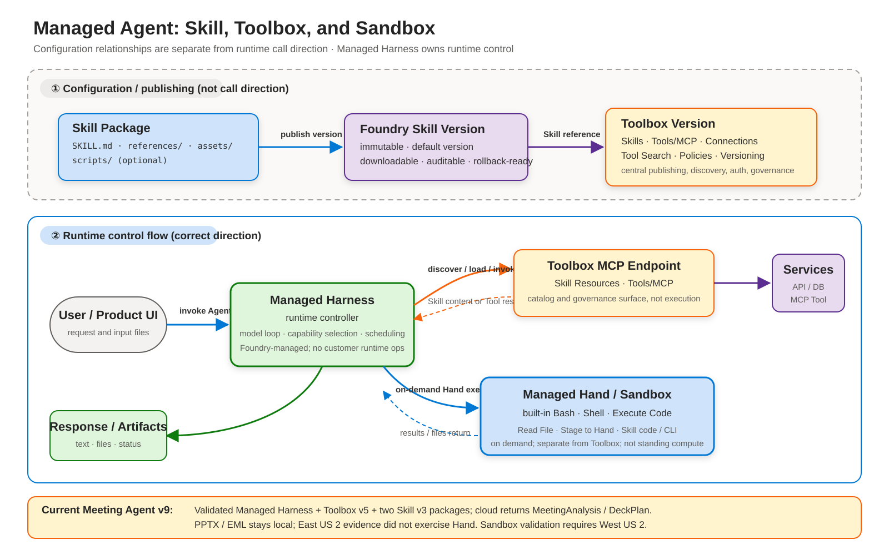
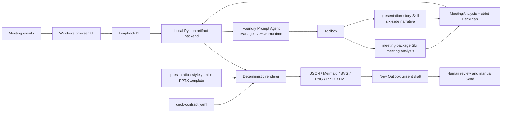

# Meeting Agent — Managed Agent Implementation

[](https://www.python.org/)
[](../agent.yaml)
[](https://github.com/david-xinyuwei/david-share/actions/workflows/managed-meeting-agent-ci.yml)
[](#outlook-safety)

The Managed Agent implementation inside the single Meeting Agent repository. It uses the same event, artifact, UI, PowerPoint, EML, and Outlook contracts as the classic direct Responses implementation, while moving the model loop and meeting-analysis/slide-narrative Skill lifecycle to a Foundry prompt agent with a managed GHCP harness. Deterministic PowerPoint rendering remains in the application.

> Author: Xinyu Wei

[Chinese](MANAGED-IMPLEMENTATION-CN.md) | **English** | [Customer Start Here](../CUSTOMER-START-HERE.md) | [Product Home](https://github.com/david-xinyuwei/david-share/tree/master/Agents/Meeting-Agent)

## Microsoft Official Definition and This Implementation

According to Microsoft Learn, [Foundry Agent Service](https://learn.microsoft.com/azure/foundry/agents/overview)
is a managed platform for building, deploying, and scaling AI agents. An Agent
combines a model, instructions, and tools. The Agent Runtime hosts and scales
Prompt and Hosted agents and manages conversations, tool calls, and Agent
lifecycle.

Microsoft documents two primary Agent types:

| Official Agent type | Microsoft definition | Mapping in this repository |
|---|---|---|
| Prompt Agent | A declaratively defined Agent combining a Foundry model, instructions, tools, and natural-language prompts. Foundry runs it; there is no customer Agent-runtime code or container to maintain. | **This is the deployed Managed Meeting Agent.** `agent.yaml`, `instructions.md`, the `meeting-package` Skill, and Toolbox bindings define the cloud Agent behavior. |
| Hosted Agent | Customer orchestration code or a framework such as Agent Framework, LangGraph, OpenAI Agents SDK, Semantic Kernel, or custom code, deployed to Foundry-managed container compute with managed endpoint, scaling, identity, state, and observability. | **Not the current cloud Agent type.** It is the migration path if the model loop later requires custom code or protocols. |

Microsoft also documents calling the Responses API directly from existing
application code without creating an Agent resource. That is an integration
pattern, not a third Agent type. It corresponds conceptually to the Classic
ownership model, although this repository's Classic path uses its documented
Azure OpenAI endpoint.

### Why `PromptAgent.yaml` is correct for a Managed Agent

The first line of `agent.yaml` is a YAML Language Server authoring directive:

```yaml
# yaml-language-server: $schema=https://raw.githubusercontent.com/microsoft/AgentSchema/refs/heads/main/schemas/v1.0/PromptAgent.yaml
```

It downloads Microsoft's public authoring schema for editor validation and
completion. It does not select a runtime host, upload source to GitHub, or add
GitHub to the request path. It is not a deployment property, runtime endpoint,
repository binding, or hosting instruction.

The official schema fixes `kind` to `prompt`, and the Microsoft Learn Prompt
Agent quickstart uses the same `kind: "prompt"` in SDK and REST examples.
**`kind: prompt` identifies what is declared;
Foundry-managed identifies who runs it.** There is no documented
`kind: managed` or `ManagedAgent.yaml` in the current AgentSchema. There is no `kind: managed` value.
Replacing `kind: prompt` or the `PromptAgent.yaml` schema with a made-up Managed
kind would make the definition invalid rather than make it more managed.

The terms describe different dimensions:

- **Prompt Agent** is the Agent type: declarative model, instructions, and tools.
- **Managed** is the operating model: Foundry runs the Agent Runtime and manages
  its scaling and lifecycle.
- **Hosted Agent** is the other primary Agent type: customer orchestration code
  runs on Foundry-managed container compute.

The `raw.githubusercontent.com` host only distributes Microsoft's public schema
file to development tools. It does not bind this Agent to a customer GitHub
repository, and Agent invocation does not require customer GitHub credentials.
This statement does not infer undisclosed internal service dependencies.

The local React UI, loopback BFF, and Python artifact backend are not a Hosted
Agent and do not contradict the Prompt Agent classification. They are deterministic client/application
layers: they validate meeting events, invoke the deployed Agent, validate its
structured result, generate files, and enforce the human Outlook boundary. The
model loop itself is not reimplemented locally.

### Are Instructions and Skills the Managed Agent framework?

No. They are **versioned behavior assets inside the Managed Prompt Agent
architecture**, not the Agent Runtime framework itself:

```text
Foundry Agent Service / Prompt Agent Runtime
└─ Agent Version
  ├─ Model
  ├─ Instructions
  └─ Toolbox binding
    └─ Toolbox Version
      └─ Skill reference
            └─ Skill Version (when explicitly pinned; otherwise default)
```

The runtime executes the Agent. Instructions define Agent-wide behavior. A Skill
packages a reusable method. Toolbox governs and exposes Skills and tools. These
layers can evolve independently. Current v9 evidence shows Toolbox v5 resolving
both `meeting-package` v3 and `presentation-story` v3; the presentation Skill's
default and resolved versions are both v3. Historical v6 evidence only showed a
versioned Toolbox referencing a named Skill, without proving an immutable Skill
version pin rather than default-version resolution.

### Official lifecycle and governance versus this repository's evidence

Microsoft documents a broader create, test, version, trace, evaluate, publish,
and monitor lifecycle. It also documents Microsoft Entra Agent identities for
governance and downstream tool authentication, and Toolbox as a centrally
managed, versioned MCP-compatible tool surface. This repository demonstrates a
specific subset rather than claiming the entire platform:

| Microsoft-documented capability | Proven here | Not claimed here |
|---|---|---|
| Agent versions | Calls pin the name and immutable version of deployed Agent v9; v6 remains dated historical evidence | A complete production promotion or rollback service |
| Prompt Agent managed runtime | Foundry owns the model/tool loop; the wrapper owns deterministic validation and artifacts | That managed orchestration improves model intelligence, latency, or cost |
| Agent identity and tool authentication | Entra authenticates the client path; the Toolbox connection uses Agentic identity with scoped RBAC | Every possible OBO, published-identity, or external-tool flow |
| Toolbox and Skill | v9 evidence covers Toolbox v5 resolving `meeting-package` v3 and normalized `presentation-story` v3, plus an Agent-authored strict `DeckPlan` | Runtime use of Managed Sandbox or every possible Tool type |
| Trace, evaluation, publishing, monitoring | Architectural extension points only | Production monitoring, continuous evaluation, or enterprise-channel publication |

Official sources, retrieved 2026-07-27:

- [What is Microsoft Foundry Agent Service?](https://learn.microsoft.com/azure/foundry/agents/overview)
- [Quickstart: Create a Prompt Agent](https://learn.microsoft.com/azure/foundry/agents/quickstarts/prompt-agent)
- [Hosted agents in Foundry Agent Service](https://learn.microsoft.com/azure/foundry/agents/concepts/hosted-agents)
- [Agent development lifecycle](https://learn.microsoft.com/azure/foundry/agents/concepts/development-lifecycle)
- [Agent identity concepts](https://learn.microsoft.com/azure/foundry/agents/concepts/agent-identity)
- [Create, test, and deploy a Toolbox](https://learn.microsoft.com/azure/foundry/agents/how-to/tools/toolbox)
- [Microsoft AgentSchema](https://github.com/microsoft/AgentSchema)
- [PromptAgent v1.0 schema](https://raw.githubusercontent.com/microsoft/AgentSchema/refs/heads/main/schemas/v1.0/PromptAgent.yaml)

Product terminology and availability can change. Recheck these Microsoft Learn
pages before using this Preview-dependent implementation for another delivery.

## What Is Real

| Layer | Real implementation | Evidence |
|---|---|---|
| Cloud runtime | `managed-meeting-agent` v9 is validated with `status=active`, `harness=ghcp`, `gpt-5.4`, strict Agent-authored `DeckPlan`, Responses protocol, and Entra authentication; v6 remains the historical baseline | [v9 Presentation validation](../evidence/managed-live-gpt54/presentation-skill-v9-validation.json) · [v6 historical runtime validation](../evidence/managed-live-gpt54/runtime-validation.json) |
| Cloud Skill | Toolbox v5 binds `meeting-package` v3 and the normalized `presentation-story` v3 package (`SKILL.md`, `references/`, `assets/`) through Agentic identity authentication | [v9 Presentation validation](../evidence/managed-live-gpt54/presentation-skill-v9-validation.json) · [historical v2 Skill body hash](../evidence/managed-live/toolbox-skill-validation.json) |
| Presentation source contract | Current source separates `presentation-story`, strict `DeckPlan`, `deck-contract.yaml`, `presentation-style.yaml`, and deterministic rendering; the deployment reconciler requires both Skills | `tests/test_presentation_responsibility_contract.py` · `tests/test_runtime_reconciler.py` |
| Meeting analysis | `ManagedAgentAnalyzer` sends the actual normalized meeting events and strict `MeetingAnalysis` schema to the deployed Agent | [Client contract](../tests/test_managed_analyzer.py) |
| Artifact pipeline | Real JSON, Mermaid, SVG, 1280x720 PNG, editable six-slide PPTX, and MIME EML | [GPT-5.4 dual-input validation](../evidence/managed-live-gpt54/dual-input-validation.json) |
| Browser UI | React workspace, loopback BFF, real streamed model deltas, artifact downloads, and Outlook draft action | [ARM64 desktop/mobile validation](../evidence/managed-live-gpt54/ui-validation.json) |
| Mail safety | `X-Unsent: 1`, zero recipients by default, two real attachments, no send API or Send-button automation | `scripts/audit_no_send.py` |

No AOAI API-key fallback exists in the customer path. Static fixture analyzers are test-only and cannot be selected by the production host or CLI. The browser never receives an Azure token.



The Managed Harness includes an on-demand Hand/Sandbox execution surface for
Skill code, shell commands, CLIs, and file operations. It is separate from the
Toolbox catalog and is not standing compute. This Meeting Agent v9 keeps its PPTX
and EML renderers local, and its dated East US 2 evidence did not exercise the
private-preview Hand/Sandbox path. Sandbox readiness requires a separate West US 2
deployment and real built-in Hand tool calls.

## Functional Scope

The implementation preserves the earlier Meeting Agent's user-visible contracts:

- Transcript text, normalized ASR JSONL, structured Meeting JSON, and visual-summary events.
- Strict event schema, ordering, idempotent duplicate handling, conflict detection, final-transcript selection, and source SHA-256.
- Real finite NDJSON streaming: `accepted`, `analysis_started`, model deltas, analysis, mind map, presentation, and completion.
- Structured title, summary, topics, decisions, action items, open questions, and renderer-neutral mind-map tree.
- Strict six-section `DeckPlan` plus a separately downloadable `deck-plan.json` artifact.
- Mind-map JSON, Mermaid, SVG, and nonblank PNG.
- Editable six-slide PowerPoint generated from the packaged template.
- Plain/HTML MIME EML with inline mind map, PNG and PPTX attachments, and manual Send only.
- React/Vite browser UI, secure local artifact downloads, path-traversal protection, and New Outlook handoff.
- CLI validation and recovery path plus Python, Node, and Playwright regression suites.

## Architecture




Foundry owns the model loop, GHCP harness, and Skill/Toolbox integration. The local application owns provider-neutral event validation, strict output validation, deterministic artifact generation, local file safety, and the human-controlled Outlook handoff. The application does not depend on the private-preview persistent-filesystem session API.

### Where the PowerPoint requirements live

PowerPoint generation now uses three separately versioned contracts:

| Concern | Current source of truth | Why |
|---|---|---|
| Model-facing presentation writing | [`presentation-story` Skill](../skills/presentation-story/SKILL.md) | Owns evidence-grounded story, information priority, and six typed sections; the generic meeting Skill no longer duplicates slide instructions |
| Structured exchange contract | Strict `DeckPlan` nested in `MeetingAnalysis`; `deck-plan.json` is emitted separately | Prevents free-form Prompt output from becoming a file-generation contract and makes the Agent/renderer boundary auditable |
| Template mapping and empty states | [`references/deck-contract.yaml`](../skills/presentation-story/references/deck-contract.yaml) | Externalizes slide order, capacities, clipping limits, and evidence-safe empty states as an Agent-readable Skill reference |
| Visual tokens and geometry | [`assets/presentation-style.yaml`](../skills/presentation-story/assets/presentation-style.yaml) plus the packaged PPTX template | Externalizes renderer-owned fonts, sizes, colors, spacing, and image margin; the template remains the source of shape geometry |
| Editable `.pptx` generation | Local deterministic renderer | Keeps artifact creation auditable and preserves the same contract in Classic and Managed paths |

The source implementation now completes the presentation-domain separation.
For backward compatibility, responses from the deployed v6 Agent that omit
`deck_plan` receive a deterministic plan derived from the same external deck
contract. New deployments are instructed to return `deck_plan` directly. Fonts,
colors, and shape coordinates remain outside the Prompt by design.

Evidence remains version-scoped. The historical v2 validation compared the
cloud `skill://meeting-package/SKILL.md` body to the public source by SHA-256,
and v6 validates the original single-Skill Toolbox. The current v9 evidence
validates the normalized multi-file `presentation-story` v3 package, Toolbox v5,
strict Agent-authored `deck_plan`, and the local browser JSON-upload path through
editable PPTX and unsent EML generation.

## Cloud Deployment

The checked-in source declares a dedicated prompt Agent:

- Agent example: `managed-meeting-agent`
- Version validated: `9` (v6 retained as the historical baseline)
- Model: `gpt-5.4` (`2026-03-05`, `GlobalStandard`)
- Harness: `ghcp`
- Skills in current source: `meeting-package`, `presentation-story`
- Authentication: Entra only; Toolbox access uses `AgenticIdentityToken`

`ghcp` is a Foundry-managed runtime identifier, not a requirement to host this
repository in GitHub. The Agent source can come from a private repository or a
local/enterprise source system; Foundry invokes the deployed Agent version
rather than reading a source repository per request. See
[What `GHCP Harness` means](https://github.com/david-xinyuwei/david-share/blob/master/Agents/Meeting-Agent/managed-agent/docs/IMPLEMENTATION-COMPARISON.md#what-ghcp-harness-means--and-what-it-does-not-mean)
for the source/runtime boundary, supported-value evidence, and authentication
chains.

`agent.yaml`, `instructions.md`, both Skill directories, and `azure.yaml` are the deployment source. The deployment view hashes the Presentation Skill, `references/deck-contract.yaml`, and `assets/presentation-style.yaml`. After deployment, `scripts/reconcile_managed_runtime.py` requires both Skill references, creates a new Toolbox version when needed, binds the Agentic connection, and writes the resulting Agent version under ignored `.azure` state.

## Windows Start

### Prerequisites

- Windows 11 and New Outlook (`olk.exe`)
- Python 3.12
- Node.js 22 or newer
- Azure CLI signed in through a dedicated `AZURE_CONFIG_DIR`
- Access to the deployed Foundry Agent

Run in native Windows PowerShell:

```powershell
$env:AZURE_CONFIG_DIR = "$env:USERPROFILE\.azure-<tenant>-<subscription>"
az account show

.\scripts\start-ui.ps1 -AzureConfigDir $env:AZURE_CONFIG_DIR
```

The launcher reads the endpoint, name, and active Agent version from `.azure/managed-runtime.json`. Explicit parameters remain available when connecting to an existing deployment. Open `http://127.0.0.1:4173`, choose transcript, ASR JSONL, or Meeting JSON input, then select **Generate meeting package**.

## CLI

Use the same Managed Agent environment in a developer shell:

```bash
export AZURE_CONFIG_DIR="$HOME/.azure-<tenant>-<subscription>"
export MANAGED_AGENT_ENDPOINT="https://<account>.services.ai.azure.com/api/projects/<project>/openai/v1/responses"
export MANAGED_AGENT_NAME="managed-meeting-agent"
export MANAGED_AGENT_VERSION="<active-version>"

python -m meeting_agent.cli build \
  --events examples/product-planning.jsonl \
  --output-dir artifacts/product-planning
```

The CLI fails closed when Entra authentication, the configured Agent version, the HTTP response, or the strict JSON contract is invalid.

## Validation

Two materially different inputs were sent through the public-source v6 Agent with GPT-5.4. Their source, analysis, PPTX, and EML hashes differ, proving the runtime and generated artifacts are input-dependent rather than fixed scenario output.

| Run | Source SHA-256 | Analysis SHA-256 | PPTX SHA-256 | EML |
|---|---|---|---|---|
| `product-planning` | `413799e9783ac40a5a4e225a553bef94f33fd4c5990607add57e50547f91486b` | `1989142296708857b6d4dcb2688d839bcbcbf5d563247d9d6e2b29d0aa2746e0` | `bd3f17ee2e17cd5f5df0b773d9c8005483e7592f8b8d7fcae8a88465729c023a` | `X-Unsent: 1`, 0 recipients, 2 attachments |
| `operations-review` | `88d71ad49cd875e2eb958c884e1ce2eb76a208576047df923decda79e7e109fb` | `fa7055acaa9e6a84fe6e53a0a85f763600cccfa0450ee6d15cf65da073604419` | `21f679b38ce96018dc0c58ed707ffb32779c7000e0ad43bcb46dfc8aeceadc5e` | `X-Unsent: 1`, 0 recipients, 2 attachments |

Independent validation reopened both PNGs with Pillow, both PPTX files with `python-pptx`, both analyses with Pydantic, and both EML files with Python's MIME parser. This is functional evidence, not production certification or a model-quality benchmark.

Run local gates:

```bash
python3 -m venv .venv-wsl
source .venv-wsl/bin/activate
python -m pip install -r requirements-dev.txt
python -m pip install -e .
npm --prefix ui ci
npx --prefix ui playwright install chromium

python -m pytest
ruff check src tests scripts
python scripts/audit_no_send.py
npm --prefix ui test
npm --prefix ui run build
python scripts/run_ui_e2e.py
```

The default E2E mode is the visibly labeled test fixture. Set
`MEETING_AGENT_E2E_MODE=live` only with an authorized Managed Agent endpoint,
name, version, and credential configuration.

## Outlook Safety

The local BFF writes the generated EML atomically and starts `olk.exe <absolute-eml-path>`. It never clicks Send. The codebase contains no Graph `sendMail`, SMTP, EWS, Outlook object-model `.Send`, or UI Send activation path. Recipients may be entered before draft generation, but transmission always requires the user to review the compose window and select **Send** manually.

## Comparison With The Classic Implementation

The classic implementation remains at the repository root. This `managed-agent/` directory is the second implementation in the same repository, not a second repository. The comparison is fixed to baseline commit `667357dac6ee2dc30102d572c458c77861112bea`; the [parity manifest](../evidence/managed-live/parity-manifest.json) records byte-for-byte SHA-256 equality for six shared modules and baseline/current hashes for two intentional DeckPlan differences. Artifact and UI behavior are checked independently. [FEATURE-PARITY.md](../FEATURE-PARITY.md) compares runtime ownership, authentication, Skill lifecycle, and operational responsibilities.

The classic path is prompt-style local orchestration, not a deployed Foundry Prompt Agent. This distinction keeps the comparison focused on the real ownership transfer introduced by the managed GHCP harness.

## Known Boundary

- Transcript capture, ASR, screen capture, and visual interpretation remain adapter-owned inputs.
- The current UI is loopback-only, not a public website.
- New Outlook handoff requires an interactive Windows desktop.
- Explicit cross-invocation persistent filesystem sessions are not claimed or required.
- The Prompt Agent, managed GHCP harness, and Toolbox Skill integration remain Preview dependencies and must be revalidated before customer delivery in another tenant or project.
- Historical v2 / `gpt-oss-120b` evidence remains under `evidence/managed-live/`; current GPT-5.4 evidence is under `evidence/managed-live-gpt54/`.
