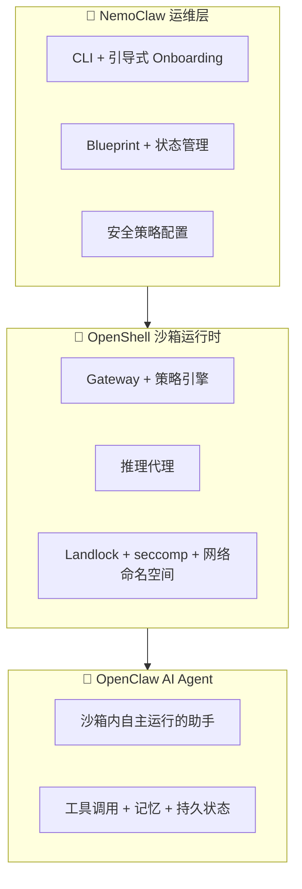
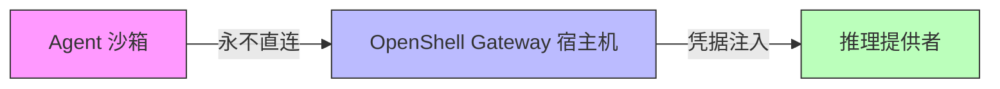
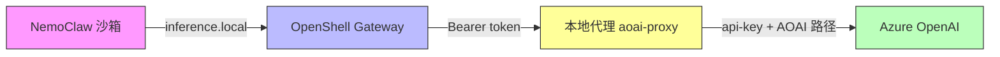

# NemoClaw 在 Azure 上的部署指南与技术分析

## 摘要

| 项目 | 发现 |
|:---|:---|
| **NemoClaw 是什么** | NVIDIA 开源参考栈，用于在 OpenShell 沙箱中安全运行 OpenClaw AI Agent |
| **Azure 支持** | 无官方 Azure 部署路径；可手动安装在 Azure Linux VM 上 |
| **成熟度** | Alpha 软件（2026年3月起）。非生产就绪。API 可能随时变更 |
| **多用户** | 单用户单沙箱设计。无原生多用户或跨虚机管理能力 |
| **Azure OpenAI** | 不原生支持 AOAI 作为推理提供者。需要本地代理做 Header/路径转换 |
| **推理验证** | 通过 NemoClaw 沙箱成功调用 Azure OpenAI GPT-5.4 |
| **核心价值** | AI Agent 安全沙箱（网络/文件系统/进程/推理四层隔离） |
| **建议** | 适合评估 Agent 安全沙箱方案。不适合企业多用户生产部署 |

> **测试环境**：Azure Linux VM（Ubuntu 24.04, 4 vCPU, 8GB RAM, 1TB 数据盘），NemoClaw v0.0.14，OpenShell v0.0.26，OpenClaw v2026.3.11。测试于 2026 年 4 月。

---

## 目录

- [架构概览](#架构概览)
- [支持的推理提供者](#支持的推理提供者)
- [Azure 部署指南](#azure-部署指南)
- [Azure OpenAI 集成](#azure-openai-集成)
- [安全特性](#安全特性)
- [多用户能力](#多用户能力)
- [已知限制](#已知限制)
- [复现步骤](#复现步骤)

---

## 架构概览

NemoClaw 是三层栈架构：



**推理路由** — Agent 永远不直接访问推理提供者：



---

## 支持的推理提供者

| 提供者 | 状态 | 协议 | 模型 |
|:---|:---|:---|:---|
| NVIDIA Endpoints | Tested ✅ | OpenAI 兼容 | Nemotron 3 Super 120B, MiniMax M2.5, GLM-5 |
| OpenAI | Tested ✅ | 原生 OpenAI | gpt-5.4, gpt-5.4-mini |
| Other OpenAI-compatible | Tested ✅ | 自定义 | 任何 `/v1/chat/completions` 端点 |
| Anthropic | Tested ✅ | 原生 Anthropic | claude-sonnet-4-6 |
| Google Gemini | Tested ✅ | OpenAI 兼容 | gemini-2.5-pro/flash |
| Local Ollama | 有限支持 ⚠️ | Local Ollama API | 本地模型 |
| Local vLLM | 实验性 🧪 | Local OpenAI 兼容 | 需要 `NEMOCLAW_EXPERIMENTAL=1` |
| Local NVIDIA NIM | 实验性 🧪 | Local OpenAI 兼容 | 需要 NIM GPU |

**Azure OpenAI 不在内置提供者列表中。** 需要通过 "Other OpenAI-compatible endpoint" 配合本地代理接入（见 [Azure OpenAI 集成](#azure-openai-集成)）。

---

## Azure 部署指南

### 前置条件

- Azure Linux VM（推荐 Ubuntu 24.04）
- 最低：4 vCPU, 8GB RAM, **40GB+ 磁盘**（沙箱镜像约 4GB 压缩）
- Docker 已安装并运行
- Node.js 22.16+（安装器通过 nvm 自动处理）

### 第 1 步：安装 Docker

```bash
sudo apt-get update && sudo apt-get install -y docker.io
sudo systemctl enable --now docker
```

### 第 2 步：安装 NemoClaw

```bash
curl -fsSL https://www.nvidia.com/nemoclaw.sh | bash
```

安装器会自动完成：Node.js 22 安装、NemoClaw 源码构建、OpenShell CLI 安装、Onboarding 向导。

### 第 3 步：配置推理提供者

非交互模式：

```bash
NEMOCLAW_PROVIDER=custom \
NEMOCLAW_ENDPOINT_URL="http://localhost:9100/v1" \
NEMOCLAW_MODEL="gpt-5.4" \
COMPATIBLE_API_KEY="<your-key>" \
nemoclaw onboard --non-interactive
```

### 第 4 步：连接沙箱

```bash
nemoclaw my-assistant connect
```

### 第 5 步：与 Agent 对话

```bash
# 单条消息
openclaw agent --agent main -m "你好，你是谁？" --session-id demo

# 交互式 TUI
openclaw tui
```

---

## Azure OpenAI 集成

### 兼容性问题

NemoClaw 的 "Other OpenAI-compatible endpoint" 发送请求时使用：
- `Authorization: Bearer <key>` Header
- 标准 OpenAI 路径：`/v1/chat/completions`、`/v1/responses`

Azure OpenAI 需要：
- `api-key: <key>` Header
- Azure 专用路径：`/openai/deployments/{model}/chat/completions?api-version=...`

### 解决方案：本地代理

在宿主机上部署一个轻量 Node.js 代理，自动完成两种格式之间的转换：



代理处理内容：
1. **Header 转换**：`Authorization: Bearer xxx` → `api-key: xxx`
2. **路径转换**：`/v1/chat/completions` → `/openai/deployments/{model}/chat/completions?api-version=...`

### 代理设置

```bash
# 配置环境变量
export AOAI_BASE="https://<your-aoai-resource>.openai.azure.com"
export AOAI_MODEL="gpt-5.4"

# 启动代理
node scripts/aoai-proxy.js &

# 验证
curl -s http://127.0.0.1:9100/v1/chat/completions \
  -H "Authorization: Bearer <your-key>" \
  -H "Content-Type: application/json" \
  -d '{"model":"gpt-5.4","messages":[{"role":"user","content":"hello"}],"max_completion_tokens":10}'
```

### 磁盘空间注意事项

NemoClaw 需要较大磁盘空间（约 12-15GB）。如果 OS 盘较小（30GB），建议将 Docker 和 k3s 数据迁移到数据盘：

```bash
systemctl stop docker docker.socket
mkdir -p /data/docker
rsync -aP /var/lib/docker/ /data/docker/
rm -rf /var/lib/docker && ln -s /data/docker /var/lib/docker
systemctl start docker
```

---

## 安全特性

NemoClaw 提供四层防护：

| 层级 | 机制 | 运行时可更新 |
|:---|:---|:---|
| **网络** | 默认拒绝所有出站。YAML 策略。操作者审批未列出的主机 | 是 |
| **文件系统** | Landlock LSM。`/sandbox` 只读。仅特定路径可写 | 否（创建时锁定） |
| **进程** | seccomp 过滤。ulimit 512 进程。禁止提权 | 否（创建时锁定） |
| **推理** | 所有调用通过 Gateway 路由。凭据永不进入沙箱 | 是 |

---

## 多用户能力

| 能力 | 状态 |
|:---|:---|
| 单用户单沙箱 | ✅ 主要设计 |
| Channel Messaging（Telegram/Discord/Slack） | ✅ 多用户通过 Bot 共享一个 Agent |
| 每用户独立沙箱 | ❌ 不原生支持 |
| 跨虚机管理 | ❌ 不支持 |
| 中央管理面板 | ❌ 不支持 |
| RBAC / 用户访问控制 | ❌ 不支持 |
| Kubernetes 多 Pod | 🧪 实验性（需要 DinD 特权 Pod） |

NemoClaw **无法实现跨虚机管理**。每个实例是完全独立的，没有集群发现、消息总线或共享状态。

---

## 已知限制

| 限制 | 影响 | 绕行方案 |
|:---|:---|:---|
| Alpha 软件 | API 和行为可能变更 | 仅用于评估 |
| 不原生支持 Azure OpenAI | 无法直连 AOAI | 使用本地代理（本 Repo 提供） |
| Web Dashboard 远程认证 Bug | 设备配对在 SSH 隧道场景失败 | 使用 CLI 或 TUI |
| K8s 需要特权 Pod | 企业安全合规风险 | 使用 VM 部署 |
| 约 12-15GB 磁盘需求 | 小 OS 盘空间不足 | 使用数据盘 |
| 无跨实例通信 | 沙箱完全隔离 | 设计如此，无法绕行 |
| npm 包名被占位 | `npm install -g nemoclaw` 安装的是假空包 | 只用官方安装脚本 |

---

## 复现步骤

```bash
# 1. 创建 Azure Linux VM（Ubuntu 24.04, Standard_D4s_v3 或类似）
# 2. SSH 登录
# 3. 安装 Docker
sudo apt-get update && sudo apt-get install -y docker.io
sudo systemctl enable --now docker

# 4. 安装 NemoClaw
curl -fsSL https://www.nvidia.com/nemoclaw.sh | bash
source ~/.bashrc

# 5. 启动 AOAI 代理（如果使用 Azure OpenAI）
export AOAI_BASE="https://<your-resource>.openai.azure.com"
export AOAI_MODEL="gpt-5.4"
node scripts/aoai-proxy.js &

# 6. 运行 Onboarding
nemoclaw onboard
# 选择 "Other OpenAI-compatible endpoint"
# 输入: http://127.0.0.1:9100
# 输入 API Key 和模型名

# 7. 连接并测试
nemoclaw my-assistant connect
openclaw agent --agent main -m "Hello!" --session-id test
```

### 预期输出

```
🦞 OpenClaw 2026.3.11 (29dc654)

你好，我刚醒来，还在认识自己。
```

---

## 参考

- [NemoClaw GitHub](https://github.com/NVIDIA/NemoClaw)（19.1k stars, Apache 2.0）
- [NemoClaw 官方文档](https://docs.nvidia.com/nemoclaw/latest/)
- [OpenShell GitHub](https://github.com/NVIDIA/OpenShell)
- [OpenClaw](https://openclaw.ai/)
- [NemoClaw 架构](https://docs.nvidia.com/nemoclaw/latest/reference/architecture.html)
- [推理选项](https://docs.nvidia.com/nemoclaw/latest/inference/inference-options.html)
- [网络策略](https://docs.nvidia.com/nemoclaw/latest/reference/network-policies.html)

---

*作者：魏新宇 (Xinyu Wei) — Microsoft AI GBB Senior System Engineer*
*日期：2026 年 4 月*
