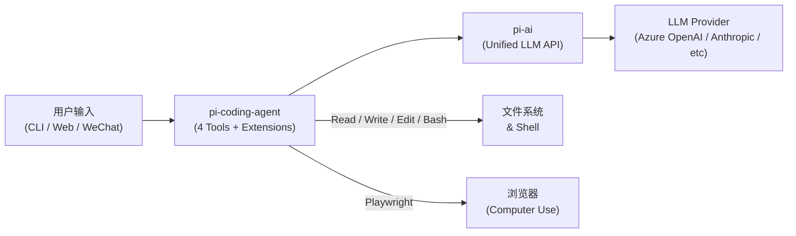
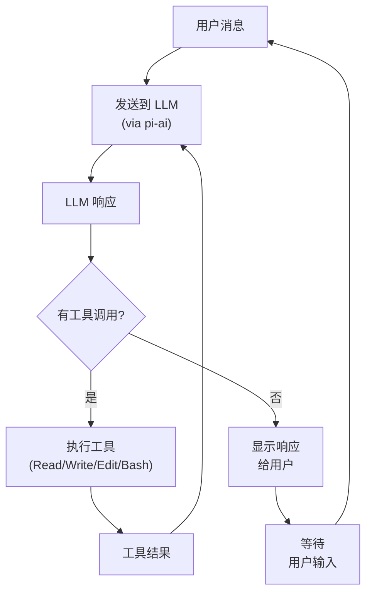
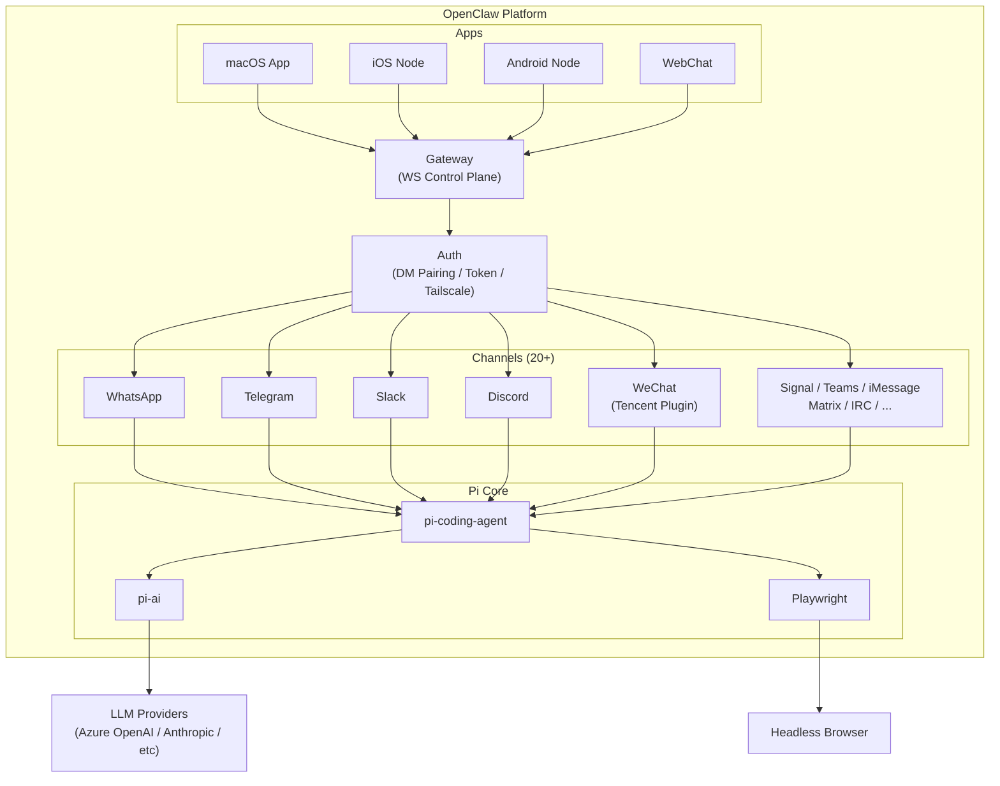
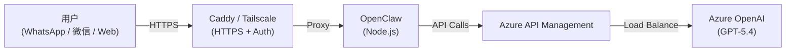
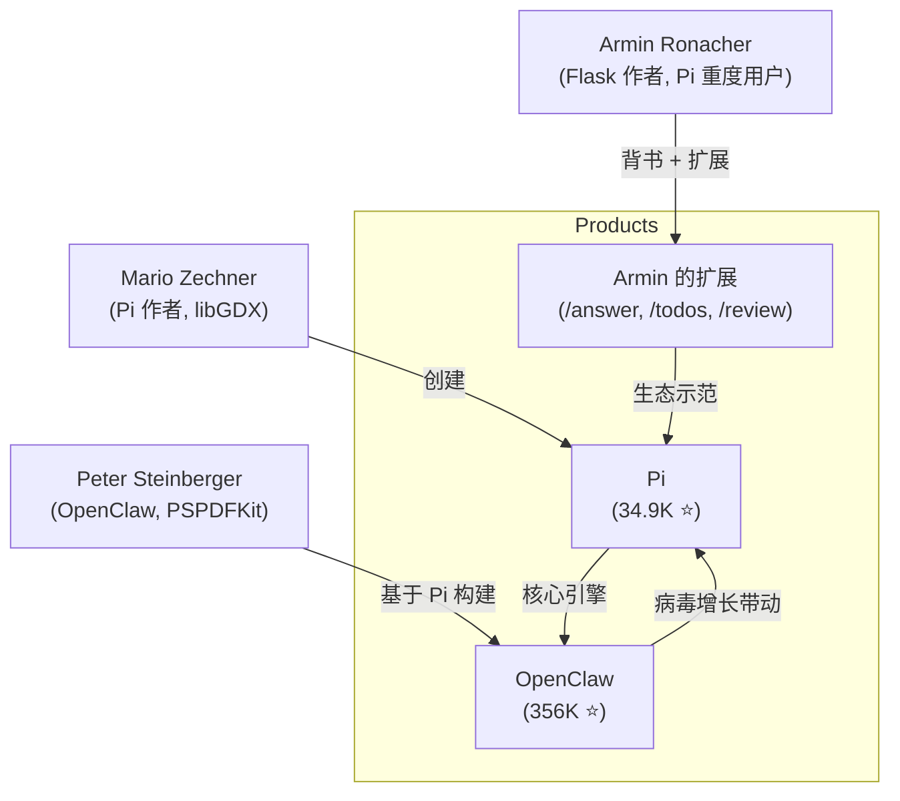

# Pi Agent 与 OpenClaw 架构：极简主义编码代理设计

> **作者**: 魏新宇 (Xinyu Wei)
>
> **日期**: 2026 年 4 月
>
> **TL;DR**: Pi 是一个极简编码代理（Coding Agent），拥有 **4 个默认工具**（Read、Write、Edit、Bash），配合统一的 LLM API 支持 **22+ 个模型提供商**。OpenClaw 在 Pi 基础上扩展为**个人 AI 助手**，增加了 20+ 通信渠道（WhatsApp、Telegram、Slack、Discord、微信、Signal、iMessage、Teams、Web 等）。本文分析 Pi 的架构设计决策、扩展系统，以及在 Azure 上的实际部署经验。

---

## 目录

- [Executive Summary](#executive-summary)
- [1. 架构概览](#1-架构概览)
- [2. 核心设计哲学](#2-核心设计哲学)
- [3. pi-ai：统一 LLM API 层](#3-pi-ai统一-llm-api-层)
- [4. pi-coding-agent：Pi 的核心](#4-pi-coding-agentpi-的核心)
- [5. 扩展系统](#5-扩展系统)
- [6. 会话管理](#6-会话管理)
- [7. OpenClaw：生产环境中的 Pi](#7-openclaw生产环境中的-pi)
- [8. 在 Azure 上部署](#8-在-azure-上部署)
- [9. 已知问题与排查](#9-已知问题与排查)
- [10. 实测验证](#10-实测验证)
- [11. 价值分析：Pi vs 原始 LLM API](#11-价值分析pi-vs-原始-llm-api)
- [12. 生态分析：Pi 为何走红](#12-生态分析pi-为何走红)
- [13. 参考资料](#13-参考资料)

---

## Executive Summary

| 维度 | 详情 |
|------|------|
| **Pi 是什么** | 极简编码代理框架：7 个包、4 个默认工具（7 个可用）、系统提示词不到 50 行 |
| **OpenClaw 是什么** | Pi + 20+ 通信渠道（WhatsApp / Telegram / Slack / Discord / 微信 / Signal / iMessage / Teams / Web 等），作为个人 AI 助手 |
| **核心创新** | "Agent 应当自我扩展" — 设计上不做 MCP、不做 Sub-agents、不做 Plan Mode |
| **LLM 支持** | 通过 `pi-ai` 统一 API 支持 22+ 个提供商（OpenAI、Azure OpenAI、Anthropic、Google、xAI、Groq、Bedrock 等） |
| **跨模型切换** | 会话可在不同模型间无缝切换；Thinking Blocks 自动转换为 `<thinking>` 标签 |
| **浏览器自动化** | 内置 Playwright 支持，用于 Computer Use 场景 |
| **我们的部署** | Azure OpenAI GPT-5.4 + API Management + 微信集成 + Caddy/Tailscale 反向代理 |

### 关键人物

| 人物 | 角色 | 备注 |
|------|------|------|
| Mario Zechner ([@badlogic](https://github.com/badlogic)) | Pi 作者 | `pi-mono` 仓库维护者 |
| Peter Steinberger ([@steipete](https://github.com/steipete)) | OpenClaw 作者 | 将 Pi 扩展为个人 AI 助手平台 |
| Armin Ronacher ([@mitsuhiko](https://github.com/mitsuhiko)) | Flask 作者、Pi 重度用户 | 撰写了有影响力的 [Pi 设计分析博文](https://lucumr.pocoo.org/2026/1/31/pi/) |

---

## 1. 架构概览

Pi 以 **Monorepo**（`pi-mono`）形式组织，包含 7 个包，每个包职责明确：

```
pi-mono/
├── pi-ai/              → 统一多模型 LLM API（22+ 提供商）
├── pi-agent-core/      → Agent 运行时：工具调用与状态管理
├── pi-coding-agent/    → 交互式编码代理 CLI（4 个核心工具）
├── pi-tui/             → 终端 UI 库（差分渲染）
├── pi-web-ui/          → Web 组件（AI 聊天界面）
├── pi-mom/             → Slack Bot 集成
└── pi-pods/            → vLLM 部署管理 CLI
```

### 包详情

| 包名 | npm | 用途 |
|------|-----|------|
| `pi-agent-core` | `@mariozechner/pi-agent-core` | Agent 运行时：工具调用与状态管理 |
| `pi-ai` | `@mariozechner/pi-ai` | LLM 抽象层：10 种 API 适配器、工具调用、流式输出、上下文序列化 |
| `pi-coding-agent` | `@mariozechner/pi-coding-agent` | 编码代理本体：4 个工具 + 扩展系统 + 会话管理 |
| `pi-tui` | `@mariozechner/pi-tui` | 终端 UI，差分渲染实现响应式 CLI |
| `pi-web-ui` | `@mariozechner/pi-web-ui` | Web 组件，用于在 Web 应用中嵌入 AI 聊天 |
| `pi-mom` | `@mariozechner/pi-mom` | 基于 Pi 构建的 Slack Bot |
| `pi-pods` | `@mariozechner/pi-pods` | 部署和管理 vLLM 实例 |

### 架构调用链



---

## 2. 核心设计哲学

Pi 的设计哲学可以用一个词概括：**极致简约**（Radical Minimalism）。当大多数编码代理在不断*增加*功能（MCP、Sub-agents、Plan Mode、权限弹窗）时，Pi 刻意*减少*它们。

### 4 工具原则

Pi 只给代理提供 **4 个默认工具**（另有 3 个可选工具）：

| 工具 | 默认 | 功能 |
|------|------|------|
| **Read** | 是 | 读取文件内容 |
| **Write** | 是 | 创建或覆盖文件 |
| **Edit** | 是 | 对文件执行定向编辑 |
| **Bash** | 是 | 执行 Shell 命令：安装包、跑测试、调 API、Git 操作 |
| **Grep** | 可选 | 按模式搜索文件内容 |
| **Find** | 可选 | 按名称/路径查找文件 |
| **Ls** | 可选 | 列出目录内容 |

默认 4 个工具已经足够，因为 Bash 是万能逃生门 — grep、find、ls 都可以通过 Bash 完成。可选工具为模型提供了结构化的替代方案。

> **"Bash 是万能逃生门。"** — 有了 Shell 访问权限，代理可以做开发者能做的一切：安装工具、查询 API、运行构建、管理 Git — 无需专门的工具。

### Pi 刻意不做的事

| 功能 | Pi 的立场 | 理由 |
|------|-----------|------|
| **MCP（Model Context Protocol）** | 不实现 | "Agent 应自我扩展" — 通过 Bash + TypeScript 扩展实现 |
| **Sub-agents / Multi-agent** | 不实现 | 一个拥有完整上下文的 Agent 优于编排多个 Agent |
| **Plan Mode** | 不实现 | Agent 可在正常推理流中规划 |
| **权限弹窗** | 不实现 | 用容器或扩展自行实现沙箱 |
| **内置 RAG** | 不实现 | Agent 可通过 Bash 使用 `grep`、`find`、`cat` |

这一哲学源于一个观察：**大多数代理的复杂性是偶发的（accidental），而非本质的（essential）**。一个能力强的模型配上文件 I/O 和 Shell 访问，就能完成专用工具所做的事 — 往往还更灵活。

正如 Armin Ronacher 在其[分析文章](https://lucumr.pocoo.org/2026/1/31/pi/)中所言：

> "Pi 之所以引人注目，恰恰在于它*不做*什么。通过抵制添加抽象层的冲动，它不挡模型的路。"

### 系统提示词（System Prompt）

Pi 使用**业内最短的系统提示词之一** — 不到 50 行。其哲学：一个能力强的模型需要的是指令，不是手把手教。提示词定义 4 个工具和少量行为准则，然后让开路。

---

## 3. pi-ai：统一 LLM API 层

`pi-ai` 是 Pi 的基座 — 一个 TypeScript 库，通过 10 种 API 适配器为 22+ 个 LLM 提供商提供统一接口。

### 支持的 API 适配器（10 种）

| 适配器 | 覆盖的提供商 |
|--------|-------------|
| `openai-completions` | OpenAI、Groq、Cerebras、Together、xAI、DeepSeek、Fireworks 等 |
| `openai-responses` | OpenAI Responses API |
| `openai-codex-responses` | OpenAI Codex（ChatGPT Plus/Pro 订阅） |
| `anthropic-messages` | Anthropic Claude（直连） |
| `google-generative-ai` | Google Gemini |
| `google-gemini-cli` | Google Cloud Code Assist（Gemini CLI） |
| `google-vertex` | Google Vertex AI |
| `mistral-conversations` | Mistral AI |
| `azure-openai-responses` | Azure OpenAI（专用适配器） |
| `bedrock-converse-stream` | AWS Bedrock（Claude、Titan 等） |

### 跨模型无缝切换（Cross-Provider Handoff）

pi-ai 最强大的特性之一是**在同一会话中无缝切换模型**：

```
会话以 Claude Sonnet 开始
  ↓ （用户切换到 GPT-5.4）
Thinking Blocks 自动转换：Claude 的 thinking → <thinking> 标签
  ↓ （用户切换到 Gemini）
上下文通过 JSON.stringify/parse 序列化
  ↓
对话带着完整历史继续
```

其实现依赖：
1. **统一响应格式** — 所有提供商的响应都归一化为通用格式
2. **Thinking Block 自动转换** — 在不同提供商特有格式间自动转换
3. **上下文序列化** — 使用原生 JSON：`JSON.stringify()` 保存，`JSON.parse()` 恢复

### OAuth 支持

pi-ai 支持以下平台的 OAuth 认证：
- Anthropic Console
- OpenAI Codex
- GitHub Copilot
- Gemini CLI
- Antigravity

### TypeBox 类型安全

工具参数使用 TypeBox Schema 定义，提供运行时类型验证：

```typescript
// Pi 工具使用 TypeBox 定义参数 Schema
const ReadToolParams = Type.Object({
  path: Type.String({ description: "File path to read" }),
  startLine: Type.Optional(Type.Number()),
  endLine: Type.Optional(Type.Number())
});
```

---

## 4. pi-coding-agent：Pi 的核心

`pi-coding-agent` 是主包，实现了交互式编码代理。它是一个 CLI 应用，将 4 个核心工具与扩展系统和会话管理结合在一起。

### 安装

```bash
npm install -g @mariozechner/pi-coding-agent
```

### Agent 循环

核心循环非常直接：



### Playwright 集成

Pi 内置通过 `playwright-core` 实现的浏览器自动化，支持 **Computer Use** 场景：

- 网页抓取与交互
- 表单填写与测试
- 基于截图的视觉分析
- 自动化 Web 工作流

这作为 Bash 工具的一部分运行 — 代理可以直接从 Shell 启动 Playwright 脚本。

---

## 5. 扩展系统

Pi 的扩展系统旨在**在不修改核心的前提下教会代理新行为**。共有四种扩展机制：

### 5.1 TypeScript 扩展

代码级插件，添加新命令或修改代理行为：

```typescript
// 示例：/answer 扩展
export const answerExtension = {
  name: "answer",
  description: "Provide a concise answer to a question",
  execute: async (agent, args) => {
    // 自定义逻辑
  }
};
```

### 5.2 Skills

Markdown 文档形式的领域知识和流程说明。相关 Skill 在会话中按需加载到系统提示词：

```markdown
# langgraph-docs

You are an expert in LangGraph. When asked about...

## Key Concepts
- StateGraph: ...
- Nodes: ...
```

### 5.3 Prompt Templates

预定义的提示词模板，用户可通过关键词调用，模板支持变量：

```
/review {{file}} — 审查指定文件的问题
/todos — 列出代码库中所有 TODO
/control — 总结当前项目的控制流
/files — 列出并描述所有项目文件
```

### 5.4 Pi Packages

可发布到 npm 的扩展包。一个 Pi Package 可将扩展、Skills 和模板打包在一起分发。

### 设计洞察：为何不用 MCP？

扩展系统揭示了 Pi 对 MCP 的替代方案：

| 需求 | MCP 方案 | Pi 方案 |
|------|---------|---------|
| 连接外部 API | MCP Server + 协议协商 | Bash：`curl` / `python script.py` |
| 访问数据库 | MCP 数据库适配器 | Bash：`psql` / `mysql` / Python 脚本 |
| 文件操作 | MCP 文件系统 Server | 内置 Read/Write/Edit 工具 |
| 自定义业务逻辑 | MCP 自定义 Server | TypeScript 扩展或 Bash 脚本 |

Pi 的立场是：**Bash + Extensions 覆盖了 MCP 的同等领域**，且无需协议开销。代理总是可以通过编写和运行脚本来"自我扩展"。

---

## 6. 会话管理

Pi 实现了一套精巧的会话系统，超越了简单的线性聊天历史。

### 树状结构会话

会话以 **JSONL 文件**存储，采用树状结构，支持：

| 特性 | 描述 |
|------|------|
| **分支（Branching）** | 在对话任意节点分叉，探索不同方案 |
| **回退（Rollback）** | 回到对话树中的任意历史状态 |
| **热重载（Hot Reload）** | 在代理运行时编辑会话文件，改动自动生效 |
| **压缩（Compaction）** | 压缩较长会话，将旧消息摘要化以适配上下文窗口 |

### 会话序列化

```
Session File (.jsonl)
├── Message 1 (user)
├── Message 2 (assistant + tool calls)
├── Message 3 (tool results)
├── Branch Point
│   ├── Branch A: Message 4a, 5a, ...
│   └── Branch B: Message 4b, 5b, ...
└── Compact Marker (summarized messages 1-50)
```

会话可通过标准 JSON 序列化进行共享、回放和跨机器迁移。

---

## 7. OpenClaw：生产环境中的 Pi

[OpenClaw](https://openclaw.ai) 是基于 Pi 构建的个人 AI 助手。它将 Pi 从 CLI 编码代理扩展为**多渠道、常驻运行的助手**，拥有 20+ 通信渠道、Gateway 控制面、伴侣应用（macOS/iOS/Android）以及 Voice Wake、Talk Mode、Live Canvas 等特性。

### 关系图



### OpenClaw 增加的组件

| 组件 | 用途 |
|------|------|
| **Gateway** | WebSocket 控制面：会话、渠道、工具、事件、多 Agent 路由 |
| **20+ 渠道** | WhatsApp、Telegram、Slack、Discord、Google Chat、Signal、iMessage、Microsoft Teams、微信、Matrix、IRC 等 |
| **伴侣应用** | macOS 菜单栏应用、iOS Node、Android Node |
| **语音** | Voice Wake（唤醒词）+ Talk Mode（持续语音）支持 macOS/iOS/Android |
| **Live Canvas** | Agent 驱动的可视化工作空间（A2UI） |
| **Skills 注册表** | ClawHub 技能市场，可被 Agent 自动发现 |
| **浏览器控制** | 专用 Chrome/Chromium + CDP 控制 |
| **认证** | DM 配对、Token 认证、Tailscale Serve/Funnel |

### 微信集成

微信通过腾讯官方插件 [`@tencent-weixin/openclaw-weixin`](https://www.npmjs.com/package/@tencent-weixin/openclaw-weixin)（iLink Bot API）接入：

| 维度 | 详情 |
|------|------|
| **插件** | `@tencent-weixin/openclaw-weixin`（腾讯官方） |
| **安装** | `openclaw plugins install "@tencent-weixin/openclaw-weixin"` |
| **认证** | `openclaw channels login --channel openclaw-weixin`（扫码登录） |
| **范围** | 仅限私聊；需要 OpenClaw >= 2026.3.22 |
| **前提** | 微信中启用 ClawBot 插件（微信 > 我 > 设置 > 插件） |

---

## 8. 在 Azure 上部署

我们在 Azure 上部署了 OpenClaw，架构如下：

### 部署架构



### 配置要点

| 组件 | 配置 |
|------|------|
| **LLM** | Azure OpenAI GPT-5.4，通过 API Management 实现负载均衡和监控 |
| **API 模式** | `openai-completions` 适配器（兼容 Chat Completions API） |
| **认证** | Caddy `basic_auth`（HTTP 层） + OpenClaw Token 认证 |
| **TLS** | Caddy 自动管理（Let's Encrypt 或自定义证书） |
| **安装** | `npm install -g openclaw`（全局 npm 包） |

### API 模式选择

pi-ai 支持多种 API 模式。对于 Azure OpenAI 部署，选择很关键：

| API 模式 | 兼容性 | 说明 |
|----------|--------|------|
| `openai-completions` | 与 Chat Completions API 稳定兼容 | **推荐用于 Azure OpenAI** |
| `openai-responses` | 使用 Responses API（较新） | 部分模型版本可能遇到 Reasoning Token 处理问题 |

> **建议**：Azure OpenAI 部署使用 `openai-completions` 模式，以确保与 Chat Completions API Endpoint 的兼容性。

---

## 9. 已知问题与排查

### API 模式迁移

当 Pi 更新默认 API 模式时（如从 `openai-completions` 变更为 `openai-responses`），Azure OpenAI 部署可能遇到问题：

| 问题 | 原因 | 解决方案 |
|------|------|---------|
| Reasoning Token 导致 `400 Bad Request` | 新版 Pi 默认 API 模式变更为 `openai-responses` | 在 Provider 设置中显式配置 `openai-completions` 模式 |
| Token 认证冲突 | 多层认证（Caddy + OpenClaw）可能冲突 | 确保只有一层处理认证，或两层保持一致配置 |

### Windows Service 上的 Playwright

将 OpenClaw 作为 Windows Service（Session 0）运行有限制：

| 问题 | 原因 | 解决方案 |
|------|------|---------|
| 浏览器自动化失败 | Windows Session 0 无法与桌面交互 | 在用户会话（前台）运行 OpenClaw，或使用 WSL |
| Playwright 无法启动 | Session 0 无显示服务器 | 使用 `--headless` 标志或部署在容器化环境中 |

### 扩展加载

| 问题 | 原因 | 解决方案 |
|------|------|---------|
| 自定义扩展未加载 | Pi 在特定目录查找扩展 | 将扩展放在 `~/.pi/extensions/` 或使用 `--extensions-dir` 标志 |
| Skills 未被使用 | Skills 需要与对话上下文匹配 | 确保 Skill 文件名和描述与预期查询匹配 |

---

## 10. 实测验证

我们安装了 Pi 并通过实际运行代码验证了其核心声明。

### 安装

```bash
npm install -g @mariozechner/pi-coding-agent
# 257 个包，13 秒完成
```

### 声明验证结果

| README 中的声明 | 验证方法 | 实际结果 | 判定 |
|----------------|---------|---------|------|
| **4 个默认工具，7 个可用** | `pi --help` → `--tools` 参数 | `read,bash,edit,write`（默认）+ `grep,find,ls`（可选）= **7** | ✅ 准确 |
| **22+ 个 Provider** | `getProviders()` SDK 调用 | **23 个 Provider**（amazon-bedrock, anthropic, azure-openai-responses, cerebras, github-copilot, google, google-antigravity, google-gemini-cli, google-vertex, groq, huggingface, kimi-coding, minimax, minimax-cn, mistral, openai, openai-codex, opencode, opencode-go, openrouter, vercel-ai-gateway, xai, zai） | ✅ 保守 |
| **系统提示词不到 50 行** | `buildSystemPrompt()` 实际输出 | **24 行**（含工具列表） | ✅ 实际只有声明的一半 |
| **npm install -g 安装** | 实际执行 | Node 22 上正常，257 个包 | ✅ 准确 |
| **833 个预配置模型** | 遍历 23 个 Provider 调用 `getModels()` | **833 个**（OpenRouter: 253, Bedrock: 87 等） | ✅ 精确 |

### Pi-AI SDK + Azure OpenAI 集成测试

我们通过自定义 Model 定义将 Pi 的 SDK 连接到 Azure OpenAI GPT-5.4（经由 API Management）：

```javascript
import { complete } from '@mariozechner/pi-ai';

const model = {
  id: 'gpt-5.4',
  api: 'openai-completions',
  provider: 'custom-azure',
  baseUrl: '<your-apim-endpoint>/openai/deployments/gpt-5.4',
  reasoning: true,
  input: ['text'],
  headers: { 'api-key': '<your-apim-subscription-key>' },
  compat: { supportsStore: false, maxTokensField: 'max_completion_tokens' },
  // ... cost, contextWindow, maxTokens
};

const response = await complete(model, {
  messages: [{ role: 'user', content: 'What is the capital of France?', timestamp: Date.now() }]
}, { apiKey: 'dummy' });

// Response: "Paris" ✅
```

> **注意**：`openai-completions` 适配器不会自动在请求中附加 `?api-version=` 参数，而 Azure OpenAI 需要该参数。使用 APIM 时，可在 APIM Inbound Policy 中配置默认 api-version，或使用 fetch 拦截器注入。内置的 `azure-openai-responses` 适配器在直连 Azure OpenAI 时会自动处理此问题。

### Pi Agent 完整编码任务

我们创建了一个带 `bash` 和 `write` 工具的完整 Agent（由 GPT-5.4 驱动），并给它一个真实任务：

**任务**：「写一个 Python fibonacci 函数，验证 fibonacci(10) 等于 55」

**Agent 行为**（完全自主，无人工干预）：
1. 调用 `write` 工具 → 创建 `/tmp/pi-test/fib.py`
2. 调用 `bash` 工具 → 执行 `python3 -c "from fib import fibonacci; print(fibonacci(10))"`
3. 获取输出 `55` → 向用户汇报成功

**GPT-5.4 通过 Pi Agent 自主生成的代码**：
```python
def fibonacci(n):
    if n < 0:
        raise ValueError("n must be non-negative")
    a, b = 0, 1
    for _ in range(n):
        a, b = b, a + b
    return a
```

独立验证：`fibonacci(10) = 55` ✅

---

## 11. 价值分析：Pi vs 原始 LLM API

在基本的 Tool-Calling Loop 之外，我们进行了源码级分析，找出 Pi 在原始 LLM API 调用之上增加了什么。

### Pi 的附加功能（源码证据）

| # | 功能 | 实现位置 | 代码行数 | LLM 参与度 |
|---|------|---------|---------|-----------|
| 1 | **上下文压缩（Context Compaction）** | `core/compaction/compaction.js` | ~300 | LLM 生成摘要 |
| 2 | **模糊编辑匹配（Fuzzy Edit Match）** | `core/tools/edit-diff.js` | ~336 | 无（纯代码） |
| 3 | **Bash 输出截断** | `core/tools/bash.js` | ~50 | 无 |
| 4 | **文件写入队列** | `core/tools/file-mutation-queue.js` | ~40 | 无 |
| 5 | **流式 JSON 解析器** | pi-ai 中的 `parseStreamingJson()` | ~100 | 无 |
| 6 | **模型库 + 成本追踪** | `models.generated.ts` | 自动生成 | 无 |
| 7 | **树状 Session** | `core/session-manager.js` | ~200 | 无 |

### 深入：上下文压缩（Context Compaction）

**问题**：当对话 Token 数接近 Context Window 上限（如 GPT-5.4 的 272K）时，API 返回 `context_length_exceeded`，对话终止。

**Pi 的解法**：摘要化旧消息，同时保留最近的上下文和文件操作记录。

```
压缩前（200K tokens）：
┌──────────────────────────────────────────────────┐
│ 消息 1-80（180K tokens）     │ 消息 81-100       │
│ ← 将被摘要化 ──────────────→ │ ← 保留原文 ─────→ │
└──────────────────────────────────────────────────┘

压缩后（~22K tokens）：
┌──────────────────────────────────────────────────┐
│ [摘要: 2K]                   │ 消息 81-100       │
│ "用户让写排序算法，            │ ← 原文保留 ─────→ │
│  改过的文件: sort.py,         │                    │
│  test_sort.py, ..."          │                    │
└──────────────────────────────────────────────────┘
```

关键实现细节：
- **切点对齐**：始终在 Turn 边界切断（不会在 Tool Call 中间切）
- **文件操作追踪**：从 Tool Call 中提取 `readFiles`/`modifiedFiles`，跨压缩保留
- **增量摘要**：将上一次的摘要传给模型，让它在旧摘要基础上追加，不丢失更早的上下文
- **可配置参数**：`keepRecentTokens: 20000`（保留的近期消息）、`reserveTokens: 16384`（为下次响应预留的缓冲）

### 深入：模糊编辑匹配（Fuzzy Edit Match）

**问题**：LLM 在生成编辑指令时经常产生 Unicode 智能引号（`"` `"`）或特殊破折号（`—` `–`），但源代码文件使用 ASCII 字符。标准 `indexOf` 匹配失败，编辑被拒绝。

**Pi 的解法**：两级匹配 + Unicode 归一化。

```
第 1 级：精确匹配 → content.indexOf(oldText)
  ↓（未找到？）
第 2 级：模糊匹配 → 双侧归一化后再 indexOf
  归一化操作：
  - 智能引号 → ASCII：" " → "    ' ' → '
  - Unicode 破折号 → ASCII：— – ‐ ‑ → -
  - 特殊空格 → 普通空格
  - 每行尾部空格 → 去除
  - NFKC Unicode 归一化
```

这完全是代码实现（无 LLM 调用），直接提升了 Agent 任务成功率。

### 价值排名

| 排名 | 功能 | 价值 | 自建难度 | 一句话总结 |
|------|------|------|---------|-----------|
| 1 | 上下文压缩 | ⭐⭐⭐ | 中高（~300 行 + 算法设计） | 长对话不崩 |
| 2 | 模糊编辑匹配 | ⭐⭐⭐ | 中（~336 行 Diff 引擎） | 编辑成功率显著提升 |
| 3 | Bash 输出截断 | ⭐⭐ | 低（但容易忘） | 一条大输出不撑爆 Context |
| 4 | 文件写入队列 | ⭐⭐ | 低（但容易忘） | 并行写入不损坏文件 |
| 5 | 流式 JSON 解析器 | ⭐ | 中（特殊解析器） | 工具流式输出时更流畅 |
| 6 | 模型库 + 成本追踪 | ⭐ | 低（但数据维护成本高） | 知道花了多少钱 |
| 7 | 树状 Session | ⭐⭐ | 高（数据结构 + UI） | 对话版 Git |

> **结论**：Pi 相对于原始 API 调用的核心价值是**上下文压缩**（长对话场景）和**模糊编辑**（可靠编辑）。其他都是工程打磨。

---

## 12. 生态分析：Pi 为何走红

Pi 的增长驱动力不是技术碾压，而是生态因素的完美汇聚。

### 关键因素

| 因素 | 详情 |
|------|------|
| **OpenClaw 病毒式增长** | Peter Steinberger（PSPDFKit 创始人）在 Pi 之上构建了 OpenClaw，连接了 20+ 消息渠道，GitHub 达到 356K star，带动了 Pi 的发现 |
| **Armin Ronacher 背书** | Flask 作者从 Claude Code 切换到 Pi，写了有影响力的[博文](https://lucumr.pocoo.org/2026/1/31/pi/)："Pi is written like excellent software. It doesn't flicker, it doesn't randomly break." 他还开源了多个 Pi 扩展 |
| **Claude Code 疲劳窗口** | Pi 作者 Mario Zechner 明确表示："Claude Code 已变成一艘太空飞船，80% 的功能我用不上。" Pi 出现在开发者寻求简洁替代品的时机 |
| **Mario Zechner 的信誉** | libGDX 的作者（23K star Java 游戏框架），其详尽坦诚的技术博文获得开发者共鸣 |
| **引人注目的叙事** | "开发者用 4 个工具做了极简 Agent，在 Terminal-Bench 上打平 Cursor 和 Windsurf" — 反叛者故事自带传播力 |
| **Terminal-Bench Benchmark** | Pi + Claude Opus 4.5 在 Terminal-Bench 2.0 上与 Cursor、Windsurf、Claude Code 基本持平，为极简主义主张提供了数据支撑 |

### 关键关系图



> **总结**：Pi 的走红依赖于 OpenClaw 的病毒式增长 + Flask 作者的背书 + Claude Code 疲劳期的时机 + "极简主义有效"的叙事（有 Benchmark 数据支撑）。技术本质是扎实的工程实现（而非突破性创新），但生态和时机将其推成了现象级项目。

---

## 13. 参考资料

| 资源 | URL |
|------|-----|
| **Pi 源代码** | [github.com/badlogic/pi-mono](https://github.com/badlogic/pi-mono) |
| **OpenClaw** | [openclaw.ai](https://openclaw.ai) / [github.com/openclaw/openclaw](https://github.com/openclaw/openclaw) |
| **Armin Ronacher 的 Pi 分析** | [lucumr.pocoo.org/2026/1/31/pi/](https://lucumr.pocoo.org/2026/1/31/pi/) |
| **Pi 官网** | [pi.dev](https://pi.dev) |
| **npm: pi-coding-agent** | [npmjs.com/package/@mariozechner/pi-coding-agent](https://www.npmjs.com/package/@mariozechner/pi-coding-agent) |
| **npm: pi-ai** | [npmjs.com/package/@mariozechner/pi-ai](https://www.npmjs.com/package/@mariozechner/pi-ai) |
| **Armin 的扩展** | [github.com/mitsuhiko/agent-stuff](https://github.com/mitsuhiko/agent-stuff) |

---

*本分析基于 Pi Mono-repo 源代码、OpenClaw 文档、部署实践经验以及 Armin Ronacher 的独立分析。Pi 和 OpenClaw 分别是 Mario Zechner 和 Peter Steinberger 创建的开源项目。*
