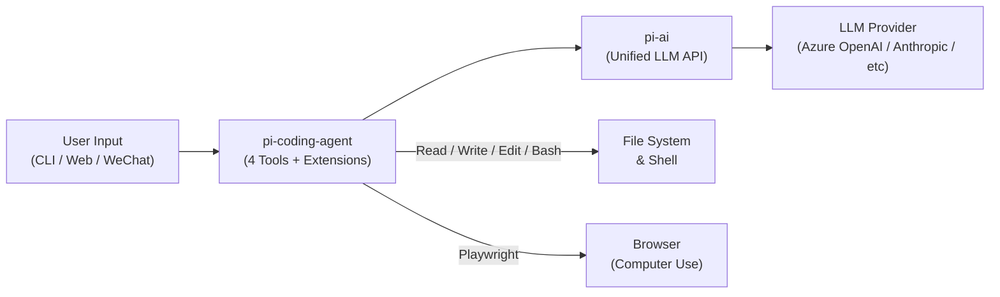
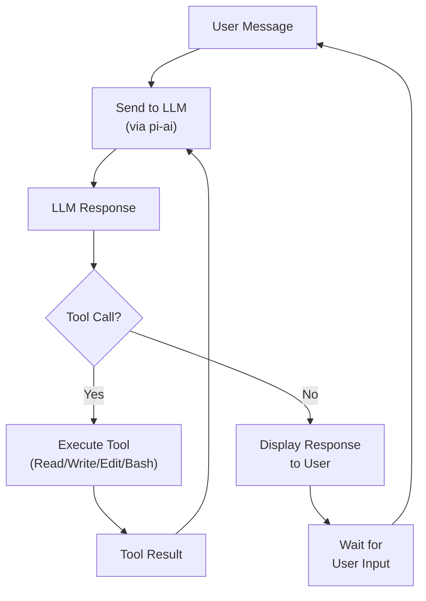
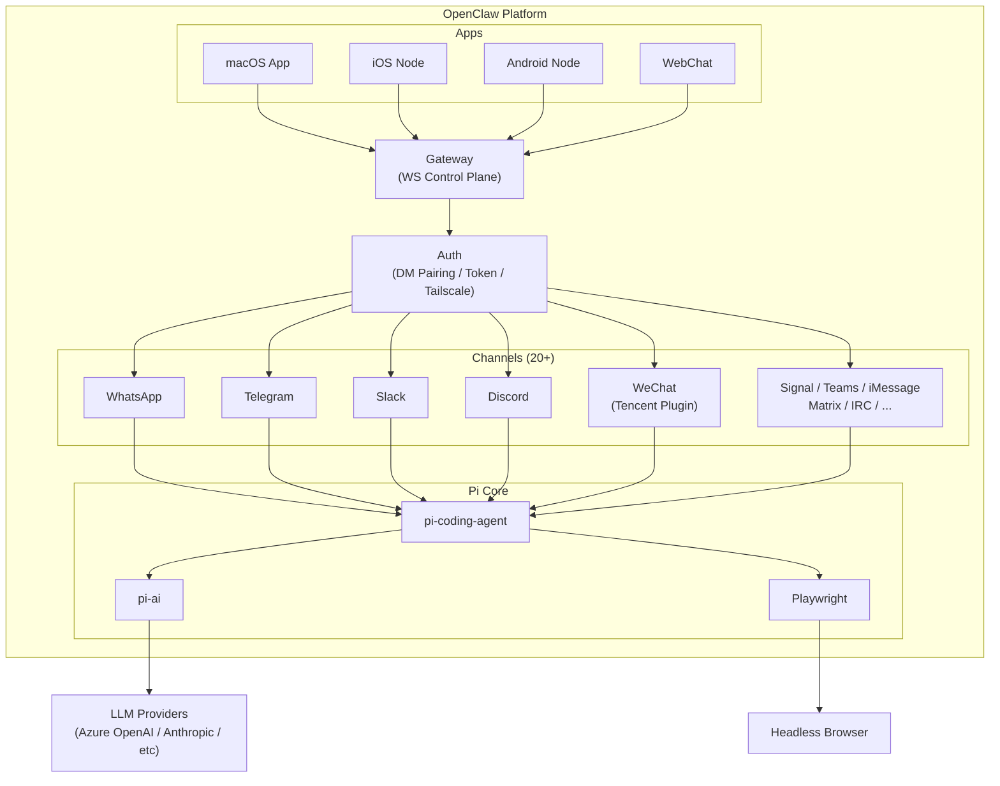
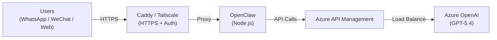

# Pi Agent & OpenClaw Architecture: A Minimalist Approach to Coding Agents

> **Author**: Xinyu Wei (魏新宇)
>
> **Date**: April 2026
>
> **TL;DR**: Pi is a minimalist coding agent built on just **4 tools** (Read, Write, Edit, Bash) with a unified LLM API supporting **22+ providers**. OpenClaw extends Pi into an enterprise-ready platform by adding communication channels (WeChat Work, Telegram, Slack, Web). This article examines Pi's architecture decisions, its extension system, and real-world deployment experience on Azure.

---

## Table of Contents

- [Executive Summary](#executive-summary)
- [1. Architecture Overview](#1-architecture-overview)
- [2. Core Design Philosophy](#2-core-design-philosophy)
- [3. pi-ai: Unified LLM API Layer](#3-pi-ai-unified-llm-api-layer)
- [4. pi-coding-agent: The Heart of Pi](#4-pi-coding-agent-the-heart-of-pi)
- [5. Extension System](#5-extension-system)
- [6. Session Management](#6-session-management)
- [7. OpenClaw: Pi in Production](#7-openclaw-pi-in-production)
- [8. Deployment on Azure](#8-deployment-on-azure)
- [9. Known Issues and Troubleshooting](#9-known-issues-and-troubleshooting)
- [10. References](#10-references)

---

## Executive Summary

| Aspect | Details |
|--------|---------|
| **What is Pi** | A minimalist coding agent framework: 7 packages, 4 default tools (7 available), system prompt under 50 lines |
| **What is OpenClaw** | Pi + 20+ communication channels (WhatsApp / Telegram / Slack / Discord / WeChat / Signal / iMessage / Teams / Web, etc.) as a personal AI assistant |
| **Key Innovation** | "Agents should extend themselves" — no MCP, no sub-agents, no plan mode by design |
| **LLM Support** | 22+ providers via `pi-ai` unified API (OpenAI, Azure OpenAI, Anthropic, Google, xAI, Groq, Bedrock, etc.) |
| **Cross-Provider Handoff** | Sessions can seamlessly switch between models; thinking blocks auto-convert to `<thinking>` tags |
| **Browser Automation** | Built-in Playwright support for Computer Use scenarios |
| **Our Deployment** | Azure OpenAI GPT-5.4 via API Management, WeChat Work integration, Caddy reverse proxy |

### Key People

| Person | Role | Notable |
|--------|------|---------|
| Mario Zechner ([@badlogic](https://github.com/badlogic)) | Pi creator | Maintainer of `pi-mono` monorepo |
| Peter Steinberger ([@steipete](https://github.com/steipete)) | OpenClaw creator | Extended Pi into enterprise platform |
| Armin Ronacher ([@mitsuhiko](https://github.com/mitsuhiko)) | Flask creator, Pi power user | Wrote influential [blog analysis](https://lucumr.pocoo.org/2026/1/31/pi/) of Pi's design |

---

## 1. Architecture Overview

Pi is organized as a **monorepo** (`pi-mono`) containing 7 packages, each with a focused responsibility:

```
pi-mono/
├── pi-ai/              → Unified multi-model LLM API (22+ providers)
├── pi-agent-core/      → Agent runtime with tool calling and state management
├── pi-coding-agent/    → Interactive coding agent CLI (4 core tools)
├── pi-tui/             → Terminal UI library (differential rendering)
├── pi-web-ui/          → Web components (AI chat interface)
├── pi-mom/             → Slack Bot integration
└── pi-pods/            → vLLM deployment management CLI
```

### Package Details

| Package | npm | Purpose |
|---------|-----|---------|  
| `pi-agent-core` | `@mariozechner/pi-agent-core` | Agent runtime with tool calling and state management |
| `pi-ai` | `@mariozechner/pi-ai` | LLM abstraction: 7 API adapters, tool calling, streaming, context serialization |
| `pi-coding-agent` | `@mariozechner/pi-coding-agent` | The coding agent itself: 4 tools + extensions + session management |
| `pi-tui` | `@mariozechner/pi-tui` | Terminal UI with differential rendering for responsive CLI |
| `pi-web-ui` | `@mariozechner/pi-web-ui` | Web components for embedding AI chat in web apps |
| `pi-mom` | `@mariozechner/pi-mom` | Slack bot built on Pi |
| `pi-pods` | `@mariozechner/pi-pods` | Deploy and manage vLLM instances |

### Architectural Call Chain



---

## 2. Core Design Philosophy

Pi's design philosophy can be summarized as **radical minimalism**. While most coding agents add features (MCP, sub-agents, plan mode, permission dialogs), Pi deliberately removes them.

### The 4-Tool Principle

Pi provides the agent with **4 default tools** (with 3 additional optional tools):

| Tool | Default | Function |
|------|---------|----------|
| **Read** | Yes | Read file contents |
| **Write** | Yes | Create or overwrite files |
| **Edit** | Yes | Apply targeted edits to files |
| **Bash** | Yes | Execute shell commands: install packages, run tests, call APIs, git |
| **Grep** | Optional | Search file contents with patterns |
| **Find** | Optional | Locate files by name/path |
| **Ls** | Optional | List directory contents |

The default 4 tools are sufficient because Bash is the escape hatch — grep, find, and ls can all be done via Bash. The optional tools provide the model with structured alternatives.

> **"Bash is the escape hatch."** — With shell access, the agent can do anything a developer can do: install tools, query APIs, run builds, manage git — all without needing specialized tools.

### What Pi Deliberately Does NOT Do

| Feature | Pi's Position | Rationale |
|---------|---------------|-----------|
| **MCP (Model Context Protocol)** | Not implemented | "Agents should extend themselves" via Bash + TypeScript extensions |
| **Sub-agents / Multi-agent** | Not implemented | One agent with full context is preferred over orchestrating multiple agents |
| **Plan Mode** | Not implemented | The agent can plan within its normal reasoning flow |
| **Permission Popups** | Not implemented | Use containers or extensions for sandboxing instead |
| **Built-in RAG** | Not implemented | The agent can use `grep`, `find`, and `cat` via Bash |

This philosophy is influenced by the observation that **most agent complexity is accidental, not essential**. A capable model with file I/O and shell access can accomplish what specialized tools do — often more flexibly.

As Armin Ronacher noted in his [analysis](https://lucumr.pocoo.org/2026/1/31/pi/):

> "Pi is compelling precisely because of what it doesn't do. By resisting the urge to add abstractions, it stays out of the way of the model."

### The System Prompt

Pi uses one of the **shortest system prompts in the industry** — under 50 lines. The philosophy: a capable model needs instructions, not hand-holding. The prompt defines the 4 tools and a few behavioral guidelines, then gets out of the way.

---

## 3. pi-ai: Unified LLM API Layer

`pi-ai` is Pi's foundation — a TypeScript library that provides a single interface to 22+ LLM providers through 10 API adapters.

### Supported API Adapters (10 adapters)

| Adapter | Providers Covered |
|---------|------------------|
| `openai-completions` | OpenAI, Groq, Cerebras, Together, xAI, DeepSeek, Fireworks, etc. |
| `openai-responses` | OpenAI Responses API |
| `openai-codex-responses` | OpenAI Codex (ChatGPT Plus/Pro subscription) |
| `anthropic-messages` | Anthropic Claude (direct) |
| `google-generative-ai` | Google Gemini |
| `google-gemini-cli` | Google Cloud Code Assist (Gemini CLI) |
| `google-vertex` | Google Vertex AI |
| `mistral-conversations` | Mistral AI |
| `azure-openai-responses` | Azure OpenAI (dedicated adapter) |
| `bedrock-converse-stream` | AWS Bedrock (Claude, Titan, etc.) |

### Cross-Provider Handoff

One of pi-ai's most powerful features is **seamless model switching within a single session**:

```
Session starts with Claude Sonnet
  ↓ (user switches to GPT-5.4)
Thinking blocks auto-convert: Claude's thinking → <thinking> tags
  ↓ (user switches to Gemini)
Context serialized via JSON.stringify/parse
  ↓
Conversation continues with full history
```

This is possible because pi-ai:
1. **Normalizes all provider responses** into a common format
2. **Auto-converts thinking/reasoning blocks** between provider-specific formats
3. **Serializes context** as plain JSON — `JSON.stringify()` to save, `JSON.parse()` to restore

### OAuth Support

pi-ai supports OAuth authentication for:
- Anthropic Console
- OpenAI Codex
- GitHub Copilot
- Gemini CLI
- Antigravity

### Type Safety with TypeBox

Tool parameters are defined using TypeBox schemas, providing runtime type validation:

```typescript
// Pi tools use TypeBox for parameter schemas
const ReadToolParams = Type.Object({
  path: Type.String({ description: "File path to read" }),
  startLine: Type.Optional(Type.Number()),
  endLine: Type.Optional(Type.Number())
});
```

---

## 4. pi-coding-agent: The Heart of Pi

`pi-coding-agent` is the main package that implements the interactive coding agent. It's a CLI application that combines the 4 core tools with an extension system and session management.

### Installation

```bash
npm install -g @mariozechner/pi-coding-agent
```

### Agent Loop

The core loop is straightforward:



### Playwright Integration

Pi includes built-in browser automation via `playwright-core`, enabling **Computer Use** scenarios:

- Web scraping and interaction
- Form filling and testing
- Screenshot-based visual analysis
- Automated web workflows

This runs as part of the Bash tool — the agent can launch Playwright scripts directly from the shell.

---

## 5. Extension System

Pi's extension system is designed to **teach the agent new behaviors without changing its core**. There are four extension mechanisms:

### 5.1 TypeScript Extensions

Code-level plugins that add new commands or modify agent behavior:

```typescript
// Example: /answer extension
export const answerExtension = {
  name: "answer",
  description: "Provide a concise answer to a question",
  execute: async (agent, args) => {
    // Custom logic here
  }
};
```

### 5.2 Skills

Markdown documents that provide the agent with domain knowledge and procedures. Skills are loaded into the system prompt when relevant:

```markdown
# langgraph-docs

You are an expert in LangGraph. When asked about...

## Key Concepts
- StateGraph: ...
- Nodes: ...
```

### 5.3 Prompt Templates

Pre-defined prompts that users can invoke with a keyword. Templates can include variables:

```
/review {{file}} — Review the specified file for issues
/todos — List all TODOs in the codebase
/control — Summarize the control flow of the current project
/files — List and describe all project files
```

### 5.4 Pi Packages

Distributable extension bundles published to npm. A Pi Package can contain extensions, skills, and templates bundled together.

### Design Insight: Why Not MCP?

The extension system reveals Pi's alternative to MCP:

| Need | MCP Approach | Pi Approach |
|------|-------------|-------------|
| Connect to external API | MCP server + protocol negotiation | Bash: `curl` / `python script.py` |
| Access database | MCP database adapter | Bash: `psql` / `mysql` / Python script |
| File operations | MCP filesystem server | Built-in Read/Write/Edit tools |
| Custom business logic | MCP custom server | TypeScript Extension or Bash script |

Pi's position is that **Bash + Extensions covers the same ground as MCP** without the protocol overhead. The agent can always "extend itself" by writing and running scripts.

---

## 6. Session Management

Pi implements a sophisticated session system that goes beyond simple linear chat history.

### Tree-Structured Sessions

Sessions are stored as **JSONL files** with a tree structure, supporting:

| Feature | Description |
|---------|-------------|
| **Branching** | Fork a conversation at any point to explore alternatives |
| **Rollback** | Return to any previous state in the conversation tree |
| **Hot Reload** | Edit session files while the agent is running; changes are picked up automatically |
| **Compaction** | Compress long sessions by summarizing older messages to fit context windows |

### Session Serialization

```
Session File (.jsonl)
├── Message 1 (user)
├── Message 2 (assistant + tool calls)
├── Message 3 (tool results)
├── Branch Point
│   ├── Branch A: Message 4a, 5a, ...
│   └── Branch B: Message 4b, 5b, ...
└── Compact Marker (summarized messages 1-50)
```

Sessions can be shared, replayed, and migrated between machines using standard JSON serialization.

---

## 7. OpenClaw: Pi in Production

[OpenClaw](https://openclaw.ai) is a personal AI assistant built on top of Pi. It extends Pi from a CLI coding agent into a **multi-channel, always-on assistant** with 20+ communication channels, a Gateway control plane, companion apps (macOS/iOS/Android), and features like Voice Wake, Talk Mode, and Live Canvas.

### Relationship



### What OpenClaw Adds

| Component | Purpose |
|-----------|---------|
| **Gateway** | WebSocket control plane for sessions, channels, tools, events, and multi-agent routing |
| **20+ Channels** | WhatsApp, Telegram, Slack, Discord, Google Chat, Signal, iMessage, Microsoft Teams, WeChat, Matrix, IRC, and more |
| **Companion Apps** | macOS menu bar app, iOS node, Android node |
| **Voice** | Voice Wake (wake words) + Talk Mode (continuous voice) on macOS/iOS/Android |
| **Live Canvas** | Agent-driven visual workspace with A2UI |
| **Skills Registry** | ClawHub marketplace for discoverable skills |
| **Browser Control** | Dedicated Chrome/Chromium with CDP control |
| **Authentication** | DM pairing, token auth, Tailscale Serve/Funnel |

### WeChat Integration

WeChat is integrated via the official Tencent plugin [`@tencent-weixin/openclaw-weixin`](https://www.npmjs.com/package/@tencent-weixin/openclaw-weixin) (iLink Bot API):

| Aspect | Details |
|--------|---------|  
| **Plugin** | `@tencent-weixin/openclaw-weixin` (official Tencent) |
| **Install** | `openclaw plugins install "@tencent-weixin/openclaw-weixin"` |
| **Auth** | `openclaw channels login --channel openclaw-weixin` (QR code scan) |
| **Scope** | Private chats only; requires OpenClaw >= 2026.3.22 |
| **Prerequisite** | WeChat ClawBot plugin enabled (WeChat > Me > Settings > Plugins) |

---

## 8. Deployment on Azure

We deployed OpenClaw on Azure with the following architecture:

### Deployment Architecture



### Configuration Highlights

| Component | Configuration |
|-----------|--------------|
| **LLM** | Azure OpenAI GPT-5.4 via API Management for load balancing and monitoring |
| **API Mode** | `openai-completions` adapter (compatible with Chat Completions API) |
| **Auth** | Caddy `basic_auth` for HTTP layer + OpenClaw token authentication |
| **TLS** | Automatic via Caddy (Let's Encrypt or custom certificate) |
| **Installation** | `npm install -g openclaw` (global npm package) |

### API Mode Selection

Pi-ai supports multiple API modes. For Azure OpenAI deployment, the choice matters:

| API Mode | Compatibility | Notes |
|----------|--------------|-------|
| `openai-completions` | Stable with Chat Completions API | Recommended for Azure OpenAI |
| `openai-responses` | Uses Responses API (newer) | May encounter issues with reasoning token handling on some model versions |

> **Recommendation**: Use `openai-completions` mode for Azure OpenAI deployments to ensure compatibility with the Chat Completions API endpoint.

---

## 9. Known Issues and Troubleshooting

### API Mode Migration

When Pi updates its default API mode (e.g., from `openai-completions` to `openai-responses`), Azure OpenAI deployments may encounter issues:

| Issue | Cause | Resolution |
|-------|-------|------------|
| `400 Bad Request` with reasoning tokens | Default API mode changed to `openai-responses` in newer Pi versions | Explicitly configure `openai-completions` mode in provider settings |
| Token authentication conflict | Multiple auth layers (Caddy + OpenClaw) can conflict | Ensure only one layer handles authentication, or configure both consistently |

### Playwright on Windows Service

Running OpenClaw as a Windows Service (Session 0) has limitations:

| Issue | Cause | Resolution |
|-------|-------|------------|
| Browser automation fails | Windows Session 0 cannot interact with desktop | Run OpenClaw in user session (foreground) or use WSL |
| Playwright cannot launch | No display server in Session 0 | Use `--headless` flag or deploy in a containerized environment |

### Extension Loading

| Issue | Cause | Resolution |
|-------|-------|------------|
| Custom extensions not loading | Pi looks for extensions in specific directories | Place extensions in `~/.pi/extensions/` or use `--extensions-dir` flag |
| Skills not being used | Skills need to match the conversation context | Ensure skill filenames and descriptions match expected queries |

---

## 10. References

| Resource | URL |
|----------|-----|
| **Pi Source Code** | [github.com/badlogic/pi-mono](https://github.com/badlogic/pi-mono) |
| **OpenClaw** | [openclaw.ai](https://openclaw.ai) / [github.com/openclaw/openclaw](https://github.com/openclaw/openclaw) |
| **Armin Ronacher's Pi Analysis** | [lucumr.pocoo.org/2026/1/31/pi/](https://lucumr.pocoo.org/2026/1/31/pi/) |
| **Pi Official Site** | [pi.dev](https://pi.dev) |
| **npm: pi-coding-agent** | [npmjs.com/package/@mariozechner/pi-coding-agent](https://www.npmjs.com/package/@mariozechner/pi-coding-agent) |
| **npm: pi-ai** | [npmjs.com/package/@mariozechner/pi-ai](https://www.npmjs.com/package/@mariozechner/pi-ai) |
| **Armin's Extensions** | [github.com/mitsuhiko/agent-stuff](https://github.com/mitsuhiko/agent-stuff) |

---

*This analysis is based on Pi mono-repo source code, OpenClaw documentation, deployment experience, and Armin Ronacher's independent analysis. Pi and OpenClaw are open-source projects created by Mario Zechner and Peter Steinberger respectively.*
