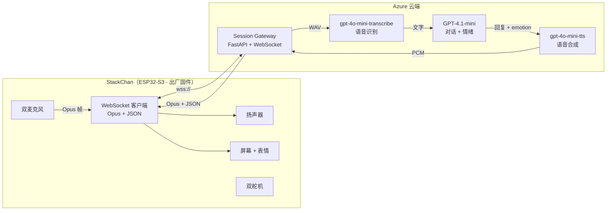
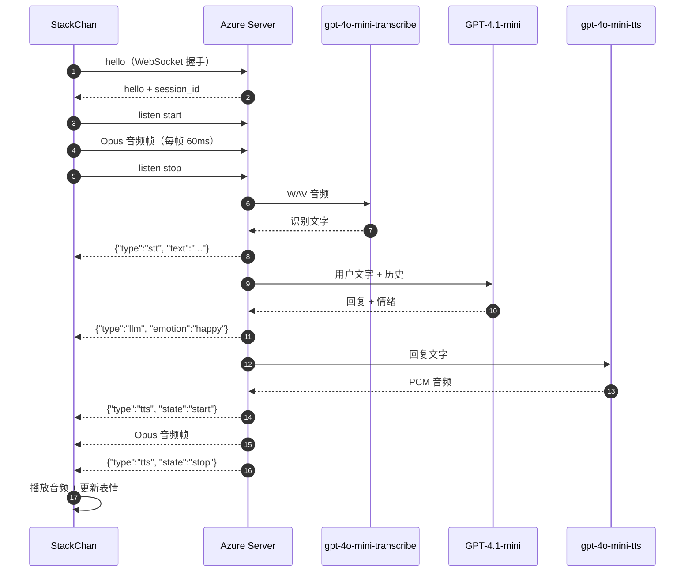

# StackChan Azure 语音助手

> **Author**: 魏新宇 (Xinyu Wei) — Microsoft AI GBB Senior System Engineer

中文版 | [English](README.md)


把 [StackChan](https://docs.m5stack.com/zh_CN/StackChan/) — 一个基于 ESP32-S3 的桌面机器人 — 变成 Azure AI 驱动的语音助手。设备跑 **出厂固件（零修改）**，所有智能都在 Azure 云端。

> **⚠️ 仅供演示** — 本服务端没有内置认证和限流。在任何生产或公网部署前，请添加 API key 验证、OAuth 认证和请求限流。

---

## 核心链路

```
用户说话 → StackChan 麦克风采集 → Opus 编码
→ WebSocket 上传到 Azure Server
→ gpt-4o-mini-transcribe 识别文字
→ GPT-4.1-mini 对话 + 情绪检测
→ gpt-4o-mini-tts 语音合成
→ Opus 编码回传 → StackChan 扬声器播放 + 表情更新
```

---

## StackChan 是什么

[StackChan](https://github.com/m5stack/StackChan) 是 M5Stack 社区打造的开源 AI 桌面机器人，基于 [CoreS3](https://docs.m5stack.com/zh_CN/core/CoreS3)（ESP32-S3，240 MHz 双核，16 MB Flash，8 MB PSRAM）：

- 双麦克风 (ES7210) + 1W 扬声器
- 2.0 寸电容触控屏，显示表情
- 0.3MP 摄像头 (GC0308)
- 9 轴 IMU (BMI270 + BMM150)
- 双舵机（水平 360° 无限旋转 + 垂直 90°）
- 12 颗 RGB LED、NFC、红外、触摸板
- Wi-Fi + BLE

出厂固件内置完整的 [XiaoZhi WebSocket 协议](https://github.com/78/xiaozhi-esp32/blob/main/docs/websocket.md) 客户端——Opus 音频流、JSON 控制消息、表情渲染。**只要把设备的 Server URL 指向我们的 Azure 后端，就能得到一个完整的 Azure AI 语音助手，设备端零代码修改。**

来源：[M5Stack StackChan 文档](https://docs.m5stack.com/zh_CN/StackChan/)，[StackChan GitHub](https://github.com/m5stack/StackChan)

---

## 客户设备实际语音栈

客户设备不是浏览器录音器，也不是直接调用 Azure Speech。它走的是 StackChan 出厂 **AI Agent** 模式和 XiaoZhi 兼容设备协议：

| 层级 | 设备实际使用 | 来源 |
|------|-------------|------|
| 语音入口 | 唤醒词或触摸启动 AI Agent 对话；默认唤醒词是 `Hi, StackChan` | [M5Stack StackChan Factory Firmware Guide](https://docs.m5stack.com/en/StackChan/) |
| 麦克风硬件 | 双麦克风，通过 ES7210 audio codec 采集 | [M5Stack StackChan 规格](https://docs.m5stack.com/zh_CN/StackChan/) |
| 上行音频 | Opus 二进制帧，mono，16 kHz，通常每帧 60 ms | [xiaozhi-esp32 WebSocket protocol](https://github.com/78/xiaozhi-esp32/blob/main/docs/websocket.md) |
| 控制通道 | WebSocket JSON 消息：`hello`、`listen`、`stt`、`llm`、`tts`、`mcp` | [xiaozhi-esp32 WebSocket protocol](https://github.com/78/xiaozhi-esp32/blob/main/docs/websocket.md) |
| 下行音频 | Server 回传 Opus 二进制帧；本实现下行声明 24 kHz，以匹配 Azure OpenAI TTS 返回的 PCM | [xiaozhi-esp32 WebSocket protocol](https://github.com/78/xiaozhi-esp32/blob/main/docs/websocket.md) |
| App 配置 | StackChan World App 里配置 AI Agent 的 conversation language、AI model、voice、speech rate、pitch、recognition speed | [M5Stack StackChan Factory Firmware Guide](https://docs.m5stack.com/en/StackChan/) |

本 repo 实现的是这个协议的云端 Server，StackChan 固件不需要改。

---

## 架构



### 协议时序



---

## 快速开始

### 前提条件

- Python 3.12+
- `libopus` 系统库
- Azure 订阅，已部署 Azure OpenAI 资源（gpt-4o-mini-transcribe + GPT-4.1-mini + gpt-4o-mini-tts）
- 已 `az login` 登录（用 Entra ID token 认证，不需要 API key）

### 1. 克隆并安装

```bash
git clone https://github.com/xinyuwei-david/david-share.git
cd david-share/Agents/StackChan-Azure-Voice-Assistant/server

sudo apt-get install -y libopus0 libopus-dev

python3 -m venv .venv
source .venv/bin/activate
pip install -r requirements.txt
```

### 2. 配置

```bash
cp .env.example .env
```

编辑 `.env`，填入你的 Azure OpenAI endpoint：

```env
# Entra token 认证，不需要 API key，只要 az login 就行
AZURE_OPENAI_ENDPOINT=https://<your-azure-ai-resource>.cognitiveservices.azure.com/
AZURE_OPENAI_DEPLOYMENT=gpt-4-1-mini
AZURE_OPENAI_STT_DEPLOYMENT=gpt-4o-mini-transcribe
AZURE_OPENAI_TTS_DEPLOYMENT=gpt-4o-mini-tts
AZURE_OPENAI_AUDIO_API_VERSION=2025-04-01-preview
SERVER_PORT=8080
```

需要部署以下 Azure OpenAI 模型：

| 部署名 | 模型 | 用途 |
|-------|------|------|
| `gpt-4o-mini-transcribe` | gpt-4o-mini-transcribe (2025-03-20) | 语音识别 |
| `gpt-4-1-mini` | gpt-4.1-mini | 对话 + 情绪检测 |
| `gpt-4o-mini-tts` | gpt-4o-mini-tts | 语音合成 |

### 3. 登录 Azure 并启动

```bash
az login --use-device-code
python main.py
```

Server 启动在 `http://0.0.0.0:8080`。健康检查：`GET /api/health`。

### 4. 连接 StackChan 设备

在 StackChan World 手机 App 里：
1. 进入 **Settings → AI Agent Config**
2. 把 Server URL 改为：`ws://YOUR_SERVER:8080/xiaozhi/v1/`
3. 重启 StackChan，设备自动连接

**就这样。不需要改任何固件。**

### 5. Web Demo（不需要设备）

浏览器需要 HTTPS 才能使用麦克风：

```bash
# 生成自签证书
openssl req -x509 -newkey rsa:2048 -keyout key.pem -out cert.pem -days 365 -nodes -subj "/CN=your-server"

# HTTPS 启动
uvicorn main:app --host 0.0.0.0 --port 3003 --ssl-keyfile key.pem --ssl-certfile cert.pem
```

浏览器打开 `https://YOUR_SERVER:3003/`，按住按钮说话，松开后听回复。

---

## 项目结构

```
server/
├── main.py              # FastAPI 入口 — WebSocket + HTTP endpoints
├── xiaozhi_handler.py   # XiaoZhi 协议状态机（hello → listen → STT → LLM → TTS）
├── azure_speech.py      # gpt-4o-mini-transcribe + gpt-4o-mini-tts（通过 Azure OpenAI REST API）
├── azure_llm.py         # GPT-4.1-mini 对话 + 情绪检测（JSON mode）
├── opus_codec.py        # Opus 编解码（libopus via opuslib）
├── config.py            # 环境变量加载
├── test_client.py       # 模拟 StackChan 设备，用于端到端测试
├── static/index.html    # Web Demo UI（录音 → STT → GPT → TTS → 播放）
├── requirements.txt     # Python 依赖
├── Dockerfile           # 容器镜像（含 libopus）
└── .env.example         # 配置模板
```

---

## 实现细节

### XiaoZhi 协议兼容

StackChan 出厂固件使用 [XiaoZhi WebSocket 协议](https://github.com/78/xiaozhi-esp32/blob/main/docs/websocket.md)，我们的 Server 完全兼容：

| 方向 | 格式 | 内容 |
|------|------|------|
| 设备 → 云 | Binary | Opus 音频帧（16 kHz, mono, 60 ms/帧） |
| 设备 → 云 | JSON | `hello`, `listen`（start/stop）, `abort`, `mcp` |
| 云 → 设备 | Binary | Opus 音频帧（TTS 播放） |
| 云 → 设备 | JSON | `hello`, `stt`, `llm`（含 **emotion**）, `tts`, `mcp`, `alert` |

`llm` 消息里的 `emotion` 字段会让设备自动切换表情：
```json
{"type": "llm", "emotion": "happy", "text": ""}
```
支持的 emotion：`happy`, `sad`, `surprised`, `angry`, `neutral`, `laughing`, `shy`, `confused`

### 认证方式

Server 使用 **Microsoft Entra ID token 认证**（`AzureCliCredential`）——不存储任何 API key。STT、GPT、TTS 调用都走同一个 Azure AI endpoint 和 bearer-token 认证。

### 音频链路

```
设备麦克风 → Opus 16kHz → [WebSocket] → Server 解码为 PCM
→ 包装成 WAV → gpt-4o-mini-transcribe → 文字
→ GPT-4.1-mini（JSON mode：回复 + 情绪）
→ gpt-4o-mini-tts → PCM 24kHz → Opus 编码
→ [WebSocket] → 设备扬声器
```

---

## API 端点

| 端点 | 方法 | 用途 |
|------|------|------|
| `/api/health` | GET | 健康检查 |
| `/xiaozhi/v1/` | WebSocket | XiaoZhi 设备协议 |
| `/` | GET | Web Demo 页面 |
| `/api/voice` | POST（multipart） | 浏览器语音 API：上传 WAV → 返回 STT + GPT + TTS |

---

## 后续规划

- [ ] MCP Tool Calling（天气、新闻、日历、邮件、游戏数据）
- [ ] 摄像头情绪识别（GPT-4o Vision）
- [ ] 说话人分离（Azure Speech Diarization）
- [ ] 舵机跟随（追踪说话人）
- [ ] 舞蹈编排（IMU + 舵机控制）
- [ ] OpenClaw Skill 生态

---

## 参考资料

- [StackChan 产品文档](https://docs.m5stack.com/zh_CN/StackChan/)
- [StackChan GitHub（开源）](https://github.com/m5stack/StackChan)
- [XiaoZhi WebSocket 协议](https://github.com/78/xiaozhi-esp32/blob/main/docs/websocket.md)
- [XiaoZhi ESP32（26.8k stars）](https://github.com/78/xiaozhi-esp32)
- [Azure OpenAI Whisper](https://learn.microsoft.com/azure/ai-services/openai/whisper-quickstart)
- [Azure OpenAI Text-to-Speech](https://learn.microsoft.com/azure/ai-services/openai/text-to-speech-quickstart)
