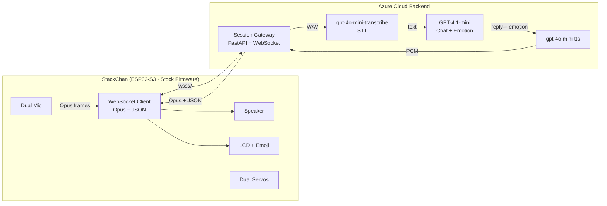
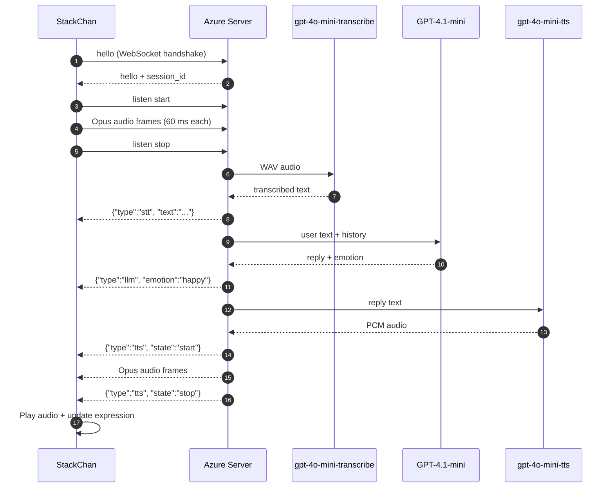

# StackChan Azure Voice Assistant

> **Author**: 魏新宇 (Xinyu Wei) — Microsoft AI GBB Senior System Engineer

[中文版](README-CN.md) | English


A cloud voice assistant server that turns [StackChan](https://docs.m5stack.com/en/StackChan/) — an ESP32-S3 desktop robot — into an Azure AI-powered companion. The device runs **stock firmware** (zero modification); all intelligence lives in our Azure backend.

> **⚠️ Demo Only** — This server has no built-in authentication or rate limiting. Add proper auth (e.g. API key validation, OAuth) and rate limiting before any production or public-facing deployment.

---

## Live Demo

The voice pipeline: device speaks → gpt-4o-mini-transcribe → GPT-4.1-mini (with emotion) → gpt-4o-mini-tts → device plays back.

```
┌─────────────────┐    WebSocket (Opus + JSON)    ┌──────────────────────────────┐
│  StackChan 设备  │◄────────────────────────────►│  Azure XiaoZhi Server        │
│  (stock firmware)│                               │  (Python FastAPI)            │
└─────────────────┘                               └──────────┬───────────────────┘
                                                             │
                                       ┌─────────────────────┼──────────────────┐
                                       │                     │                  │
                                  ┌────▼────┐          ┌─────▼────┐       ┌─────▼────┐
                                  │gpt-4o   │          │ GPT-4.1  │       │ gpt-4o   │
                                  │mini-trans│         │  -mini   │       │ -mini-tts│
                                  └─────────┘          └──────────┘       └──────────┘
```

---

## What is StackChan?

[StackChan](https://github.com/m5stack/StackChan) is an open-source AI desktop robot built on [M5Stack CoreS3](https://docs.m5stack.com/en/core/CoreS3) (ESP32-S3, 240 MHz dual-core, 16 MB Flash, 8 MB PSRAM). It features:

- Dual microphones (ES7210) + 1W speaker
- 2.0" capacitive touch display for emoji expressions
- 0.3 MP camera (GC0308)
- 9-axis IMU (BMI270 + BMM150)
- Dual servo motors (horizontal 360° + vertical 90°)
- 12× RGB LEDs, NFC, IR, touch pads
- Wi-Fi + BLE connectivity

The factory firmware includes a full [XiaoZhi WebSocket protocol](https://github.com/78/xiaozhi-esp32/blob/main/docs/websocket.md) client — Opus audio streaming, JSON control messages, and expression rendering. **By pointing the device's server URL to our Azure backend, we get a fully functional Azure AI voice assistant with zero device-side code changes.**

Source: [M5Stack StackChan documentation](https://docs.m5stack.com/en/StackChan/), [StackChan GitHub](https://github.com/m5stack/StackChan)

---

## Customer Device Voice Stack

The customer device is not a browser recorder and does not call Azure Speech directly. It uses the StackChan factory **AI Agent** mode and the XiaoZhi-compatible device protocol:

| Layer | What the device uses | Source |
|-------|----------------------|--------|
| Voice entry | Wake word or touch to start an AI Agent conversation; default wake word is `Hi, StackChan` | [M5Stack StackChan Factory Firmware Guide](https://docs.m5stack.com/en/StackChan/) |
| Microphone hardware | Dual microphones through the ES7210 audio codec | [M5Stack StackChan specifications](https://docs.m5stack.com/en/StackChan/) |
| Uplink audio | Opus binary frames, mono, 16 kHz, typically 60 ms per frame | [xiaozhi-esp32 WebSocket protocol](https://github.com/78/xiaozhi-esp32/blob/main/docs/websocket.md) |
| Control channel | WebSocket JSON messages: `hello`, `listen`, `stt`, `llm`, `tts`, `mcp` | [xiaozhi-esp32 WebSocket protocol](https://github.com/78/xiaozhi-esp32/blob/main/docs/websocket.md) |
| Downlink audio | Server sends Opus binary frames; this implementation advertises 24 kHz downlink to match Azure OpenAI TTS PCM | [xiaozhi-esp32 WebSocket protocol](https://github.com/78/xiaozhi-esp32/blob/main/docs/websocket.md) |
| App configuration | StackChan World app exposes AI Agent settings such as conversation language, AI model, voice, speech rate, pitch, and recognition speed | [M5Stack StackChan Factory Firmware Guide](https://docs.m5stack.com/en/StackChan/) |

This repository implements the cloud server side of that protocol. The StackChan firmware remains unchanged.

---

## Architecture



### Protocol Flow



---

## Quick Start

### Prerequisites

- Python 3.12+
- `libopus` system library
- Azure subscription with:
    - Azure OpenAI resource (gpt-4o-mini-transcribe + GPT-4.1-mini + gpt-4o-mini-tts deployments)
  - `az login` (Entra ID token auth, no API key needed)

### 1. Clone and Install

```bash
git clone https://github.com/xinyuwei-david/david-share.git
cd david-share/Agents/StackChan-Azure-Voice-Assistant/server

# System dependency
sudo apt-get install -y libopus0 libopus-dev

# Python environment
python3 -m venv .venv
source .venv/bin/activate
pip install -r requirements.txt
```

### 2. Configure

Copy `.env.example` to `.env` and fill in your Azure OpenAI endpoint:

```bash
cp .env.example .env
```

```env
# Entra token auth — no API key needed, just az login
AZURE_OPENAI_ENDPOINT=https://<your-azure-ai-resource>.cognitiveservices.azure.com/
AZURE_OPENAI_DEPLOYMENT=gpt-4-1-mini
AZURE_OPENAI_STT_DEPLOYMENT=gpt-4o-mini-transcribe
AZURE_OPENAI_TTS_DEPLOYMENT=gpt-4o-mini-tts
AZURE_OPENAI_AUDIO_API_VERSION=2025-04-01-preview
SERVER_PORT=8080
```

Required Azure OpenAI model deployments:
| Deployment Name | Model | Purpose |
|----------------|-------|---------|
| `gpt-4o-mini-transcribe` | gpt-4o-mini-transcribe (2025-03-20) | Speech-to-Text |
| `gpt-4-1-mini` | gpt-4.1-mini | Chat + Emotion detection |
| `gpt-4o-mini-tts` | gpt-4o-mini-tts | Text-to-Speech |

### 3. Login to Azure and Run

```bash
az login --use-device-code
python main.py
```

Server starts on `http://0.0.0.0:8080`. Health check: `GET /api/health`.

### 4. Connect StackChan Device

On the StackChan World mobile app:
1. Go to **Settings → AI Agent Config**
2. Change the Server URL to: `ws://YOUR_SERVER:8080/xiaozhi/v1/`
3. Restart StackChan — it connects automatically

**That's it. Zero firmware changes.**

### 5. Try the Web Demo (No device needed)

For HTTPS (required for browser microphone access):
```bash
# Generate self-signed cert
openssl req -x509 -newkey rsa:2048 -keyout key.pem -out cert.pem -days 365 -nodes -subj "/CN=your-server"

# Start with HTTPS
uvicorn main:app --host 0.0.0.0 --port 3003 --ssl-keyfile key.pem --ssl-certfile cert.pem
```

Open `https://YOUR_SERVER:3003/` in browser → press and hold the button → speak → hear the reply.

---

## Project Structure

```
server/
├── main.py              # FastAPI entry — WebSocket + HTTP endpoints
├── xiaozhi_handler.py   # XiaoZhi protocol state machine (hello → listen → STT → LLM → TTS)
├── azure_speech.py      # gpt-4o-mini-transcribe + gpt-4o-mini-tts via Azure OpenAI REST API
├── azure_llm.py         # GPT-4.1-mini chat with emotion detection (JSON mode)
├── opus_codec.py        # Opus encode/decode wrappers (libopus via opuslib)
├── config.py            # Environment variable loader
├── test_client.py       # Simulated StackChan device for E2E testing
├── static/index.html    # Web demo UI (record → STT → GPT → TTS → playback)
├── requirements.txt     # Python dependencies
├── Dockerfile           # Container image with libopus
└── .env.example         # Configuration template
```

---

## How It Works

### XiaoZhi Protocol Compatibility

StackChan's factory firmware uses the [XiaoZhi WebSocket protocol](https://github.com/78/xiaozhi-esp32/blob/main/docs/websocket.md) — a lightweight protocol for voice AI devices:

| Direction | Format | Content |
|-----------|--------|---------|
| Device → Server | Binary | Opus audio frames (16 kHz, mono, 60 ms/frame) |
| Device → Server | JSON | `hello`, `listen` (start/stop), `abort`, `mcp` |
| Server → Device | Binary | Opus audio frames (TTS playback) |
| Server → Device | JSON | `hello`, `stt`, `llm` (with **emotion**), `tts`, `mcp`, `alert` |

The `llm` message includes an `emotion` field that the device renders as facial expressions:
```json
{"type": "llm", "emotion": "happy", "text": ""}
```
Supported emotions: `happy`, `sad`, `surprised`, `angry`, `neutral`, `laughing`, `shy`, `confused`.

### Authentication

The server uses **Microsoft Entra ID token authentication** (via `AzureCliCredential`) — no API keys stored anywhere. STT, GPT, and TTS calls all go through the same Azure AI endpoint with bearer-token authentication.

### Audio Pipeline

```
Device mic → Opus 16kHz → [WebSocket] → Server decodes to PCM
→ wrap as WAV → gpt-4o-mini-transcribe → text
→ GPT-4.1-mini (JSON mode: reply + emotion)
→ gpt-4o-mini-tts → PCM 24kHz → Opus encode
→ [WebSocket] → Device speaker
```

---

## Endpoints

| Endpoint | Method | Purpose |
|----------|--------|---------|
| `/api/health` | GET | Health check |
| `/xiaozhi/v1/` | WebSocket | XiaoZhi device protocol |
| `/` | GET | Web demo UI |
| `/api/voice` | POST (multipart) | Browser voice API: upload WAV → get STT + GPT + TTS |

---

## Future Roadmap

- [ ] MCP Tool Calling (weather, news, calendar, mail, gaming data)
- [ ] Emotion recognition via camera (GPT-4o Vision)
- [ ] Speaker diarization (Azure Speech)
- [ ] Servo tracking (follow the speaker)
- [ ] Dance choreography via IMU + servo control
- [ ] OpenClaw skill ecosystem integration

---

## References

- [StackChan Product Documentation](https://docs.m5stack.com/en/StackChan/)
- [StackChan GitHub (open source)](https://github.com/m5stack/StackChan)
- [XiaoZhi WebSocket Protocol](https://github.com/78/xiaozhi-esp32/blob/main/docs/websocket.md)
- [XiaoZhi ESP32 (26.8k stars)](https://github.com/78/xiaozhi-esp32)
- [Azure OpenAI Whisper](https://learn.microsoft.com/azure/ai-services/openai/whisper-quickstart)
- [Azure OpenAI Text-to-Speech](https://learn.microsoft.com/azure/ai-services/openai/text-to-speech-quickstart)
