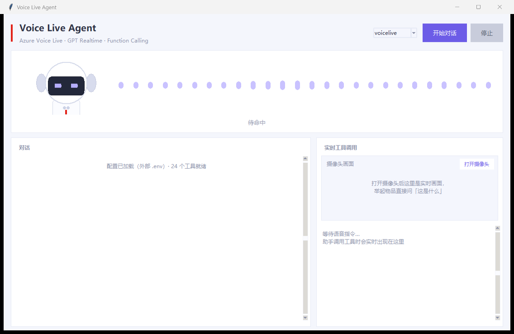
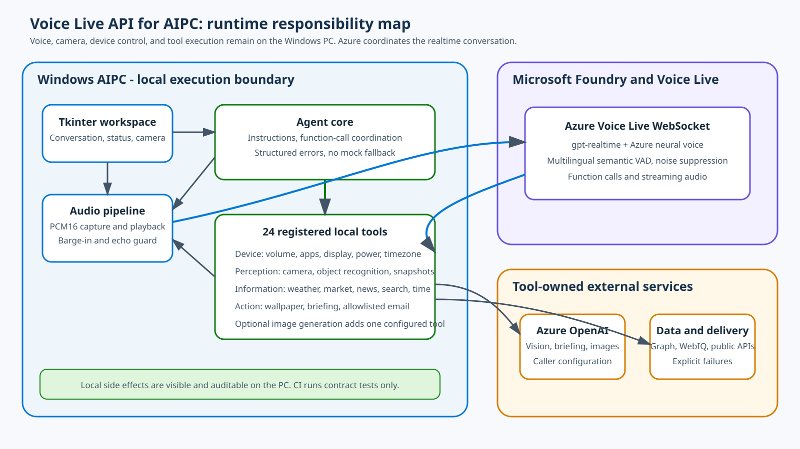

# 面向 AIPC 的 Voice Live API 语音代理

[](https://www.python.org/)
[](https://www.microsoft.com/windows)
[](https://learn.microsoft.com/azure/ai-services/speech-service/voice-live)
[](https://github.com/david-xinyuwei/david-share/actions/workflows/voice-live-aipc-ci.yml)
[](LICENSE)

这是一个运行在 Windows AIPC 上的语音代理：用 **Azure Voice Live API** 处理实时对话，并通过 24 个本机工具完成摄像头感知、桌面和电源控制、实时信息查询、壁纸操作与白名单邮件发送。语音编排发生在 Azure；所有设备操作都在用户自己的 PC 上执行，结果可在本机直接核对。

> Author: **Xinyu Wei（魏新宇）**

[English](README.md) | 中文 · [客户从这里开始](CUSTOMER-START-HERE-CN.md)

[真实边界](#哪些是真实能力哪些需要用户提供) · [架构](#架构) · [快速开始](#快速开始) · [实测证据](#实测验证) · [Voice Live 官方文档](https://learn.microsoft.com/azure/ai-services/speech-service/voice-live)

---

## 哪些是真实能力，哪些需要用户提供

微软对 Voice Live 的原文定义是：**“a solution that enables low-latency, high-quality speech-to-speech interactions for voice agents.”** 它把语音识别、生成式 AI 和语音合成统一在一个接口中。来源：[Voice Live API Overview](https://learn.microsoft.com/azure/ai-services/speech-service/voice-live)，访问日期：2026-08-26。

这是一套可执行的 Windows 应用，不是只有界面的模拟 Demo。

| 能力面 | 本仓库真实执行 | 用户需要提供 |
|---|---|---|
| 实时语音 | 建立真实 Voice Live WebSocket，流式传输 PCM16 音频，配置多语言 Semantic VAD、深度降噪、服务端参考回声消除、`gpt-realtime` 和 Azure 神经音色 | Microsoft Foundry 资源、受支持区域、endpoint，以及 Entra 权限或 API Key |
| Function calling | 向服务端声明 24 个默认工具 schema，并在本机执行模型选中的工具；高影响操作必须在后续轮次用绑定原参数的一次性 token 确认 | 对本机副作用的明确授权，以及可选服务所需的凭据 |
| AIPC 设备控制 | 通过 Windows API 查询/设置音量，启动白名单应用，修改时区、亮度、电源模式、关屏/睡眠/休眠时间和壁纸 | Windows 10/11 与兼容硬件 |
| 摄像头感知 | 只有用户明确请求相机/识图后，才抓取当前本机画面并调用用户配置的多模态模型 | 摄像头权限与 Azure OpenAI chat deployment |
| 实时信息 | 调用 Open-Meteo、行情提供方、RSS 与 WebIQ；失败时明确返回错误 | 搜索类功能需要 WebIQ Key |
| 邮件发送 | 默认走 Microsoft Graph，也可显式切换 SMTP；调用传输层前会校验收件人白名单、内容大小和后续轮次的精确操作确认 | Public Client 应用或 SMTP 凭据，以及收件人白名单 |
| CI 与 fixture | 验证 schema、拒绝路径、源码契约、README/evidence 一致性，以及不存在假运行路径 | 不需要云端凭据，也不访问设备 |

### 重要边界

- **不做 mock fallback：** 生产工具不会在真实服务不可用时返回静态数据或伪造成功。
- **高影响操作需要两轮确认：** 邮件、打开/抓拍摄像头、时区、电源、壁纸和生图第一次只返回一次性 token。同一时刻只能有一个待确认操作，竞争操作会被拒绝。只有后续新一轮明确确认且参数完全一致时才会执行；重放、过期、取消或参数变化都会失败。
- **邮件有真实副作用：** `send_email` 不是只生成草稿；完成确认并通过收件人和内容大小校验后，它会实际发送邮件。
- **设备工具仅支持 Windows：** CI 只验证合同，不宣称实际移动了音量条、打开了摄像头或修改了电源设置。
- **不是生产认证：** 仓库中的证据是一次有边界 Demo 验证的脱敏记录，不代表 SLA、安全认证、模型质量 benchmark 或所有硬件都兼容。
- **凭据只留本机：** `.env`、MSAL cache、账号、endpoint、subscription、tenant 和原始日志均不进入 Git。

## 产品界面



*真实封版运行时的 Windows 应用窗口。画面中没有 endpoint、账号、tenant、subscription、本机路径或凭据。*

界面把对话、语音状态、摄像头预览和实时工具卡片放在同一工作区。右上角下拉框提供三种连接模式：

| 界面模式 | 服务路径 | 用途 |
|---|---|---|
| `voicelive` | Voice Live 模型连接 | 默认且完整验证的路径：`gpt-realtime` + Azure 神经音色 + Voice Live 增强能力 |
| `voicelive-agent` | Voice Live 连接 Foundry Agent | 可选的集中式人设/工具定义路径；设备工具仍由本机代码执行 |
| `realtime` | Azure OpenAI Realtime `/openai/v1/realtime` | 用于对比直连 Realtime 与 Voice Live 增强层的控制路径 |

本次有边界验证所用的 Azure deployment 报告为 `gpt-realtime` 版本 `2025-08-28`，不是 `gpt-realtime-2.1`；evidence 记录了 Azure Resource Manager metadata 来源，并移除了资源标识。用户字幕由 `gpt-4o-transcribe` 生成；模型理解音频和生成用户字幕是两个不同的协议能力面。

## 架构



*责任边界是刻意设计的：Azure 负责语音会话与 function call 编排；Windows AIPC 负责摄像头、设备控制、文件、凭据和工具执行。*

运行主线：

1. [src/audio.py](src/audio.py) 采集 PCM16 麦克风音频并播放流式响应音频。
2. [src/backends/voicelive.py](src/backends/voicelive.py) 配置 `gpt-realtime`、`gpt-4o-transcribe`、多语言 Semantic VAD、深度降噪和服务端参考回声消除。
3. [src/agent_core.py](src/agent_core.py) 关联 function call，并把调用交给共享 dispatcher；UI 事件和日志不记录完整参数或结果。
4. [src/confirmation.py](src/confirmation.py) 用参数摘要绑定受保护操作，只有后续明确确认并提供有效一次性 token 才会放行。
5. [src/tools](src/tools) 执行本机 Windows 操作，或调用代码中明确标注的外部提供方，再把结构化结果回传语音后端。
6. 界面通过 [src/events.py](src/events.py) 接收真实 session/tool 事件，不使用伪造的执行动画。

## 可执行资产

| 路径 | 合同 |
|---|---|
| [app.py](app.py) | Tkinter 应用入口、模式切换、语音状态、摄像头预览与工具卡片 |
| [src/backends/voicelive.py](src/backends/voicelive.py) | 主要 Voice Live WebSocket 路径 |
| [src/backends/realtime.py](src/backends/realtime.py) | Azure OpenAI Realtime 直连对照路径 |
| [src/agent_core.py](src/agent_core.py) | 共享提示词与 function call 编排 |
| [src/confirmation.py](src/confirmation.py) | 高影响操作的后续轮次、原参数一致性授权 |
| [src/tools](src/tools) | 共 25 个定义；默认启用 24 个；只有显式配置图像 deployment 才启用生图工具 |
| [scripts/preflight.py](scripts/preflight.py) | 离线 session 序列化，或真实 backend 接受性探针 |
| [scripts/smoke_tools.py](scripts/smoke_tools.py) | 真实外部提供方 smoke；部分 case 会修改桌面 |
| [scripts/graph_login.py](scripts/graph_login.py) | 邮件发送所需的一次性 Microsoft Graph delegated login |
| [VoiceLiveAgent-dir.spec](VoiceLiveAgent-dir.spec) | Windows EXE 使用的 PyInstaller onedir 构建入口 |
| [scenario-manifest.json](scenario-manifest.json) | dynamic-runtime 与 test-fixture 分类 |
| [evidence/live-validation.json](evidence/live-validation.json) | 有边界的脱敏实测证据 |
| [scripts/pre_delivery_check.py](scripts/pre_delivery_check.py) | Public、安全、真实性、证据、README 和源码 fail-closed gate |

## 本机工具面

默认公开配置会注册 24 个工具。只有配置 `AZURE_OPENAI_IMAGE_DEPLOYMENT` 后，才会额外注册第 25 个工具 `generate_wallpaper_image`。

| 领域 | 默认工具 |
|---|---|
| 语音与桌面 | `get_system_volume`、`set_system_volume`、`set_system_mute`、`open_windows_app` |
| 显示与电源 | `get_screen_brightness`、`set_screen_brightness`、`get_power_mode`、`set_power_mode`、`get_power_timeouts`、`set_power_timeout`、`set_system_timezone` |
| 摄像头与视觉 | `open_camera`、`close_camera`、`identify_object_with_camera`、`search_where_to_buy` |
| 实时信息 | `get_current_time`、`get_weather`、`get_stock_quote`、`get_news_headlines`、`web_search` |
| 内容与投递 | `create_news_briefing`、`send_email`、`search_wallpaper_image`、`set_desktop_wallpaper` |

主要拒绝路径：

- 听不清或意图不明确时不得调用工具。
- 视觉工具抓取画面前，模型不能声称看见摄像头内容。
- 只有用户明确问购买渠道或价格，才允许购物搜索。
- 邮件拒绝空白名单、未知收件人、邮件头换行、超大内容，以及缺失、重放、过期或参数变化的确认。
- 打开/抓拍摄像头、时区、电源、壁纸、生图和邮件不能在请求轮次直接执行，必须等下一轮明确确认。
- 壁纸修改拒绝配置目录之外的路径。
- 壁纸下载对每个 HTTPS hop 只解析一次 DNS，任何非公网地址都会整组拒绝；TLS 直接连接这个已验证 IP，同时仍按原 hostname 校验证书，并拒绝非标准端口、超大文件和无效图片。
- Windows 应用与 PowerShell 只从可信 `%SystemRoot%` 位置启动，不使用调用方可控制的 `PATH`。

## 实测验证

公开的 [evidence 摘要](evidence/live-validation.json) 来自一次真实 Windows 运行，所有资源标识都已移除。

| 检查项 | 实测结果 | 证据边界 |
|---|---|---|
| Voice Live 连接 | WebSocket 建立，收到 `session.updated` | 一个已配置的 Microsoft Foundry 资源 |
| 工具接受 | 本机注册 24 个，服务端接受 24 个 | 默认配置，不含生图工具 |
| Session 合同 | `gpt-realtime`、`gpt-4o-transcribe`、多语言 Semantic VAD | evidence 中记录的精确 SDK/配置 |
| Deployment metadata | 模型版本 `2025-08-28` | 脱敏的 Azure Resource Manager deployment metadata，资源标识已移除 |
| 外部 smoke | 时间、天气、股票、新闻、WebIQ 搜索、壁纸图片查询：6/6 PASS | 只证明采集时刻的提供方可用性 |
| 行情降级 | Yahoo 返回 HTTP 403 后，腾讯行情路径返回真实报价 | 提供方特定降级，不是行情 SLA |
| 新闻降级 | RSS 连接超时后，WebIQ 返回真实来源页面 | 搜索结果不保证包含精确发布时间 |
| 发布包自检 | 15 项通过，0 项失败 | [单次构建 package evidence](evidence/publication-validation.json)；artifact 不对外发布 |

仓库不发布原始日志，因为日志可能含 endpoint、账号、本机路径、摄像头产物或消息内容。CI 会从提交树重新计算确定性合同。Live run 与发布包的证据来源和适用范围见 [evidence/README.md](evidence/README.md)。

## 快速开始

### 前置条件

- Windows 10/11，x64 或 ARM64；需要麦克风和扬声器
- Python 3.11、3.12 或 3.13
- 位于 [Voice Live 支持区域](https://learn.microsoft.com/azure/ai-services/speech-service/regions?tabs=voice-live#regions)的 [Microsoft Foundry 资源](https://learn.microsoft.com/azure/ai-services/multi-service-resource)
- 使用 Entra 认证时，账号需要资源上的 `Cognitive Services User` 和 `Foundry User`

### 1. Clone 与安装 - 只有本机副作用

```powershell
git clone https://github.com/david-xinyuwei/david-share.git
Set-Location .\david-share\Agents\Voice-Live-API-AIPC
py -3.11 -m venv .venv
.\.venv\Scripts\python.exe -m pip install --upgrade pip
.\.venv\Scripts\python.exe -m pip install -r requirements.txt
Copy-Item .env.example .env
```

**Done-When：** `.venv\Scripts\python.exe` 能导入 `azure.ai.voicelive`，且 `.env` 保持未跟踪状态。

### 2. 配置 Voice Live - 凭据只存本机

编辑 `.env`，填写自己的资源信息：

```ini
AZURE_VOICELIVE_ENDPOINT=https://<your-resource>.services.ai.azure.com/
AZURE_VOICELIVE_MODEL=gpt-realtime
AZURE_VOICELIVE_VOICE=zh-CN-XiaoxiaoMultilingualNeural
AZURE_VOICELIVE_API_KEY=<your-api-key>
```

API Key 是本机 Demo 最短路径。使用 keyless 认证时，保持 `AZURE_VOICELIVE_API_KEY` 为空，为本项目设置独立 `AZURE_CONFIG_DIR`，通过 Azure CLI 登录并锁定目标订阅：

```powershell
$env:AZURE_CONFIG_DIR = "$HOME\.azure-voice-live-aipc"
az login
az account set --subscription <your-subscription-id>
az account show --query "{name:name,id:id,tenantId:tenantId}" -o table
```

**Done-When：** 当前身份在 `AZURE_VOICELIVE_ENDPOINT` 对应的同一个资源上拥有所需角色。

### 3. 离线 Gate - `sideEffects: []`

```powershell
.\.venv\Scripts\python.exe -m scripts.preflight --mode voicelive --dry-run
.\.venv\Scripts\python.exe scripts\pre_delivery_check.py
```

**Done-When：** session 序列化报告 24 个工具，全部确定性 gate 通过，且没有打开麦克风或修改 Windows 设置。

### 4. 真实 Backend 接受性 - 使用网络与 Azure

```powershell
.\.venv\Scripts\python.exe -m scripts.preflight --mode voicelive
```

这一步建立真实 Voice Live WebSocket 并等待 `session.updated`，但不会开始采集麦克风。

**Done-When：** 服务端接受模型、音色、转写、VAD 和全部 24 个默认工具。

### 5. 启动应用 - 访问麦克风和本机设备

```powershell
.\run.cmd
```

点击**开始对话**。为了提高 Demo 稳定性，建议佩戴耳机。

**Done-When：** 界面显示麦克风已打开，语音得到真实回复，并且时间或天气这类无害工具在工具面板中完成。

## 可选集成

### Microsoft Graph 邮件

默认邮件传输方式是 Microsoft Graph，会实际发送邮件。创建 Microsoft Entra Public Client 应用，启用 public client flow，授予 delegated `Mail.Send`，然后配置：

```ini
MAIL_TRANSPORT=graph
GRAPH_CLIENT_ID=<your-public-client-application-id>
GRAPH_AUTHORITY=https://login.microsoftonline.com/<your-tenant-id>
MAIL_DEFAULT_RECIPIENT=user@example.com
MAIL_ALLOWED_RECIPIENTS=user@example.com
```

个人 Microsoft 账号可使用 `GRAPH_AUTHORITY=https://login.microsoftonline.com/consumers`。完成一次 delegated login：

```powershell
.\.venv\Scripts\python.exe -m scripts.graph_login
```

MSAL cache 会以 `.msal_token_cache.json` 保存在本机，并被 Git 忽略。每次读取前都会验证 Windows DACL：禁止继承，且只能给当前 SID 与 `SYSTEM` Full Control；不安全的旧 cache 或 fallback cache 会被拒绝。更新时先写临时文件并 flush，设好 ACL 后再原子替换。Access token 到期后会静默续期；撤销授权、账号安全变更、长期不用或删除 cache 后，需要重新登录。

### 搜索、视觉、生图与简报

- `WEBIQ_API_KEY` 用于通用搜索、购物查询和壁纸图片搜索。
- `AZURE_OPENAI_ENDPOINT` 与 `AZURE_OPENAI_CHAT_DEPLOYMENT` 用于摄像头画面分析和新闻简报。
- `AZURE_OPENAI_IMAGE_DEPLOYMENT` 用于注册可选的第 25 个生图工具。
- 对仍允许认证 SMTP 的提供方，可显式设置 `MAIL_TRANSPORT=smtp`。

任何可选依赖不可用时都会明确失败，不会变成 Demo 数据。

## 构建 Windows onedir 包

```powershell
.\.venv\Scripts\python.exe -m pip install -r requirements-dev.txt
.\.venv\Scripts\python.exe -m PyInstaller --noconfirm --clean VoiceLiveAgent-dir.spec
```

运行 `dist\VoiceLiveAgent\VoiceLiveAgent.exe` 时必须保留完整 `VoiceLiveAgent` 目录，并把本机 `.env` 放在 EXE 同级。不得发布内含凭据的可执行包。

**Done-When：** `dist\VoiceLiveAgent\VoiceLiveAgent.exe --self-check` 退出码为 `0`，并在 `dist\VoiceLiveAgent\self_check.txt` 写入 `SELF_CHECK=PASS`。

## 测试与质量 Gate

运行时会导入 Windows 音频与设备 API，因此确定性 CI 只在 Windows 上执行：

```powershell
.\.venv\Scripts\python.exe scripts\audit_public_content.py
.\.venv\Scripts\python.exe scripts\demo_code_validator.py
.\.venv\Scripts\python.exe scripts\validate_evidence.py
.\.venv\Scripts\python.exe scripts\validate_readmes.py
.\.venv\Scripts\python.exe scripts\pre_delivery_check.py
.\.venv\Scripts\python.exe -m pip check
.\.venv\Scripts\pip-audit.exe --local --progress-spinner off --timeout 15
```

CI 不会调用 Azure、打开麦克风/摄像头、发送邮件、更换壁纸或修改电源设置。Live 验证必须由操作人员显式运行 `preflight`、`smoke_tools` 或 GUI。

## 兼容性与排障

| 现象 | 检查项 |
|---|---|
| `MissingConfig` | 确认 `.env` 位于 `app.py` 或打包 EXE 同级，并包含报错点名的配置 |
| Voice Live Entra 授权失败 | 核对隔离 Azure CLI 身份、目标订阅、`Cognitive Services User` 与 `Foundry User` |
| Graph 邮件要求重新登录 | 重跑 `python -m scripts.graph_login`，核对应用注册、delegated `Mail.Send`、authority 与收件人白名单 |
| 摄像头不可用或黑屏 | 检查 Windows 相机隐私、物理挡板、其他相机应用，以及 RDP 视频设备重定向 |
| 亮度工具失败 | WMI 亮度只适用于兼容内置屏幕；外接显示器通常需要 DDC/CI |
| RSS 或行情提供方失败 | 查看明确的提供方错误；真实降级提供方也可能被阻断或限流 |
| Windows 电源页面显示旧值 | 关闭并重新打开 Windows 设置；工具响应包含 PowrProf 回读值 |

## 仓库结构

```text
Voice-Live-API-AIPC/
├── app.py                         Windows UI 入口
├── src/                           语音后端、音频/相机、编排与工具
├── scripts/                       Preflight、live smoke、登录和公共质量 gate
├── tests/                         离线合同与拒绝路径
├── evidence/                      脱敏运行摘要与证据边界
├── images/                        真实 UI 与责任边界架构图
├── scenario-manifest.json         Runtime/test-fixture 分类
├── .env.example                   只有占位符的配置合同
├── VoiceLiveAgent-dir.spec        PyInstaller onedir 构建入口
└── README.md / README-CN.md        双语入口
```

## 官方来源

- [Voice Live API Overview](https://learn.microsoft.com/azure/ai-services/speech-service/voice-live)
- [How to use the Voice Live API](https://learn.microsoft.com/azure/ai-services/speech-service/voice-live-how-to)
- [Voice Live 支持区域](https://learn.microsoft.com/azure/ai-services/speech-service/regions?tabs=voice-live#regions)
- [Voice Live 官方样例](https://github.com/microsoft-foundry/voicelive-samples)
- [Microsoft identity platform refresh tokens](https://learn.microsoft.com/entra/identity-platform/refresh-tokens)

## License 与安全

本项目使用 [MIT License](LICENSE)。启用摄像头、设备控制或邮件前请先阅读 [SECURITY.md](SECURITY.md)；提交修改前请阅读 [CONTRIBUTING.md](CONTRIBUTING.md)。
