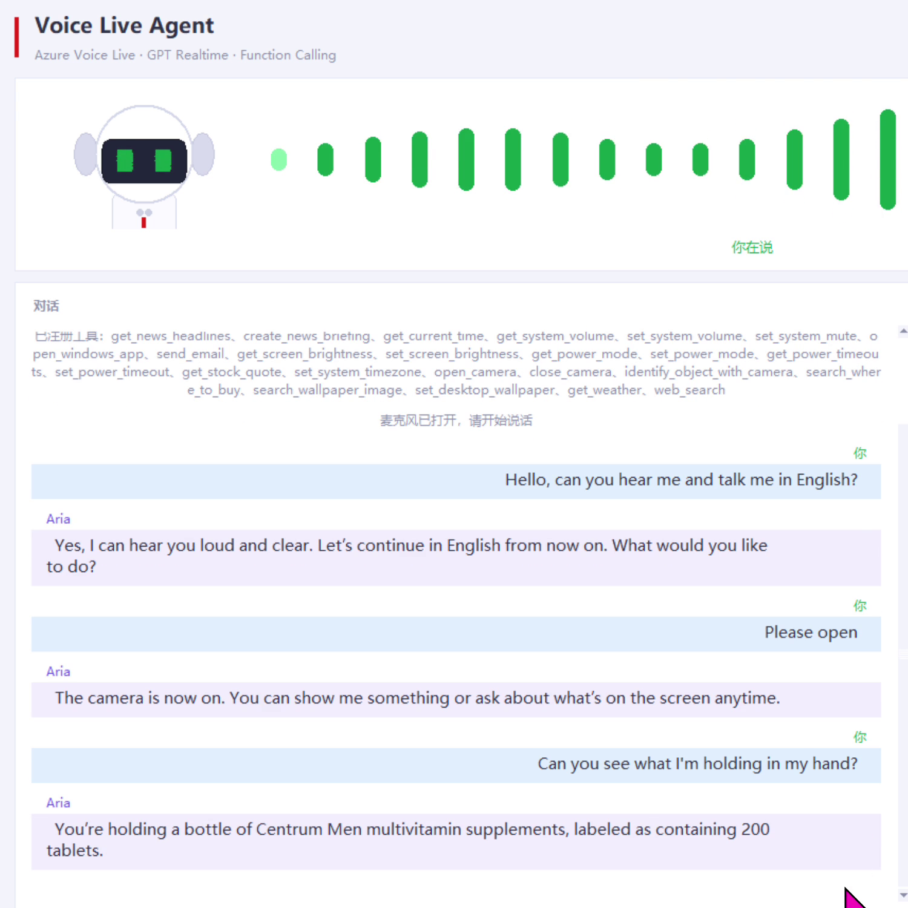
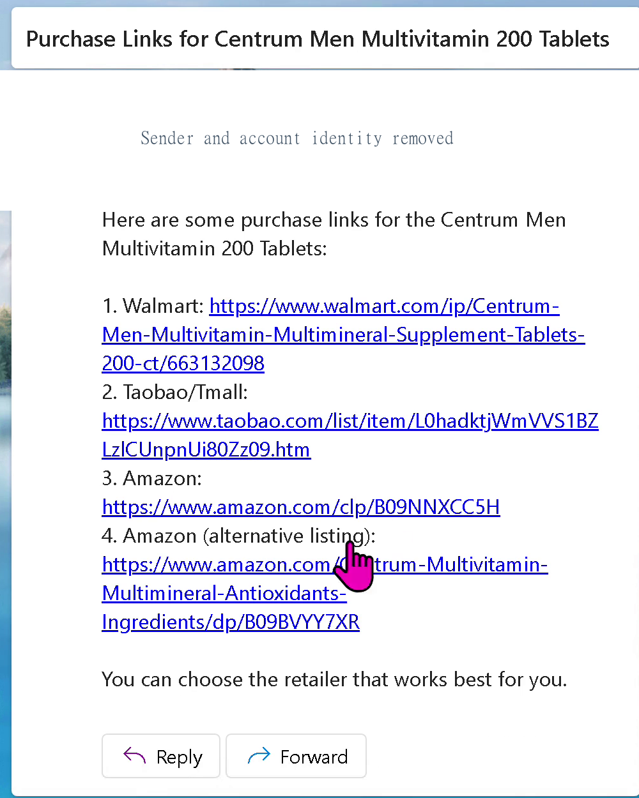
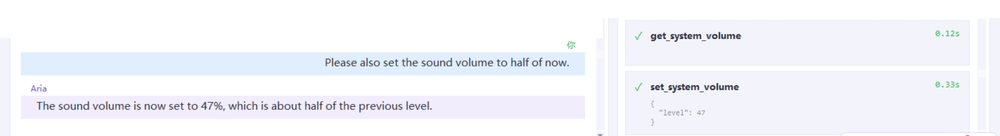
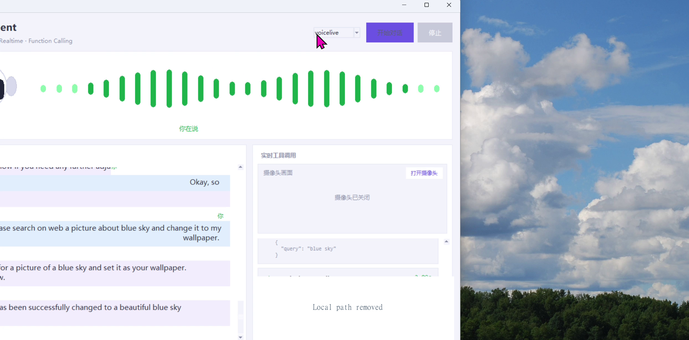

# Voice Live API for AIPC

[](https://www.python.org/)
[](https://www.microsoft.com/windows)
[](https://learn.microsoft.com/azure/ai-services/speech-service/voice-live)
[](https://github.com/david-xinyuwei/david-share/actions/workflows/voice-live-aipc-ci.yml)
[](LICENSE)

A Windows AIPC voice agent that combines the **Azure Voice Live API** with 24 local tools for realtime conversation, camera perception, desktop and power control, live information lookup, wallpaper actions, and allowlisted email delivery. Voice coordination runs in Azure; every device action runs on the user's PC and remains visible on that device. The user can explicitly select the assistant's response language, and that choice persists until explicitly changed.

> Author: **Xinyu Wei**

**English** | [中文](README-CN.md) · [Customer start here](CUSTOMER-START-HERE.md) · [Source](https://github.com/david-xinyuwei/david-share/tree/master/Agents/Voice-Live-API-AIPC)

[Truth boundary](#what-is-real-and-what-you-bring) · [Technology](#technology-stack-and-call-paths) · [Architecture](#architecture) · [Quick Start](#quick-start) · [Evidence](#measured-validation) · [Official Voice Live documentation](https://learn.microsoft.com/azure/ai-services/speech-service/voice-live)

## Scenario evidence

No video is published. These four screenshots come from one continuous Windows run and use per-scenario cropping or opaque pixel replacement. They contain no human face or profile avatar, email or account identifier, desktop icon/folder/filename, or local path. [View the screenshot evidence manifest](evidence/scenario-screenshots.json).

| Scenario | User request | Executed path | Observed result |
|---|---|---|---|
| Medication/supplement recognition | "Can you see what I'm holding in my hand?" | `open_camera` → `identify_object_with_camera` | The recorded response identified Centrum Men multivitamin supplements labeled as 200 tablets |
| Email receipt | "Please send me the purchase link to my email." | `search_where_to_buy` → protected `send_email` through Microsoft Graph | New Outlook displayed `Purchase Links for Centrum Men Multivitamin 200 Tablets` with four retailer links |
| System volume | "Please also set the sound volume to half of now." | `get_system_volume` → `set_system_volume` | The Windows readback and assistant response reported `47%` |
| Desktop wallpaper | "Search for a blue-sky picture and change it to my wallpaper." | WebIQ image search → protected `set_desktop_wallpaper` | The desktop changed to the blue-sky image and the tool completed successfully |

### Medication/supplement recognition



*The entire camera/person column is excluded. The screenshot proves the recorded visual-tool response, not medical correctness, product safety, or purchase suitability.*

### Email receipt



*Only the received subject and message body remain. Sender, recipient, account, date, and avatar pixels are permanently replaced. This is one observed inbox receipt, not an email-delivery SLA.*

### System volume



*The application shows the `get_system_volume` and `set_system_volume` calls plus the `47%` result. The Windows taskbar is excluded.*

### Desktop wallpaper



*All desktop icons, folders, filenames, and the tool's local image path are excluded or permanently replaced. The remaining frame shows the successful tool card and the applied blue-sky background.*

---

## What is real and what you bring

Microsoft defines Voice Live as: **"a solution that enables low-latency, high-quality speech-to-speech interactions for voice agents."** It unifies speech recognition, generative AI, and text-to-speech behind one interface. Source: [Voice Live API Overview](https://learn.microsoft.com/azure/ai-services/speech-service/voice-live), accessed 2026-08-26.

This repository is an executable Windows application, not a UI-only simulation.

| Surface | This repository actually does | You provide |
|---|---|---|
| Realtime voice | Opens a real Voice Live WebSocket, streams PCM16 audio, configures multilingual semantic VAD, deep noise suppression, server-reference echo cancellation, `gpt-realtime`, an Azure neural voice, and persistent user-selected response language | A Microsoft Foundry resource, supported region, endpoint, and either Entra access or an API key |
| Function calling | Publishes 24 default tool schemas and executes the selected tool on the local PC; high-impact actions require a later one-time confirmation bound to the exact arguments | Consent to local side effects and any optional provider credentials |
| AIPC device control | Reads/sets volume, launches allowlisted apps, changes timezone, brightness, power mode, display/sleep/hibernate timeouts, and wallpaper using Windows APIs | Windows 10/11 and compatible hardware |
| Camera perception | Captures the current local camera frame and sends it to a caller-configured multimodal model only after an explicit camera/vision request | Camera permission and an Azure OpenAI chat deployment |
| Live information | Calls Open-Meteo, market quote providers, RSS feeds, and WebIQ; provider failure is explicit | WebIQ key for search-driven features |
| Email delivery | Sends through Microsoft Graph by default, or SMTP when explicitly selected; recipient allowlisting, message-size limits, and a later exact-action confirmation are enforced before transport | A public-client app or SMTP credentials, plus a recipient allowlist |
| CI and fixtures | Validates schemas, refusal paths, source contracts, README/evidence consistency, and absence of fake runtime paths | No cloud credentials and no device access |

### Important boundaries

- **No mock fallback:** production tools do not replace unavailable services with static data or synthetic success.
- **The user selects the assistant language:** an explicit request such as “Please speak English” switches assistant speech, model-authored progress, confirmation questions, and error explanations to English until the user explicitly requests another language. Quoted or practiced foreign-language text alone does not switch it. Chinese is the default only before any language is selected. The current Tkinter chrome and deterministic tool-card labels remain Chinese-first and do not dynamically localize.
- **High-impact actions require two turns:** mail, camera open/capture, timezone, power, wallpaper, and image generation return a one-time token first. Only one protected action may be pending; a competing action is rejected. Only a later explicit confirmation of unchanged arguments can execute it; replay, expiry, cancellation, and changed arguments fail closed.
- **Email is a real side effect:** unlike a draft-only workflow, a confirmed `send_email` call transmits mail after recipient and size validation.
- **Windows-only device tools:** CI validates their contracts but does not claim that it moved a real slider, camera, or power setting.
- **No production certification:** the committed evidence is a sanitized record of a bounded demo validation, not an SLA, security certification, model-quality benchmark, or universal hardware guarantee.
- **Credentials remain local:** `.env`, MSAL caches, account identifiers, endpoints, subscriptions, tenants, and raw logs are excluded from Git.

## Product walkthrough


*Real Windows application window captured from the sealed runtime. The screen exposes no endpoint, account, tenant, subscription, local path, or credential.*

The workspace keeps the conversation, voice state, camera preview, and live tool cards visible together. The dropdown exposes three connection modes:

| UI mode | Service path | Intended use |
|---|---|---|
| `voicelive` | Voice Live model connection | Default and fully validated path: `gpt-realtime` + Azure neural voice + Voice Live enhancements |
| `voicelive-agent` | Voice Live connected to a Foundry Agent | Optional centrally managed persona/tool-definition path; local code still executes device tools |
| `realtime` | Azure OpenAI Realtime `/openai/v1/realtime` | Control path for comparing direct Realtime with the Voice Live enhancement layer |

The Azure deployment used for the bounded validation reported `gpt-realtime` version `2025-08-28`, not `gpt-realtime-2.1`; the evidence records the Azure Resource Manager metadata source with resource identifiers removed. User-visible input captions use `gpt-4o-transcribe`; model audio understanding and user-caption generation are separate protocol surfaces.

## Technology stack and call paths

The application has one default voice path and two optional comparison/management paths. Voice Live and direct Realtime reuse the checked-in English runtime instructions and local tool schemas. Foundry Agent mode instead takes persona and tool definitions from the caller-provided cloud Agent, while reusing the local dispatcher, confirmation boundary, audio/events, and Windows execution layer.

| Technology | Real role in this repository | Call boundary | Source evidence |
|---|---|---|---|
| Azure Voice Live API (`azure-ai-voicelive==1.3.0`) | Default and fully validated speech-to-speech path: `gpt-realtime`, Azure neural voice, `gpt-4o-transcribe`, multilingual Semantic VAD, noise suppression, server-reference echo cancellation, streaming audio, and function calling | Windows app ↔ Voice Live WebSocket | [src/backends/voicelive.py](src/backends/voicelive.py), [live evidence](evidence/live-validation.json) |
| Azure OpenAI GPT Realtime (`openai[realtime]==3.0.0`) | Optional direct Realtime control path for comparing the base `/openai/v1/realtime` protocol with Voice Live enhancements | Windows app ↔ Azure OpenAI Realtime | [src/backends/realtime.py](src/backends/realtime.py) |
| Microsoft Foundry Agent through Voice Live | Optional path where the cloud Agent definition owns persona and tool schemas; the client cannot inject runtime instructions or tools, but local Windows code still receives and executes declared device calls | Voice Live ↔ caller-provided Foundry Agent; Entra authentication only; not covered by the committed default-path live evidence | [src/backends/voicelive_agent.py](src/backends/voicelive_agent.py) |
| WebIQ Web Search | Live web and image search for general queries, shopping lookup, wallpaper discovery, and the explicit fallback after RSS source failures | Local tool ↔ WebIQ service | [src/tools/websearch.py](src/tools/websearch.py), [src/tools/vision.py](src/tools/vision.py), [src/tools/wallpaper.py](src/tools/wallpaper.py), [src/tools/news.py](src/tools/news.py) |
| Microsoft Graph API + MSAL | Default real email-delivery path using delegated `Mail.Send`, a recipient allowlist, and a locally protected token cache | Local tool ↔ `POST /v1.0/me/sendMail` | [src/graph_mail.py](src/graph_mail.py), [src/tools/mailer.py](src/tools/mailer.py) |
| Azure OpenAI chat and image APIs | Optional camera-frame analysis and news briefing through Chat Completions; optional wallpaper generation through an explicitly configured image deployment | Local tool ↔ caller-configured Azure OpenAI deployment | [src/aoai.py](src/aoai.py), [src/tools/vision.py](src/tools/vision.py), [src/tools/briefing.py](src/tools/briefing.py), [src/tools/wallpaper.py](src/tools/wallpaper.py) |
| Public data providers | Open-Meteo weather; RSS news feeds with WebIQ fallback; Yahoo Finance quotes with Tencent Stock Quote fallback | Local tool ↔ named public provider | [src/tools/weather.py](src/tools/weather.py), [src/tools/news.py](src/tools/news.py), [src/tools/stocks.py](src/tools/stocks.py) |
| Windows AIPC runtime | Tkinter UI, PyAudio PCM16 capture/playback, OpenCV camera capture, pycaw/Core Audio, WMI/CIM brightness, PowrProf power controls, trusted Win32 processes, and local files | Local process and Windows APIs; no cloud proxy for device actions | [app.py](app.py), [src/audio.py](src/audio.py), [src/camera.py](src/camera.py), [src/tools/desktop.py](src/tools/desktop.py), [src/tools/power.py](src/tools/power.py) |

The default validated path is **Voice Live**, not direct Realtime and not the Foundry Agent mode. Web search is implemented with **WebIQ**, not Bing. Microsoft Graph is the default mail transport; SMTP remains an explicitly selected compatibility path.

## Architecture


*Solid blue is the default validated Voice Live path. Dashed purple paths are optional direct Realtime and Foundry Agent modes. Green paths are real local tool calls to Windows APIs or named external services.*

Runtime flow:

1. [src/audio.py](src/audio.py) captures PCM16 microphone audio and plays streamed response audio.
2. [src/backends/voicelive.py](src/backends/voicelive.py) opens the default Voice Live WebSocket and configures `gpt-realtime`, `gpt-4o-transcribe`, multilingual Semantic VAD, deep noise suppression, and server-reference echo cancellation. [src/backends/realtime.py](src/backends/realtime.py) and [src/backends/voicelive_agent.py](src/backends/voicelive_agent.py) are optional alternatives selected in the UI.
3. [src/agent_core.py](src/agent_core.py) correlates function calls and passes them to the shared dispatcher without exposing full arguments or results in UI events or logs.
4. [src/confirmation.py](src/confirmation.py) blocks protected actions until a later explicit user turn confirms the same argument digest with a valid one-time token.
5. [src/tools](src/tools) performs local Windows actions or calls the explicitly named external provider, then returns structured results to the voice backend.
6. The UI receives actual session/tool events through [src/events.py](src/events.py); it does not animate a fabricated execution trace.

## Executable assets

| Path | Contract |
|---|---|
| [app.py](app.py) | Tkinter application entrypoint, mode selection, voice state, camera preview, and tool cards |
| [src/backends/voicelive.py](src/backends/voicelive.py) | Primary Voice Live WebSocket path |
| [src/backends/realtime.py](src/backends/realtime.py) | Direct Azure OpenAI Realtime comparison path |
| [src/agent_core.py](src/agent_core.py) | Shared prompt and function-call orchestration |
| [src/confirmation.py](src/confirmation.py) | Later-turn, exact-argument authorization for high-impact actions |
| [src/tools](src/tools) | 25 definitions; 24 enabled by default; image generation requires an explicitly configured deployment |
| [scripts/preflight.py](scripts/preflight.py) | Offline session serialization or real backend acceptance probe |
| [scripts/smoke_tools.py](scripts/smoke_tools.py) | Live external-provider smoke tests; some cases change the desktop |
| [scripts/graph_login.py](scripts/graph_login.py) | One-time Microsoft Graph delegated login for mail delivery |
| [VoiceLiveAgent-dir.spec](VoiceLiveAgent-dir.spec) | PyInstaller onedir build used for the Windows executable |
| [scenario-manifest.json](scenario-manifest.json) | Dynamic-runtime versus test-fixture classification |
| [evidence/live-validation.json](evidence/live-validation.json) | Sanitized bounded live-run evidence |
| [scripts/pre_delivery_check.py](scripts/pre_delivery_check.py) | Fail-closed public, authenticity, evidence, README, and source gates |

## Local tool surface

The default public configuration registers 24 tools. A 25th tool, `generate_wallpaper_image`, registers only when `AZURE_OPENAI_IMAGE_DEPLOYMENT` is configured.

| Domain | Default tools |
|---|---|
| Voice and desktop | `get_system_volume`, `set_system_volume`, `set_system_mute`, `open_windows_app` |
| Display and power | `get_screen_brightness`, `set_screen_brightness`, `get_power_mode`, `set_power_mode`, `get_power_timeouts`, `set_power_timeout`, `set_system_timezone` |
| Camera and vision | `open_camera`, `close_camera`, `identify_object_with_camera`, `search_where_to_buy` |
| Live information | `get_current_time`, `get_weather`, `get_stock_quote`, `get_news_headlines`, `web_search` |
| Content and delivery | `create_news_briefing`, `send_email`, `search_wallpaper_image`, `set_desktop_wallpaper` |

Notable refusal paths:

- Ambiguous or unintelligible speech must not trigger a tool.
- Camera content is unavailable until the vision tool captures a frame.
- Shopping search requires an explicit buying/price question.
- Mail rejects an empty allowlist, unknown recipients, header newlines, oversized content, and any missing/replayed/expired/changed confirmation.
- Camera open/capture, timezone, power, wallpaper, image generation, and mail cannot execute in the request turn; they require a separate explicit confirmation.
- Wallpaper changes reject paths outside the configured wallpaper directory.
- Wallpaper downloads resolve each HTTPS hop once, reject any non-global DNS answer, connect TLS to that exact validated IP while verifying the original hostname, and reject nonstandard-port, oversized, or invalid-image responses.
- Windows applications and PowerShell resolve from trusted `%SystemRoot%` locations rather than caller-controlled `PATH` entries.

## Measured validation

The public [evidence summary](evidence/live-validation.json) is derived from a real Windows run with resource identifiers removed.

| Check | Observed result | Evidence boundary |
|---|---|---|
| Voice Live connection | WebSocket established; `session.updated` received | One configured Microsoft Foundry resource |
| Tool acceptance | 24 registered and 24 accepted by the service | Default configuration; image generation disabled |
| Session contract | `gpt-realtime`, `gpt-4o-transcribe`, multilingual semantic VAD | Exact SDK/configuration recorded in evidence |
| Deployment metadata | Model version `2025-08-28` | Sanitized Azure Resource Manager deployment metadata; resource identifiers removed |
| External smoke | Time, weather, stock, news, WebIQ search, and wallpaper-image lookup: 6/6 PASS | Provider availability at capture time only |
| Market fallback | Tencent quote path returned a real quote after Yahoo HTTP 403 | Provider-specific fallback, not a market-data SLA |
| News fallback | WebIQ returned real source pages after RSS connection timeouts | Search results do not guarantee publication timestamps |
| Publication package self-check | 15 checks passed, 0 failed | [Single-build package evidence](evidence/publication-validation.json); artifact is not published |

The repository does not publish raw logs because they can contain endpoints, account identifiers, local paths, camera artifacts, or message content. CI instead recomputes deterministic contracts from the committed tree. See [evidence/README.md](evidence/README.md) for live-run and publication-package lineage and scope.

## Quick Start

### Prerequisites

- Windows 10/11 on x64 or ARM64, with a microphone and speaker
- Python 3.11, 3.12, or 3.13
- A [Microsoft Foundry resource](https://learn.microsoft.com/azure/ai-services/multi-service-resource) in a [Voice Live supported region](https://learn.microsoft.com/azure/ai-services/speech-service/regions?tabs=voice-live#regions)
- For Entra authentication: `Cognitive Services User` and `Foundry User` on the resource

### 1. Clone and install - local side effects only

```powershell
git clone https://github.com/david-xinyuwei/david-share.git
Set-Location .\david-share\Agents\Voice-Live-API-AIPC
py -3.11 -m venv .venv
.\.venv\Scripts\python.exe -m pip install --upgrade pip
.\.venv\Scripts\python.exe -m pip install -r requirements.txt
Copy-Item .env.example .env
```

**Done-When:** `.venv\Scripts\python.exe` imports `azure.ai.voicelive` successfully and `.env` remains untracked.

### 2. Configure Voice Live - local secret storage

Edit `.env` and set your own resource values:

```ini
AZURE_VOICELIVE_ENDPOINT=https://<your-resource>.services.ai.azure.com/
AZURE_VOICELIVE_MODEL=gpt-realtime
AZURE_VOICELIVE_VOICE=zh-CN-XiaoxiaoMultilingualNeural
AZURE_VOICELIVE_API_KEY=<your-api-key>
```

API key authentication is the shortest local-demo path. For keyless authentication, leave `AZURE_VOICELIVE_API_KEY` empty, set a project-specific `AZURE_CONFIG_DIR`, sign in with Azure CLI, and select the intended subscription:

```powershell
$env:AZURE_CONFIG_DIR = "$HOME\.azure-voice-live-aipc"
az login
az account set --subscription <your-subscription-id>
az account show --query "{name:name,id:id,tenantId:tenantId}" -o table
```

**Done-When:** the selected identity has the required roles on the same resource named by `AZURE_VOICELIVE_ENDPOINT`.

### 3. Offline gate - `sideEffects: []`

```powershell
.\.venv\Scripts\python.exe -m scripts.preflight --mode voicelive --dry-run
.\.venv\Scripts\python.exe scripts\pre_delivery_check.py
```

**Done-When:** session serialization reports 24 tools and all deterministic gates pass without opening the microphone or changing Windows settings.

### 4. Real backend acceptance - network and Azure usage

```powershell
.\.venv\Scripts\python.exe -m scripts.preflight --mode voicelive
```

This opens a real Voice Live WebSocket and waits for `session.updated`; it does not start microphone capture.

**Done-When:** the service accepts the model, voice, transcription, VAD, and all 24 default tools.

### 5. Start the application - microphone and local-device access

```powershell
.\run.cmd
```

Select **Start conversation**. Use headphones for the most predictable demo path.

For an English recording, begin with: **“Please speak English for this demo and keep using English until I explicitly request another language.”** The selection remains active across later turns, even if a turn quotes or practices another language. To switch back, explicitly say: **“Please switch to Chinese.”**

**Done-When:** the UI reports that the microphone is open, the agent follows the explicitly selected language across later turns, and a harmless tool such as time or weather completes in the tool panel.

## Optional integrations

### Microsoft Graph mail

The default mail transport is Microsoft Graph and sends real mail. Create a Microsoft Entra public-client application, enable public-client flows, grant delegated `Mail.Send`, and configure:

```ini
MAIL_TRANSPORT=graph
GRAPH_CLIENT_ID=<your-public-client-application-id>
GRAPH_AUTHORITY=https://login.microsoftonline.com/<your-tenant-id>
MAIL_DEFAULT_RECIPIENT=user@example.com
MAIL_ALLOWED_RECIPIENTS=user@example.com
```

For personal Microsoft accounts, `GRAPH_AUTHORITY=https://login.microsoftonline.com/consumers` is supported. Perform the one-time delegated login:

```powershell
.\.venv\Scripts\python.exe -m scripts.graph_login
```

The MSAL cache is stored locally as `.msal_token_cache.json` and is ignored by Git. Before every read, Windows DACLs must be non-inherited and grant Full Control only to the current SID and `SYSTEM`; insecure legacy/fallback caches are rejected. Updates are written to a temporary file, flushed, secured, and atomically installed. Access tokens expire and are refreshed silently while the delegated refresh grant remains valid. Revoked consent, account security changes, long inactivity, or cache deletion require login again.

### Search, vision, images, and briefings

- `WEBIQ_API_KEY` enables general web search, shopping lookup, and wallpaper-image search.
- `AZURE_OPENAI_ENDPOINT` plus `AZURE_OPENAI_CHAT_DEPLOYMENT` enable camera-frame analysis and news briefing generation.
- `AZURE_OPENAI_IMAGE_DEPLOYMENT` enables the optional 25th tool for image generation.
- `MAIL_TRANSPORT=smtp` enables the explicit SMTP path for providers that still allow authenticated SMTP.

Every unavailable optional dependency fails explicitly. It never turns into demo data.

## Build the Windows onedir package

```powershell
.\.venv\Scripts\python.exe -m pip install -r requirements-dev.txt
.\.venv\Scripts\python.exe -m PyInstaller --noconfirm --clean VoiceLiveAgent-dir.spec
```

Run `dist\VoiceLiveAgent\VoiceLiveAgent.exe` with the entire `VoiceLiveAgent` directory intact. Place the local `.env` next to the EXE. Do not publish an executable containing credentials.

**Done-When:** `dist\VoiceLiveAgent\VoiceLiveAgent.exe --self-check` exits `0` and writes `SELF_CHECK=PASS` to `dist\VoiceLiveAgent\self_check.txt`.

## Testing and quality gates

Deterministic CI is Windows-only because the runtime imports Windows audio and device APIs:

```powershell
.\.venv\Scripts\python.exe scripts\audit_public_content.py
.\.venv\Scripts\python.exe scripts\demo_code_validator.py
.\.venv\Scripts\python.exe scripts\validate_evidence.py
.\.venv\Scripts\python.exe scripts\validate_readmes.py
.\.venv\Scripts\python.exe scripts\pre_delivery_check.py
.\.venv\Scripts\python.exe -m pip check
.\.venv\Scripts\pip-audit.exe --local --progress-spinner off --timeout 15
```

CI does not call Azure, open the microphone/camera, send mail, change wallpaper, or mutate power settings. Live validation remains an explicit operator action through `preflight`, `smoke_tools`, and the GUI.

## Compatibility and troubleshooting

| Symptom | Check |
|---|---|
| `MissingConfig` | Confirm `.env` is beside `app.py` or the packaged EXE and contains the named key |
| Entra Voice Live authorization failure | Confirm isolated Azure CLI identity, selected subscription, `Cognitive Services User`, and `Foundry User` |
| Graph mail requests login | Rerun `python -m scripts.graph_login`; verify app registration, delegated `Mail.Send`, authority, and recipient allowlist |
| Camera is unavailable or black | Check Windows camera privacy, physical shutter, other camera apps, and RDP video-device redirection |
| Brightness tool fails | WMI brightness applies to compatible internal displays; external monitors commonly require DDC/CI |
| RSS or market provider fails | Read the explicit provider error; configured real-provider fallbacks may still be blocked or throttled |
| UI shows stale Windows power values | Close and reopen Windows Settings; the tool response includes values read back from PowrProf |

## Repository map

```text
Voice-Live-API-AIPC/
├── app.py                         Windows UI entrypoint
├── src/                           Voice backends, audio/camera, orchestration, tools
├── scripts/                       Preflight, live smoke, login, and public quality gates
├── tests/                         Offline contracts and refusal paths
├── evidence/                      Sanitized runtime summary and evidence scope
├── images/                        Real UI and responsibility architecture
├── scenario-manifest.json         Runtime/test-fixture classification
├── .env.example                   Placeholder-only configuration contract
├── VoiceLiveAgent-dir.spec        PyInstaller onedir build
└── README.md / README-CN.md        Bilingual entrypoints
```

## Official sources

- [Voice Live API Overview](https://learn.microsoft.com/azure/ai-services/speech-service/voice-live)
- [How to use the Voice Live API](https://learn.microsoft.com/azure/ai-services/speech-service/voice-live-how-to)
- [Voice Live supported regions](https://learn.microsoft.com/azure/ai-services/speech-service/regions?tabs=voice-live#regions)
- [Official Voice Live samples](https://github.com/microsoft-foundry/voicelive-samples)
- [Azure OpenAI Realtime audio](https://learn.microsoft.com/azure/ai-foundry/openai/how-to/realtime-audio)
- [Microsoft Graph `user: sendMail`](https://learn.microsoft.com/graph/api/user-sendmail)
- [Microsoft identity platform refresh tokens](https://learn.microsoft.com/entra/identity-platform/refresh-tokens)

## License and security

Licensed under [MIT](LICENSE). See [SECURITY.md](SECURITY.md) before enabling camera, device-control, or mail features, and [CONTRIBUTING.md](CONTRIBUTING.md) before proposing changes.
