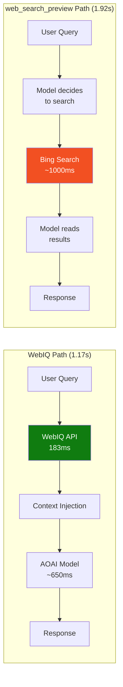

# Microsoft Web IQ：AI-Native Search Grounding Benchmark


这是一个针对 Microsoft Web IQ 的完整 benchmark。我们把 WebIQ 作为 AI assistant 的显式 retrieval 层，和 Azure OpenAI Responses API 里的 `web_search_preview` 做延迟、回答质量、token efficiency、以及多模态能力对比。

> **Author**: Xinyu Wei (魏新宇), Microsoft AI and Apps Global Black Belt (GBB) Senior System Engineer | **Date**: 2026-06-16

[English](README.md) | 中文版 | [相关 Repo：AOAI Model Migration Benchmark](../AOAI-Model-Migration-Benchmark/)

---

## Running on Azure

| 项目 | 配置 |
|------|------|
| Web IQ API | `https://api.microsoft.ai/v3` — limited access（[portal](https://aka.ms/webiq-portal)） |
| AOAI Endpoint | 通过 API Management 暴露的 Azure OpenAI-compatible endpoint → East US 2 |
| Models | gpt-4o-mini, gpt-5.4-nano, gpt-5.4-mini |
| SDK | `webiq==0.1.0` (Python, MIT license) |
| 对比基线 | Responses API `web_search_preview`，`search_context_size=low` |

---

## Executive Summary

Microsoft 对 Web IQ 的官方描述是："a suite of AI-native APIs that gives applications access to fresh, real-world intelligence from across the web — including web pages, news, images, and videos"（来源：[Microsoft WebIQ](https://www.microsoft.com/en-us/webiq)，访问日期 2026-06-16）。

这个 benchmark 测的是 WebIQ 作为 **explicit retrieval + context injection** 路径时的效果，并和 Azure OpenAI Responses API 内置的 **`web_search_preview` tool orchestration** 路径做对比。

### 核心发现

| 维度 | WebIQ | `web_search_preview` | 差异 |
|------|-------|---------------------|------|
| **Search-layer P50** | 183 ms | ~1,000–1,300 ms（基于 latency decomposition 估算） | **约 6x 更快** |
| **E2E TTFT P50 (gpt-5.4-mini)** | 1.17s | 1.92s | **快 39%** |
| **E2E TTFT P50 (gpt-4o-mini)** | 1.38s | 1.99s | **快 31%** |
| **回答质量** | 能给出具体产品、价格、URL | 有时较泛，甚至返回 no results | WebIQ 至少不差 |
| **Token efficiency (passage mode)** | news/weather 场景省 20–28% token | 不可配置 | WebIQ 更可控 |
| **Multi-modal coverage** | Web + News + Images + Videos + Browse | 主要是 Web | WebIQ 能力面更广 |

> **范围说明**：这是 latency + capability benchmark，不是完整的人类答案质量评测。质量判断来自 3 个 sampled scenarios 的并排回答观察。

### 架构对比



---

## 1. Web IQ 到底是什么？

Web IQ 不是传统 Bing Search API，也不是 Foundry 的 Grounding with Bing。它更像两者中间的一层：

| 层级 | 产品 | 做什么 | 延迟 |
|:---:|------|--------|:---:|
| 底层 | Bing Search API v7 | 返回 URL + snippet | ~200ms |
| **中间层** | **Web IQ** | 返回适合 LLM 的 **passage-level extracted context** | **~180ms** |
| 上层 | `web_search_preview` / Foundry+Bing | 模型自己做 tool orchestration，然后生成最终回答 | ~1500-2000ms |

Web IQ 的核心价值（来源：[PyPI webiq SDK](https://pypi.org/project/webiq/)）：

- 基于 Bing infrastructure 检索相关页面
- 抽取最相关 passage，而不是只给两行 snippet
- 按 LLM grounding 场景排序和返回内容
- 支持 4 种 content format：`passage` / `text` / `html` / `markdown`

---

## 2. Web IQ API 能力（6 个 API）

以下全部是在 2026-06-16 用 Lenovo / Qira 相关场景实测。

| # | API | 场景 | 延迟 | 返回结果 | 状态 |
|---|-----|------|-----:|:------:|:---:|
| 1 | `web.search()` | "ThinkPad X1 Carbon 2026 price" | 454ms | 3 个带价格的产品页 | ✅ |
| 2 | `news.search()` | "AI artificial intelligence" | 276ms | 5 条新闻 + 来源媒体 | ✅ |
| 3 | `videos.search()` | "How to set up Lenovo AI PC" | 159ms | 3 个 YouTube 视频 + 播放量 | ✅ |
| 4 | `images.search()` | "Lenovo ThinkPad X1 Carbon 2026" | 192ms | 5 张产品图片 | ✅ |
| 5 | `browse.fetch()` | Lenovo.com ThinkPad 页面 | 536ms | `result is dropped` | ⚠️ |
| 6 | `classic.search()` | "Seattle weather today" | 513ms | 结构化 weather JSON + web results | ✅ |

### Input / Output 总结

| API | 输入 | 输出 | 独特价值 |
|-----|------|------|----------|
| `web.search` | 文本 query（1-1000 字符） | title + URL + passage/html/text/markdown content | passage-level extraction |
| `news.search` | 文本 query | title + URL + content + **source media** | 专门的新闻源 |
| `videos.search` | 文本 query | title + URL + **duration** + **view count** + moments | 视频 metadata |
| `images.search` | 文本 query | 图片 URL + **尺寸** + host page + caption | 尺寸/比例过滤 |
| `browse.fetch` | **URL** | 单页全文 content（markdown/html/text） | 支持 live crawl |
| `classic.search` | 文本 query | 30+ answer types（weather JSON、finance、sports 等） | 结构化数据 |

> **限制**：所有 search API 都是文本输入，不支持 image-to-image search，也不支持 video-to-search。`browse.fetch` 对有 bot protection 的站点可能失败。

---

## 3. Latency Benchmark

### 3.1 Search-Layer Only

原始 migration 场景（`pricing`, `news`, `weather`），10 iterations，2 warmup discarded：

| 指标 | 值 |
|------|---:|
| **P50** | **183 ms** |
| **P95** | **194 ms** |
| Quality pass | 24/24 |
| Samples | 24 |

这和 WebIQ 官网的 "164ms P95 — nearly 2.5x faster than today's best alternative" 基本对齐（来源：[Microsoft WebIQ](https://www.microsoft.com/en-us/webiq)）。

### 3.2 End-to-End：WebIQ + AOAI vs `web_search_preview`

同一组 scenario、同一 APIM endpoint、同一组模型，3 轮交叉运行，排除 warmup。

| 模型 | WebIQ E2E P50 | `web_search_preview` P50 | **WebIQ 快** | WebIQ P95 | WS P95 |
|------|--------------:|-------------------------:|:----------:|----------:|-------:|
| gpt-4o-mini | **1.38s** | 1.99s | **30.7%** | 1.80s | 4.50s |
| gpt-5.4-nano | **1.52s** | 1.83s | **16.8%** | 2.00s | 3.22s |
| gpt-5.4-mini | **1.17s** | 1.92s | **38.9%** | 1.52s | 8.21s |

> 数据来源：[AOAI-Model-Migration-Benchmark](../AOAI-Model-Migration-Benchmark/) WebIQ addendum。每个模型 33-36 条有效 E2E 样本，失败样本保留在 JSON 中而不是隐藏。

### 3.3 为什么 E2E 不是 2.5x？

WebIQ 官网的 2.5x 是 **search-layer** 对比，不包含模型生成。E2E 模式下，模型生成会摊薄 search 层收益：

```text
WebIQ E2E  = WebIQ search (~180ms) + model generation (~650ms) = ~1.17s
web_search = platform search (~1000ms) + model generation (~650ms) = ~1.92s
```

Search 层快约 6x，但 E2E 用户体感约 1.6x。

---

## 4. Token Efficiency：`passage` vs `html`

| 场景 | html ~tokens | passage ~tokens | **节省** |
|------|-------------:|----------------:|:-------:|
| pricing | 11,397 | 11,274 | -1% |
| news | 6,118 | 4,738 | **-23%** |
| weather | 3,242 | 2,340 | **-28%** |

- `passage` 会去掉 HTML 标签，并返回更相关的文本段落
- 搜索延迟基本不变（两种格式都在 ~180ms 级别）
- 节省效果依赖页面类型：产品列表页节省不明显，新闻/天气页面节省 20-28%
- 对 LLM grounding，建议优先用 `passage`：更少 token → 更低成本 + 更少 prefill 开销

---

## 5. 回答质量对比

以下是 WebIQ E2E 和 `web_search_preview` 的并排回答观察，使用同一 query、同一模型（gpt-5.4-mini）：

| 场景 | WebIQ 回答 | `web_search_preview` 回答 | 判断 |
|------|------------|--------------------------|:---:|
| **pricing** | "ASUS ExpertBook Ultra **$3,600**" + Digital Trends URL | "typically $1,500-$2,500+... search returned no results" | **WebIQ 更好** |
| **news** | 5 条具体新闻（NVIDIA Cosmos 3、Salesforce acquisition 等）+ URL | 3 条具体新闻（OpenAI policy、Anthropic、Google Gemini）+ URL | **相当** |
| **weather** | NOAA 数据：61°F、SW 5mph、42% humidity、30.04 inHg + 官方 URL | AccuWeather：64°F、ENE 2mph + forecast | **相当** |

> 这是 3 个 sampled scenarios 的定性观察，不是统计意义上的人工质量评测。完整回答保存在 `outputs/quality_comparison_20260616.json`。

---

## 6. 什么时候适合用 WebIQ？

| 场景 | 推荐 API | 原因 |
|------|----------|------|
| AI assistant grounding（chat / Q&A） | `web.search(content_format=passage)` | 快、紧凑、可引用 |
| 新闻简报 / 动态追踪 | `news.search()` | 专门的 news source + media attribution |
| 教程 / 帮助推荐 | `videos.search()` | 返回视频时长、播放量、关键片段 |
| 产品图片展示 | `images.search()` | 返回图片 URL、尺寸、来源页 |
| 读取特定 URL | `browse.fetch(live_crawl="fallback")` | 抽取单页全文，但部分站点会失败 |
| 结构化答案（天气、金融等） | `classic.search()` | 返回 JSON 数据，不只是网页 |
| Multi-step agent chains | 任意 WebIQ API | 每步 ~180ms，不会像 1-2s 的工具调用那样拖慢链路 |

### 不适合的场景

| 场景 | 为什么不适合 | 替代 |
|------|-------------|------|
| 任务不需要搜索 | 平白多 180ms | 直接模型回答 |
| 想要零代码平台编排 | WebIQ 需要自己注入 context | `web_search_preview` |
| 以图搜图 / visual search | WebIQ 不支持 image-to-image input | Bing Visual Search API |
| 受 bot protection 的站点 | `browse.fetch` 可能失败 | 专门的抓取工具 |

---

## 7. 复现方法

### 前置条件

- Python 3.11+
- WebIQ API key（MSFT 员工可从 [aka.ms/webiq-portal](https://aka.ms/webiq-portal) 获取）
- Azure OpenAI deployment（仅 E2E 测试需要）

### 安装

```bash
pip install webiq openai numpy httpx
```

### Quick Test（只测搜索层，不需要 Azure）

```bash
export WEBIQ_API_KEY="YOUR_KEY"
python -c "
from webiq import WebIQClient, ApiKeyAuth
from webiq.types import ContentFormat
client = WebIQClient(auth=ApiKeyAuth(api_key='YOUR_KEY'))
r = client.web.search('Latest AI trends', max_results=5, content_format=ContentFormat.passage)
for x in r.webResults:
    print(f'{x.title}: {x.url}')
"
```

### 完整 E2E Benchmark

参考 [AOAI-Model-Migration-Benchmark/scripts/](../AOAI-Model-Migration-Benchmark/scripts/)：

- `benchmark_webiq_personal_search.py` — WebIQ search-only + E2E
- `benchmark_websearch_personal_search.py` — `web_search_preview` 公平对比

---

## 8. 和其他 Benchmark 的区别

| Benchmark | Scope | WebIQ APIs tested | E2E comparison | Quality check |
|-----------|-------|:-----------------:|:--------------:|:-------------:|
| **本 repo** | 6 APIs × scenarios × passage/html × quality | ✅ 全部 6 个 | ✅ 3 模型 | ✅ sampled |
| [henrynn/BingSearch](https://github.com/henrynn/BingSearch)（Xuebing Bai） | web.search latency only | 只测 web | ❌ search vs Foundry full-stack | ❌ |
| [AOAI-Model-Migration-Benchmark](../AOAI-Model-Migration-Benchmark/) | Migration focus + WebIQ addendum | 只测 web | ✅ 3 模型 × 3 轮 | ✅ sanity check |

---

## Appendix

### A. SDK 示例

```python
from webiq import WebIQClient, ApiKeyAuth
from webiq.types import ContentFormat, BrowseContentFormat, ImageAspectRatio

client = WebIQClient(auth=ApiKeyAuth(api_key=os.environ["WEBIQ_API_KEY"]))

# Web search with passage extraction
r = client.web.search("query", max_results=10, content_format=ContentFormat.passage)

# News
n = client.news.search("query", max_results=10)

# Videos
v = client.videos.search("query", max_results=10, freshness="week")

# Images
i = client.images.search("query", max_results=10, aspect_ratio=ImageAspectRatio.wide)

# Browse a URL
b = client.browse.fetch("https://example.com", content_format=BrowseContentFormat.markdown)

# Classic (multi-answer-type)
c = client.classic.search("query", response_filter=["webResults", "weatherResults"])
```

### B. 原始数据文件

| 文件 | 内容 |
|------|------|
| `passage_e2e_results.json` | passage 模式 E2E 测试（3 queries × 3 models，包含完整回答），本地保存，不提交 |
| `outputs/quality_comparison_20260616.html` | WebIQ vs web_search_preview 并排回答对比，本地保存，不提交 |
| `outputs/quality_comparison_20260616.json` | 完整回答原始 JSON，本地保存，不提交 |

### C. 已知限制

1. **`browse.fetch` 站点兼容性**：对部分站点会返回 `result is dropped`，例如 lenovo.com。可能是 bot protection 或索引策略导致。
2. **Rate limit**：Free Trial tier = 1800 QPM。部分运行触发 rate limit；失败样本保留在 JSON 中，不隐藏。
3. **不支持 visual search**：所有 API 都是文本输入，不支持 image-to-image 或 video-to-search。
4. **质量评测范围有限**：回答质量观察基于 3 个 sampled scenarios × 1 个模型，不是严格的人类质量评测。
5. **Context budget 不完全对齐**：WebIQ 注入约 5×1600 chars（passage mode）；`web_search_preview` 的 `search_context_size=low` 是平台内部黑箱。两边 token budget 可能不同。

---
