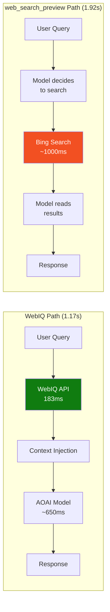

# Microsoft Web IQ: AI-Native Search Grounding Benchmark


Comprehensive benchmark of Microsoft Web IQ — a suite of AI-native APIs for web grounding — comparing it against Azure OpenAI's built-in `web_search_preview` tool across latency, answer quality, token efficiency, and multi-modal capability.

> **Author**: Xinyu Wei (魏新宇), Microsoft AI and Apps Global Black Belt (GBB) Senior System Engineer | **Date**: 2026-06-16

[中文版](README-CN.md) | English | [Related: AOAI Model Migration Benchmark](../AOAI-Model-Migration-Benchmark/)

---

## Running on Azure

| Area | Configuration |
|------|---------------|
| Web IQ API | `https://api.microsoft.ai/v3` — limited access ([portal](https://aka.ms/webiq-portal)) |
| AOAI Endpoint | Azure API Management (GBB APIM) → East US 2 |
| Models | gpt-4o-mini, gpt-5.4-nano, gpt-5.4-mini |
| SDK | `webiq==0.1.0` (Python, MIT license) |
| Comparison baseline | Responses API `web_search_preview` with `search_context_size=low` |

---

## Executive Summary

Microsoft Web IQ is described as "a suite of AI-native APIs that gives applications access to fresh, real-world intelligence from across the web — including web pages, news, images, and videos" ([source](https://www.microsoft.com/en-us/webiq), accessed 2026-06-16).

This benchmark tests WebIQ as an **explicit retrieval + context injection** path for AI assistants, compared against the **built-in `web_search_preview` tool orchestration** in Azure OpenAI Responses API.

### Key Findings

| Dimension | WebIQ | `web_search_preview` | Delta |
|-----------|-------|---------------------|-------|
| **Search-layer P50** | 183 ms | ~1,000–1,300 ms (estimated from latency decomposition) | **~6x faster** |
| **E2E TTFT P50 (gpt-5.4-mini)** | 1.17s | 1.92s | **39% faster** |
| **E2E TTFT P50 (gpt-4o-mini)** | 1.38s | 1.99s | **31% faster** |
| **Answer quality** | Specific products + prices + URLs | Sometimes generic or "no results" | WebIQ ≥ comparable |
| **Token efficiency (passage mode)** | 20–28% fewer tokens on news/weather | Not configurable | WebIQ more efficient |
| **Multi-modal coverage** | Web + News + Images + Videos + Browse | Web only | WebIQ broader |

> **Scope**: This is a latency + capability benchmark, not a full human answer-quality evaluation. Quality observations are based on sampled answers from 3 scenarios.

### Architecture Comparison



---

## 1. What is Web IQ?

Web IQ is **not** the same as Bing Search API or Grounding with Bing. It sits between them:

| Layer | Product | What it does | Latency |
|:-----:|---------|--------------|:-------:|
| Bottom | Bing Search API v7 | Returns URL + 2-line snippet | ~200ms |
| **Middle** | **Web IQ** | Returns **passage-level extracted context** optimized for LLM injection | **~180ms** |
| Top | `web_search_preview` / Foundry+Bing | Model orchestrates search + generates response (you get final answer) | ~1500-2000ms |

Web IQ's "smart extraction layer" (source: [PyPI webiq SDK](https://pypi.org/project/webiq/)):
- Fetches relevant pages from Bing infrastructure
- Extracts the most relevant passages (not just snippets)
- Ranks them for LLM consumption
- Supports 4 content formats: `passage` / `text` / `html` / `markdown`

---

## 2. Web IQ API Capabilities (6 APIs)

All tested with Lenovo AI assistant scenarios on 2026-06-16.

| # | API | Scenario | Latency | Results | Status |
|---|-----|----------|--------:|:-------:|:------:|
| 1 | `web.search()` | "ThinkPad X1 Carbon 2026 price" | 454ms | 3 products with prices | ✅ |
| 2 | `news.search()` | "AI artificial intelligence" | 276ms | 5 news articles + sources | ✅ |
| 3 | `videos.search()` | "How to set up Lenovo AI PC" | 159ms | 3 YouTube videos + view counts | ✅ |
| 4 | `images.search()` | "Lenovo ThinkPad X1 Carbon 2026" | 192ms | 5 product images (CES 2026) | ✅ |
| 5 | `browse.fetch()` | Lenovo.com ThinkPad page | 536ms | ❌ "result is dropped" | ⚠️ |
| 6 | `classic.search()` | "Seattle weather today" | 513ms | Structured weather JSON + web results | ✅ |

### Input/Output Summary

| API | Input | Output | Unique Value |
|-----|-------|--------|-------------|
| `web.search` | Text query (1-1000 chars) | Title + URL + passage/html/text/markdown content | Passage-level extraction |
| `news.search` | Text query | Title + URL + content + **source media** | Dedicated news sources |
| `videos.search` | Text query | Title + URL + **duration** + **view count** + moments | Video metadata |
| `images.search` | Text query | URL + **dimensions** + host page + caption | Size/aspect filtering |
| `browse.fetch` | **URL** (not query) | Full page content (markdown/html/text) | Live crawl option |
| `classic.search` | Text query | 30+ answer types (weather JSON, finance, sports, etc.) | Structured data |

> **Limitation**: All search APIs accept **text input only**. No visual search (image-to-image) or video-to-search capability. `browse.fetch` may fail on sites with bot protection.

---

## 3. Latency Benchmark

### 3.1 Search-Layer Only (WebIQ retrieval, no model generation)

Original migration scenarios (`pricing`, `news`, `weather`), 10 iterations, 2 warmup discarded:

| Metric | Value |
|--------|------:|
| **P50** | **183 ms** |
| **P95** | **194 ms** |
| Quality pass | 24/24 |
| Samples | 24 |

This aligns with the official claim of "164ms P95 — nearly 2.5x faster than today's best alternative" ([source](https://www.microsoft.com/en-us/webiq)).

### 3.2 End-to-End (WebIQ + AOAI generation vs `web_search_preview`)

Same scenarios, same APIM endpoint, same models. Three independent runs, cross-interleaved. Warmup excluded.

| Model | WebIQ E2E P50 | `web_search_preview` P50 | **WebIQ faster** | WebIQ P95 | WS P95 |
|-------|--------------:|-------------------------:|:----------------:|----------:|-------:|
| gpt-4o-mini | **1.38s** | 1.99s | **30.7%** | 1.80s | 4.50s |
| gpt-5.4-nano | **1.52s** | 1.83s | **16.8%** | 2.00s | 3.22s |
| gpt-5.4-mini | **1.17s** | 1.92s | **38.9%** | 1.52s | 8.21s |

> Source: [AOAI-Model-Migration-Benchmark](../AOAI-Model-Migration-Benchmark/) WebIQ addendum, 33-36 effective samples per model across 3 runs.

### 3.3 Why not 2.5x end-to-end?

The official 2.5x claim is **search-layer only** (WebIQ vs "best alternative"). In E2E mode, model generation (~650ms) is added to both paths, diluting the search-layer speedup:

```
WebIQ E2E  = WebIQ search (~180ms) + model generation (~650ms) = ~1.17s
web_search = platform search (~1000ms) + model generation (~650ms) = ~1.92s
```

Search is 6x faster, but model generation is the same → E2E is 1.6x faster.

---

## 4. Token Efficiency: `passage` vs `html`

| Scenario | html ~tokens | passage ~tokens | **Savings** |
|----------|------------:|----------------:|:-----------:|
| pricing | 11,397 | 11,274 | -1% |
| news | 6,118 | 4,738 | **-23%** |
| weather | 3,242 | 2,340 | **-28%** |

- `passage` mode strips HTML tags and returns only relevant passages
- Latency is identical (~180ms either way)
- Savings are query-dependent: dense pages (product listings) save little; news/weather pages save 20-28%
- For LLM grounding, `passage` is recommended: fewer tokens → lower cost + faster model prefill

---

## 5. Answer Quality Comparison

Side-by-side answers from WebIQ E2E vs `web_search_preview`, same query, same model (gpt-5.4-mini):

| Scenario | WebIQ Answer | `web_search_preview` Answer | Assessment |
|----------|-------------|----------------------------|:----------:|
| **pricing** | "ASUS ExpertBook Ultra **$3,600**" + Digital Trends URL | "typically $1,500-$2,500+... search returned no results" | **WebIQ better** |
| **news** | 5 specific stories (NVIDIA Cosmos 3, Salesforce acquisition, etc.) + URLs | 3 specific stories (OpenAI policy, Anthropic, Google Gemini) + URLs | **Comparable** |
| **weather** | NOAA data: 61°F, SW 5mph, 42% humidity, 30.04 inHg + official URL | AccuWeather: 64°F, ENE 2mph + forecast | **Comparable** |

> This is a qualitative observation from 3 sampled scenarios, not a formal human evaluation. Full answers are preserved in `outputs/quality_comparison_20260616.json`.

---

## 6. When to Use Web IQ

| Scenario | Recommended API | Why |
|----------|----------------|-----|
| AI assistant grounding (chat, Q&A) | `web.search(content_format=passage)` | Fast + compact + citation-ready |
| News aggregation / briefing | `news.search()` | Dedicated news sources with media attribution |
| Tutorial/help recommendations | `videos.search()` | Returns YouTube videos with duration + views |
| Product image display | `images.search()` | Direct image URLs with dimensions |
| Reading a specific URL | `browse.fetch(live_crawl="fallback")` | Full page extraction (may fail on protected sites) |
| Structured answers (weather, finance) | `classic.search()` | Returns JSON data, not just web pages |
| Multi-step agent chains | Any WebIQ API | 180ms per step vs 1-2s per step compounds significantly |

### When NOT to Use Web IQ

| Scenario | Why not | Alternative |
|----------|---------|-------------|
| Task doesn't need search | Adds 180ms for nothing | Direct model call |
| Need full platform orchestration (zero code) | WebIQ requires you to inject context yourself | `web_search_preview` |
| Visual search (image-to-image) | Not supported | Bing Visual Search API |
| Sites with bot protection | `browse.fetch` may fail | Direct scraping tools |

---

## 7. Reproducing

### Prerequisites

- Python 3.11+
- WebIQ API key ([get one](https://aka.ms/webiq-portal) — MSFT employees auto-approved)
- Azure OpenAI deployment (for E2E tests)

### Setup

```bash
pip install webiq openai numpy httpx
```

### Quick Test (search-only, no Azure needed)

```bash
export WEBIQ_API_KEY="YOUR_KEY"
python -c "
from webiq import WebIQClient, ApiKeyAuth
from webiq.types import ContentFormat
client = WebIQClient(auth=ApiKeyAuth(api_key='YOUR_KEY'))
r = client.web.search('Latest AI trends', max_results=5, content_format=ContentFormat.passage)
for x in r.webResults:
    print(f'{x.title}: {x.url}')
"
```

### Full E2E Benchmark

See [AOAI-Model-Migration-Benchmark/scripts/](../AOAI-Model-Migration-Benchmark/scripts/):
- `benchmark_webiq_personal_search.py` — WebIQ search-only + E2E
- `benchmark_websearch_personal_search.py` — `web_search_preview` fair comparison

---

## 8. Comparison with Other Benchmarks

| Benchmark | Scope | WebIQ APIs tested | E2E comparison | Quality check |
|-----------|-------|:-----------------:|:--------------:|:-------------:|
| **This repo** | 6 APIs × scenarios × passage/html × quality | ✅ All 6 | ✅ 3 models | ✅ Sampled |
| [henrynn/BingSearch](https://github.com/henrynn/BingSearch) (Xuebing Bai) | web.search latency only | web only | ❌ (search vs Foundry full-stack) | ❌ |
| [AOAI-Model-Migration-Benchmark](../AOAI-Model-Migration-Benchmark/) | Migration focus + WebIQ addendum | web only | ✅ 3 models × 3 runs | ✅ Sanity check |

---

## Appendix

### A. SDK Reference

```python
from webiq import WebIQClient, ApiKeyAuth
from webiq.types import ContentFormat, BrowseContentFormat, ImageAspectRatio

client = WebIQClient(auth=ApiKeyAuth(api_key=os.environ["WEBIQ_API_KEY"]))

# Web search with passage extraction
r = client.web.search("query", max_results=10, content_format=ContentFormat.passage)

# News
n = client.news.search("query", max_results=10)

# Videos
v = client.videos.search("query", max_results=10, freshness="week")

# Images
i = client.images.search("query", max_results=10, aspect_ratio=ImageAspectRatio.wide)

# Browse a URL
b = client.browse.fetch("https://example.com", content_format=BrowseContentFormat.markdown)

# Classic (multi-answer-type)
c = client.classic.search("query", response_filter=["webResults", "weatherResults"])
```

### B. Raw Data Files

| File | Content |
|------|---------|
| `passage_e2e_results.json` | Passage-mode E2E test (3 queries × 3 models, full answers) |
| `outputs/quality_comparison_20260616.html` | Side-by-side answer comparison (human-readable) |
| `outputs/quality_comparison_20260616.json` | Full answers (machine-readable) |

### C. Known Limitations

1. **`browse.fetch` site compatibility**: Returns "result is dropped" for some sites (e.g., lenovo.com). Likely caused by bot protection or indexing gaps.
2. **Rate limits**: Free Trial tier = 1800 QPM. Some runs hit rate limits; failed samples are preserved in JSON, not hidden.
3. **No visual search**: All APIs accept text queries only. No image-to-image or video-to-search.
4. **Quality evaluation scope**: Answer quality observations are from 3 sampled scenarios × 1 model; not a statistically rigorous human evaluation.
5. **Context budget not aligned**: WebIQ injects ~5×1600 chars (passage mode); `web_search_preview` uses platform-internal `search_context_size=low` which is opaque. Token budgets may differ.

---
