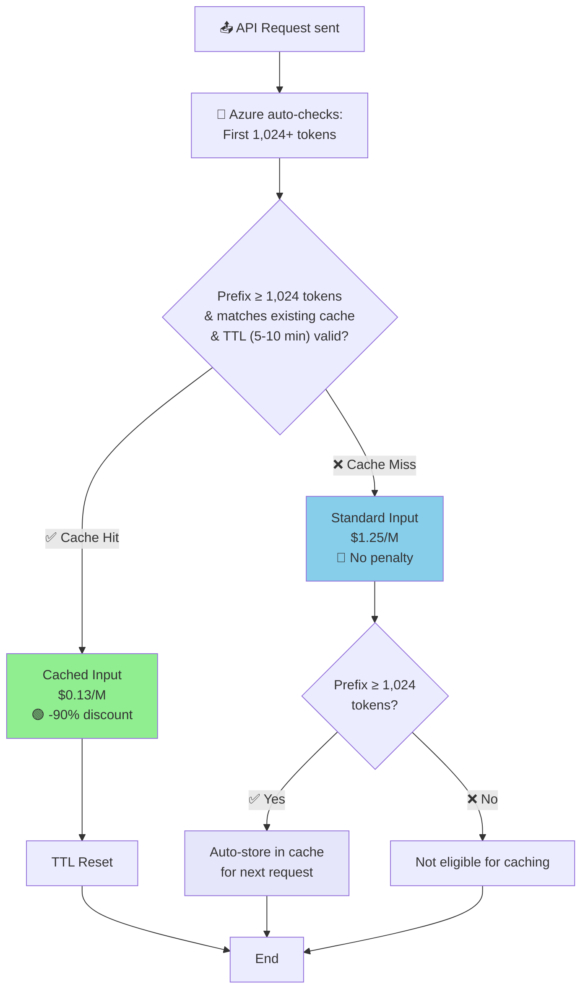

# Azure OpenAI GPT-5 vs AWS Bedrock Claude Sonnet 4.5 Competitive Analysis

**Date: December 1, 2025**

---

## 1. Pricing Comparison

### PayGo (Pay-as-you-go)

| Item | Azure GPT-5 Global | AWS Claude Sonnet 4.5 | Azure Advantage |
|--------|-------------------|----------------------|-----------|
| Input | $1.25/M | $3.00/M | **-58%** |
| Cached Input (Cache Hit) | $0.13/M | $0.30/M | **-57%** |
| Output | $10.00/M | $15.00/M | **-33%** |
| Cache Write (Cache Miss) | $1.25/M (= Input) | $3.75/M (+25%) | **No Surcharge** |

> Source: [Azure OpenAI Pricing](https://azure.microsoft.com/pricing/details/cognitive-services/openai-service/) | [AWS Bedrock Pricing](https://aws.amazon.com/bedrock/pricing/)

### Prompt Caching Mechanism Comparison

| Dimension | Azure OpenAI | AWS Bedrock | Source |
|-----------|-------------|-------------|--------|
| **Default Enabled** | ✅ Yes (cannot disable) | ❌ No (opt-in required) | [Azure Docs](https://learn.microsoft.com/en-us/azure/ai-services/openai/how-to/prompt-caching) / [AWS Docs](https://docs.aws.amazon.com/bedrock/latest/userguide/prompt-caching.html) |
| **Cache Miss Price** | Standard Input ($1.25/M) | Cache Write (+25%, $3.75/M) | Official Pricing |
| **Cache Hit Price** | Cached Input ($0.13/M, -90%) | Cache Read ($0.30/M, -90%) | Official Pricing |
| **TTL (Time to Live)** | 5-10 minutes | 5 minutes | Official Docs |
| **Min Token Requirement** | 1,024 tokens | 1,024-4,096 tokens (varies by model) | Official Docs |
| **Risk Level** | 🟢 Low (no penalty for miss) | 🔴 High (miss costs +25%) | — |

### AWS Prompt Cache Pricing Logic

> ⚠️ **AWS requires manual opt-in**: Developer must insert `{"cachePoint": {"type": "default"}}` marker in API request body

```mermaid
flowchart TD
    A["API request"] --> B{"Does request contain<br/>cachePoint marker?"}
    
    B -->|"❌ No cachePoint"| C["Standard Input<br/>$3.00/M<br/>🔵 No caching"]
    C --> Z[End]
    
    B -->|"✅ Yes, has cachePoint"| D{"Prefix before cachePoint<br/>≥ 1,024 tokens?"}
    
    D -->|"❌ No, < 1,024"| C2["Standard Input<br/>$3.00/M<br/>⚠️ cachePoint ignored"]
    C2 --> Z
    
    D -->|"✅ Yes, ≥ 1,024"| E{"Cache exists &<br/>prefix matches &<br/>TTL (5 min) valid?"}
    
    E -->|"✅ Cache Hit"| F["Cache Read<br/>$0.30/M<br/>🟢 -90% discount"]
    F --> G["TTL Reset to 5 min"]
    G --> Z
    
    E -->|"❌ Cache Miss"| H["Cache Write<br/>$3.75/M<br/>🔴 +25% surcharge"]
    H --> I["Store prefix in Cache<br/>TTL = 5 min"]
    I --> Z
    
    style F fill:#90EE90
    style H fill:#FFB6C1
    style C fill:#87CEEB
    style C2 fill:#87CEEB
```



**AWS cachePoint Usage Example**:
```json
{
  "messages": [{
    "role": "user",
    "content": [
      {"text": "You are an expert assistant... (long system context)"},
      {"text": "Here is the document to analyze... (large document)"},
      {"cachePoint": {"type": "default"}},  // ← Developer manually inserts this
      {"text": "What is the main conclusion?"}  // ← Dynamic part (not cached)
    ]
  }]
}
```

### Azure Prompt Cache Pricing Logic

> ✅ **Azure auto-enabled, zero configuration required**: System automatically checks if first 1,024+ tokens match cache



**Azure requires no special markers**:
```json
{
  "messages": [{
    "role": "user",
    "content": "You are an expert... (context) What is the conclusion?"
  }]
}
// ✅ System automatically handles caching - no cachePoint needed
```

### PTU (Provisioned Throughput)

| Model | Deployment Type | Min PTUs | Price per PTU | Input TPM per PTU |
|------|---------|---------|------------|-------------------|
| GPT-5 | Global Provisioned | 15 | $1.00/hr | 4,750 |
| GPT-5 | Data Zone Provisioned | 15 | $1.10/hr | 4,750 |
| GPT-5 | **Regional Provisioned (Japan)** | 50 | $2.00/hr | 4,750 |

> ⚠️ **Critical**: For GPT-5, **1 output token = 8 input tokens** towards utilization limit.  
> This matches the pricing ratio ($10/$1.25 = 8).  
> Cached tokens receive **100% discount** (do not consume PTU capacity).
>
> Source: [Azure PTU Onboarding Guide](https://learn.microsoft.com/en-us/azure/ai-foundry/openai/how-to/provisioned-throughput-onboarding)

---

## 2. Azure Core Advantages

### 2.1 Japan Regional PTU

- **Single Region Deployment**: Regional PTU provides dedicated capacity within a single region in Japan (e.g., Tokyo).
- **vs. AWS CRIS**: AWS Cross-Region Inference automatically routes traffic between Tokyo and Osaka (both within Japan, but not pinned to a single specific region).

### 2.2 PTU Prompt Caching

| Feature | Azure PTU | AWS Bedrock |
|------|----------|-------------|
| Cache Hit Cost | **$0** | $0.30/M |
| Cache Quota Usage | **Does not consume TPM** | N/A |
| First Write Surcharge | None | +25% |

**Key Point**: For PTU users, cache hits are completely free and do not consume throughput quota (TPM).

> ⚠️ **Important Limitation**: Prompt caching only helps with **input tokens**.  
> **Output tokens still consume 8× capacity** (1 output = 8 input equivalent).  
> For a typical coding request (5,000 input + 500 output @ 70% cache hit):
> - Cached input: 3,500 × 0 = **0** (saved!)
> - Uncached input: 1,500 × 1 = 1,500
> - Output: 500 × 8 = **4,000** (73% of total!)
> - **Output dominates capacity consumption even with high cache hit rates.**

### 2.3 AI Gateway (New Release)

Microsoft Foundry integrated AI Gateway provides:
- Token Rate Limiting
- Quota Management
- Centralized API Governance
- **First 100K calls free**

---

## 3. Best Scenarios for PTU

### 3.1 PTU Capacity Reality Check

**GPT-5 PTU Capacity** (per official docs):
- 1 PTU = 4,750 input TPM
- 1 output token = 8 input tokens (towards utilization)
- Cached tokens = 100% discount

| PTU Count | Monthly Capacity (70% cache, 5K in + 500 out) | Suitable Team Size |
|-----------|-----------------------------------------------|-------------------|
| 15 (Global min) | ~560K requests | ~85 devs @ 300 req/day |
| 50 (Regional min) | ~1.87M requests | ~280 devs @ 300 req/day |
| 100 | ~3.74M requests | ~570 devs @ 300 req/day |

> Source: [PTU Capacity Calculator](https://ai.azure.com/resource/calculator) | [PTU Documentation](https://learn.microsoft.com/en-us/azure/ai-foundry/openai/concepts/provisioned-throughput)

### 3.2 Scenario Suitability by Input:Output Ratio

| Scenario | Input:Output Ratio | Output % of Capacity | Cache Value | PTU Recommendation |
|----------|-------------------|---------------------|-------------|-------------------|
| **RAG/Retrieval QA** | 10,000:200 | 14% | ⭐⭐⭐⭐⭐ | Strongly Recommended |
| **Code Completion** | 8,000:200 | 17% | ⭐⭐⭐⭐⭐ | Strongly Recommended |
| **Coding Assistant** | 5,000:500 | 73% | ⭐⭐⭐ | Good for small teams |
| **Document Generation** | 2,000:2,000 | 91% | ⭐ | Not Recommended |
| **Chat/Creative** | 500:500 | 89% | ⭐ | Not Recommended |

> 💡 **Key Insight**: PTU is most cost-effective for **input-heavy, output-light** workloads where prompt caching can maximize capacity utilization.

### 3.3 Cache-Friendly Scenarios

| Scenario | Why Azure | Expected Cache Hit Rate |
|------|---------------|-----------------|
| **Coding Assistant** | Long System Prompt + Stable Tool Definitions, Static Prefix | 60-80% |
| **Agent Tool Pipeline** | Fixed Tool Definitions, `previous_response_id` keeps prefix consistent | 50-70% |
| **Batch Document Processing** | Same template processing multiple documents, exact prefix match | 80-90% |
| **RAG Knowledge Base** | Heavy context injection, Stable System Prompt | 40-60% |

**Unsuitable Scenarios**:
- Standard Multi-turn Chat (Frequent user/assistant alternation causes prefix to change constantly, making cache hits difficult).
- Output-heavy workloads (document generation, creative writing) — cache doesn't help output tokens.

---

## 4. Cost Savings Estimation

### Scenario A: 100-User Coding Assistant (PayGo vs PayGo)

**Assumptions**:
- 100 Developers × 30 requests/day × 22 working days = 66,000 requests/month
- Per request: 5,000 tokens Input + 500 tokens Output
- Cache Hit Rate: 70%

**Monthly Token Volume**:
- Input: 330M tokens (99M Uncached + 231M Cached)
- Output: 33M tokens

| Cost Item | Azure PayGo | AWS Bedrock PayGo |
|--------|------------|-------------------|
| Uncached Input (30%) | 99M × $1.25 = $124 | 99M × $3.00 = $297 |
| Cached Input (70%) | 231M × $0.13 = $30 | 231M × $0.30 = $69 |
| Output | 33M × $10 = $330 | 33M × $15 = $495 |
| **Monthly Total** | **$484** | **$861** |
| **Annual Total** | **$5,808** | **$10,332** |

**Annual Savings**: $4,524 (44%)

> ✅ This scenario uses PayGo on both sides — straightforward comparison.

---

### Scenario B: 85-User AI-First Team (Global PTU vs PayGo)

> ⚠️ **Corrected based on actual PTU capacity**: 15 PTU can handle ~560K requests/month.

**Assumptions**:
- 85 Developers × 300 requests/day × 22 working days = **561,000 requests/month**
- Per request: 5,000 tokens Input + 500 tokens Output
- Cache Hit Rate: 70%
- Azure: **Global PTU (15 PTU minimum)**

**PTU Capacity Calculation**:
```
15 PTU × 4,750 TPM = 71,250 input-equivalent TPM
Per request utilization (70% cache):
  - Cached: 3,500 × 0 = 0
  - Uncached: 1,500 × 1 = 1,500
  - Output: 500 × 8 = 4,000
  - Total: 5,500 input-equivalent per request

Requests per minute: 71,250 / 5,500 ≈ 13
Monthly capacity: 13 × 60 × 720 ≈ 561,600 requests ✓
```

**Monthly Token Volume**:
- Input: 2,805M tokens (841M Uncached + 1,964M Cached)
- Output: 281M tokens

| Cost Item | Azure Global PTU | AWS Bedrock PayGo |
|--------|-----------------|-------------------|
| PTU Cost | 15 × $1.00 × 720hr = **$10,800** | N/A |
| Uncached Input (30%) | **$0** (included in PTU) | 841M × $3.00 = $2,523 |
| Cached Input (70%) | **$0** (PTU cache hits free) | 1,964M × $0.30 = $589 |
| Output | **$0** (included in PTU) | 281M × $15 = $4,215 |
| **Monthly Total** | **$10,800** | **$7,327** |
| **Annual Total** | **$129,600** | **$87,924** |

**Result**: At this scale, **AWS PayGo is actually cheaper than Azure PTU** by $41,676/year.

> 💡 **Key Insight**: PTU value is NOT purely about cost savings. The real benefits are:
> - **Guaranteed latency SLA** (99% > 50 TPS for GPT-5)
> - **No throttling during traffic spikes**
> - **Predictable fixed monthly cost**
> - **Cache hits = $0 + zero capacity consumption**

---

### Scenario B2: When Does PTU Break Even? (Global PTU)

**Question**: How many requests/month to make 15 PTU cheaper than Azure PayGo?

```
Azure PayGo cost per request (70% cache, 5K in + 500 out):
  - Uncached: 1,500 × $1.25/M = $0.001875
  - Cached: 3,500 × $0.13/M = $0.000455
  - Output: 500 × $10/M = $0.005
  - Total: $0.00733 per request

Break-even: $10,800 / $0.00733 = 1,474,000 requests/month
```

**Problem**: 15 PTU can only handle ~560K requests/month.  
**You cannot reach break-even with minimum PTU.**

To handle 1.47M requests, you need:
```
PTU needed: 1,474,000 / 561,000 × 15 ≈ 40 PTU
Cost: 40 × $1.00 × 720 = $28,800/month
```

| Comparison | 40 PTU (1.47M req) | Azure PayGo (1.47M req) |
|------------|-------------------|------------------------|
| Monthly Cost | $28,800 | $10,800 |
| Break-even? | ❌ Still more expensive | — |

> ⚠️ **Conclusion**: For GPT-5 Global PTU, **pure cost break-even vs Azure PayGo is difficult to achieve**.  
> PTU should be justified by **latency SLA, no throttling, and predictability** — not just cost.

---

### Scenario C: Japan Data Residency (Regional PTU) — Compliance-Driven

> ⚠️ **This scenario is driven by compliance requirements, not cost optimization.**
> Customers requiring strict single-region data residency in Japan have limited options.
> The comparison below is Azure Regional PTU vs. AWS CRIS.

**Assumptions**:
- Large enterprise requiring **Japan single-region data residency** (e.g., FSI, Healthcare, Government)
- 280 Developers × 300 requests/day × 22 working days = **1,848,000 requests/month**
- Per request: 5,000 tokens Input + 500 tokens Output
- Cache Hit Rate: 70%
- Azure: **Regional PTU Japan (50 PTU minimum)**

**PTU Capacity Check**:
```
50 PTU capacity: 50/15 × 561,000 ≈ 1,870,000 requests/month ✓
```

**Monthly Token Volume**:
- Input: 9,240M tokens (2,772M Uncached + 6,468M Cached)
- Output: 924M tokens

| Cost Item | Azure Regional PTU (Japan) | AWS Bedrock PayGo (CRIS Tokyo↔Osaka) |
|--------|---------------------------|--------------------------------------|
| PTU Cost | 50 × $2.00 × 720hr = **$72,000** | N/A |
| Uncached Input (30%) | **$0** (included in PTU) | 2,772M × $3.00 = $8,316 |
| Cached Input (70%) | **$0** (PTU cache hits free) | 6,468M × $0.30 = $1,940 |
| Output | **$0** (included in PTU) | 924M × $15 = $13,860 |
| **Monthly Total** | **$72,000** | **$24,116** |
| **Annual Total** | **$864,000** | **$289,392** |

**Result**: AWS PayGo is **$574,608/year cheaper**.

**But the real comparison is about compliance**:

| Dimension | Azure Regional PTU | AWS CRIS |
|-----------|-------------------|----------|
| **Data Residency** | ✅ Single region (Tokyo only) | ❌ Routes between Tokyo↔Osaka |
| **Compliance** | ✅ Meets strict requirements | ⚠️ May not meet single-region requirements |
| **Cost** | $72,000/mo | $24,116/mo |
| **Latency SLA** | ✅ Guaranteed | ❌ Best-effort |

> 💡 **Verdict**: For compliance-driven customers who **must have single-region data residency**, Azure Regional PTU is the **only viable option** despite higher cost. The $574K/year premium is the **cost of compliance**.

---

### PTU Value Summary

| Deployment Type | Min PTUs | Monthly Cost | Capacity (70% cache) | Suitable Team Size |
|-----------------|----------|--------------|----------------------|-------------------|
| Global Provisioned | 15 | $10,800/mo | ~560K req/mo | ~85 devs @ 300 req/day |
| Data Zone Provisioned | 15 | $11,880/mo | ~560K req/mo | ~85 devs @ 300 req/day |
| Regional (Japan) | 50 | $72,000/mo | ~1.87M req/mo | ~280 devs @ 300 req/day |

**When to Use PTU**:

| Scenario | Recommendation |
|----------|----------------|
| Cost optimization only | ❌ PayGo is usually cheaper |
| Latency SLA required | ✅ PTU provides guaranteed 99% > 50 TPS |
| No throttling required | ✅ PTU never throttles |
| Predictable budgeting | ✅ Fixed monthly cost |
| Japan single-region compliance | ✅ Regional PTU is the only option |

**PTU Benefits** (beyond cost):
- **Guaranteed Latency SLA**: 99% > 50 Tokens Per Second for GPT-5
- **Cache Hits = $0 + Zero Capacity Consumption**
- **No throttling during traffic spikes**
- **Predictable fixed cost** for budgeting

> Source: [PTU Concepts](https://learn.microsoft.com/en-us/azure/ai-foundry/openai/concepts/provisioned-throughput) | [PTU Onboarding](https://learn.microsoft.com/en-us/azure/ai-foundry/openai/how-to/provisioned-throughput-onboarding)

---

## 5. Summary

**Azure Key Selling Points**:

| Advantage | Details |
|-----------|---------|
| **PayGo Pricing** | 33-58% cheaper than AWS for both cached and uncached tokens |
| **Japan Regional PTU** | Only option for strict single-region data residency |
| **PTU Cache Hits** | $0 cost + zero capacity consumption |
| **AI Gateway** | First 100K calls free, centralized governance |
| **Latency SLA** | PTU provides guaranteed latency (99% > 50 TPS) |

**When Azure Wins**:

| Scenario | Winner | Why |
|----------|--------|-----|
| PayGo comparison | **Azure** | 44% cost savings |
| Small team + latency needs | **Azure PTU** | SLA + no throttling |
| Japan compliance | **Azure Regional PTU** | Only single-region option |
| Large scale cost optimization | **AWS** or **Azure PayGo** | PTU rarely cost-effective |

**Target Customers**:
- Cost-sensitive (PayGo users)
- Require Japan Data Residency (Regional PTU)
- Need latency SLA / no throttling (PTU)
- Input-heavy workloads with high cache hit rates (RAG, Code Completion)
- Existing Azure ecosystem investment

---

## References

- [Azure OpenAI Pricing](https://azure.microsoft.com/pricing/details/cognitive-services/openai-service/)
- [AWS Bedrock Pricing](https://aws.amazon.com/bedrock/pricing/)
- [PTU Concepts](https://learn.microsoft.com/en-us/azure/ai-foundry/openai/concepts/provisioned-throughput)
- [PTU Onboarding Guide](https://learn.microsoft.com/en-us/azure/ai-foundry/openai/how-to/provisioned-throughput-onboarding)
- [PTU Capacity Calculator](https://ai.azure.com/resource/calculator)
- [Azure OpenAI Quotas and Limits](https://learn.microsoft.com/en-us/azure/ai-foundry/openai/quotas-limits)
