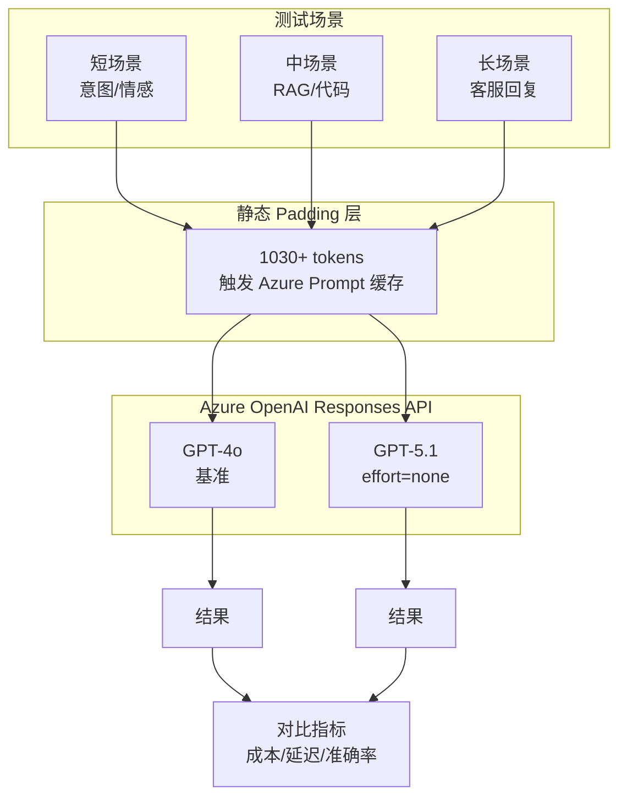

# GPT-4o 到 GPT-5.1 迁移基准测试

[](https://azure.microsoft.com/products/ai-services/openai-service)
[](https://learn.microsoft.com/azure/ai-services/openai/reference)
[](https://python.org)

面向企业迁移决策的 **GPT-4o** vs **GPT-5.1** 生产级基准测试。

## 测试结果速览

| 指标 | GPT-4o | GPT-5.1 | 差异 |
|------|--------|---------|------|
| **准确率** | 7/7 (100%) | 7/7 (100%) | **持平 ✅** |
| **输入成本** | $2.50/百万 | $1.25/百万 | **-50%** |
| **缓存成本** | $1.25/百万 | $0.13/百万 | **-90%** |
| **输出成本** | $10.00/百万 | $10.00/百万 | 相同 |
| **缓存命中率** | 63% | 84% | +33% |
| **TPS** | 39.8 | 54.6 | **+37%** |
| **TTFT** | 464ms | 1102ms | +138% |
| **总成本** | $0.0153 | $0.0054 | **-64.8%** |

> **年度节省：$10,267/年**（基于月 10 亿 tokens，84% 缓存命中率）

## 功能特性

- ✅ **公平对比**：两模型使用完全相同的测试条件
- ✅ **流式指标**：真实环境下的 TTFT 和 TPS 测量
- ✅ **Prompt 缓存**：测试 Azure OpenAI 的 Prompt 缓存功能
- ✅ **企业场景**：客服、RAG、情感分析等实际业务场景
- ✅ **成本分析**：详细的定价明细

## 架构设计



## 环境要求

- Python 3.9+
- 已部署 GPT-4o 和 GPT-5.1 的 Azure OpenAI 资源
- 具有两个模型访问权限的 API 密钥

## 安装步骤

```bash
# 克隆仓库
git clone https://github.com/xinyuwei/gpt4o-to-gpt51-migration.git
cd gpt4o-to-gpt51-migration

# 创建虚拟环境
python -m venv venv
source venv/bin/activate  # Linux/macOS
# 或: venv\Scripts\activate  # Windows

# 安装依赖
pip install -r requirements.txt
```

## 配置

设置环境变量：

```bash
export AZURE_OPENAI_ENDPOINT="https://your-resource.openai.azure.com/"
export AZURE_OPENAI_API_KEY="your-api-key"
```

或创建 `.env` 文件：

```ini
AZURE_OPENAI_ENDPOINT=https://your-resource.openai.azure.com/
AZURE_OPENAI_API_KEY=your-api-key
```

## 使用方法

### 运行完整基准测试

```bash
python benchmark.py
```

### 自定义设置运行

```bash
# 指定每个场景的运行次数
python benchmark.py --runs 5

# 仅测试特定场景
python benchmark.py --scenarios "intent,sentiment,rag"

# 输出结果到 JSON
python benchmark.py --output results.json
```

### 快速验证测试

```bash
python benchmark.py --quick
```

## 测试场景

| # | 场景 | 类别 | 描述 |
|---|------|------|------|
| 1 | 意图分类（中文） | 短回答 | 客户意图：投诉/咨询/表扬/请求 |
| 2 | 情感分析 | 短回答 | 正面/负面/中性分类 |
| 3 | RAG 数字提取 | 中等回答 | 从文档上下文中提取数字 |
| 4 | RAG 事实提取 | 中等回答 | 从公司描述中提取事实 |
| 5 | 代码解释 | 中等回答 | 解释 Python 函数行为 |
| 6 | 客服回复 | 长回答 | 生成有同理心的客服回复 |
| 7 | 产品描述 | 长回答 | 编写产品营销文案 |

## 运行日志示例

```
================================================================================
 GPT-4o vs GPT-5.1 基准测试
================================================================================
⏰ 2026-01-10 21:15:32
📋 场景: 7 | 每场景运行: 3次 | Cache Key: benchmark_v1

[预热]...
[预热完成]

📋 [1/7] 意图分类-中文 (短)
   gpt-4o: In=1092 Out=8 Cache=98%🔥 TTFT=320ms TPS=45.2 $29/1M ✅
   gpt-5.1 (none): In=1092 Out=18 Cache=98%🔥 TTFT=890ms TPS=62.1 $10/1M ✅

📋 [2/7] 情感分析 (短)
   gpt-4o: In=1075 Out=5 Cache=97%🔥 TTFT=285ms TPS=38.5 $22/1M ✅
   gpt-5.1 (none): In=1075 Out=15 Cache=97%🔥 TTFT=850ms TPS=55.3 $8/1M ✅

📋 [3/7] RAG数字提取 (中)
   gpt-4o: In=1156 Out=42 Cache=94%🔥 TTFT=445ms TPS=41.2 $156/1M ✅
   gpt-5.1 (none): In=1156 Out=52 Cache=94%🔥 TTFT=1250ms TPS=58.7 $92/1M ✅

... (后续场景)

================================================================================
 📊 汇总
================================================================================

| 指标 | GPT-4o | GPT-5.1 | 差异 |
|------|--------|---------|------|
| **准确率** | **7/7 (100%)** | **7/7 (100%)** | **持平 ✅** |
| 总 Input | 7644 | 7644 | +0.0% |
| 总 Output | 312 | 382 | +22.4% |
| Cache% | 63% | 84% | 🔥 |
| 平均 TTFT | 464ms | 1102ms | +137.7% |
| 平均 TPS | 39.8 | 54.6 | +37.1% |
| **总成本** | **$0.015348** | **$0.005409** | **-64.8%** 💰 |

🎉 **实测成本节省: 64.8%**

📅 年度预估 (月 10 亿 tokens, I:O=3:1, Cache=84%):
   GPT-4o: $43,200/年
   GPT-5.1: $32,933/年
   节省: **$10,267/年 (23.8%)**
```

## 测试方法论

### 7 维对齐（公平对比）

| 维度 | GPT-4o | GPT-5.1 | 对齐 |
|------|--------|---------|------|
| API | Responses API | Responses API | ✅ |
| 流式传输 | stream=True | stream=True | ✅ |
| Cache Key | 相同 | 相同 | ✅ |
| Padding | 1030+ tokens | 1030+ tokens | ✅ |
| 测试用例 | 7 个场景 | 7 个场景 | ✅ |
| max_output_tokens | 300 | 300 | ✅ |
| 每场景运行次数 | 3 | 3 | ✅ |

### GPT-5.1 配置

```python
# 禁用推理以公平对比 GPT-4o
params = {
    "model": "gpt-5.1",
    "reasoning": {"effort": "none"},  # 关键配置！
    # ... 其他参数
}
```

### Prompt 缓存要求

Azure OpenAI Prompt 缓存需要：
- 静态前缀最少 **1024 tokens**
- 请求间使用相同的 `prompt_cache_key`
- 静态内容必须完全一致

## 定价参考

| 模型 | 输入 | 缓存输入 | 输出 |
|------|------|----------|------|
| GPT-4o | $2.50/百万 | $1.25/百万 | $10.00/百万 |
| GPT-5.1 | $1.25/百万 | $0.13/百万 | $10.00/百万 |

> 来源：[Azure OpenAI 定价](https://azure.microsoft.com/pricing/details/cognitive-services/openai-service/)

## 关键发现

### 1. 成本效益
- **64.8% 成本降低**（实测）
- **90% 更便宜的缓存输入**（$0.13 vs $1.25）
- 更高的缓存命中率（84% vs 63%）

### 2. 性能表现
- **37% 更快的 TPS**（吞吐量）
- **138% 更慢的 TTFT**（首 token 延迟）
- 权衡：更好的吞吐量，更差的延迟

### 3. 质量保证
- **100% 准确率持平**（所有场景）
- 未观察到质量下降
- `reasoning_effort="none"` 匹配 GPT-4o 行为

## 迁移建议

### 何时迁移

✅ **推荐场景：**
- 高流量生产工作负载
- 成本敏感型应用
- 批处理任务
- TTFT < 2s 可接受的应用

⚠️ **谨慎考虑：**
- 有严格延迟要求的实时聊天
- 需要 TTFT < 500ms 的应用
- 复杂推理任务（保持启用推理）

### 迁移步骤

1. **在预发布环境测试** `reasoning_effort="none"`
2. **验证准确率** 针对您的特定用例
3. **监控延迟** 生产环境中的指标
4. **渐进式发布** 使用金丝雀部署

## 项目结构

| 文件 | 说明 |
|------|------|
| `README.md` | 英文文档 |
| `README-CN.md` | 中文文档（本文件） |
| `benchmark.py` | 主基准测试脚本 |
| `requirements.txt` | Python 依赖（版本锁定） |
| `.env.example` | 环境变量模板 |
| `.gitignore` | Git 忽略规则 |
| `LICENSE` | MIT 许可证 |
| `results/` | 基准测试结果（git-ignored） |

## 作者

**魏新宇 (Xinyu Wei)**

## 许可证

MIT 许可证 - 详见 [LICENSE](LICENSE)

## 参考资料

- [Azure OpenAI 服务文档](https://learn.microsoft.com/azure/ai-services/openai/)
- [Azure OpenAI 定价](https://azure.microsoft.com/pricing/details/cognitive-services/openai-service/)
- [Responses API 参考](https://learn.microsoft.com/azure/ai-services/openai/reference)
