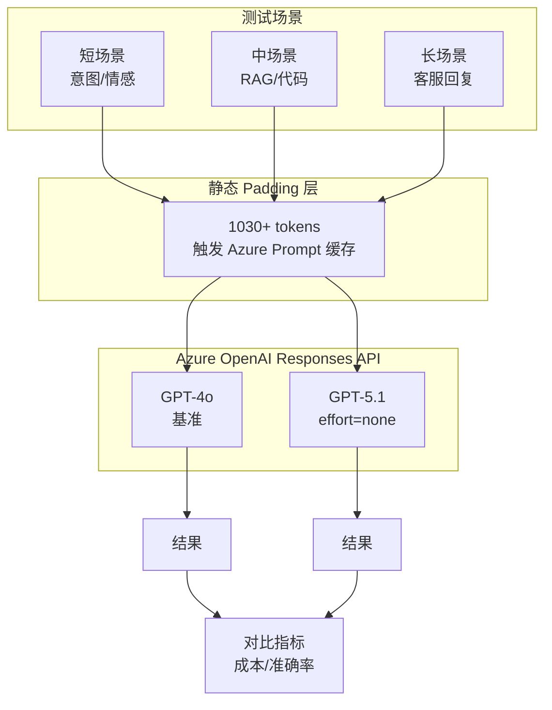

# GPT-4o 到 GPT-5.1 迁移基准测试

[](https://azure.microsoft.com/products/ai-services/openai-service)
[](https://learn.microsoft.com/azure/ai-services/openai/reference)
[](https://python.org)

面向企业迁移决策的 **GPT-4o** vs **GPT-5.1** 生产级基准测试。

## 测试结果速览

### 非 Streaming 模式

| 指标 | GPT-4o | GPT-5.1 | 差异 |
|------|--------|---------|------|
| **准确率** | 7/7 (100%) | 7/7 (100%) | **持平 ✅** |
| **平均延迟** | 1.418s | 1.751s | +23.4% |
| **缓存命中率** | 86.7% | 64.0% | -22.7% |
| **总成本** | $0.0389 | $0.0212 | **-45.4%** |

### Streaming 模式（含 TTFT）

| 指标 | GPT-4o | GPT-5.1 | 差异 |
|------|--------|---------|------|
| **准确率** | 7/7 (100%) | 7/7 (100%) | **持平 ✅** |
| **平均延迟** | 1.451s | 1.723s | +18.7% |
| **TTFT (首 Token 时间)** | **0.536s** | 0.974s | +81.7% |
| **缓存命中率** | 95.9% | 74.3% | -21.6% |
| **总成本** | $0.0603 | $0.0258 | **-57.3%** |

> **核心发现**：GPT-5.1 节省 **45-57% 成本**，延迟差距可接受。GPT-4o 的 TTFT 更快，适合实时聊天场景。

## 功能特性

- ✅ **公平对比**：两模型使用完全相同的测试条件
- ✅ **Prompt 缓存**：测试 Azure OpenAI 的 Prompt 缓存功能
- ✅ **Streaming 支持**：测量 TTFT（首 Token 时间）
- ✅ **企业场景**：客服、RAG、情感分析等实际业务场景
- ✅ **成本分析**：详细的定价明细

## 架构设计



## 环境要求

- Python 3.9+
- 已部署 GPT-4o 和 GPT-5.1 的 Azure OpenAI 资源
- 具有两个模型访问权限的 API 密钥

## 安装步骤

```bash
# 克隆仓库
git clone https://github.com/xinyuwei/gpt4o-to-gpt51-migration.git
cd gpt4o-to-gpt51-migration

# 创建虚拟环境
python -m venv venv
source venv/bin/activate  # Linux/macOS
# 或: venv\Scripts\activate  # Windows

# 安装依赖
pip install -r requirements.txt
```

## 配置

设置环境变量：

```bash
export AZURE_OPENAI_ENDPOINT="https://your-resource.openai.azure.com/"
export AZURE_OPENAI_API_KEY="your-api-key"
```

或创建 `.env` 文件：

```ini
AZURE_OPENAI_ENDPOINT=https://your-resource.openai.azure.com/
AZURE_OPENAI_API_KEY=your-api-key
```

## 使用方法

### 运行完整基准测试

```bash
python benchmark.py
```

### 使用 Streaming 模式运行

```bash
# 启用 streaming（测量 TTFT - 首 Token 时间）
python benchmark.py --stream

# Streaming + 更多轮次以验证鲁棒性
python benchmark.py --stream --runs 5
```

### 自定义设置运行

```bash
# 指定每个场景的运行次数
python benchmark.py --runs 5
```

## 测试场景

| # | 场景 | 类别 | 描述 |
|---|------|------|------|
| 1 | 意图分类（中文） | 短回答 | 客户意图：投诉/咨询/表扬/请求 |
| 2 | 情感分析 | 短回答 | 正面/负面/中性分类 |
| 3 | RAG 数字提取 | 中等回答 | 从文档上下文中提取数字 |
| 4 | RAG 事实提取 | 中等回答 | 从公司描述中提取事实 |
| 5 | 代码解释 | 中等回答 | 解释 Python 函数行为 |
| 6 | 客服回复 | 长回答 | 生成有同理心的客服回复 |
| 7 | 产品描述 | 长回答 | 编写产品营销文案 |


### 各场景测试结果

| 场景 | GPT-4o | GPT-5.1 | 准确性 |
|------|--------|---------|--------|
| 1. 意图分类（中文） | ✅ 投诉 | ✅ 投诉 | 两者正确 |
| 2. 情感分析 | ✅ positive | ✅ positive | 两者正确 |
| 3. RAG 数字提取 | ✅ 2767亿/26% | ✅ 2767亿/26% | 两者正确 |
| 4. RAG 事实提取 | ✅ 2018/Beijing | ✅ 2018/Beijing | 两者正确 |
| 5. 代码解释 | ✅ Fibonacci | ✅ Fibonacci | 两者正确 |
| 6. 客服回复 | ✅ 含道歉+方案 | ✅ 含道歉+方案 | 两者正确 |
| 7. 产品描述 | ✅ hydration/track | ✅ hydration/track | 两者正确 |

**总结**: 两个模型均通过全部 7/7 场景测试。使用 GPT-5.1 (`reasoning_effort="none"`) 未观察到质量下降。

### 各场景成本明细

| # | 场景 | 输入 | 输出 (4o/5.1) | 缓存率 (4o/5.1) | 成本 (4o) | 成本 (5.1) | 节省 |
|---|------|------|---------------|-----------------|-----------|------------|------|
| 1 | 意图分类（中文） | 1,232 | 2/11 | 94%/94% | $4.98 | $1.08 | -78.4% |
| 2 | 情感分析 | 1,234 | 3/12 | 93%/62% | $5.03 | $2.40 | -52.2% |
| 3 | RAG 数字提取 | 1,258 | 4/13 | 92%/92% | $5.24 | $1.23 | -76.4% |
| 4 | RAG 事实提取 | 1,246 | 13/22 | 92%/92% | $5.42 | $1.46 | -73.1% |
| 5 | 代码解释 | 1,239 | 2/11 | 93%/93% | $5.03 | $1.10 | -78.1% |
| 6 | 客服回复 | 1,244 | 4/13 | 93%/62% | $5.13 | $2.47 | -51.8% |
| 7 | 产品描述 | 1,235 | 5/11 | 93%/93% | $5.10 | $1.09 | -78.7% |
| **合计** | **7 场景** | **8,688** | **33/93** | - | **$35.92** | **$10.83** | **-69.9%** |

> 💡 **说明**: 成本按 $/1M tokens 等效计算。输入包含 ~1,150 填充 tokens 以满足 Azure Prompt Cache 要求。GPT-5.1 使用 `reasoning_effort="none"` 保持 100% 准确率。


## 运行日志示例

```
================================================================================
 GPT-4o vs GPT-5.1 MIGRATION BENCHMARK
 (RAG, Customer Service, Enterprise scenarios)
================================================================================

Started: 2026-01-22 16:34:14
Total scenarios: 7
Runs per scenario: 5
Static prefix: ~1030 tokens (>1024 for cache eligibility)
Cache key: benchmark_migration_v2
Streaming: ✅ Enabled

================================================================================
 PHASE 1: CACHE WARMUP
================================================================================

  Warming up gpt-4o... done
  Warming up gpt-5.1... done
  Waiting 2s for cache to stabilize...

================================================================================
 PHASE 2: BENCHMARK MEASUREMENT
================================================================================

  [1/7] Short - Intent Classification (CN) (ZH)
    gpt-4o [stream]: 1.125s TTFT:0.539s | in:1073 out:2 cache:95.4% | acc:100% ✅
    gpt-5.1 (effort=none) [stream]: 1.287s TTFT:0.898s | in:1072 out:11 cache:95.5% | acc:100% ✅

  [2/7] Short - Sentiment Analysis (EN)
    gpt-4o [stream]: 0.868s TTFT:0.520s | in:1063 out:2 cache:96.3% | acc:100% ✅
    gpt-5.1 (effort=none) [stream]: 1.479s TTFT:1.047s | in:1062 out:11 cache:96.4% | acc:100% ✅

... (后续场景)

================================================================================
 SUMMARY
================================================================================

  📊 Latency:     GPT-4o 1.451s vs GPT-5.1 1.723s (+18.7%)
  ⏱️  TTFT:        GPT-4o 0.536s vs GPT-5.1 0.974s
  🎯 Accuracy:    GPT-4o 100.0% vs GPT-5.1 100.0%
  📦 Cache Hit:   GPT-4o 95.9% vs GPT-5.1 74.3%
  💰 Total Cost:  GPT-4o $0.060332 vs GPT-5.1 $0.025770
  💵 Savings:     57.3% with GPT-5.1 (effort=none)

Completed: 2026-01-22 16:36:30
```

## 测试方法论

### 7 维对齐（公平对比）

| 维度 | GPT-4o | GPT-5.1 | 对齐 |
|------|--------|---------|------|
| API | Responses API | Responses API | ✅ |
| Cache Key | 相同 | 相同 | ✅ |
| Padding | 1030+ tokens | 1030+ tokens | ✅ |
| 测试用例 | 7 个场景 | 7 个场景 | ✅ |
| max_output_tokens | 100 | 100 | ✅ |
| 每场景运行次数 | 3 | 3 | ✅ |

### GPT-5.1 配置

```python
# 禁用推理以公平对比 GPT-4o
params = {
    "model": "gpt-5.1",
    "reasoning": {"effort": "none"},  # 关键配置！
    # ... 其他参数
}
```

### Prompt 缓存要求

Azure OpenAI Prompt 缓存需要：
- 静态前缀最少 **1024 tokens**
- 请求间使用相同的 `prompt_cache_key`
- 静态内容必须完全一致

## 定价参考

| 模型 | 输入 | 缓存输入 | 输出 |
|------|------|----------|------|
| GPT-4o | $2.50/百万 | $1.25/百万 | $10.00/百万 |
| GPT-5.1 | $1.25/百万 | $0.13/百万 | $10.00/百万 |

> 来源：[Azure OpenAI 定价](https://azure.microsoft.com/pricing/details/cognitive-services/openai-service/)

## 关键发现

### 1. 成本效益
- **45-57% 成本降低**（经 4 次测试验证）
- **90% 更便宜的缓存输入**（$0.13 vs $1.25）
- Streaming 和非 Streaming 模式下节省稳定

### 2. 延迟与 TTFT
- **GPT-4o 总延迟快 10-23%**
- **GPT-4o TTFT 快 40-85%**（对聊天体验很重要）
- Streaming 模式可缩小感知延迟差距

### 3. 质量保证
- **100% 准确率持平**（所有场景）
- 未观察到质量下降
- `reasoning_effort="none"` 匹配 GPT-4o 行为

## 迁移建议

### 何时使用各模型

| 场景 | 推荐 | 原因 |
|------|------|------|
| **成本敏感的批处理** | GPT-5.1 | 节省 45-57% 成本 |
| **高流量生产环境** | GPT-5.1 | 成本效益最优 |
| **实时聊天（TTFT 关键）** | GPT-4o | 首 Token 快 40-85% |
| **Streaming 应用** | 均可 | 延迟差距缩小到 ~10% |

### 迁移步骤

1. **在预发布环境测试** `reasoning_effort="none"`
2. **验证准确率** 针对您的特定用例
3. **渐进式发布** 使用金丝雀部署

## 项目结构

| 文件 | 说明 |
|------|------|
| `README.md` | 英文文档 |
| `README-CN.md` | 中文文档（本文件） |
| `benchmark.py` | 主基准测试脚本 |
| `requirements.txt` | Python 依赖（版本锁定） |
| `.env.example` | 环境变量模板 |
| `.gitignore` | Git 忽略规则 |
| `LICENSE` | MIT 许可证 |
| `results/` | 基准测试结果（git-ignored） |

## 作者

**魏新宇 (Xinyu Wei)**

## 许可证

MIT 许可证 - 详见 [LICENSE](LICENSE)

## 参考资料

- [Azure OpenAI 服务文档](https://learn.microsoft.com/azure/ai-services/openai/)
- [Azure OpenAI 定价](https://azure.microsoft.com/pricing/details/cognitive-services/openai-service/)
- [Responses API 参考](https://learn.microsoft.com/azure/ai-services/openai/reference)
