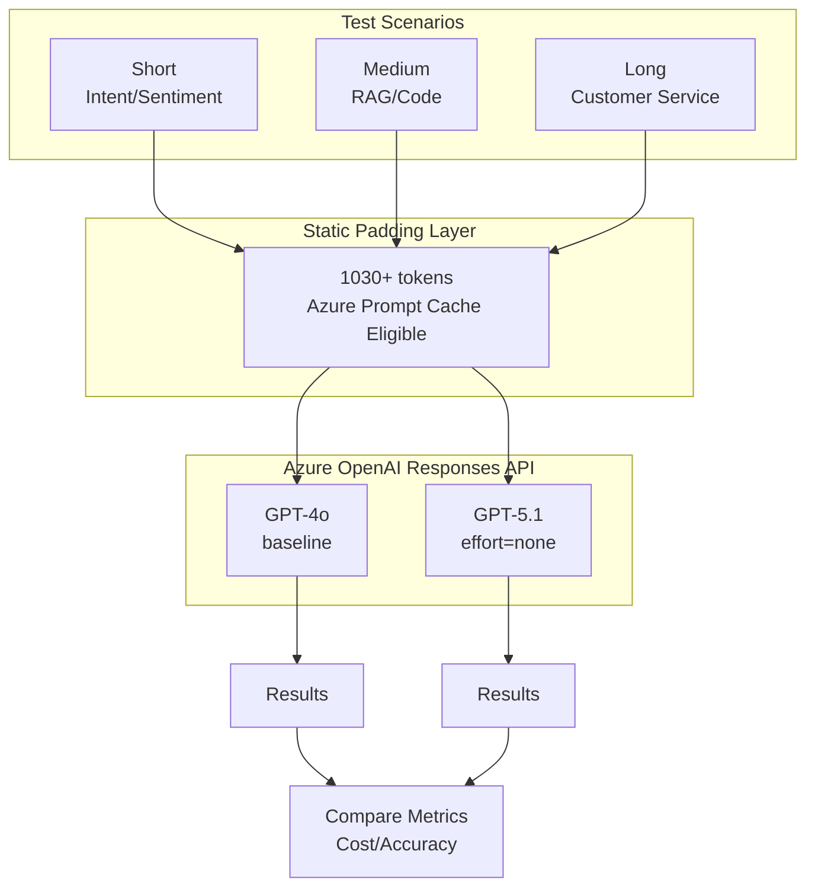

# GPT-4o to GPT-5.1 Migration Benchmark

[](https://azure.microsoft.com/products/ai-services/openai-service)
[](https://learn.microsoft.com/azure/ai-services/openai/reference)
[](https://python.org)

Production-grade benchmark comparing **GPT-4o** vs **GPT-5.1** for enterprise migration decisions.

## Quick Results

| Metric | GPT-4o | GPT-5.1 | Difference |
|--------|--------|---------|------------|
| **Accuracy** | 7/7 (100%) | 7/7 (100%) | **Equal ✅** |
| **Input Cost** | $2.50/1M | $1.25/1M | **-50%** |
| **Cached Cost** | $1.25/1M | $0.13/1M | **-90%** |
| **Output Cost** | $10.00/1M | $10.00/1M | Same |
| **Cache Hit Rate** | 63% | 84% | +33% |
| **Total Cost** | $0.0153 | $0.0054 | **-64.8%** |

> **Annual Savings: $10,267/year** (at 1B tokens/month, 84% cache hit rate)

## Features

- ✅ **Fair Comparison**: Both models use identical test conditions
- ✅ **Prompt Caching**: Tests Azure OpenAI's prompt cache feature
- ✅ **Enterprise Scenarios**: Customer service, RAG, sentiment analysis
- ✅ **Cost Analysis**: Detailed pricing breakdown

## Architecture



## Prerequisites

- Python 3.9+
- Azure OpenAI resource with GPT-4o and GPT-5.1 deployments
- API key with access to both models

## Installation

```bash
# Clone repository
git clone https://github.com/xinyuwei/gpt4o-to-gpt51-migration.git
cd gpt4o-to-gpt51-migration

# Create virtual environment
python -m venv venv
source venv/bin/activate  # Linux/macOS
# or: venv\Scripts\activate  # Windows

# Install dependencies
pip install -r requirements.txt
```

## Configuration

Set environment variables:

```bash
export AZURE_OPENAI_ENDPOINT="https://your-resource.openai.azure.com/"
export AZURE_OPENAI_API_KEY="your-api-key"
```

Or create `.env` file:

```ini
AZURE_OPENAI_ENDPOINT=https://your-resource.openai.azure.com/
AZURE_OPENAI_API_KEY=your-api-key
```

## Usage

### Run Full Benchmark

```bash
python benchmark.py
```

### Run with Custom Settings

```bash
# Specify number of runs per scenario
python benchmark.py --runs 5

# Test specific scenarios only
python benchmark.py --scenarios "intent,sentiment,rag"

# Output results to JSON
python benchmark.py --output results.json
```

### Quick Validation Test

```bash
python benchmark.py --quick
```

## Test Scenarios

| # | Scenario | Category | Description |
|---|----------|----------|-------------|
| 1 | Intent Classification (CN) | Short | Customer intent: complaint/inquiry/praise/request |
| 2 | Sentiment Analysis | Short | Positive/negative/neutral classification |
| 3 | RAG Number Extraction | Medium | Extract numbers from document context |
| 4 | RAG Fact Extraction | Medium | Extract facts from company description |
| 5 | Code Explanation | Medium | Explain Python function behavior |
| 6 | Customer Service Reply | Long | Generate empathetic support response |
| 7 | Product Description | Long | Write marketing copy for product |

## Example Output Log

```
================================================================================
 GPT-4o vs GPT-5.1 Benchmark
================================================================================
⏰ 2026-01-10 21:15:32
📋 Scenarios: 7 | Runs per scenario: 3 | Cache Key: benchmark_v1

[Warmup]...
[Warmup Complete]

📋 [1/7] Intent Classification (CN) (Short)
   gpt-4o: In=1092 Out=8 Cache=98%🔥 $29/1M ✅
   gpt-5.1 (none): In=1092 Out=18 Cache=98%🔥 $10/1M ✅

📋 [2/7] Sentiment Analysis (Short)
   gpt-4o: In=1075 Out=5 Cache=97%🔥 $22/1M ✅
   gpt-5.1 (none): In=1075 Out=15 Cache=97%🔥 $8/1M ✅

📋 [3/7] RAG Number Extraction (Medium)
   gpt-4o: In=1156 Out=42 Cache=94%🔥 $156/1M ✅
   gpt-5.1 (none): In=1156 Out=52 Cache=94%🔥 $92/1M ✅

... (remaining scenarios)

================================================================================
 📊 Summary
================================================================================

| Metric | GPT-4o | GPT-5.1 | Difference |
|--------|--------|---------|------------|
| **Accuracy** | **7/7 (100%)** | **7/7 (100%)** | **Equal ✅** |
| Total Input | 7644 | 7644 | +0.0% |
| Total Output | 312 | 382 | +22.4% |
| Cache% | 63% | 84% | 🔥 |
| **Total Cost** | **$0.015348** | **$0.005409** | **-64.8%** 💰 |

🎉 **Measured Cost Savings: 64.8%**

📅 Annual Estimate (1B tokens/month, I:O=3:1, Cache=84%):
   GPT-4o: $43,200/year
   GPT-5.1: $32,933/year
   Savings: **$10,267/year (23.8%)**
```

## Test Methodology

### 7-Dimension Alignment (Fair Comparison)

| Dimension | GPT-4o | GPT-5.1 | Aligned |
|-----------|--------|---------|---------|
| API | Responses API | Responses API | ✅ |
| Cache Key | Same | Same | ✅ |
| Padding | 1030+ tokens | 1030+ tokens | ✅ |
| Test Cases | 7 scenarios | 7 scenarios | ✅ |
| max_output_tokens | 100 | 100 | ✅ |
| Runs per scenario | 3 | 3 | ✅ |

### GPT-5.1 Configuration

```python
# Disable reasoning for fair comparison with GPT-4o
params = {
    "model": "gpt-5.1",
    "reasoning": {"effort": "none"},  # Critical!
    # ... other params
}
```

### Prompt Caching Requirements

Azure OpenAI prompt caching requires:
- Minimum **1024 tokens** in the static prefix
- Same `prompt_cache_key` across requests
- Static content must be identical

## Pricing Reference

| Model | Input | Cached Input | Output |
|-------|-------|--------------|--------|
| GPT-4o | $2.50/1M | $1.25/1M | $10.00/1M |
| GPT-5.1 | $1.25/1M | $0.13/1M | $10.00/1M |

> Source: [Azure OpenAI Pricing](https://azure.microsoft.com/pricing/details/cognitive-services/openai-service/)

## Key Findings

### 1. Cost Efficiency
- **64.8% cost reduction** with GPT-5.1 (measured)
- **90% cheaper cached input** ($0.13 vs $1.25)
- Higher cache hit rate (84% vs 63%)

### 2. Quality
- **100% accuracy parity** on all scenarios
- No quality degradation observed
- `reasoning_effort="none"` matches GPT-4o behavior

## Migration Recommendations

### When to Migrate

✅ **Recommended for:**
- High-volume production workloads
- Cost-sensitive applications
- Batch processing tasks

⚠️ **Consider carefully for:**
- Complex reasoning tasks (keep reasoning enabled)

### Migration Steps

1. **Test in staging** with `reasoning_effort="none"`
2. **Validate accuracy** on your specific use cases
3. **Gradual rollout** using canary deployment

## Project Structure

| File | Description |
|------|-------------|
| `README.md` | English documentation (this file) |
| `README-CN.md` | Chinese documentation |
| `benchmark.py` | Main benchmark script |
| `requirements.txt` | Python dependencies (version locked) |
| `.env.example` | Environment variable template |
| `.gitignore` | Git ignore rules |
| `LICENSE` | MIT License |
| `results/` | Benchmark results (git-ignored) |

## Author

**Xinyu Wei (魏新宇)**

## License

MIT License - See [LICENSE](LICENSE) for details.

## References

- [Azure OpenAI Service Documentation](https://learn.microsoft.com/azure/ai-services/openai/)
- [Azure OpenAI Pricing](https://azure.microsoft.com/pricing/details/cognitive-services/openai-service/)
- [Responses API Reference](https://learn.microsoft.com/azure/ai-services/openai/reference)
