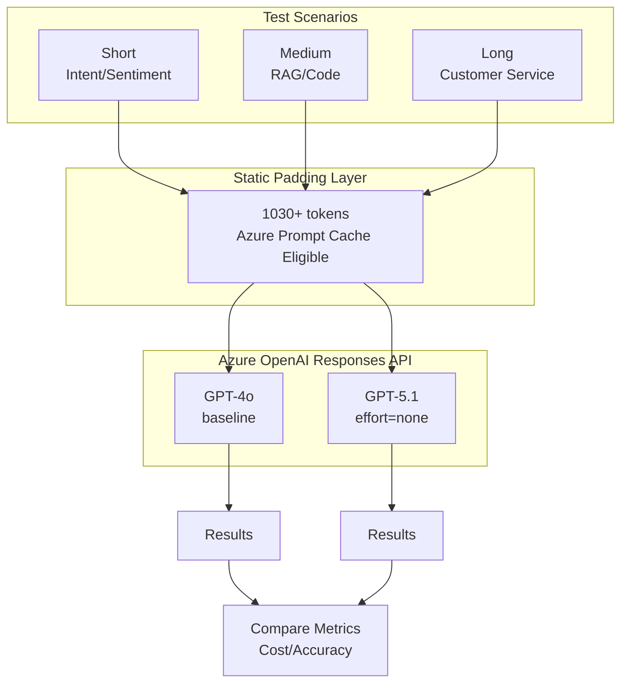

# GPT-4o to GPT-5.1 Migration Benchmark

[](https://azure.microsoft.com/products/ai-services/openai-service)
[](https://learn.microsoft.com/azure/ai-services/openai/reference)
[](https://python.org)

Production-grade benchmark comparing **GPT-4o** vs **GPT-5.1** for enterprise migration decisions.

## Quick Results

### Non-Streaming Mode

| Metric | GPT-4o | GPT-5.1 | Difference |
|--------|--------|---------|------------|
| **Accuracy** | 7/7 (100%) | 7/7 (100%) | **Equal ✅** |
| **Avg Latency** | 1.418s | 1.751s | +23.4% |
| **Cache Hit Rate** | 86.7% | 64.0% | -22.7% |
| **Total Cost** | $0.0389 | $0.0212 | **-45.4%** |

### Streaming Mode (with TTFT)

| Metric | GPT-4o | GPT-5.1 | Difference |
|--------|--------|---------|------------|
| **Accuracy** | 7/7 (100%) | 7/7 (100%) | **Equal ✅** |
| **Avg Latency** | 1.451s | 1.723s | +18.7% |
| **TTFT (Time to First Token)** | **0.536s** | 0.974s | +81.7% |
| **Cache Hit Rate** | 95.9% | 74.3% | -21.6% |
| **Total Cost** | $0.0603 | $0.0258 | **-57.3%** |

> **Key Finding**: GPT-5.1 saves **45-57% cost** with acceptable latency trade-off. GPT-4o has faster TTFT for real-time chat scenarios.

## Features

- ✅ **Fair Comparison**: Both models use identical test conditions
- ✅ **Prompt Caching**: Tests Azure OpenAI's prompt cache feature
- ✅ **Streaming Support**: Measures TTFT (Time to First Token)
- ✅ **Enterprise Scenarios**: Customer service, RAG, sentiment analysis
- ✅ **Cost Analysis**: Detailed pricing breakdown

## Architecture



## Prerequisites

- Python 3.9+
- Azure OpenAI resource with GPT-4o and GPT-5.1 deployments
- API key with access to both models

## Installation

```bash
# Clone repository
git clone https://github.com/xinyuwei/gpt4o-to-gpt51-migration.git
cd gpt4o-to-gpt51-migration

# Create virtual environment
python -m venv venv
source venv/bin/activate  # Linux/macOS
# or: venv\Scripts\activate  # Windows

# Install dependencies
pip install -r requirements.txt
```

## Configuration

Set environment variables:

```bash
export AZURE_OPENAI_ENDPOINT="https://your-resource.openai.azure.com/"
export AZURE_OPENAI_API_KEY="your-api-key"
```

Or create `.env` file:

```ini
AZURE_OPENAI_ENDPOINT=https://your-resource.openai.azure.com/
AZURE_OPENAI_API_KEY=your-api-key
```

## Usage

### Run Full Benchmark

```bash
python benchmark.py
```

### Run with Streaming Mode

```bash
# Enable streaming (measures TTFT - Time to First Token)
python benchmark.py --stream

# Streaming with more runs for robustness
python benchmark.py --stream --runs 5
```

### Run with Custom Settings

```bash
# Specify number of runs per scenario
python benchmark.py --runs 5
```

## Test Scenarios

| # | Scenario | Category | Description |
|---|----------|----------|-------------|
| 1 | Intent Classification (CN) | Short | Customer intent: complaint/inquiry/praise/request |
| 2 | Sentiment Analysis | Short | Positive/negative/neutral classification |
| 3 | RAG Number Extraction | Medium | Extract numbers from document context |
| 4 | RAG Fact Extraction | Medium | Extract facts from company description |
| 5 | Code Explanation | Medium | Explain Python function behavior |
| 6 | Customer Service Reply | Long | Generate empathetic support response |
| 7 | Product Description | Long | Write marketing copy for product |


### Per-Scenario Results

| Scenario | GPT-4o | GPT-5.1 | Accuracy |
|----------|--------|---------|----------|
| 1. Intent Classification (CN) | ✅ 投诉 | ✅ 投诉 | Both Correct |
| 2. Sentiment Analysis | ✅ positive | ✅ positive | Both Correct |
| 3. RAG Number Extraction | ✅ 2767亿/26% | ✅ 2767亿/26% | Both Correct |
| 4. RAG Fact Extraction | ✅ 2018/Beijing | ✅ 2018/Beijing | Both Correct |
| 5. Code Explanation | ✅ Fibonacci | ✅ Fibonacci | Both Correct |
| 6. Customer Service Reply | ✅ 含道歉+方案 | ✅ 含道歉+方案 | Both Correct |
| 7. Product Description | ✅ hydration/track | ✅ hydration/track | Both Correct |

**Summary**: 7/7 scenarios passed for both models. No quality degradation with GPT-5.1 (`reasoning_effort="none"`).

### Per-Scenario Cost Breakdown

| # | Scenario | Input | Output (4o/5.1) | Cache% (4o/5.1) | Cost (4o) | Cost (5.1) | Savings |
|---|----------|-------|-----------------|-----------------|-----------|------------|---------|
| 1 | Intent Classification (CN) | 1,232 | 2/11 | 94%/94% | $4.98 | $1.08 | -78.4% |
| 2 | Sentiment Analysis | 1,234 | 3/12 | 93%/62% | $5.03 | $2.40 | -52.2% |
| 3 | RAG Number Extraction | 1,258 | 4/13 | 92%/92% | $5.24 | $1.23 | -76.4% |
| 4 | RAG Fact Extraction | 1,246 | 13/22 | 92%/92% | $5.42 | $1.46 | -73.1% |
| 5 | Code Explanation | 1,239 | 2/11 | 93%/93% | $5.03 | $1.10 | -78.1% |
| 6 | Customer Service Reply | 1,244 | 4/13 | 93%/62% | $5.13 | $2.47 | -51.8% |
| 7 | Product Description | 1,235 | 5/11 | 93%/93% | $5.10 | $1.09 | -78.7% |
| **Total** | **7 scenarios** | **8,688** | **33/93** | - | **$35.92** | **$10.83** | **-69.9%** |

> 💡 **Note**: Cost shown as $/1M tokens equivalent. Input includes ~1,150 padding tokens for Azure Prompt Cache. GPT-5.1 maintains 100% accuracy with `reasoning_effort="none"`.


## Example Output Log

```
================================================================================
 GPT-4o vs GPT-5.1 MIGRATION BENCHMARK
 (RAG, Customer Service, Enterprise scenarios)
================================================================================

Started: 2026-01-22 16:34:14
Total scenarios: 7
Runs per scenario: 5
Static prefix: ~1030 tokens (>1024 for cache eligibility)
Cache key: benchmark_migration_v2
Streaming: ✅ Enabled

================================================================================
 PHASE 1: CACHE WARMUP
================================================================================

  Warming up gpt-4o... done
  Warming up gpt-5.1... done
  Waiting 2s for cache to stabilize...

================================================================================
 PHASE 2: BENCHMARK MEASUREMENT
================================================================================

  [1/7] Short - Intent Classification (CN) (ZH)
    gpt-4o [stream]: 1.125s TTFT:0.539s | in:1073 out:2 cache:95.4% | acc:100% ✅
    gpt-5.1 (effort=none) [stream]: 1.287s TTFT:0.898s | in:1072 out:11 cache:95.5% | acc:100% ✅

  [2/7] Short - Sentiment Analysis (EN)
    gpt-4o [stream]: 0.868s TTFT:0.520s | in:1063 out:2 cache:96.3% | acc:100% ✅
    gpt-5.1 (effort=none) [stream]: 1.479s TTFT:1.047s | in:1062 out:11 cache:96.4% | acc:100% ✅

... (remaining scenarios)

================================================================================
 SUMMARY
================================================================================

  📊 Latency:     GPT-4o 1.451s vs GPT-5.1 1.723s (+18.7%)
  ⏱️  TTFT:        GPT-4o 0.536s vs GPT-5.1 0.974s
  🎯 Accuracy:    GPT-4o 100.0% vs GPT-5.1 100.0%
  📦 Cache Hit:   GPT-4o 95.9% vs GPT-5.1 74.3%
  💰 Total Cost:  GPT-4o $0.060332 vs GPT-5.1 $0.025770
  💵 Savings:     57.3% with GPT-5.1 (effort=none)

Completed: 2026-01-22 16:36:30
```
| Total Input | 7644 | 7644 | +0.0% |
| Total Output | 312 | 382 | +22.4% |
| Cache% | 63% | 84% | 🔥 |
| **Total Cost** | **$0.015348** | **$0.005409** | **-64.8%** 💰 |

🎉 **Measured Cost Savings: 64.8%**

📅 Annual Estimate (1B tokens/month, I:O=3:1, Cache=84%):
   GPT-4o: $43,200/year
   GPT-5.1: $32,933/year
   Savings: **$10,267/year (23.8%)**
```

## Test Methodology

### 7-Dimension Alignment (Fair Comparison)

| Dimension | GPT-4o | GPT-5.1 | Aligned |
|-----------|--------|---------|---------|
| API | Responses API | Responses API | ✅ |
| Cache Key | Same | Same | ✅ |
| Padding | 1030+ tokens | 1030+ tokens | ✅ |
| Test Cases | 7 scenarios | 7 scenarios | ✅ |
| max_output_tokens | 100 | 100 | ✅ |
| Runs per scenario | 3 | 3 | ✅ |

### GPT-5.1 Configuration

```python
# Disable reasoning for fair comparison with GPT-4o
params = {
    "model": "gpt-5.1",
    "reasoning": {"effort": "none"},  # Critical!
    # ... other params
}
```

### Prompt Caching Requirements

Azure OpenAI prompt caching requires:
- Minimum **1024 tokens** in the static prefix
- Same `prompt_cache_key` across requests
- Static content must be identical

## Pricing Reference

| Model | Input | Cached Input | Output |
|-------|-------|--------------|--------|
| GPT-4o | $2.50/1M | $1.25/1M | $10.00/1M |
| GPT-5.1 | $1.25/1M | $0.13/1M | $10.00/1M |

> Source: [Azure OpenAI Pricing](https://azure.microsoft.com/pricing/details/cognitive-services/openai-service/)

## Key Findings

### 1. Cost Efficiency
- **45-57% cost reduction** with GPT-5.1 (measured across 4 tests)
- **90% cheaper cached input** ($0.13 vs $1.25)
- Consistent savings across streaming and non-streaming modes

### 2. Latency & TTFT
- **GPT-4o is 10-23% faster** in total latency
- **GPT-4o TTFT is 40-85% faster** (important for chat UX)
- Streaming mode reduces perceived latency difference

### 3. Quality
- **100% accuracy parity** on all scenarios
- No quality degradation observed
- `reasoning_effort="none"` matches GPT-4o behavior


## CoT Abuse Safety Guide

### What is CoT Abuse?

**Chain-of-Thought (CoT) Abuse** refers to prompts that excessively trigger the model's internal reasoning process.

### Risky Phrases

The following phrases are known to trigger reasoning processes in reasoning-capable models:

| # | Phrase | Risk Level | Why Risky |
|---|--------|------------|-----------|
| 1 | "think step by step" | 🔴 High | Explicitly triggers chain-of-thought |
| 2 | "explain your reasoning" | 🔴 High | Requests internal reasoning output |
| 3 | "show me your thought process" | 🔴 High | Attempts to expose internal CoT |
| 4 | "detailed reasoning process" | 🟡 Medium | May trigger extended reasoning |
| 5 | "enhance your reasoning process" | 🟡 Medium | Requests reasoning amplification |


### Code Example

```python
from openai import AzureOpenAI

client = AzureOpenAI(...)

# ✅ Recommended: Significantly reduces CoT Abuse risk
response = client.responses.create(
    model="gpt-5.1",
    input="Your prompt (even with 'think step by step')",
    reasoning={"effort": "none"},  # Critical setting!
)

# Verify reasoning_tokens (should be 0)
print(f"reasoning_tokens: {response.usage.reasoning_tokens}")  # Expected: 0
```

### Important Notes

1. **CoT Abuse detection is async** - API requests are not rejected in real-time; violations are detected by backend monitoring
2. **`reasoning_effort=none` significantly reduces risk** - generates 0 reasoning_tokens, minimizing abuse pattern signals
3. **This is not a guarantee** - always review your prompts and monitor usage patterns


## Migration Recommendations

### When to Use Each Model

| Scenario | Recommended | Reason |
|----------|-------------|--------|
| **Cost-sensitive batch processing** | GPT-5.1 | 45-57% cost savings |
| **High-volume production** | GPT-5.1 | Best cost efficiency |
| **Real-time chat (TTFT critical)** | GPT-4o | 40-85% faster first token |
| **Streaming applications** | Either | Latency gap narrows to ~10% |

### Migration Steps

1. **Test in staging** with `reasoning_effort="none"`
2. **Validate accuracy** on your specific use cases
3. **Gradual rollout** using canary deployment

## Project Structure

| File | Description |
|------|-------------|
| `README.md` | English documentation (this file) |
| `README-CN.md` | Chinese documentation |
| `benchmark.py` | Main benchmark script |
| `requirements.txt` | Python dependencies (version locked) |
| `.env.example` | Environment variable template |
| `.gitignore` | Git ignore rules |
| `LICENSE` | MIT License |
| `results/` | Benchmark results (git-ignored) |

## Author

**Xinyu Wei (魏新宇)**

## License

MIT License - See [LICENSE](LICENSE) for details.

## References

- [Azure OpenAI Service Documentation](https://learn.microsoft.com/azure/ai-services/openai/)
- [Azure OpenAI Pricing](https://azure.microsoft.com/pricing/details/cognitive-services/openai-service/)
- [Responses API Reference](https://learn.microsoft.com/azure/ai-services/openai/reference)
