# From Key-Value Cache Layout to 32 Graphics Processors: Attention, Memory, and Parallelism

[中文完整版](M02_attention_memory_parallelism_full_article.md) | English

*Author: Xinyu Wei | Microsoft AI and Apps GBB Senior System Engineer*

**GitHub repository:** <https://github.com/david-xinyuwei/david-share>

**Series:** `DL-Algorithm-Insights/`

This complete edition covers five traceable source chapters: Key-Value (KV) cache precision, including 8-bit floating point (FP8) and bfloat16 (BF16), paging, and physical layout; FlashAttention and PagedAttention; Tensor Parallelism (TP), Data Parallelism (DP), and Expert Parallelism (EP); CuTe domain-specific language (DSL) and FlyDSL layout programming; and the MiMo-V2.5-Pro TP8/DP4/EP32 topology across 32 Graphics Processing Units (GPUs). The source snapshots, exclusions, image hashes, and chapter lineage are recorded in `FULL_MERGE_LEDGER.md`, linked as [merge evidence](FULL_MERGE_LEDGER.md). Illustrative arithmetic is labeled as an example, shape ratios are derived rather than measured, and externally reported performance is attributed to its public source. This article adds no new benchmark result and makes no industry-wide claim for SHUFFLE 5D, no universal speedup claim for FP8 or a DSL, and no claim that the MiMo `192/128` kernel has been implemented or measured through NVIDIA CuTe DSL.

## Reading map

1. Start with the six overview figures to separate precision, allocation, layout, kernel, and parallelism.
2. Source #1 defines the named SGLang ROCm SHUFFLE 5D snapshot and its runtime checks.
3. Source #4 separates PagedAttention's addressing role from FlashAttention's I/O-aware computation, then locates AITER, FlashInfer, Triton, Gluon, and FlyDSL in the software stack.
4. Source #5 derives why TP uses AllReduce and EP uses dispatch/combine-style AllToAll, including the limits of the `kA` teaching model.
5. Sources #13 and #14 connect explicit layout programming to MiMo's 128 Query heads, 8 KV heads, asymmetric 192/128 dimensions, TP8-interleaved checkpoint, and TP8/DP4/EP32 deployment topology.

## Six overview figures

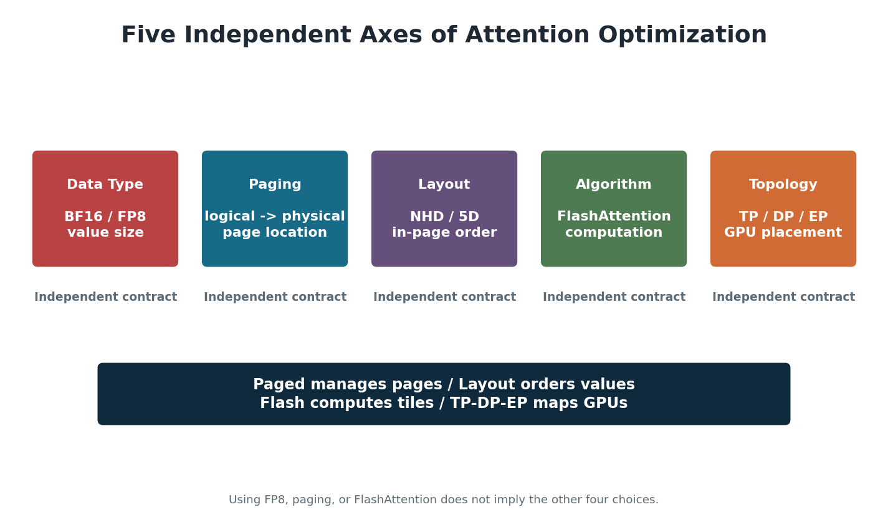

*Overview Figure 1. FP8, PagedAttention, 5D layout, FlashAttention, and TP/DP/EP are composable design axes, not five competing solutions.*

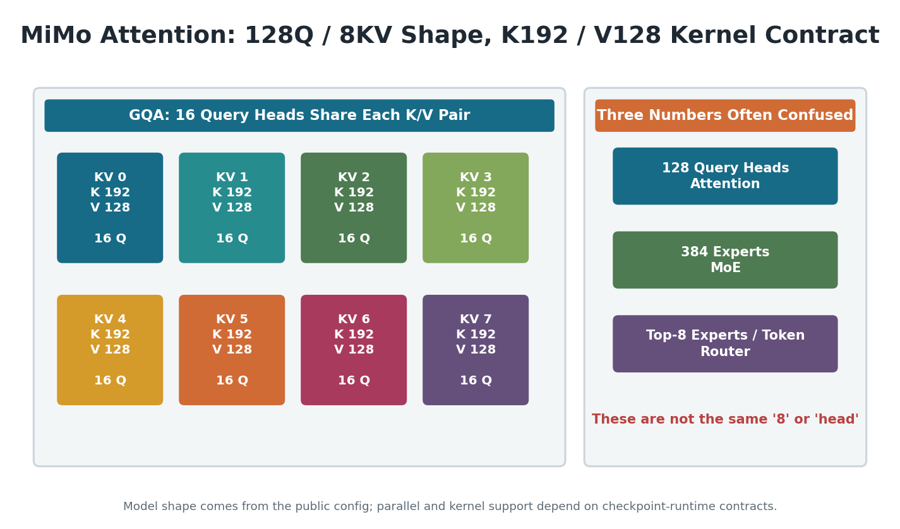

*Overview Figure 2. The 128Q/8KV Grouped Query Attention structure determines head ownership; K=192 and V=128 determine load, tile, and fragment contracts. GPU count alone explains neither constraint.*

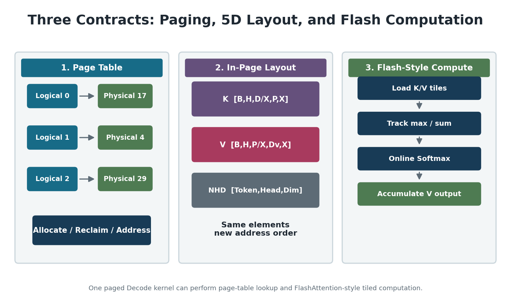

*Overview Figure 3. Paging, in-page layout, and FlashAttention-style computation are three separate contracts. A `view()` can reinterpret a shape, but it cannot turn NHD bytes into SHUFFLE 5D without a real data rearrangement.*

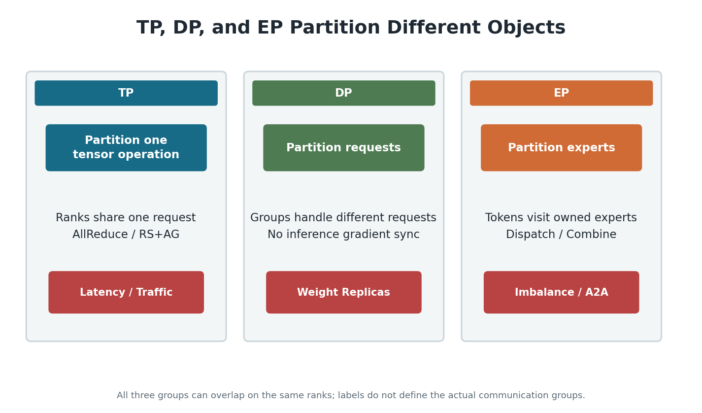

*Overview Figure 4. TP makes several ranks cooperate on one result, DP assigns different requests to different groups, and EP sends data to the ranks that own selected experts. The same GPUs can participate in all three groupings.*

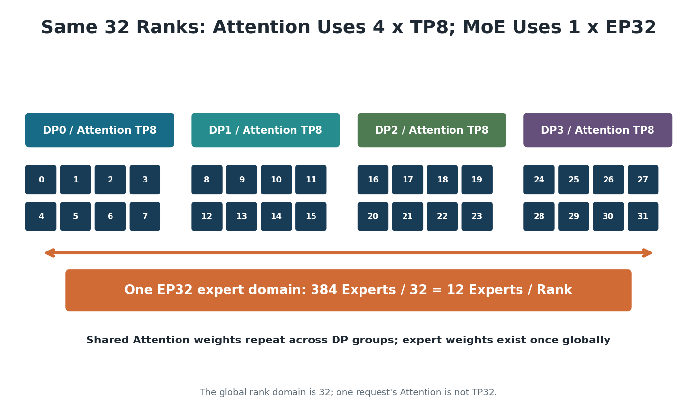

*Overview Figure 5. Four DP groups each retain a complete TP8 Attention path, while one EP32 domain holds the 384 routed experts that dominate model weight capacity.*

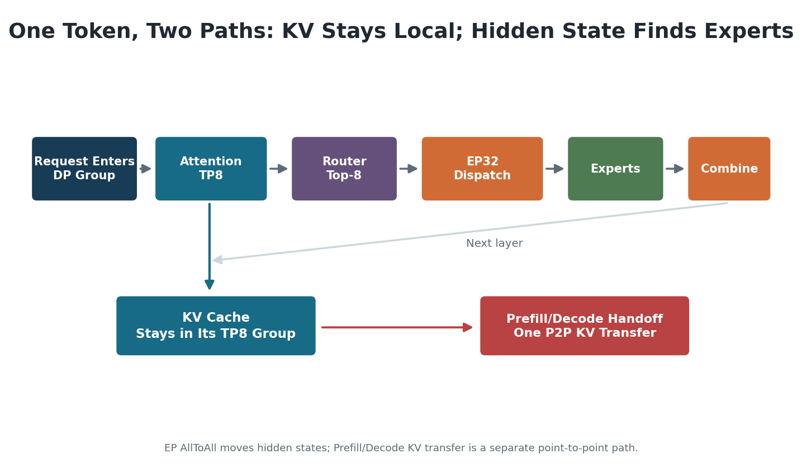

*Overview Figure 6. Token hidden states cross the EP domain; per-layer KV cache does not. KV follows request ownership and crosses nodes separately only during a Prefill/Decode role handoff.*

> The 49 source-detail images below preserve the exact source paths and order recorded in the merge ledger. Some bitmaps may retain Chinese labels; each image has an English alt description and an English interpretation in its caption or adjacent text.

## Complete source chapters

<!-- SOURCE-BEGIN-EN id=01 -->
## Source #1: What 5D KV Cache Actually Means

> A 5D KV cache is not a new numeric format, and it does not reduce memory capacity by itself. It is a physical byte layout designed for particular Attention kernels.

Four settings often appear together in large-model inference configurations:

```text
FP8 E4M3
PagedAttention
vectorized_5d
AITER / FlyDSL
```

They answer different questions:

| Concept | Question it answers |
|---|---|
| FP8 or BF16 | How many bits represent each value, and with what numeric precision? |
| PagedAttention | How is KV-cache memory allocated, reclaimed, and mapped? |
| 5D layout | In what physical order are the values inside one KV page stored? |
| AITER, FlyDSL, or FA3 | Which kernel reads the data and performs the computation? |

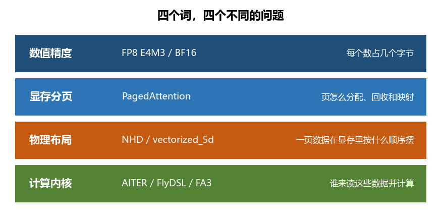

*Source Figure 1. Treating these four layers as one optimization can select a slow path or, more seriously, let a kernel interpret the wrong physical layout while the process still starts normally.*

This chapter isolates one question: what does **5D KV cache** mean in the named implementation?

### The problem solved by a KV cache

During autoregressive generation, the current Query attends to the Keys and Values of all preceding tokens. Recomputing historical K and V at every decoding step would repeat an increasing amount of work. A Key-Value cache stores each layer's historical K and V in GPU memory so later steps can read them directly.

The tradeoff is capacity. The cache grows with the context and must remain in device memory. The following optimizations therefore answer three distinct questions: how many bytes each value uses, where the cache is allocated, and how its values are physically ordered.

A rough capacity estimate is:

```text
KV bytes ≈ layers × tokens × 2 (K and V) × KV heads × head dimension × bytes per element
```

Consider an illustrative configuration, not a claim about a particular model:

```text
32 layers
128K token
8 KV heads
head_dim = 128
```

| Storage type | Bytes per element | Approximate KV-cache capacity |
|---|---:|---:|
| BF16 | 2 | 16 GiB |
| FP8 | 1 | 8 GiB |

A single 16 GiB cache consumes one fifth of an 80 GiB GPU before model weights are counted. In this example, **FP8** halves the capacity requirement. A 5D layout does not.

### Where values live: PagedAttention allocates standard rooms

An inference server cannot reserve one maximum-context contiguous region for every request. PagedAttention instead divides KV storage into fixed-size pages and maintains a page table from a request's logical page number to a physical GPU-memory page.

A useful logical sketch is:

```text
[B, P, H, D]
```

- `B`: number of physical pages or blocks
- `P`: tokens per page
- `H`: number of KV heads
- `D`: head dimension

This is not a universal physical shape required by PagedAttention. An implementation may use a flat buffer plus a page table, or another dimension order. Paging answers where the rooms are and which request owns them. It still does not say how values are arranged inside one room.

### In-page order: the layout contract

The simplest representation follows the shape in which K and V are produced:

```text
[N, H, D]
```

- `N`: token count, named `size` in the referenced source because it is the cache capacity
- `H`: KV-head count, named `head_num`
- `D`: per-head dimension, named `head_dim`

This is the **NHD** layout: finish all dimensions for one token before writing the next token. The same elements can be stored in a different address order without changing their count. The 5D layout discussed here is one such order.

The boundary is exact: **PagedAttention manages pages; layout defines the physical ordering inside each page.** The two mechanisms are independent and can be combined.

### The five dimensions in the named SHUFFLE 5D snapshot

**5D KV cache is not an industry-standard term with one definition.** This chapter refers only to `SHUFFLE 5D` in the public SGLang ROCm snapshot at commit `878fff156`, selected by:

```text
SGLANG_AITER_KV_CACHE_LAYOUT=vectorized_5d
```

That implementation uses different five-dimensional layouts for K and V.

#### K cache

```text
[B, H, D/X, P, X]
```

#### V cache

```text
[B, H, P/X, Dv, X]
```

| Symbol | Meaning |
|---|---|
| `B` | Number of pages or blocks |
| `H` | Number of KV heads |
| `P` | Page size in tokens |
| `D` / `Dv` | K or V head dimension |
| `X` | Innermost vector width |

`X` is derived from a 16-byte storage vector in the source, not chosen arbitrarily:

```text
X = 16 / bytes per element
```

| KV storage type | Bytes per element | `X` |
|---|---:|---:|
| FP8 | 1 | 16 |
| BF16 / FP16 | 2 | 8 |

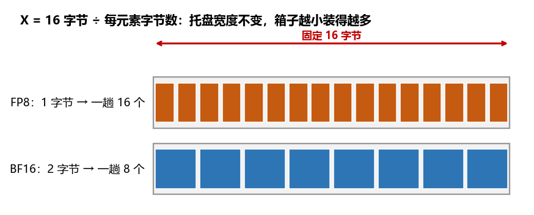

*Source Figure 2. The storage-vector contract fixes bytes, so a smaller element type increases the number of elements in the innermost vector.*

For `page_size=64`, `head_dim=192`, and FP8 KV storage:

```text
K: [B, H, 12, 64, 16]
V: [B, H, 4, 192, 16]
```

The dimensions follow directly: a `192`-wide K head gives `192÷16=12`, so its quotient is `12`; `64÷16=4` gives V's page quotient. Both caches still contain:

```text
B × H × 192 × 64
```

Only address order changes. The number of values does not.

### A small address-level example

Shrink the dimensions until every element is visible:

```text
4 tokens (page_size=4)
head_dim=4
X=2 (vector width simplified to 2 for clarity)
```

There are `4 × 4 = 16` elements. NHD completes one token before moving to the next:

```text
Address:  0     1     2     3     4     5     6     7   ...
Contents: t0d0  t0d1  t0d2  t0d3  t1d0  t1d1  t1d2  t1d3  ...
      \_____ token0 _____/ \_____ token1 _____/
```

The 5D example divides the head dimension into `4 ÷ 2 = 2` chunks. It writes the first two dimensions for every token, then the final two:

```text
Address:  0     1     2     3     4     5     6     7
Contents: t0d0  t0d1  t1d0  t1d1  t2d0  t2d1  t3d0  t3d1
   \________ d0 and d1 for all tokens ________/

Address:  8     9     10    11    12    13    14    15
Contents: t0d2  t0d3  t1d2  t1d3  t2d2  t2d3  t3d2  t3d3
   \________ d2 and d3 for all tokens ________/
```

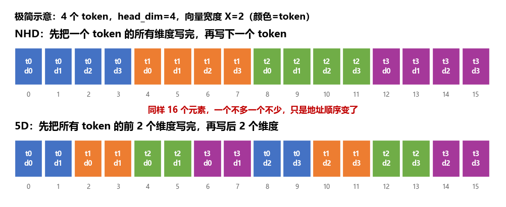

*Source Figure 3. Real parameters scale `X` from 2 to 16, `head_dim` from 4 to 192, and `page_size` from 4 to 64; the ordering rule is unchanged.*

### Why K and V use different 5D shapes

Attention has two principal matrix operations:

```text
1. Q × Kᵀ → Attention scores
2. Softmax(scores) × V → output
```

Their access patterns differ. The public shapes and index formulas show this design:

- K splits `head_dim` into `D/X` and `X`, grouping the head vector at a fixed width for the dot product.
- V splits in-page token position into `P/X` and `X`, allowing Value aggregation to read token blocks.

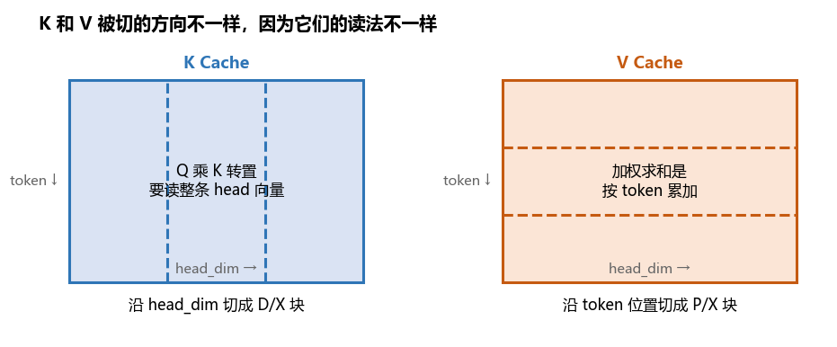

*Source Figure 4. The 16-byte width is a storage-vector contract of this implementation, not a universal vector width for every GPU or kernel.*

The writer kernel scatters ordinary `[N,H,D]` K/V into these physical layouts. A consumer that only accepts a linear layout must gather values back with the inverse index formula. A kernel that consumes 5D natively can avoid that restoration. Scatter and gather both cost time, so repeated layout conversion can erase the intended gain.

This is why layout is a data contract. Equal shapes do not imply equal physical meaning, and `view()` cannot convert NHD into SHUFFLE 5D. It changes the interpretation, not the bytes. A wrong interpretation may still satisfy every shape check while returning numerically wrong Attention results.

### Why 5D can be faster

The layout does not reduce the mathematical operation count. It targets data movement:

1. A fixed 16-byte innermost vector supports vectorized loads and stores.
2. K and V follow their consumer directions, reducing strided access.
3. In this SGLang path, the 5D pool is consumed natively by AITER CK `mha_batch_prefill_func` and `pa_decode_gluon`.
4. Data already stored in the kernel's expected shape avoids repeated runtime `permute` or `transpose` operations.

SGLang describes this integration as SHUFFLE 5D physical storage consumed by the corresponding AITER Prefill and Paged Decode paths without a runtime permutation. That statement defines the SGLang-side contract. It does not prove identical support across every AITER version or Attention variant.

The idea is consistent with FlashAttention's I/O-aware principle: Attention cost depends on how much data moves between High Bandwidth Memory (HBM) and on-chip storage, and in what order, not only on arithmetic count.

Performance remains backend-specific. It depends on GPU architecture, KV dtype, page size, `head_dim`, Attention backend, and the existence of a matching consumer kernel. Without one, behavior is implementation-specific: a non-AITER backend may ignore the variable and retain NHD; an incompatible combination may fail startup validation; any other fallback must be established from runtime logs.

### FP8 changes bytes; 5D changes layout

These settings often travel together on AMD inference deployments:

```text
--kv-cache-dtype fp8_e4m3
SGLANG_AITER_KV_CACHE_LAYOUT=vectorized_5d
--page-size 64
--attention-backend aiter
```

Their exact relationship is:

```text
FP8 determines that each element occupies 1 byte
5D determines how those elements are arranged
page size determines how many tokens fit in one page
AITER/FlyDSL/Gluon determines the reader
```

The memory-pool implementation also permits BF16 and FP16 5D storage, where `X=8`. The real support boundary is the kernel matrix: whether the target GPU, dtype, `head_dim`, and page size have a kernel that directly consumes this layout.

When changing KV storage from FP8 back to BF16, startup is insufficient evidence. Verify that `X` changes from 16 to 8, page size and `head_dim` remain divisible by `X`, the intended Prefill and Decode kernels load, no silent fallback occurs, and both performance and numerical output are revalidated.

### Why the Target can use 5D while the Draft uses NHD

Speculative decoding commonly runs a Target model and a Draft model whose Attention kernels need not match. In the public implementation analyzed here:

```text
Target worker: AITER SHUFFLE 5D
Speculative draft worker: NHD
```

At that snapshot, the multi-layer EAGLE Draft Extend path understood only ordinary NHD cache. A global 5D setting would make the Draft interpret shuffled physical bytes with NHD indexing. That is semantic corruption, not a slower path.

In the small example, an NHD Draft reads addresses 0 through 3 for token 0:

```text
It expects:           t0d0  t0d1  t0d2  t0d3
It actually receives: t0d0  t0d1  t1d0  t1d1
                              ↑↑↑↑↑↑↑↑↑↑↑
                              these two values belong to token1
```

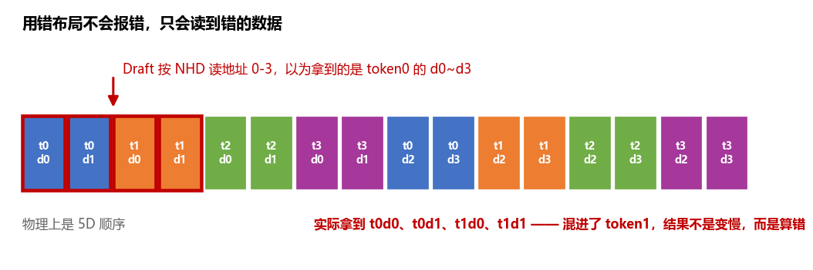

*Source Figure 5. Shape checks can still pass and the service can still return output even though token 0 has consumed values from token 1.*

The source therefore overrides the Draft to NHD while retaining 5D for the Target. Operationally, inspect each worker's actual layout instead of relying on one global environment variable.

### Five common misconceptions

| Misconception | Correct boundary |
|---|---|
| 5D is a quantization format | 5D is a physical layout; FP8 and BF16 are data types. |
| 5D halves KV capacity | FP8 halves the bytes in the example; 5D mainly changes ordering. |
| PagedAttention is 5D | Paging maps logical and physical pages; 5D defines in-page layout. |
| One environment variable completes the optimization | Dtype, page, layout, and kernel must form one closed contract. |
| Target and Draft always share a layout | They may be consumed by different kernels and require different layouts. |

### Runtime verification procedure

Do not stop at the launch script. Check at least four evidence layers:

| Layer | Required evidence |
|---|---|
| Launch arguments | KV dtype, page size, and Attention backend |
| Process environment | Effective value of `SGLANG_AITER_KV_CACHE_LAYOUT` |
| Allocation logs | Actual KV-cache dtype and allocated capacity |
| Kernel logs | Target and Draft layouts plus the loaded Prefill and Decode kernels |

A general log probe is:

```bash
grep -E \
  'server_args=|KV Cache is allocated|SHUFFLE 5D|Using NHD|mha_batch_prefill|pa_decode' \
  server.log
```

Seeing only the `vectorized_5d` environment value proves that 5D was requested, not that the path became active. A non-AITER backend can ignore it and keep NHD; an unsupported dtype, page-size, or `head_dim` combination can fail during startup validation. Even successful startup does not prove the intended kernel loaded. Kernel-selection logs and performance evidence remain necessary.

### Three statements to retain

**What:** In this snapshot, 5D KV cache physically reorders Paged KV values across page, head, and vector-block axes.

**Why:** Matching Attention kernels can read K/V at their native vector width and avoid inefficient access or runtime rearrangement.

**Boundary:** It is neither FP8 nor a capacity-saving mechanism, and it is not a portable standard across GPUs or backends.

### Public sources

1. SGLang public source, `vectorized_5d` environment setting and K/V shapes  
   https://github.com/sammysun0711/sglang/blob/878fff15647fe3dabb32aa3a335b0ad16e3ee878/python/sglang/srt/environ.py

2. SGLang public source, 5D pool allocation and vector width `X`  
   https://github.com/sammysun0711/sglang/blob/878fff15647fe3dabb32aa3a335b0ad16e3ee878/python/sglang/srt/mem_cache/memory_pool.py

3. SGLang public source, NHD and SHUFFLE 5D scatter/gather indices  
   https://github.com/sammysun0711/sglang/blob/878fff15647fe3dabb32aa3a335b0ad16e3ee878/python/sglang/srt/layers/attention/utils.py

4. SGLang public source, 5D Target and NHD Draft override  
   https://github.com/sammysun0711/sglang/blob/878fff15647fe3dabb32aa3a335b0ad16e3ee878/python/sglang/srt/model_executor/model_runner_kv_cache_mixin.py

5. AITER, AMD's high-performance AI operator library for ROCm  
   https://github.com/ROCm/aiter

6. PagedAttention paper, *Efficient Memory Management for Large Language Model Serving with PagedAttention*  
   https://arxiv.org/abs/2309.06180

7. FlashAttention paper, *Fast and Memory-Efficient Exact Attention with IO-Awareness*  
   https://arxiv.org/abs/2205.14135
<!-- SOURCE-END-EN id=01 -->

---

<!-- SOURCE-BEGIN-EN id=04 -->
## Source #4: From PagedAttention to FlashAttention

> The two names often appear together, but they solve different problems. Their separation is the key to understanding what FA3, FlashInfer, AITER, and Triton actually select in a runtime configuration.

The short version is:

```text
FlashAttention: compute Attention faster with less intermediate memory
PagedAttention: locate and consume historical K/V stored in pages
Operator libraries: package both capabilities as callable kernels, as AITER and FlashInfer do
```

These are neither mutually exclusive choices nor a simple parent-child hierarchy.

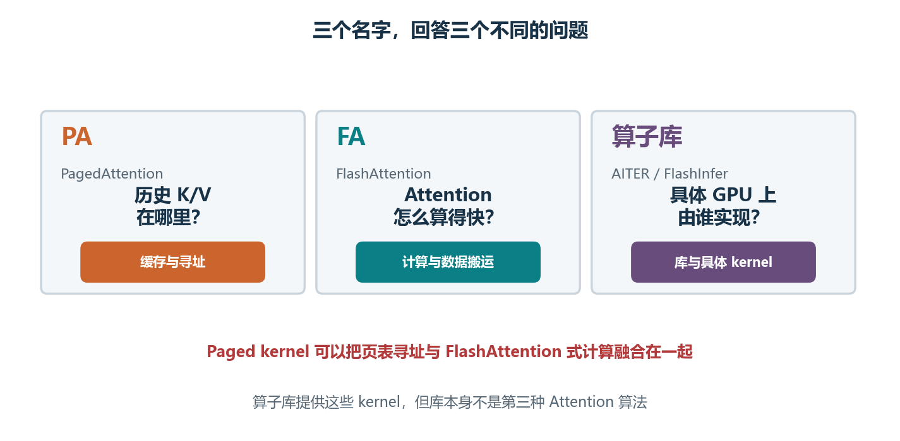

*Source Figure 1. FlashAttention supplies an I/O-aware computation method, PagedAttention supplies paged addressing and execution, and operator libraries package concrete kernels for a hardware platform.*

### A restaurant analogy for the invariant contract

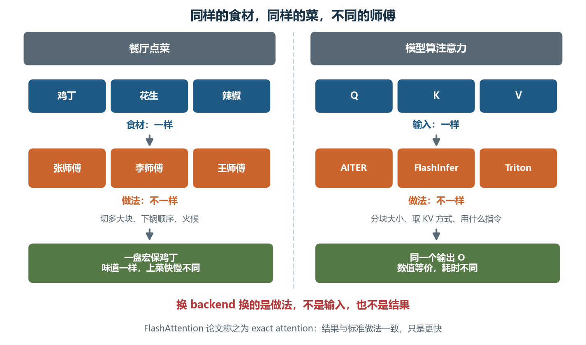

*Source Figure 2. Query, Key, and Value are the ingredients; the Attention equation is the dish; a backend chooses who cooks it and how.*

Ordering Kung Pao chicken does not change the ingredients or the finished dish when a different chef changes cutting, heat, scheduling, or serving time. Attention has the same invariant boundary:

| Restaurant | Attention | Can it change? |
|---|---|---|
| Chicken, peanuts, and chili | Inputs Q, K, and V | No |
| The named dish | The Attention equation | No |
| The plated result | Output O | No, except for the documented numerical-equivalence boundary |
| Chef, preparation, and serving time | Backend, algorithmic schedule, and latency | Yes |

FlashAttention calls this **exact attention**: it computes the same mathematical result as the standard method while changing the execution strategy. PagedAttention, AITER, FlashInfer, and replaceable backends likewise change how the contract is implemented, not the identities of Q, K, V, and O.

### Definitions

| Term | Meaning in this chapter |
|---|---|
| **Attention** | Correlates a Query with Keys, then computes a weighted sum of Values |
| **Q / K / V** | Query, Key, and Value vectors |
| **KV cache** | Key-Value cache holding historical-token K/V for later decoding |
| **FlashAttention (FA)** | An I/O-aware exact Attention algorithm |
| **PagedAttention (PA)** | An algorithm and execution interface that reads paged KV through a page table |
| **kernel** | A program that executes computation on a GPU |
| **CUDA** | Compute Unified Device Architecture, NVIDIA's GPU programming platform |
| **HIP** | Heterogeneous-compute Interface for Portability, AMD ROCm's C++ interface with CUDA-like syntax |
| **HBM** | High Bandwidth Memory, relatively large off-chip device memory |
| **SRAM** | Static Random-Access Memory, smaller and faster on-chip storage |
| **AITER** | AMD's high-performance AI operator library for ROCm; its README says AI Tensor Engine for ROCm, while official documentation also uses AMD Inference and Training Enhanced Repository |
| **FlashInfer** | An inference operator library and kernel generator for NVIDIA GPUs |
| **backend** | A replaceable concrete implementation behind a common interface, unrelated to web frontends and backends |
| **JIT** | Just-In-Time compilation, which generates and compiles concrete code at runtime |
| **ROCm** | Radeon Open Compute, AMD's GPU software platform |

### The shared mathematical starting point

Scaled dot-product Attention is:

$$
O = \operatorname{softmax}\left(\frac{QK^\mathsf{T}}{\sqrt{d}}\right)V
$$

It computes $QK^\mathsf{T}$, applies row-wise Softmax, then multiplies the probabilities by $V$ to obtain $O$.

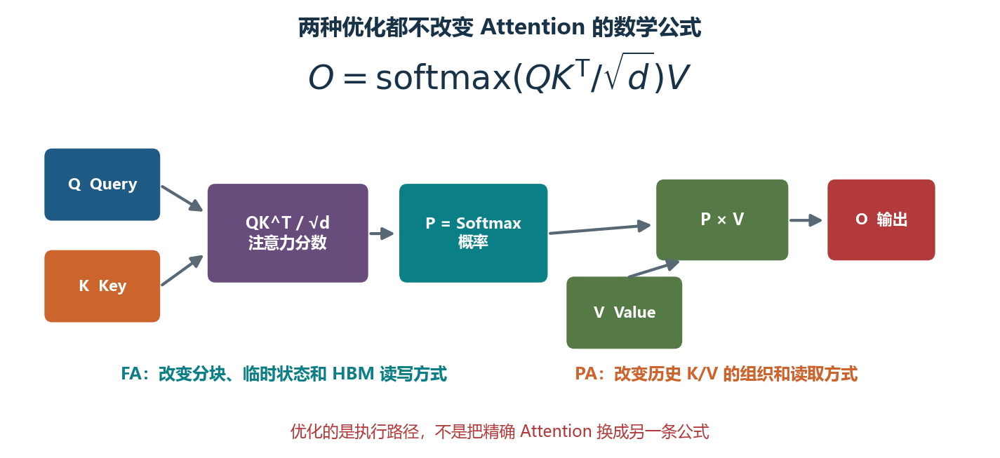

*Source Figure 3. FlashAttention and PagedAttention preserve the equation but solve different engineering problems when it runs on a GPU.*

### FlashAttention avoids materializing the full score matrix

For sequence length $N$, the complete $QK^\mathsf{T}$ matrix has $N \times N$ elements. A conventional implementation may write that matrix to HBM, read it for Softmax, then read the probability matrix again to multiply by $V$. With long sequences, memory traffic can dominate arithmetic.

FlashAttention works in tiles:

```text
Split Q, K, and V into tiles
      ↓
Load the current tile into on-chip storage
      ↓
Compute the local QKᵀ
      ↓
Use online Softmax to update the row maximum, exponential sum, and output
      ↓
Process the next tile without storing the full Attention matrix
```

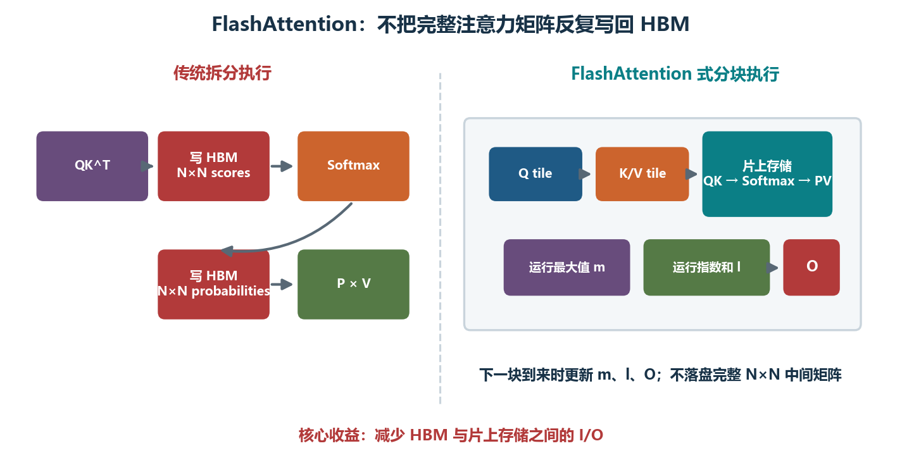

*Source Figure 4. Online Softmax carries a running maximum and exponential sum across tiles, so the algorithm need not store the full score matrix and still returns exact Attention.*

This reduces HBM-to-on-chip movement, storage for the full intermediate matrix, and read/write traffic between separate kernels. It answers: **given Q, K, and V, how can Attention use less temporary memory and move less data?** The method applies to training and inference Prefill even when there is no historical KV cache.

### FlashAttention has four generations

“Uses FlashAttention” is not a complete implementation description. The public lineage has four generations with different bottlenecks:

| Generation | Main problem | Principal technique |
|---|---|---|
| FlashAttention (2022) | Excessive HBM traffic | Tiling, online Softmax, backward recomputation |
| FlashAttention-2 (2023) | Insufficient parallelism and work partitioning | Loop reordering and improved work division across warps |
| FlashAttention-3 (2024) | FA2 reached only about 35% of H100 peak compute | Hopper asynchronous features and low precision |
| FlashAttention-4 | Newer hardware generations | CuTeDSL rewrite targeting Hopper and Blackwell |

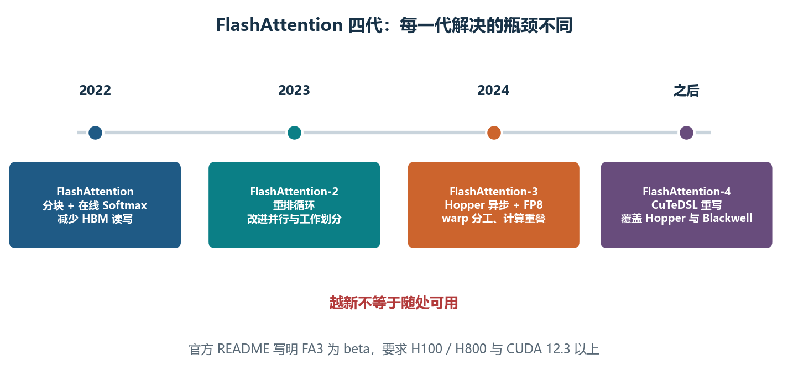

*Source Figure 5. A generation name carries hardware and implementation boundaries; it is not merely a newer version number.*

FA3 has three notable mechanisms:

1. **Asynchrony and warp specialization.** Some warps move data while others perform matrix operations, using Tensor Memory Accelerator (TMA) and Warpgroup Matrix Multiply-Accumulate (WGMMA) asynchronously.
2. **Overlapped GEMM and Softmax.** Tensor Cores perform matrix multiplication while multifunction units execute exponentials, avoiding a serial queue between units with very different throughput.
3. **Low-precision error control.** For FP8, incoherent processing uses Hadamard transforms to spread outliers and reduce quantization error.

The public FA3 figures report roughly 1.5–2.0× speedup over FA2 in FP16, about 740 TFLOPS, and close to 1.2 PFLOPS in FP8, with numerical error about 1/2.6 of a baseline FP8 Attention implementation. These are externally reported results, not measurements produced by this article. The official README labels FA3 beta and requires H100 or H800 with CUDA 12.3 or newer. The claim therefore cannot be generalized to arbitrary GPUs.

### PagedAttention lets historical K/V occupy noncontiguous memory

In online decoding, requests grow at different rates and end at different times. Reserving one maximum-length contiguous KV region per request wastes capacity:

```text
Request A: 700 actual tokens, but 32K reserved
Request B: 8K actual tokens, but 32K reserved
Request C: generation finished, leaving a hole
```

PagedAttention borrows the virtual-memory model and divides KV into fixed-size pages:

```text
Request logical pages: 0 → 1 → 2 → 3
                 │   │   │   │
Page-table mapping    ▼   ▼   ▼   ▼
Physical pages:      17   4  29   8
```

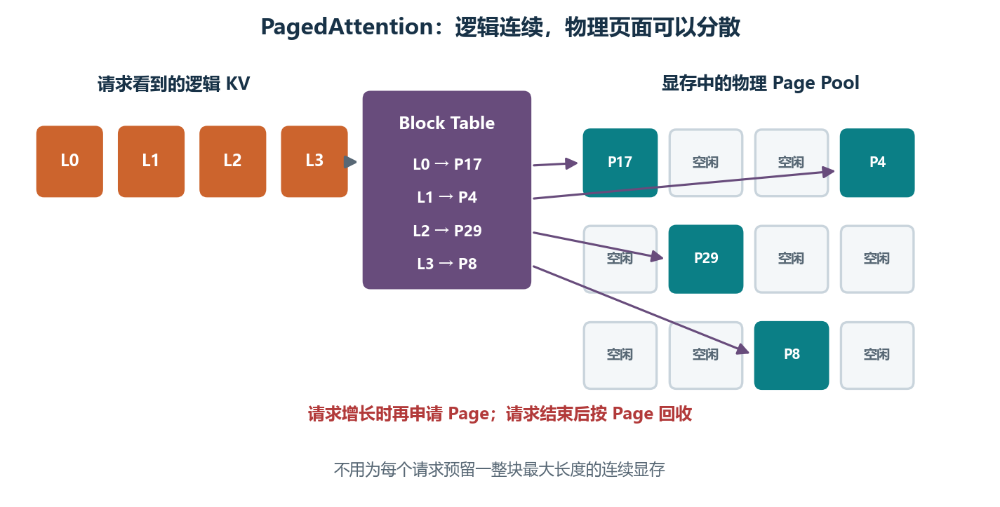

*Source Figure 6. A request sees a contiguous token sequence even when the corresponding physical pages are scattered in device memory.*

The design allocates cache on demand, recycles pages from completed requests, reduces external fragmentation, and can share pages across requests or candidate sequences. PagedAttention is more than an allocator, however. Its compute kernel must consume the page table, locate each logical token's physical page, load K/V, and complete Attention.

It answers: **how can Attention directly use historical K/V scattered across physical pages?**

### The upstream and downstream roles can fuse

At the serving-control level, paged allocation is upstream of FlashAttention-style computation:

```text
A new token produces K/V
        ↓
The cache allocator requests a Page and updates the page table
        ↓
The next generation step creates a Query
        ↓
The Paged kernel locates historical K/V through the page table
        ↓
Compute QKᵀ in tiles → online Softmax → multiply by V
        ↓
Output enters the next layer, and new K/V is written back to a Page
```

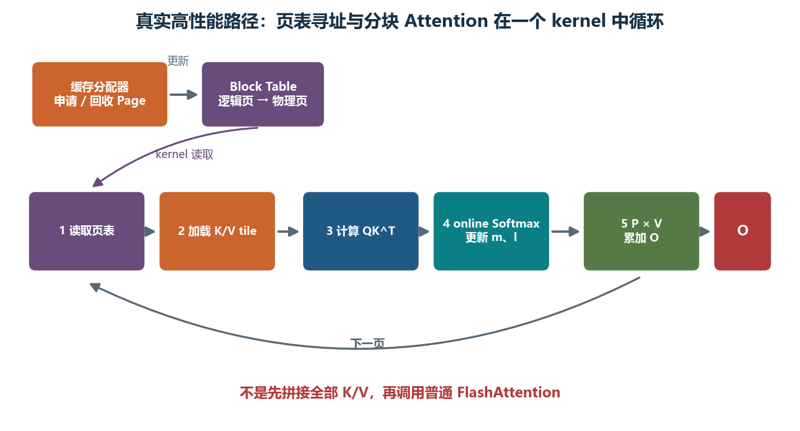

*Source Figure 7. The control flow separates allocation from computation, while a high-performance kernel can fuse page-table addressing and online tiled Attention.*

An implementation usually avoids this costly sequence:

```text
Gather all paged K/V into a contiguous tensor
Then invoke standard FlashAttention
```

The extra gather and memory copy would offset paging's benefit. A fused paged kernel instead reads the physical page number, loads a K/V tile, computes local $QK^\mathsf{T}$, updates online Softmax state, multiplies the local probabilities by $V$, accumulates the output, and proceeds to the next page.

The precise relationship is: **PagedAttention supplies a paged-addressing contract; FlashAttention supplies tiled computation and online normalization. One paged kernel can implement both ideas.**

### A FlashAttention kernel does not automatically understand pages

A conventional FlashAttention interface commonly accepts contiguous or regularly strided Q/K/V tensors. Paged KV additionally requires a block table, context lengths, page size, physical page identifiers, and possibly quantization scales. A kernel without those inputs cannot interpret the page table.

The choices are:

```text
Option A: gather contiguous K/V, then invoke standard FlashAttention
Option B: use a Paged Attention kernel with native Page Table support
```

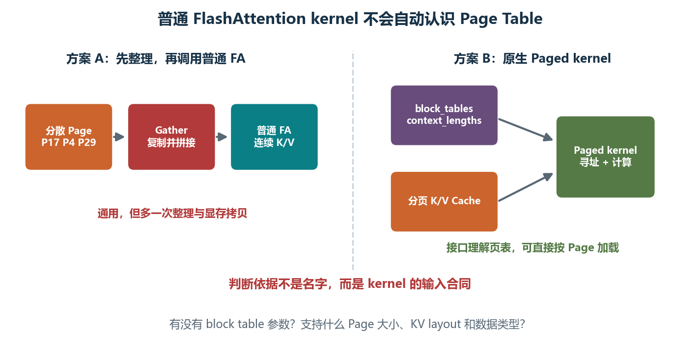

*Source Figure 8. Gathering is more general but adds rearrangement and copy traffic; native paging is more efficient but must match page size, KV layout, dtype, and other kernel contracts.*

“Uses FlashAttention” therefore does not imply Paged KV support, and “uses PagedAttention” does not imply the official FlashAttention implementation.

### Prefill and Decode often use different paths

Prefill processes many Query rows from an input sequence. Large matrix operations dominate, making FlashAttention-style tiling a natural fit.

Decode normally adds one Query per request at each step while reading the entire historical cache. $QK^\mathsf{T}$ is much narrower, K/V reads dominate more strongly, and block-table access across many requests matters.

A common serving split is:

```text
Prefill: Dense / Ragged FlashAttention-style kernel
Decode: Paged Attention kernel
```

| Stage | Training | Inference Prefill | Inference Decode |
|---|---|---|---|
| FlashAttention-style computation | Common | Common | Possible through a KV-aware variant |
| PagedAttention | Generally not involved | Can support prefix reuse and chunked Prefill | Primary use case |

This is a common pattern, not a hard rule. Frameworks can provide Paged KV Prefill and KV-cache FlashAttention variants; the decisive evidence is the actual kernel interface and runtime log.

### AITER's role

AITER is neither a new Attention equation nor a cache-management policy. It is AMD's production-oriented operator library for ROCm. Its public capability list includes Multi-Head Attention, Multi-Latent Attention, Paged Attention, General Matrix Multiplication (GEMM), Mixture of Experts (MoE), normalization, quantization, and communication operators.

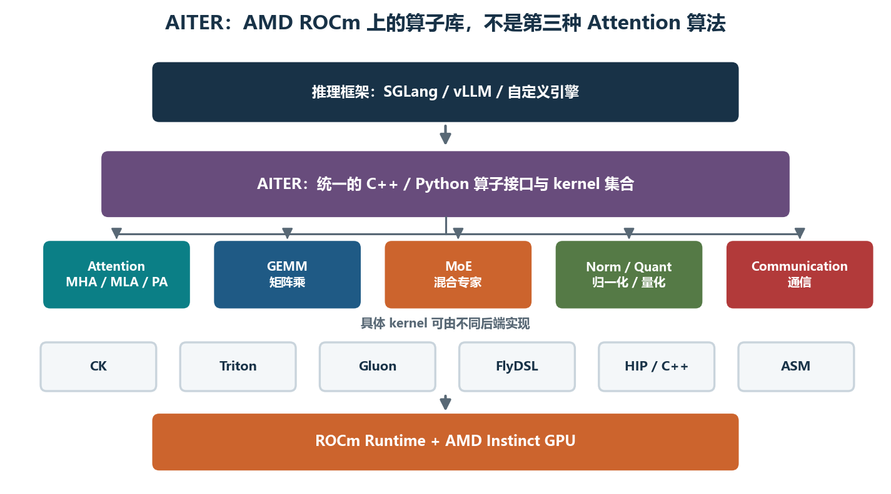

*Source Figure 9. One operator library can contain kernels written through several lower-level technologies.*

AITER can use multiple implementation routes internally:

```text
AITER operator library
├─ Composable Kernel (CK) C++ templates
├─ Triton
├─ Gluon
├─ FlyDSL
└─ Hand-written assembly
```

Consequently, `--attention-backend aiter` selects an AITER Attention path at the framework level; `pa_decode_gluon` names a Gluon implementation of Paged Decode inside AITER; and another AITER path can use CK, Triton, FlyDSL, or assembly.

AITER packages hardware-appropriate FA-, PA-, GEMM-, and MoE-related kernels for frameworks such as SGLang and vLLM. It does not replace their scheduling or cache-allocation responsibilities.

### A concrete AITER Paged Decode kernel

The public `pa_decode_gluon` source exposes the fused relationship. Its inputs include:

```text
query
key_cache / value_cache
block_tables
context_lengths
```

Its kernel flow is:

```text
Read block_tables
→ Obtain the physical Page number
→ Load K/V in tiles
→ Compute QK scores
→ Update the maximum and exponential sum online
→ Compute probabilities × V
→ Produce the output
```

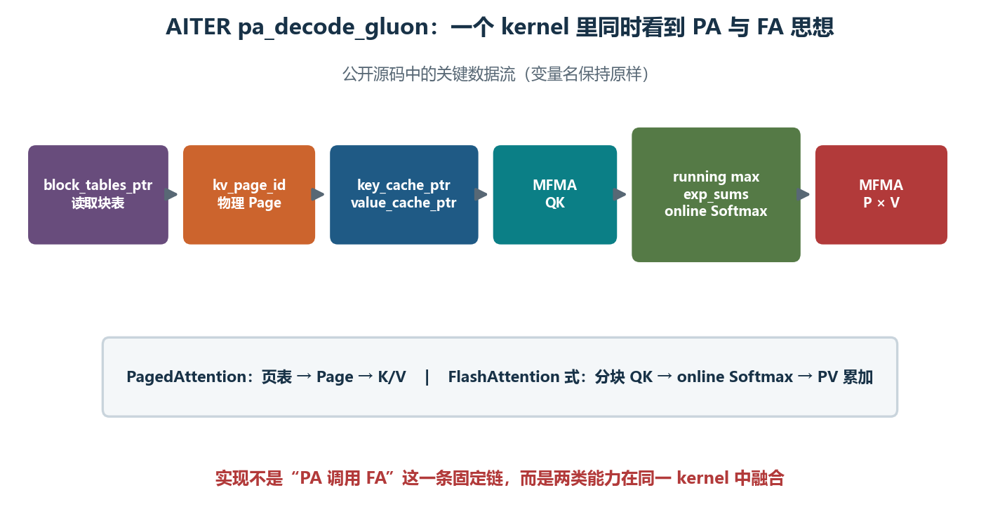

*Source Figure 10. This is not one PA program followed by a separate FA program; the Paged Decode kernel performs addressing, online Softmax, and AMD Instinct matrix scheduling together.*

### FlashInfer occupies the same library layer on NVIDIA

FlashInfer describes itself as **a library and kernel generator for inference**, with common APIs for Attention, GEMM, and MoE.

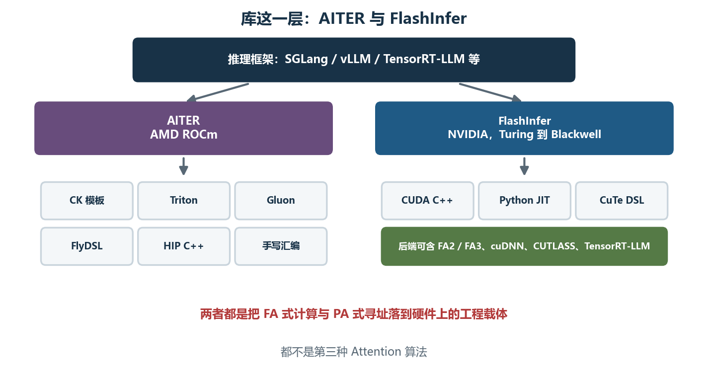

*Source Figure 11. Like AITER, FlashInfer is an engineering vehicle for algorithms and kernels rather than a third Attention algorithm.*

Three boundaries matter.

First, its README explicitly lists several backends, including FlashAttention-2/3, cuDNN, CUTLASS, and TensorRT-LLM. An application may call the FlashInfer Attention API while FA2 or FA3 supplies the lower-level implementation.

Second, FlashInfer uses a block-sparse representation to express multiple KV-cache storage forms through composable formats and JIT-generated kernels. Paged KV becomes one block-sparse case rather than a special exception.

Third, it covers Prefill, Decode, and Append and includes POD-Attention, which fuses Prefill and Decode in one kernel. Thus separate Prefill and Decode kernels are common, not structurally mandatory.

| | AITER | FlashInfer |
|---|---|---|
| Position | Operator library | Library and kernel generator |
| Platform | AMD ROCm | NVIDIA, Turing through Blackwell |
| Internal techniques | CK, Triton, Gluon, FlyDSL, HIP, and assembly | CUDA C++, Python JIT, and CuTe DSL on Blackwell |
| Includes paged Attention | Yes | Yes, represented through block-sparse formats |
| Is itself an Attention algorithm | No | No |

### The implementation language is not the algorithm

FA and PA can be implemented through several languages and frameworks.

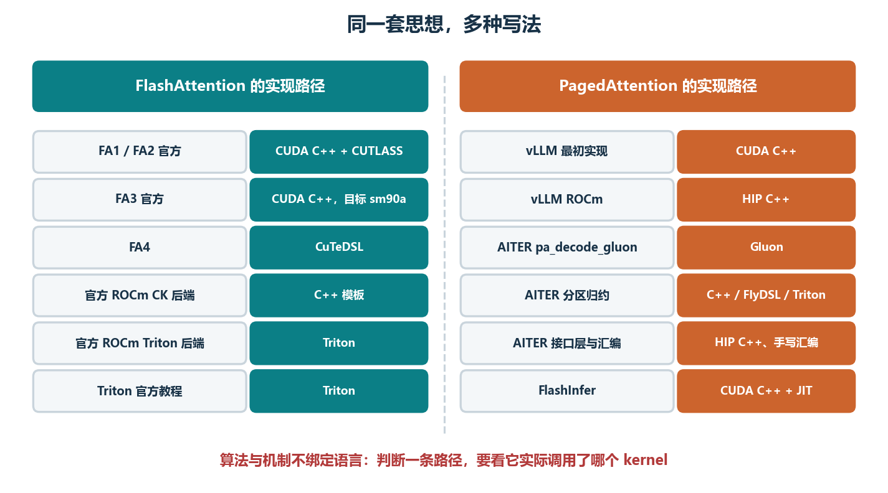

*Source Figure 12. Choosing CUDA, HIP, Triton, Gluon, FlyDSL, a template library, or assembly does not change the mathematical identity of FlashAttention or PagedAttention.*

Public FlashAttention routes include:

| Route | Implementation | Platform |
|---|---|---|
| Official FA1 / FA2 | CUDA C++ with CUTLASS templates | NVIDIA |
| Official FA3 | CUDA C++ with CUTLASS, compiled for `sm90a` | NVIDIA Hopper |
| FA4 | CuTeDSL | NVIDIA Hopper and Blackwell |
| Official ROCm CK backend | C++ Composable Kernel templates | AMD |
| Official ROCm Triton backend | Triton | AMD |
| Official Triton fused-Attention tutorial | Triton | The same source can target NVIDIA and AMD |

Public PagedAttention routes include:

| Route | Implementation | Platform |
|---|---|---|
| Original vLLM paged-Attention kernel | CUDA C++ | NVIDIA |
| vLLM ROCm paged Attention | HIP C++ | AMD |
| AITER `pa_decode_gluon` | Gluon | AMD |
| AITER partition reduction | Selectable C++, FlyDSL, or Triton routes | AMD |
| AITER C++ interface layer | HIP C++ plus Jinja code templates | AMD |
| Highly optimized AITER operators | Hand-written assembly | Selected AMD architectures |
| FlashInfer paged and block-sparse Attention | CUDA C++ plus Python JIT generation | NVIDIA |
| FA3 paged-KV support | CUDA C++ | NVIDIA Hopper |

Two details disprove a language-based taxonomy. In `pa_decode_gluon`, partition reduction tries a C++ interface first, FlyDSL next, and a Triton kernel last; one mathematical step has three interchangeable implementations. Separately, the official FlashAttention repository includes AITER as a submodule, and its FA3 package on ROCm imports an AITER Triton kernel. “FA3 is NVIDIA while AITER is AMD” is therefore too coarse for this path.

#### What the implementation names mean

| Name | Plain-language role | Origin | Status in the cited material |
|---|---|---|---|
| CUDA C++ / HIP C++ | Low-level control of addresses, threads, and synchronization | NVIDIA / AMD | Production |
| CUTLASS / CuTe | C++ templates for layout algebra and matrix primitives | NVIDIA | Production |
| CK (Composable Kernel) | C++ templates that compose kernels from reusable parts | AMD | Production |
| Triton | Python kernel language where authors choose tiles and the compiler handles more layout detail | Community, originating at OpenAI | Production across NVIDIA and AMD |
| Gluon | A lower layer in the Triton compiler stack that returns layout and pipeline control to the developer | Triton project | Production |
| FlyDSL | Makes data layout an algebraic object and generates kernels from it | AMD | Experimental and outside the ROCm distribution |
| Hand-written assembly | Direct instruction scheduling for stable hot paths | Vendor-specific | Production |

CUDA and ROCm are platform foundations, not peers of Triton and FlyDSL. Languages and compilers generate instructions for one of those foundations, which then runs them on hardware.

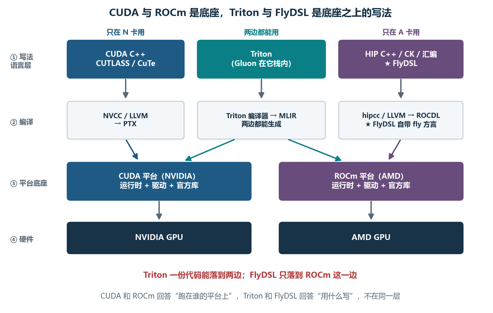

*Source Figure 13. Triton can target both platform foundations; FlyDSL currently lowers through ROCDL and therefore targets ROCm.*

#### The difficult part is where data lives

Attention's mathematical steps are short. The implementation challenge is assigning tens of thousands of threads to memory addresses without losing locality, alignment, or correctness.

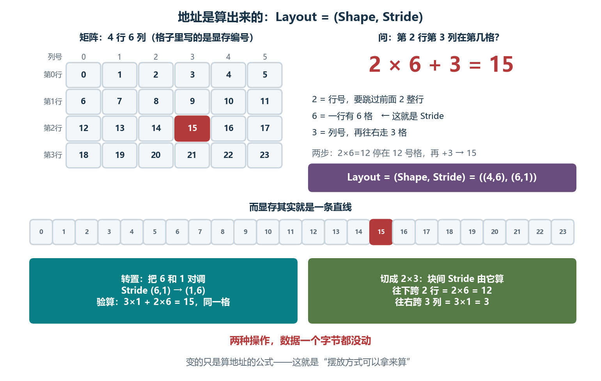

*Source Figure 14. Shape states how large the logical object is; stride states how far an address advances along each dimension.*

For a 4-row by 6-column matrix, zero-based row 2, column 3 has row-major arithmetic `2 × 6 + 3`:

```text
2 × 6 + 3 = 15
↑   ↑   ↑
│   │   └ Column index: move 3 positions right in this row
│   └─── Each row has 6 positions
└─────── Row index: skip the preceding 2 full rows
```

Both indices start at zero. First skip two complete rows: `2 × 6 = 12`; then move three cells right to reach 15. This is the same indexing idea as asking where week 2, day 3 falls in a year, with a 7-day week replaced by a 6-cell row.

The two movement distances, 6 and 1, form the stride. Together with the shape:

```text
Layout = (Shape, Stride) = ((4,6), (6,1))
```

Those four numbers define the mapping. A real kernel nests this calculation across the full tensor, thread-block tile, wave or warp, thread registers, shared-memory conflict avoidance, and matrix-instruction fragment. Each layer adds a Shape/Stride mapping. Change one tile and every downstream index can change; one wrong value can silently produce a wrong result.

#### Computing with layouts does not move bytes

Layout algebra changes address formulas, not stored data.

For a transpose:

```text
Original:  Shape=(4,6)  Stride=(6,1)   row-wise traversal
Transpose: Shape=(6,4)  Stride=(1,6)   column-wise traversal
```

Original coordinate `(2,3)` has offset 15. In the transposed interpretation it is `(3,2)`, and `3×1 + 2×6 = 15`. The same cell remains at the same address.

Dividing the 4×6 layout into four 2×3 blocks yields:

```text
Within-block traversal: Shape=(2,3)  Stride=(6,1)
Between-block jumps:    Shape=(2,2)  Stride=(12,3)
```

The block-to-block distances follow from `2×6=12` rows and `3×1=3` columns. For the upper-right block's local row 0, column 1, block offset `0×12+1×3=3` plus local offset `0×6+1×1=1` gives 4, the original matrix's row 0, column 4.

| Operation | Meaning | 4×6 example |
|---|---|---|
| divide | Split | Divide into four 2×3 blocks and derive block stride `(12,3)` |
| product | Join | Combine an in-block layout and a between-block layout into the whole layout |
| composition | Layer mappings | Apply layout B while interpreting data through layout A |
| partition | Assign | Give each resulting block to a particular thread |

“Computable layout” means a layout can be passed to functions, divided, joined, composed, and partitioned instead of being frozen as hand-written constants.

#### Three authoring approaches and FlyDSL's position

| Approach | How it handles layout | Cost |
|---|---|---|
| CUDA / HIP C++ | Author writes indices explicitly | Every tile change requires re-deriving many indices and is error-prone |
| Triton | Author requests a tile and delegates more layout work to the compiler | Easier, with less direct control |
| FlyDSL | Layout is an explicit programmable object | More design responsibility, but layouts can be transformed and retuned systematically |

Changing a tile from `64×64` to `32×128` in hand-written C++ can require re-deriving every constant in expressions such as `idx = block_y*12 + block_x*3 + ty*6 + tx`. With layout algebra, the author changes the division parameters and derives the constants.

The FlyDSL repository expands the name as **Flexible layout python DSL**: `Fly` comes from “Flexible layout,” not the verb “fly.” It controls how a kernel is authored, not what mathematical operation the model requests.

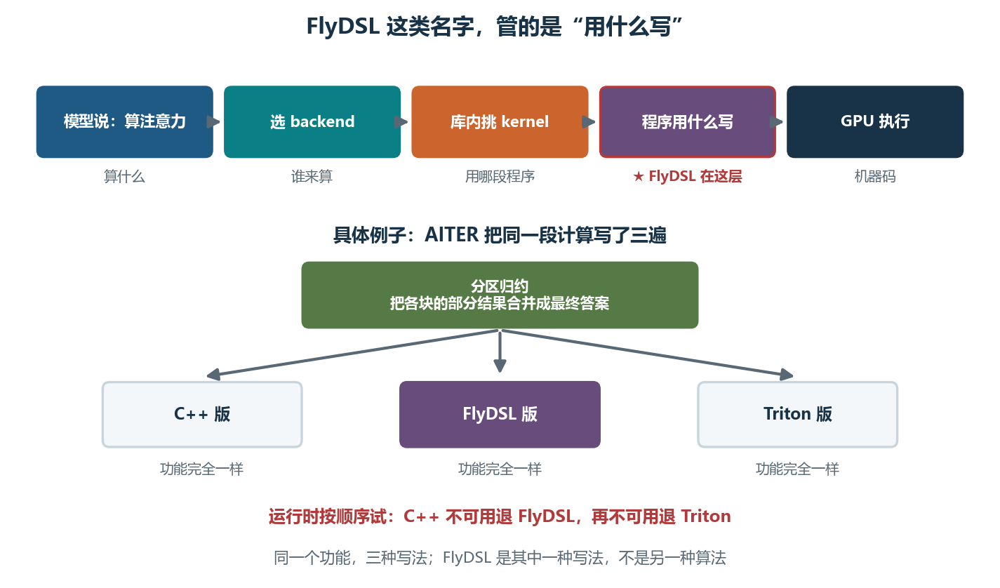

*Source Figure 15. Model semantics select the operation, a framework selects a backend, a library selects a concrete kernel, and a language such as FlyDSL is how that kernel was written.*

NVIDIA's CuTe in CUTLASS supplies the related layout algebra that FlyDSL explicitly credits as inspiration. Describing FlyDSL as a roughly analogous ROCm-side Python tool is an interpretation, not wording asserted by AMD.

#### Why Triton is not the only answer

Most AITER kernels can and do use Triton. Lower-level control becomes valuable for the final performance margin: deliberately skewing data to avoid bank conflicts, matching the operand form required by a matrix instruction, or explicitly overlapping movement and compute.

Three observations support that boundary. Triton itself created Gluon to expose layout and pipeline control. The fastest cited Attention generations use CUDA/CUTLASS for FA3 and CuTeDSL for FA4 rather than pure Triton. In AITER's partition-reduction sequence, Triton is the fallback after C++ and FlyDSL.

| Workload | Typical route | Reason |
|---|---|---|
| Most operators | Triton | Productive, sufficiently fast, and portable across NVIDIA and AMD |
| A few dominant hotspots such as GEMM, Attention, and MoE | Gluon, CuTe, FlyDSL, or assembly | Final performance requires explicit layout control |

The system-level payoff equals the operator's time share multiplied by how much it improves. A kernel occupying 40% of time and improving 30% can improve the whole workload by 12%; one occupying 0.5% cannot improve the whole workload by more than 0.5%, even with a tenfold kernel speedup.

GEMM, Attention, and MoE are worth deeper control because they move and compute substantial data: GEMM dominates each layer; long-context Attention rereads tens of gigabytes of KV in addition to two matrix products; MoE combines many small matrix products with token routing, itself a data-placement problem. Normalization, activation, and addition usually make one pass over data and offer less layout leverage.

Optimal layout also changes with hardware generation as matrix instructions and cache structures change. The purpose of layout tools is not aesthetic code. It is making repeated retuning tractable.

#### Gluon and FlyDSL are not alternatives for an entire file

The main `pa_decode_gluon` kernel is written in Gluon. FlyDSL appears only in one reduction segment and is one of three candidates. Each serves a local role.

| | Triton | Gluon | FlyDSL |
|---|---|---|---|
| Stack position | Triton stack | Lower-level entry within the Triton stack | Independent MLIR `fly` dialect |
| Abstraction | Request a tile; compiler owns more layout | Developer specifies layout and pipeline | Developer computes with layout algebra |
| GPU targets | NVIDIA and AMD | Follows Triton targets | AMD GPUs only |

Gluon opens lower-level control inside the Triton stack. FlyDSL builds a separate route centered on algebraic layouts and follows the CuTe design direction. The correctness distinction is important: declaring a complete layout leaves an incorrect declaration capable of silently returning bad values; deriving values from a division or composition reduces the number of manually synchronized constants.

A filename containing `gluon` does not prove every segment uses Gluon.

#### Current maturity boundary

- FlyDSL's official disclaimer calls it **experimental and not part of the official ROCm distribution**. Its test table shows GEMM and MoE as more mature while **PagedAttention and FlashAttention remain under performance tuning**.
- The `divide` spelling above is explanatory; exact function names and signatures must come from the current repository.
- The Gluon/FlyDSL comparison reflects the emphasis of their public materials, not an exhaustive API-by-API comparison. AMD has not publicly explained why it did not simply extend Gluon.

The multiple candidate paths in AITER look like parallel engineering options resolved by measurement, not a public declaration that one route has won. Triton remains the fallback. Runtime kernel names and interfaces, rather than project-family labels, are the authoritative evidence.

### What “backend” means in an Attention report

In `--attention-backend aiter`, backend means a concrete implementation behind a common runtime interface. The Attention operation itself does not acquire a web-style frontend and backend. The software stack uses the word at several layers:

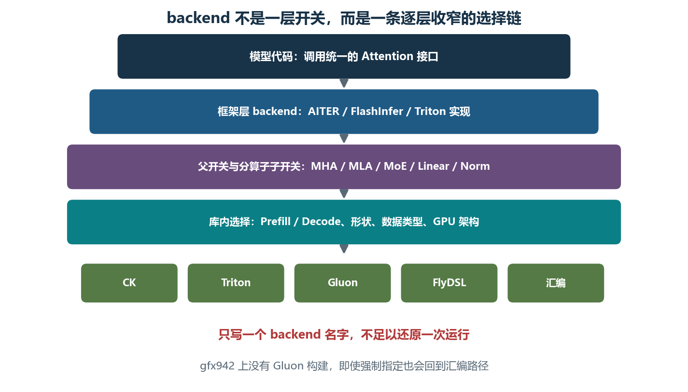

*Source Figure 16. Framework backend selection, compiler frontend/backend, and a library's internal backend are separate decisions.*

| Meaning | Selector | Example |
|---|---|---|
| Framework Attention backend | Inference framework | AITER, FlashInfer, or a Triton implementation |
| Compiler frontend and backend | Compiler toolchain | Triton Python frontend generates NVIDIA or AMD machine code |
| Library-internal backend | Operator library | FlashInfer lists FA2/FA3, cuDNN, CUTLASS, and TensorRT-LLM backends |

Model code usually calls one Attention interface. Framework configuration and then library-internal dispatch decide which program executes.

#### Selecting a backend does not select one kernel

In vLLM's ROCm configuration, `VLLM_ROCM_USE_AITER` is documented as a parent switch. It has per-operator children:

```text
VLLM_ROCM_USE_AITER_MHA        Multi-Head Attention
VLLM_ROCM_USE_AITER_MLA        Multi-Latent Attention
VLLM_ROCM_USE_AITER_MOE        Mixture of Experts
VLLM_ROCM_USE_AITER_LINEAR     Linear layers and GEMM
VLLM_ROCM_USE_AITER_RMSNORM    Normalization
VLLM_ROCM_USE_AITER_UNIFIED_ATTENTION
```

A deployment can use AITER Attention without AITER MoE, or the reverse.

Dispatch continues inside the library. `VLLM_ROCM_AITER_MLA_ASM_PADDING` accepts `auto`, `gluon`, or `asm`: `auto` uses Gluon on architectures with a Gluon build and assembly otherwise; `gluon` forces Gluon; `asm` forces assembly. The official comment states that gfx942 has no Gluon build, so it uses the assembly path regardless of this setting.

The full selection chain is:

```text
The model calls the unified Attention interface
        ↓
The framework selects an implementation from the backend configuration
        ↓
Parent and per-operator child switches determine which operators actually use AITER
        ↓
The library selects a kernel by Prefill / Decode, shape, dtype, and GPU architecture
        ↓
The executed program may be written in CK, Triton, Gluon, FlyDSL, or assembly
```

A reproducible report therefore needs the per-operator switches, GPU architecture, and loaded-kernel evidence in addition to the backend name.

#### What “frontend” can mean

The ecosystem uses frontend for several unrelated layers, none of which is an “Attention frontend”:

| Phrase | Actual object | Its counterpart |
|---|---|---|
| SGLang frontend language | Domain-specific language for writing LLM programs | Runtime execution engine |
| vLLM frontend | API-server process receiving HTTP requests | Backend engine process |
| Compiler frontend | Language used to author a kernel | Compiler backend generating machine code |
| Attention call site | The common call in model code | Implementation selected by `--attention-backend` |

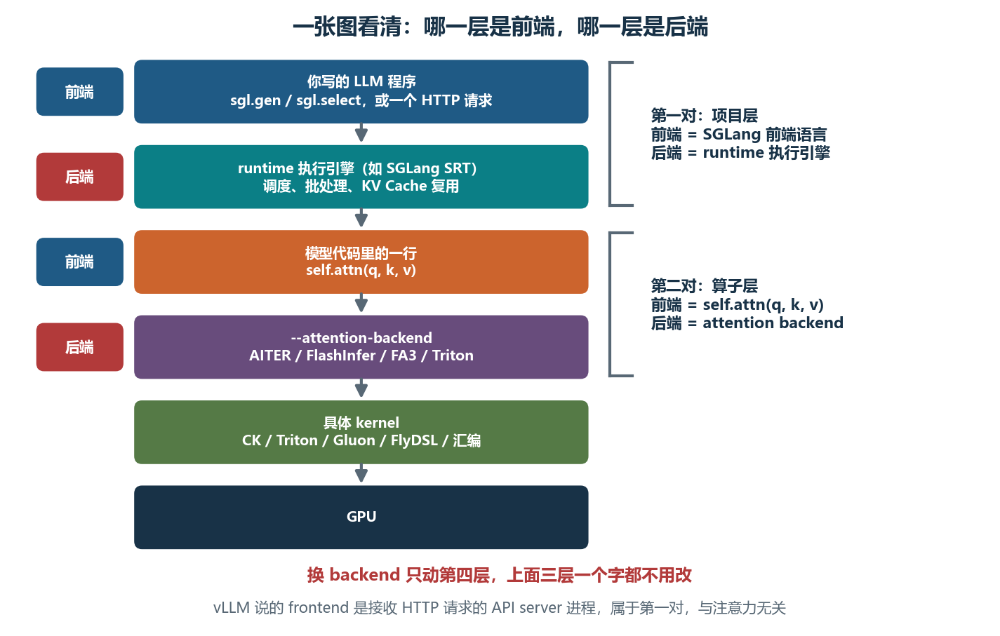

*Source Figure 17. SGLang's language frontend and vLLM's API-server frontend both sit above runtime Attention backend selection.*

SGLang's paper describes a frontend language plus a runtime: the language supplies programming primitives for generation and parallel control, while the runtime supplies execution optimizations such as RadixAttention. `--attention-backend` is a parameter inside that runtime.

vLLM uses the term for process architecture. Its comments say `VLLM_RPC_BASE_PATH` supports communication between the frontend API server and backend engine process, while `VLLM_USE_RUST_FRONTEND` replaces the Python API-server process with a Rust binary. Neither determines the Attention kernel.

The interface paired with the implementation backend is simply the model call. A vLLM Llama implementation illustrates the point:

```python
# Declare a unified Attention layer
self.attn = attn_cls(self.num_heads, self.head_dim, self.scaling, ...)

# Execution requires only this line
attn_output = self.attn(q, k, v)
```

This call passes only `q, k, v`. There is no AITER, Triton, page table, or kernel name at this call site. Backend replacement leaves the call unchanged. Because there is only one call entry rather than a selectable peer, configuration documentation names the backend but need not invent an “Attention frontend.” The useful runtime question is: **which concrete kernel did this backend select?**

### Comparison table

| | FlashAttention | PagedAttention | Operator library such as AITER or FlashInfer |
|---|---|---|---|
| What it is | I/O-aware exact Attention algorithm | Attention algorithm and execution interface for paged KV | Collection and common entry point for high-performance kernels |
| Main problem | Reduce movement and full-matrix intermediates | Manage, locate, and compute with noncontiguous historical K/V | Supply callable kernels to a framework |
| Core inputs | Q/K/V | Q, paged K/V, page table, and sequence lengths | Depends on the selected operator |
| Manages KV cache | No | Closely coordinates with the cache allocator | Supplies relevant kernels; framework coordinates cache policy |
| Performs Attention | Yes | Yes | Its Attention kernels do |
| Is an algorithm | Yes | Yes | No |
| Can coexist | Can fuse with paged addressing | Can use FA-style computation | Can expose both FA- and PA-related implementations |

### Common misconceptions

| Misconception | Correct boundary |
|---|---|
| PA and FA are mutually exclusive Attention choices | They optimize different concerns and can fuse in one kernel. |
| PA only manages memory | A paged kernel reads K/V through the page table and completes Attention. |
| FA is specifically for KV cache | FA optimizes general Attention, including training without historical KV. |
| Every FA kernel understands a page table | The interface must expose paging inputs or a gather is required. |
| AITER is an Attention algorithm | It is a multi-operator library. |
| FlashAttention has one version | Four generations are cited; FA3 depends on Hopper and FA4 uses CuTeDSL. |
| FA3 belongs to NVIDIA and AITER belongs to AMD | The cited FA3 ROCm package imports an AITER Triton implementation. |
| FA or PA must use one language | CUDA, HIP, Triton, Gluon, FlyDSL, CK templates, and assembly can implement them. |
| FlyDSL is a new Attention optimization | It is a kernel-authoring language, not an operation. |
| CUDA/ROCm and Triton/FlyDSL are peer choices | CUDA and ROCm are platforms; Triton and FlyDSL are authoring routes above them. |
| Dividing or composing a layout moves data | It changes an address formula; copy instructions move bytes. |
| Triton eliminates the need for lower layers | Triton provides Gluon, while the cited peak Attention routes use lower control. |
| A file named Gluon contains only Gluon | The cited main kernel uses Gluon but its partition reduction has three candidate routes. |
| Operator libraries are AMD-specific | FlashInfer occupies the same library layer on NVIDIA. |
| Selecting FlashInfer excludes FlashAttention | FlashInfer explicitly includes FA2/FA3 backends. |
| Attention itself has a frontend and backend | The software stack has those boundaries; the mathematical operation does not. |
| A backend name is enough to reproduce a run | Per-operator switches, GPU architecture, and loaded-kernel logs are also required. |
| Replacing a backend changes model semantics | Exact Attention preserves the mathematical result within the stated numerical-equivalence contract. |

### Four statements to retain

**FlashAttention:** Given Q/K/V, use tiling and online Softmax to reduce data movement and intermediate storage.

**PagedAttention:** Given historical K/V scattered across physical pages, use a page table to locate and consume it directly.

**AITER:** Package high-performance PA, FA, GEMM, MoE, and related kernels for AMD ROCm inference frameworks.

**FlashInfer:** Serve a comparable library role on NVIDIA and represent multiple KV-cache forms through block-sparse formats.

The compact mental model is: Q, K, and V are the ingredients; Attention is the dish; backend and kernel choices describe the kitchen.

### Public sources

1. Original FlashAttention paper  
   https://arxiv.org/abs/2205.14135

2. Original PagedAttention / vLLM paper  
   https://arxiv.org/abs/2309.06180

3. AITER repository  
   https://github.com/ROCm/aiter

4. AITER documentation  
   https://rocm.github.io/aiter/

5. AITER Gluon Paged Decode source  
   https://github.com/ROCm/aiter/blob/main/aiter/ops/triton/gluon/pa_decode_gluon.py

6. vLLM repository corresponding to the PagedAttention paper  
   https://github.com/vllm-project/vllm

7. FlashAttention-3 paper  
   https://arxiv.org/abs/2407.08608

8. Official FlashAttention-3 blog  
   https://tridao.me/blog/2024/flash3/

9. FlashAttention repository  
   https://github.com/Dao-AILab/flash-attention

10. Official Triton fused-Attention tutorial  
    https://triton-lang.org/main/getting-started/tutorials/06-fused-attention.html

11. FlashInfer paper  
    https://arxiv.org/abs/2501.01005

12. FlashInfer repository  
    https://github.com/flashinfer-ai/flashinfer

13. vLLM environment-variable documentation, including ROCm AITER switches  
    https://docs.vllm.ai/en/latest/configuration/env_vars.html

14. FlyDSL repository  
    https://github.com/ROCm/FlyDSL
<!-- SOURCE-END-EN id=04 -->

---

<!-- SOURCE-BEGIN-EN id=05 -->
## Source #5: Tensor Parallelism and Expert Parallelism Split Different Things

> Tensor Parallelism (TP) divides one large computation among ranks. Expert Parallelism (EP) distributes many independent experts. The partition determines token movement, communication primitives, and bottlenecks; TP and EP are not competing switches.

### Follow one token through a Mixture-of-Experts layer

A token entering a Mixture-of-Experts (MoE) Transformer layer traverses two broad stages:

```text
Token hidden state
        ↓
Attention: read Q/K/V and compute Attention
        ↓
Router: select top-k experts for the token
        ↓
Experts: each selected expert processes the token
        ↓
Weight and combine the outputs from multiple experts
```

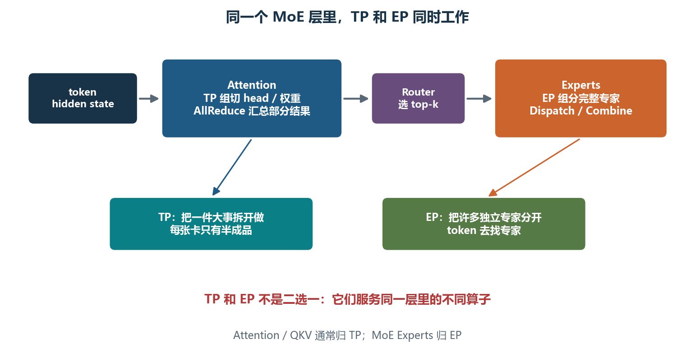

*Source Figure 1. Attention naturally fits TP because ranks cooperate on one matrix computation; independent experts naturally fit EP because each expert can reside on a different rank.*

The common arrangement is:

```text
Within one layer, Attention uses TP and MoE Experts use EP.
```

Both forms of parallelism can operate in the same layer.

### TP partitions one computation

Tensor Parallelism divides a weight matrix along a dimension and assigns each shard to a rank. Every rank computes only part of the same matrix operation.

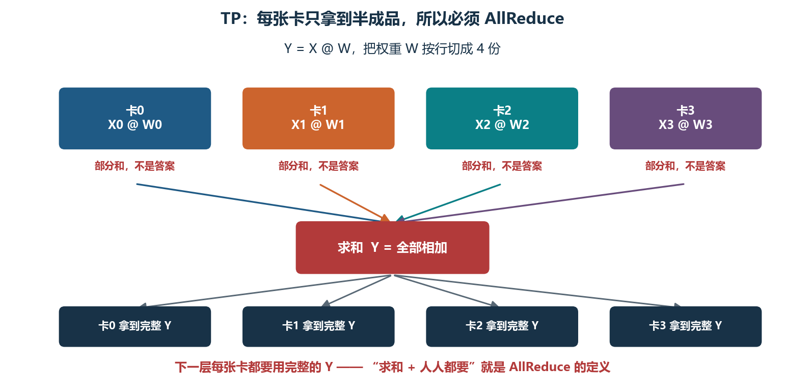

*Source Figure 2. Each TP rank produces a partial result for the same request.*

Start with:

```text
Y = X @ W
```

After splitting $W$ four ways:

```text
Y = X₁@W₁ + X₂@W₂ + X₃@W₃ + X₄@W₄
     rank 0    rank 1    rank 2    rank 3
```

Each result is one partial sum, not the final $Y$. Before the next layer can consume it, ranks must add the partial sums and make the result available where needed. That mathematical structure leads to **AllReduce**: reduce by summation, then distribute the result to every participating rank.

### EP distributes complete experts

Expert Parallelism starts from the many independent experts already present in an MoE layer. Rather than splitting one expert, it assigns complete experts to different ranks.

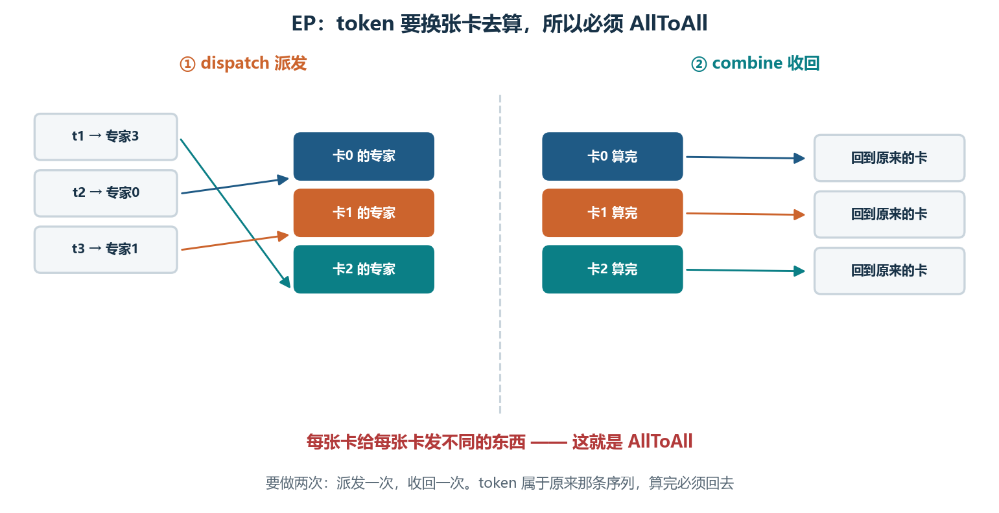

*Source Figure 3. A token moves to the ranks that own its selected experts, then expert outputs return for combination.*

If token `t1` begins on rank 0 and the Router selects experts 3 and 7:

```text
t1 starts on rank 0
   ├─ One copy goes to the rank that owns expert 3
   └─ One copy goes to the rank that owns expert 7
```

Communication happens twice:

```text
dispatch: send the token to the selected experts
   ↓ experts compute
combine: return and merge the expert results
```

Every source rank can send different token counts to every destination and receive different counts in return. That dynamic routing has the data shape of **AllToAll**: each rank sends different data to different peers.

### What top-k and `kA` mean

In `top-k`, `k` is the number of experts selected for each token.

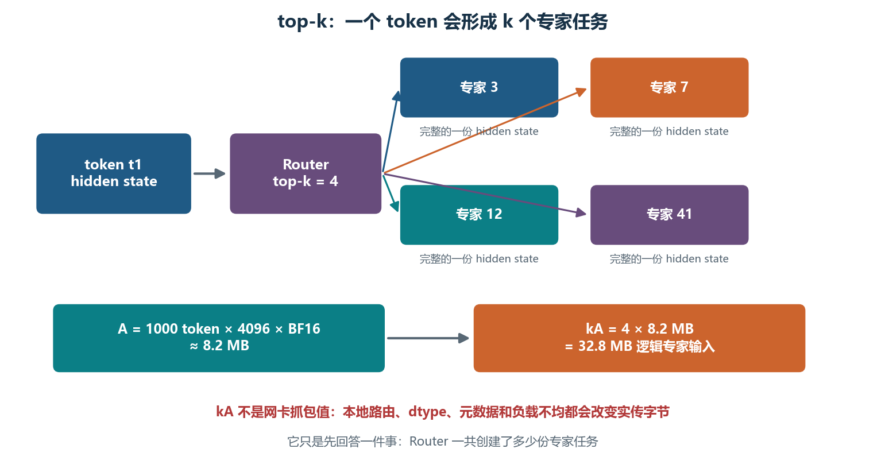

*Source Figure 4. With 64 total experts, top-k determines how many complete expert tasks each token creates.*

```text
top-k = 1: each token selects only 1 expert
top-k = 2: each token selects 2 experts
top-k = 8: each token selects 8 experts
```

For `top-k=4`, one hidden state creates four logical expert tasks. A local expert need not use the network, and communication libraries can pack and fuse transfers.

Let `A` be the total hidden-state bytes in a token batch. Then `kA` is the batch's **logical total expert-input payload**. For example:

```text
token count = 1000
hidden   = 4096
dtype    = BF16, 2 bytes per value

A = 1000 × 4096 × 2
   = 8,192,000 bytes
  ≈ 8.2 MB
```

With `top-k=4`:

```text
kA = 4 × 8.2 MB = 32.8 MB
```

This means 1,000 tokens create 4000 expert assignments. **It does not mean that a packet capture must show exactly 32.8 MB.** Local routes do not leave a device; dispatch may use FP8 while combine uses BF16; routing metadata, packing, and load imbalance also change physical traffic. `kA` is a logical accounting quantity, not a wire measurement.

### TP and EP compared

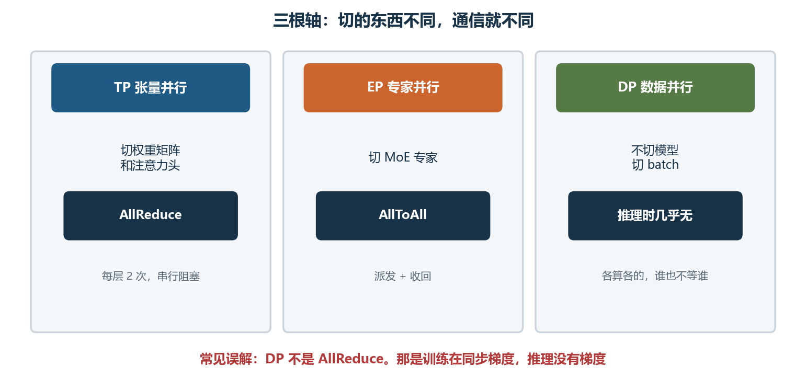

*Source Figure 5. The primitive follows from what is partitioned and what each rank produces.*

| Dimension | Tensor Parallelism | Expert Parallelism |
|---|---|---|
| Partitioned object | One weight matrix or a set of Attention heads | Many independent experts |
| Per-rank ownership | One shard of the same operator | Several complete experts |
| Token movement | The TP group cooperates on the same token batch | Router sends tokens to expert owners |
| Local result | Partial result that must be reduced | Complete expert output that must return for weighted combination |
| Typical primitive | AllReduce | Dispatch/combine-shaped AllToAll |
| Main difficulty | Frequent synchronization and latency | Dynamic routing, imbalance, bandwidth, and latency |
| Common topology | Usually inside a fast intra-node fabric | Can span nodes, with substantial engineering cost |

```text
TP = Split one computation across ranks; its partial results must be combined.
EP = Distribute separate computations; data must move to the rank responsible for each one.
```

### Two communication primitives

#### AllReduce: sum, then make the result available to all ranks

For a tensor of size `A`, a bandwidth-efficient ring AllReduce is commonly accounted per rank as:

```text
Bytes sent per rank ≈ 2A × (P-1) / P
Each rank simultaneously receives the same amount of data
```

Here `P` is the number of ranks. The factor of two comes from two phases:

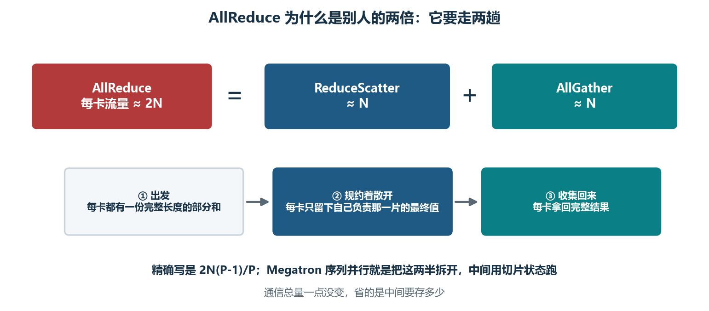

*Source Figure 6. One phase reduces and scatters shards; the second gathers the complete result.*

```text
AllReduce = ReduceScatter + AllGather
```

#### AllToAll: each rank sends different data to each peer

If one rank's packed send buffer has size `A` and is distributed uniformly across `P` ranks:

```text
Remote bytes sent per rank ≈ A × (P-1) / P
```

For equal input-buffer sizes, the common ring AllReduce send accounting is about twice an AllToAll. That does **not** prove total TP traffic exceeds total EP traffic, because top-k can multiply EP's logical payload.

### Compare one primitive before comparing one layer

#### One invocation with equal payloads

```text
One ring AllReduce: approximately 2A × (P-1)/P
One AllToAll:       approximately  A × (P-1)/P
```

With one equal-sized invocation, AllReduce is heavier under this accounting.

#### An explicit teaching model for one layer

Now add invocation count and top-k under five assumptions:

1. A classic dense TP block performs two AllReduce operations.
2. EP performs one dispatch and one combine.
3. Dispatch and combine use the same bytes per element.
4. Routing is uniform; local experts and metadata are ignored.
5. Both sides start from a base activation size `A`.

Per-rank send volume is then approximated by:

```text
TP: 2 invocations × 2A × (P-1)/P = 4A × (P-1)/P
EP: 2 invocations × kA × (P-1)/P = 2kA × (P-1)/P
```

After canceling the shared `(P-1)/P` factor:

```text
EP / TP = k / 2
```

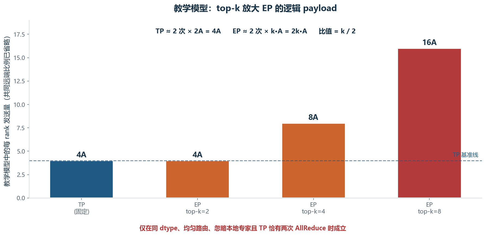

*Source Figure 7. This ratio is derived from the listed assumptions, not measured performance and not a universal MoE law.*

| top-k | EP ÷ TP under this teaching model |
|---:|---:|
| 1 | 0.5× |
| **2** | **1×, equal** |
| 4 | 2× |
| 8 | 4× |

The crossover is $k=2$ because the single-invocation AllReduce coefficient is 2, the AllToAll coefficient is 1, and EP multiplies payload by $k$:

```text
The per-invocation AllReduce coefficient is 2
The per-invocation AllToAll coefficient is 1
The EP payload is additionally multiplied by k

2kA = 4A  →  k = 2
```

#### Why `k/2` is not a general performance equation

Real systems violate the simplifying assumptions:

- TP and EP coexist inside an MoE block rather than replacing one another.
- The number of TP AllReduce operations depends on partitioning and sequence parallelism.
- Dispatch may use FP8 while combine uses BF16.
- Local experts generate no remote traffic.
- Nonuniform top-k routing can create a hot rank.
- Communication can overlap GEMM.
- AllToAll implementations can fuse permutation, quantization, and combine reduction.

The engineering comparison is therefore:

```text
Actual remote bytes per layer + per-collective latency + post-overlap critical-path time
```

The isolated `4A` and `2kA` terms are insufficient.

### TP traffic per rank quickly approaches an asymptote

Substituting rank count `P` into `2A(P-1)/P` gives:

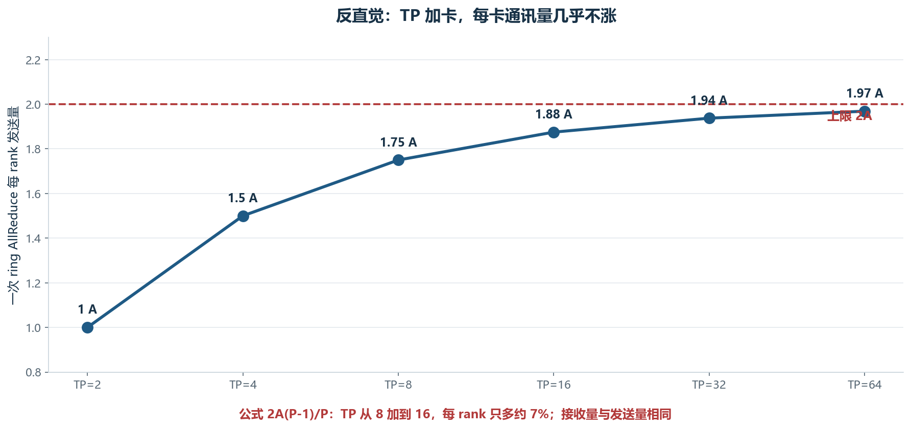

*Source Figure 8. Expanding TP from 8 to 16 increases this per-rank byte accounting by only about 7%, but synchronization frequency and tail latency still make cross-node TP difficult.*

| TP ranks `P` | Send volume per rank for one ring AllReduce |
|---:|---:|
| 2 | 1.00 A |
| 4 | 1.50 A |
| 8 | 1.75 A |
| 16 | 1.875 A |
| Infinity | Approaches 2A |

TP's cross-node problem is not unbounded byte growth. Collectives recur on the critical path of many layers, every rank must reach dependency points, startup latency and synchronization jitter dominate small messages, and one slow rank delays the group. Frequent synchronization and tail latency are often the controlling costs.

### Why pay EP communication cost?

Without EP, expert GEMMs can become narrow and fragmented.

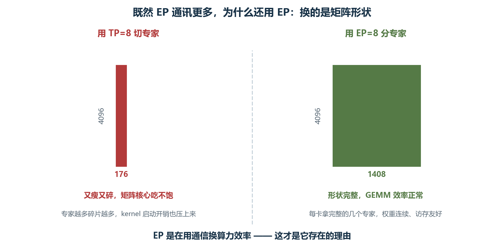

*Source Figure 9. Full expert matrices improve weight locality and matrix shape even though tokens must move to expert owners.*

Take illustrative dimensions:

```text
hidden = 4096
intermediate per expert = 1408
```

Splitting one expert by TP=8 produces:

```text
[tokens, 4096] @ [4096, 176]
                           ↑ 1408 ÷ 8
```

The matrix is narrow. Small or imbalanced token counts make it harder to occupy matrix units efficiently. With EP=8:

```text
[tokens received by this rank, 4096] @ [4096, 1408]
```

Each rank retains complete experts and more coherent weights. EP therefore:

```text
Trade communication for complete experts, weight capacity, and better GEMM shapes.
```

Large MoE deployments commonly keep Attention on TP, place experts primarily through EP, and add expert-internal TP only if an expert remains too large.

### TP commonly stays within a node; EP can span nodes

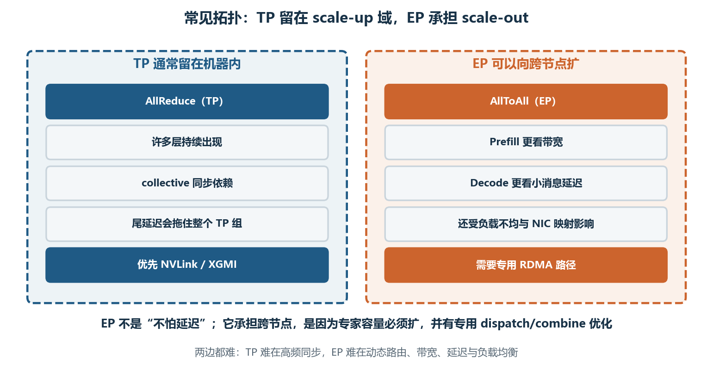

*Source Figure 10. Cross-node EP is possible, but it is not latency-insensitive.*

TP groups commonly remain within an NVLink or XGMI domain, while EP expands across nodes. For EP, Prefill has many tokens and tends toward a bandwidth bottleneck; Decode has few tokens and small messages, making latency critical. AllToAll also reacts to routing imbalance, network-interface mapping, and congestion.

Specialized EP libraries therefore provide high-throughput routes for large Prefill or training messages and low-latency routes for Decode. TP stays local because synchronization repeats throughout the model. EP spans nodes because expert count and capacity must expand, with software specialized for Remote Direct Memory Access (RDMA), low-precision transfer, and compute overlap. Both are difficult for different reasons.

### How TP and EP coexisted in one real project

In one eight-GPU-per-node MoE inference project, the stable reproducible baseline was:

```text
Attention TP = 8
local EP     = 8
DP           = 1
```

Eight GPUs cooperated on Attention, while experts were also distributed across those same GPUs. TP and EP used different communication groups for different operators. A second reference topology kept `attention TP=8` and used more DP groups to expand global EP to 16 or 32.

The reusable pattern is:

```text
Pin Attention TP to the value supported by the hardware and model;
to expand model capacity and concurrency, scale along DP / global EP.
```

#### Historical cross-node EP failure signature

On the older software stack, local EP=8 worked on one node, while SGLang + MI300X + CX7 using the cross-node MORI path could hang or deadlock under concurrent requests. Disabling the MoE All-to-All backend allowed requests to run, narrowing the differential to dispatch/combine.

This is a dated, version-scoped failure signature. The current MORI README lists MI300X + CX7 dispatch and combine bandwidth and latency for EP8, EP16, and EP32 and supplies cross-node correctness tests. The historical incident must not be restated as “AMD has no A2A today.”

The diagnostic sequence that remains valid is:

```text
Validate single-node first → minimum cross-node request → increase concurrency → disable specialized A2A for a differential test
```

### EP does not partition Attention heads or KV

The common ownership split is:

```text
TP → Attention heads, QKV projection, Attention output
EP → MoE Experts
```

EP changes which expert receives a token. It does not change KV-head ownership.

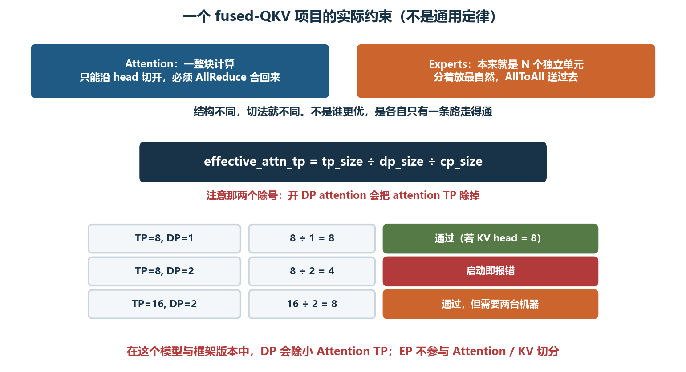

*Source Figure 11. DP and Context Parallelism can subdivide an Attention TP domain in the cited runtime; EP is not part of that formula.*

One model-and-framework version required effective Attention TP to equal 8 for a fused-QKV model. The framework computed:

```text
effective_attn_tp = tp_size // dp_size // attn_cp_size
```

| Configuration | Effective Attention TP | Result |
|---|---:|---|
| TP=8, DP=1, CP=1 | 8 | Pass |
| TP=8, DP=2, CP=1 | 4 | Startup validation fails |
| TP=16, DP=2, CP=1 | 8 | Pass, with a larger global TP domain |

For this model and framework, DP or Context Parallelism (CP) grouping reduces the effective Attention TP. EP does not. This is not a universal formula; other models may permit KV replication or use another QKV layout. Every external claim must retain the exact configuration, framework version, and kernel path.

#### “KV stays in the server” also needs a scope

Steady-state Attention commonly keeps rank-owned KV within the node-local TP group while EP sends only current-layer hidden states. Prefill/Decode (PD) disaggregation is an explicit exception: once Prefill completes, a point-to-point RDMA route such as Mooncake or MORI-IO transfers KV to a Decode node.

```text
Steady-state Attention: KV remains on its owning rank
PD handoff:              KV crosses nodes once
```

That PD KV transfer is a separate point-to-point data path, **not EP AllToAll**.

### Why specialized libraries such as DeepEP and MORI still matter

Current NCCL documentation lists `AlltoAll`, `Gather`, and `Scatter` as formal collectives. It is obsolete to claim that DeepEP exists because NCCL has no AllToAll.

A generic AllToAll exchanges fixed per-peer chunks:

```text
Exchange each rank's fixed-size chunk with every other rank.
```

The MoE dispatch/combine data plane must also handle top-k routing, unequal destination counts, token permutation and inverse permutation, expert alignment and padding, FP8 dispatch and BF16 combine, weighted reduction, cross-node RDMA and multiple network interfaces, communication/GEMM overlap, and separate high-throughput Prefill and low-latency Decode strategies.

DeepEP describes itself as a high-throughput, low-latency dispatch/combine GPU-kernel library for EP. MORI-EP provides intra-node and cross-node dispatch/combine, while MORI-IO is a separate point-to-point KV-transfer library.

Their value is not inventing AllToAll. It is:

```text
Turn the entire MoE data plane after the Router into one high-performance pipeline.
```

### Where DP and CP fit

#### Inference DP is not gradient AllReduce

Training DP reduces gradients. Inference has no gradient synchronization. Ordinary inference DP runs replicated models on different requests with little interaction. DP Attention can still change Attention-group construction and therefore enters the cited `tp // dp // cp` formula.

#### A parallelism name does not determine its primitive

Context or sequence-parallel implementations use different communication:

| Implementation | Common communication |
|---|---|
| Megatron sequence parallel | AllGather + ReduceScatter |
| Ulysses | AllToAll |
| Ring Attention | Ring Send / Recv |
| SGLang Attention CP path inspected for this project | `cp_all_gather_into_tensor` |

The implementation source, not the parallelism label, determines the primitive.

### Common communication actions used in this chapter

It is inaccurate to say that communication has exactly nine primitives. The Message Passing Interface (MPI) includes Barrier, AllToAllv, neighborhood collectives, and other variants. The following are common foundation actions in GPU inference:

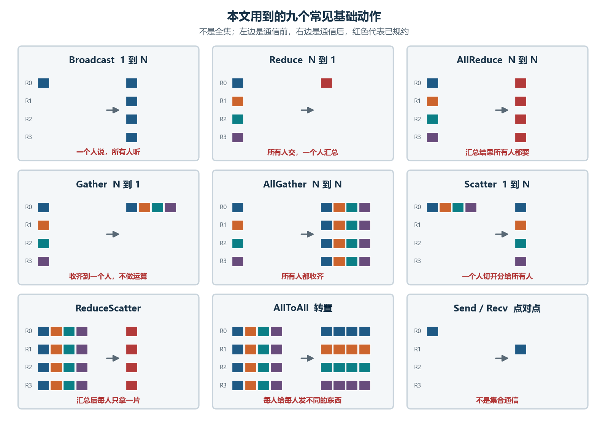

*Source Figure 12. This is a practical subset, not an exhaustive taxonomy.*

| Primitive | Plain-language behavior | Reduction? |
|---|---|---|
| Broadcast | One rank sends the same value to every rank | No |
| Reduce | All ranks aggregate into one rank | Yes |
| AllReduce | Aggregate, then make the result available to every rank | Yes |
| Gather | Collect all rank shards at one rank | No |
| AllGather | Every rank receives every shard | No |
| Scatter | One rank sends a different shard to each rank | No |
| ReduceScatter | Reduce, then retain one result shard per rank | Yes |
| AllToAll | Every rank sends a different shard to every rank | No |
| Send / Recv | Point-to-point communication between two ranks | No |

### Runtime troubleshooting order

| Symptom | First check |
|---|---|
| Startup reports an Attention TP mismatch | Model head configuration, QKV layout, and actual TP/DP/CP group |
| Single-node EP works but cross-node hangs | A2A backend, network-interface mapping, RDMA, and concurrency differential |
| Decode latency rises sharply | Small-message A2A latency, routing imbalance, and slow ranks |
| Prefill throughput stalls | A2A bandwidth, dispatch dtype, and communication/computation overlap |
| Time per output token degrades after cross-node TP | Collective count, tail latency, and topology mapping |
| A parameter appears to have no effect | Effective runtime configuration and loaded path, not command-line appearance |

Three high-value controlled comparisons are:

```text
TP: intra-node vs cross-node
EP: specialized A2A backend on vs off
Routing: low top-k vs high top-k
```

Change one variable at a time so the result can identify the bottleneck.

### Common misconceptions

| Misconception | Correct boundary |
|---|---|
| Choose TP or EP | A single MoE layer commonly uses both. |
| AllReduce is heavier per call, so TP always communicates more | Per-call coefficient and per-layer payload are separate accounts. |
| `kA` is the exact network byte count | It is logical expert-input volume; locality, dtype, metadata, and packing change physical traffic. |
| EP always equals TP at top-k=2 | Equality holds only under the stated teaching assumptions. |
| MoE compute is sparse, so communication is also sparse | Sparse routing saves compute, while every token still creates $k$ expert assignments. |
| Cross-node EP is insensitive to latency | Decode EP is highly sensitive to small-message latency. |
| EP partitions Attention heads and KV | EP partitions experts; Attention and KV use another parallel group. |
| TP is universally capped by KV-head count | The limit depends on model, QKV layout, checkpoint, framework, and kernel. |
| NCCL has no AllToAll | Current documentation exposes `ncclAlltoAll()`. |
| Generic AllToAll eliminates DeepEP or MORI | MoE still needs routing, permutation, low precision, reduction, RDMA, and overlap. |
| PD KV transfer is EP communication | It is a separate point-to-point KV-transfer path. |

### Five statements to retain

1. TP partitions one large computation, so each rank holds a partial result; EP distributes complete experts, so tokens move to expert owners.
2. That structure leads TP to AllReduce and EP to dispatch/combine-shaped AllToAll.
3. AllReduce is heavier for one equal-size invocation; per-layer traffic also depends on top-k, dtype, invocation count, and local routing.
4. TP and EP coexist in MoE models, so `4A` and `2kA` are not a universal either-or performance formula.
5. The engineering metrics are actual remote bytes, collective latency, load imbalance, and post-overlap critical-path time.

Communication primitives are consequences of data partitioning, not arbitrary selections.

### Public sources

1. NCCL collectives, including current Alltoall / Gather / Scatter documentation  
   https://docs.nvidia.com/deeplearning/nccl/user-guide/docs/usage/collectives.html

2. NCCL point-to-point communication  
   https://docs.nvidia.com/deeplearning/nccl/user-guide/docs/usage/p2p.html

3. RCCL repository  
   https://github.com/ROCm/rccl

4. Megatron-LM, Tensor Parallelism  
   https://arxiv.org/abs/1909.08053

5. Megatron sequence parallelism  
   https://arxiv.org/abs/2205.05198

6. GShard, MoE and top-2 routing  
   https://arxiv.org/abs/2006.16668

7. Switch Transformer, top-1 routing  
   https://arxiv.org/abs/2101.03961

8. DeepSpeed-Ulysses  
   https://arxiv.org/abs/2309.14509

9. Ring Attention  
   https://arxiv.org/abs/2310.01889

10. DeepEP repository  
    https://github.com/deepseek-ai/DeepEP

11. MORI repository  
    https://github.com/ROCm/mori

12. SGLang repository  
    https://github.com/sgl-project/sglang

13. Historical cross-node MORI / SGLang reports, cited only as old-stack diagnostic cases rather than current support status  
    https://github.com/sgl-project/sglang/issues/19991
    https://github.com/ROCm/mori/issues/168
<!-- SOURCE-END-EN id=05 -->

---

<!-- SOURCE-BEGIN-EN id=13 -->
## Source #13: What CuTe DSL and FlyDSL Expose, from Data Layout to AMD 192/128 Attention

> The model and its equation do not change. NVIDIA CuTe DSL and AMD FlyDSL expose how logical values map to addresses, threads, on-chip storage, and matrix instructions, as well as when those values move between memory levels.

### The engineering question behind the DSL name

A customer evaluating a specialized kernel needs two answers:

1. Why can the existing kernel not be used directly?
2. What does the specialized kernel change, and why can that change improve performance?

A general kernel only covers the shapes and contracts for which it was designed. An asymmetric, nonstandard, or compositionally complex model shape may require padding, fall back to a slower path, or be unsupported. CuTe domain-specific language (DSL) and FlyDSL let a kernel engineer describe a special shape's layout and execution plan explicitly in Python. CuTe DSL targets NVIDIA CUDA; FlyDSL targets AMD ROCm/HIP.

**Scope:** The first half of this chapter explains data-layout methods shared conceptually by CuTe DSL and FlyDSL. The source shorthand `K=192,V=128`, also written as `K=192, V=128`, denotes an **AMD/FlyDSL case associated with the public XiaomiMiMo shape**. This article neither demonstrates nor claims that the MiMo kernel has been implemented, selected, or accelerated through NVIDIA CuTe DSL.

Keep three layers separate:

| Layer | What it determines | Changed here? |
|---|---|---|
| Model mathematics | How Q, K, and V form Attention | **No** |
| Tensor shape | Q/K/V widths and head organization | **No** |
| Kernel execution | Tiling, movement, reuse, and computation schedule | **Yes** |

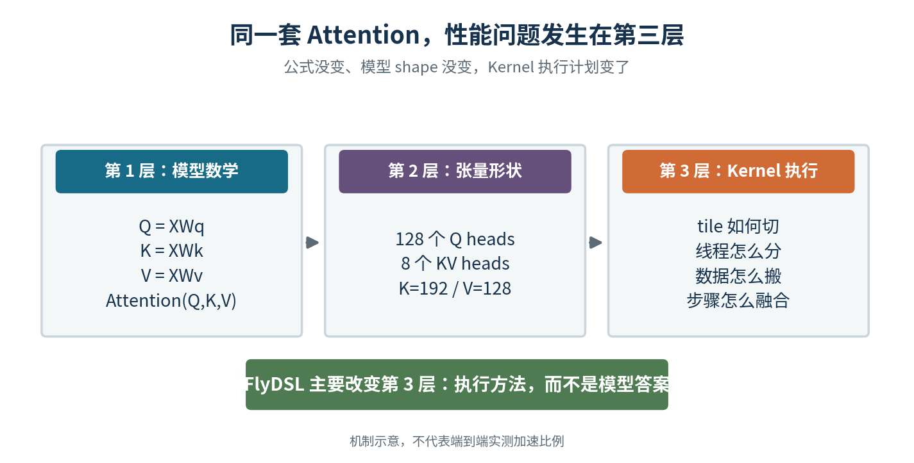

*Source Figure 1. CuTe DSL and FlyDSL primarily change the third layer. A new execution plan must preserve model semantics and shape.*

### The public MiMo shape and its asymmetry

The public `XiaomiMiMo/MiMo-V2.5-Pro` `config.json` provides these Attention fields:

| Field | Value |
|---|---:|
| Query heads | 128 |
| KV heads | 8 |
| Q/K head dimension | 192 |
| V head dimension | 128 |
| QKV weight layout | `fused_qkv` |

Source: <https://huggingface.co/XiaomiMiMo/MiMo-V2.5-Pro/blob/main/config.json>

The central asymmetry is:

```text
K width = 192
V width = 128
```

K and V are not equally wide. This is mathematically valid: the Q·K dot product requires Q and K to share a dimension, while V contains the information weighted by Attention and can have a different width. A kernel, however, cannot treat K and V as interchangeable equal-size blocks.

#### Padding an equal-width-only kernel

One compatibility route pads V from 128 to 192:

```text
Native: K = 192, V = 128
Padded: K = 192, V = 192
```

Zero padding can preserve the mathematical result if the extra output dimensions are removed. The GPU still may allocate, load, move into LDS or registers, multiply-accumulate, write intermediate values, and finally discard those zero dimensions.

#### Shape-derived waste, not an end-to-end benchmark

For V alone:

```text
128 → 192
```

The padded representation is `1.5×` the native width, adding 50% relative to native `128`. Looking from the padded path back to native, the same 64-dimensional difference is 33.33% of `192`:

$$
\frac{192-128}{192}=33.33\%
$$

For combined K and V:

```text
padded K+V: 192 + 192 = 384
native K+V: 192 + 128 = 320
```

Removing padding reduces combined width by:

$$
\frac{384-320}{384}=16.67\%
$$

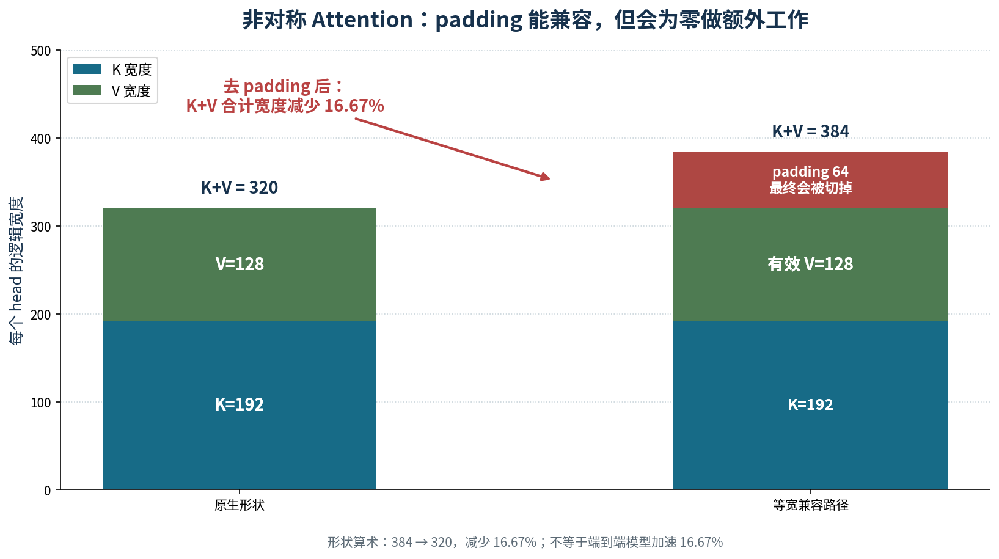

*Source Figure 2. The percentages are deterministic shape arithmetic. They do not claim a 16.67% end-to-end model speedup.*

Attention is only part of a layer, and the realized gain depends on its original share of total time and on whether compute, memory bandwidth, or communication is the bottleneck.

### Why a general kernel may not adapt automatically

A high-performance GPU kernel is not an arbitrary-shape matrix calculator. It resembles an automated line designed around particular package dimensions. For a `192×192` path, vector width, on-chip allocation, worker tile, and Matrix Fused Multiply-Add (MFMA) fragment may all assume that shape. A `192×128` input offers three routes:

1. Pad it to 192 and retain the old line.
2. Use a more general but slower fallback.
3. Build a specialized kernel around native 192/128.

Padding reaches compatibility quickly but wastes work. A generic fallback covers more shapes at lower throughput. Specialization costs the most engineering effort but can best match a high-value production shape.

Peak kernels commonly constrain tile dimensions, wave or warp ownership, per-thread vector width, Local Data Share (LDS) placement and bank-conflict avoidance, register fragments, pipeline stages and buffering, and fusion boundaries. A shape change can make the previous combination inefficient or invalid.

> A general kernel provides coverage. A specialized kernel tries to saturate the hardware on one important shape.

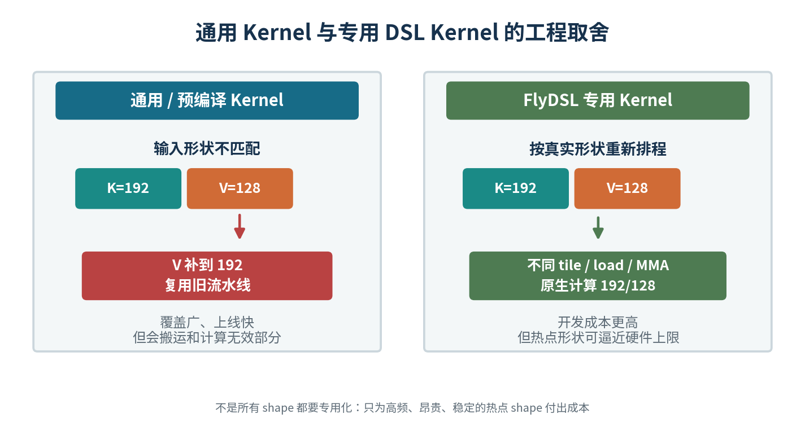

*Source Figure 3. Specialization is justified by an uncovered or underperforming production shape, not by the DSL label itself.*

### What CuTe DSL and FlyDSL add

CUDA/HIP C++, CUTLASS/CK, and Triton can all implement GPU kernels. CuTe DSL and FlyDSL have no exclusive hardware permission. Their shared engineering value is making layout, copy, matrix, and thread-partition decisions explicit composable Python objects instead of burying them in address arithmetic, template parameters, and thread indices.

#### Product and API identities

NVIDIA defines **CuTe DSL** as:

> CuTe DSL is a Python-based domain-specific language (DSL) designed for dynamic compilation of high-performance GPU kernels. It evolved from the C++ CUTLASS library and is now available as a decorator-based DSL.

It provides `@cute.jit`, `@cute.kernel`, JIT caching, DLPack integration, and explicit control of layouts, copies, matrix multiply-accumulate operations, and lower-level NVIDIA GPU capabilities. Source: <https://docs.nvidia.com/cutlass/latest/media/docs/pythonDSL/cute_dsl_general/dsl_introduction.html>

The ROCm/FlyDSL repository defines FlyDSL as:

> A Python DSL and an MLIR stack for authoring high-performance GPU kernels with explicit layouts and tiling.

The defining terms are explicit layouts, explicit tiling, Python authoring, and an MLIR stack that lowers the program to GPU instructions. Source: <https://github.com/ROCm/FlyDSL>

| | NVIDIA CuTe DSL | AMD FlyDSL |
|---|---|---|
| Origin | Python DSL evolved from CUTLASS/CuTe C++ | AMD Python DSL adopting CuTe Layout Algebra |
| Target | NVIDIA CUDA | AMD ROCm/HIP |
| Host / kernel decorators | `@cute.jit` / `@cute.kernel` | `@flyc.jit` / `@flyc.kernel` |
| Layout API prefix | `cute.make_layout`, `cute.zipped_divide` | `fx.make_layout`, `fx.zipped_divide` |
| Movement | `cute.copy` with Copy Atom/Tiled Copy; can expose TMA, cp.async, and related architecture features | `fx.copy` with Copy Atom/Tiled Copy; can expose ROCDL buffer load/store and related features |
| On-chip path | GMEM → SMEM/RMEM; newer architectures can also use TMEM | GMEM/HBM → LDS/VGPR |
| Matrix computation | Tiled MMA lowering to generation-specific Tensor Core instructions | Tiled MMA lowering to MFMA/WMMA |
| Compilation | Python decorator DSL dynamically JIT-compiles to a CUDA target | Python → Fly MLIR → ROCDL/LLVM → HSACO |

They share Layout Algebra and kernel-design methods. **They do not share an API binary, and one source program cannot be switched between them unchanged.** The common mathematics comes first below; APIs are labeled separately. The MiMo 192/128 implementation discussion remains a FlyDSL example and supplies no NVIDIA selection or performance evidence.

#### Explicit layout as a mapping problem

Device memory is a linear sequence. A kernel has to map a logical coordinate to a memory address, assign a thread, choose a contiguous vector width, place values in LDS, and then place them in a thread's registers.

```text
Logical coordinate (row index, column index)
              ↓
Corresponding address in GPU memory
              ↓
Thread responsible for reading it
              ↓
Number of contiguous elements per read
              ↓
Destination position in LDS
              ↓
Destination register in the thread
```

PyTorch's `A @ B` states what to compute. CuTe DSL and FlyDSL describe who moves each value, where it goes, and how it is reused. Their inherited CuTe Layout model is a computable mapping function.

#### Step 1: logical coordinate to linear offset

A layout contains the source concepts `Shape` and `Stride`:

```text
Layout = (Shape, Stride)
linear offset = logical coordinate · Stride
```

An AMD FlyDSL documentation example is:

```python
shape = fx.make_shape(128, 64)
stride = fx.make_stride(1, 128)
layout = fx.make_layout(shape, stride)
coord = fx.make_coord(3, 5)
offset = fx.crd2idx(coord, layout)
```

NVIDIA CuTe DSL uses the same Shape/Stride concept through `cutlass.cute`:

```python
import cutlass.cute as cute

layout = cute.make_layout((128, 64), stride=(1, 128))
offset = layout((3, 5))
```

The CuTe DSL notebook defines Layout as a Shape/Stride pair mapping coordinate space to index space. Calling `layout(coord)` invokes that mapping. For coordinate `(3, 5)`:

$$
3\times1+5\times128=643
$$

The logical matrix is `128×64`, but stride `(1,128)` makes the first dimension advance one address and the second advance 128, a column-major mapping. With stride `(64,1)`, the same coordinate maps to:

$$
3\times64+5\times1=197
$$

The mathematical element is still `A[3,5]`; its relative linear offset differs.

An offset is **not an absolute physical HBM address**. A simplified byte address is:

```text
tensor allocation base address + offset × dtype_bytes
```

The runtime and allocator determine the allocation base. The DSL layout controls the coordinate-to-relative-offset mapping within the tensor. It does not select an absolute address or a particular HBM chip.

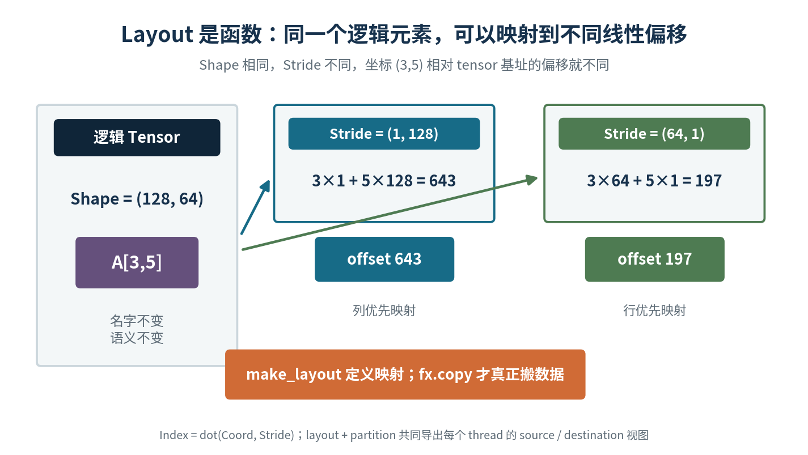

*Source Figure 4. Layout is a function from logical coordinates to linear offsets, not a picture of matrix appearance. Equal Shape with different Stride changes access order.*

This mapping affects whether adjacent threads reach adjacent addresses, whether a 128-bit load contains useful contiguous values, whether a wavefront coalesces into fewer HBM transactions, and whether a transpose or slice can change only metadata or must move data.

#### Step 2: partition the tensor into blocks and threads

Coordinate mapping alone does not assign work. Both DSLs use layout algebra for two more decompositions:

```text
Complete tensor
  ↓ zipped_divide / tiled_divide
Each workgroup owns one tile
  ↓ thread-value layout
Each thread owns a set of values within the tile
```

The core structure in an official AMD FlyDSL GEMM example is:

```python
bA = fx.zipped_divide(A, tileA)
bA = fx.slice(bA, (None, bid))

thr_copy = tiled_copy.get_slice(tid)
src = thr_copy.partition_S(bA)
dst = thr_copy.partition_D(dst_tensor)
fx.copy(copy_atom, src, dst)
```

`zipped_divide` splits the matrix into tiles; `slice(..., bid)` chooses the current block's tile; `get_slice(tid)` locates a thread in cooperative copying; `partition_S` and `partition_D` define that thread's source and destination views; and `fx.copy` performs the data movement.

**`make_layout` does not move data.** It defines a mapping. `fx.copy`, buffer loads, and stores execute reads and writes using that mapping. Layout is an address-and-ownership plan; copy is the movement action.

When the destination is an MFMA register fragment, the official tiled-MMA example does not call `partition_D` directly on the fragment. It uses:

```python
frag_A = thr_mma.make_fragment_A(bA)
copy_frag_A = thr_copy.retile(frag_A)
fx.copy(copy_atom, src, copy_frag_A, pred=None)
```

`partition_D` produces a thread partition of an ordinary destination tensor. `retile` reinterprets an existing fragment with a value layout compatible with the tiled copy. Both decide which values a thread sees, but their consumers differ.

NVIDIA's official `tour_to_sol_gemm.ipynb` is a **Python CuTe DSL** example. It uses `import cutlass.cute as cute` and `@cute.kernel`; the following calls are inside that Python kernel, not CuTe C++:

```python
@cute.kernel
def kernel(
  tiled_mma: cute.TiledMma,
  mA_mkl: cute.Tensor,
  mC_mnl: cute.Tensor,
   # ...remaining parameters omitted
):
  gA = cute.local_tile(
    mA_mkl, mma_tiler_mnk, mma_coord_mnk, proj=(1, None, 1)
  )
  thr_mma = tiled_mma.get_slice(0)
  tCgA = thr_mma.partition_A(gA)

  tDtC = tmem_thr_copy.partition_S(tCtAcc_epi)
  tDgC = tmem_thr_copy.partition_D(gC_epi)
  cute.copy(tmem_tiled_copy, tDtC[None, None, i], tCrAcc)
```

`local_tile` selects the current Cooperative Thread Array (CTA) tile, `partition_A/B/C` creates the tensor views seen by MMA, `partition_S/D` creates copy source and destination views, and `cute.copy` performs movement. Current FlyDSL does not expose a same-named `local_tile`; its documentation recommends `zipped_divide + slice` for equivalent decomposition. The algebraic semantics are related, but APIs and hardware details differ.

Code source: <https://github.com/NVIDIA/cutlass/blob/main/examples/python/CuTeDSL/cute/notebooks/tour_to_sol_gemm.ipynb>

#### A 4×8 toy thread-value layout

Take a row-major `4×8` FP32 tile with 32 values. For explanation, map it to eight lanes with four contiguous values per lane:

| Lane | Logical elements | HBM linear offsets |
|---:|---|---|
| 0 | `A[0,0:4]` | `0..3` |
| 1 | `A[0,4:8]` | `4..7` |
| 2 | `A[1,0:4]` | `8..11` |
| 3 | `A[1,4:8]` | `12..15` |
| 4 | `A[2,0:4]` | `16..19` |
| 5 | `A[2,4:8]` | `20..23` |
| 6 | `A[3,0:4]` | `24..27` |
| 7 | `A[3,4:8]` | `28..31` |

The toy mapping is `offset = 4 × lane + value`, where `value=0..3`. Lane 0's four FP32 values occupy 16 contiguous bytes, or 128 bits. If the source address satisfies the copy atom's alignment and legal-access requirements, one `BufferCopy128b` can fetch all four. Lane 1 reads the next 16 bytes.

Eight lanes are an explanatory simplification, not a universal mapping. A real kernel chooses thread-value layout from dtype, wavefront, tile, and MFMA instruction. When the values enter LDS, destination layout can differ:

```text
partition_S: lane 0 reads HBM offsets 0..3
partition_D: lane 0 writes to the position specified by the LDS destination layout
fx.copy: executes this 128-bit transfer using the copy atom
```

`partition_S / partition_D` are source and destination thread views, not additional memory levels. The runtime path remains `HBM → LDS → VGPR/MFMA`.

#### Step 3: use different layouts in global memory, shared storage, and registers

A high-performance kernel rarely carries one layout end to end.

| Level | NVIDIA CuTe DSL | AMD FlyDSL | Typical objective |
|---|---|---|---|
| Global memory | GMEM | GMEM / HBM | Contiguous, aligned, vectorized reads |
| On-chip shared storage | SMEM | LDS | Cross-thread reuse and bank-conflict avoidance |
| Thread registers | RMEM / Register | VGPR / Register | Match MMA/MFMA fragments |
| New architecture-specific storage | Blackwell can use TMEM | Depends on AMD architecture | Accumulator or specialized data path |
| Output memory | GMEM | GMEM / HBM | Contiguous writes or the next fused stage's expected layout |

Data that is row-contiguous in GMEM need not stay naively row-major in SMEM or LDS. A swizzle can spread accesses that would otherwise collide on one bank.

The APIs are platform-specific. CuTe DSL's official Blackwell GEMM notebook gives a composed SMEM layout, including an `outer` layout and `inner` swizzle, to `SmemAllocator`. The FlyDSL guide demonstrates explicit eXclusive OR (XOR) address construction, for example folding row information into a column address at 16-byte granularity. Both can express bank-friendly layouts, but NVIDIA helper names must not be copied into an AMD API contract.

#### Step 4: a Copy Atom sets movement granularity

Layout says which values each thread owns. A copy atom says what hardware-sized movement one operation performs.

```python
copy_atom = fx.make_copy_atom(
    fx.rocdl.BufferCopy128b(),
    fx.Float32,
)
```

`BufferCopy128b` is a **FlyDSL/AMD** 128-bit buffer copy atom. For FP32 it moves four contiguous values per operation.

**CuTe DSL/NVIDIA** also provides `cute.make_copy_atom`, Tiled Copy, and `cute.copy`, but the atom depends on architecture and path. Ordinary global/shared copies, cp.async, TMA, and TMEM load/store are different hardware operations. The common abstraction is that an atom defines one operation's capability, while Tiled Copy distributes it across threads.

Continuous, aligned ownership can fill the load with useful data. Scattered ownership needs more instructions or prior rearrangement. “Data layout” therefore includes four levels:

```text
Relative offset for each logical element
→ Owning block / thread
→ Its respective layouts in HBM, LDS, and VGPR
→ Copy atom width for each transfer
```

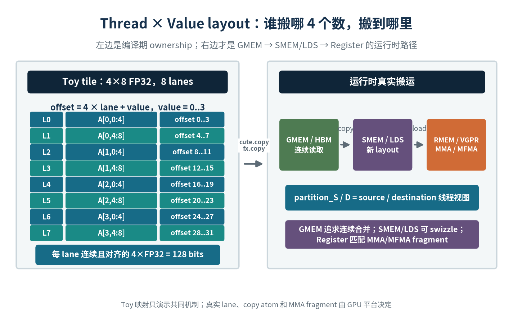

*Source Figure 5. The left side is compile-time ownership mapping; the right side is the real runtime data path. `partition_S/D` creates views rather than memory tiers.*

#### Applying this control to AMD 192/128 Attention

MiMo-V2.5-Pro uses a 192-dimensional K head and a 128-dimensional V head. An equal-width path pads V because its tile, load, and fragment layouts were built around symmetric K/V.

A native specialized path does more than remove 64 zeros. It replans both paths:

```text
K: select the tile, vector load, and fragment for width 192
V: select a separate tile, vector load, and fragment for width 128
The two paths converge where required by Attention semantics
```

FlyDSL can give K and V distinct layouts and compose each execution plan through composition, division, partitioning, and copy. The model still computes the same Attention; only the mapping of 192 and 128 onto AMD hardware changes.

CuTe DSL can express the same class of design on NVIDIA, with distinct K/V layouts, tiles, copies, and MMA fragments. Expressibility does not prove that this MiMo 192/128 kernel exists or has been validated on NVIDIA. This article provides no such measurement.

The precise capability boundary is: kernel authors explicitly control coordinate-to-relative-offset mapping, tile-to-thread ownership, movement through the target GPU's memory hierarchy, and the final mapping into an MMA fragment.

#### The “data” is tensor data, not customer business data

The DSLs control tensor elements inside a GPU kernel, not records in a customer database.

```text
HBM: a large, distant warehouse
  ↓
LDS: a small warehouse beside the workshop
  ↓
Register: the toolbox in a worker's hands
  ↓
MFMA: performs the actual matrix multiply-accumulate
```

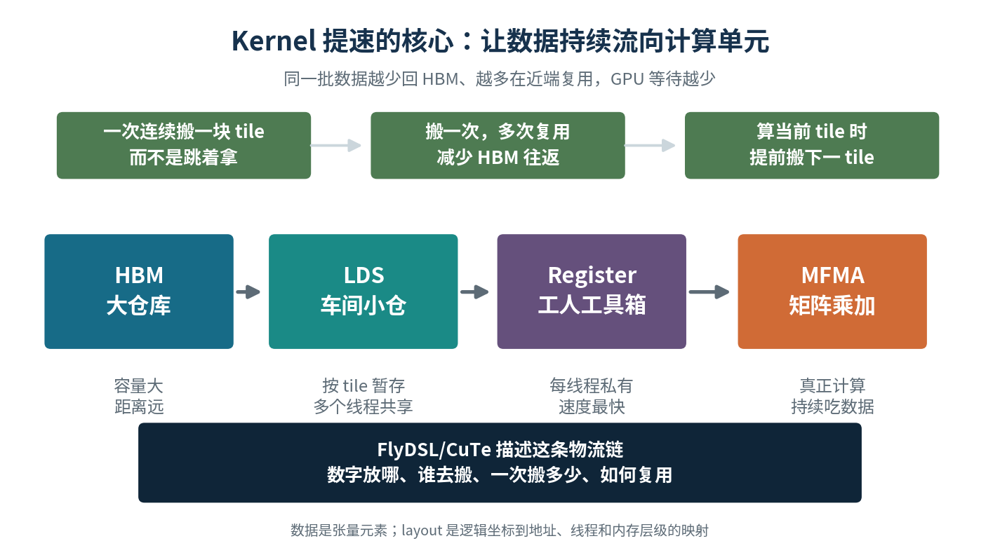

*Source Figure 6. NVIDIA terminology commonly describes GMEM→SMEM/RMEM→MMA; AMD commonly describes HBM/GMEM→LDS/VGPR→MFMA.*

### Six mechanisms that can improve performance

Neither DSL is an enable-and-accelerate switch. Gains come from a concrete execution plan.

#### 1. Remove padding

Generate native load and compute paths for `K=192, V=128` instead of padding V to 192. This can allocate less useless V space, move fewer zero values, execute fewer ineffective multiply-adds, and avoid writing results that will be sliced away.

#### 2. Tile for the real shape

A `128×128` tile need not fit `192×128`. A poor tile can leave boundary slots empty, idle threads, consume too many registers or LDS bytes, and reduce resident waves. A specialized kernel can tune `BLOCK_M/BLOCK_N/BLOCK_K` for the actual shape.

#### 3. Make access contiguous

GPUs prefer groups of threads reading contiguous aligned addresses. Layout can arrange:

```text
Adjacent threads → adjacent data
One read → 4/8/16 contiguous elements
Group access → aligned to an appropriate boundary
```

Fewer memory transactions can deliver higher effective bandwidth for the same useful byte count.

#### 4. Move once and reuse

HBM is distant. A kernel can load one tile into LDS and reuse it across many operations:

```text
Poor: fetch data from HBM for every multiplication
Good: perform many multiply-accumulates after loading one tile into LDS
```

#### 5. Overlap movement and computation

While tile 0 computes, tile 1 can load:

```text
Timeline:
Load tile0 ──┐
             ├─ Compute tile0 ──┐
             │                  ├─ Compute tile1 ──┐
             └─ Load tile1 ─────┘                  ├─ ...
                                └─ Load tile2 ──────┘
```

With a balanced pipeline, matrix units do not wait for each next tile.

#### 6. Fuse intermediate stages

Separate QKV transforms, positional encoding, type conversion, and cache writes can create repeated HBM round trips:

```text
Kernel A writes HBM
Kernel B reads HBM again
Kernel B writes HBM
Kernel C reads HBM again
```

Fusion can retain intermediates in registers or LDS and reduce launches and HBM traffic. Excessive fusion can increase register pressure and reduce occupancy, so the boundary must be measured on the real shape.

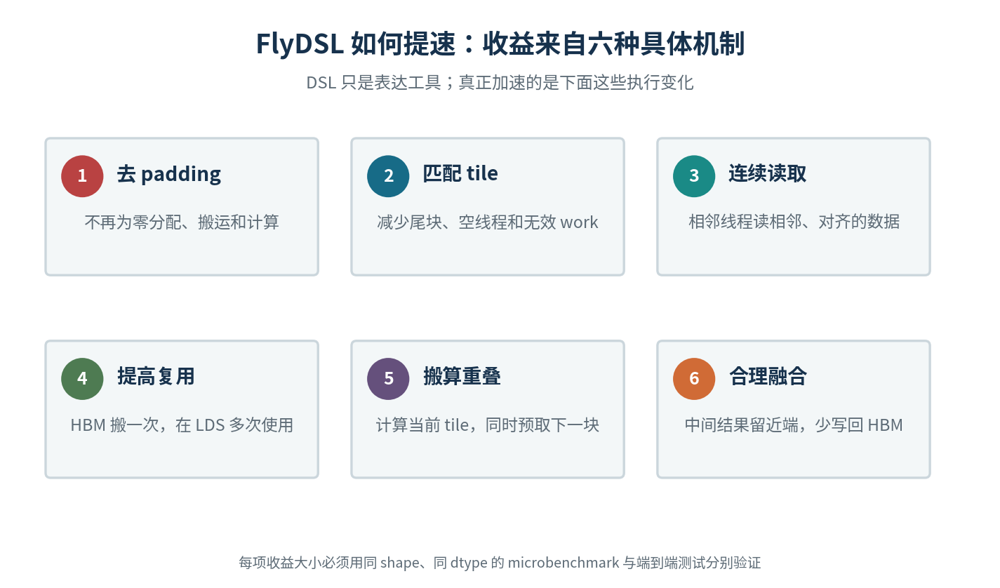

*Source Figure 7. The diagram is a mechanism map, not a measured allocation of gains among mechanisms.*

### Why begin with a Python layout DSL instead of hand-written C++?

CUDA C++ and HIP C++ can provide equivalent low-level control. The distinction is engineering cost.

| Route | Advantage | Cost |
|---|---|---|
| Existing library or precompiled kernel | Stable and quick to deploy | May not cover the special shape |
| Triton | Fast development and experimentation | Thread-level layout control is usually less direct |
| CuTe DSL | Python development, CuTe Layout Algebra, and NVIDIA low-level capabilities | Requires CUDA architecture and kernel expertise |
| FlyDSL | Python development, CuTe-style Layout Algebra, and AMD low-level capabilities | Requires ROCm architecture and kernel expertise |
| CuTe C++ / CK templates | Strong performance and reusable components | Complex templates, compilation, and debugging |
| HIP/CUDA C++ | Most direct control | Highest implementation effort and error risk |

A disciplined path for a new shape is:

1. Check whether the target platform already supports it through CUTLASS, cuDNN, AITER, CK, or Triton.
2. If not, use a DSL to validate a correct layout and tile quickly.
3. Benchmark and autotune the real hot shape.
4. Keep the DSL implementation or lower it to CuTe C++/CUDA C++ or CK/HIP C++ according to long-term maintenance needs.
5. Ahead-of-Time (AOT) compile common production shapes to avoid first-request Just-In-Time (JIT) cost.

“Begin with a DSL” does not mean only a DSL can implement the mathematics. It means a DSL can be the fastest engineering entry when existing kernels do not cover a critical special shape.

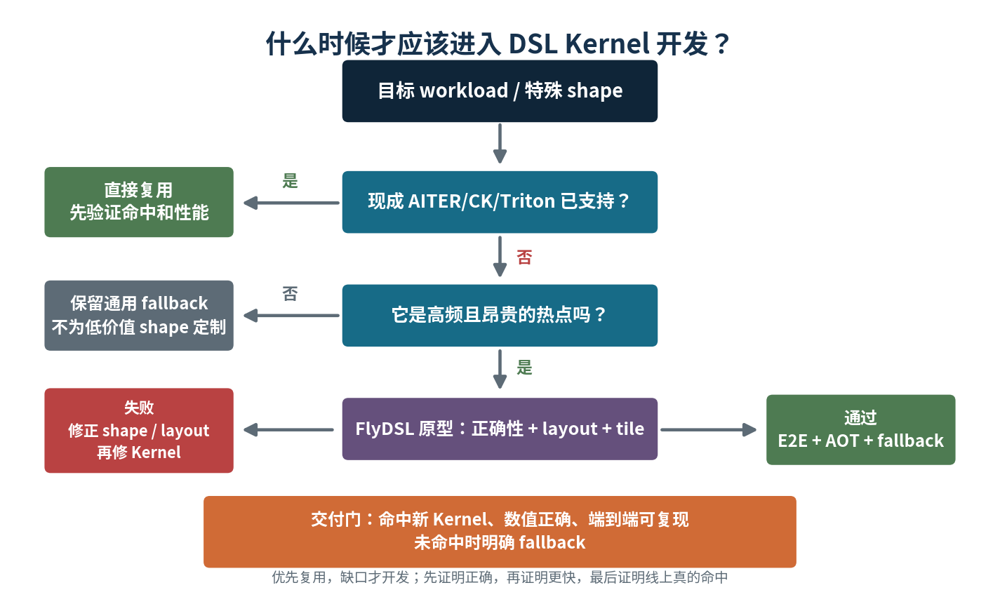

*Source Figure 8. Reuse an existing kernel first; specialize only when a high-value shape is missing or its hot-path performance is insufficient.*

### Shared Layout Algebra does not make one backend

CuTe DSL is NVIDIA CUTLASS's Python kernel DSL. FlyDSL implements a comparable Python layout-programming need for AMD and explicitly adopts CuTe Layout Algebra.

| | AMD | NVIDIA |
|---|---|---|
| GPU platform | ROCm/HIP | CUDA |
| Python kernel DSL | FlyDSL | CuTe DSL |
| Layout model | Adopts CuTe Layout Algebra | Native CuTe Layout Algebra ecosystem |
| Lowering | Python/Fly MLIR → ROCDL/LLVM → HSACO | Python decorator DSL dynamically JIT-compiles to a CUDA target |
| Operator ecosystem | AITER | CUTLASS, cuDNN, FlashInfer, and others |

ROCm's documentation states that FlyDSL adopts the same CuTe layout-algebra framework and supplies a Python API plus an MLIR compilation route for AMD ROCm/HIP GPUs.

Sources:

- <https://github.com/ROCm/FlyDSL/blob/main/docs/cute_layout_algebra_guide.md>
- <https://rocm.blogs.amd.com/software-tools-optimization/flydsl-python-native/README.html>
- <https://docs.nvidia.com/cutlass/latest/media/docs/pythonDSL/cute_dsl.html>

Their technical position and design ideas are related. Their APIs are not compatible, and the same source does not switch backends unchanged.

### Five common customer misconceptions

#### The DSL changes the model

It should not. Weights, Attention mathematics, and output semantics remain invariant. The DSL changes the execution plan.

#### The DSL automatically optimizes every model

It does not. Engineers still choose tiles, thread mapping, pipeline stages, and fusion boundaries and validate them on the real workload.

#### Removing 16.67% of padded K+V width makes the model 16.67% faster

It does not. End-to-end gain depends on the kernel's original fraction of total time and the kernel speedup. Amdahl's law states:

$$
S_{total}=\frac{1}{(1-p)+p/S_{kernel}}
$$

Here `p` is the kernel's original fraction of end-to-end time and `S_kernel` is the kernel-level speedup.

#### Every shape should have a specialized kernel

Too many specialized kernels increase compilation, cache, test, and maintenance cost. Specialize production shapes that are frequent, expensive, and stable.

#### A fast kernel benchmark proves a fast service

A kernel microbenchmark excludes request scheduling, KV management, cross-rank communication, networking, sampling, and queuing. Report the layers separately:

```text
Kernel microbenchmark
→ Single-node operator integration
→ Model end to end
→ Multi-node service
```

Passing one layer does not grant the next layer a PASS.

### Runtime acceptance procedure

Do not ask only whether CuTe DSL or FlyDSL was enabled. Require these checks:

| Acceptance question | Evidence required |
|---|---|
| Did the workload actually select the target DSL kernel? | Runtime log with concrete CuTe DSL or FlyDSL kernel name, version, and GPU platform |
| Was V padding removed? | Effective K/V head dimensions and KV allocation |
| Is the result numerically consistent? | Error test against a BF16 or PyTorch reference |
| How much faster is the kernel itself? | Same shape, dtype, and warmup in a microbenchmark |
| How much faster is the model end to end? | Same request set, concurrency, and output length |
| Does first-request JIT affect latency? | Separate cold-start and cache-hit reports |
| Are common production shapes covered? | AOT/JIT kernel manifest and fallback statistics |
| What happens on a miss? | Explicit fallback log for CUTLASS, cuDNN, CK, Triton, CUDA, or HIP |

The deliverable is not the existence of DSL source. It is a target workload that demonstrably selects the new kernel, produces a correct result, and yields reproducible end-to-end benefit.

### Five statements to retain

1. A general kernel is responsible for covered shapes, not every possible shape.
2. Padding can make a special model shape compatible while wasting movement and arithmetic.
3. CuTe DSL and FlyDSL preserve the equation while explicitly planning tiles, threads, memory levels, and pipelines.
4. Gains come from removing padding, moving less, reusing more, overlapping movement and compute, and fusing judiciously, not from the word “DSL.”
5. Kernel speed does not prove model speed; validate microbenchmark, single-node end to end, and multi-node service separately.

### References

- XiaomiMiMo/MiMo-V2.5-Pro model configuration: <https://huggingface.co/XiaomiMiMo/MiMo-V2.5-Pro/blob/main/config.json>
- ROCm/FlyDSL repository: <https://github.com/ROCm/FlyDSL>
- FlyDSL CuTe Layout Algebra Guide: <https://github.com/ROCm/FlyDSL/blob/main/docs/cute_layout_algebra_guide.md>
- FlyDSL Architecture Guide: <https://github.com/ROCm/FlyDSL/blob/main/docs/architecture_guide.md>
- NVIDIA CuTe DSL Introduction: <https://docs.nvidia.com/cutlass/latest/media/docs/pythonDSL/cute_dsl_general/dsl_introduction.html>
- NVIDIA CuTe DSL Programming Model: <https://docs.nvidia.com/cutlass/latest/media/docs/pythonDSL/cute_dsl.html>
- NVIDIA CuTe Layout Algebra Notebook: <https://github.com/NVIDIA/cutlass/blob/main/examples/python/CuTeDSL/cute/notebooks/cute_layout_algebra.ipynb>
- NVIDIA Tour of SOL GEMM Notebook: <https://github.com/NVIDIA/cutlass/blob/main/examples/python/CuTeDSL/cute/notebooks/tour_to_sol_gemm.ipynb>
- FlyDSL CuTe Layout Algebra Guide: <https://github.com/ROCm/FlyDSL/blob/main/docs/cute_layout_algebra_guide.md>
- AMD ROCm Blog, FlyDSL Python Native: <https://rocm.blogs.amd.com/software-tools-optimization/flydsl-python-native/README.html>
- ROCm/AITER repository: <https://github.com/ROCm/aiter>
- NVIDIA CuTe DSL: <https://docs.nvidia.com/cutlass/latest/media/docs/pythonDSL/cute_dsl.html>
- Earlier article in this series: *Triton, FlyDSL, CK, and HIP C++ Compared*

> Every percentage in this chapter is deterministic arithmetic over the public model shape. It explains padding and data layout; it is not an end-to-end performance measurement for any platform.
<!-- SOURCE-END-EN id=13 -->

---

<!-- SOURCE-BEGIN-EN id=14 -->
## Source #14: Why 16 GPUs Cannot Simply Split Eight KV Heads

> More GPUs do not always make a model easier to partition. MiMo-V2.5-Pro has 128 Query heads but only 8 Key-Value (KV) head groups. Under the cited checkpoint and runtime contract, the smaller count controls Attention parallelism.

### Definitions

| Abbreviation | Full term | Meaning here |
|---|---|---|
| GPU | Graphics Processing Unit | A device, informally a “card” |
| Q / K / V | Query / Key / Value | Query, matching key, and aggregated value in Attention |
| KV | Key-Value | K and V together; KV cache stores historical-token K/V state |
| TP | Tensor Parallelism | Several GPUs cooperate on one computation |
| DP | Data Parallelism | Several GPU groups process different requests |
| EP | Expert Parallelism | Complete experts are distributed across ranks |
| MoE | Mixture of Experts | Each token activates only a subset of experts |
| GQA | Grouped Query Attention | Groups of Query heads share fewer KV heads |
| SWA | Sliding Window Attention | Each layer attends only to a local history window |
| MTP | Multi-Token Prediction | Lightweight modules predict several subsequent tokens |
| LM head | Language Model head | Output projection from hidden state to vocabulary |
| FP8 | 8-bit Floating Point | Low-precision representation for weights, activations, or KV cache |
| PD | Prefill/Decode Disaggregation | Prefill and Decode run in separate services or nodes |

### The counterintuitive failure

Attention Tensor Parallelism can run at TP8 on one eight-GPU server. Adding a second server suggests a finer TP16 split:

```text
8 GPUs can split it, so 16 GPUs should split it even more easily.
```

Instead, weight loading can fail before the service accepts a request. The controlling constraint is not GPU count or a special device. It is the model's Attention-head organization plus the way the checkpoint was sharded, quantized, and stored.

This chapter distinguishes the model's kinds of “head,” explains why Query heads remain divisible while KV heads do not, traces the additional computation and communication required to split inside one KV head, shows how DP avoids that change, and maps TP8/DP4/EP32 onto the same 32 ranks.

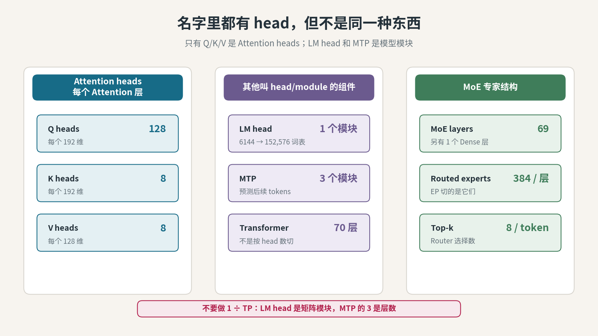

*Source Figure 1. Sharing the word “head” does not make these modules interchangeable in a parallelism constraint.*

### Inventory the model structure first

The public `XiaomiMiMo/MiMo-V2.5-Pro` configuration gives:

| Component | Count or shape | Meaning |
|---|---:|---|
| Transformer layers | 70 | 1 Dense layer + 69 MoE layers |
| Global Attention layers | 10 | Can attend to the full historical context |
| Sliding Window Attention layers | 60 | Each attends to a local 128-token window |
| Query heads | 128 per Attention layer | Produce Q vectors |
| Key heads | 8 per Attention layer | Produce matching K indices |
| Value heads | 8 per Attention layer | Produce the V content to aggregate |
| Q/K head dimension | 192 | Width of each Q or K head |
| V head dimension | 128 | Width of each V head |
| LM head | 1 output module | Projects a 6,144-dimensional hidden state to a 152,576-entry vocabulary |
| MTP modules | 3 | Multi-Token Prediction modules, not Attention heads |
| Routed experts | 384 per MoE layer | Total experts in each MoE layer |
| Experts per token | 8 | Experts activated by each token |

Sources:

- XiaomiMiMo model card: <https://huggingface.co/XiaomiMiMo/MiMo-V2.5-Pro>
- Official `config.json`: <https://huggingface.co/XiaomiMiMo/MiMo-V2.5-Pro/blob/main/config.json>

`1 Dense + 69 MoE` classifies the Feed-Forward Network (FFN) in each layer. `10 Global + 60 SWA` separately classifies the Attention scope. These are intersecting axes: layer 0 is both the only Dense FFN layer and one of the 10 Global Attention layers.

#### The LM head is not 152,576 Attention heads

The LM head is one output-projection module:

```text
[hidden_size = 6144]
          ↓ LM head
[vocab_size = 152576]
```

Its matrix can be sharded by vocabulary or hidden dimension or replicated according to runtime policy. It does not present a “one head cannot divide by TP8” problem.

#### Three MTP modules are not three Attention heads

Multi-Token Prediction uses three lightweight modules to predict subsequent tokens for speculative decoding. The count `3` is a number of prediction-module layers, not an operand in `128 ÷ TP` or `8 ÷ TP` head assignment.

#### MiMo-V2.5-Pro does not mix MQA and GQA by layer

The model mixes two **Attention scopes**:

```text
10 Global Attention layers
60 Sliding Window Attention layers
```

Both use:

```text
128 Q heads
8 K heads
8 V heads
```

That is Grouped Query Attention. Every 16 Query heads share one K/V group:

$$
128 \div 8 = 16
$$

Multi-Query Attention (MQA) has one KV group. Multi-Head Attention (MHA) gives Q, K, and V equal head counts. Global Attention's `GA` must not be confused with GQA.

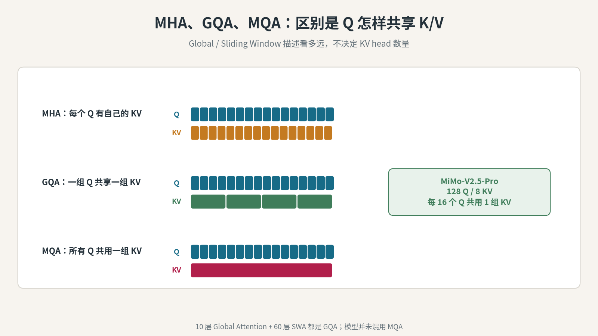

*Source Figure 2. Hybrid Global/SWA scope and MHA/GQA/MQA sharing are independent classification axes.*

### Why TP8 fits and TP16 does not on the current path

TP partitions one layer's matrices or heads among GPUs that process the **same request batch**. For MiMo-V2.5-Pro, TP8 assigns:

| Per Attention TP rank | Assignment |
|---|---:|
| Q heads | `128 ÷ 8 = 16` |
| K heads | `8 ÷ 8 = 1` |
| V heads | `8 ÷ 8 = 1` |
| Q rows | `16 × 192 = 3072` |
| K rows | `1 × 192 = 192` |
| V rows | `1 × 128 = 128` |
| Fused QKV rows | `3072 + 192 + 128 = 3392` |

A GPU is not a dedicated Q, KV, or LM device. Each rank simultaneously holds its Q/K/V shards, output-projection shard, and other weights assigned by the runtime.

At Attention TP16:

```text
Q: 128 ÷ 16 = 8 heads / rank     supported
K:   8 ÷ 16 = 0.5 head / rank   unsupported on the current path
V:   8 ÷ 16 = 0.5 head / rank   unsupported on the current path
```

K and V are the controlling failure, not Q and not the LM head.

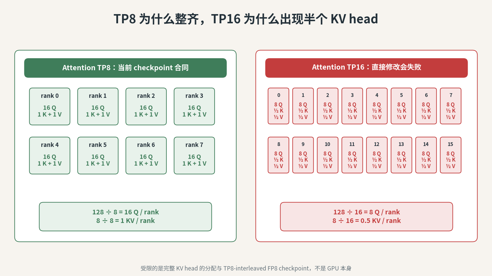

*Source Figure 3. The failure is not insufficient hardware; the cited path assigns complete KV heads and cannot evenly place eight groups on sixteen Attention ranks.*

### The limit is a checkpoint-and-kernel contract, not pure mathematics

A 192-dimensional K head can be divided mathematically:

```text
rank 0: first 96 dimensions of K
rank 1: last 96 dimensions of K
```

The two ranks cannot finish independently. For one Query and Key:

$$
QK^T = Q_0K_0^T + Q_1K_1^T
$$

Partial dot products must be reduced before Softmax. V must also remain sharded and be combined later, or incur another communication pattern. Splitting inside a head changes the entire path:

1. Q/K/V weight loading
2. FP8 scale partitioning and indexing
3. KV-cache memory layout
4. Cross-rank reduction of the QK dot product before Softmax
5. V-output partitioning and combination
6. Global Attention, SWA, and PagedAttention kernels
7. KV serialization between Prefill and Decode

The public FP8 fused-QKV MiMo-V2.5-Pro checkpoint was exported with TP8-interleaved rank boundaries. SGLang's day-0 support records a direct failure signature: the checkpoint scale shape is `[216, 48]`, while an incorrect loading order constructs `[212, 48]` at runtime.

The two leading dimensions follow from different blocking orders:

```text
fused-QKV rows per TP8 rank      = 3392
FP8 block rows / rank            = ceil(3392 ÷ 128) = 27
checkpoint stores 8 independent shards = 8 × 27 = 216

If the 8 shards are flattened before blocking:
ceil((3392 × 8) ÷ 128) = ceil(27136 ÷ 128) = 212
```

`216` preserves eight independently quantized TP8 shards. `212` incorrectly treats them as one flattened contiguous matrix. This is not harmless row padding or a small precision change; weights cannot map to the expected parameter layout, so startup fails.

Source: SGLang MiMo-V2.5-Pro day-0 support, <https://github.com/sgl-project/sglang/pull/23808>

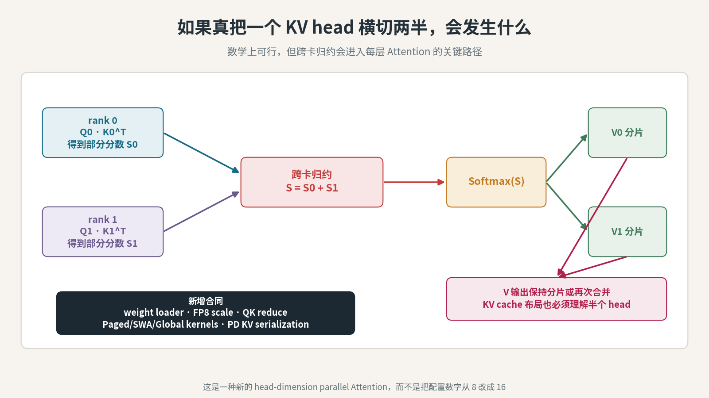

*Source Figure 4. Head-dimension partitioning is implementable, but it requires pre-Softmax reduction plus redesigned V output, KV layout, checkpoint loading, and Attention kernels.*

### Two tempting workarounds and their costs

#### Replicate KV heads

Eight KV heads could be copied so each neighboring pair of ranks owns the same head:

```text
rank 0, 1   → both store KV head 0
rank 2, 3   → both store KV head 1
...
rank 14, 15 → both store KV head 7
```

Some general GQA runtimes use related strategies. Replication duplicates KV cache, so more GPUs do not expand effective KV capacity. It also does not automatically repair a TP8-sharded FP8 fused-QKV loader or its scale shape. KV replication can be valid for another model or checkpoint, but it is not a free result of changing this model's `--tp` from 8 to 16.

#### Split each head horizontally

Head-dimension-parallel Attention expands the device range used by one request, but inserts cross-rank communication into every Attention layer's critical path. It needs a new distributed Attention implementation, checkpoint adapter, and KV layout. Without those components, it is not a configuration-only option.

### The supported approach keeps effective Attention TP at eight

Two eight-GPU servers can form two independent Attention TP8 groups:

```text
Attention group A: GPUs 0–7, processes request set A
Attention group B: GPUs 8–15, processes request set B
```

This is Data-Parallel Attention:

- Each group remains Attention TP8 internally.
- Groups process different requests.
- Each group owns its request state and KV cache.
- Common Attention weights are replicated across groups.
- MoE experts can remain globally sharded across a larger EP domain.

For the cited SGLang path:

$$
\text{effective Attention TP} = \frac{\text{global TP size}}{\text{DP size}}
$$

The official two-node, 16-GPU example uses:

```text
--tp 16 --dp 2 --ep 16 --enable-dp-attention
```

Therefore:

```text
effective Attention TP = 16 ÷ 2 = 8
```

Here `--tp 16` names the global rank domain. It does not mean that each Attention computation is split sixteen ways. DP Attention partitions it into two effective TP8 groups.

The corresponding four-node, 32-GPU conceptual topology is:

```text
--tp 32 --dp 4 --ep 32 --enable-dp-attention
```

This does not require `32 × 4 × 32` GPUs. The same 32 ranks join different communication groups for different modules.

### Mapping TP8, DP4, and EP32 onto 32 ranks

#### Attention: four TP8 groups

```text
DP0: ranks  0–7  → Attention TP8
DP1: ranks  8–15 → Attention TP8
DP2: ranks 16–23 → Attention TP8
DP3: ranks 24–31 → Attention TP8
```

Within each group, every rank still receives:

```text
16 Q heads
1 K head
1 V head
```

Different groups process different requests, which is data parallelism. Eight ranks inside each group cooperate on one request, which is tensor parallelism.

#### MoE: one global EP32 expert domain

Each MoE layer has 384 routed experts:

$$
384 \div 32 = 12
$$

Each EP rank stores `12` complete experts. Each token activates 8 experts. This `top-8` is a Router selection count and is not divided by 32.

#### The LM head does not cause this TP8 limit

The LM head is an output matrix. A runtime can shard its vocabulary dimension, replicate it, or use a specialized DP LM-head path. Its partitioning is an implementation choice independent of the eight-KV-head constraint.

Vocabulary size 152,576 happens to divide by 8 and 32. Even if it did not, common runtimes can pad vocabulary rows. It is not the control point in the cited fused-QKV startup failure.

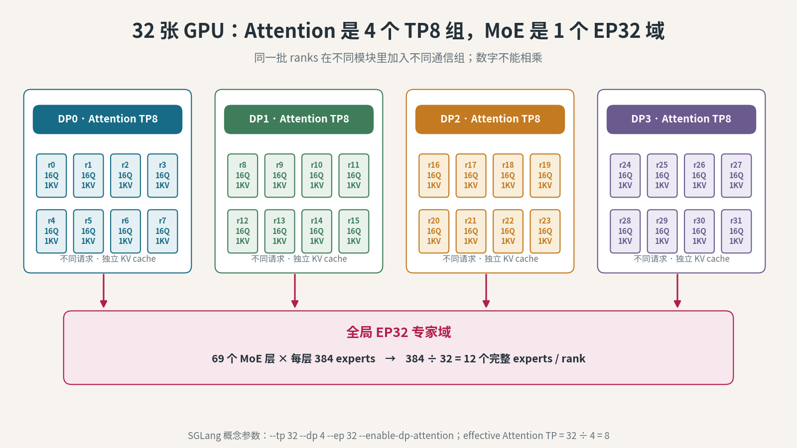

*Source Figure 5. DP replicates the common Attention path by group, while EP32 stores one globally distributed pool of 384 experts.*

### One token through this topology

Assume request A is assigned to DP0:

```text
Request A
  ↓
The 8 GPUs in DP0 jointly compute Attention
  ↓
The Router selects 8 experts for each token
  ↓
Token hidden states are sent via EP32 AllToAll to the expert-owning ranks
  ↓
Experts finish computing, and the results combine back to DP0
  ↓
DP0 enters Attention in the next layer
```

Two data categories follow different paths:

- EP sends the current layer's token hidden states and routing metadata across the expert domain.
- KV cache is Attention state and remains with the request's TP8 Attention group in steady state.

EP32 expands the expert-weight domain; it does not spread one request's KV cache across all 32 GPUs.

PD disaggregation is the explicit exception. When Prefill and Decode run on different servers, a transport engine such as Mooncake hands the completed KV cache to the Decode node. This is a point-to-point KV transfer at a role boundary, **not a per-layer EP AllToAll**.

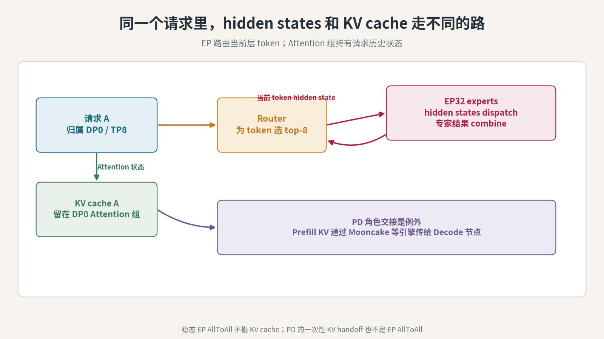

*Source Figure 6. KV crosses nodes during a separate PD handoff, not because EP routes each layer's hidden states.*

### TP, DP, and EP compared by ownership

#### TP: multiple ranks cooperate on one request

```text
The same request
   ├─ rank 0 computes one part
   ├─ rank 1 computes one part
  └─ ...
The complete result is combined through a collective
```

TP shards weights inside the group, uses the whole group for one request, synchronizes repeatedly across layers, can lower per-rank weight capacity, and is sensitive to tail latency, slow ranks, and cross-node communication.

#### DP: groups process different requests

```text
Request A → DP0
Request B → DP1
Request C → DP2
Request D → DP3
```

Ordinary DP replicates an entire model. DP Attention plus EP is more selective: common Attention layers are replicated across DP groups; each group retains TP8 internally; expert weights are not replicated per DP group but remain globally sharded through EP32.

`TP8 / DP4 / EP32` is therefore not four complete copies of a one-trillion-parameter model. The common Attention path is replicated. The MoE expert weights that hold most of the model's parameters are stored once across the 32-rank expert pool.

#### EP: data goes to the expert owner

EP does not partition Q/K/V heads. It distributes complete experts:

```text
384 experts ÷ EP32 = 12 experts / rank
```

The Router selects experts, dispatch sends tokens to their ranks, and combine returns the results to the originating Attention group.

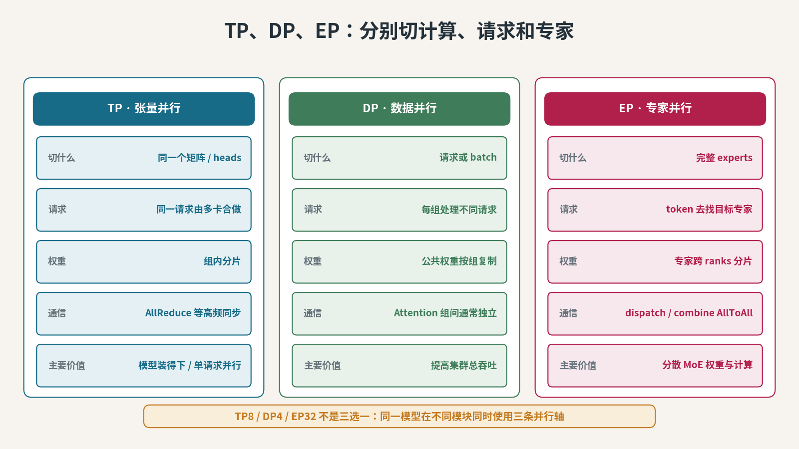

*Source Figure 7. The three axes can coexist within one model layer and over the same physical ranks.*

### Which values must divide, and which must not

| Value | Constraint in this topology | Reason |
|---|---|---|
| 128 Q heads | Must distribute over effective Attention TP8 | 16 Q heads per rank |
| 8 K heads | Current checkpoint/runtime requires effective TP8 | 1 complete K head per rank |
| 8 V heads | Current checkpoint/runtime requires effective TP8 | 1 complete V head per rank |
| Q/K dimension 192 | Current TP8 policy does not split inside a head | Each complete head belongs to one Attention rank |
| V dimension 128 | Current TP8 policy does not split inside a head | Asymmetry from K is supported by a specialized kernel |
| 384 experts | EP32 evenly places 12 per rank | Current DeepEP/uniform expert-placement contract |
| Top-8 experts per token | Does not divide by EP32 | Router selects eight experts for each token |
| 3 MTP modules | Does not divide by TP8 | Prediction-module layers, not Attention heads |
| 70 layers | Not split by GPU count without PP | Only Pipeline Parallelism (PP) partitions layers into stages |
| 1 LM head | No `1 ÷ 8` head-count operation | It is a matrix module, not an Attention-head count |

The defensible statement is not “a KV head can never be split.” It is: **this FP8 fused-QKV checkpoint and the cited SGLang loading/kernel path require effective Attention TP=8. Splitting inside a KV head would require a new checkpoint adapter, KV layout, and distributed Attention kernel.**

### Consequences of forcing TP16

| Approach | Starts on the cited path? | Main consequence |
|---|---|---|
| Change `--tp 8` directly to `--tp 16` | No | FP8 scale/weight shape mismatch causes startup failure |
| Split one KV head across its dimension | Requires a new implementation | Adds pre-Softmax reduction and changes V, KV layout, and all Attention kernels |
| Replicate KV heads across two ranks | Depends on runtime and checkpoint | Duplicates KV cache, so added GPUs do not expand effective KV capacity |
| Use DP Attention | Official route | Retains effective TP8 and increases request throughput; one request's KV still belongs to one TP8 group |
| Use EP32 | Official MoE route | Shards expert weights across 32 ranks and adds MoE AllToAll without changing Attention-head ownership |

There is no free option. TP16 for one request requires new reductions and kernel complexity. DP4 keeps the mature TP8 path while replicating common weights to raise aggregate request throughput. EP32 avoids expert-weight replication at the cost of dynamic AllToAll and load balancing.

### Topology design questions in order

#### 1. At what TP was the checkpoint exported?

Inspect the real weight and quantization-scale layout. A command-line parameter accepting 16 does not prove the checkpoint can load at 16.

#### 2. What is the smallest Attention partition unit?

Inspect Q-head count, KV-head count, head dimensions, and whether the runtime partitions complete heads, replicates KV, or implements head-dimension parallelism.

#### 3. Where does most model weight capacity live?

For dense models, focus on TP and PP. For MoE, also determine whether EP should distribute complete experts rather than making each expert GEMM too narrow.

#### 4. Is the goal single-request latency or aggregate throughput?

- To use more GPUs for one request, evaluate TP, PP, and Context Parallelism.
- To process more requests concurrently, evaluate DP.
- To distribute MoE expert weights, evaluate EP.

Increasing “parallelism” without naming the objective is not an actionable design decision.

### Six statements to retain

1. A GPU is not a dedicated Q, KV, or LM card; each rank holds shards from several modules.
2. MiMo-V2.5-Pro's 10 Global Attention and 60 SWA layers all use `128 Q / 8 KV` GQA rather than a mixture of MQA and GQA.
3. TP8 works while direct TP16 does not because eight KV heads meet a TP8-interleaved fused-QKV checkpoint contract.
4. DP Attention does not split a KV head; it creates several complete TP8 Attention groups for different requests.
5. Under `TP8 / DP4 / EP32`, Attention forms four TP8 groups while 384 experts divide into 12 complete experts per EP rank.
6. TP partitions one computation, DP partitions requests, and EP partitions experts. They are simultaneous axes, not three alternatives.

### References

- XiaomiMiMo/MiMo-V2.5-Pro model card: <https://huggingface.co/XiaomiMiMo/MiMo-V2.5-Pro>
- MiMo-V2.5-Pro `config.json`: <https://huggingface.co/XiaomiMiMo/MiMo-V2.5-Pro/blob/main/config.json>
- SGLang MiMo-V2.5 Cookbook: <https://docs.sglang.io/cookbook/autoregressive/Xiaomi/MiMo-V2.5>
- SGLang MiMo-V2.5-Pro day-0 support: <https://github.com/sgl-project/sglang/pull/23808>

> Model structure, head counts, and shapes come from the public configuration. The parallelism constraint is specific to the public FP8 fused-QKV checkpoint and corresponding SGLang path. Another model, checkpoint, or runtime can support KV replication, a different TP layout, or head-dimension parallelism; this result must not be generalized to those paths.
<!-- SOURCE-END-EN id=14 -->

---

## Reversible source ledger

| Source | Original SHA-256 | Normalized body SHA-256 | Source-detail images |
|---:|---|---|---:|
| #1 `5d_kv_cache_article.md` | `271476111d1ac493e8fb7807fb434649048a7c1886f443e0c28225ff379cb9f1` | `6a1fbcddb29776a820efd4dd2f2a6933704047957288304dc591418510779845` | 5 |
| #4 `04_paged_flash_aiter_article.md` | `ebf09f31954ddbff777cee87d13e1b9335cd5932b2aef72a4d060099dff2c662` | `d69c2f45097c1b02bc86aa4117eadf7ff6300b2781519cd9d5d2a75ef035be92` | 17 |
| #5 `05_tp_vs_ep_article.md` | `d40a6ea2dcd88cd9f69d5044b4f46ab13d91ebbebd8f02fc4e2c2099559e3a0d` | `1ce6ab8ed41c4df7d0ed099edd53d762f68c578f626fbd13052e672d42a24f02` | 12 |
| #13 `13_why_dsl_attention_article.md` | `4d1f179fad7e54be6c80e65bd80c841f233b02d11ab96fbd81ed9eac5ea048d9` | `8892ad9dfc0047b2b7a9c82f370ac2aefe5ab179952e277371fddec9830b8e38` | 8 |
| #14 `14_head_limit_tp_dp_ep_article.md` | `40545d5104c1bc78dbf8912221d931a9d7a510f6c0f3e60d1ec54816f15a9a63` | `a7d0402d064464fd01a10321872e440854a36df3bf5a58479e2e49e188ffec51` | 7 |

The normalized-body hashes identify the deterministic source text after removal of repeated publication scaffolding, extraction of source images, and heading-depth adjustment. [FULL_MERGE_LEDGER.md](FULL_MERGE_LEDGER.md) records every excluded line and every source-image SHA-256.