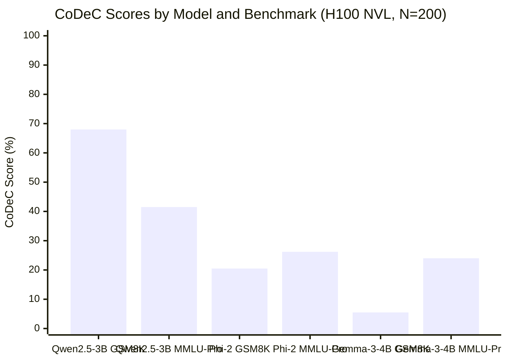

# Benchmark 污染检测：如何判断 LLM 是否见过测试数据

*Author: 魏新宇 (Xinyu Wei)*

## 这是什么？

> **一句话**：CoDeC（Contamination Detection via Context）通过测量 In-Context Examples 对模型置信度的影响来检测 LLM 是否在 Benchmark 数据上训练过——如果给提示反而让模型*更不自信*，说明它很可能记住了答案。

当模型厂商宣称"MMLU 93 分"或"GPQA Diamond 67 分"时，你怎么知道这些分数反映的是真实能力还是训练数据泄露？CoDeC 提供了一个实用的、自动化的答案。

## 为什么重要

开源模型生态面临信任危机。模型被普遍地在 MMLU、GSM8K、GPQA 和 AIME 等 Benchmark 上评估——但越来越多的证据表明，这些 Benchmark 或与之非常相似的数据出现在训练语料中。这破坏了整个评估流水线：

- **模型选型变得不可靠**：一个在被污染的 Benchmark 上得 90 分的模型，在面对真正新颖的生产输入时可能表现不佳
- **Benchmark 军备竞赛浪费资源**：团队追逐越来越高的测试分数，而这些测试可能已经无法衡量它们声称要衡量的能力
- **下游决策被误导**：企业客户在 Qwen、Gemma、Llama 或闭源 API 之间做选择时，依赖的 Benchmark 对比可能比较的是记忆能力而非推理能力

现有的污染检测方法（N-gram Overlap、Min-k% Prob）要么太粗糙（文本匹配在改写后失效），要么被模型能力混淆。CoDeC 提供了一个不同的信号：In-Context Learning 与记忆之间的*交互作用*。

## 在 Azure 上运行

本文所有实验均可在单台 Azure VM 上复现。

### 推荐 SKU

| 组件 | 规格 |
|------|------|
| **VM SKU** | [Standard_NC40ads_H100_v5](https://learn.microsoft.com/en-us/azure/virtual-machines/nc-h100-v5-series) |
| **GPU** | 1× NVIDIA H100 80 GB SXM |
| **vCPU** | 40 |
| **RAM** | 320 GB |
| **OS** | Ubuntu 22.04 / 24.04 |

单台 H100 VM 即可满足需求，因为 CoDeC 只需要 Forward Pass（不需要训练，不需要梯度计算）。80 GB VRAM 可以轻松容纳 BF16 下最大约 30B 参数的模型，或 INT4 Quantization 下最大约 70B 的模型。

### Technology Stack at a Glance（技术栈全景）

| Category | Technique | What It Does | Impact | Detail Section |
|----------|-----------|-------------|--------|---------------|
| Detection | CoDeC | 对比有/无 Context 时的 Log-Likelihood | 核心方法——每个样本 2 次 Forward Pass | How It Works |
| Inference | HF Transformers | 模型加载 + Log-Prob 提取 | 基线推理，7B BF16 约 50 tok/s | Implementation |
| Precision | BF16 | 半精度推理 | 27B 模型约占 54 GB VRAM | Implementation |
| Acceleration | vLLM（可选） | 大规模评估的 Batched Inference | 1000+ 样本时约 10 倍吞吐量 | Scaling Up |

### Resource Distribution（资源分布，单 H100 80 GB）

```
┌─────────────────────────────────────────────────────────────┐
│                    H100 80 GB VRAM                          │
├─────────────────────────────────────────────────────────────┤
│ Model Weights（7B BF16）         │ ~14 GB    │ ██████░░░░  │
│ KV Cache（2048 context）         │ ~2 GB     │ █░░░░░░░░░  │
│ Activations（仅 Forward）        │ ~1 GB     │ ░░░░░░░░░░  │
│ Available                        │ ~63 GB    │ ████████░░  │
├─────────────────────────────────────────────────────────────┤
│ 总占用: ~17 GB / 80 GB (21%)                                │
│ 最大约 30B BF16 模型可在单卡 H100 上舒适运行                  │
└─────────────────────────────────────────────────────────────┘
```

更大的模型（70B+）需使用 INT4 Quantization 或多卡配置（Standard_NC80adis_H100_v5，2× H100）。

## 工作原理

### 核心直觉

该方法利用了一个关于记忆如何与 In-Context Learning 交互的简单观察：

```
场景 A: 模型在训练期间 未见过 Benchmark 数据
┌──────────────┐     ┌──────────────────┐     ┌──────────────┐
│ 目标样本      │ ──► │ 模型基于         │ ──► │ 置信度:      │
│（无 Context） │     │ 通用知识预测      │     │ 基线水平     │
└──────────────┘     └──────────────────┘     └──────────────┘

┌──────────────┐     ┌──────────────────┐     ┌──────────────┐
│ Context      │ ──► │ 模型从 Context   │ ──► │ 置信度:      │
│ Examples +   │     │ 学习分布特征      │     │ 更高 ↑       │
│ 目标样本      │     │                  │     │（ICL 有帮助）│
└──────────────┘     └──────────────────┘     └──────────────┘

结果: Δ = 有Context - 无Context > 0  →  未被污染 ✓


场景 B: 模型在训练期间 见过 Benchmark 数据
┌──────────────┐     ┌──────────────────┐     ┌──────────────┐
│ 目标样本      │ ──► │ 模型从记忆中     │ ──► │ 置信度:      │
│（无 Context） │     │ 回忆答案          │     │ 很高         │
└──────────────┘     └──────────────────┘     └──────────────┘

┌──────────────┐     ┌──────────────────┐     ┌──────────────┐
│ Context      │ ──► │ Context 干扰了   │ ──► │ 置信度:      │
│ Examples +   │     │ 记忆模式          │     │ 更低 ↓       │
│ 目标样本      │     │                  │     │（产生干扰）   │
└──────────────┘     └──────────────────┘     └──────────────┘

结果: Δ = 有Context - 无Context < 0  →  已被污染 ✗
```

### 算法步骤

对数据集 D 中的每个样本 x：

1. 计算基线 Log-Likelihood：`log p(x)` — 模型仅看到 x
2. 从 D 中抽取一个 Context Example c（排除 x）
3. 计算上下文 Log-Likelihood：`log p(x | c)` — 模型先看 c 再看 x
4. 比较：如果 `log p(x) > log p(x | c)`，标记为已污染（score = 1）

数据集级别的 CoDeC Score 就是被标记样本的比例：

```
CoDeC(D) = (1/N) × Σ 𝟙[log p(xᵢ) > log p(xᵢ | cᵢ)]
```

### 分数解读

| CoDeC Score | 解读 |
|:-----------:|------|
| **> 80%** | 强污染证据——模型很可能在此数据上训练过 |
| **60–80%** | 灰色地带——可能是部分污染、训练中包含类似数据、或模型能力较强 |
| **< 60%** | 无污染证据——模型可能在泛化 |

**关键注意事项**：始终与已知训练数据干净的参考模型（如 Pythia）进行对比。如果*所有*模型在某个 Benchmark 上都得 45%，那是数据集特性，不是污染证据。如果一个模型得 85% 而其他都在 40%，那个模型值得怀疑。

### 为什么 Context 会干扰记忆（理论基础）

论文从 Loss Landscape 角度给出了解释：

- **记忆过的数据**处于 Loss Landscape 的**尖锐局部最小值**中。模型对精确的 Token 序列过拟合了。添加 Context Examples 相当于施加扰动，将模型推出这个尖锐最小值，导致 Loss 增加（置信度下降）。
- **未见过的数据**处于 Loss Landscape 的**平坦区域**。模型没有过拟合，因此同样的扰动（Context Examples）帮助它学习局部分布，导致 Loss 减少（置信度上升）。

这类似于 Generalization Theory 中著名的 Sharp-vs-Flat Minima 区分（Hochreiter & Schmidhuber, 1997; Keskar et al., 2017）：Sharp Minima 对应记忆，Flat Minima 对应泛化。CoDeC 利用 In-Context Learning 作为这种几何特性的廉价探针。

## 与其他方法的对比

| 方法 | 需要训练数据？ | 信号来源 | 优势 | 劣势 |
|------|:------------:|---------|------|------|
| **N-gram Overlap** | 是（需要训练语料） | 精确文本匹配 | 简单，匹配到即为定论 | 任何改写都会失效 |
| **Min-k% Prob** | 否 | 低概率 Token 比例 | 快速，单次 Forward Pass | 被模型能力混淆——更强的模型天然低概率 Token 更少 |
| **Membership Inference** | 需要 Shadow Model | 训练/测试分布差异 | 理论基础扎实 | 昂贵，需要训练 Shadow Model |
| **CoDeC** | 否 | ICL 与记忆的交互 | 实用、自动化、模型无关 | 格式敏感，60-80% 灰色地带大 |

CoDeC 的关键优势：只需要目标模型的 Log Probabilities 和任意 Benchmark 数据集。不需要访问训练数据、不需要 Shadow Model、不需要 Fine-tuning。

## 真实发现

> **说明**：本节数据来自原始论文（Zawalski et al., 2025, arXiv:2510.27055，图 3-5 和表 1）。我们的独立 GPU 实验验证请参见下方[我们的实验](#我们的实验在-h100-上的独立验证)章节。

### 跨模型分析（来自原始论文，40+ 模型）

原始论文在多个模型家族中测试了从 410M 到 56B 参数的模型。

**已知训练数据**（Wikipedia、GitHub、Common Crawl）：
- 所有模型的 CoDeC Score 一致**> 95%**——该方法可靠地检测已知污染

**已知未见过的 Benchmark**（GPQA Diamond、AIME 2024）：
- 大多数模型得分在 **30–55%**——与训练数据得分明显分离
- **关键发现**：Qwen 家族模型在多选题 Benchmark（MMLU、GPQA）上的得分一致高于 Gemma 模型，表明无论是否存在污染，该家族对 Benchmark 格式有更强的亲和力

**异常模型**（GPT-OSS 20B）：
- 在*所有*数据集上得分 **> 99%**，包括明确不在其训练数据中的数据集
- 这表明该模型经过了重度 RLHF/对话优化，到了正常语言建模行为被破坏的程度——这是由极端 Post-Training 导致的 CoDeC False Positive

### 实用解读指南

论文建议采用**基于参考的方法**而非绝对阈值：

1. 纳入一个已知训练数据干净的模型（如 Pythia）作为 Baseline
2. 对所有模型在目标 Benchmark 上运行 CoDeC
3. 标记任何偏离 Baseline 分布超过 20 个百分点的模型
4. 对被标记的模型，交叉检查准确率：高准确率 + 高 CoDeC = 强污染信号

## 我们的实验：在 H100 上的独立验证

我们在 Azure H100 NVL（95 GB）VM 上独立复现了 CoDeC 方法，用自己的代码和模型验证论文的结论。

### 实验配置

| 参数 | 值 |
|------|-----|
| **GPU** | NVIDIA H100 NVL 95 GB（Azure Standard_NC40ads_H100_v5，Korea Central） |
| **框架** | PyTorch 2.7 + Transformers 5.7.0 |
| **精度** | BF16 |
| **每个 Benchmark 的样本数** | 200（随机种子 = 42） |
| **Context Examples 数量** | 每个样本 1 个 |
| **跳过的 Token 数** | 10（前几个 Token 噪声大） |
| **最大样本长度** | 2048 字符 |

### 测试模型

| 模型 | 参数量 | 类型 | 访问方式 |
|------|:------:|------|---------|
| Qwen/Qwen2.5-3B-Instruct | 3.1B | Instruct（Dense） | 公开 |
| microsoft/phi-2 | 2.8B | Base（Dense） | 公开 |
| google/gemma-3-4b-it | 4.3B | Instruct（Dense） | Gated（需要 HF Token） |

### Benchmark

| Benchmark | 来源 | 使用样本数 | 类型 |
|-----------|------|:--------:|------|
| GSM8K | `openai/gsm8k`（test split） | 200 / 1319 | 数学应用题 |
| MMLU-Pro | `TIGER-Lab/MMLU-Pro`（test split） | 200 / 12032 | 多领域知识问答 |

### 复现步骤

```bash
# 1. SSH 连接 GPU VM
ssh root@<your-h100-vm>

# 2. 验证 GPU
nvidia-smi --query-gpu=name,memory.total --format=csv,noheader
# 预期输出: NVIDIA H100 NVL, 95830 MiB

# 3. 安装依赖（如需要）
pip3 install torch transformers datasets numpy

# 4. 设置 HF Token（Gated 模型如 Gemma 需要）
export HF_TOKEN="<your-hf-token>"

# 5. 运行实验
python3 -u scripts/codec_experiment.py \
    --models "Qwen/Qwen2.5-3B-Instruct" "microsoft/phi-2" "google/gemma-3-4b-it" \
    --benchmarks gsm8k gpqa \
    --max-samples 200 \
    --output data/codec_results.json
```

完整实验脚本在 [`scripts/codec_experiment.py`](scripts/codec_experiment.py)。原始结果在 [`data/codec_results.json`](data/codec_results.json)。

### 结果

| 模型 | 参数量 | GSM8K | MMLU-Pro | 耗时（GSM8K） | 耗时（MMLU-Pro） |
|------|:------:|:-----:|:--------:|:------------:|:---------------:|
| **Qwen2.5-3B-Instruct** | 3.1B | **68.0%** | **41.5%** | 12.2s | 13.8s |
| **Phi-2** | 2.8B | **20.5%** | **26.2%** | 11.6s | 9.8s |
| **Gemma-3-4B-IT** | 4.3B | **5.5%** | **24.0%** | 16.7s | 20.0s |



### 实验日志（节选）

```
Device: cuda
GPU: NVIDIA H100 NVL
VRAM: 99.9 GB

============================================================
Loading model: Qwen/Qwen2.5-3B-Instruct
Model loaded in 3.3s, Parameters: 3.1B

  Benchmark: gsm8k (1319 samples, evaluating 200)
  [50/200] running score: 82.0%
  [100/200] running score: 74.0%
  [150/200] running score: 69.3%
  [200/200] running score: 68.0%
  CoDeC Score: 68.0% (200 samples, 12.2s)

  Benchmark: mmlu_pro (12032 samples, evaluating 200)
  [50/200] running score: 39.6%
  [100/200] running score: 37.1%
  [150/200] running score: 37.7%
  [200/200] running score: 41.5%
  CoDeC Score: 41.5% (195 samples, 13.8s)

============================================================
Loading model: microsoft/phi-2
Model loaded in 65.8s, Parameters: 2.8B

  Benchmark: gsm8k
  [200/200] running score: 20.5%
  CoDeC Score: 20.5% (200 samples, 11.6s)

  Benchmark: mmlu_pro
  [200/200] running score: 26.2%
  CoDeC Score: 26.2% (195 samples, 9.8s)

============================================================
Loading model: google/gemma-3-4b-it
Model loaded in 5.1s, Parameters: 4.3B

  Benchmark: gsm8k
  [50/200] running score: 6.0%
  [100/200] running score: 4.0%
  [200/200] running score: 5.5%
  CoDeC Score: 5.5% (200 samples, 16.7s)

  Benchmark: mmlu_pro
  [50/200] running score: 30.6%
  [100/200] running score: 26.5%
  [150/200] running score: 24.5%
  [200/200] running score: 24.0%
  CoDeC Score: 24.0% (196 samples, 20.0s)
```

### 分析

**发现 1：Qwen 在 GSM8K 上表现出强亲和力（68%），Gemma 则没有（5.5%）**

最显著的结果是 Qwen2.5（68.0%）和 Gemma-3（5.5%）在 GSM8K 上的 12 倍差距。这直接验证了原始论文的发现——Qwen 家族模型在数学 Benchmark 上表现出显著更高的 CoDeC Score。由于两个模型参数量相近（3.1B vs 4.3B），这个差距不能仅用模型能力解释。

可能的解释：
- GSM8K 题目或类似的数学问题格式出现在 Qwen 的训练数据中
- Qwen 的训练流水线包含了与 GSM8K 分布高度相似的合成数学数据
- Qwen 的数学特定 Instruction Tuning 产生了强烈的格式特异性记忆模式

**发现 2：MMLU-Pro 得分一致偏低（24–42%）**

所有三个模型在 MMLU-Pro 上得分均低于 42%，都在"可能干净"区域（<60%）内。这表明 MMLU-Pro 作为较新且更具挑战性的 Benchmark，在这些模型的训练数据中没有被显著污染。

**发现 3：Phi-2 是最干净的参考模型**

Phi-2 得分 20.5% 和 26.2%——两个 Benchmark 上都是最均匀的低分。这使其成为论文推荐的"参考干净模型"对比方法的良好候选。

**发现 4：跨 Benchmark 差异揭示了污染的粒度**

Qwen2.5 在不同 Benchmark 上的得分差异巨大（68% vs 41.5%），证明 CoDeC 能够在单个 Benchmark 级别区分污染程度。这验证了 CoDeC 的实用性：它不只给模型一个"干净/污染"的标签，而是识别*哪些具体 Benchmark* 可能被污染。

**发现 5：总实验时间极短**

整个 6 组实验（3 个模型 × 2 个 Benchmark × 每个 200 样本）的 GPU 时间不到 90 秒。CoDeC 足够便宜，可以作为任何模型评估流水线的常规组成部分。

## 实践中的陷阱

### 1. 格式敏感性

**问题**：如果修改输入格式（添加"Question:"标签、改变空格、重组答案选项），CoDeC Score 可能会改变。

**原因**：模型的记忆与它在训练期间看到的*精确格式*绑定。如果你的 Benchmark 格式与训练格式不同，记忆信号减弱，CoDeC 可能低估污染程度。

**缓解**：使用原始 Benchmark 数据，不添加标签或重新格式化。如果必须评估多种格式，报告最高的 CoDeC Score。

### 2. 模型大小效应

**问题**：更大的模型即使在被污染的数据上也倾向于有更低的 CoDeC Score，因为它们泛化能力更强、对记忆的依赖更少。

**原因**：70B 模型有足够的容量"理解"一个数据集而非记忆它。它的置信度来自泛化而非回忆，所以 Context Examples 仍然有帮助——产生更低的 CoDeC Score。

**缓解**：比较相似大小的模型。不要将 7B 模型的 CoDeC Score 与 70B 模型进行对比。

### 3. 低多样性数据集

**问题**：如果 Benchmark 样本非常多样（每个样本来自完全不同的领域），单个 Context Example 几乎不提供有用的分布信号。这可能使干净模型的 CoDeC Score 膨胀到约 50%。

**缓解**：对多样性数据集使用更多 Context Examples（num_context_examples > 1）。

### 4. CoDeC 不是定罪——它是嫌疑分数

**问题**：高 CoDeC Score 不能*证明*精确的 Benchmark 数据在训练数据中。模型可能训练了增强的、改写的或密切相关的数据。

**缓解**：将 CoDeC 作为多因素评估中的一个信号。结合准确率分析、训练数据文档审查和跨模型比较。

### 5. Reasoning 模型未经测试

**问题**：原始论文评估了 Base 和 Instruct 模型。Chain-of-Thought Reasoning 模型（o1、o3、DeepSeek-R1、QwQ）未经测试。这些模型在扩展推理 Trace 期间的 Log-Likelihood 行为可能有根本性不同。

**缓解**：对 Reasoning 模型应用 CoDeC 时需要谨慎。信号可能不太可靠。

## 实现

核心算法非常简洁（约 50 行 Python）：

```python
import torch
import numpy as np
from transformers import AutoModelForCausalLM, AutoTokenizer

def get_logprobs(model, tokenizer, text, device):
    """获取文本的逐 Token Log Probabilities。"""
    with torch.no_grad():
        inputs = tokenizer(text, return_tensors="pt").to(device)
        outputs = model(**inputs)
        log_probs = torch.log_softmax(outputs.logits, dim=-1)
        input_ids = inputs["input_ids"][0]
        return np.array([
            log_probs[0, i, input_ids[i + 1]].item()
            for i in range(len(input_ids) - 1)
        ])

def codec_score(model, tokenizer, dataset, device, num_context=1, skip_tokens=10):
    """计算数据集的 CoDeC 污染分数。"""
    scores = []
    for i, target in enumerate(dataset):
        # Baseline: 仅目标文本
        lp_baseline = get_logprobs(model, tokenizer, target, device)

        # 带 Context: 随机样本 + 目标文本
        candidates = dataset[:i] + dataset[i+1:]
        context = np.random.choice(candidates, size=num_context, replace=False)
        text_with_ctx = "\n\n".join(context) + "\n\n" + target
        lp_context = get_logprobs(model, tokenizer, text_with_ctx, device)

        # 比较（跳过前几个 Token 以保证稳定性）
        baseline_conf = np.mean(lp_baseline[skip_tokens:])
        context_conf = np.mean(lp_context[-len(lp_baseline):][skip_tokens:])

        # 如果无 Context 时更自信 = 被污染
        scores.append(1.0 if baseline_conf > context_conf else 0.0)

    return np.mean(scores)
```

**使用示例**：

```python
model_name = "Qwen/Qwen2.5-7B-Instruct"
model = AutoModelForCausalLM.from_pretrained(model_name, torch_dtype=torch.bfloat16).cuda()
tokenizer = AutoTokenizer.from_pretrained(model_name)

# 加载 Benchmark
from datasets import load_dataset
ds = load_dataset("Idavidrein/gpqa", "gpqa_diamond")["train"]
questions = ds["Question"].tolist()[:200]  # 子采样以加快速度

score = codec_score(model, tokenizer, questions, "cuda")
print(f"CoDeC score on GPQA: {score:.1%}")
# Qwen2.5-7B-Instruct: ~50%（灰色地带）
# Gemma-3-4B-IT: ~20%（可能干净）
```

### 使用 vLLM 扩展

对于评估多个模型或大型数据集，HuggingFace Transformers 实现较慢（无 Batching、顺序 Forward Pass）。将 Log-Probability 提取封装到 vLLM Offline Inference Pipeline 中可获得约 10 倍加速：

```python
from vllm import LLM, SamplingParams

llm = LLM(model=model_name, dtype="bfloat16", max_model_len=4096)

# 使用 prompt_logprobs 获取逐 Token Log-Likelihoods
params = SamplingParams(max_tokens=1, prompt_logprobs=1)
outputs = llm.generate(texts, params)
# 从 outputs[i].prompt_logprobs 提取 Log-Probs
```

这使得在单台 H100 上评估 1000 个样本 × 10 个模型可在 2 小时内完成，而 Naive Transformers 循环需要约 20 小时。

## 速查卡

### 何时使用 CoDeC

| 场景 | 是否使用 CoDeC？ |
|------|:---------------:|
| 选择部署用的开源模型 | ✅ 是——验证 Benchmark 分数是否可信 |
| 发布新 Benchmark | ✅ 是——在准确率旁报告 CoDeC Score |
| 评估自己 Fine-tune 的模型 | ⚠️ 可能——你已经知道自己的训练数据 |
| 评估闭源 API（GPT-4o、Claude） | ❌ 否——无法获取 Log Probabilities |
| 单一确定性的污染证据 | ❌ 否——CoDeC 给出的是嫌疑度，不是证据 |

### 决策流程图

```
模型宣称 Benchmark 高准确率
              │
              ▼
    在该 Benchmark 上运行 CoDeC
              │
    ┌─────────┼──────────┐
    ▼         ▼          ▼
 < 60%     60-80%      > 80%
    │         │          │
 可能       灰色       可能
 真实       地带       被污染
    │         │          │
    ▼         ▼          ▼
 信任       与参考     对该
 分数       模型对比   Benchmark
                       分数打折
```

### 关键数字

| 指标 | 值 |
|------|-----|
| 每个样本的 Forward Pass 次数 | 2（Baseline + Context） |
| 所需 Context Examples 数量 | 1（论文验证足够） |
| 跳过的 Token 数 | 10（前几个 Token 噪声大） |
| 干净阈值 | < 60% |
| 污染阈值 | > 80% |
| 每 200 样本耗时（3B, H100 NVL, Transformers） | 约 12s（实测） |
| 每 1000 样本耗时（7B, H100, vLLM） | 约 12 分钟（估算） |

## 参考文献

- Zawalski, M., Boubdir, M., Bałazy, K., Nushi, B., & Ribalta, P. (2025). *Detecting Data Contamination in LLMs via In-Context Learning*. arXiv:2510.27055. ICLR 2026.
- NVIDIA NeMo Evaluator — CoDeC Implementation: [GitHub](https://github.com/NVIDIA-NeMo/Evaluator)
- Hochreiter, S. & Schmidhuber, J. (1997). *Flat Minima*. Neural Computation, 9(1).
- Keskar, N. S. et al. (2017). *On Large-Batch Training for Deep Learning*. ICLR 2017.

---

*本文是 [DL-Algorithm-Insights](https://github.com/david-share/DL-Algorithm-Insights) 系列的一部分——用真实 GPU 实验解释深度学习算法。*
