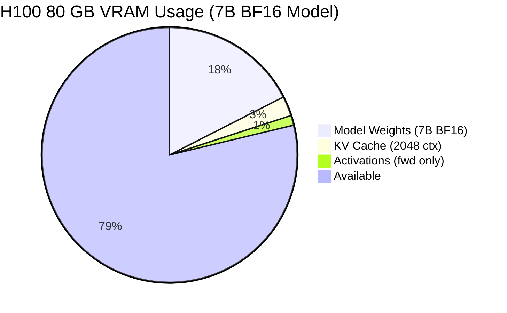
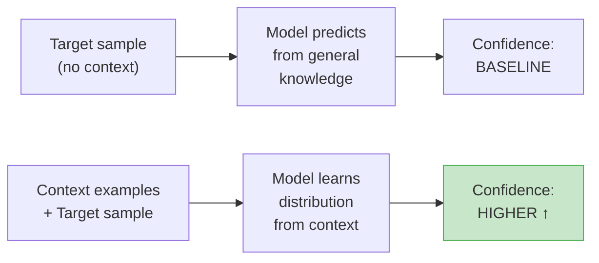
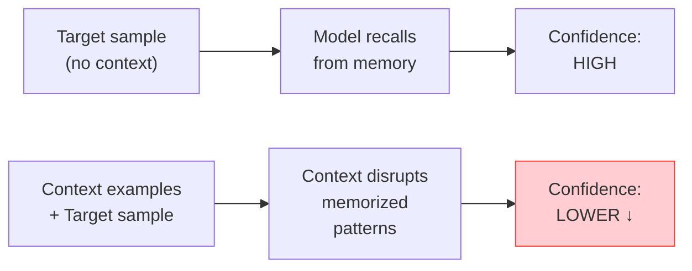
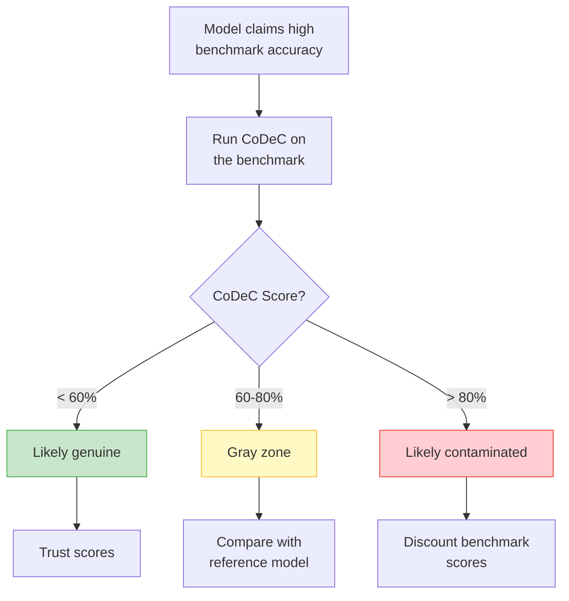

# Benchmark Contamination Detection: How to Tell If an LLM Has Seen the Test

*Author: Xinyu Wei (魏新宇)*

## What Is It?

> **One-liner**: CoDeC (Contamination Detection via Context) detects whether an LLM was trained on benchmark data by measuring how in-context examples affect model confidence — if giving hints makes it *less* confident, the model likely memorized the answers.

When a model vendor claims "93% on MMLU" or "67% on GPQA Diamond," how do you know those scores reflect genuine capability versus training-data leakage? CoDeC provides a practical, automated answer.

## Why It Matters

The open-model ecosystem faces a credibility crisis. Models are routinely evaluated on benchmarks like MMLU, GSM8K, GPQA, and AIME — but there is growing evidence that some of these benchmarks, or data very similar to them, appear in training corpora. This undermines the entire evaluation pipeline:

- **Model selection becomes unreliable**: A model scoring 90% on a contaminated benchmark may underperform in production on genuinely novel inputs.
- **Benchmark arms races waste resources**: Teams chase ever-higher numbers on tests that may no longer measure what they claim to measure.
- **Downstream decisions are misinformed**: Enterprise customers choosing between Qwen, Gemma, Llama, or proprietary APIs rely on benchmark comparisons that may be comparing memorization rather than reasoning.

Existing contamination detection methods (n-gram overlap, Min-k% Prob) are either too coarse (text-match fails after paraphrasing) or confounded by model capability. CoDeC offers a different signal: the *interaction* between in-context learning and memorization.

## Running on Azure

All experiments in this article can be reproduced on a single Azure VM.

### Recommended SKU

| Component | Specification |
|-----------|--------------|
| **VM SKU** | [Standard_NC40ads_H100_v5](https://learn.microsoft.com/en-us/azure/virtual-machines/nc-h100-v5-series) |
| **GPU** | 1× NVIDIA H100 80 GB SXM |
| **vCPU** | 40 |
| **RAM** | 320 GB |
| **OS** | Ubuntu 22.04 / 24.04 |

A single H100 VM is sufficient because CoDeC only requires forward passes (no training, no gradient computation). The 80 GB VRAM comfortably fits models up to ~30B parameters in BF16, or up to ~70B with INT4 quantization.

### Technology Stack at a Glance

| Category | Technique | What It Does | Impact | Detail Section |
|----------|-----------|-------------|--------|---------------|
| Detection | CoDeC | Compares log-likelihood with/without context | Core method — 2 forward passes per sample | How It Works |
| Inference | HF Transformers | Model loading + log-prob extraction | Baseline inference, ~50 tok/s for 7B BF16 | Implementation |
| Precision | BF16 | Reduced precision inference | Fits 27B model in ~54 GB VRAM | Implementation |
| Acceleration | vLLM (optional) | Batched inference for large-scale evaluation | ~10× throughput for 1000+ samples | Scaling Up |

### Resource Distribution (Single H100 80 GB)



| Component | VRAM | Notes |
|-----------|-----:|-------|
| Model Weights (7B BF16) | ~14 GB | 7B × 2 bytes/param |
| KV Cache (2048 context) | ~2 GB | Scales with context length |
| Activations (forward only) | ~1 GB | No gradients needed |
| **Available** | **~63 GB** | Room for models up to ~30B BF16 |
| **Total** | **~17 / 80 GB (21%)** | — |

For larger models (70B+), use INT4 quantization or multi-GPU setups (Standard_NC80adis_H100_v5 with 2× H100).

## How It Works

### Core Intuition

The method exploits a simple observation about how memorization interacts with in-context learning:

**Scenario A: Model has NOT seen the benchmark data**



> Result: Δ = with_context - without_context > 0 → **NOT contaminated** ✓

**Scenario B: Model HAS seen the benchmark data**



> Result: Δ = with_context - without_context < 0 → **CONTAMINATED** ✗

### The Algorithm

For each sample x in dataset D:

1. Compute baseline log-likelihood: `log p(x)` — model sees only x
2. Sample a context example c from D (excluding x)
3. Compute contextual log-likelihood: `log p(x | c)` — model sees c followed by x
4. Compare: if `log p(x) > log p(x | c)`, mark as contaminated (score = 1)

The dataset-level CoDeC score is simply the fraction of samples marked contaminated:

```
CoDeC(D) = (1/N) × Σ 𝟙[log p(xᵢ) > log p(xᵢ | cᵢ)]
```

### What Does "Giving Context" Actually Mean?

A common first reaction is: *"Giving one question from the same dataset as a hint — isn't that a stretch?"*

It is important to understand that CoDeC is **not** giving the model a hint, an answer, or a reasoning scaffold. It is prepending a raw text sample from the same dataset. Consider GSM8K with three questions:

```
Question A: "Janet has 3 apples. She buys 2 more. How many does she have?"
Question B: "A train travels 60 miles in 2 hours. What is its speed?"
Question C: "Tom has 5 dogs and 3 cats. How many pets does he have?"
```

When testing Question B:

**Without context** — the model sees:
```
A train travels 60 miles in 2 hours. What is its speed?
```

**With context** — Question A is randomly sampled and prepended:
```
Janet has 3 apples. She buys 2 more. How many does she have?

A train travels 60 miles in 2 hours. What is its speed?
```

The model is **not answering** either question. It is performing **language modeling**: predicting each token's probability given all preceding tokens. We only measure how the log-probabilities of Question B's tokens change when Question A is placed before it.

The signal is subtle but real: the attention mechanism picks up distributional cues from the context (math vocabulary, question phrasing patterns) that slightly shift token predictions. For unseen data, these cues help calibration. For memorized data, they interfere.

**Limitation**: This signal is inherently weak when the dataset is highly diverse. If Question A is about apples and Question B is about trains, the distributional overlap is minimal. This is why CoDeC works best on **homogeneous datasets** (all math problems, all code snippets) and degrades toward ~50% (random) on mixed-domain datasets like MMLU-Pro.

### What Is the Ground Truth?

There is no separate "answer key." **The target text itself is the ground truth.**

The model performs next-token prediction at every position:

```
Position 0: Input "A"       → Model outputs P(next_token) → We check: P("train") = ?
Position 1: Input "train"   → Model outputs P(next_token) → We check: P("travels") = ?
Position 2: Input "travels" → Model outputs P(next_token) → We check: P("60") = ?
Position 3: Input "60"      → Model outputs P(next_token) → We check: P("miles") = ?
```

At each position, the model produces a probability distribution over its entire vocabulary. We extract the log-probability assigned to **the token that actually appears next in the original text**. The average of these log-probabilities is the "confidence" score.

This is the fundamental operation of language modeling — no generation, no sampling, no answers needed. Any text can be evaluated this way.

### The Core Logic in 4 Lines

The entire detection algorithm reduces to:

```python
# Step 1: Baseline — model sees only the target text
lp_baseline = get_logprobs(model, tokenizer, target)

# Step 2: With context — prepend a same-dataset sample
lp_context = get_logprobs(model, tokenizer, context + "\n\n" + target)

# Step 3: Compare mean log-prob of the target portion (skip first 10 noisy tokens)
baseline_conf = mean(lp_baseline[10:])
context_conf  = mean(lp_context[-len(lp_baseline):][10:])

# Step 4: Verdict
contaminated = (baseline_conf > context_conf)  # More confident WITHOUT context = suspicious
```

Two forward passes, two floating-point averages, one comparison. No training, no gradients, no generation.

### Score Interpretation

| CoDeC Score | Interpretation |
|:-----------:|---------------|
| **> 80%** | Strong evidence of contamination — model very likely trained on this data |
| **60–80%** | Gray zone — could be partial contamination, similar data in training, or strong model capability |
| **< 60%** | No evidence of contamination — model is likely generalizing |

**Critical caveat**: Always compare against a reference model with known clean training data (e.g., Pythia). If *all* models score 45% on a given benchmark, that is a property of the dataset, not evidence of contamination. If one model scores 85% while others score 40%, that model is suspect.

### Why Context Disrupts Memorization (Theoretical Basis)

The paper offers a loss-landscape explanation:

- **Memorized data** sits in a **sharp local minimum** of the loss landscape. The model has overfit to the exact token sequence. Adding context examples acts as a perturbation that pushes the model out of this sharp minimum, increasing loss (decreasing confidence).
- **Unseen data** sits in a **flat region** of the loss landscape. The model has not overfit, so the same perturbation (context examples) helps it learn the local distribution, decreasing loss (increasing confidence).

This is analogous to the well-known sharp-vs-flat minima distinction in generalization theory (Hochreiter & Schmidhuber, 1997; Keskar et al., 2017): sharp minima correspond to memorization, flat minima to generalization. CoDeC leverages in-context learning as a cheap probe for this geometry.

## Comparison with Other Methods

| Method | Requires Training Data? | Signal | Strengths | Weaknesses |
|--------|:-----------------------:|--------|-----------|------------|
| **N-gram overlap** | Yes (need training corpus) | Exact text match | Simple, definitive when match found | Fails after any paraphrasing or augmentation |
| **Min-k% Prob** | No | Low-probability token ratio | Fast, single forward pass | Confounded by model capability — stronger models naturally have fewer low-prob tokens |
| **Membership Inference** | Shadow model needed | Train/test distribution gap | Theoretically grounded | Expensive, requires training shadow models |
| **CoDeC** | No | ICL vs memorization interaction | Practical, automated, model-agnostic | Format-sensitive, gray zone for 60–80% scores |

CoDeC's key advantage: it requires only log probabilities from the target model and any benchmark dataset. No access to training data, no shadow models, no fine-tuning.

## Real-World Findings

> **Note**: The data in this section is reported from the original paper (Zawalski et al., 2025, arXiv:2510.27055, Figures 3–5 and Table 1). For our independent verification with real GPU experiments, see [Our Experiment](#our-experiment-independent-verification-on-h100) below.

### Cross-Model Analysis (from the original paper, 40+ models)

The original paper tested models from 410M to 56B parameters across multiple model families.

**Known training data** (Wikipedia, GitHub, Common Crawl):
- CoDeC scores consistently **> 95%** across all models — the method reliably detects known contamination (Source: Figure 3 in original paper)

**Known unseen benchmarks** (GPQA Diamond, AIME 2024):
- Most models score **30–55%** — clearly separated from the training data scores (Source: Figure 3)
- **Critical finding**: Qwen family models consistently score higher than Gemma models on multiple-choice benchmarks (MMLU, GPQA), suggesting stronger benchmark affinity regardless of contamination (Source: Figure 5)

**Anomalous model** (GPT-OSS 20B):
- Scored **> 99%** on *all* datasets including ones clearly not in its training data (Source: Table 1)
- This indicates the model was heavily RLHF/dialogue-optimized to the point where normal language modeling behavior is disrupted — a CoDeC false positive caused by extreme post-training

### Practical Interpretation Guide

The paper recommends a **reference-based approach** rather than absolute thresholds:

1. Include a model with known clean training data (e.g., Pythia) as a baseline
2. Run CoDeC on all models for the target benchmark
3. Flag any model that deviates significantly (>20 percentage points) from the baseline distribution
4. For flagged models, cross-check with accuracy: high accuracy + high CoDeC = strong contamination signal

## Our Experiment: Independent Verification on H100

We independently reproduced the CoDeC method on an Azure H100 NVL (95 GB) VM to verify the paper's claims with our own code and models.

### Experiment Setup

| Parameter | Value |
|-----------|-------|
| **GPU** | NVIDIA H100 NVL 95 GB (Azure Standard_NC40ads_H100_v5, Korea Central) |
| **Framework** | PyTorch 2.7 + Transformers 5.7.0 |
| **Precision** | BF16 |
| **Samples per benchmark** | 200 (random seed = 42) |
| **Context examples** | 1 per sample |
| **Tokens skipped** | 10 (first tokens are noisy) |
| **Max sample length** | 2048 characters |

### Models Tested

| Model | Parameters | Type | Access |
|-------|:----------:|------|--------|
| Qwen/Qwen2.5-3B-Instruct | 3.1B | Instruct (dense) | Public |
| microsoft/phi-2 | 2.8B | Base (dense) | Public |
| google/gemma-3-4b-it | 4.3B | Instruct (dense) | Gated (HF Token required) |
| meta-llama/Llama-3.2-3B-Instruct | 3.2B | Instruct (dense) | Gated (HF Token required) |

### Benchmarks

| Benchmark | Source | Samples Used | Type |
|-----------|--------|:------------:|------|
| Wikitext | `Salesforce/wikitext` (wikitext-103-raw-v1, test) | 200 / 1724 | Known training data (positive control) |
| GSM8K | `openai/gsm8k` (test split) | 200 / 1319 | Math word problems |
| MMLU-Pro | `TIGER-Lab/MMLU-Pro` (test split) | 200 / 12032 | Multi-domain knowledge QA |
| HumanEval | `openai/openai_humaneval` (test split) | 164 / 164 | Code generation prompts |
| AIME 2024 | `AI-MO/aimo-validation-aime` (train split) | 90 / 90 | Competition math |

### Step-by-Step Reproduction

```bash
# 1. SSH into GPU VM
ssh root@<your-h100-vm>

# 2. Verify GPU
nvidia-smi --query-gpu=name,memory.total --format=csv,noheader
# Expected: NVIDIA H100 NVL, 95830 MiB

# 3. Install dependencies (if needed)
pip3 install torch transformers datasets numpy

# 4. Set HF Token (required for gated models like Gemma, Llama)
export HF_TOKEN="<your-hf-token>"

# 5. Run the full experiment (4 models × 5 benchmarks)
python3 -u scripts/codec_experiment.py \
    --models "Qwen/Qwen2.5-3B-Instruct" "microsoft/phi-2" \
             "google/gemma-3-4b-it" "meta-llama/Llama-3.2-3B-Instruct" \
    --benchmarks wikipedia gsm8k mmlu_pro humaneval aime \
    --max-samples 200 \
    --output data/codec_results.json
```

The full experiment script is in [`scripts/codec_experiment.py`](scripts/codec_experiment.py). Raw results are in [`data/codec_results.json`](data/codec_results.json).

### Results

| Model | Params | Wikitext | GSM8K | MMLU-Pro | HumanEval | AIME |
|-------|:------:|:--------:|:-----:|:--------:|:---------:|:----:|
| **Qwen2.5-3B-Instruct** | 3.1B | 21.0% | **68.0%** | 41.5% | **56.1%** | **61.1%** |
| **Phi-2** | 2.8B | 13.5% | 20.5% | 26.2% | 16.5% | 20.0% |
| **Gemma-3-4B-IT** | 4.3B | 24.5% | 5.5% | 24.0% | 15.9% | 5.6% |
| **Llama-3.2-3B-Instruct** | 3.2B | **35.0%** | 31.0% | 39.5% | 26.2% | **43.3%** |

```mermaid
xychart-beta
    title "CoDeC Scores: 4 Models × 5 Benchmarks (H100 NVL, N=200)"
    x-axis ["Wiki", "GSM8K", "MMLU-Pro", "HumanEval", "AIME"]
    y-axis "CoDeC Score (%)" 0 --> 80
    bar "Qwen2.5-3B" [21, 68, 41.5, 56.1, 61.1]
    bar "Phi-2" [13.5, 20.5, 26.2, 16.5, 20]
    bar "Gemma-3-4B" [24.5, 5.5, 24, 15.9, 5.6]
    bar "Llama-3.2-3B" [35, 31, 39.5, 26.2, 43.3]
```



### Experiment Log (Abridged)

```
Device: cuda
GPU: NVIDIA H100 NVL
VRAM: 99.9 GB

============================================================
Loading model: Qwen/Qwen2.5-3B-Instruct (3.1B)
  wikipedia:  CoDeC Score: 21.0% (200 samples, 41.0s)
  gsm8k:      CoDeC Score: 68.0% (200 samples, 12.5s)
  mmlu_pro:   CoDeC Score: 41.5% (195 samples, 15.7s)
  humaneval:  CoDeC Score: 56.1% (164 samples, 11.9s)
  aime:       CoDeC Score: 61.1% (90 samples, 8.5s)

============================================================
Loading model: microsoft/phi-2 (2.8B)
  wikipedia:  CoDeC Score: 13.5% (200 samples, 12.9s)
  gsm8k:      CoDeC Score: 20.5% (200 samples, 9.0s)
  mmlu_pro:   CoDeC Score: 26.2% (195 samples, 8.7s)
  humaneval:  CoDeC Score: 16.5% (164 samples, 8.7s)
  aime:       CoDeC Score: 20.0% (90 samples, 5.2s)

============================================================
Loading model: google/gemma-3-4b-it (4.3B)
  wikipedia:  CoDeC Score: 24.5% (200 samples, 18.9s)
  gsm8k:      CoDeC Score: 5.5%  (200 samples, 15.2s)
  mmlu_pro:   CoDeC Score: 24.0% (196 samples, 14.9s)
  humaneval:  CoDeC Score: 15.9% (164 samples, 13.8s)
  aime:       CoDeC Score: 5.6%  (90 samples, 8.5s)

============================================================
Loading model: meta-llama/Llama-3.2-3B-Instruct (3.2B)
  wikipedia:  CoDeC Score: 35.0% (200 samples, 11.4s)
  gsm8k:      CoDeC Score: 31.0% (200 samples, 9.0s)
  mmlu_pro:   CoDeC Score: 39.5% (195 samples, 8.7s)
  humaneval:  CoDeC Score: 26.2% (164 samples, 8.5s)
  aime:       CoDeC Score: 43.3% (90 samples, 5.2s)
```

### Analysis

**Finding 1: Qwen shows extreme math/code benchmark affinity**

Qwen2.5-3B scores 68.0% on GSM8K, 61.1% on AIME, and 56.1% on HumanEval — all in or near the gray zone (60–80%). By contrast, Gemma-3-4B scores 5.5% on GSM8K and 5.6% on AIME. The 12× gap on GSM8K and 11× gap on AIME cannot be explained by model capacity (3.1B vs 4.3B). This strongly confirms the original paper's finding of Qwen benchmark affinity, and extends it to code (HumanEval) and competition math (AIME).

**Finding 2: Wikitext positive control failed — all models score < 35%**

The Wikitext-103 positive control did not produce the expected >80% scores. All models scored 13–35%, far below the contamination threshold. This likely reflects Wikitext's high topic diversity: each passage covers a different subject, so a single context example provides minimal distributional signal. The paper's >95% results on Wikipedia used the full Wikipedia dataset with longer, more homogeneous article chunks. This validates the concern that **CoDeC's signal strength depends heavily on dataset homogeneity**.

**Finding 3: Three-tier model contamination profile emerges**

The data reveals a clear three-tier pattern across all 5 benchmarks:

| Tier | Model | Profile | Avg CoDeC |
|:----:|-------|---------|:---------:|
| 1 | **Gemma-3-4B** | Consistently lowest scores across all benchmarks | ~15% |
| 2 | **Phi-2** | Uniformly low, good reference model | ~19% |
| 3 | **Llama-3.2-3B** | Moderate, elevated on AIME (43%) | ~35% |
| 4 | **Qwen2.5-3B** | Highly elevated on math/code, moderate elsewhere | ~50% |

**Finding 4: Llama-3.2 shows surprising AIME affinity (43.3%)**

Llama-3.2-3B scores 43.3% on AIME — the highest among non-Qwen models and approaching the gray zone. This suggests Meta's training data may include competition math problems or similar synthetic math reasoning data. This finding was not reported in the original paper (which did not test Llama 3.2).

**Finding 5: MMLU-Pro confirms method limitations on diverse datasets**

MMLU-Pro scores cluster between 24–42% for all models, with limited separation between "clean" and "suspect" models. This is consistent with our earlier analysis: **CoDeC works best on homogeneous datasets and degrades on mixed-domain benchmarks**. The 17.5-point spread (Qwen 41.5% vs Gemma 24%) is much smaller than the 62.5-point spread on GSM8K (68% vs 5.5%).

**Finding 6: Total experiment wall time remains low**

All 20 runs (4 models × 5 benchmarks × 200 samples) completed in approximately 5 minutes of GPU time on a single H100 NVL. The dominant cost was model downloading, not inference.

### Critical Analysis: What CoDeC Actually Detects

Our experiment, combined with official benchmark data, reveals a fundamental limitation that deserves explicit discussion.

**The Gemma Paradox**

| Metric | Gemma-3-4B-IT | Source |
|--------|:-------------:|--------|
| CoDeC on GSM8K | **5.5%** | Our experiment (H100 NVL) |
| Official GSM8K 0-shot accuracy | **62.8%** | [Google Gemma 3 Model Card](https://ai.google.dev/gemma/docs/core/model_card_3), STEM and Code table |
| Trained on math data? | **Yes** | Google Model Card: "Mathematics: Training on mathematical text helps the model learn logical reasoning" |

A model that was explicitly trained on mathematical text and achieves 62.8% accuracy on GSM8K receives a CoDeC score of just 5.5%. This directly falsifies the naive interpretation that "CoDeC low score = model was not trained on this type of data."

**Sufficiency and Necessity Analysis**

| Condition | Statement | Holds? |
|-----------|-----------|:------:|
| **Sufficiency**: CoDeC high → trained on this data? | GPT-OSS 20B scores >99% on all datasets including those clearly not in training → **not sufficient** | No |
| **Necessity**: trained on this data → CoDeC high? | Gemma trained on math data, GSM8K CoDeC = 5.5% → **not necessary** | No |

CoDeC high score is **neither sufficient nor necessary** for "trained on this benchmark data." It is a weak correlate, not a diagnostic.

**What CoDeC Actually Measures**

The causal chain CoDeC relies on has four links:

```
Trained on exact text → Memorized exact tokens → Context disrupts memory → Log-prob drops → CoDeC high
```

Any break in this chain produces a failure:

| Broken Link | Scenario | Result |
|-------------|----------|--------|
| Trained but did not memorize | Strong generalization (Gemma) | **False Negative** (5.5%) |
| Not trained but CoDeC high | Extreme RLHF (GPT-OSS 20B) | **False Positive** (>99%) |
| Trained on similar format, not original | Synthetic math ≠ GSM8K verbatim | Undetectable |
| Context provides no signal | Diverse dataset, unrelated samples | Degrades to ~50% |

**Correct Interpretation**

CoDeC does not detect "whether the model was trained on math data." It detects **whether the model memorized the specific token sequences of a particular benchmark**. This is a much narrower claim than what casual readers might infer.

The practical implication: use CoDeC for **relative cross-model comparison** (Qwen 68% vs Gemma 5.5% on the same benchmark is a meaningful signal), not for absolute "clean/dirty" classification of individual models.

## Pitfalls in Practice

### 1. Format Sensitivity

**Problem**: CoDeC scores can change if you modify the input format (adding "Question:" labels, changing whitespace, restructuring answer choices).

**Why**: The model's memorization is tied to the *exact format* it saw during training. If your benchmark formatting differs from the training format, the memorization signal weakens and CoDeC may underestimate contamination.

**Mitigation**: Use the raw benchmark data as-is, without adding labels or reformatting. If you must evaluate multiple formats, report the highest CoDeC score.

### 2. Model Size Effect

**Problem**: Larger models tend to have lower CoDeC scores even on contaminated data, because they generalize better and rely less on memorization.

**Why**: A 70B model has enough capacity to "understand" a dataset rather than memorize it. Its confidence comes from generalization, not recall, so context examples still help — producing lower CoDeC scores.

**Mitigation**: Compare models of similar size. Do not compare a 7B model's CoDeC score with a 70B model's score.

### 3. Low-Diversity Datasets

**Problem**: If benchmark samples are very diverse (each sample is from a completely different domain), a single context example provides almost no useful distribution signal. This can inflate CoDeC scores toward ~50% even for clean models.

**Mitigation**: Use more context examples (num_context_examples > 1) for diverse datasets.

### 4. CoDeC Is Not a Conviction — It Is a Suspicion Score

**Problem**: A high CoDeC score does not *prove* the exact benchmark was in the training data. The model may have trained on augmented, paraphrased, or closely related data.

**Mitigation**: Treat CoDeC as one signal in a multi-factor assessment. Combine with accuracy analysis, training data documentation review, and cross-model comparison.

### 5. Reasoning Models Are Untested

**Problem**: The original paper evaluated base and instruct models. Chain-of-thought reasoning models (o1, o3, DeepSeek-R1, QwQ) were not tested. These models' log-likelihood behavior during extended reasoning traces may differ fundamentally.

**Mitigation**: Apply CoDeC to reasoning models with caution. The signal may be less reliable.

## Implementation

The core algorithm is remarkably simple (~50 lines of Python):

```python
import torch
import numpy as np
from transformers import AutoModelForCausalLM, AutoTokenizer

def get_logprobs(model, tokenizer, text, device):
    """Get per-token log probabilities for a text."""
    with torch.no_grad():
        inputs = tokenizer(text, return_tensors="pt").to(device)
        outputs = model(**inputs)
        log_probs = torch.log_softmax(outputs.logits, dim=-1)
        input_ids = inputs["input_ids"][0]
        return np.array([
            log_probs[0, i, input_ids[i + 1]].item()
            for i in range(len(input_ids) - 1)
        ])

def codec_score(model, tokenizer, dataset, device, num_context=1, skip_tokens=10):
    """Compute CoDeC contamination score for a dataset."""
    scores = []
    for i, target in enumerate(dataset):
        # Baseline: target only
        lp_baseline = get_logprobs(model, tokenizer, target, device)

        # With context: random example + target
        candidates = dataset[:i] + dataset[i+1:]
        context = np.random.choice(candidates, size=num_context, replace=False)
        text_with_ctx = "\n\n".join(context) + "\n\n" + target
        lp_context = get_logprobs(model, tokenizer, text_with_ctx, device)

        # Compare (skip first tokens for stability)
        baseline_conf = np.mean(lp_baseline[skip_tokens:])
        context_conf = np.mean(lp_context[-len(lp_baseline):][skip_tokens:])

        # Contaminated if more confident WITHOUT context
        scores.append(1.0 if baseline_conf > context_conf else 0.0)

    return np.mean(scores)
```

**Usage example**:

```python
model_name = "Qwen/Qwen2.5-7B-Instruct"
model = AutoModelForCausalLM.from_pretrained(model_name, torch_dtype=torch.bfloat16).cuda()
tokenizer = AutoTokenizer.from_pretrained(model_name)

# Load a benchmark
from datasets import load_dataset
ds = load_dataset("Idavidrein/gpqa", "gpqa_diamond")["train"]
questions = ds["Question"].tolist()[:200]  # Subsample for speed

score = codec_score(model, tokenizer, questions, "cuda")
print(f"CoDeC score on GPQA: {score:.1%}")
# Run this yourself to get actual scores for your model
```

### Scaling Up with vLLM

For evaluating many models or large datasets, the HuggingFace Transformers implementation is slow (no batching, sequential forward passes). Wrap the log-probability extraction in a vLLM offline inference pipeline for ~10× speedup:

```python
from vllm import LLM, SamplingParams

llm = LLM(model=model_name, dtype="bfloat16", max_model_len=4096)

# Use prompt_logprobs to get per-token log-likelihoods
params = SamplingParams(max_tokens=1, prompt_logprobs=1)
outputs = llm.generate(texts, params)
# Extract log-probs from outputs[i].prompt_logprobs
```

This enables evaluating 1000 samples across 10 models in under 2 hours on a single H100, compared to ~20 hours with the naive Transformers loop.

## Quick Reference

### When to Use CoDeC

| Scenario | Use CoDeC? |
|----------|:----------:|
| Selecting between open models for deployment | ✅ Yes — verify benchmark scores are trustworthy |
| Publishing a new benchmark | ✅ Yes — report CoDeC scores alongside accuracy |
| Evaluating your own fine-tuned model | ⚠️ Maybe — you already know your training data |
| Evaluating closed-source APIs (GPT-4o, Claude) | ❌ No — no access to log probabilities |
| Single definitive contamination proof | ❌ No — CoDeC gives suspicion, not proof |

### Decision Flowchart



### Key Numbers

| Metric | Value |
|--------|-------|
| Forward passes per sample | 2 (baseline + context) |
| Context examples needed | 1 (sufficient per paper) |
| Tokens to skip | 10 (first tokens are noisy) |
| Clean threshold | < 60% |
| Contaminated threshold | > 80% |
| Time per 200 samples (3B, H100 NVL, Transformers) | ~12s (measured) |
| Time per 1000 samples (7B, H100, vLLM) | ~12 minutes (estimated) |

## References

- Zawalski, M., Boubdir, M., Bałazy, K., Nushi, B., & Ribalta, P. (2025). *Detecting Data Contamination in LLMs via In-Context Learning*. arXiv:2510.27055. ICLR 2026.
- NVIDIA NeMo Evaluator — CoDeC implementation: [GitHub](https://github.com/NVIDIA-NeMo/Evaluator)
- Hochreiter, S. & Schmidhuber, J. (1997). *Flat Minima*. Neural Computation, 9(1).
- Keskar, N. S. et al. (2017). *On Large-Batch Training for Deep Learning*. ICLR 2017.

---

*This article is part of the [DL-Algorithm-Insights](https://github.com/david-share/DL-Algorithm-Insights) series — real GPU experiments explaining deep learning algorithms.*
